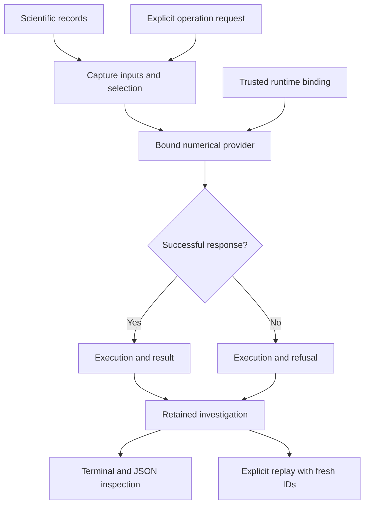

# Computational Instrumentation Workbench

Part of **Notation Systems' computational instrumentation and evidence infrastructure** for industrial and cyber-physical systems.

[Stack map](https://github.com/giasonpooni/Computational-Instrumentation-Workbench/blob/main/docs/STACK.md) · [Component role and interfaces](docs/STACK_ROLE.md)

**Notation Systems Workbench** — a terminal-first Python workbench for retained
scientific observations, explicit operations, and reproducible investigations.

The executable prototype includes a synthetic damped oscillator, numerical
statistics and periodogram analysis, a shared local session, saved-workspace
inspection and replay, and an optional Godot oscillator viewport. External
scientific operations use explicitly bound, source-pinned runtimes; the table
below identifies the integrations currently implemented.

## Workbench at a glance

This is the shared-investigation operation path after request admission.
Malformed requests are rejected before an execution exists. PLSR uses separate
terminal bundles, and the retained-telemetry script has its own container;
their guides below define those boundaries. The optional Godot view supports
the oscillator. See the [diagram atlas](docs/DIAGRAMS.md) for workflow,
covariance and identity diagrams across the stack.

## Run and inspect

Follow the [quickstart](docs/quickstart.md) for installation, terminal commands,
and the optional viewport. The [deployment guide](deploy/README.md) covers the
native service and container backend. Each integrated tool has its own exact
inputs, source pins, operating examples, validation and limitations.

Python retains and calculates from full-resolution scientific records. The
viewport displays backend-provided representations. Evidence, operation,
execution, result and verification identities remain distinct. Reopening a
workspace validates retained records without silently recomputing them;
explicit replay creates new execution/result identities.

The built-in examples are synthetic. Successful computation, content integrity
and matching replay digests do not establish physical validity or calibration
traceability. Domain-specific viewport support is limited to the oscillator;
external integrations expose terminal and JSON records as described below.

## Integrated tools

This catalogue lists tools that can currently be run through CIW. Each tool's
guide records installation, commands, input/output specifications, validation,
and limits. Integration status describes the workbench connection; it does not
establish physical validation or deployment readiness.

| Tool | Integration status | Available operations | Instructions and specifications |
| --- | --- | --- | --- |
| Synthetic damped oscillator (`analytic-damped-oscillator.v1`) | Integrated prototype; built into CIW | Generate a recording, inspect samples, calculate statistics and periodogram spectra, share a session, save and reopen results | [Tool guide](docs/INSTRUMENTS.md#synthetic-damped-oscillator), [quickstart](docs/quickstart.md), [record and protocol specification](docs/PROTOCOL.md) |
| Retrofitted Computational Instrumentation (RCI) | Integrated experimental measurement-chain adapter; pinned subprocess | Retain exact raw observations, validate declared calibration, derive distinct calibrated evidence with parameter covariance | [Setup, commands and specifications](docs/ADAPTERS.md), [catalogue entry](docs/INSTRUMENTS.md#rci-calibration-and-fsrt-estimation) |
| Fluid State Reconstruction Testbed (FSRT) | Integrated experimental state-estimation operation; pinned subprocess | Evaluate one simultaneous two-reservoir snapshot, retain estimate/covariance/residuals and diagnostics, share and replay the investigation | [Setup, commands and specifications](docs/ADAPTERS.md), [catalogue entry](docs/INSTRUMENTS.md#rci-calibration-and-fsrt-estimation) |
| Jacobian Sensitivity Propagation Testbed (JSPT) | Integrated experimental covariance operation provider; pinned subprocess | Propagate a retained joint covariance through an explicitly declared Jacobian, aggregation, or coordinate map; retain source links and replay the operation | [Covariance setup and contract](docs/COVARIANCE.md), [catalogue entry](docs/INSTRUMENTS.md#covariance-provenance-and-jspt-operations) |
| Parameterized Lyapunov Stability Runtime (PLSR; `ciw-plsr-adapter-v1`) | Integrated experimental terminal verification operation; optional `plsr` extra, Python 3.12+ | Import a declared model, evaluate an explicit sample, inspect a retained run, replay with digest comparison | [Setup, commands and specifications](docs/PLSR.md), [catalogue entry](docs/INSTRUMENTS.md#parameterized-lyapunov-stability-runtime-plsr) |
| Geometric Telemetry Engine (GTE; `gte.project-circle.v1`) | Integrated experimental geometric reconciliation operation; pinned subprocess | Retain raw 2D telemetry, project a declared circle candidate, transport full joint covariance to local tangent coordinates, preserve residuals, inspect and replay the shared investigation | [Setup, commands and specifications](docs/GTE.md), [catalogue entry](docs/INSTRUMENTS.md#geometric-telemetry-engine-gte) |
| Instrument-exchange inspector (`ciw-exchange-inspector.v1`) | Experimental read-only terminal conformance path; not a measurement or execution adapter | Inspect acquisition/runtime exchange artifacts using the pinned State Estimation Evaluation Testbed validator; preserve full covariance and distinguish supplied links from authenticated provenance | [Setup, commands and limits](docs/EXCHANGE.md), [catalogue entry](docs/INSTRUMENTS.md#instrument-exchange-inspection) |
| Retained scalar telemetry (`ciw.telemetry-session.v1`) | Pinned PPDA → STFE → GSIE → SET operation script; optional CBSR receipt | Retain exact source bytes, declared full temporal covariance, identity clock/frame mappings and model/prior; compute causal window mean and estimate; reexecute and compare numerical content with fresh identities | [Commands, contracts, pins and limits](docs/TELEMETRY.md) |
| Calibrated observable process experiment (`ciw.calibrated-observable-session.v1`) | Pinned FSRT, TBR, MCUR, OIT, GSIE, CBSR, FDIR and SET operation graph | Align two raw channels, apply declared calibration, gate estimation on observability, reconcile total mass and assess retained residuals; inspect and replay with fresh occurrence identities | [Commands, analytic result, refusal cases and pins](docs/CALIBRATED_OBSERVABLE.md) |

PLSR is pinned to upstream commit
[`19ea6967060166ba09db6cd4563bd87bd6b3d196`](https://github.com/giasonpooni/Parameterized-Lyapunov-Stability-Runtime/tree/19ea6967060166ba09db6cd4563bd87bd6b3d196).
Its verdicts concern the declared computation. Numerical refusals remain distinct
from violations; physical validation and proof verification are not established.

The [covariance workflow](docs/COVARIANCE.md) extends RCI and FSRT with versioned
provenance, full ordered covariance artifacts, explicit independence declarations,
and acquisition-versus-serving calibration status. JSPT operates on retained
results in the same investigation. Legacy operation versions and historical
runtime pins remain supported; this does not confer calibration traceability or
statistical validation of uncertainty estimates.

Every successful tool integration updates this catalogue and its operating guide
in the same change. See the [documentation requirements](docs/DEVELOPMENT.md#documenting-an-integrated-tool)
for the required commands, specifications, version pins, and validation evidence.

## Related stack components

Notation Systems develops computational instrumentation for physical systems.
CIW supplies the working environment for operating and inspecting instruments;
the following repositories retain distinct engineering responsibilities.

| Component | Responsibility | CIW status |
| --- | --- | --- |
| [Provenance-Preserving Data Acquisition](https://github.com/giasonpooni/Provenance-Preserving-Data-Acquisition) | Source acquisition, observations, and durable artifact/history retention with source identity, extraction lineage, and explicit missingness | Exchange inspection and pinned retained-telemetry projection; no live measurement acquisition |
| [Evidence and State Management](https://github.com/giasonpooni/Evidence-and-State-Management) | Evidence, versioned state, admission, review, and release management across scientific and physical-economy domains | Native telemetry candidate review and optional ESM evidence retention; no canonical-state admission |
| [Scientific Computation Runtime](https://github.com/giasonpooni/Scientific-Computation-Runtime) | Versioned scientific state, declared computational workloads, and provenance-bearing execution | Read-only exchange inspection; no execution adapter |
| [Geospatial State Visualization](https://github.com/giasonpooni/Geospatial-State-Visualization) | Read-only inspection of geographic entities, routes, flows, and temporal states | Separate visualization client; no CIW connection |
| [State Estimation Evaluation Testbed](https://github.com/giasonpooni/State-Estimation-Evaluation-Testbed) | Evaluation of state reconstruction under noise, missingness, latency, and degradation | Pinned exchange checker and native telemetry content/replay verification; does not produce estimates |
| [Constraint-Based State Reconciliation](https://github.com/giasonpooni/Constraint-Based-State-Reconciliation) | Reconciliation of estimated states against declared constraints | Optional affine-exact telemetry reconciliation receipt; candidate remains separate |

A repository rename does not change
operation IDs, schemas, retained evidence, execution/result/verification identities,
or historical runtime pins. The integrated catalogue above remains the record of
exercised CIW paths; a related repository is not an integration by itself.
See the [adapter ownership boundaries](docs/ADAPTERS.md#related-component-boundaries).

## Additional standalone numerical foundations

These six repositories provide implemented numerical APIs, synthetic examples
and local tests. Their explicit example exports have exercised SET
`notation.instrument.result-artifact.v1` conformance. The export contract alone
does not establish a native CIW execution path or a SET evaluation runner.

The additive [calibrated observable process experiment](docs/CALIBRATED_OBSERVABLE.md)
now binds TBR, MCUR, OIT and FDIR in one bounded native CIW path. System
identification and experiment design remain standalone foundations.

| Instrument | Implemented foundation |
| --- | --- |
| [Time Base Reconciliation Runtime](https://github.com/giasonpooni/Time-Base-Reconciliation-Runtime) | Supplied affine clock mapping and correlated first-order time uncertainty |
| [Observability and Identifiability Testbed](https://github.com/giasonpooni/Observability-Identifiability-Testbed) | Finite-horizon linear observability and local sensitivity/Fisher diagnostics |
| [Metrological Calibration and Uncertainty Runtime](https://github.com/giasonpooni/Metrological-Calibration-Uncertainty-Runtime) | Applicable affine calibration and full correlated first-order uncertainty |
| [System Identification and Dynamics Testbed](https://github.com/giasonpooni/System-Identification-Dynamics-Testbed) | Fully observed discrete linear least squares and one-step evaluation |
| [Fault Detection and Isolation Runtime](https://github.com/giasonpooni/Fault-Detection-Isolation-Runtime) | Innovation NIS/whitening and deterministic CUSUM transitions; no physical fault isolation |
| [Experiment Design and Sensor Placement Testbed](https://github.com/giasonpooni/Experiment-Design-Sensor-Placement-Testbed) | Finite candidate information ranking with D- and A-optimal criteria |

See the [standalone-foundation boundaries](docs/STACK.md#additional-standalone-numerical-foundations)
for their roles, export binding and integration limits. Existing CIW operations
and source pins remain unchanged.

## Documentation

- Stack diagrams and repository navigation: [Diagram atlas](docs/DIAGRAMS.md)
- Quickstart: [`docs/quickstart.md`](docs/quickstart.md)
- Integrated tool instructions and specifications: [`docs/INSTRUMENTS.md`](docs/INSTRUMENTS.md)
- PLSR terminal workflow and saved-run specification: [`docs/PLSR.md`](docs/PLSR.md)
- Generic adapters and the RCI/FSRT investigation: [`docs/ADAPTERS.md`](docs/ADAPTERS.md)
- Covariance provenance, propagation and replay: [`docs/COVARIANCE.md`](docs/COVARIANCE.md)
- Calibrated observable process experiment: [`docs/CALIBRATED_OBSERVABLE.md`](docs/CALIBRATED_OBSERVABLE.md)
- Architecture: [`docs/ARCHITECTURE.md`](docs/ARCHITECTURE.md)
- Implementation status: [`docs/RECONCILIATION.md`](docs/RECONCILIATION.md)
- Protocol: [`docs/PROTOCOL.md`](docs/PROTOCOL.md)
- Development guide: [`docs/DEVELOPMENT.md`](docs/DEVELOPMENT.md)
