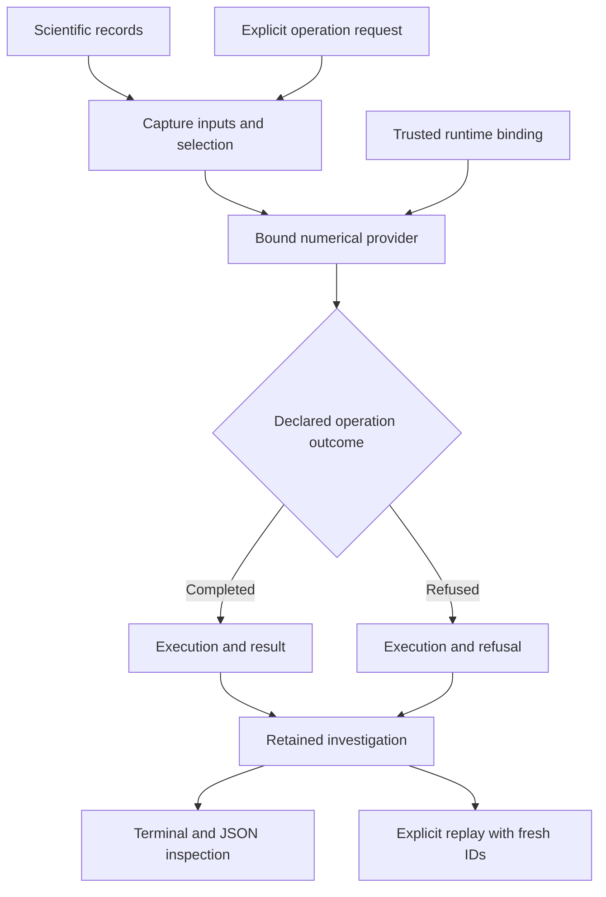

# Computational Instrumentation Workbench

Part of **Notation Systems' computational instrumentation and evidence infrastructure** for industrial and cyber-physical systems.

[Stack map](https://github.com/giasonpooni/Computational-Instrumentation-Workbench/blob/main/docs/STACK.md) · [Component role and interfaces](docs/STACK_ROLE.md)

**Notation Systems Workbench** — a programmable scientific authoring and
execution environment, with live instrumentation, for engineers and
mathematicians investigating, designing and building physical systems.

**Computational Instrumentation Workbench (CIW)** remains the technical name.
The organizing purpose is to make models, measurements, programs, experiments,
designs and evidence usable together. Physics, chemistry and engineering are
intended domains within one workspace. An instrument can become a reusable
assembly of acquisition, models, estimators, constraints, outputs and tests.

The engineer defines the question, assumptions, objectives and acceptance
criteria. AI assistance is optional and operates under that direction; the
workbench must remain useful through its terminal, scripts and graphical tools
without an LLM. Increasing expertise should unlock increasing expressive power:
use an instrument, modify its equations and assumptions, or create a new one.

**Status:** an executable terminal-first Python prototype with an optional
Godot desktop and the integrations catalogued below. The broader authoring
workspace and Julia-centred scientific core described here are development
directions. JuliaControl, JuMP, ModelingToolkit, a general machine-manifest
compiler, an MCP adapter and FPGA deployment are not yet integrated operations.

**License:** GNU Affero General Public License version 3 only
(`AGPL-3.0-only`). Copyright (c) 2026 Notation Systems. See [LICENSE](LICENSE).

This grant covers the Computational Instrumentation Workbench program and
modifications of that program. Forks and modifications must remain under
AGPL-3.0 when distributed or offered as a network service. It does not
relicense separately pinned provider repositories. It does not make
experiment outputs open source unless an output itself contains a covered
portion of this program.

## A workspace for scientific and instrument development

A useful product analogy is a Blender-like environment for computational
science and engineering: persistent project objects, reusable assets, multiple
editors and dependency-aware evaluation. The scientific objects include
components, geometry, materials/species, sensors, actuators, models, uncertainty,
experiments, executable instruments and claims. Simulation time, acquisition
time and execution time remain distinct.

The intended project model connects three graphs through shared object identities:

| Graph | What it records |
| --- | --- |
| Physical and model | Components, connections, material/energy interactions, geometry and governing relationships |
| Computation | Inputs, transformations, simulations, estimators, optimization and execution dependencies |
| Evidence | Observations, calibrations, assumptions, model versions, validation and the claims they support |

Editing a sensor position or calibration should identify affected transforms,
models, estimates and experiment plans, mark their conclusions for re-evaluation,
and preserve the earlier configuration. Physical feedback and algebraic
constraints need explicit semantics beyond ordinary dataflow scheduling.
Undoing a project edit cannot undo an experiment already performed. Proposed,
simulated, installed and validated configurations must remain distinguishable.
This general dependency-aware authoring model is planned; retained sources,
linked results and fresh replay already provide part of its foundation.

## Planned Python–Julia scientific core

The next scientific integrations are **Julia-first**, with existing Python
kernels retained as independent references and supported providers. There is
no mandatory chain through C++, Rust, Python and Julia.

| Layer | Intended responsibility |
| --- | --- |
| Python and CIW | Project interaction, acquisition, jobs, exact artifacts, operation contracts and replay |
| Julia / ModelingToolkit | Shared executable dynamics and observation models, symbolic and numerical analysis |
| JuliaControl | Supported system analysis, observers, identification and controller design |
| JuMP and selected solvers | Constrained experiment design, measurement selection and decision problems |
| GPU computation | Suitable ensembles, fields, sensitivities and candidate evaluations; measured execution cost |
| Specialist providers | Geometry/Jacobi, Lyapunov checks, registered proofs and future CFD, chemistry or CAD adapters |
| LaTeX views and reports | Equations, assumptions and constraints generated from the structured model |
| ESM companion | Supported evidence inspection, retention, review and history, outside the per-sample loop |

[ModelPredictiveControl.jl](https://juliacontrol.github.io/ModelPredictiveControl.jl/stable/)
already combines ControlSystemsBase and JuMP; [JuMP](https://jump.dev/JuMP.jl/stable/)
provides optimization modelling with selected solver backends. These are
foundations to integrate and verify, not capabilities acquired by naming a
dependency. Julia execution should use the existing
[CIW → SCR boundary](docs/JULIA_SP1.md) with a pinned environment and exact
input/output commitments.

The shared model specification must remain language-neutral: state order,
units, frames, time versus path length, measured versus commanded quantities,
calibration identity, uncertainty assumptions and validity domain are part of
its meaning. Typed ports and composition rules should preserve that meaning;
metres-to-millimetres invariance requires transforming the model and covariance
consistently. Mathematical abstractions guide the compiler, but their required
composition and approximation properties must be tested.

LaTeX is the readable mathematical view of that model. Symbolics provides a
[LaTeX output route](https://docs.sciml.ai/Symbolics/stable/manual/io/); linking a
symbol to its units, estimate, uncertainty and evidence remains workbench work.
Arbitrary LaTeX is not an executable model. Handwritten exploratory derivations
must remain distinguishable from equations bound to a run.

## Distributed instruments and reusable results

The intended instrument can span several machines, acquisition interfaces and
shared computation. Timestamped observations from a machine, cooling circuit
and inspection station could support a coupled estimate unavailable to any one
of them. Machine interfaces must declare signal meaning, units, frames,
calibration, clock uncertainty, latency, missingness and failure behaviour.
Arrival order does not establish acquisition order or simultaneity.

The GPU is a shared compute resource, with scheduling and transfer costs, not
an equipment interface. Local controllers and protective functions retain their
roles. Supervisory commands, power modulation and FPGA deployment require
separate supported interfaces, limits and measured end-to-end timing. No FPGA
board is currently selected; the first FPGA work is a software reference,
target-arithmetic checks and terminal-driven simulation. Programming an actual
board follows identification and deployment validation. C++ HLS and explicit
RTL development are planned alternatives, sharing declared input/output and
arithmetic contracts rather than assuming automatic translation from Julia.

Each experiment should retain four linked products:

**Scientific outputs + numerical diagnostics + physical measurements + execution provenance.**

Simulation-only experiments must explicitly identify physical measurements as
not acquired, rather than presenting synthetic values as sensor observations.

Fields, trajectories, sensitivity maps, residuals, fitted models, designs and
validation results should be versioned inputs to later investigations. A
simulated ensemble is not a collection of independent physical measurements.
Two processed versions of the same observation must preserve their shared
errors and evidence dependencies.

The development goal supports three nested loops:

- **Numerical refinement:** inspect residuals and invariants, then revise a solver,
  mesh or arithmetic under declared error criteria.
- **Scientific refinement:** compare explanations, choose an informative
  experiment, incorporate measurements and test held-out predictions.
- **Instrument refinement:** revise sensors, models, algorithms or physical
  fixtures, then validate the changed instrument.

The operational loop uses an accepted configuration. A separate research loop
can synthesize and compare candidate estimators, calibration models and
experiments. Candidates do not silently replace the active instrument or relax
its acceptance rules. Reanalysis creates a new computation over existing
evidence; new physical evidence requires another acquisition.

## Optional project context

Local engineering can use selected information about the surrounding world:
weather or terrain as declared physical context; equipment specifications,
materials and replacement parts as feasibility inputs; price and freight
references for comparisons; and documented facilities or infrastructure as site
context. These are proposed source integrations, not a connected worldwide
data service supplied by the current workbench.

The planned **project context bundle** binds a place, period and engineering
purpose to pinned source versions, units, spatial/temporal resolution,
uncertainty (including explicitly unknown uncertainty), permitted uses and
source dependencies. It retains acquisition and validity times and identifies
which model assumptions or decisions use each record. External context remains
optional; local acquisition, computation and retained replay must work when a
context service is unavailable.

A regional forecast is not an on-site sensor reading, a commodity benchmark is
not a local quote, and a supplier listing is not confirmed inventory. Repeated
records derived from one source are not independent corroboration. Spatial
co-location alone does not establish a relationship, ownership, permission or
physical suitability. These distinctions belong in typed inputs and validation
rules. Corrections should identify dependent conclusions for reconsideration
without erasing the earlier evidence.

## Claims, assistance and execution authority

The terminal, graphical editors, scripts and a future
[MCP adapter](https://modelcontextprotocol.io/docs/learn/architecture) should use
the same engineering operation API. MCP provides assistant access to operations
and records; the numerical core does not depend on it or on an LLM.

| Result classification | Meaning |
| --- | --- |
| Measured | A sensor observation with recorded acquisition, timing and calibration context |
| Estimated | An inference from observations and a declared model, with uncertainty and limitations |
| Predicted | A model forecast under stated conditions |
| Verified | A particular mathematical or numerical condition passed within its stated scope |
| Authorized | A separate operational policy permits a bounded action |

These classifications are a cross-workspace design requirement. Existing
operations already preserve several scoped authority distinctions; a universal
claim and deployment policy is not yet implemented. A successful optimizer is
not a stability proof, and a verified computation does not authorize actuation.

Planned assistance begins with three reusable roles: asset/evidence retrieval, signal
binding and candidate configuration, and verification/challenge. Their outputs
are inspectable artifacts with documented, observed, validated or unresolved
facts. Model/calibration assistance and diagnosis/recommissioning follow.
Deterministic, versioned validators decide acceptance; missing or conflicting
premises remain unresolved. Users can perform the same work directly.

The planned execution modes are **Explore** (models and simulations),
**Observe** (approved acquisition), **Prepare** (candidate deployment artifacts)
and **Operate** (explicitly enabled equipment operations). Enforcing those
capabilities and process/device restrictions is implementation work; the mode
names are not a claim that arbitrary Julia or plugin code is sandboxed today.
Evidence retention, scientific admission and equipment authorization remain
separate decisions.

## What runs today

Twenty-two scientific workflow kinds share one local session for sources,
declared models, compatible sensor fusion, instrument results and replay
evidence. Each scientific provider retains ownership of its calculations.
The workbench supplies a common catalog, explicit operation requests, retained
history and inspection through the terminal or optional Godot desktop.

The [live Workbench tab](docs/EXPERIMENT_VIEW.md) presents measurements,
state and covariance, residuals, native dependencies and evidence for the selected
execution occurrence. Committed session changes update the view; replay creates
a distinct occurrence. The shared paths include calibrated process and stream
analysis, observation design, measurement chains, circle geometry, stability
evaluation, typed schematics, integer diffusion, BIM quantity conditioning and
[geodesic reference calculations](docs/GEODESIC_REFERENCES.md). The
[registered heat proof operation](docs/PROVED_HEAT.md) adds SCR/SP1 computation
verification; [Julia simulation and finite-field topology](docs/JULIA_SP1.md)
are the next specified extensions. The three former geometry scaffolds now
provide [executable mathematical profiles](docs/GEOMETRY_RESEARCH.md).
The [variational free-energy demonstration](docs/VARIATIONAL_FREE_ENERGY.md)
combines curved-path sensitivity, Gaussian sensor fusion and a Lyapunov check
of the inference iteration. Six retained synthetic cases distinguish posterior
agreement and optimization progress from truth error and held-out coverage.
The [energy-to-accuracy bench](docs/ENERGY_ACCURACY.md) adds actual NVIDIA GPU
energy capture around the Gaussian solver, with separate joule, elapsed-time
and posterior-accuracy records. Its shared operation analyzes retained logs
without acquiring new measurements.
See the [assembly guide](docs/WORKBENCH_ASSEMBLY.md) for host bindings and
the [integration coverage matrix](docs/INTEGRATION_COVERAGE.md) for exact scope.

The executable prototype includes a synthetic damped oscillator, numerical
statistics and periodogram analysis, a shared local session, saved-workspace
inspection and replay, and an optional Godot experiment/oscillator viewport. External
scientific operations use explicitly bound, source-pinned runtimes; the table
below identifies the integrations currently implemented.

## Workbench at a glance

The organizing investigation workflow is:

**Observe → align time → calibrate → propagate uncertainty → estimate state →
test constraints → diagnose → advise the next observation.**

Supported combinations run through the bounded workflows in the catalogue below.
Observation advice remains advisory; it does not issue a physical acquisition
command. Each operation retains its inputs, declared assumptions and results:

This is the shared-investigation operation path after request admission.
Malformed requests are rejected before an execution exists. Providers retain
their native artifacts and runtime bindings when hosted in a shared workspace;
their guides below define each numerical boundary. The optional Godot view supports
retained experiment inspection and oscillator playback. See the [diagram atlas](docs/DIAGRAMS.md) for workflow,
covariance and identity diagrams across the stack.

## Run and inspect

Follow the [quickstart](docs/quickstart.md) for installation, terminal commands,
and the optional viewport. The [deployment guide](deploy/README.md) covers the
native service and container backend. Each integrated tool has its own exact
inputs, source pins, operating examples, validation and limitations.

Python retains and calculates from full-resolution scientific records. The
viewport displays backend-provided representations. Evidence, operation,
execution, result and verification identities remain distinct. Reopening a
workspace validates retained records without silently recomputing them;
explicit replay creates new execution/result identities.

The checked-in examples are synthetic; the energy capture command records
actual supported GPU counters. Successful computation, content integrity
and matching replay digests do not establish physical validity or calibration
traceability. The Workbench tab presents twenty-two shared scientific workflows;
other external integrations expose terminal and JSON records as described below.

## Next integrated milestones

1. **Typed project and machine interfaces.** Define model/measurement artifacts,
   plugin capabilities and execution lifecycle. Bind one machine family from
   evidence and refuse ambiguous signal meanings; keep commissioning read-only.
2. **One Julia model and estimation experiment.** Pin the Julia environment,
   exercise the SCR bridge against an independent reference, then share a small
   plant-and-sensor model across replay, observer comparison and a constrained
   measurement-selection problem. Keep Python cross-checks.
3. **A challenged physical claim.** Record a small thermal experiment, withhold
   an independent reference sensor, compare estimators on separate runs, and
   test dropouts and changed cooling. Retain raw data, calibration, uncertainty,
   model versions and failures. GPU energy capture is an available physical
   testbed; it does not yet establish a thermal-state observer or characterized
   counter uncertainty.
4. **Correction and reuse.** Retain supported results through ESM, introduce a
   calibration/model correction, and identify affected conclusions while
   preserving their history. General dependency invalidation remains to build.
5. **Validated deployment and domain extensions.** Add FPGA simulation and
   arithmetic verification before board programming. Integrate supported
   supervision, CFD/reduced models, chemical observation/kinetics, constrained
   calibration and CAD/fabrication when a bounded experiment requires them.

Independent numerical references and held-out physical measurements must
challenge the shared model. Generating observations, fitting an estimator and
judging it using the same simulator alone is insufficient physical validation.

The longer-term purpose includes maintainable local engineering workshops:
measure a problem, design or adapt a solution, fabricate it, test its effect and
retain knowledge for the next project. Offline workflows, replaceable components,
manual fallback and locally usable instructions are design priorities. A useful
result may be a passive fixture or repaired machine that needs no workbench
running after installation.

## Integrity and verification

Retained records preserve the inputs used for a calculation and the identities
of its evidence, runtime, execution and result:

- The operation runner copies provider runtime identities and returned data.
  Later changes to provider-owned objects cannot change saved results. Invalid
  runtime identities produce a refusal that can be saved and reopened.
- Calibrated process and window inputs must have epochs and calibration bounds
  exactly representable at microsecond precision. Extra trailing zeros are
  accepted; precision loss is refused before providers are bound.
- Those calibrated bundles compare retained configuration, requests and numerical
  projections as canonical JSON. Substituting `true`, `1` or `1.0` cannot pass
  an integrity check simply because Python considers their values equal.

Dedicated integration gates exercise pinned providers separately from the
local suite's optional-runtime checks. The free-energy gate builds an isolated
wheel and exercises all six cases on Linux and Windows. The energy bench adds
an installed-wheel replay/contract gate and an explicit CUDA/NVML hardware gate;
synthetic CPU CI is never reported as physical measurement. Local hardware,
live-session replay, offline restore and Godot projections were exercised for
the energy increment on **2026-09-23**.
[CI results](https://github.com/giasonpooni/Computational-Instrumentation-Workbench/actions)
also cover installed packages, native Windows and container deployment,
Godot synchronization and the existing scientific integrations.

See the [development guide](docs/DEVELOPMENT.md#validation-commands) for commands
and environment requirements. The candidate-evidence gate runs in Ubuntu CI;
its pinned ESM fixture helper still needs Windows `npx` command resolution.
Unexpected in-process provider exceptions are not yet normalized into retained
execution-failure records. These are remaining implementation limits.

## Integrated tools

This catalogue lists tools that can currently be run through CIW. Each tool's
guide records installation, commands, input/output specifications, validation,
and limits. Integration status describes the workbench connection; it does not
establish physical validation or deployment readiness.

| Tool | Integration status | Available operations | Instructions and specifications |
| --- | --- | --- | --- |
| Shared experiment viewport (`ciw.experiment-view.v1`) | Read-only Godot tab over the existing live session | Select retained occurrences; inspect measurements, full covariance, residuals, native input dependencies and evidence; follow committed updates with replay separation and stale-state handling | [Setup, protocol and scope](docs/EXPERIMENT_VIEW.md) |
| Synthetic damped oscillator (`analytic-damped-oscillator.v1`) | Integrated prototype; built into CIW | Generate a recording, inspect samples, calculate statistics and periodogram spectra, share a session, save and reopen results | [Tool guide](docs/INSTRUMENTS.md#synthetic-damped-oscillator), [quickstart](docs/quickstart.md), [record and protocol specification](docs/PROTOCOL.md) |
| Retrofitted Computational Instrumentation (RCI) | Integrated experimental measurement-chain adapter; pinned subprocess | Retain exact raw observations, validate declared calibration, derive distinct calibrated evidence with parameter covariance | [Setup, commands and specifications](docs/ADAPTERS.md), [catalogue entry](docs/INSTRUMENTS.md#rci-calibration-and-fsrt-estimation) |
| Fluid State Reconstruction Testbed (FSRT) | Integrated experimental state-estimation operation; pinned subprocess | Evaluate one simultaneous two-reservoir snapshot, retain estimate/covariance/residuals and diagnostics, share and replay the investigation | [Setup, commands and specifications](docs/ADAPTERS.md), [catalogue entry](docs/INSTRUMENTS.md#rci-calibration-and-fsrt-estimation) |
| Jacobian Sensitivity Propagation Testbed (JSPT) | Integrated experimental covariance operation provider; pinned subprocess | Propagate a retained joint covariance through an explicitly declared Jacobian, aggregation, or coordinate map; retain source links and replay the operation | [Covariance setup and contract](docs/COVARIANCE.md), [catalogue entry](docs/INSTRUMENTS.md#covariance-provenance-and-jspt-operations) |
| Parameterized Lyapunov Stability Runtime (PLSR; `ciw-plsr-adapter-v1`) | Integrated experimental terminal verification operation; optional `plsr` extra, Python 3.12+ | Import a declared model, evaluate an explicit sample, inspect a retained run, replay with digest comparison | [Setup, commands and specifications](docs/PLSR.md), [catalogue entry](docs/INSTRUMENTS.md#parameterized-lyapunov-stability-runtime-plsr) |
| Geometric Telemetry Engine (GTE; `gte.project-circle.v1`) | Integrated experimental geometric reconciliation operation; pinned subprocess | Retain raw 2D telemetry, project a declared circle candidate, transport full joint covariance to local tangent coordinates, preserve residuals, inspect and replay the shared investigation | [Setup, commands and specifications](docs/GTE.md), [catalogue entry](docs/INSTRUMENTS.md#geometric-telemetry-engine-gte) |
| Instrument-exchange inspector (`ciw-exchange-inspector.v1`) | Experimental read-only terminal conformance path; not a measurement or execution adapter | Inspect acquisition/runtime exchange artifacts using the pinned State Estimation Evaluation Testbed validator; preserve full covariance and distinguish supplied links from authenticated provenance | [Setup, commands and limits](docs/EXCHANGE.md), [catalogue entry](docs/INSTRUMENTS.md#instrument-exchange-inspection) |
| Retained scalar telemetry (`ciw.telemetry-session.v1`) | Pinned PPDA → STFE → GSIE → SET operation script; optional CBSR receipt | Retain exact source bytes, declared full temporal covariance, identity clock/frame mappings and model/prior; compute causal window mean and estimate; reexecute and compare numerical content with fresh identities | [Commands, contracts, pins and limits](docs/TELEMETRY.md) |
| Calibrated observable process experiment (`ciw.calibrated-observable-session.v1`) | Pinned FSRT, TBR, MCUR, OIT, GSIE, CBSR, FDIR and SET operation graph | Align two raw channels, apply declared calibration, gate estimation on observability, reconcile total mass and assess retained residuals; inspect and replay with fresh occurrence identities | [Commands, analytic result, refusal cases and pins](docs/CALIBRATED_OBSERVABLE.md) |
| Identified next observation (`ciw.identified-design-session.v1`) | Extends the calibrated session with pinned SIDT, OIT, GSIE, EDSPT and YWIR; SET exchange conformance | Replay the upstream experiment, identify a declared model, gate candidate observability, predict conditional state uncertainty, rank affordable observations and record separate token advice | [Commands, uncertainty scope, analytic oracle and pins](docs/IDENTIFIED_DESIGN.md) |
| Shared GSIE/CBSR/FDIR and ESM candidate evidence | Native linked instrument views plus pinned ESM inspect/capture operations in the same session | Inspect one fused state, reconciliation and declared residual assessment; replay-check and explicitly retain UNADMITTED evidence; restore historical receipts without executable bindings | [Protocol, operator setup and verification](docs/STATE_DIAGNOSTICS_EVIDENCE.md) |
| Shared PPDA/STFE telemetry (`ciw.telemetry.v1`) | Retained observation projection, causal window features, GSIE state and optional CBSR in the same session | Preserve full temporal covariance and stable batch identity across fresh executions; inspect native acquisition/window records and explicitly hand evidence to ESM | [Shared telemetry, bindings and scope](docs/SHARED_TELEMETRY.md) |
| Shared calibrated window (`ciw.calibrated-window.v1`) | TBRT → MCUR → STFE → GSIE with SET replay in the same session | Preserve raw device samples and full joint clock/calibration covariance; gate affine/window compatibility; retain nominal-grid features and state with fresh replay | [Calibrated window contract and operation](docs/CALIBRATED_WINDOW.md) |
| Acquired calibrated window (`ciw.acquired-calibrated-window.v1`) | Explicit PPDA record selection → existing calibrated window | Preserve raw row/document/observation lineage, declared clock and calibration references, and separate mapping versus native SET verification | [Acquired stream contract and example](docs/ACQUIRED_STREAM.md) |
| Residual sequence (`ciw.residual-monitor.v1`) | Native FDIR and OIT over selected retained GSIE windows | Assess retained innovations/covariance and deterministic CUSUM; retain unknown temporal dependence, held interpretation and ambiguous isolation | [Residual monitoring and replay](docs/ACQUIRED_STREAM.md) |
| Measurement chain (`ciw.measurement-chain.v1`) | Native RCI/FSRT/JSPT investigation in the common catalog | Preserve raw and calibrated evidence, posterior/reconciled covariance, explicit quantity mapping, native executions and replay | [Shared module operations](docs/REMAINING_MODULES.md) |
| Circle geometry (`ciw.geometric-circle.v1`) | Native GTE projection in the common catalog | Inspect observations, eligible/held candidates, residuals and full joint/tangent covariance | [Shared module operations](docs/REMAINING_MODULES.md) |
| Identified stability (`ciw.identified-stability.v1`) | Selected SIDT model and GSIE prediction evaluated by native PLSR | Bind discrete sample period, state order, units, frame and supplied certificate; retain unknown parameter uncertainty and inconclusive verdicts | [Shared module operations](docs/REMAINING_MODULES.md) |
| SRA schematic assessment (`ciw.schematic-assessment.v1`) | Native typed schematic in the shared catalog and desktop | Assess declared eligibility, retain stale certificates, retrieve two-hop neighborhoods and replay; explicitly selected companion calls use `ciw.schematic-companions.v1` | [Setup and contract](docs/DECLARED_WORKLOADS.md), [companion bindings](docs/INTEGRATED_MODULES.md) |
| BIM quantity conditioning (`ciw.bim-quantity.v1`) | Native CSE quantity workflow in the shared session | Condition a declared IFC quantity on an independent scalar observation; retain covariance, held or refused outcomes, execution ledger and replay | [Host bindings and scientific scope](docs/INTEGRATED_MODULES.md) |
| Snapshot acquisition (`ciw.acquired-dataset.v1`) | Native bounded PPDA/SCOUT acquisition in the shared session | Retain exact source bytes, adapter and source identities, acquisition checkpoints and durable-pool restoration; explicitly select records for downstream calibration | [Acquisition contract and examples](docs/ACQUIRED_DATASET.md) |
| SCR numerical execution (`ciw.numerical-heat.v1`) | Native Rust integer diffusion in the same catalog and desktop | Execute a bounded declared field, retain byte commitments and host-bound engine identity, replay and independently check integer results with ICRH | [Setup and contract](docs/DECLARED_WORKLOADS.md) |
| SCR/SP1 registered heat proof (`ciw.proved-heat.v1`) | Bounded proof operation; requires the pinned Linux host and registered guest | Native integer computation, real proof production, full-ELF verification, retained proof bytes, fresh replay and explicit retained-proof reverification | [Setup, claim and native gate](docs/PROVED_HEAT.md) |
| Geometry providers (`ciw.covariance-geometry.v1`, `ciw.mesh-path.v1`, `ciw.translation-flow.v1`) | Bounded native SPD geometry, mesh-edge paths and square-tiled dynamics | Exact native requests/results, numerical evidence, fresh replay, explicit partial-flow states and provider-free inspection | [Profiles and shared session](docs/GEOMETRY_RESEARCH.md) |
| Variational free-energy sensor fusion (`ciw.variational-free-energy.v1`) | Synthetic CSG → GSIE → PLSR composition with a bounded Gaussian variational kernel | Exact posterior comparison, mean/covariance iteration, normalized KL gap, held-out prediction, empirical coverage, stable/unstable iteration assessment and fresh replay | [Mathematics, six cases and operating guide](docs/VARIATIONAL_FREE_ENERGY.md) |
| GPU energy to accuracy (`ciw.energy-accuracy.v1`) | Actual NVML counter capture and bounded CUDA Gaussian iteration; built-in offline analysis | Raw timestamped readings, independent posterior accuracy, separate startup/warmed phases, background-inclusive GPU joules, retained replay | [Measurement boundary and operating guide](docs/ENERGY_ACCURACY.md) |
| Flat Torus Geodesic Reference (`ciw.flat-torus-reference.v1`) | Pinned native flat-lattice reference in the shared session | Retain winding, normalized trajectory, geometry digest, replay and independent analytic checks | [Setup and scope](docs/GEODESIC_REFERENCES.md) |
| Curved Surface Geodesic Sensitivity (`ciw.curved-path-transfer.v1`) | Pinned native constant-curvature Jacobi transfer in the shared session | Retain transfer samples, separation, declared covariance and independent reference checks | [Setup and scope](docs/GEODESIC_REFERENCES.md) |

The [integration coverage matrix](docs/INTEGRATION_COVERAGE.md) distinguishes
executable paths, conformance coverage, and the next connections between
existing instruments. The shared session connects the twenty-two workflow kinds
to a common source, operation and result history. New scientific paths retain
original, replay and adversarial evidence. The matrix distinguishes independent
ICRH profiles from CIW-only checks and pending conformance work.

The standalone and identified-stability PLSR paths use upstream commit
[`19ea6967060166ba09db6cd4563bd87bd6b3d196`](https://github.com/giasonpooni/Parameterized-Lyapunov-Stability-Runtime/tree/19ea6967060166ba09db6cd4563bd87bd6b3d196).
Schematic companions retain their [separately documented PLSR pin](docs/INTEGRATED_MODULES.md#host-bindings).
Its verdicts concern the declared computation. Numerical refusals remain distinct
from violations; physical validation and proof verification are not established.

The [covariance workflow](docs/COVARIANCE.md) extends RCI and FSRT with versioned
provenance, full ordered covariance artifacts, explicit independence declarations,
and acquisition-versus-serving calibration status. JSPT operates on retained
results in the same investigation. Legacy operation versions and historical
runtime pins remain supported; this does not confer calibration traceability or
statistical validation of uncertainty estimates.

Every successful tool integration updates this catalogue and its operating guide
in the same change. See the [documentation requirements](docs/DEVELOPMENT.md#documenting-an-integrated-tool)
for the required commands, specifications, version pins, and validation evidence.

## Provider access

Scientific execution and replay use explicit local checkouts at exact revisions.
Saved-workspace inspection works without those providers. The integration gates
accept local provider paths, including the adapter, telemetry and calibrated-process
gates. Some other installation and CI paths still fetch public repositories.
Follow the [provider availability guide](docs/PROVIDER_AVAILABILITY.md) before
changing visibility; preserve current and historical pins, submodules, dependencies
and licenses. Integrating a provider does not bundle its source into CIW.

## Related stack components

Notation Systems develops computational instrumentation for physical systems.
CIW supplies the working environment for operating and inspecting instruments;
the following repositories retain distinct engineering responsibilities.

| Component | Responsibility | CIW status |
| --- | --- | --- |
| [Provenance-Preserving Data Acquisition](https://github.com/giasonpooni/Provenance-Preserving-Data-Acquisition) | Source acquisition, observations, and durable artifact/history retention with source identity, extraction lineage, and explicit missingness | Native bounded snapshot acquisition and explicit record-to-calibrated-window mapping; hardware polling remains separate |
| [Geometric State Inference Engine](https://github.com/giasonpooni/Geometric-State-Inference-Engine) | State and covariance estimation within a declared model, time and frame context | Existing telemetry and calibrated-process calculations; shared-session state inspection preserves their native results |
| [Schematics Retrieval Agent](https://github.com/giasonpooni/Schematics-Retrieval-Agent) | Typed instrument/model graph, eligibility and bound companion call records | Shared assessment and selected native JSPT/PLSR companion calls |
| [Construction State Estimator for BIM](https://github.com/giasonpooni/Construction-State-Estimator-for-BIM) | Native BIM context, execution ledger and domain workbench projections | Shared native quantity conditioning and replayed ledger; surveyed geometry remains pending |
| [Evidence and State Management](https://github.com/giasonpooni/Evidence-and-State-Management) | Evidence, versioned state, admission, review, and release management across scientific and physical-economy domains | Shared-session calibrated candidate inspection and explicit evidence retention, plus legacy telemetry; no canonical-state admission |
| [Scientific Computation Runtime](https://github.com/giasonpooni/Scientific-Computation-Runtime) | Versioned scientific state, declared computational workloads, and provenance-bearing execution | Shared bounded native integer diffusion plus exchange inspection |
| [Geospatial State Visualization](https://github.com/giasonpooni/Geospatial-State-Visualization) | Read-only inspection of geographic entities, routes, flows, and temporal states | Read-only CIW geographic provider over declared source context |
| [State Estimation Evaluation Testbed](https://github.com/giasonpooni/State-Estimation-Evaluation-Testbed) | Evaluation of state reconstruction under noise, missingness, latency, and degradation | Pinned exchange checker and native telemetry content/replay verification; does not produce estimates |
| [Constraint-Based State Reconciliation](https://github.com/giasonpooni/Constraint-Based-State-Reconciliation) | Reconciliation of estimated states against declared constraints | Linked calibrated GSIE reconciliation and optional legacy telemetry receipt; accepted/held/refused candidate stays separate |

A repository rename does not change
operation IDs, schemas, retained evidence, execution/result/verification identities,
or historical runtime pins. The integrated catalogue above remains the record of
exercised CIW paths; a related repository is not an integration by itself.
See the [adapter ownership boundaries](docs/ADAPTERS.md#related-component-boundaries).

## Numerical instrument providers

These six repositories provide implemented numerical APIs, synthetic examples
and local tests. Their explicit example exports have exercised SET
`notation.instrument.result-artifact.v1` conformance. The export contract alone
does not establish a native CIW execution path or a SET evaluation runner.

The additive [calibrated observable process experiment](docs/CALIBRATED_OBSERVABLE.md)
binds TBR, MCUR, OIT and FDIR in one bounded native CIW path. The
[identified observation path](docs/IDENTIFIED_DESIGN.md) consumes that retained
session and connects system identification, observability, state prediction,
experiment design and token advice. Fitted parameter covariance remains unknown;
the design's expected uncertainty reduction is conditional on the identified
point model and declared independent future measurement noise.

| Instrument | Implemented foundation |
| --- | --- |
| [Time Base Reconciliation Runtime](https://github.com/giasonpooni/Time-Base-Reconciliation-Runtime) | Supplied affine clock mapping and correlated first-order time uncertainty |
| [Observability and Identifiability Testbed](https://github.com/giasonpooni/Observability-Identifiability-Testbed) | Finite-horizon linear observability and local sensitivity/Fisher diagnostics |
| [Metrological Calibration and Uncertainty Runtime](https://github.com/giasonpooni/Metrological-Calibration-Uncertainty-Runtime) | Applicable affine calibration and full correlated first-order uncertainty |
| [System Identification and Dynamics Testbed](https://github.com/giasonpooni/System-Identification-Dynamics-Testbed) | Fully observed discrete linear least squares and one-step evaluation |
| [Fault Detection and Isolation Runtime](https://github.com/giasonpooni/Fault-Detection-Isolation-Runtime) | Innovation NIS/whitening and deterministic CUSUM transitions; no physical fault isolation |
| [Experiment Design and Sensor Placement Testbed](https://github.com/giasonpooni/Experiment-Design-Sensor-Placement-Testbed) | Finite candidate information ranking with D- and A-optimal criteria |

See the [numerical-foundation boundaries](docs/STACK.md#numerical-foundations-and-their-integrations)
for their roles, export binding and integration limits. Existing CIW operations
and source pins remain unchanged.

## Documentation

- Shared workspace, component placement and delivery work: [Workbench assembly](docs/WORKBENCH_ASSEMBLY.md)
- Stack diagrams and repository navigation: [Diagram atlas](docs/DIAGRAMS.md)
- Quickstart: [`docs/quickstart.md`](docs/quickstart.md)
- Integrated tool instructions and specifications: [`docs/INSTRUMENTS.md`](docs/INSTRUMENTS.md)
- PLSR terminal workflow and saved-run specification: [`docs/PLSR.md`](docs/PLSR.md)
- Generic adapters and the RCI/FSRT investigation: [`docs/ADAPTERS.md`](docs/ADAPTERS.md)
- Covariance provenance, propagation and replay: [`docs/COVARIANCE.md`](docs/COVARIANCE.md)
- Calibrated observable process experiment: [`docs/CALIBRATED_OBSERVABLE.md`](docs/CALIBRATED_OBSERVABLE.md)
- Identified and budgeted observation selection: [`docs/IDENTIFIED_DESIGN.md`](docs/IDENTIFIED_DESIGN.md)
- Executable integration coverage and next connections: [`docs/INTEGRATION_COVERAGE.md`](docs/INTEGRATION_COVERAGE.md)
- Architecture: [`docs/ARCHITECTURE.md`](docs/ARCHITECTURE.md)
- Earlier contract audit (revision `617ca62`): [`docs/RECONCILIATION.md`](docs/RECONCILIATION.md)
- Protocol: [`docs/PROTOCOL.md`](docs/PROTOCOL.md)
- Development guide: [`docs/DEVELOPMENT.md`](docs/DEVELOPMENT.md)
