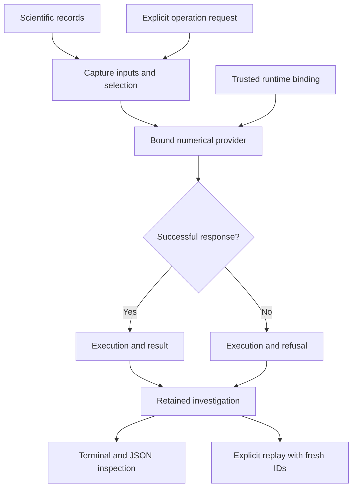

# Computational Instrumentation Workbench

Part of **Notation Systems' computational instrumentation and evidence infrastructure** for industrial and cyber-physical systems.

[Stack map](https://github.com/giasonpooni/Computational-Instrumentation-Workbench/blob/main/docs/STACK.md) · [Component role and interfaces](docs/STACK_ROLE.md)

**Notation Systems Workbench** — a terminal-first Python workbench for retained
scientific observations, explicit operations, and reproducible investigations.

The workbench is being assembled as one operating workspace for sources,
declared models, compatible sensor fusion, instrument results and replay
evidence. Existing scientific providers retain their numerical ownership;
their records and operations enter that shared context. See
[shared-workbench assembly](docs/WORKBENCH_ASSEMBLY.md) for the implemented
session connection, component placement and next delivery work. The
[live Workbench tab](docs/EXPERIMENT_VIEW.md) now brings retained process,
telemetry, calibrated-window and observation-design results into the desktop:
measurements, state/covariance, residuals, native dependencies and evidence share
one selected occurrence and update when the session commits new results.
SRA [typed schematics and SCR native numerical execution](docs/DECLARED_WORKLOADS.md)
now join that same catalog, desktop and replay path as explicitly typed objects.
[Native companion calls, BIM quantities, acquisition and geographic views](docs/INTEGRATED_MODULES.md)
connect SRA/JSPT/PLSR, CSE, PPDA/SCOUT and GSV to the same operating session.
[Acquired calibrated streams](docs/ACQUIRED_STREAM.md) now connect exact PPDA
records to calibrated windows and native FDIR/OIT residual monitoring in that
session, with live inspection and fresh replay.

The executable prototype includes a synthetic damped oscillator, numerical
statistics and periodogram analysis, a shared local session, saved-workspace
inspection and replay, and an optional Godot experiment/oscillator viewport. External
scientific operations use explicitly bound, source-pinned runtimes; the table
below identifies the integrations currently implemented.

## Workbench at a glance

This is the shared-investigation operation path after request admission.
Malformed requests are rejected before an execution exists. Providers retain
their native artifacts and runtime bindings when hosted in a shared workspace;
their guides below define each numerical boundary. The optional Godot view supports
retained experiment inspection and oscillator playback. See the [diagram atlas](docs/DIAGRAMS.md) for workflow,
covariance and identity diagrams across the stack.

## Run and inspect

Follow the [quickstart](docs/quickstart.md) for installation, terminal commands,
and the optional viewport. The [deployment guide](deploy/README.md) covers the
native service and container backend. Each integrated tool has its own exact
inputs, source pins, operating examples, validation and limitations.

Python retains and calculates from full-resolution scientific records. The
viewport displays backend-provided representations. Evidence, operation,
execution, result and verification identities remain distinct. Reopening a
workspace validates retained records without silently recomputing them;
explicit replay creates new execution/result identities.

The built-in examples are synthetic. Successful computation, content integrity
and matching replay digests do not establish physical validity or calibration
traceability. The Workbench tab presents eleven shared native workflows;
other external integrations expose terminal and JSON records as described below.

## Integrated tools

This catalogue lists tools that can currently be run through CIW. Each tool's
guide records installation, commands, input/output specifications, validation,
and limits. Integration status describes the workbench connection; it does not
establish physical validation or deployment readiness.

| Tool | Integration status | Available operations | Instructions and specifications |
| --- | --- | --- | --- |
| Shared experiment viewport (`ciw.experiment-view.v1`) | Read-only Godot tab over the existing live session | Select retained occurrences; inspect measurements, full covariance, residuals, native input dependencies and evidence; follow committed updates with replay separation and stale-state handling | [Setup, protocol and scope](docs/EXPERIMENT_VIEW.md) |
| Synthetic damped oscillator (`analytic-damped-oscillator.v1`) | Integrated prototype; built into CIW | Generate a recording, inspect samples, calculate statistics and periodogram spectra, share a session, save and reopen results | [Tool guide](docs/INSTRUMENTS.md#synthetic-damped-oscillator), [quickstart](docs/quickstart.md), [record and protocol specification](docs/PROTOCOL.md) |
| Retrofitted Computational Instrumentation (RCI) | Integrated experimental measurement-chain adapter; pinned subprocess | Retain exact raw observations, validate declared calibration, derive distinct calibrated evidence with parameter covariance | [Setup, commands and specifications](docs/ADAPTERS.md), [catalogue entry](docs/INSTRUMENTS.md#rci-calibration-and-fsrt-estimation) |
| Fluid State Reconstruction Testbed (FSRT) | Integrated experimental state-estimation operation; pinned subprocess | Evaluate one simultaneous two-reservoir snapshot, retain estimate/covariance/residuals and diagnostics, share and replay the investigation | [Setup, commands and specifications](docs/ADAPTERS.md), [catalogue entry](docs/INSTRUMENTS.md#rci-calibration-and-fsrt-estimation) |
| Jacobian Sensitivity Propagation Testbed (JSPT) | Integrated experimental covariance operation provider; pinned subprocess | Propagate a retained joint covariance through an explicitly declared Jacobian, aggregation, or coordinate map; retain source links and replay the operation | [Covariance setup and contract](docs/COVARIANCE.md), [catalogue entry](docs/INSTRUMENTS.md#covariance-provenance-and-jspt-operations) |
| Parameterized Lyapunov Stability Runtime (PLSR; `ciw-plsr-adapter-v1`) | Integrated experimental terminal verification operation; optional `plsr` extra, Python 3.12+ | Import a declared model, evaluate an explicit sample, inspect a retained run, replay with digest comparison | [Setup, commands and specifications](docs/PLSR.md), [catalogue entry](docs/INSTRUMENTS.md#parameterized-lyapunov-stability-runtime-plsr) |
| Geometric Telemetry Engine (GTE; `gte.project-circle.v1`) | Integrated experimental geometric reconciliation operation; pinned subprocess | Retain raw 2D telemetry, project a declared circle candidate, transport full joint covariance to local tangent coordinates, preserve residuals, inspect and replay the shared investigation | [Setup, commands and specifications](docs/GTE.md), [catalogue entry](docs/INSTRUMENTS.md#geometric-telemetry-engine-gte) |
| Instrument-exchange inspector (`ciw-exchange-inspector.v1`) | Experimental read-only terminal conformance path; not a measurement or execution adapter | Inspect acquisition/runtime exchange artifacts using the pinned State Estimation Evaluation Testbed validator; preserve full covariance and distinguish supplied links from authenticated provenance | [Setup, commands and limits](docs/EXCHANGE.md), [catalogue entry](docs/INSTRUMENTS.md#instrument-exchange-inspection) |
| Retained scalar telemetry (`ciw.telemetry-session.v1`) | Pinned PPDA → STFE → GSIE → SET operation script; optional CBSR receipt | Retain exact source bytes, declared full temporal covariance, identity clock/frame mappings and model/prior; compute causal window mean and estimate; reexecute and compare numerical content with fresh identities | [Commands, contracts, pins and limits](docs/TELEMETRY.md) |
| Calibrated observable process experiment (`ciw.calibrated-observable-session.v1`) | Pinned FSRT, TBR, MCUR, OIT, GSIE, CBSR, FDIR and SET operation graph | Align two raw channels, apply declared calibration, gate estimation on observability, reconcile total mass and assess retained residuals; inspect and replay with fresh occurrence identities | [Commands, analytic result, refusal cases and pins](docs/CALIBRATED_OBSERVABLE.md) |
| Identified next observation (`ciw.identified-design-session.v1`) | Extends the calibrated session with pinned SIDT, OIT, GSIE, EDSPT and YWIR; SET exchange conformance | Replay the upstream experiment, identify a declared model, gate candidate observability, predict conditional state uncertainty, rank affordable observations and record separate token advice | [Commands, uncertainty scope, analytic oracle and pins](docs/IDENTIFIED_DESIGN.md) |
| Shared GSIE/CBSR/FDIR and ESM candidate evidence | Native linked instrument views plus pinned ESM inspect/capture operations in the same session | Inspect one fused state, reconciliation and declared residual assessment; replay-check and explicitly retain UNADMITTED evidence; restore historical receipts without executable bindings | [Protocol, operator setup and verification](docs/STATE_DIAGNOSTICS_EVIDENCE.md) |
| Shared PPDA/STFE telemetry (`ciw.telemetry.v1`) | Retained observation projection, causal window features, GSIE state and optional CBSR in the same session | Preserve full temporal covariance and stable batch identity across fresh executions; inspect native acquisition/window records and explicitly hand evidence to ESM | [Shared telemetry, bindings and scope](docs/SHARED_TELEMETRY.md) |
| Shared calibrated window (`ciw.calibrated-window.v1`) | TBRT → MCUR → STFE → GSIE with SET replay in the same session | Preserve raw device samples and full joint clock/calibration covariance; gate affine/window compatibility; retain nominal-grid features and state with fresh replay | [Calibrated window contract and operation](docs/CALIBRATED_WINDOW.md) |
| Acquired calibrated window (`ciw.acquired-calibrated-window.v1`) | Explicit PPDA record selection → existing calibrated window | Preserve raw row/document/observation lineage, declared clock and calibration references, and separate mapping versus native SET verification | [Acquired stream contract and example](docs/ACQUIRED_STREAM.md) |
| Residual sequence (`ciw.residual-monitor.v1`) | Native FDIR and OIT over selected retained GSIE windows | Assess retained innovations/covariance and deterministic CUSUM; retain unknown temporal dependence, held interpretation and ambiguous isolation | [Residual monitoring and replay](docs/ACQUIRED_STREAM.md) |
| SRA schematic assessment (`ciw.schematic-assessment.v1`) | Native typed schematic in the shared catalog and desktop | Assess declared eligibility, retain stale certificates, retrieve two-hop neighborhoods and replay; explicitly selected companion calls use `ciw.schematic-companions.v1` | [Setup and contract](docs/DECLARED_WORKLOADS.md) |
| SCR numerical execution (`ciw.numerical-heat.v1`) | Native Rust integer diffusion in the same catalog and desktop | Execute a bounded declared field, retain byte commitments and host-bound engine identity, replay and independently check integer results with ICRH | [Setup and contract](docs/DECLARED_WORKLOADS.md) |

The [integration coverage matrix](docs/INTEGRATION_COVERAGE.md) distinguishes
executable paths, conformance coverage, and the next connections between
existing instruments. The immediate assembly work connects those paths to a
common source, operation and result history. New scientific paths retain
original, replay and adversarial evidence through an ICRH profile.

PLSR is pinned to upstream commit
[`19ea6967060166ba09db6cd4563bd87bd6b3d196`](https://github.com/giasonpooni/Parameterized-Lyapunov-Stability-Runtime/tree/19ea6967060166ba09db6cd4563bd87bd6b3d196).
Its verdicts concern the declared computation. Numerical refusals remain distinct
from violations; physical validation and proof verification are not established.

The [covariance workflow](docs/COVARIANCE.md) extends RCI and FSRT with versioned
provenance, full ordered covariance artifacts, explicit independence declarations,
and acquisition-versus-serving calibration status. JSPT operates on retained
results in the same investigation. Legacy operation versions and historical
runtime pins remain supported; this does not confer calibration traceability or
statistical validation of uncertainty estimates.

Every successful tool integration updates this catalogue and its operating guide
in the same change. See the [documentation requirements](docs/DEVELOPMENT.md#documenting-an-integrated-tool)
for the required commands, specifications, version pins, and validation evidence.

## Related stack components

Notation Systems develops computational instrumentation for physical systems.
CIW supplies the working environment for operating and inspecting instruments;
the following repositories retain distinct engineering responsibilities.

| Component | Responsibility | CIW status |
| --- | --- | --- |
| [Provenance-Preserving Data Acquisition](https://github.com/giasonpooni/Provenance-Preserving-Data-Acquisition) | Source acquisition, observations, and durable artifact/history retention with source identity, extraction lineage, and explicit missingness | Native bounded snapshot acquisition and explicit record-to-calibrated-window mapping; hardware polling remains separate |
| [Geometric State Inference Engine](https://github.com/giasonpooni/Geometric-State-Inference-Engine) | State and covariance estimation within a declared model, time and frame context | Existing telemetry and calibrated-process calculations; shared-session state inspection preserves their native results |
| [Schematics Retrieval Agent](https://github.com/giasonpooni/Schematics-Retrieval-Agent) | Typed instrument/model graph, eligibility and bound companion call records | Shared assessment and selected native JSPT/PLSR companion calls |
| [Construction State Estimator for BIM](https://github.com/giasonpooni/Construction-State-Estimator-for-BIM) | Native BIM context, execution ledger and domain workbench projections | Shared native quantity conditioning and replayed ledger; surveyed geometry remains pending |
| [Evidence and State Management](https://github.com/giasonpooni/Evidence-and-State-Management) | Evidence, versioned state, admission, review, and release management across scientific and physical-economy domains | Shared-session calibrated candidate inspection and explicit evidence retention, plus legacy telemetry; no canonical-state admission |
| [Scientific Computation Runtime](https://github.com/giasonpooni/Scientific-Computation-Runtime) | Versioned scientific state, declared computational workloads, and provenance-bearing execution | Shared bounded native integer diffusion plus exchange inspection |
| [Geospatial State Visualization](https://github.com/giasonpooni/Geospatial-State-Visualization) | Read-only inspection of geographic entities, routes, flows, and temporal states | Read-only CIW geographic provider over declared source context |
| [State Estimation Evaluation Testbed](https://github.com/giasonpooni/State-Estimation-Evaluation-Testbed) | Evaluation of state reconstruction under noise, missingness, latency, and degradation | Pinned exchange checker and native telemetry content/replay verification; does not produce estimates |
| [Constraint-Based State Reconciliation](https://github.com/giasonpooni/Constraint-Based-State-Reconciliation) | Reconciliation of estimated states against declared constraints | Linked calibrated GSIE reconciliation and optional legacy telemetry receipt; accepted/held/refused candidate stays separate |

A repository rename does not change
operation IDs, schemas, retained evidence, execution/result/verification identities,
or historical runtime pins. The integrated catalogue above remains the record of
exercised CIW paths; a related repository is not an integration by itself.
See the [adapter ownership boundaries](docs/ADAPTERS.md#related-component-boundaries).

## Numerical instrument providers

These six repositories provide implemented numerical APIs, synthetic examples
and local tests. Their explicit example exports have exercised SET
`notation.instrument.result-artifact.v1` conformance. The export contract alone
does not establish a native CIW execution path or a SET evaluation runner.

The additive [calibrated observable process experiment](docs/CALIBRATED_OBSERVABLE.md)
binds TBR, MCUR, OIT and FDIR in one bounded native CIW path. The
[identified observation path](docs/IDENTIFIED_DESIGN.md) consumes that retained
session and connects system identification, observability, state prediction,
experiment design and token advice. Fitted parameter covariance remains unknown;
the design's expected uncertainty reduction is conditional on the identified
point model and declared independent future measurement noise.

| Instrument | Implemented foundation |
| --- | --- |
| [Time Base Reconciliation Runtime](https://github.com/giasonpooni/Time-Base-Reconciliation-Runtime) | Supplied affine clock mapping and correlated first-order time uncertainty |
| [Observability and Identifiability Testbed](https://github.com/giasonpooni/Observability-Identifiability-Testbed) | Finite-horizon linear observability and local sensitivity/Fisher diagnostics |
| [Metrological Calibration and Uncertainty Runtime](https://github.com/giasonpooni/Metrological-Calibration-Uncertainty-Runtime) | Applicable affine calibration and full correlated first-order uncertainty |
| [System Identification and Dynamics Testbed](https://github.com/giasonpooni/System-Identification-Dynamics-Testbed) | Fully observed discrete linear least squares and one-step evaluation |
| [Fault Detection and Isolation Runtime](https://github.com/giasonpooni/Fault-Detection-Isolation-Runtime) | Innovation NIS/whitening and deterministic CUSUM transitions; no physical fault isolation |
| [Experiment Design and Sensor Placement Testbed](https://github.com/giasonpooni/Experiment-Design-Sensor-Placement-Testbed) | Finite candidate information ranking with D- and A-optimal criteria |

See the [standalone-foundation boundaries](docs/STACK.md#additional-standalone-numerical-foundations)
for their roles, export binding and integration limits. Existing CIW operations
and source pins remain unchanged.

## Documentation

- Shared workspace, component placement and delivery work: [Workbench assembly](docs/WORKBENCH_ASSEMBLY.md)
- Stack diagrams and repository navigation: [Diagram atlas](docs/DIAGRAMS.md)
- Quickstart: [`docs/quickstart.md`](docs/quickstart.md)
- Integrated tool instructions and specifications: [`docs/INSTRUMENTS.md`](docs/INSTRUMENTS.md)
- PLSR terminal workflow and saved-run specification: [`docs/PLSR.md`](docs/PLSR.md)
- Generic adapters and the RCI/FSRT investigation: [`docs/ADAPTERS.md`](docs/ADAPTERS.md)
- Covariance provenance, propagation and replay: [`docs/COVARIANCE.md`](docs/COVARIANCE.md)
- Calibrated observable process experiment: [`docs/CALIBRATED_OBSERVABLE.md`](docs/CALIBRATED_OBSERVABLE.md)
- Identified and budgeted observation selection: [`docs/IDENTIFIED_DESIGN.md`](docs/IDENTIFIED_DESIGN.md)
- Executable integration coverage and next connections: [`docs/INTEGRATION_COVERAGE.md`](docs/INTEGRATION_COVERAGE.md)
- Architecture: [`docs/ARCHITECTURE.md`](docs/ARCHITECTURE.md)
- Implementation status: [`docs/RECONCILIATION.md`](docs/RECONCILIATION.md)
- Protocol: [`docs/PROTOCOL.md`](docs/PROTOCOL.md)
- Development guide: [`docs/DEVELOPMENT.md`](docs/DEVELOPMENT.md)
