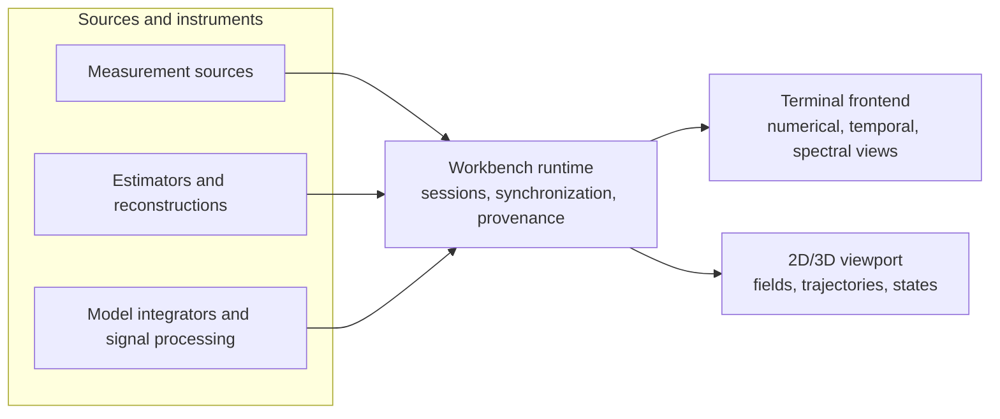

# Computational Instrumentation Workbench

**Integrated Measurement, State Estimation, and Visualization Workbench**

> A terminal-first workbench that connects computational instruments to synchronized numerical, temporal, spectral, and 2D/3D representations of physical-system observations and estimated states.

## Overview

The Computational Instrumentation Workbench (CIW) is an environment for investigating physical systems through measurements, models, and diagnostics. It brings computational instruments into one workspace: state estimators, field reconstructions, model integrators, signal-processing stages, and sources of recorded or live measurements. Their outputs are inspected side by side in synchronized views, compared across runs, and recorded so that any investigation can be reopened or replayed.

CIW is built for people who work with physical data and the models that explain it: experimentalists, estimation and control engineers, simulation users, and analysts who need to move between numbers, time series, spectra, and geometry without losing track of what produced each result.

## What you can do with it

- **Attach a source.** Recorded telemetry, a live data stream, or a simulation.
- **Select what to look at.** The quantities of interest and the time window or spatial region.
- **Run an operation.** Estimate a state, reconstruct a field, integrate a model, or analyze a spectrum.
- **Inspect the result.** Numerical, temporal, spectral, and 2D/3D views that share one time cursor, one selection, and one set of units.
- **Compare.** Runs, scenarios, and parameter choices side by side, with residuals where a reference exists.
- **Save and replay.** Every investigation is stored with its full provenance and can be reopened or re-executed.

## Capabilities

- **Synchronized representations.** Numerical readouts and tables, time-domain traces, spectral views, and 2D/3D views of fields, trajectories, and states are linked. Moving the cursor, changing the selection, or switching units in one view is reflected in all of them.
- **Computational instruments, not just readouts.** Estimation, reconstruction, integration, and signal processing are first-class instruments, alongside direct measurement sources.
- **Observations and estimates kept distinct.** Measured data and estimated states are separate kinds of data. Each carries its units, time base, coordinate frame, and available uncertainty, so an estimate is never mistaken for a measurement.
- **Terminal-first.** Full control from a terminal, over SSH, and in headless or scripted runs. Spatial results open in a companion 2D/3D viewport that stays in step with the terminal.
- **Provenance built in.** Every result records which instrument produced it, with which parameters and inputs, and which checks support it.
- **Extensible by design.** A new instrument is an adapter plus its domain-specific computation and checks. The workbench supplies the operating environment; the instrument supplies the scientific meaning. Views appear only where an instrument's output makes them meaningful.

## Example applications

| Application | What the workbench provides | What the domain brings |
|---|---|---|
| Fluid-state reconstruction | Channel inspection, time selection, residual plots, scenario comparison | Flow model, observation equations, boundary conditions, validation cases |
| Construction-state estimation from building models | Entity selection, observation history, spatial overlays, saved investigations | Building semantics, admissibility constraints, interpretation of evidence |
| Polymer and process experiments | Batch comparison, temperature and pressure traces, parameter fitting, numerical export | Material models, experimental protocols, calibration |
| GNSS and odometry instrumentation | Timestamped trajectories, coordinate-frame inspection, uncertainty display, replay | Positioning algorithms, reference systems, correction handling, receiver integration |
| Dynamical-system and observer experiments | Parameter controls, numerical states, phase portraits, comparative runs | Dynamics, estimators, stability conditions, verification procedures |

## How it works

Instruments connect to the runtime through one contract that fixes the meaning of every result: what it is, which quantities it holds, what its coordinates and timestamps mean, how it was produced, and which evidence supports it. The terminal frontend and the 2D/3D viewport are both clients of the runtime. They present the same records and share the same cursor, selection, and units; neither performs calculations of its own.

## Status

The executable prototype includes a Python/NumPy demonstration instrument, headless terminal analysis, a shared local session that terminal and viewport clients attach to, saved-workspace replay, and an optional Godot 2D/3D viewport. Follow the [quickstart](docs/quickstart.md) to run it from source. PLSR is the first external instrument integrated through the terminal: import a declared model, evaluate an explicit sample, inspect and retain the evidence, then replay it. Its [operating guide](docs/PLSR.md) covers setup and the computational scope. PLSR runs currently use separate saved bundles; they do not attach to the shared session or viewport. Further instrument and persistence adapters, the broader capabilities described above, and packaged releases remain future work. The architecture is published in [docs/ARCHITECTURE.md](docs/ARCHITECTURE.md).

## Integrated tools

This catalogue lists tools that can currently be run through CIW. Each tool's
guide records installation, commands, input/output specifications, validation,
and limits. Integration status describes the workbench connection; it does not
establish physical validation or deployment readiness.

| Tool | Integration status | Available operations | Instructions and specifications |
| --- | --- | --- | --- |
| Synthetic damped oscillator (`analytic-damped-oscillator.v1`) | Integrated prototype; built into CIW | Generate a recording, inspect samples, calculate statistics and periodogram spectra, share a session, save and reopen results | [Tool guide](docs/INSTRUMENTS.md#synthetic-damped-oscillator), [quickstart](docs/quickstart.md), [record and protocol specification](docs/PROTOCOL.md) |
| Parameterized Lyapunov Stability Runtime (PLSR; `ciw-plsr-adapter-v1`) | Integrated experimental terminal instrument; optional `plsr` extra, Python 3.12+ | Import a declared model, evaluate an explicit sample, inspect a retained run, replay with digest comparison | [Setup, commands and specifications](docs/PLSR.md), [catalogue entry](docs/INSTRUMENTS.md#parameterized-lyapunov-stability-runtime-plsr) |

PLSR is pinned to upstream commit
[`19ea6967060166ba09db6cd4563bd87bd6b3d196`](https://github.com/giasonpooni/Parameterized-Lyapunov-Stability-Runtime/tree/19ea6967060166ba09db6cd4563bd87bd6b3d196).
Its verdicts concern the declared computation. Numerical refusals remain distinct
from violations; physical validation and proof verification are not established.

Every successful tool integration updates this catalogue and its operating guide
in the same change. See the [documentation requirements](docs/DEVELOPMENT.md#documenting-an-integrated-tool)
for the required commands, specifications, version pins, and validation evidence.

## Documentation

- Quickstart: [`docs/quickstart.md`](docs/quickstart.md)
- Integrated tool instructions and specifications: [`docs/INSTRUMENTS.md`](docs/INSTRUMENTS.md)
- PLSR terminal workflow and saved-run specification: [`docs/PLSR.md`](docs/PLSR.md)
- Architecture: [`docs/ARCHITECTURE.md`](docs/ARCHITECTURE.md)
- Protocol: [`docs/PROTOCOL.md`](docs/PROTOCOL.md)
- Design decisions: [`docs/adr/`](docs/adr/README.md)
- Development guide: [`docs/DEVELOPMENT.md`](docs/DEVELOPMENT.md)
