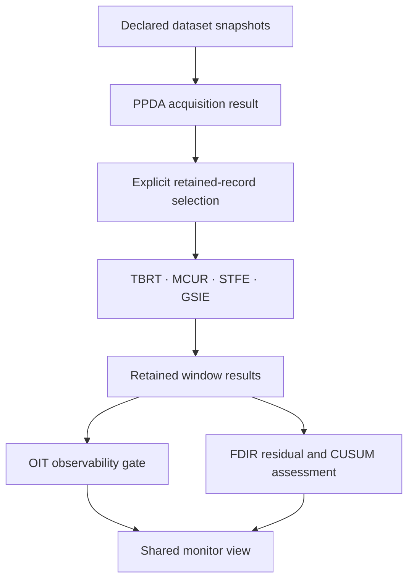

# Acquisition, calibrated windows and retained residual monitoring

The shared workbench now connects a selected PPDA acquisition result to native
time reconciliation, calibration, feature extraction and state estimation. A
second operation monitors the retained GSIE innovations with FDIR and gates
their interpretation with OIT. Both operations use the existing source, result,
execution and replay catalog.



The acquisition source retains exact append-only snapshot bytes. Each mapping
selects native observation, record, document and first-snapshot identities. It
does not allow replacement values or timestamps. Calibration and clock evidence,
the declared joint covariance, the mapped samples and the SET replay receipt
remain available through the resulting acquired-window bundle.

Monitoring selects an ordered list of existing window bundle identities. It
consumes each original innovation and innovation covariance without rerunning
GSIE. The windows must retain the same channel, frame, clock map, calibration,
model and reference prior. Target times must increase. A replay cannot be counted
as another physical window.

| Operation | Declared input | Result |
| --- | --- | --- |
| `ciw.acquired-dataset.v1` | Exact incremental snapshots | Native PPDA evidence graph and checkpoints |
| `ciw.acquired-calibrated-window.v1` | Mapping source and selected acquisition bundle | Native calibrated window with exact acquisition lineage |
| `ciw.residual-monitor.v1` | Source selecting ordered window bundle IDs | Native residual detection, CUSUM, observability and declared isolability |

## Run the installed native gate

```sh
python -m pip install 'setuptools>=77' wheel
python scripts/check_acquired_stream.py --output-dir results/acquired-stream
```

The gate builds a wheel, installs it in an isolated environment, checks the
installed import location, clones and checks out exact provider revisions, and
requires zero skipped tests. PPDA's SCOUT submodule is also pinned. The adapters
verify complete source trees before and after native execution.

The five window provider revisions come from
the [`calibrated-window` descriptor](../src/ciw/pipelines/descriptors/calibrated-window.json).
FDIR and OIT use the revisions in
the [`calibrated-observable` descriptor](../src/ciw/pipelines/descriptors/calibrated-observable.json).
PPDA and SCOUT use the constants in
[`ppda_acquisition.py`](../src/ciw/adapters/ppda_acquisition.py).
An existing checkout set can be supplied with `--stack-root`; individual
`--ppda-repo`, `--tbrt-repo`, `--mcur-repo`, `--stfe-repo`, `--gsie-repo`,
`--set-repo`, `--oit-repo` and `--fdir-repo` arguments override that directory.
Existing checkouts must match the same exact revisions.

The retained fixtures include acquisition original/replay, three window
originals, a fresh first-window replay, monitor original/replay, an unresolved
OIT monitor, actual refused source attempts, and a reopenable workspace.

## Run the shared experiment

Install CIW and bind the eight exact role-named checkouts on the host:

```sh
ciw serve --acquired-stream-stack-root /path/to/providers --output-dir results/live-stream
```

In another terminal, from the checkout containing the examples:

```sh
python examples/acquired-stream/run.py --url ws://127.0.0.1:8765
```

The client runs acquisition once, selects that same retained result for three
windows, executes the monitor, replays it, and saves the shared workspace. The
desktop Workbench view receives catalog updates as results commit. The client
uses the public session protocol and the installed CIW package.

The example explicitly constructs calibrated means of 7 m, 7.5 m and 17 m, with
the same declared 7 m reference prior for each window. Earlier posteriors never
become later priors. The third change is synthetic; it demonstrates diagnostic
detection without claiming a physical sensor fault.

## Meaning of the monitor

FDIR receives declared covariance for each retained innovation. The monitor
retains unknown dependence between windows and reports CUSUM as a declared
recurrence. It does not establish a false-alarm probability. Shared calibration,
reference priors and any overlapping observations remain explicit in its
dependency records.

The scalar sensor, process and calibration bias signatures cannot uniquely
identify a cause. An anomalous residual therefore remains ambiguous. OIT returns
rank and conditioning information; unresolved conditioning holds the diagnostic
interpretation and prevents that row from advancing CUSUM. Its CUSUM value is
`null`, its monitor state stays unchanged, and the residual calculation remains
inspectable. No monitor result admits physical state or becomes another fusion
estimate.

This lane operates on retained finite snapshots and publishes live catalog
updates. A hardware feed, persistent unattended acquisition scheduler and
automatic posterior feedback are separate connections.
