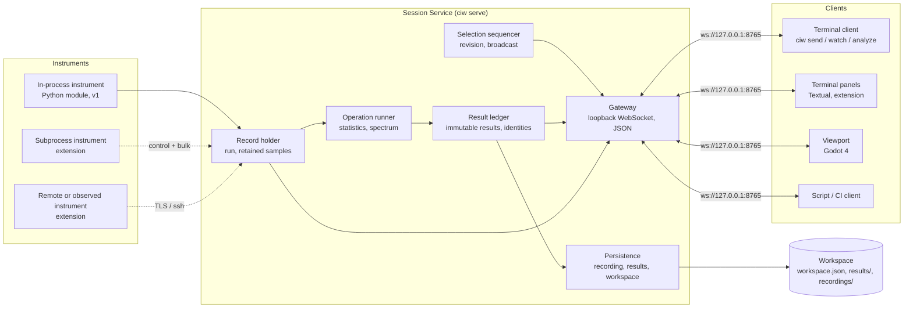
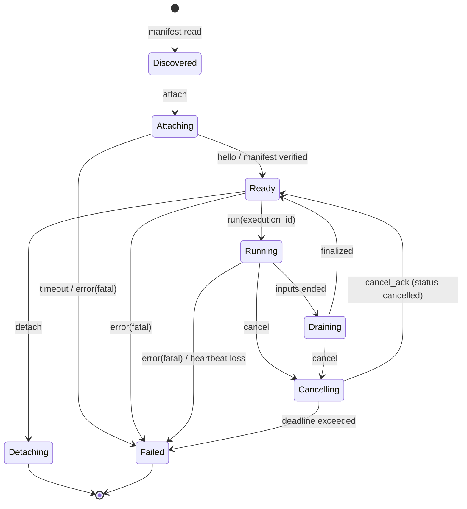

# Computational Instrumentation Workbench — Architecture

**Integrated Measurement, State Estimation, and Visualization Workbench**

Short form: **CIW**. Protocol baseline: version 1, as implemented in `src/ciw/` and specified in [`docs/PROTOCOL.md`](PROTOCOL.md). Normative statements carry identifiers `CIW-<AREA>-<NNN>` with MUST / SHOULD / MAY wording; Section 16.4 maps every identifier to its verification, milestone, and prototype status.

## 1. Summary

The Computational Instrumentation Workbench is:

> A terminal-first workbench that connects computational instruments to synchronized numerical, temporal, spectral, and 2D/3D representations of physical-system observations and estimated states.

**What it is.** A small runtime, the *session service*, that attaches computational instruments (measurement sources, state estimators, field reconstructions, model integrators, signal-processing stages) through one contract, holds the scientific record and the shared selection for one investigation, executes operations on that record, and serves records and results to clients. Two clients exist: a terminal client, which is the control surface and works alone, headless, and over SSH; and a Godot 2D/3D viewport, which attaches to the same service over the same protocol and owns no calculation. The recurring operation loop is the same for every instrument: attach a source, select quantities and a domain, run an operation, inspect the result, compare, save or replay.

**What it guarantees.**

- The service is authoritative. Clients render what the service holds and compute nothing that produces a record; render geometry is never used to compute a measurement.
- Every result carries an envelope: what it is, which quantities and units it contains, what its timestamps and coordinates mean, how it was produced, and separate evidence, operation, execution, and verification identities. Results are immutable; recomputing creates a new execution and result.
- All views share one revisioned selection: run, channel, half-open analysis interval, playback cursor, coordinate frame. Changes are sequenced by the service and broadcast to every client in one order. The cursor is separate from the interval; moving it never recomputes an analysis.
- Observations and estimated states are distinct kinds with distinct styling in every view; estimates carry their declared uncertainty.
- Under the streaming extensions, ingest never loses data silently: the bulk path is credit-based end to end and every drop is recorded as a gap.

**How it is structured.** Five components with fixed boundaries: the **Session Service** (record, selection, operations, results, persistence, gateway), **Instruments** (in-process today; subprocess, remote, and observed bindings as extensions), the **Terminal Client** (`ciw` CLI today; Textual panels as an extension), the **Viewport** (Godot 4), and the **Workspace** (a JSON file today; a session directory as an extension). Section 6 states the v1 baseline as built and presents everything beyond it as versioned extensions with identifiers and target milestones.

**Reference implementation.** Service, instruments, and terminal client in Python 3.11+ with NumPy (SciPy where needed); Textual panels as an extension of the scriptable CLI; Godot 4 as the viewport, a client over a loopback WebSocket carrying text JSON in v1 and binary buffers with an explicit descriptor as an extension; in-terminal braille and half-block rasters, with Kitty, iTerm2, and Sixel graphics where detected, when no viewport is attached. A Rust host with ratatui and Arrow is the documented alternative for a later native path; every contract is language-neutral.

**Roadmap.** The prototype (v0.1) is milestone M0. M1 adapts an existing NumPy instrument through a manifest while preserving its headless calculation and tolerances (reference instrument a). M2 adds a persistence adapter that reuses an external evidence-and-result infrastructure's identities without merging them. M3 adds the state-estimation reference instrument with uncertainty and revisions; M4 the spatial reference instrument with binary frames and viewport resources; M5 spectrograms, streaming with separate acquisition, publish, and render rates, cancellation, and stale-result handling; M6 a deployment for a stated use with measured workloads. Readiness stages standalone-ready, workbench-ready, and deployment-ready are defined in Section 18.

## 2. Purpose, scope, and non-goals

### 2.1 Definition

> A terminal-first workbench that connects computational instruments to synchronized numerical, temporal, spectral, and 2D/3D representations of physical-system observations and estimated states.

Each word of the name has a role:

- **Computational** covers the estimation, reconstruction, integration, and signal-processing backends, not just directly measured values.
- **Instrumentation** keeps the focus on investigating physical systems through measurements, models, and diagnostics.
- **Workbench** describes an environment in which several instruments and analytical operations can be used together. It does not imply that the visualization layer replaces those instruments.

Within the definition: *terminal-first* means the primary, fully capable interface is a terminal that works headless and over SSH; richer 2D/3D output may use terminal graphics protocols or an auxiliary viewer, but the terminal remains the control surface. *Synchronized* means the four representation families share time base, cursor and selection, units, and the same underlying data, and a change in one is reflected in the others deterministically. *Observations* (measured or derived data) and *estimated states* (outputs of estimators, reconstructions, integrators) are distinct kinds of data, distinguishable in the data model and in every view, including uncertainty. The workbench *connects* instruments; it does not absorb them. Instruments are replaceable backends behind a contract. The engineering title, *Integrated Measurement, State Estimation, and Visualization Workbench*, is used only as a subtitle and in abstracts.

### 2.2 Position

CIW is a foundational instrumentation runtime and workbench: a common layer underneath specialized tooling. It stays small because it captures recurring operations, not because it omits their meaning. It does not need a universal physical model; it needs a consistent way to connect, execute, inspect, compare, and record specialized models and measurements. **The workbench supplies the operating environment; the instrument supplies the scientific meaning.** Views are capability-driven, never compulsory: a scalar instrument does not need a mesh, a recorded-data instrument does not need a live device connection, a spatial instrument does not get a spectral panel unless the analysis is meaningful. Generality lives in the contract, not in one format: the result envelope and the execution contract are standardized; payload types and engines are not. Be strict about meaning at the boundary; be flexible about implementation behind it.

Frontends are clients of the computation, as several Jupyter frontends attach to one kernel and receive different representations of its outputs; neither the terminal client nor the viewport owns a separate calculation. Virtual instrumentation as National Instruments describes it separates acquisition, drivers, software-defined processing, and presentation and builds larger systems from smaller instrument functions; this design belongs to that family. The SciJava Ops work shows that a plugin mechanism is not data-structure interoperability and that adaptation layers are still needed; that is why meaning is standardized at the boundary. ROS 2 real-time design documentation distinguishes meeting deadlines from being responsive; that is why service level is separate from representability (Section 5.5).

### 2.3 Scope and protocol ownership

This document specifies the conceptual model, components and process model, the protocol v1 baseline and extension policy, the data model and envelope, the instrument contract at the level of semantics, the synchronization model, the representation layer, sessions and reproducibility, operator interaction, the extension model, the reference stack, the repository layout, budgets and conformance, risks, and the roadmap. It owns protocol semantics: message families, required fields, ordering, backpressure, cancellation, errors, versioning policy, invariants. The concrete wire specification (exact encodings and schemas, handshake sequences, version negotiation) is [`docs/PROTOCOL.md`](PROTOCOL.md), which must satisfy every requirement here; wire details are not repeated.

### 2.4 Non-goals

- A hard real-time runtime. The terminal/viewport link is not suitable for deadline-critical control loops; time-critical execution stays in an engine or controller that the workbench configures, observes, and inspects through a declared interface.
- A universal physical model, state vector, or data format.
- A database, an operating system, or a universal solver. Where a deployment has an evidence-and-result infrastructure, the workbench is an instrumentation workspace over it through an adapter (Section 13.4).
- A signal-processing or estimation library; those are instruments.
- A browser frontend as the primary interface; one may be added later as another client.

### 2.5 Baseline and extensions

Every requirement is marked **v1** (implemented in the prototype) or **extension** (versioned addition with a target milestone). No extension may contradict a v1 invariant: authoritative service, clients own no calculation, cursor separate from interval, revisioned selection, immutable results, distinct identities, render geometry never measured. Limits of v1 are stated as limits, never as capabilities.

## 3. Glossary

| Term | Meaning |
|---|---|
| **Session** | One live instance of the service holding one investigation: a run, the shared selection, and results. `session_id` is assigned at start; a reopened workspace gets a new one. |
| **Run** | One recording: `{run_id, evidence_id, instrument, metadata, time_s[], channels{}, render{}}`. A run is a recording, never an execution. v1 holds one run per session. |
| **Evidence** | The source content a result was computed from; `evidence_id` is a content hash of the run's scientific record. |
| **Operation** | A named, versioned computation (`statistics.v1`, `spectrum.periodogram.v1`); `operation_id`. |
| **Execution** | One invocation of an operation on evidence; `execution_id` is unique per invocation. |
| **Result** | The immutable record an execution produced: envelope plus operation-specific `data`; `result_id`. |
| **Verification** | An explicit check of a result against declared criteria; `verification_id`, `null` with `verification_status: "not_verified"` until one exists. Never inferred from a displayed scene. |
| **Selection** | The shared state `{run_id, channel, interval_s, cursor_s, coordinate_frame, revision}`. |
| **Revision** | Integer incremented by the service on every accepted selection update; updates carry `expected_revision`. |
| **Cursor** | The playback position `cursor_s`, separate from the analysis interval. |
| **Interval** | The half-open analysis interval `interval_s: [start, end)` that operations consume. |
| **Snapshot** | The `session.snapshot` event and `session.get` response `{session_id, run: RUN_METADATA, selection, results: [RESULT_SUMMARY]}`; in the extension also the immutable `(revision, watermark vector)` one render tick draws from. |
| **Render geometry** | Backend-prepared, non-measurement display data (`run.render`) resolving to retained samples through `sample_indices` with a declared `transform`. |
| **Workspace** | The persisted session: `{workspace_version, run, selection, results[], view_settings{}}`. |
| **Instrument** | A computational backend behind the contract: source, estimator, reconstruction, integrator, or signal-processing stage; declared by a manifest (extension). |
| **Observation** | Measured or directly derived data, kind `observation`. |
| **Estimated state** | Output of an estimator, reconstruction, or integrator, kind `estimate`, with a declared uncertainty form. |
| **Derived** | A quantity computed from other channels by an instrument or the service (innovation, residual, spectrum), kind `derived`, always with `derived_from`. |
| **Channel** | A named, unit-bearing sequence of samples on one time base: `channels{name: {unit, values}}` in v1; a descriptor in the extension. |
| **Time base** | The clock timestamps are expressed in: `time_s`, float seconds since run start (v1); named bases with clock, epoch, and mapping (extension). |
| **Frame** (data) | One batch of samples with a descriptor; the unit of transfer in the streaming extension. Distinct from a *coordinate frame*, always written in full. |
| **Coordinate frame** | A named spatial reference with parent, transform, handedness, and axis units. |
| **Representation / view** | A rendering in one of four families: numerical, temporal, spectral, 2D/3D. A *pane* hosts one. |
| **View settings** | Per-workspace presentation state (`view_settings`, empty in v1): window, follow, units, layout, camera (extension). |
| **Client** | A process attached over the session protocol: terminal client, viewport, or script. |
| **Credit** | Frames and bytes a consumer has authorized a producer to send (extension). |
| **Journal** | The append-only, sequence-numbered log of mutations, commands, and events (extension). |

## 4. Conceptual model

The operation loop is the primary command and session model; each step maps to components and contracts:

| Loop step | v1 realization | Component | Contract |
|---|---|---|---|
| attach a source | `ciw serve --recording` or `--workspace` | Session Service, Instrument | Instrument API (8.1), manifest (8.2) |
| select quantities and a domain | `selection.update {channel, interval_s, cursor_s}` | Session Service | Selection (9) |
| run an operation | `analysis.stats`, `analysis.spectrum` | Session Service, Instrument | Results (7.8), contract (8) |
| inspect the result | `sample.get`, `result.get`, readouts, viewport cards | Terminal Client, Viewport | Representation layer (10) |
| compare | `result.list`; comparison views (extension) | Terminal Client | 10, 12 |
| save or replay | `workspace.save`; `ciw serve --workspace`; `ciw inspect` | Workspace | 11 |

Instruments produce runs and results; the service holds them; clients render them. An execution has fixed parameters and inputs, one `execution_id`, and produces results in envelopes. A view is a subscription to records at a requested resolution plus the shared selection; a view changes the selection only by sending an update with the revision it observed and sees the effect when the service broadcasts it. A workspace is the run plus the selection plus the results; reopening restores them without executing anything. The service does not know the equations; it knows runs, channels, units, time bases, kinds, identities, the selection, and the loop. The instrument knows the equations and declares which representations apply to its outputs.

## 5. Component architecture

### 5.1 Components



| Component | Responsibility | Never does |
|---|---|---|
| **Record holder** | Validates and holds the run's float64 record and render geometry; answers `run.get`, `sample.get`. | Modify a retained sample. |
| **Selection sequencer** | Applies `selection.update` under one lock, increments `revision`, rejects stale updates, broadcasts `selection.changed`. | Recompute anything. |
| **Operation runner** | Executes operations on retained samples over an explicit interval. | Read render geometry or reductions. |
| **Result ledger** | Wraps operation `data` in the envelope, assigns `execution_id` and `result_id`, keeps results immutable, answers `result.get`, `result.list`. | Mutate or delete a result. |
| **Gateway** | Terminates client connections, validates envelopes, correlates `request_id`, sends `session.snapshot` on connect, fans out broadcasts. | Mutate the selection outside the sequencer. |
| **Persistence** | Writes the recording file, one file per result, and the workspace atomically; reopens after full validation. | Run an operation while reopening. |
| **Instrument Supervisor** (extension) | Launches, monitors, detaches subprocess and remote instruments; grants credits; validates frames and envelopes at the boundary. | Interpret payloads beyond the envelope. |
| **Reducer** (extension) | Produces `derived` results: decimation, resampling with a declared method, spectrograms, spatial level of detail; caches by key. | Produce anything without provenance. |
| **Terminal Client** | Control surface: headless analysis, `send`, `watch`, `inspect`; panels, command line, keybindings, layouts, rasters (extension). | Compute a record; hold data beyond what it displays. |
| **Viewport** | 2D/3D renderer: phase portrait, backend-supplied energy surface and trajectory, shared cursor, cards from `sample.get`. | Reconstruct values from geometry; update the selection without the observed revision. |
| **Workspace** | Files: `workspace.json`, `recording-<hash>.json`, `result-<id>.json`; a session directory in the extension. | Anything active. |

### 5.2 Process model

| Process | Count | Survives |
|---|---|---|
| Session service (`ciw serve`) | One per session | Client disconnects; viewport close; instrument failures (extension) |
| Terminal client (`send`, `watch`, `analyze`, panels) | Zero or more | Service restart (reconnects, requests a snapshot) |
| Viewport (Godot) | Zero or one by default | Service restart (shows STALE, offers Reconnect) |
| Subprocess instrument (extension) | One per instrument | Nothing beyond its lifetime; the service survives it |
| Remote or observed instrument (extension) | Zero or more, elsewhere | Service restarts (the service reattaches) |

The service is a separate process from both clients so that a rendering stall or client crash cannot delay sequencing and the same service serves both clients symmetrically. `ciw analyze` runs the session code headless and in-process. In-process instruments share the service's failure domain and are restricted to bounded calls; the subprocess binding is the default for anything else.

### 5.3 Threading inside the service

The service is Python; the design assumes the GIL and arranges that hot paths release it (socket I/O, NumPy kernels, memory copies).

```
 main thread (asyncio)                  worker threads (v1)                        extension threads
 ────────────────────                   ──────────────────────────────────         ────────────────────────
 gateway accept / read / write          numerical operations (NumPy, GIL off)      ingest: 1 per instrument link
 selection.update under one lock        result file write (fsync + rename)         reducer pool: N = cores − 1
 broadcast selection.changed            workspace save                             recorder: chunk seal + fsync
 snapshot on connect                                                               supervisor timers, heartbeats
```

Only the main thread mutates the selection or the result index; `selection.update` runs under an `asyncio.Lock` so broadcast order equals revision order across clients; operations and disk I/O run in worker threads so socket polling never blocks; a client that does not accept a broadcast within 2 s is disconnected. In the extension, ingest threads validate descriptors, place buffers, and post `frame_ready` to the main loop; reducer workers pull from a coalescing queue keyed by `(channel, client, resolution, window)`; the recorder has priority over chunk sealing.

### 5.4 IPC summary

| Link | v1 | Extension |
|---|---|---|
| Client ↔ service | Loopback WebSocket `ws://127.0.0.1:8765`, text JSON, no authentication, browser origins rejected, 1 MiB maximum incoming message | Binary frames with descriptor on the same connection; Unix socket and TCP with token or TLS; SSH forwarding |
| Service ↔ in-process instrument | Python calls (8.1) | Bounded by `max_call_ms` |
| Service ↔ subprocess instrument | — | Length-prefixed JSON control on stdin/stdout, stderr as log; bulk in a shared-memory segment on the same host, inline otherwise |
| Service ↔ remote instrument | — | Same records over `ssh://host//path/exec` (stdio forwarded, no daemon) or TCP with TLS |
| Service → terminal | JSON and event lines | Cells, braille, half-block; Kitty, iTerm2, Sixel payloads |

### 5.5 Service classes

Representability and service level are separate questions: whether the workbench can represent an instrument, and whether a deployment meets its timing, throughput, precision, and reliability needs. The deployment declares the class; the service enforces placement.

| Class | Where the instrument runs | What the service does | Suitable for | Not suitable for |
|---|---|---|---|---|
| **Inline** | In-process binding (v1) | Synchronous calls bounded by `max_call_ms` (default 50 ms) | Recorded runs, small deterministic transforms, adapters | Anything that can block, allocate unboundedly, or crash |
| **Local** (default from M1) | Subprocess on the same machine | Full contract over stdio control and shared-memory bulk | NumPy engines, simulations, file readers, replay | Deadline-critical loops |
| **Remote** | Another machine | Full contract over `ssh://` or TLS; buffers inline or by reference | Large simulations, lab machines, special hardware | Deadline-critical loops |
| **Observed** | A dedicated engine or controller with its own timing | The adapter exposes configuration, state, and reduced telemetry; the loop never crosses the session protocol | Real-time controllers, hardware-timed acquisition | Being driven at the loop rate |

A large simulation may provide reduced visualization data while its full results are retained elsewhere and referenced (`reduced_of`, 7.8). Not every workload runs in the same process, on the same machine, or at the same rate.

### 5.6 Failure isolation

| Failure | Effect | Recovery |
|---|---|---|
| Viewport or terminal client disconnects | Connection dropped; session unchanged | Reconnect; `session.snapshot` |
| Service stops | Viewport shows STALE, disables shared interaction, offers Reconnect; `ciw send` exits 2 | `ciw serve --workspace` restores saved state |
| Invalid request | `type: "error"` with `{code, message}`; session unaffected | Client corrects and retries |
| 1,024 results reached | `capacity_exceeded`; no result created | Save the workspace; start a new session |
| Storage error | `storage_error`; result not registered | Free space; retry |
| Instrument exits or misses 3 heartbeats (extension) | Instrument `Failed`; channels frozen and marked stale; open executions get a `cancelled` envelope | Manual restart by default; bounded `auto` (8.8) |
| Recorder cannot keep up (extension) | Ingest credits stop; the source's overflow policy applies; nothing accepted is lost | Free space or lower rate |

### 5.7 Observability (extension, M5)

The service exposes its own operation as channels under the reserved instrument id `host`: per-instrument ingest rate, credit balance, ring occupancy, reducer queue depth and latency, gateway backlog per client, journal sequence and commit lag; queryable headless with `ciw stats --json`. Every request carries a `request_id`, every journaled event a sequence number.

## 6. Protocol v1 baseline and extension policy

### 6.1 The v1 baseline

`CIW-INST-001` (v1) The session protocol MUST use the envelope `{protocol_version, request_id, type, payload}`; responses MUST use `type: "response"`, failures `type: "error"` with `payload: {code, message}`, broadcasts `request_id: null`. The service MUST send `session.snapshot` on connection with the `session.get` payload. Responses and broadcasts MAY interleave; clients MUST correlate by `request_id`.

`CIW-INST-002` (v1) The service MUST implement the commands below. Requests with an unsupported `protocol_version`, extra envelope fields, a missing or over-long `request_id`, unknown payload fields, non-finite numbers, or booleans where integers are expected MUST be rejected with a structured error and MUST leave the session unchanged.

| Type | Semantics | Result |
|---|---|---|
| `session.get` | Snapshot without arrays | `{session_id, run: RUN_METADATA, selection, results: [RESULT_SUMMARY]}` |
| `run.get` | Full run with retained samples and render geometry | RUN |
| `selection.update` | Apply `{expected_revision, cursor_s?, interval_s?, channel?}`; at least one field | SELECTION; broadcast `selection.changed` |
| `sample.get` | Resolve `time_s` to the nearest retained sample, earlier on tie | `{run_id, evidence_id, sample_index, time_s, values{}, units{}}` |
| `analysis.stats`, `analysis.spectrum` | Run the operation on `channel` over `interval_s` (defaults: current selection) | RESULT |
| `result.get` | One result of this session | RESULT |
| `result.list` | Discover stored analyses without running them | `{results: [RESULT_SUMMARY]}` |
| `workspace.save` | Write `workspace.json` to the output directory | `{workspace_file}` |

`CIW-PERF-001` (v1) The v1 limits MUST be stated as limits: one uniformly sampled recording per session; text JSON only, 1 MiB maximum incoming message; 1,024 results per session; loopback only, no authentication; no streaming, cancellation, binary arrays, spectrograms, uncertainty, or device acquisition; local JSON persistence only. New analyses produce no event in v1; clients refresh `result.list`.

### 6.2 Extension policy

`CIW-INST-003` (v1) `protocol_version` MUST be an integer; a service MUST reject a major version it does not implement with `unsupported_version`. Within a version, optional fields MAY be added and unknown optional fields MUST be ignored; any change to the meaning of an existing field MUST increment the version.

| Extension | Adds | Requirements | Milestone |
|---|---|---|---|
| Manifest and adapter | Manifest, capability-driven representations, existing-instrument adapter | INST-004..006, 019, VIEW-001, EXT-001 | M1 |
| Result events and envelope v1.1 | `result.created` broadcast; uncertainty, frames, payload types, `reduced_of`, `checks[]` | DATA-013..015, SYNC-016 | M1 |
| Terminal panels | Textual panels, command line, keybindings, layouts, rasters | VIEW-004..020, OPS-006..012 | M1–M4 |
| Journal and session store | Sequence-numbered journal, session directory, replay | SESS-005..011, OPS-004 | M2 |
| Persistence adapter | Resolver mapping the identities to an external infrastructure | EXT-004 | M2 |
| Uncertainty and revisions | Uncertainty forms, superseding results, `t_avail`, `as_of` | DATA-003, 017, 018, VIEW-012 | M3 |
| Binary frames and viewport resources | Bulk buffers with descriptor; resources by id; shared camera | DATA-016, SYNC-018, VIEW-019, 020 | M4 |
| Streaming | Credits, cancellation, heartbeats, subprocess and remote bindings, time bases, gaps | INST-007..018, 020, DATA-004..007, 011, SYNC-011, 020 | M5 |
| Spectral expansion | Welch, spectrogram, frequency cursor, link groups | SYNC-015, 019, VIEW-014, 015 | M5 |
| Deployment | Observed service class, packaging, measured workloads | PERF-004..011 | M6 |

## 7. Data model

### 7.1 The record

`CIW-DATA-001` (v1) A run MUST be `{run_id, evidence_id, instrument, metadata{duration_s, sample_rate_hz, sample_count, coordinate_frame, model{}, provenance{}}, time_s[], channels{name: {unit, values[]}}, render{}}`. `time_s` MUST start at zero, be strictly increasing, and be uniform at `sample_rate_hz` with the endpoint excluded; every channel MUST have `sample_count` finite float64 values; `RUN_METADATA` MUST omit arrays. The service MUST validate the complete run at load and reject any non-finite value.

`CIW-DATA-002` (v1) `evidence_id` MUST be `sha256:` plus the SHA-256 of the canonical JSON (sorted keys, no whitespace) of `{instrument, metadata, time_s, channels}`; a run whose content does not match MUST be refused. This detects inconsistent content, not authenticity or scientific verification.

### 7.2 Channels and kinds

`CIW-DATA-003` (extension, M3) A channel descriptor MUST carry `channel_id`, `kind`, `dtype`, `shape` (inner shape per sample), `components[]` for vectors, `unit`, `time_base`, `coordinate_frame` or `null`, `missing`, `uncertainty` (a form, or `none` with a `reason` for estimates), `representations[]`, and `cursor_policy`. `kind` MUST be `observation`, `estimate`, `derived`, or `reference`; any producer MAY emit any kind. A `derived` channel MUST carry `derived_from[]` naming its inputs' kinds, so a quantity derived from an estimate (innovation, residual, normalized innovation squared) is never presented as an observation. `reference` marks ground-truth data used for comparison.

### 7.3 Time bases and sampling

`CIW-DATA-004` (v1) Sample times MUST be `time_s`, float64 seconds relative to run start, with `metadata.provenance.time_reference` stating the reference; intervals and cursors on the wire MUST use the same unit. Cursors MUST lie within the first and last retained timestamps; an interval end MAY equal `duration_s`.

`CIW-DATA-005` (extension, M5) A time base MUST declare `id`, `clock ∈ {monotonic, wall, sim}`, `epoch` (ISO 8601 with offset for `wall`; session origin for `monotonic`; model t = 0 for `sim`), and `resolution_ns`; streamed timestamps MUST be `int64` nanoseconds relative to the epoch. Channels in different bases MUST NOT be combined unless a `mapping {offset_ns, drift_ppb, valid_from, source, version}` has been declared with evidence; the default is no mapping, the cursor is then per base, and views show `unmapped`. A device-clocked source MUST send `clock_sync {tb_ns, host_ns}` at least every 10 s; the service MUST fit offset and drift over the last 60 s, store raw timestamps unmodified with the mapping alongside, and version each refit so alignment can improve without rewriting data.

`CIW-DATA-006` (extension, M5) A channel MUST declare `regular {rate, phase, jitter_tol}` (default 1 % of the interval), `irregular`, or `event` sampling; regular frames MAY carry `(t0, dt, n)`. Timestamps MUST be non-decreasing within a channel (`time_order` on violation); equal timestamps are preserved in arrival order; a regular sample off its grid by more than `jitter_tol` MUST be rejected with `sampling_grid` unless a gap precedes it. Spectral operations MUST require regular sampling.

`CIW-DATA-007` (extension, M5) The service MUST NOT resample implicitly. Resampling MUST be an explicit derivation whose provenance names the method (`hold`, `linear`, `nearest`, `pchip`) and `gap_policy` (default `nan`). Uncertainty handling MUST be defined per method: `hold` and `nearest` copy σ; `linear` combines the neighbours' variances. Defaults: `linear` for residuals between observations, `nearest` with a warning above 1 % jitter for spectra, `none` for estimates unless requested.

### 7.4 Units

`CIW-DATA-008` (v1; grammar M1) Every channel MUST declare a UCUM case-sensitive unit with `/` and integer exponents (`m`, `m/s`, `J`, `m/s2`, `rad`, `1`, `Cel`); the v1 spectrum reports `(<unit>)^2/Hz`, and the M1 grammar accepts that form and rational exponents `Hz^(-1/2)`. From M1 the descriptor MUST carry the dimension vector over the seven SI base dimensions plus two sub-dimensions, `angle` and `log`, not interconvertible with `1`: `rad` and `deg` convert only to each other; `dB[V]` and `dB[W]` do not convert to each other. Affine units (`Cel`) MUST appear in arithmetic only as differences. A unit `status: unknown` is legal for raw counts; an `unknown` channel MUST NOT feed a dimension-constrained operation, MUST NOT share an axis with a known channel, and MUST be flagged. Dimension mismatch MUST be refused with `dimension_mismatch`; scale mismatch MUST NOT be converted silently, the service offers an explicit `convert` derivation recorded in provenance.

`CIW-DATA-009` (extension, M1) Unit preferences MUST be display-only: stored values stay in the declared unit; the factor and offset are applied at render and export and recorded in the export sidecar; conversion MUST also apply to σ, intervals, and covariance (`J Σ Jᵀ` with the diagonal scale Jacobian). A derived spectral unit MUST be computed as `(<unit>)^2/Hz`.

### 7.5 Uncertainty

`CIW-DATA-010` (extension, M3) Uncertainty, when present, MUST be `stddev`, `variance`, `covariance` (default layout full row-major `[d, d]` per sample; `packed_lower` and `block_diagonal` MAY be declared), `interval {lower, upper, level}`, `quantiles`, or `ensemble {members}`. Absent uncertainty MUST be absent, never zero. Uncertainty MUST travel as companion columns of the same channel with the same time column. Covariance MUST be symmetric positive semi-definite; the service SHOULD check symmetry and MAY check semi-definiteness by sampled Cholesky, reporting failures as channel-scoped warnings. A unit-quaternion state MUST declare its covariance in the tangent space (`[3, 3]`, `rad2`).

### 7.6 Coordinate frames and missing data

`CIW-DATA-011` (v1; extended M4) Every run and spatial channel MUST name a coordinate frame; in v1 `metadata.coordinate_frame`, `render.coordinate_frame`, and the selection's `coordinate_frame` MUST match. From M4 a frame declaration MUST carry `id`, `parent` or `null`, `transform` (4×4 row-major float64 to the parent, or a time-indexed transform channel), `handedness`, and axis `units`; chains MUST be acyclic; a spatial view MUST refuse to overlay channels in different frames unless a transform is registered. Missing data MUST be declared per channel as `nan`, `mask` (companion boolean column; required for integer, complex, and table columns), or `none`; gaps MUST be recorded as data `{from, to, reason ∈ {overflow_drop, source_unavailable, cancelled, resample_max_gap, declared}}` that survive persistence and replay; reducers MUST propagate missing values as gaps.

### 7.7 Render geometry

`CIW-DATA-012` (v1) Render geometry (`run.render`) MUST be backend-prepared and non-measurement: it MUST name `coordinate_frame` and `axis_labels` with units, MUST resolve every render point k to a retained sample through strictly increasing `sample_indices[k]`, MUST declare a visual-only `transform {origin, scale, note}`, and MUST never be used to compute a measurement or readout; numerical cards MUST come from `sample.get`. From M4 mesh topology and point positions MAY be sent once as resources by id; level of detail MUST be declared by the instrument or produced by the reducer with a declared method.

### 7.8 Results and the result envelope

`CIW-DATA-013` (v1; fields added M1) A result MUST be `{result_id, evidence_id, operation_id, execution_id, verification_id, verification_status, run_id, selection_revision, channel, interval_s, created_at, recording_file, data}`. The four identities MUST be distinct fields, never derived from one another. Two executions of one operation on one evidence MUST share `operation_id` and `evidence_id` and differ in `execution_id` and `result_id`; from M1 an operation with parameters MUST fold a canonical parameter hash into `operation_id`. `verification_id` MUST be `null` and `verification_status` `not_verified` until a distinct verification execution references the result; verification MUST never be inferred from a displayed scene. From M1 the envelope MUST also carry `envelope_version`, `kind`, `channels[]` (descriptors with units, shapes, time base, frame, missing convention, uncertainty), `payload {type}`, `representations[]`, `status ∈ {partial, complete, cancelled, failed}`, and optionally `reduced_of`, `supersedes {result_id, interval}`, and `checks[]` (instrument self-checks with outcomes; they do not set `verification_id`).

`CIW-DATA-014` (v1) Results MUST be immutable and MUST capture the `selection_revision` and exact `interval_s` that produced them; `data` MUST be computed from full-resolution retained samples in the half-open interval, never from render geometry or terminal summaries. Saved results MUST be validated on reopen (identity form, source binding, shape of `data`) without executing the operation.

`CIW-DATA-015` (extension, M1) `payload.type` MUST be `array`, `table` (columns sharing a time column; Arrow IPC at rest), `mesh`, `sparse` (COO or CSR), or `reference` (URI, content hash, referenced type). A `reference` MUST carry an inline `summary` of a concrete type so views render without dereferencing; dereferencing MUST be explicit and record the resolved hash; an unresolvable reference MUST NOT fail the envelope. An output declared `reduced_of` delivers visualization-resolution data while the full result is retained elsewhere and referenced; views MUST show that data is reduced.

Example v1 result as written to `results/<result_id>.json`, with envelope v1.1 fields marked `+`:

```json
{
  "result_id": "result-3f9c2a7e0b1d4c6e8a5f7b9d1e3c5a70",
  "evidence_id": "sha256:6b1f…c2",
  "operation_id": "statistics.v1",
  "execution_id": "execution-9d0e5b4a3c2f1e8d7b6a5c4f3e2d1b0a",
  "verification_id": null,
  "verification_status": "not_verified",
  "run_id": "run-damped-oscillator-demo-v1",
  "selection_revision": 4,
  "channel": "q",
  "interval_s": [2.0, 8.0],
  "created_at": "2026-09-20T10:14:03.221000+00:00",
  "recording_file": "recording-8a2c…e1.json",
  "data": {"sample_count": 384, "mean": -0.0132, "minimum": -0.5811, "maximum": 0.6094, "rms": 0.2937, "unit": "m"},
  "+envelope_version": "1.1",
  "+kind": "derived",
  "+channels": [{"channel_id": "q.stats", "kind": "derived", "derived_from": ["observation"], "unit": "m", "shape": [],
                 "time_base": "run", "coordinate_frame": null, "missing": "none", "uncertainty": "none"}],
  "+payload": {"type": "table"},
  "+representations": ["numerical"],
  "+status": "complete"
}
```

### 7.9 Frames and the binary descriptor

`CIW-DATA-016` (extension, M4) A bulk frame MUST carry a descriptor sufficient to interpret its buffers without the envelope: `frame_seq`, `execution_id`, `result_id` or `channel_ids[]`, and per buffer `dtype`, `shape`, `byte_order` (`little`), `order` (`C`), `byte_offset`, `byte_length`, `unit`, `coordinate_frame`, plus `time {column}` or `time {t0, dt, n}` with its `time_base`. The default transfer and at-rest format is NumPy-compatible raw contiguous buffers with this descriptor; Arrow IPC (pyarrow) is the format for table payloads and export and MAY be negotiated per link. Buffers MUST NOT be embedded in text records.

Control record announcing a frame from the state-estimation reference instrument (framing per `docs/PROTOCOL.md`):

```json
{
  "protocol_version": 2, "request_id": null, "type": "frame",
  "payload": {
    "stream": "attitude-ekf/state", "frame_seq": 4182,
    "execution_id": "execution-9d0e5b4a3c2f1e8d7b6a5c4f3e2d1b0a",
    "channels": ["att.quat", "att.quat.cov", "att.bias"],
    "time": {"column": 0, "time_base": "imu_mono"},
    "buffers": [
      {"channel": null,           "dtype": "i64", "shape": [256],       "byte_order": "little", "order": "C", "byte_offset": 0,     "byte_length": 2048,  "unit": "ns"},
      {"channel": "att.quat",     "dtype": "f64", "shape": [256, 4],    "byte_order": "little", "order": "C", "byte_offset": 2048,  "byte_length": 8192,  "unit": "1", "coordinate_frame": "body_to_nav"},
      {"channel": "att.quat.cov", "dtype": "f64", "shape": [256, 3, 3], "byte_order": "little", "order": "C", "byte_offset": 10240, "byte_length": 18432, "unit": "rad2"},
      {"channel": "att.bias",     "dtype": "f64", "shape": [256, 3],    "byte_order": "little", "order": "C", "byte_offset": 28672, "byte_length": 6144,  "unit": "rad/s"}
    ],
    "bulk": {"binding": "shm", "segment": "ciw-7f3a-000091", "byte_length": 34816}
  }
}
```

### 7.10 Revisions of estimated states

`CIW-DATA-017` (extension, M3) Results MUST NOT be mutated to revise an estimate. A smoother or fixed-lag estimator MUST emit a new result whose envelope carries `supersedes {result_id, interval}`; the earlier result remains, marked superseded over that interval. Estimate channels MUST carry validity time (`t_valid`) and availability time (`t_avail`, when the service committed it) so estimator latency and revision behaviour are visible. View settings MAY carry `as_of`; when set, estimate views MUST show results with `t_avail ≤ as_of` and MUST mark `as_of` with a second, distinct cursor.

`CIW-DATA-018` (extension, M3) A `derived` result computed from channels with uncertainty MUST declare `propagation ∈ {linear, dropped, exact}`; `dropped` MUST render as a visible `σ-DROPPED` flag, never a fabricated value; the default for spectra and reductions is `dropped`.

### 7.11 Provenance and versioning

`CIW-DATA-019` (v1; journal M2) `workspace_version`, `protocol_version`, and from M1 `envelope_version` and `manifest_version` MUST be checked on read; a reader MUST refuse a higher major version naming the converter. `metadata.provenance` MUST name generator and version, dtype, time reference, and sampling convention. From M2 the journal MUST record for every execution the operation, parameters, seed, input identities, and manifest hash.

### 7.12 Reductions

`CIW-DATA-020` (extension, M1) A reduction of a channel to a view's resolution MUST preserve per-column minimum and maximum and, with uncertainty, `max(value + σ)` and `min(value − σ)`; MUST carry the `selection_revision` it was computed for; and a level-of-detail pyramid MUST yield the same envelope as a direct reduction over raw samples, including after a superseding result (property test). Readouts MUST come from full-resolution samples, never from a reduction.

## 8. Instrument contract

### 8.1 The v1 in-process instrument API

`CIW-INST-004` (v1) An in-process instrument MUST provide `make_demo_run() -> dict` (or an equivalent loader), `validate_run(run)`, `run_metadata(run) -> dict`, `inspect_sample(run, time_s) -> dict`, `compute_statistics(run, channel, interval_s) -> dict`, and `compute_spectrum(run, channel, interval_s) -> dict`. Computations MUST validate the complete source recording and their inputs, MUST read full-resolution float64 retained samples, and MUST return operation-specific `data` only; the session wraps provenance and persistence. `compute_spectrum` in v1 MUST be a one-sided, constant-detrended, periodic-Hann periodogram PSD with density normalization `fs · Σw²`, interior bins doubled, DC and the even-length Nyquist bin not doubled, returning `{sample_count, method, window, detrend, scaling, frequency_hz[], psd[], unit, peak_frequency_hz, sample_rate_hz}`; it is not Welch and not a spectrogram.

### 8.2 Manifest

`CIW-INST-005` (extension, M1) Every instrument MUST ship `instrument.json` with `manifest_version`, `id` (reverse-DNS), `version` (semver), `title`, `binding ∈ {inprocess, subprocess, remote, observed}`, `entrypoint` or `endpoint`, `determinism` with optional `tolerance {abs, rel}`, `isolation`, `max_call_ms`, `heartbeat_ms`, `restart {policy, max}`, `parameters[]` (name, type, unit, default, range, `scope ∈ {execution, live}`, optional `source ∈ {selection.cursor, selection.interval}`), `inputs[]` (name, accepted kinds, dimension, shape, sampling, required), `outputs[]` (name, `mode ∈ {stream, batch}`, channel descriptors, `representations[]`, `overflow`), and `checks[]`. The service MUST refuse an instrument whose manifest fails schema validation and MUST record the manifest hash in provenance. JSON is the manifest format because it is the serialization the protocol and workspace already use and it embeds verbatim in `hello`.

`CIW-INST-006` (extension, M1) An output's `representations[]` MUST be a subset of the families that accept its shape; the service MUST offer only those families.

Manifest of reference instrument (b), a quaternion attitude EKF:

```json
{
  "manifest_version": "1.0",
  "id": "org.ciw.ref.attitude-ekf",
  "version": "0.3.1",
  "title": "Attitude EKF (quaternion, gyro + accel)",
  "binding": "subprocess",
  "entrypoint": ["python", "-m", "ciw_ref_instruments.attitude_ekf"],
  "determinism": "deterministic",
  "tolerance": {"abs": 1e-12, "rel": 1e-9},
  "isolation": "process",
  "heartbeat_ms": 1000,
  "restart": {"policy": "manual", "max": 3},
  "parameters": [
    {"name": "gyro_noise_density",  "type": "f64", "unit": "rad/s/Hz^(1/2)", "default": 1.7e-4, "range": [0, 1], "scope": "execution"},
    {"name": "accel_noise_density", "type": "f64", "unit": "m/s2/Hz^(1/2)",  "default": 2.0e-3, "range": [0, 1], "scope": "execution"},
    {"name": "lag_s", "type": "f64", "unit": "s", "default": 0.0, "range": [0, 10], "scope": "execution",
     "doc": "Fixed-lag smoothing window; > 0 emits superseding results"},
    {"name": "initial_state", "type": "f64[4]", "unit": "1", "default": [1, 0, 0, 0], "scope": "execution"}
  ],
  "inputs": [
    {"name": "gyro",  "kinds": ["observation", "derived"], "dimension": "rad/s", "shape": [3], "sampling": "regular", "coordinate_frame": "body", "required": true},
    {"name": "accel", "kinds": ["observation", "derived"], "dimension": "m/s2",  "shape": [3], "sampling": "regular", "coordinate_frame": "body", "required": true}
  ],
  "outputs": [
    {"name": "state", "mode": "stream", "representations": ["numerical", "temporal", "spatial3d"], "overflow": "block",
     "channels": [
       {"channel_id": "att.quat", "kind": "estimate", "dtype": "f64", "shape": [4], "components": ["w", "x", "y", "z"], "unit": "1",
        "coordinate_frame": "body_to_nav", "time_base": "input:gyro", "missing": "nan", "cursor_policy": "nearest",
        "uncertainty": {"form": "covariance", "layout": "full", "shape": [3, 3], "unit": "rad2", "note": "tangent-space rotation vector"}},
       {"channel_id": "att.bias", "kind": "estimate", "dtype": "f64", "shape": [3], "unit": "rad/s", "coordinate_frame": null,
        "time_base": "input:gyro", "missing": "nan", "uncertainty": {"form": "stddev"}}
     ]},
    {"name": "innovation", "mode": "stream", "representations": ["numerical", "temporal", "spectral"], "overflow": "drop_oldest",
     "channels": [
       {"channel_id": "att.nis", "kind": "derived", "derived_from": ["observation", "estimate"], "dtype": "f64", "shape": [], "unit": "1",
        "time_base": "input:gyro", "missing": "nan", "uncertainty": "none"}
     ]}
  ],
  "checks": [{"name": "innovation_nis", "description": "Normalized innovation squared inside the chi-square 95 % bound for at least 95 % of samples"}]
}
```

### 8.3 Lifecycle



`CIW-INST-007` (extension, M5) An instrument MUST follow the state machine above with these obligations and timeouts. Attaching: reply to `hello` with `manifest` within 5 s, verified against the on-disk copy. Ready: validate parameters and reply `ready` within 30 s of `attach`. Running: consume and emit as credits allow; `heartbeat` every `heartbeat_ms`; `progress` at least every 1 s in batch mode. Draining: emit remaining outputs, `end_of_stream` per output, then `finalized` with per-output content digests, within 30 s or the service escalates to cancel. Cancelling: stop producing (target 200 ms) and send `cancel_ack` within `2 × heartbeat_ms` (default 2 s); frames already sent remain valid; the envelope status becomes `cancelled` with the last valid `frame_seq`. Failed: emit `error(fatal)` before exit; the service retains everything received and marks the stream `truncated`. Each `run` MUST carry a new `execution_id`; every transition MUST be journaled; concurrent executions require `concurrency > 1` in the manifest.

### 8.4 Message families

`CIW-INST-008` (extension, M5) The instrument protocol MUST have exactly four families; each record carries `family`, `type`, `seq` (per direction, per link), and `correlation_id` for request/response pairs. Control and bulk data MUST travel on separate planes, buffers referenced by offset or segment name and never embedded in text records. `checkpoint` and `seek` are optional capabilities: an opaque blob a later `run` may resume from, so replay can seek without recomputing.

| Family | Direction | Types (minimum) |
|---|---|---|
| `control` | service → instrument | `hello`, `attach`, `set_params`, `run`, `cancel`, `detach`, `credit`, `ping`, `checkpoint` |
| `control` | instrument → service | `hello`, `manifest`, `ready`, `params_ack`, `run_ack`, `cancel_ack`, `pong`, `checkpoint`, `detached` |
| `data` | instrument → service | `envelope`, `frame`, `resource`, `gap`, `watermark`, `clock_sync`, `end_of_stream`, `finalized` |
| `data` | service → instrument | `input_frame`, `input_end` |
| `event` | both | `progress`, `log`, `heartbeat`, `check_result` |
| `error` | both | `error` |

### 8.5 Ordering

`CIW-INST-009` (extension, M5) Within one link direction records MUST be delivered in `seq` order; within one output stream frames MUST arrive in `frame_seq` order without gaps and the envelope MUST precede the first frame; an out-of-order frame MUST be rejected with `seq_gap`, never reordered. Across streams and instruments the journal defines the session order. Control and data on one link arrive in send order, so an instrument MUST check for control records at least every 100 ms while draining input.

### 8.6 Backpressure

`CIW-INST-010` (extension, M5) Every bulk stream MUST be credit-based in frames and bytes: the consumer grants, the producer MUST NOT send without sufficient credit in both units, the consumer replenishes as it commits. Defaults: 64 frames and 64 MiB per instrument stream; 8 frames and 8 MiB per client subscription. The service is the only component that buffers between instruments: frames are committed to the store and read back for downstream inputs, so a slow consumer bounds read-ahead and never stalls the producer. The recorder is a credit consumer with priority: when it cannot keep up, ingest credits stop.

`CIW-INST-011` (extension, M5) On exhausted credit an instrument MUST apply its output's declared overflow policy: `block` (default), `drop_oldest` (report the dropped range as a `gap` record), or `fail`. A deterministic or seeded instrument MUST NOT drop. Silent loss is not permitted; the conformance suite MUST withhold credit and assert that a `drop_oldest` source emits gaps.

### 8.7 Cancellation

`CIW-INST-012` (extension, M5) On `cancel(execution_id)` the instrument MUST stop producing for that execution and send `cancel_ack` within `2 × heartbeat_ms`; a non-acknowledging instrument MUST be moved to `Failed` and, for the subprocess binding, its process group terminated. Cancelling a client-requested analysis MUST leave earlier results untouched and MUST produce a `status: cancelled` result when partial frames were delivered.

### 8.8 Errors and restart

`CIW-INST-013` (extension, M5) Errors MUST be structured `{code, class, severity ∈ {warning, error, fatal}, recoverable, scope ∈ {link, instrument, execution, stream, frame}, message, detail}`, journaled and surfaced. Restart policy: `manual` by default; `auto` restarts a crashed subprocess at most `restart.max` (default 3) times after a `recoverable` error; every restart is a new execution.

| Class (code prefix) | Fatal default | Service action |
|---|---|---|
| `param_*` (`param_range`, `param_type`, `param_unknown`) | yes | Report against the parameter; execution not started |
| `input_*` (`input_schema`, `input_unit`, `input_gap`, `input_nan`) | schema: yes; data: no | Data errors attached to the stream at `frame_seq`; markers on the temporal axis |
| `overrun` | no | Gap recorded and rendered |
| `resource_*` | yes | Execution failed; message shown |
| `numeric_*` (`numeric_diverged`, `numeric_singular`) | instrument's choice | A non-fatal numeric error MUST still emit a time-aligned sample (NaN value, infinite covariance) so estimate output never loses alignment |
| `transport` | yes (service-generated) | Stream marked `truncated` |
| `contract` (bad seq, credit exceeded, descriptor mismatch) | yes (service-generated) | Execution failed; offending record logged |
| `internal` | yes | As `resource_*` |

### 8.9 Determinism and parameters

`CIW-INST-014` (extension, M1) The manifest MUST declare `determinism` as `deterministic` (equal within declared `tolerance`; bitwise if none), `seeded` (deterministic given a `seed` the service supplies and records), or `nondeterministic`. `finalized` MUST carry a content digest per output, which the service computes independently. Deterministic and seeded instruments MUST produce the same sample sequence regardless of how inputs were split into frames; the SDK MUST ship a harness that re-frames inputs randomly. The conformance suite MUST verify determinism claims by re-execution for each reference instrument.

`CIW-INST-015` (extension, M1) A parameter with `scope: execution` MUST NOT affect a running execution; it applies to the next `run` and yields a new `operation_id`. A `scope: live` parameter MAY change during an execution; every change MUST be journaled and recorded in the envelope's parameter history.

### 8.10 Streaming, batch, and selection isolation

`CIW-INST-016` (extension, M5) A `stream` output MUST deliver frames as produced and end with `end_of_stream`; a `batch` output MUST deliver its envelope and all frames after completion, then `end_of_stream`; a batch execution over a selection MUST receive the interval explicitly and record it in the envelope.

`CIW-INST-017` (extension, M1) Instruments MUST NOT read the selection or view settings. Where an instrument needs the cursor or interval, the manifest MUST declare a parameter with `source: selection.cursor` or `selection.interval`, delivered with the `revision` it came from. v1 already works this way: `compute_statistics` and `compute_spectrum` receive `interval_s` explicitly and the result captures `selection_revision`.

### 8.11 Bindings

`CIW-INST-018` (extension, M1 subprocess; M5 remote, observed) Semantics MUST be identical across bindings; bindings differ only in transport. An instrument MUST run under `subprocess` and `remote` without code change; an in-process instrument MUST be wrappable as a subprocess by a generic SDK shim.

| Binding | Control plane | Bulk plane | Liveness | Isolation |
|---|---|---|---|---|
| `inprocess` (v1) | Python calls with the same record shapes | NumPy arrays by reference | Bounded by `max_call_ms`; `Failed` at 10× the bound | None |
| `subprocess` (default from M1) | Length-prefixed JSON on stdin/stdout; stderr as log | Shared-memory segment named in the frame record; inline fallback | Heartbeat | Process |
| `remote` | `ssh://host//path/exec` (stdio forwarded, no daemon) or TCP with TLS and token | Inline or `reference` payloads | Heartbeat | Process and machine |
| `observed` | Any of the above via an adapter | Reduced telemetry only | Heartbeat | The engine's own |

### 8.12 Versioning, invariants, conformance harness

`CIW-INST-019` (extension, M1) `hello` MUST carry a semantic protocol version; majors MUST match or the link is refused with `unsupported_version`; the minor in effect is the lower of the two; unknown fields MUST be ignored; manifest, envelope, and protocol versions are independent. The service MUST enforce at the boundary: every frame's channels are declared in the current envelope; every buffer's byte length equals `dtype size × product(shape)`; timestamps are non-decreasing; the envelope's `kind` matches every channel's; every unit parses; every spatial channel names a declared frame.

`CIW-INST-020` (extension, M1) `docs/PROTOCOL.md` MUST specify the concrete encoding for every requirement in this section and MUST ship a harness (`ciw-proto-check <manifest>`) that drives an instrument through attach, run, credit exhaustion, cancel, and detach and reports pass or fail per identifier.

## 9. Synchronization model

### 9.1 The shared selection

`CIW-SYNC-001` (v1) A session MUST have exactly one selection, held by the service; clients MUST NOT keep a divergent copy, and every change MUST pass through `selection.update`.

`CIW-SYNC-002` (v1) The selection MUST be `{run_id, channel, interval_s: [start, end), cursor_s, coordinate_frame, revision}`; the initial selection MUST be the first channel over the full run with the cursor at the first sample and `revision: 0`.

```json
{"run_id": "run-damped-oscillator-demo-v1", "channel": "q", "interval_s": [2.0, 8.0],
 "cursor_s": 3.0, "coordinate_frame": "oscillator-state", "revision": 4}
```

### 9.2 Revisions and conflict

`CIW-SYNC-003` (v1) Every `selection.update` MUST carry `expected_revision`; the service MUST apply it only if equal to the current revision, MUST increment `revision` by exactly one, and MUST reject a stale update with `revision_conflict` without mutating anything. An update that changes nothing MUST be rejected with `invalid_payload`; revisions MUST be integers compared numerically and booleans rejected.

`CIW-SYNC-004` (v1) After an accepted update the service MUST broadcast `selection.changed` with the full selection to every client in revision order and MUST send `session.snapshot` to every new connection. A client MUST apply broadcasts in increasing revision and discard one not greater than the revision it shows.

```mermaid
sequenceDiagram
  participant T as Terminal client
  participant S as Session service
  participant V as Viewport
  T->>S: selection.update {expected_revision: 4, cursor_s: 3.5}
  S->>S: lock; check revision == 4; apply; revision = 5
  S-->>T: response SELECTION(rev 5)
  S-->>V: selection.changed SELECTION(rev 5)
  S-->>T: selection.changed SELECTION(rev 5)
  V->>S: selection.update {expected_revision: 4, interval_s: [1, 9]}
  S-->>V: error revision_conflict
  V->>S: session.get
  S-->>V: response snapshot(rev 5)
```

### 9.3 Cursor versus interval

`CIW-SYNC-005` (v1) The playback cursor MUST be separate from the analysis interval: a cursor update MUST NOT change `interval_s` and MUST NOT recompute or invalidate any analysis. Analyses MUST consume `[start, end)` with `0 ≤ start < end ≤ duration_s`; an interval with no retained sample MUST be rejected. A cursor-anchored spectrum, if offered, MUST be an explicit command creating a new result from the interval derived from the cursor at that revision.

### 9.4 Client discipline and cursor resolution

`CIW-SYNC-006` (v1) Clients MUST coalesce selection updates to at most 10 per second with one outstanding, reject obsolete responses, poll a snapshot every 5 s, time out unanswered requests at 8 s, show STALE and disable shared interaction on disconnect, and offer Reconnect. On `revision_conflict` a client MUST discard pending intent and refresh rather than replay it over another client's selection.

`CIW-SYNC-007` (v1; policy M5) Cursor resolution MUST be the nearest retained sample, earlier on a tie (`inspect_sample`); a readout MUST show the resolved sample's own time. From M5 a channel MAY declare `cursor_policy: at_or_before`, which follow-live views MUST use for live channels; a readout MUST show the cursor-to-sample offset when it exceeds the nominal interval.

### 9.5 Total order and journal

`CIW-SYNC-008` (extension, M2) Every selection mutation, command, result creation, and instrument event MUST pass through one sequencer that assigns a strictly increasing journal sequence number before publishing; a client observing a gap MUST resync from a snapshot. The service MAY coalesce consecutive cursor updates from one client within 100 ms into the last, MUST NOT coalesce across fields or clients, and MUST always sequence the final value.

### 9.6 View settings

`CIW-SYNC-009` (extension; † M1, camera M4, follow and freq_cursor M5) `view_settings` (empty in v1) MUST hold exactly the fields below when populated; a change to any of them MUST be a revisioned update like the selection and MUST never alter stored data.

| Field | Type | Default | Meaning |
|---|---|---|---|
| `window` † | `{start_s, end_s}` | full run; last 10 s when live | Visible interval of axis group `t` |
| `follow` | `off \| edge \| offset {lag_s}` | `edge` while any live stream exists | Window tracks newest data (9.7) |
| `units` † | quantity kind → unit | declared units | Display unit per quantity kind |
| `sigma_k` † | number | 2 | Uncertainty band multiple |
| `time_display` † | `relative \| absolute` | `relative` | Axis and readout labelling |
| `channels` † | pane → ordered bindings | selection channel | Active channels per pane |
| `layout` † | pane tree | `single` | Section 12.3 |
| `focus` † | pane id | first pane | Pane receiving keys |
| `freq_cursor` | Hz or `null` | `null` | Shared by spectral panes |
| `camera` | pane → `{kind, target, distance, yaw, pitch, fov, up}` | per-pane default | Projection shared by terminal raster and viewport |
| `as_of` | time or `latest` | `latest` | Estimate availability epoch (7.10) |
| `compare` | ordered `execution_id` pairs | empty | Runs under comparison |

```json
{"window": {"start_s": 0.0, "end_s": 12.0}, "follow": "off", "units": {"length": "mm", "angle": "deg"}, "sigma_k": 2,
 "time_display": "relative", "channels": {"p1": ["q"], "p2": ["q", "v"]},
 "layout": {"split": "h", "ratio": 0.6, "a": {"pane": "p1"}, "b": {"pane": "p2"}}, "focus": "p1", "freq_cursor": null,
 "camera": {"p3": {"kind": "orbit", "target": [0, 0, 0], "distance": 2.5, "yaw": 0.6, "pitch": 0.3, "fov": 45, "up": [0, 1, 0]}},
 "as_of": "latest", "compare": []}
```

### 9.7 Snapshot coherence and data arrival

`CIW-SYNC-010` (extension, M1) All panes rendered in one tick MUST render from one snapshot `(revision, W)`, `W` being the per-channel watermarks at the start of the tick; a pane MUST NOT read live state while rendering. Every rendered or exported frame MUST be attributable to its `(revision, W)`; the status line SHOULD show the revision and the focused channel's watermark lag.

`CIW-SYNC-011` (extension, M5) Data arrival MUST NOT mutate the selection or view settings directly. Follow-live MUST be at most one `window` and one `cursor` update per tick from a `follow` source computed from the snapshot's watermarks: `edge` moves `end_s` to the newest watermark keeping the width and the cursor with it; `offset` keeps the cursor `lag_s` behind. An explicit cursor or window update MUST set `follow: off` in the same revision.

### 9.8 Resolution independence and units

`CIW-SYNC-012` (extension, M1) Each pane MUST derive its own quantization from the window and its area and MUST NOT modify window, cursor, or interval to fit it; two clients at different widths showing the same `(revision, W)` MUST differ only in resolution, never in which records they show.

`CIW-SYNC-013` (extension, M1) Cursor and interval edges MUST be drawn at the column whose bucket contains the exact instant; coincident edges MUST be drawn as one marked column; every pane MUST show the same cursor time in its header at the same revision.

`CIW-SYNC-014` (extension, M1) A change to `units` MUST take effect in every pane and export in the same revision, following `CIW-DATA-009`; the status line MUST show the effective unit per quantity kind.

### 9.9 Spectral coherence

`CIW-SYNC-015` (v1 rule; spectrogram M5) A spectral result MUST be computed by the service from the retained samples of exactly the interval captured in the result, never by a client and never from the cursor; the temporal pane MUST shade that interval, snapped inward to sample boundaries. A spectrogram's time axis MUST coincide with the temporal `window`; each column MUST be timestamped at the centre of its segment; the hop MUST be `max(segment / 4, bucket width)`; the temporal cursor MUST map to the nearest column centre, shown in the readout. `freq_cursor` MUST be shared by all spectral panes and read out at or before the bin; the frequency axis MUST derive from the actual sampling in the interval.

`CIW-SYNC-016` (v1 identity; marker M1) A displayed result MUST show its `selection_revision` and `interval_s`; when the current selection's channel or interval differs, the pane MUST mark the result stale and the service MUST NOT recompute automatically. A pending recompute (extension) MUST render the previous result dimmed without blocking the tick.

### 9.10 Latency, camera, link groups, time bases

`CIW-SYNC-017` (v1) A sequenced selection change MUST be visible in every attached client within `CIW-PERF-002`.

`CIW-SYNC-018` (extension, M4) `camera` MUST be part of view settings so the terminal raster and the viewport of one pane show the same projection at the same revision; the viewport MAY predict while dragging and MUST reconcile to the sequenced value.

`CIW-SYNC-019` (extension, M5) Every temporal axis MUST belong to one link group; `t` links all temporal axes and spectrogram time axes, `f` all frequency axes; a window change applies to every axis of the group in one revision.

`CIW-SYNC-020` (extension, M5) With channels in more than one time base selected, the selection MUST hold one cursor per base, linked only through declared mappings.

## 10. Representation layer

### 10.1 Capability-driven views; clients own no calculation

`CIW-VIEW-001` (extension, M1) A view family MUST be offered for an output only if its `representations[]` includes it; no client or service MAY synthesize a spectral or spatial view an output does not declare. The v1 demo declares `numerical`, `temporal`, `spectral`, and `spatial3d`.

`CIW-VIEW-002` (v1) Clients MUST NOT compute anything that produces a record or readout: every numerical card MUST be a `sample.get` or `result.get` value; traces MUST be drawn from retained samples or service reductions; render geometry is display only.

`CIW-VIEW-003` (extension, M1 styling; M3 uncertainty) Every view MUST distinguish kinds by one convention across families: observations solid, glyph `O`; estimates dashed (braille dot pattern) and banded, glyph `E`; derived with their inputs' pattern, glyph `D`; reference dotted, glyph `R`. Uncertainty MUST be rendered wherever declared: `±σ` column in numerical views, a `sigma_k` band in temporal views (band edges as dotted traces on braille and cell backends), an ellipse or ellipsoid at the cursor sample in 2D/3D, a `σ` column in exports. `partial`, `cancelled`, and `reduced_of` records MUST be labelled.

### 10.2 Representation interface

`CIW-VIEW-004` (extension, M1) Every representation MUST implement `describe() → {family, name, accepts, min_channels, max_channels}`, `bind(bindings, descriptors) → ok | error`, `measure(area, backend) → quantization`, `render(snapshot, area, raster) → report` (stale channels and the resolved sample per channel), `hit_test(area, cell_or_pixel) → {time, channel, value} | none`, and optionally `keymap()`. `render` MUST be deterministic: the same snapshot, area, and backend MUST produce a byte-identical raster; renderers MUST NOT read clocks, random sources, or state outside the snapshot.

### 10.3 Terminal tiers

`CIW-VIEW-005` (extension, M1) Every representation MUST provide a tier-0 rendering (plain ASCII, 8 colours) conveying the same channels, cursor, interval, and units at reduced fidelity. Over SSH on a plain 80×24 `xterm-256color` every command and view MUST work; nothing in the operation loop MAY depend on a tier above 0.

`CIW-VIEW-006` (extension, M1 tiers 0–2; M4 graphics) The terminal client MUST classify the terminal at startup and on resize and select the highest confirmed tier, overridable by `--tier`: 0 cell; 1 braille 2×4 and half-block 1×2 with 256 colours; 2 true colour; 3 a graphics protocol in the order `kitty > iterm2 > sixel`, detected by terminal response with a 100 ms timeout (Kitty via the APC graphics query, iTerm2 via `TERM_PROGRAM` or `LC_TERMINAL`, Sixel via DA1 attribute 4), never by `TERM` alone. A backend returning an error at runtime MUST fall back one tier. Tier-3 payloads MUST be at most 256 KiB per pane per frame; slower acceptance drops the pane to tier 2.

`CIW-VIEW-007` (extension, M1) Backend selection MUST NOT change the quantities, cursor, interval, or units shown; the render report MUST be identical across backends for one snapshot.

### 10.4 Numerical

```
 channel      comp  value       ±σ       unit      Δt        flags   kind
 q            —     -0.31074    —        m         +0.0 ms           O
 att.quat     w      0.99862    0.00031  1         +2.1 ms           E
 att.nis      —      1.42       —        1         +2.1 ms           D
 q.psd        @0.80 Hz  1.9e-01 —        (m)^2/Hz  f: 0.83 Hz rev 4  D
```

`CIW-VIEW-008` (extension, M1) A numerical pane MUST show per bound component: value in the display unit, uncertainty in the same unit when declared, unit, the resolved sample's offset from the cursor, flags (`stale`, `σ-DROPPED`, `unknown-unit`, `reduced`, `superseded`), and the kind glyph. Precision MUST derive from σ when present (two significant digits of σ, value rounded to the same place), otherwise six significant digits. A `readout` variant (one large value with uncertainty and a sparkline) MUST be available.

`CIW-VIEW-009` (v1 statistics; pane M1) Over the analysis interval a numerical pane MUST offer `count`, `mean`, `minimum`, `maximum`, `rms` (`statistics.v1`) and from M1 `std`; aggregates of an estimate MUST be computed on values, not uncertainty, and MUST come from a result, never a client-side reduction.

### 10.5 Temporal

`CIW-VIEW-010` (extension, M1) A temporal pane MUST render each column as the min–max envelope of all retained samples in its bucket (`CIW-DATA-020`), MUST render gaps as breaks, MUST draw the cursor as a full-height rule at the exact instant and shade the interval, and when a bucket holds fewer than two samples MUST interpolate per view policy: default `linear` for observations and `none` for estimates, so no estimate sample is implied where none exists.

```
 q [m]                            rev 4   interval [2.0, 8.0)   follow: off
  1.0 ┤⢀⡀     ⢀⡀      ⢀⡀     ⢀⣀      ⢀⡀     ⢀⡀   │   ⢀⡀
  0.0 ┤⠈⠉⠑⠒⠒⠊⠁⠈⠑⠒⠒⠒⠊⠁⠈⠑⠒⠒⠊⠁ ⠈⠒⠒⠒⠊⠁⠈⠑⠒⠒⠊⠁⠈⠑⠒⠒│⠒⠊⠁⠈⠑
 -1.0 ┤▒▒▒▒▒▒▒▒▒▒▒▒▒▒▒▒▒▒▒▒▒▒▒▒▒▒▒▒▒▒▒▒▒▒▒▒▒▒▒▒▒▒▒▒▒▒│
      └──────────┬──────────┬──────────┬──────────┼──────
               2.0s       4.0s       6.0s       8.0s
```

`CIW-VIEW-011` (extension, M1) Time-axis labels MUST follow `time_display`; tick spacing MUST come from {1, 2, 5} × 10ⁿ; the header MUST show the cursor's exact time.

`CIW-VIEW-012` (extension, M3) A region superseded by a revision result since the previous snapshot MUST be marked on the time axis for at least one second; a value resolved from a superseded result MUST be flagged `superseded` unless `as_of` selects it.

### 10.6 Spectral

`CIW-VIEW-013` (v1 header content; pane M1) A spectral pane MUST display the operation and its settings from the result's `data` (method, window, detrend, scaling, sample count, sample rate) and the result's `selection_revision` and `interval_s`, never pane-local settings; the PSD is drawn as a trace with frequency on x, log or linear axes, `freq_cursor` as the rule, and the density unit per `CIW-DATA-009`.

`CIW-VIEW-014` (extension, M5) A spectrogram pane MUST obey `CIW-SYNC-015`; its default colormap MUST be perceptually uniform with monotone luminance; Sixel and 256-colour palettes MUST be quantized from it; half-block carries two frequency rows per cell; braille and cell backends threshold into three levels.

`CIW-VIEW-015` (extension, M5) Welch (`spectrum.welch.v1`: segment 1024, Hann, 50 % overlap) and spectrogram (`spectrum.stft.v1`) MUST be new operations with new `operation_id`s; `spectrum.periodogram.v1` MUST remain unchanged.

### 10.7 2D/3D

`CIW-VIEW-016` (v1 preview; rasterizer M4) Without a viewport the terminal MUST render `spatial2d` outputs at the selected tier and `spatial3d` outputs at least as a labelled orthographic projection along a selectable axis. From M4 a software rasterizer MUST render wireframe meshes, depth-sorted points, and trajectories with the pane's camera into braille, half-block, or a graphics image, and MUST produce the same clip-space coordinates before quantization as the viewport for the same camera, so a pick in one maps to the same world coordinates in the other. Attaching a viewport MUST NOT change what the terminal shows.

`CIW-VIEW-017` (extension, M4) A 2D/3D pane MUST render the sample resolved at the cursor; trajectories MUST show the trail over `[cursor − trail_s, cursor]` (default 2 s) and the uncertainty ellipse or ellipsoid at the cursor sample; field panes MUST share colormap range between terminal raster and viewport and show range and unit in the header; overlays MUST follow `CIW-DATA-011`.

`CIW-VIEW-018` (extension, M3) An `xy` phase-plot view (one channel against another over the window, time as colour) MUST be available for channel pairs with compatible time bases; the viewport's phase portrait is its first instance.

### 10.8 Viewport

`CIW-VIEW-019` (v1) The viewport MUST attach as an ordinary client, render only from records delivered by the service, send cursor, channel, and interval changes as `selection.update` with the observed revision, show STALE and disable shared interaction on disconnect, and compute nothing that produces a record. Playback in the viewport MUST move only the cursor. Closing the viewport MUST NOT stop the service. Camera, axis scaling, and the declared visual transform affect presentation only.

`CIW-VIEW-020` (extension, M4) The viewport MUST display the revision it shows and indicate when it is more than one revision or 250 ms behind; it MUST receive mesh topology and point positions as resources by id once and per-frame updates by reference; it MUST render at most at its display rate, accept conflated data frames, and never skip selection events.

### 10.9 Same records and exports

`CIW-VIEW-021` (v1) For any record shown in both frontends, both MUST identify the same `run_id`, `evidence_id`, `sample_index`, and resolved `time_s` at the cursor, and the same `result_id` and `execution_id` for a result; the conformance suite MUST verify this headless per reference instrument.

`CIW-VIEW-022` (extension, M2) Exporting a pane to an image or text MUST use the same `render` call and snapshot as the screen.

## 11. Session, persistence, and reproducibility

### 11.1 Workspace v1

`CIW-SESS-001` (v1) A workspace MUST be a JSON file `{workspace_version: 1, saved_at, run, selection, results[], view_settings{}}` with the complete run, the selection at save time, every immutable result, and reserved `view_settings`. Results MUST be persisted as `results/<result_id>.json` when created, the source recording separately as `recording-<content hash>.json`; `workspace.save` MUST write atomically (temporary file, fsync, rename); files MUST be readable without the service.

```json
{
  "workspace_version": 1,
  "saved_at": "2026-09-20T10:20:41.005000+00:00",
  "run": {"run_id": "run-damped-oscillator-demo-v1", "evidence_id": "sha256:6b1f…c2", "instrument": "analytic-damped-oscillator.v1",
          "metadata": {"duration_s": 12.0, "sample_rate_hz": 64.0, "sample_count": 768, "coordinate_frame": "oscillator-state",
                       "model": {"equation": "q'' + 2*gamma*q' + omega_0^2*q = 0", "mass_kg": 1.0, "omega_0_rad_s": 5.0265, "gamma_s_inv": 0.15, "…": "…"},
                       "provenance": {"source": "analytic model; synthetic evidence, not sensor acquisition", "generator": "ciw.instruments.make_demo_run",
                                      "generator_version": 1, "dtype": "float64", "time_reference": "seconds since run start", "sampling": "uniform; endpoint excluded"}},
          "time_s": [0.0, 0.015625, "…"],
          "channels": {"q": {"unit": "m", "values": ["…"]}, "v": {"unit": "m/s", "values": ["…"]}, "energy": {"unit": "J", "values": ["…"]}},
          "render": {"coordinate_frame": "oscillator-state", "axis_labels": ["q (m)", "energy (J)", "v (m/s)"], "trajectory": [["…"]],
                     "sample_indices": [0, 1, "…"], "surface": {"vertices": [["…"]], "indices": ["…"]},
                     "transform": {"origin": [0, 0, 0], "scale": [2.5, 0.15, 0.5], "note": "Visual display scaling only; source coordinates and units stay physical."}}},
  "selection": {"run_id": "run-damped-oscillator-demo-v1", "channel": "q", "interval_s": [2.0, 8.0], "cursor_s": 3.0, "coordinate_frame": "oscillator-state", "revision": 4},
  "results": [{"result_id": "result-3f9c…", "operation_id": "statistics.v1", "execution_id": "execution-9d0e…", "…": "…"}],
  "view_settings": {}
}
```

### 11.2 Reopen versus recompute

`CIW-SESS-002` (v1) Reopening MUST validate the entire workspace before any write and restore run, selection, and results without invoking any operation; a new `session_id` MUST be assigned while run, evidence, result, and execution identities stay intact. Saved results MUST be checked against the run (`run_id`, `evidence_id`, `recording_file`, channel and interval validity, `sample_count` equal to the retained samples in the interval, `not_verified` with `verification_id: null`, no duplicate ids) and rejected otherwise.

`CIW-SESS-003` (v1) Reopening a stored result and recomputing it MUST be distinct actions (`result.get` versus `analysis.*`), distinguishable in every view by execution identity and `created_at`; recomputing MUST create a new `execution_id` and `result_id` even when operation, evidence, channel, and interval are unchanged.

`CIW-SESS-004` (v1) Workspace and result files MUST carry their format version; a reader MUST refuse a newer major and accept older ones it lists as supported.

### 11.3 Journal and session store

`CIW-SESS-005` (extension, M2) A session directory MUST have this layout, every file readable without the service:

```
<session>/
  workspace.json            # workspace v1 fields plus format_version, session ids, time bases, frames, layout refs
  journal.jsonl             # sequence-numbered events, one per line, rotated at 64 MiB
  recordings/recording-<hash>.json            # v1 runs; from M4 binary runs as chunks + descriptor
  results/<result_id>.json                    # immutable results (envelopes and small data)
  chunks/<channel_id>/<chunk_seq>.npy + .desc.json   # sealed bulk buffers (raw NumPy layout, CIW-DATA-016)
  tables/<result_id>.arrow                    # table payloads (Arrow IPC)
  resources/<resource_id>.bin + .desc.json    # mesh topology, point sets
  manifests/<instrument_id>@<version>.json
  layouts/<layout_id>.json
  exports/                                    # exports and their sidecars
```

`CIW-SESS-006` (extension, M2) The journal MUST be append-only; each entry MUST carry `seq` (contiguous from 1), `t_mono` (session clock ns), `t_wall` (RFC 3339 with offset), `origin` (`tui`, `cli`, `script:<path>:<line>`, `client:<id>`, `viewport:<id>`, `system`), and either `cmd` with its structured `result` or `event` (selection change with revision, result created, instrument transition, error, frame range per flush). No event MAY be published before it is in the journal buffer; fsync at least every 250 ms (`durability: normal`) or before publishing (`strict`). `session compact` MAY keep the last selection per second while preserving every non-selection entry.

```json
{"seq":41,"t_mono":12844301000,"t_wall":"2026-09-20T10:14:11.284+00:00","origin":"tui","cmd":"cursor 3.5s","result":{"ok":true,"value":{"cursor_s":3.5,"revision":5}}}
{"seq":42,"t_mono":12901220000,"t_wall":"2026-09-20T10:14:11.341+00:00","origin":"system","event":{"type":"result.created","result_id":"result-3f9c…","operation_id":"statistics.v1","execution_id":"execution-9d0e…","selection_revision":5}}
```

### 11.4 Recording and replay

`CIW-SESS-007` (extension, M5) Recording is not a mode: everything the service accepts MUST be recorded; ingested frames MUST be recorded losslessly through the credit path; sealed chunks MUST be content-hashed and the hash journaled. A `retain` policy (`all` default, `sources`, `window:<duration>`) governs space, never correctness.

`CIW-SESS-008` (extension, M2) Reopening a session MUST replay the journal to reconstruct selection, results, and channel index without re-executing any instrument; the reconstructed selection at any sequence number MUST equal the one published. `replay --rate` MUST re-publish events and frames at recorded intervals scaled by the rate, pausable and seekable by sequence number and time; nondeterministic instruments MUST replay from recordings, never re-execute.

### 11.5 Deterministic re-execution

`CIW-SESS-009` (extension, M2 operations; M3 instruments) `ciw verify <session>` MUST: (1) leave nondeterministic instruments unstarted and use their recordings; (2) re-execute deterministic and seeded operations and instruments in topological order of provenance, in batch mode, from recorded inputs, parameters, and seeds; (3) compare each new result to the recorded one by digest (bitwise without tolerance) or element-wise within `tolerance`, NaN equal to NaN; (4) report any mismatch as `NONREPRODUCIBLE` with the first differing `(frame_seq, row)` and a drift report `{channel, execution_old, execution_new, max_abs_diff}`; (5) write its outputs as new results in a new session referencing the original by hash. Exit codes: 0 reproducible, 3 nonreproducible, 2 command error, 4 instrument failure. Cross-platform drift is reported, not failed, unless `--strict`.

### 11.6 Export

`CIW-SESS-010` (v1 json; M2–M4 formats) Exports MUST include `json` (v1), from M2 `csv` (one file per time base, columns in declared or preferred units, `σ` columns, units in a header row), `arrow` (Arrow IPC per result), `npz`, from M4 `gltf` (meshes, trajectories, point clouds) and `png`/`txt` (pane rasters per `CIW-VIEW-022`). Every export MUST write `<name>.export.json` with the command, journal sequence, selection revision, interval, unit preferences applied, and the identities of every exported result; an export in the declared unit MUST reproduce stored values exactly.

`CIW-SESS-011` (v1) Result and workspace files MUST be valid JSON without NaN or infinity; non-finite values MUST be rejected at write and read.

## 12. Operator interaction

### 12.1 The v1 terminal client

`CIW-OPS-001` (v1) The terminal client MUST provide `ciw demo` (write a deterministic synthetic recording), `ciw analyze stats|spectrum --recording --channel --start --end --output-dir` (headless analysis writing a recording copy, an immutable result, and a reopenable `workspace.json`), `ciw serve --recording|--workspace --output-dir --port`, `ciw send <type> --payload|--payload-file` (one request, JSON response on stdout, exit 0 on `response` and 2 on `error`), `ciw watch` (snapshot and events as JSON lines), and `ciw inspect <path>` (print a saved file without executing anything). Every operator action MUST be expressible as one of these or, from M1, as a command below.

### 12.2 Command model

`CIW-OPS-002` (extension, M1) The grammar MUST be `verb [object] [--flag value]…` with `"` quoting, `#` comments, and time literals `<n>s|ms|us|ns`, ISO 8601 with `@`, `now`, `end`, `sel.start`, `sel.end`; verbs MUST map to the operation loop:

| Loop step | Verbs | Examples |
|---|---|---|
| attach | `attach`, `detach`, `inst` | `attach org.ciw.ref.attitude-ekf --input gyro=imu.gyro --input accel=imu.accel` |
| select | `channel`, `interval`, `cursor`, `window`, `unit`, `frame` | `interval 2s..8s`, `cursor 3.5s`, `unit angle deg` |
| run | `run`, `cancel`, `set` | `run spectrum`, `run attitude-ekf --gyro_noise_density 2e-4`, `cancel execution-9d0e…` |
| inspect | `view`, `layout`, `readout`, `sample` | `view temporal q,v --pane p1`, `sample 3.0s` |
| compare | `compare`, `residual`, `assert` | `compare result-3f9c… result-a1b2…`, `residual att.quat ref.quat` |
| save / replay | `save`, `open`, `replay`, `verify`, `export` | `save`, `export csv q --interval sel`, `verify` |

`CIW-OPS-003` (v1 envelope; M1 form) Every command MUST produce exactly one structured result, `{id, ok: true, value}` or `{id, ok: false, error: {code, message, detail}}`; the v1 envelope is this result on the wire. The command line renders it; headless mode writes one JSON line; the gateway returns it as the response. Side effects MUST complete before the result unless the command is documented as asynchronous, in which case `value` MUST carry an `execution_id`.

`CIW-OPS-004` (extension, M2) Commands MUST be serialized through the sequencer of `CIW-SYNC-008`, each receiving its journal sequence number before it executes.

`CIW-OPS-005` (extension, M1) Every verb and flag MUST be introspectable with `help --json [verb]` (positional parameters with types, flags with types and defaults, one-line description); completion and generated documentation MUST derive from this introspection and from live names, reflecting the manifests actually loaded.

### 12.3 Command line, keybindings, layouts

`CIW-OPS-006` (extension, M1) Panels MUST provide a command line entered with `:`, with line editing, per-session history in the journal, completion per `CIW-OPS-005`, and a scrollable result pane; it is a front end, not a privileged one.

`CIW-OPS-007` (extension, M1) Keybindings MUST be a table from key chords to command strings, rebindable in `~/.config/ciw/keys.json` and per workspace; a keypress MUST resolve to a command string, never a private code path; mouse input, when available, MUST translate to the same commands and MUST never be required.

| Key | Command | Key | Command |
|---|---|---|---|
| `h` / `l`, `←` / `→` | `cursor -1 sample` / `+1 sample` | `H` / `L` | `cursor -10%` / `+10%` of window |
| `[` / `]` | `interval start=cursor` / `end=cursor` | `Esc` | `interval full` |
| `+` / `-` | `window zoom 0.5` / `zoom 2` | `0` | `window fit` |
| `f` | `follow toggle` | `Space` | `play toggle` (cursor only) |
| `Tab` / `S-Tab` | `focus next` / `prev` | `s` / `S` | `split h` / `split v` |
| `u` | `unit cycle` for the focused quantity | `c` | `channel next` |
| `1`–`4` | focus numerical / temporal / spectral / spatial | `v` | `viewport open` (no-op headless) |
| `r` | `run` the focused operation | `x` | `cancel` the focused execution |
| `:` | command line | `?` | `help --keys` |

`CIW-OPS-008` (extension, M1) A layout MUST be a binary tiling tree of panes with split ratios in `(0, 1)`, serialized in `view_settings.layout`, restorable by name, reflowing to the terminal size without dropping panes; a status line (revision, cursor time, watermark lag, follow mode, tier, skipped ticks, instrument states) MUST be present in every layout.

### 12.4 Scripting, assertions, headless and CI use

`CIW-OPS-009` (extension, M1) A script MUST be commands one per line, executed by `ciw run <script> --session <dir> --headless` exactly as if typed, with `let` variables substituted before tokenization; a failing command MUST abort unless prefixed with `-` or `--continue` is given; scripts MUST run without a TTY.

`CIW-OPS-010` (v1 `send`; M1 full) Headless commands MUST exit 0 on success, 1 if any `assert` failed, 2 on a command or protocol error, 3 on instrument failure, 4 on conformance or verification failure, 5 on storage error, and MUST write results as JSON lines to stdout or `--results <path>`.

`CIW-OPS-011` (extension, M1) `assert` MUST evaluate a named statistic over a channel and interval against a bound: at least `min`, `max`, `mean`, `std`, `rms`, `count`, `rms-error --against <channel>`, `max-abs-error --against <channel>`, and `coverage --sigma <k>` (fraction of reference samples inside `k·σ` of the estimate); it MUST also accept an expression over values at the cursor, aggregates, watermarks, and instrument states (`assert abs(att.euler.roll@cursor - 0.1) < 0.01`); its result MUST contain the computed value.

`CIW-OPS-012` (v1) Attaching, detaching, or closing any client MUST NOT stop, pause, or alter the session; a detached service continues serving and, under streaming, ingesting and recording.

## 13. Extension model

The reusability target, **new instrument = existing workbench + adapter + domain-specific computation and checks**, is a design target tested by the three reference instruments.

### 13.1 Adding an instrument

`CIW-EXT-001` (extension, M1) A new instrument MUST be addable by a manifest and an adapter, registered by a Python entry point in group `ciw.instruments` (in-process) or by manifest path (subprocess, remote), with no change to service code. The adapter's obligations are exactly: emit valid envelopes and frames, honour credits, acknowledge cancel, send heartbeats, declare determinism truthfully, and preserve the wrapped instrument's headless calculation and tolerances. Discovery MUST search `./instruments/` (`examples/`, `src/ciw/instruments/`), `$CIW_INSTRUMENT_PATH`, the user data directory, then built-ins, in that order.

```python
from ciw.sdk import Instrument, Envelope, Frame, run_main

class AttitudeEKF(Instrument):
    manifest = "instrument.json"

    def run(self, ctx, params, inputs):
        env = Envelope(output="state", kind="estimate", status="partial")
        ctx.emit(env)
        for gyro, accel in ctx.iter_inputs(inputs, align="gyro"):   # aligned input frames
            t, q, cov, bias = self.step(gyro, accel, params)        # existing NumPy code, unchanged
            ctx.emit(Frame(env, time=t, columns={"att.quat": q, "att.quat.cov": cov, "att.bias": bias}))
            if ctx.cancelled:
                break
        ctx.end(env, status="cancelled" if ctx.cancelled else "complete")

run_main(AttitudeEKF)   # attach, credits, heartbeat, cancel, digests handled by the SDK
```

### 13.2 Adding a representation

`CIW-EXT-002` (extension, M1) A representation MUST be a client-side plugin implementing `CIW-VIEW-004`, registered under a family name with its `describe()` metadata and accepted kinds, dtypes, and shapes; it MUST ship a tier-0 rendering, golden-raster tests at two sizes and two backends, and a `hit_test` test; it MUST consume only records, results, and the selection; it MUST NOT require service changes beyond, at most, a new reducer registered under `ciw.reducers` with declared provenance fields.

### 13.3 Adding an export

`CIW-EXT-003` (extension, M2) An exporter MUST be a service plugin under `ciw.exports` receiving results, envelopes, and buffers at a snapshot, writing the sidecar of `CIW-SESS-010`, never mutating results or the selection.

### 13.4 Adapter to an existing evidence-and-result infrastructure

`CIW-EXT-004` (extension, M2) Integration with an existing evidence-and-result infrastructure MUST be an adapter under `ciw.resolvers` that maps `evidence_id`, `operation_id`, `execution_id`, `result_id`, and `verification_id` to that infrastructure's records without merging them, resolves `reference` payloads, and replaces local file persistence; the service MUST function without it and the local workspace format MUST remain readable.

### 13.5 Reference instruments and the reusability measure

`CIW-EXT-005` (extension, M1–M4) The repository MUST ship three deliberately different reference instruments, each with headless reference tests passing in CI without a display, the same-records check of `CIW-VIEW-021`, and the reopen-versus-recompute check of `CIW-SESS-003`:

| Reference instrument | Kind | Outputs | Exercises |
|---|---|---|---|
| (a) `org.ciw.ref.timeseries` (M1): an existing NumPy scalar/time-series instrument behind an adapter; the v0.1 oscillator is its precursor | source, `deterministic` | scalar observations, regular sampling | manifest, adapter, numerical/temporal/spectral panels, preserved tolerances, reopen versus recompute |
| (b) `org.ciw.ref.attitude-ekf` (M3) | estimator, `deterministic` with tolerance | `att.quat` (tangent-space covariance, superseding results with lag), `att.bias` (σ), `att.nis` (derived) | estimate styling, uncertainty, revisions and `as_of`, residuals, `coverage --sigma`, verify |
| (c) `org.ciw.ref.field-reconstruct` (M4) | processor, `deterministic` | `grid2d` field observation, `points` estimate with σ, `reduced_of` mesh with `reference` | spatial family in terminal and viewport, binary frames, resources, camera sharing, colormap range |

`CIW-EXT-006` (extension, M1–M4) For each reference instrument the conformance suite MUST report lines changed in `src/ciw/session.py`, `src/ciw/server.py`, and `src/ciw/cli.py` versus lines added under the instrument's adapter, manifest, and specialized views; a milestone MUST NOT close if service changes exceeded adapter changes without an accepted decision record.

`CIW-EXT-007` (v1) The architecture MUST remain valid if any of the three layers (engines, terminal client, viewport) is replaced: no contract in Sections 6–12 MAY reference a language, toolkit, or renderer, and every extension MUST declare the protocol, envelope, and manifest majors it targets.

### 13.6 Candidate instruments

Proposed uses of the workbench; candidates, not commitments.

| Candidate instrument | Reused from the common layer | Remains specialized |
|---|---|---|
| Fluid-state reconstruction | channel inspection, time selection, residual plots, scenario comparison, component selection | flow model, observation equations, boundary conditions, validation cases |
| BIM/construction-state estimation | entity selection, observation history, result inspection, spatial overlays, saved investigations | building semantics, admissibility constraints, interpretation of evidence |
| Polymer/process experiments | batch comparison, temperature/pressure traces, parameter fitting, numerical exports, optional geometry | material models, experimental protocols, calibration, process-specific interpretation |
| GNSS/odometry instrumentation | timestamped trajectories, coordinate-frame inspection, uncertainty displays, replay | positioning algorithms, reference systems, correction handling, receiver integration |
| Dynamical-system / observer experiments | parameter controls, numerical states, phase portraits, function surfaces, comparative runs | dynamics, estimators, stability conditions, verification procedures |

## 14. Reference implementation stack

### 14.1 Primary stack

| Layer | Choice | Rationale |
|---|---|---|
| Session service and instruments | Python 3.11+ with NumPy (SciPy where needed); `asyncio` and `websockets` for the gateway; `multiprocessing.shared_memory` for the local bulk plane (extension) | The engines already exist as NumPy code; NumPy kernels and socket I/O release the GIL; the prototype validates the contracts and the reusability target quickly. |
| Terminal client | Python: the scriptable `ciw` CLI (JSON and event lines) in v1; **Textual** (on Rich) panels as an extension on the same protocol | Asyncio-native, so protocol and rendering share one loop; a compositor with damage tracking and a widget tree that maps to the pane tree; Rich handles wide characters and colour depths; the headless `Pilot` driver lets the conformance suite drive panels in CI. Graphics images are placed after the compositor flush and cleared on damage, with half-block as the per-pane fallback. |
| Viewport | **Godot 4** (4.5.2 pinned; GDScript; GL Compatibility) over the v1 loopback WebSocket | GPU rendering, mesh and point primitives, cross-platform, scriptable; `WebSocketPeer` and JSON are built in, so no addons, runtime, or scientific packages are needed. |
| Client transport | Loopback WebSocket `ws://127.0.0.1:8765`, text JSON (v1); binary frames on the same connection (M4); Unix socket and TCP with token or TLS (M5) | One transport both clients speak; forwardable over SSH; a browser client would cost nothing at the protocol level. |
| Bulk format | Raw NumPy-compatible buffers with an explicit descriptor (default); Arrow IPC via `pyarrow` for tables and export (Parquet optional) | The viewport has no Arrow reader; a descriptor plus contiguous bytes is trivial from GDScript; Arrow's value is in tables and interchange. |
| Manifest and persistence | JSON manifests, workspace, and results; `.npy` chunks with JSON descriptors, Arrow tables, and a JSONL journal in the session store | One serialization across protocol, workspace, and manifest; readable without the service; diffable; no database. |

### 14.2 Alternatives

| Alternative | Trade-off | Status |
|---|---|---|
| **Rust host** (tokio, ratatui + crossterm, ratatui-image, arrow-rs, rustfft, blake3, wgpu viewer) | Lower latency (a 16 ms key-to-draw budget is credible only here), deterministic memory, single static binary, no GIL; slower path to the first instrument, and the engines are NumPy. | Documented native path; manifest, lifecycle, credits, and bindings are language-neutral so it enters through the same contracts; evaluated at M6 against the M5 benchmarks. |
| `prompt_toolkit` or `urwid` | Lighter; no compositor, reflow, or headless driver. | Not chosen. |
| Go with Bubble Tea; C++20 with notcurses; Zig | Static binaries and, for notcurses, the best terminal graphics; thinner numerics, weaker Arrow or graphics ecosystems, memory-safety burden. | Not chosen; notcurses' blitters inform Section 10.3. |
| Arrow IPC as the default bulk format | Better schema evolution; needs an Arrow reader in the viewport and adds framing overhead for small live frames. | Kept for tables and export. |
| Browser frontend as primary; viewer embedded in the terminal process | Moves the control surface off the terminal; couples it to a GPU process. | Rejected (ADR-0003). |

## 15. Repository layout

The tree is fixed by `docs/DEVELOPMENT.md`:

```
.
├── README.md
├── AGENTS.md                 Instructions for automated contributors
├── pyproject.toml            Python package metadata; installs the `ciw` command
├── src/ciw/                  Runtime service, instruments, and terminal client (Python)
│   ├── instruments.py        Scientific records and computations of the first instrument
│   ├── session.py            Authoritative session: selection, immutable results, workspaces
│   ├── server.py             Loopback WebSocket transport for the session
│   └── cli.py                Headless analysis and terminal access to a live session
├── godot/                    Godot project for the 2D/3D viewport, a client of the session
├── scripts/                  Integration checks, including the Godot bridge check
├── tests/                    Python test suites; conformance tests go under `tests/conformance/`
└── docs/
    ├── ARCHITECTURE.md       Architecture and normative requirements
    ├── PROTOCOL.md           Wire-level protocol, owned by the prototype track
    ├── quickstart.md         Running the prototype from source
    ├── coordination.md       Build coordination and integration sequence
    ├── DEVELOPMENT.md        This guide
    └── adr/                  Architecture Decision Records
```

`recordings/` and `results/` hold local outputs and are ignored by git. Planned growth follows the same tree: `src/ciw/instruments.py` becomes the package `src/ciw/instruments/` when a second instrument lands; terminal panels go under `src/ciw/tui/`; protocol codecs for binary transport go under `src/ciw/protocol/`; reference instruments used by conformance tests go under `examples/`.

| Component | Directory |
|---|---|
| Record holder, in-process instrument API, operations | `src/ciw/instruments.py` → `src/ciw/instruments/` |
| Selection sequencer, result ledger, persistence, workspace reopen | `src/ciw/session.py` |
| Gateway (v1); Instrument Supervisor, reducer, recorder, journal (extensions) | `src/ciw/server.py` and new modules under `src/ciw/` |
| Terminal client: CLI, command grammar, scripts, `assert` | `src/ciw/cli.py` |
| Terminal panels, tiers, rasterizer, keybindings, layouts | `src/ciw/tui/` |
| Frame descriptors, binary codecs, manifest schema, `ciw-proto-check` | `src/ciw/protocol/` |
| Viewport client, scenes, smoke test, capture | `godot/` |
| Godot bridge check, benchmark runners | `scripts/` |
| Unit, integration, and conformance tests (one module per area, named by identifier) | `tests/`, `tests/conformance/` |
| Reference instruments (a), (b), (c) with manifests and headless tests | `examples/` |
| Wire specification, quickstart, decisions | `docs/` |

## 16. Quality attributes, budgets, and conformance

### 16.1 Reference conditions

Budgets are measured on a profile: 4 physical cores at 2.5 GHz or better, 16 GiB RAM, NVMe storage, a true-colour terminal at 160×48 cells with four panes (numerical, temporal with four traces, spectral, spatial), and for viewport budgets any GPU with Vulkan 1.1 or GL Compatibility. Benchmarks record the actual machine and fail only against the profile.

### 16.2 Budgets

`CIW-PERF-002` (v1 stated; benchmark M1) Cursor propagation from the service's `selection.changed` broadcast to the terminal client's next output line and to the viewport's next frame MUST be ≤ 50 ms at p95 and ≤ 120 ms at p99.9 on loopback with the reference panes.

`CIW-PERF-003` (extension, M1) Panels MUST render on a tick capped at 20 Hz by default (5–30 Hz), MUST skip rather than queue when the previous render has not completed, MUST report skipped ticks, and MUST complete a four-pane render at reference conditions in ≤ 25 ms on the event loop.

`CIW-PERF-004` (extension, M5) Ingest MUST sustain 1,000,000 scalar float64 samples per second across local subprocess instruments with recording on, using ≤ 30 % of one core for ingest and recording, for 10 minutes without credit starvation; live latency from an instrument's send to the reduced frame at a local client MUST be ≤ 150 ms at p95 under that load.

`CIW-PERF-005` (extension, M5) Resident memory MUST stay within `memory_budget_bytes` (default 2 GiB) plus 256 MiB of interpreter overhead for one hour under `CIW-PERF-004`; eviction order is mapped chunks least recently subscribed, then reducer cache, then unreferenced resources; unsealed ring data MUST never be evicted.

`CIW-PERF-006` (extension, M1 decimation; M5 Welch) A min/max decimation of 10,000,000 samples to 2,000 columns MUST complete in ≤ 40 ms and a Welch PSD of 1,000,000 samples in ≤ 100 ms, each on one core.

`CIW-PERF-007` (v1 partial; M1) The service MUST accept clients within 1 s of `ciw serve`; a subprocess instrument MUST reach `Ready` within 500 ms of `attach` excluding its import time, reported separately.

`CIW-PERF-008` (v1; M2) Reopening a workspace MUST reproduce the selection and every result byte for byte and `make_demo_run()` MUST be deterministic; from M2 journal replay MUST reproduce the selection sequence exactly and re-executing a deterministic reference instrument MUST reproduce its digests within tolerance.

`CIW-PERF-009` (extension, M6) Killing an instrument, a client, or the service at random points under `CIW-PERF-004` MUST leave behaviour as in Section 5.6, verified by an integration check inspecting journal and chunks.

`CIW-PERF-010` (extension, M5) `host` channels MUST publish at 1 Hz and `ciw stats --json` MUST answer within 100 ms.

`CIW-PERF-011` (v1) Every component MUST have a headless driver: the session in-process without a socket (`ciw analyze`, protocol tests), the gateway via a script client (`ciw send`), the viewport headless (`--headless --script res://tests/protocol_smoke.gd`) with a query mode reporting the records it shows (M4), and each reference instrument with headless reference tests.

### 16.3 Verification methods and the prototype column

| Method | Meaning |
|---|---|
| unit | test under `tests/` (from M1 `tests/conformance/`, one module per area, test names carrying the identifier) |
| integration | multi-process check: service plus clients, subprocess or remote instruments, headless scripts, the Godot bridge check |
| golden | raster comparison against stored text or PNG at fixed size and tier |
| benchmark | run against the reference profile with a recorded baseline; CI tolerance 20 % |
| inspection | manual review against a written checklist, recorded in the milestone report |

`Prototype v0.1` is judged from the code and tests on `main`: **satisfied** (implemented and tested), **partial** (implemented in part or untested), **planned** (not implemented).

### 16.4 Conformance table

| Requirement | Verification (what the check asserts) | Milestone | Prototype v0.1 |
|---|---|---|---|
| CIW-DATA-001 | unit: `validate_run` rejects bad lengths, non-uniform time, non-finite values, wrong units; metadata omits arrays | M0 | satisfied |
| CIW-DATA-002 | unit: mismatched evidence rejected before any write; digest scope equals the generator's | M0 | satisfied |
| CIW-DATA-003 | unit: descriptor schema; estimate without form and derived without `derived_from` rejected; integration: estimate-derived labelled in both frontends | M3 | planned |
| CIW-DATA-004 | unit: cursor bounded by retained timestamps; interval end may equal duration | M0 | satisfied |
| CIW-DATA-005 | unit: refusal without mapping; 60 s fit; raw timestamps unchanged; integration: two bases show `unmapped` | M5 | planned |
| CIW-DATA-006 | unit: `time_order` and `sampling_grid`; equal timestamps preserved | M5 | planned |
| CIW-DATA-007 | unit: no implicit resample path; σ per method; gap policy; integration: residual provenance | M5 | planned |
| CIW-DATA-008 | unit: UCUM parse, dimension vector, angle and dB sub-dimensions, affine rule, `unknown` refusal, no silent scale conversion | M1 | partial (unit strings validated; no grammar) |
| CIW-DATA-009 | unit: conversion of σ, interval, covariance; spectral unit derived; integration: declared-unit export equals stored | M1 | partial (spectral unit derived) |
| CIW-DATA-010 | unit: each form; absent never zero; symmetry; sampled Cholesky; tangent-space quaternion covariance | M3 | planned |
| CIW-DATA-011 | unit: frame declaration; overlay refusal; missing convention; gaps persisted | M4 | partial (frame names checked) |
| CIW-DATA-012 | unit: `sample_indices` increasing and in range; transform validity; integration: viewport cards equal `sample.get` | M0 | satisfied |
| CIW-DATA-013 | unit: result fields; identities distinct; `not_verified` with null id; envelope v1.1 validation | M0 (v1), M1 (v1.1) | satisfied (v1) / planned (v1.1) |
| CIW-DATA-014 | unit: results immutable; capture revision and interval; computed from retained samples; saved-result validation without execution | M0 | satisfied |
| CIW-DATA-015 | unit: each payload type; reference with inline summary; unresolved reference does not fail | M1 | planned |
| CIW-DATA-016 | unit: descriptor completeness; byte length equals dtype × shape; integration: subprocess and viewport round trip | M4 | planned |
| CIW-DATA-017 | unit: superseding leaves original intact; `t_valid`/`t_avail`; `as_of` selects availability | M3 | planned |
| CIW-DATA-018 | unit: `propagation` declared; `σ-DROPPED` rendered | M3 | planned |
| CIW-DATA-019 | unit: version refusal; provenance fields; integration: provenance queryable from journal | M0 (versions), M2 (journal) | satisfied (versions) / planned (journal) |
| CIW-DATA-020 | unit: property test that reductions preserve extrema and σ extrema and equal raw reduction, including after supersede | M1 | planned |
| CIW-INST-001 | unit: envelope, error, and broadcast forms; snapshot on connect; integration: smoke correlates by `request_id` | M0 | satisfied |
| CIW-INST-002 | unit: every command; malformed requests rejected atomically | M0 | satisfied |
| CIW-INST-003 | unit: version rejection; unknown optional fields ignored (M1) | M0 | partial (rejection only) |
| CIW-INST-004 | unit: API functions; validation on every call; periodogram normalization (Parseval, Nyquist bin, zero peak) | M0 | satisfied |
| CIW-INST-005 | unit: manifest schema; refusal on invalid; hash in provenance | M1 | planned |
| CIW-INST-006 | integration: no undeclared family offered | M1 | planned |
| CIW-INST-007 | integration: `ciw-proto-check` drives every state; timeouts enforced; transitions journaled | M5 | planned |
| CIW-INST-008 | integration: bulk never in control records; each family's required fields | M5 | planned |
| CIW-INST-009 | unit: `seq_gap`; envelope precedes first frame | M5 | planned |
| CIW-INST-010 | integration: credit exhaustion halts producer; recorder priority | M5 | planned |
| CIW-INST-011 | integration: each overflow policy; withheld credit yields gaps; deterministic never drops | M5 | planned |
| CIW-INST-012 | integration: cancel latency; forced termination; partial result status | M5 | planned |
| CIW-INST-013 | unit: error record; integration: each class's action; NaN-aligned sample on numeric error; restart bound | M5 | planned |
| CIW-INST-014 | integration: re-execution per reference instrument; random re-framing; digest equality | M1 (a), M3 (b), M4 (c) | planned |
| CIW-INST-015 | integration: execution versus live scope; new `operation_id` | M3 | planned |
| CIW-INST-016 | integration: stream and batch outputs; batch over interval records it | M5 | planned |
| CIW-INST-017 | unit: interval passed explicitly; result captures `selection_revision`; no selection access in instrument code | M0 | satisfied |
| CIW-INST-018 | integration: same suite over inprocess, subprocess, `ssh://localhost`; shim wraps in-process instrument | M1 (subprocess), M5 (remote) | planned |
| CIW-INST-019 | unit: version negotiation; each boundary invariant | M1 | planned |
| CIW-INST-020 | inspection: PROTOCOL.md covers every INST requirement; integration: harness passes on the SDK echo instrument | M1 | partial (PROTOCOL.md v1 exists; no harness) |
| CIW-SYNC-001 | unit: only the service mutates; integration: no divergent copy after conflict | M0 | satisfied |
| CIW-SYNC-002 | unit: selection fields; initial selection | M0 | satisfied |
| CIW-SYNC-003 | unit: stale revision rejected without mutation; increments once; booleans rejected | M0 | satisfied |
| CIW-SYNC-004 | integration: smoke sees the broadcast from a second client; snapshot on connect | M0 | satisfied |
| CIW-SYNC-005 | unit: cursor update leaves interval and results unchanged; integration: interval unchanged during playback | M0 | satisfied |
| CIW-SYNC-006 | integration: coalescing, one outstanding, obsolete response discarded, STALE, reconnect at same revision | M0 | satisfied (viewport) / partial (CLI is short-lived) |
| CIW-SYNC-007 | unit: nearest sample, earlier on tie, boundaries; `at_or_before` (M5) | M0, M5 | satisfied (nearest) |
| CIW-SYNC-008 | unit: contiguous seq; integration: gap forces resync; coalescing delivers final | M2 | planned |
| CIW-SYNC-009 | unit: field set and defaults; changes revisioned | M1 (†), M4, M5 | planned (reserved `{}`) |
| CIW-SYNC-010 | unit + golden: panes render from injected snapshot only; frame attributable | M1 | planned |
| CIW-SYNC-011 | unit: arrival leaves revision unchanged with follow off; ≤ 1 update per tick with follow on | M5 | planned |
| CIW-SYNC-012 | unit: quantization from area; state untouched; two widths show the same records | M1 | planned |
| CIW-SYNC-013 | golden: coincident edges; same cursor time in every header | M1 | planned |
| CIW-SYNC-014 | golden: unit change in all panes in one revision | M1 | planned |
| CIW-SYNC-015 | unit: spectrum from exact interval; explicit interval does not mutate selection; integration: spectrogram axis and hop (M5) | M0, M5 | satisfied (interval rule) |
| CIW-SYNC-016 | unit: result shows revision and interval; stale marker; no auto-recompute | M0 (identity), M1 (marker) | satisfied (identity) / planned (marker) |
| CIW-SYNC-017 | benchmark: with CIW-PERF-002 | M1 | planned |
| CIW-SYNC-018 | integration: camera in view settings; clip-space agreement within 1e-6 | M4 | planned |
| CIW-SYNC-019 | integration: link and unlink axes; one revision per group change | M5 | planned |
| CIW-SYNC-020 | integration: two time bases, one cursor each | M5 | planned |
| CIW-VIEW-001 | integration: no undeclared panel offered | M1 | planned |
| CIW-VIEW-002 | integration: viewport cards equal `sample.get`; code inspection for client computation | M0 | satisfied |
| CIW-VIEW-003 | golden: styling per family; uncertainty rendered | M1, M3 | planned |
| CIW-VIEW-004 | unit: interface conformance per representation; repeat render byte-identical | M1 | planned |
| CIW-VIEW-005 | golden: tier 0 per family; inspection over SSH at 80×24 `xterm-256color` | M1 | planned |
| CIW-VIEW-006 | unit: probe ladder with mocked responses; override; runtime fallback; 256 KiB cap | M1, M4 | planned |
| CIW-VIEW-007 | unit: render report identical across backends | M1 | planned |
| CIW-VIEW-008 | golden: numerical columns; unit: precision from σ; readout variant | M1 | planned |
| CIW-VIEW-009 | unit: `statistics.v1` fields and bounds; aggregates from results only | M0, M1 | satisfied (statistics) |
| CIW-VIEW-010 | unit: envelope property test; gaps as breaks; interpolation defaults | M1 | planned |
| CIW-VIEW-011 | unit: tick set; header cursor time | M1 | planned |
| CIW-VIEW-012 | golden: superseded marker and flag | M3 | planned |
| CIW-VIEW-013 | golden: spectral header from result data | M1 | partial (CLI prints result JSON) |
| CIW-VIEW-014 | unit: colormap luminance monotone; quantized palettes; thresholding | M5 | planned |
| CIW-VIEW-015 | unit: new operation ids; periodogram unchanged | M5 | planned |
| CIW-VIEW-016 | golden: orthographic preview; integration: rasterizer versus viewport clip space | M1 (preview), M4 | planned |
| CIW-VIEW-017 | golden: trail and ellipse; shared colormap range | M4 | planned |
| CIW-VIEW-018 | golden: `xy` pane; integration: viewport phase portrait shows the same samples | M3 | partial (viewport phase portrait) |
| CIW-VIEW-019 | integration: smoke; closing viewport leaves service running; STALE on disconnect | M0 | satisfied |
| CIW-VIEW-020 | integration: lag indicator under injected delay; resources sent once; conflation under slow client | M4 | planned |
| CIW-VIEW-021 | integration: same-records check per reference instrument (smoke checks `sample.get` against the retained record) | M0 (demo), M1, M3, M4 | satisfied (demo) |
| CIW-VIEW-022 | golden: export equals screen raster | M2 | planned |
| CIW-SESS-001 | unit: workspace fields; atomic write; result files; readable without service | M0 | satisfied |
| CIW-SESS-002 | unit: invalid workspace rejected before any write; reopen runs no operation; new session id; identities intact | M0 | satisfied |
| CIW-SESS-003 | unit: new analysis after reopen has new ids; stored results identical | M0 | satisfied |
| CIW-SESS-004 | unit: unsupported `workspace_version` rejected | M0 | satisfied |
| CIW-SESS-005 | unit: layout validator; integration: readable without service | M2 | planned |
| CIW-SESS-006 | unit: entry schema; contiguous seq after crash injection; coalescing; compact preserves non-selection entries | M2 | planned |
| CIW-SESS-007 | integration: recorder backpressure; chunk hash journaled; retain policies | M5 | planned |
| CIW-SESS-008 | integration: replayed selection equals published; rate, pause, seek; nondeterministic from recordings | M2 | planned |
| CIW-SESS-009 | integration: `verify` detects an injected mismatch with first differing row; drift report; exit codes; new session references original | M2, M3 | planned |
| CIW-SESS-010 | integration: each format round-trips; sidecar present; declared-unit export exact | M0 (json), M2, M4 | satisfied (json) |
| CIW-SESS-011 | unit: NaN and infinity rejected at write and read | M0 | satisfied |
| CIW-OPS-001 | integration: each subcommand; `send` exit codes; `inspect` executes nothing | M0 | satisfied |
| CIW-OPS-002 | unit: grammar cases; each verb mapped to a loop step | M1 | planned |
| CIW-OPS-003 | unit: result schema; integration: JSON lines headless | M0 (envelope), M1 | satisfied (envelope) |
| CIW-OPS-004 | unit: concurrent submission ordering | M2 | planned |
| CIW-OPS-005 | unit: every verb introspectable; completion derived; reflects loaded manifests | M1 | planned |
| CIW-OPS-006 | inspection: command-line checklist; unit: completion from introspection | M1 | planned |
| CIW-OPS-007 | unit: bind table resolution; integration: bindings persisted; mouse maps to commands | M1 | planned |
| CIW-OPS-008 | unit: layout round trip; reflow; status line present | M1 | planned |
| CIW-OPS-009 | integration: script equals interactive; abort and continue; no TTY | M1 | planned |
| CIW-OPS-010 | integration: exit codes in a no-TTY CI job | M0 (`send`), M1 | partial |
| CIW-OPS-011 | unit: each statistic; `coverage --sigma`; expression form; failure report with values | M1 | planned |
| CIW-OPS-012 | integration: detach during operation; viewport close leaves service | M0 | satisfied |
| CIW-EXT-001 | integration: reference instruments added with zero service diff; discovery order | M1 | planned |
| CIW-EXT-002 | integration: phase-plot representation plugin | M3 | planned |
| CIW-EXT-003 | integration: gltf export as plugin | M4 | planned |
| CIW-EXT-004 | unit: resolver interface; integration: stub resolver replaces file persistence without merging identities | M2 | planned |
| CIW-EXT-005 | integration: headless reference tests, same-records, reopen versus recompute per instrument | M1, M3, M4 | partial (demo instrument only) |
| CIW-EXT-006 | inspection: diff report per milestone | M1, M3, M4 | planned |
| CIW-EXT-007 | inspection: Sections 6–12 name no language or toolkit; extensions declare majors | M0 | satisfied |
| CIW-PERF-001 | inspection: limits stated in PROTOCOL.md, quickstart, and this document | M0 | satisfied |
| CIW-PERF-002 | benchmark: broadcast to output line and viewport frame | M1 (terminal), M4 (viewport) | planned |
| CIW-PERF-003 | benchmark: tick cap, skip not queue, four-pane render time | M1 | planned |
| CIW-PERF-004 | benchmark: ingest and live latency | M5 | planned |
| CIW-PERF-005 | benchmark: RSS sampling; eviction order | M5 | planned |
| CIW-PERF-006 | benchmark: decimation and Welch on one core | M1, M5 | planned |
| CIW-PERF-007 | benchmark: service ready within 1 s; instrument `Ready` within 500 ms | M1 | partial (startup untimed) |
| CIW-PERF-008 | unit: demo deterministic; reopen byte-identical; integration: journal replay and digests (M2) | M0, M2 | satisfied (v1) |
| CIW-PERF-009 | integration: fault injection under load | M6 | planned |
| CIW-PERF-010 | integration + benchmark: `host` channels and `ciw stats` | M5 | planned |
| CIW-PERF-011 | integration: headless drivers for session, gateway, viewport, reference instruments | M0, M4 (viewport query) | satisfied (v1 drivers) |

## 17. Risks and open questions

| # | Risk or question | Consequence | Mitigation or decision |
|---|---|---|---|
| R1 | The GIL limits the Python service under many concurrent instruments and panels. | `CIW-PERF-002/003/004` missed above roughly eight high-rate instruments. | Hot paths release the GIL; reducer pool cores − 1; render workers off-loop; benchmarks in CI from M1; the native path is the escape and instruments do not change. Decision at M6. |
| R2 | Textual's compositor and graphics-protocol placement conflict. | Image overwrites cells on partial redraw. | Place after compositor flush, clear on damage, reuse Kitty image ids per pane; half-block fallback per pane. Owner: terminal panels, M4. |
| R3 | Terminal graphics protocols differ under multiplexers and SSH. | Garbled output or silent downgrade. | Detection by response with timeout; `--tier`; tier 0 suffices for the whole loop; documented terminal matrix at M4. |
| R4 | Loopback WebSocket without authentication on a shared host. | Any local user can drive a session. | v1 binds `127.0.0.1` and rejects browser origins; token and TLS bindings at M5; remote use by SSH forwarding until then. |
| R5 | JSON-only transport limits run size (1 MiB inbound; the viewport buffers 32 MiB). | Larger runs cannot load in v1. | Stated as a limit; binary frames at M4; chunked `run.get` as a v2 addition. |
| R6 | Superseding results for smoothers stress reductions and caches at high rates. | Flicker; store growth. | Bounded superseding intervals; per-bucket invalidation; stale marker; `retain` policy. Benchmark at M3 with `lag_s = 1`. |
| R7 | Floating-point reproducibility across platforms (BLAS, FFT, FMA). | Golden tests and `verify` fail across runners. | Bitwise only on the same platform; declared `tolerance`; cross-platform drift reported, not failed, unless `--strict`. Tolerance model for `deterministic` decided at M3. |
| R8 | Clock mapping between wall, monotonic, and simulation bases. | Misaligned overlays presented as fact. | No implicit mapping; declared, versioned mappings with evidence; readouts show Δt. Open: PTP or NTP adapter, deferred to M5. |
| R9 | Covariance for large state vectors. | Payload size and view cost. | Block-diagonal and packed layouts; diagonals streamed by default; full covariance as `batch`. |
| R10 | Instrument determinism claims are wrong. | Reproducibility silently broken. | `CIW-INST-014` re-execution per reference instrument; a failed check downgrades the declaration in the journal. |
| R11 | Whether the `observed` class needs its own contract profile. | Real-time controllers may not fit heartbeat and credits. | Open; specified with the first `observed` adapter (a hardware-timed DAQ) in a decision record before M6. |
| R12 | The envelope's identities do not fit a deployment's evidence infrastructure. | Adapter friction. | Identities are opaque strings; the adapter maps without merging. Decision owner: adapter specification, M2. |
| R13 | Shared versus per-client camera on high-latency links. | Snap-back on orbit over SSH tunnels. | Shared by default with local prediction and coalesced updates; revisit after the M4 trial. |
| R14 | Journal growth in long sessions. | Disk use; slow replay. | 100 ms coalescing; `session compact`; rotation at 64 MiB. |

## 18. Roadmap

### 18.1 Readiness stages

- **Standalone-ready**: the instrument passes its own headless reference tests with declared tolerances and ships a valid manifest; no workbench involved.
- **Workbench-ready**: the instrument attaches through the contract with an adapter only; both frontends identify the same records; reopening is distinguished from recomputing; its conformance rows pass; the reusability report shows adapter changes above service changes.
- **Deployment-ready**: a stated use runs in its declared service class with measured workloads, precision, throughput, recovery, and device access meeting its budgets; the persistence adapter is in place; environments and the optional viewport are packaged.

### 18.2 Milestones

| Milestone | Delivers | Demonstrable |
|---|---|---|
| **M0 — Prototype v0.1** (done) | Synthetic oscillator instrument; headless statistics and periodogram with immutable results and identities; session service over loopback WebSocket; `ciw` CLI; Godot viewport with phase portrait, energy surface, shared cursor, numerical cards; workspace save and reopen; Python matrix and Godot bridge check in CI | Two clients change the shared selection; the same retained sample is inspected in both; the interval survives cursor moves; the viewport reconnects without stopping the service; a workspace reopens without recomputing. |
| **M1 — Existing-instrument adapter (reference instrument a)** | Manifest and schema; subprocess binding and SDK shim; capability-driven representations; envelope v1.1 with `result.created`; unit grammar; Textual numerical and temporal panels at tiers 0–2; command grammar, `help --json`, keybindings, layouts, scripts, `assert`; reductions; `ciw-proto-check` | An existing NumPy time-series instrument attaches behind an adapter with its calculation and tolerances preserved; over SSH the cursor, interval, and units move both panels in step; the reusability report shows adapter changes above service changes. |
| **M2 — Persistence adapter and journal** | Session directory and journal; total command order; resolver adapter mapping the identities to an external infrastructure without merging; journal replay; `verify` for v1 operations; csv, arrow, npz exports with sidecars | A session reopens by replaying its journal; the same investigation opens through the stub resolver with identities intact; `verify` reproduces every result and detects an injected mismatch. |
| **M3 — State-estimation instrument (reference instrument b)** | Uncertainty forms and rendering; superseding results, `t_valid`/`t_avail`, `as_of`; residual and comparison views; `xy` plots; execution versus live parameters; `coverage --sigma` | The attitude EKF runs as a subprocess; estimates display dashed with bands and `E`; a fixed-lag revision is visible and scrubbable with `as_of`; two executions with different noise are compared; `verify` matches within tolerance. |
| **M4 — Spatial instrument (reference instrument c)** | Binary frames with descriptor; viewport resources and updates; coordinate-frame tree; shared camera; software rasterizer and graphics tier; `reduced_of` with `reference`; gltf and png exports | A field reconstruction attaches; a pick in the viewport moves the terminal readouts; a cursor move in the terminal moves the viewport within budget; raster and viewport agree in clip space; closing the viewport leaves the in-terminal raster. |
| **M5 — Spectral and temporal expansion** | Welch and spectrogram operations; frequency cursor and link groups; streaming with separate acquisition, publish, and render rates; credits, cancellation, heartbeats, gaps; time bases and clock sync; remote bindings; bounded history; `host` channels | A live source streams at 1 M samples/s with recording on; a spectrogram aligns under the trace; a cancelled analysis leaves a `cancelled` result; a stale result is marked and never silently recomputed; a remote instrument feeds the same session. |
| **M6 — Deployment for a stated use** | `observed` adapter; packaging of environments and viewport; measured target workloads; fault-injection suite; native-path evaluation against the M5 benchmarks; decision records for open questions | A stated deployment meets its service-class budgets; recovery and device-access measurements are published; the native-path decision is recorded. |

Each milestone closes only when its conformance rows pass and, from M1, when `CIW-EXT-006` is met.

## 19. Decisions

| # | Decision | Rationale |
|---|---|---|
| D1 | Topology: an authoritative session service with the terminal and viewport as independent clients; the terminal works alone; closing the viewport never stops the service. | The v1 baseline and the Jupyter positioning; a rendering stall never delays sequencing. |
| D2 | Client transport: loopback WebSocket text JSON without authentication in v1; Unix socket, TCP with token or TLS, and SSH forwarding at M5. | Both clients already speak it; Godot lacks Unix sockets; remote use is tunnelled until authentication exists. |
| D3 | Bulk encoding: JSON only in v1; from M4 raw NumPy buffers with an explicit descriptor as default, Arrow IPC for tables and export. | The viewport has no Arrow reader; Arrow keeps its value where schema evolution and interchange matter. |
| D4 | Manifest format: JSON `instrument.json`. | One serialization across protocol, workspace, and manifest; embeds in `hello`. |
| D5 | Kinds `{observation, estimate, derived, reference}`; any producer may emit `derived`, always with `derived_from`. | An innovation is neither measured nor a state; labelling it `observation` is wrong. |
| D6 | Spectra are service operations producing immutable results; never computed in a view or as a graph instrument. | Clients own no calculation; results carry identities; v1 already works this way. |
| D7 | Cursor separate from interval; cursor moves never recompute; cursor-anchored spectra only as an explicit command creating a new result. | v1 invariant; results stay attributable to a revision. |
| D8 | Intervals: half-open `[start, end)` float seconds (v1 as built); `int64` ns bases at M5; their wire form is left to `docs/PROTOCOL.md`. | Matches code and tests; nanosecond bases matter only with several clocks. |
| D9 | Revisions: never mutate a result; a superseding result names what it replaces; `t_valid`/`t_avail`; `as_of` in view settings. | Immutable results are a v1 invariant; availability time is what shows estimator latency. |
| D10 | Camera: viewport-local in v1; shared in view settings from M4 with local prediction. | Needed for clip-space agreement; v1 states camera affects presentation only. |
| D11 | Covariance: full row-major `[d, d]` default; `packed_lower` and `block_diagonal` declared; quaternion states tangent-space `[3, 3]`. | Simplest in NumPy and GDScript; a 4×4 quaternion covariance is singular. |
| D12 | Credits: 64 frames / 64 MiB per instrument stream; 8 frames / 8 MiB per client subscription. | Local shared memory tolerates large windows; clients are bounded to keep backlog small. |
| D13 | Timeouts: hello 5 s, ready 30 s, drain 30 s, cancel within 2 × heartbeat (2 s) with a 200 ms target, heartbeat 1 s, failure after 3 misses. | One set derived from the heartbeat. |
| D14 | Render cadence 20 Hz default (5–30 Hz); cursor propagation ≤ 50 ms p95; 16 ms figures belong to the native path. | Credible for the Python arrangement. |
| D15 | Subprocess binding: length-prefixed JSON on stdio, bulk in shared memory or inline; `ssh://host//path/exec` reuses it with stdio forwarded. | One binding for local and remote spawn without a daemon. |
| D16 | Restart: `manual` default; `auto` bounded by `restart.max` (3); every restart is a new execution. | Never hides a failure. |
| D17 | Determinism: `deterministic` (optional `tolerance`, bitwise otherwise), `seeded`, `nondeterministic`; frame-boundary invariance for the first two. | Matches the prototype's language; tolerance keeps claims honest. |
| D18 | Recording: v1 persists one run and its results; from M5 the store is the recording, always on, with a `retain` policy instead of a record mode. | No silent loss; space is a policy. |
| D19 | In-terminal 3D: orthographic preview mandatory; software rasterizer with clip-space agreement at M4. | The terminal stays capable; fidelity comes from the viewport. |
| D20 | Vocabulary: the prototype's terms win; a run is a recording, never an execution. | Consistency with `docs/PROTOCOL.md` and the code. |
| D21 | Session store: workspace v1 JSON baseline; M2 directory with `.npy` chunks, JSON descriptors, Arrow tables, JSONL journal. | Same layout as the bulk default; readable without the service. |
| D22 | Repository layout: the `docs/DEVELOPMENT.md` tree verbatim with its growth rule. | The real tree. |
| D23 | Unit grammar: UCUM with `/`, integer exponents, and `^(p/q)`; the v1 `(unit)^2/Hz` form accepted. | Matches the code; noise densities need rational exponents. |
| D24 | Spectral baseline: `spectrum.periodogram.v1` unchanged; Welch and spectrogram are new operations at M5. | Operation identities are versioned. |
| D25 | Unit mismatch: dimension mismatch refused; scale mismatch never converted silently, explicit `convert` offered and recorded. | Silent conversion hides errors where they occur. |
| D26 | Uncertainty on estimates: a declared form mandatory from M3; `none` only with a reason; v1 has none and says so. | The distinction "including uncertainty" requires the declaration. |
| D27 | Cursor resolution: nearest retained sample, earlier on tie (v1); `at_or_before` as a declared policy for live channels. | Matches `inspect_sample` and the smoke test; live follow needs at-or-before. |
| D28 | Time epoch: `time_s` relative seconds in v1; declared bases with versioned mappings at M5; no implicit mapping. | Alignment can improve without rewriting data. |
| D29 | Verification: `verification_id` null and `not_verified` until a distinct verification execution references the result; `checks[]` are self-checks. | Never inferred from a scene or claimed by the thing verified. |
| D30 | Channel addressing: vector-shaped channels with component labels, not one channel per component. | Matches `channels{name: {unit, values}}`; covariance stays with its state. |

Decision records:

| Decision | Record |
|---|---|
| Project name and definition | [ADR-0001](adr/0001-project-name-and-definition.md) |
| Positioning as a foundational instrumentation runtime; contract-first rule; reusability target | [ADR-0002](adr/0002-foundational-runtime-positioning.md) |
| Reference implementation arrangement (Python/NumPy engines, terminal frontend, Godot viewport) and the native alternative | [ADR-0003](adr/0003-reference-implementation-arrangement.md) |

## 20. Related documents

- [`README.md`](../README.md) — overview and capabilities.
- [`docs/PROTOCOL.md`](PROTOCOL.md) — wire-level protocol for version 1: exact encodings, schemas, handshake; must satisfy Sections 6–9.
- [`docs/quickstart.md`](quickstart.md) — running the prototype from source.
- [`docs/DEVELOPMENT.md`](DEVELOPMENT.md) — development guide.
- [`docs/adr/README.md`](adr/README.md) — decision records index.
