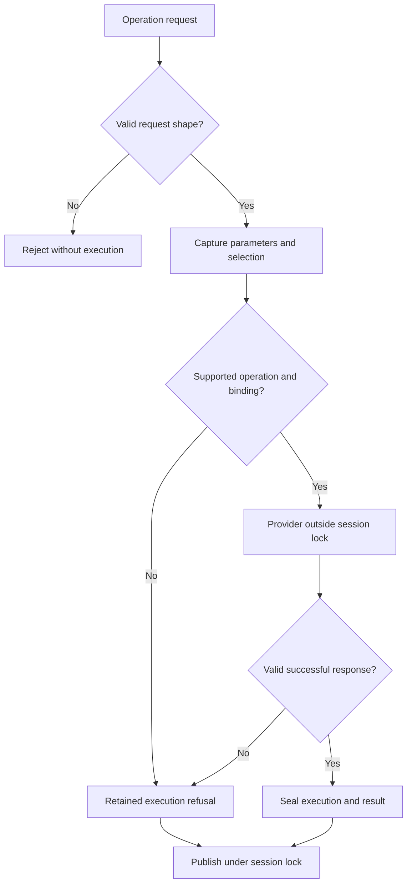
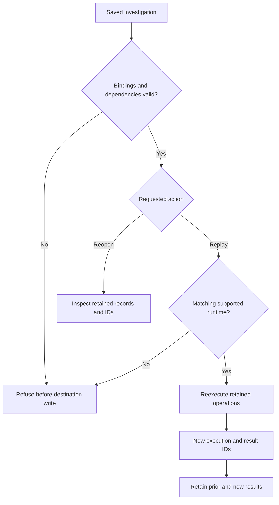

# Executable architecture

For the current public component inventory and integration boundaries, see the
[Notation Systems stack map](STACK.md) and [this component's role](STACK_ROLE.md).

This document describes the implementation in this repository. Exact wire and
record fields are specified in [PROTOCOL.md](PROTOCOL.md); supported operations
and their qualifications are listed in [INSTRUMENTS.md](INSTRUMENTS.md).

## Components

| Component | Implemented responsibility |
| --- | --- |
| `src/ciw/core/` | Structural scientific-record validation, content identities and typed covariance artifacts |
| `src/ciw/adapters/` | Declared manifests, explicit adapter registry, offline payload readers and bounded pinned subprocess execution |
| `src/ciw/operations/` | Versioned operation registration, captured inputs and selections, retained execution/refusal and result envelopes |
| `src/ciw/session.py` | Shared selection, immutable retained results, workspace save/reopen and dependency validation |
| `src/ciw/server.py` | Local WebSocket transport for the authoritative session |
| `src/ciw/cli.py` | Terminal commands for analysis, service access and supported investigations |
| `godot/` | Optional oscillator 2D/3D rendering and interaction client |
| `src/ciw/adapter-runtimes.json` | Explicit current and historical source pins for external numerical providers |

Scientific engines remain in their authoritative repositories. The workbench
maps inputs, checks declared record structure and source relationships, retains
provenance, and invokes explicitly bound providers. Saved manifests and runtime
metadata do not register code or authorize execution.

## Scientific records and identities

`run.v1` retains timestamps, declared units and frames, full-resolution channels
and provenance. Generic records embed a `ciw.instrument-manifest.v1`. Missing
observations remain explicit; they are not converted to zero or fabricated by
rendering. Render geometry is a representation and never a calculation input.
Adapter resolution uses the instrument and embedded manifest, not `run_schema`
alone. An unknown instrument needs a valid embedded manifest; its record-only
reader validates declared units and frames without executing a provider. An
operation absent from an adapter's declared list is refused as
`unsupported_operation`; a listed operation with no bound adapter is refused as
`adapter_unavailable`. Manifest `role` currently accepts any nonempty string;
it is not the closed role vocabulary enforced for registered operations.

Operation executions use `ciw.execution.v1`; successful operations produce a
separate `ciw.operation-result.v1`. A refused invocation has an execution record
and no result. Evidence, operation, execution, result and verification identities
serve different purposes and are never interchangeable. Numerical checks,
content digests and replay equality do not create verification identities.

Operation identities have the form `<name>.v<n>` with a positive integer version;
`.v2` is supported as well as `.v1`. A syntactically valid identity does not bind
code. Trusted process setup registers operations and saved-payload validators.
The runner captures effective parameters and selection, passes detached inputs
to the provider outside the session lock, validates and seals its response, and
retains refusals without a result. The session publishes those records under its
lock. Malformed requests are rejected before admission without an execution;
failures after `operation.execute` accepts a request become retained refusals.
Legacy `analysis.*` results keep their original flat format.

The original oscillator workspace format remains readable. Workspaces retaining
operation executions use version 2. Reopening validates source/result bindings
and retained dependencies before writing a destination. Explicit replay retains
prior results and creates new execution/result identities. JSPT dependencies
must resolve to a retained result and its exact named covariance; missing,
mismatched or cyclic references are refused before any destination write.

### Admission and retained outcomes

The gate labels summarize the operation runner, not a new status vocabulary.
A refused accepted invocation retains its execution but has no successful
result. Input capture and result publication bound the provider call; they do
not turn the session lock into a process sandbox.

## Selection and clients

The session owns the current channel, playback cursor, half-open analysis
interval, coordinate frame and selection revision. Playback and analysis support
are separate. Selection updates carrying a stale revision are rejected.
Operations retain the selection under which they ran. Each domain operation
specifies its supported interval semantics; GTE requires the interval to contain
its entire retained batch.

The terminal and optional viewport are clients of the same service. Closing the
viewport does not stop the backend. The current Godot client supports oscillator
representations and declines unsupported external-instrument view contracts.

## Runtime binding and persistence

External providers use an explicitly supplied clean checkout and interpreter.
The subprocess adapter verifies source revision/tree, interpreter digest and
recorded dependency versions, bounds execution time and output, and accepts a
versioned finite-JSON response or refusal. These checks detect identity drift;
they are not a sandbox or a proof of scientific correctness. A nonzero child
exit is `RUNTIME_FAILED`; an unavailable executable, process or interpreter probe is
`RUNTIME_UNAVAILABLE`; pipes left open after the child exits are `RUNTIME_IO`.

Current and historical bindings are allowlisted by the workbench. Replaying a
saved investigation requires its supported source pin and matching runtime.
Saved content cannot extend the allowlist, choose arbitrary executable imports,
or silently substitute the latest engine.

The service uses a local filesystem workspace. The default bind is loopback;
container publication and native-process controls are documented in
[deploy/](../deploy/README.md). Public network authentication, a production
multi-user service, streaming acquisition and general binary transport are not
implemented.

### Reopen and replay are separate actions

Reopening calls no numerical provider. A saved manifest cannot supply an
executable or extend the trusted allowlist. The separate telemetry container
adds scoped content and numerical replay checks described in
[TELEMETRY.md](TELEMETRY.md); its verification receipts are not a property of
every shared-workspace replay. More stack views are in the
[diagram atlas](DIAGRAMS.md).

## Calibration and uncertainty

Calibration applicability at acquisition is retained independently of expiry at
serving time. Present expiry does not rewrite historically applicable evidence.
The [covariance contract](COVARIANCE.md) describes ordered quantities, units,
frames, reference values, full matrices, assumptions and source identities.
Schema validation does not infer independence, unit conversions, uncertainty
completeness, metrological traceability or physical validity.

The live `session.get`, `result.list` and `result.get` read surfaces accept an
optional timezone-aware `evaluated_at` timestamp. For measurement-chain runs,
serving status appears alongside the response data, leaving the saved result
unchanged; it is never hashed into evidence. Oscillator responses do not acquire
calibration status. See [PROTOCOL.md](PROTOCOL.md) for the exact field placement.

The implemented covariance path uses `ciw.rci-source.v2`,
`fsrt.tank-reconstruct.v2` and `jspt.covariance-propagate.v1`.
`ciw covariance` operates on a saved investigation and `ciw covariance-replay`
re-executes its retained propagation inputs through the pinned provider. The
original `fsrt.tank-reconstruct.v1` path and supported historical runtime pins
remain readable and replayable under their documented bindings.

Each provider retains its own scientific scope. FSRT's physical balance check
is not an NIS/NEES qualification; JSPT does not establish that a supplied Jacobian
is correct; GTE's native tangent covariance is conditional on exact declared
geometry; PLSR's terminal bundle remains separate from shared investigations.
Their operating guides state the supported paths and limitations.

## Verification

Python tests cover record and operation integrity, selection/replay behavior,
refusals, covariance admission and explicit runtime bindings. Integration gates
exercise pinned scientific repositories. Godot checks exercise import and the
implemented client protocol. See [DEVELOPMENT.md](DEVELOPMENT.md) for commands.
Computational test success does not certify a physical measurement or device.
