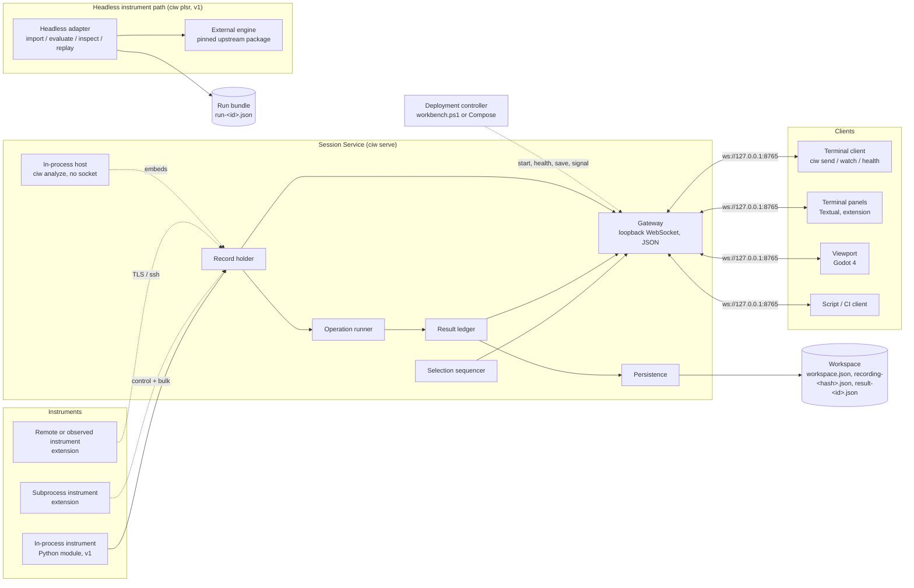
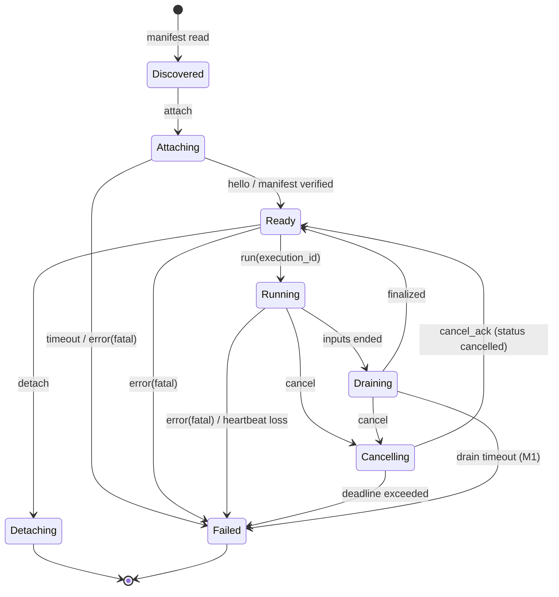
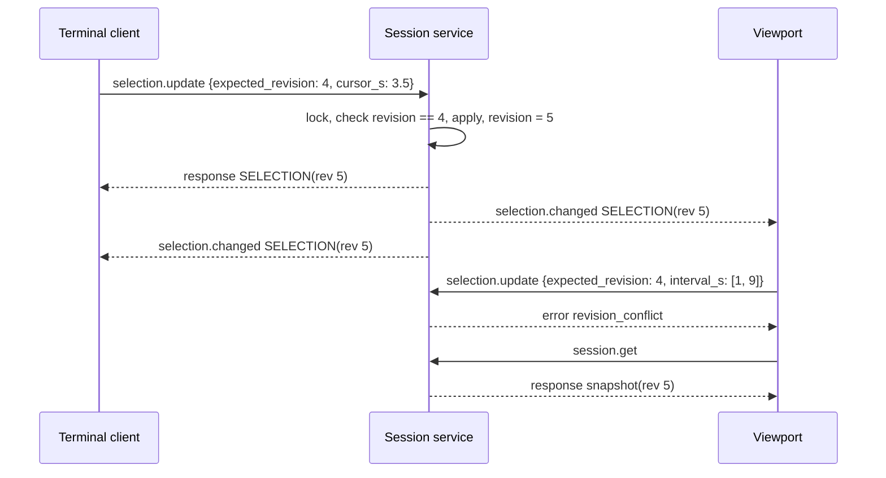

# Computational Instrumentation Workbench — Architecture

Short form: **CIW**. Protocol baseline: version 1, as implemented in `src/ciw/` and specified in [`docs/PROTOCOL.md`](PROTOCOL.md). Normative statements carry identifiers `CIW-<AREA>-<NNN>` with MUST / SHOULD / MAY wording; Section 16.4 maps every identifier to its verification, milestone, and prototype status.

## 1. Summary

The Computational Instrumentation Workbench is:

> A terminal-first workbench that connects computational instruments to synchronized numerical, temporal, spectral, and 2D/3D representations of physical-system observations and estimated states.

**What it is.** A small runtime, the *session service*, that attaches computational instruments (measurement sources, state estimators, field reconstructions, model integrators, signal-processing stages) through one contract, holds the scientific record and the shared selection for one investigation, executes operations on that record, and serves records and results to clients. Two frontends exist: a terminal client, which is the control surface and works alone, headless, and over SSH; and a Godot 2D/3D viewport, which attaches to the same service over the same protocol and owns no calculation; any script or CI job that speaks the session protocol is an equally ordinary client. The recurring operation loop is the same for every instrument: attach a source, select quantities and a domain, run an operation, inspect the result, compare, save or replay.

**What it guarantees.**

- The service is authoritative. Clients render what the service holds and compute nothing that produces a record; render geometry is never used to compute a measurement.
- Every result carries an envelope: what it is, which quantities and units it contains, what its timestamps and coordinates mean, how it was produced, and separate evidence, operation, execution, and verification identities. Results are immutable; recomputing creates a new execution and result.
- All views share one revisioned selection: run, channel, half-open analysis interval, playback cursor, coordinate frame. Changes are sequenced by the service and broadcast to every client in one order. The cursor is separate from the interval; moving it never recomputes an analysis.
- From M1, observations and estimated states are distinct kinds with one styling convention in every view; from M3, estimates carry their declared uncertainty. v1 holds a single synthetic recording without kinds or uncertainty and states this as a limit.
- Under the streaming extensions, ingest never loses data silently: the bulk path is credit-based end to end and every drop is recorded as a gap.

**How it is structured.** Five components with fixed boundaries: the **Session Service** (record, selection, operations, results, persistence, gateway), **Instruments** (in-process today; subprocess, remote, and observed bindings as extensions), the **Terminal Client** (`ciw` CLI today; Textual panels as an extension), the **Viewport** (Godot 4), and the **Workspace** (a JSON file today; a session directory as an extension). A headless instrument path (Section 8.13) drives an external instrument from the terminal client without the service and writes self-contained run bundles that carry the same identities. Two deployment paths (Section 5.8), a native controller and a container backend, run the same service and restart it from the workspace saved at shutdown with run, evidence, execution, and result identities intact. Section 6 states the v1 baseline as built and presents everything beyond it as versioned extensions with identifiers and target milestones.

**How to read this document.** Readers evaluating the system need Sections 1, 2, 4, 5, 14, and 18. Sections 6 through 13 and 16 are the normative catalogue implementers work from: each requirement carries an identifier, and Section 16.4 maps every identifier to its verification method, milestone, and prototype status.

**Reference implementation.** Service, instruments, and terminal client in Python 3.11+ with NumPy (SciPy where needed); Textual panels as an extension of the scriptable CLI; Godot 4 as the viewport, a client over a loopback WebSocket carrying text JSON in v1 and binary buffers with an explicit descriptor as an extension; in-terminal braille and half-block rasters as an extension (M1), always rendered and sufficient when no viewport is attached, with Kitty, iTerm2, and Sixel graphics where detected (M4). A Rust host with ratatui and Arrow is the documented alternative for a later native path; every contract is language-neutral.

**Roadmap.** The prototype (v0.1) is milestone M0: the session service, both clients, the workspace, the two deployment paths with saved shutdown, resume, and a health probe, and the headless adapter for the Parameterized Lyapunov Stability Runtime (PLSR), which delivers the adapter part of M1 but not the manifest, the subprocess binding, session attachment, or capability-driven views (Section 13.8 lists the items). M1 completes the existing-instrument adapter and places the scalar/time-series reference instrument (a) behind an adapter with its headless calculation and tolerances preserved (Phase 1, the general instrument boundary) and specifies the calibration contract with the deterministic software bench (13.10; Phase 2, the executable calibration bench, an affine displacement correction first); M2 adds a persistence adapter that reuses an external evidence-and-result infrastructure's identities without merging them (Phase 3, comparable investigations); M3 the state-estimation reference instrument with uncertainty and revisions (Phase 4, path-state estimation) together with the physical calibration bench and the first calibrated real instrument (Phase 5, physical validation); M4 the spatial reference instrument with binary frames and viewport resources; M5 spectrograms, streaming with separate acquisition, publish, and render rates, cancellation, and stale-result handling; M6 a deployment for a stated use with measured workloads. The five phases and the evidence each needs to advance are tabled in 18.2; the next increment is Phase 1 plus one affine-calibration fixture carried through Phase 2 with its failure cases and offline replay. The adapter seam precedes the persistence adapter deliberately: the record, session, and protocol still carry assumptions of the built-in synthetic instrument (13.9) that a real adapter exposes and a storage layer would only inherit; the oscillator stays reference instrument (a) rather than being replaced, and a broad refactor of the shared abstractions waits until the second instrument shows which of them are genuinely shared. Readiness stages standalone-ready, workbench-ready, and deployment-ready are defined in Section 18.

## 2. Purpose, scope, and non-goals

### 2.1 Definition

> A terminal-first workbench that connects computational instruments to synchronized numerical, temporal, spectral, and 2D/3D representations of physical-system observations and estimated states.

Each word of the name has a role:

- **Computational** covers the estimation, reconstruction, integration, and signal-processing backends, not just directly measured values.
- **Instrumentation** keeps the focus on investigating physical systems through measurements, models, and diagnostics.
- **Workbench** describes an environment in which several instruments and analytical operations can be used together. It does not imply that the visualization layer replaces those instruments.

Within the definition: *terminal-first* means the primary, fully capable interface is a terminal that works headless and over SSH; richer 2D/3D output may use terminal graphics protocols or an auxiliary viewer, but the terminal remains the control surface. *Synchronized* means the four representation families share time base, cursor and selection, units, and the same underlying data, and a change in one is reflected in the others deterministically. *Observations* (measured data, kind `observation`; quantities computed from other channels carry kind `derived` with `derived_from`, Section 7.2) and *estimated states* (outputs of estimators, reconstructions, integrators) are distinct kinds of data, distinguishable in the data model and in every view, including uncertainty. The workbench *connects* instruments; it does not absorb them. Instruments are replaceable backends behind a contract. The engineering title, *Integrated Measurement, State Estimation, and Visualization Workbench*, appears only in the README subtitle and in technical abstracts.

### 2.2 Position

CIW is a foundational instrumentation runtime and workbench: a common layer underneath specialized tooling. It stays small because it captures recurring operations, not because it omits their meaning; it needs no universal physical model, only a consistent way to connect, execute, inspect, compare, and record specialized models and measurements. **The workbench supplies the operating environment; the instrument supplies the scientific meaning.** Views are capability-driven, never compulsory: a scalar instrument does not need a mesh, a recorded-data instrument does not need a live device connection, a spatial instrument does not get a spectral panel unless the analysis is meaningful. Generality lives in the contract, not in one format: the result envelope and the execution contract are standardized; payload types and engines are not. Be strict about meaning at the boundary; be flexible about implementation behind it.

Frontends are clients of the computation, as several Jupyter frontends attach to one kernel and receive different representations of its outputs; neither the terminal client nor the viewport owns a separate calculation. Virtual instrumentation as National Instruments describes it separates acquisition, drivers, software-defined processing, and presentation and builds larger systems from smaller instrument functions; this design belongs to that family. The SciJava Ops work shows that a plugin mechanism is not data-structure interoperability and that adaptation layers are still needed; that is why meaning is standardized at the boundary. ROS 2 real-time design documentation distinguishes meeting deadlines from being responsive; that is why service level is separate from representability (Section 5.5).

### 2.3 Scope and protocol ownership

This document specifies the conceptual model, components and process model, the protocol v1 baseline and extension policy, the data model and envelope, the instrument contract at the level of semantics, the synchronization model, the representation layer, sessions and reproducibility, operator interaction, the extension model, the reference stack, the repository layout, budgets and conformance, risks, and the roadmap. It owns protocol semantics: message families, required fields, ordering, backpressure, cancellation, errors, versioning policy, invariants. The concrete wire specification (exact encodings and schemas, handshake sequences, version negotiation) is [`docs/PROTOCOL.md`](PROTOCOL.md), which must satisfy every requirement here; wire details are not repeated.

### 2.4 Non-goals

- A hard real-time runtime. The terminal/viewport link is not suitable for deadline-critical control loops; time-critical execution stays in an engine or controller that the workbench configures, observes, and inspects through a declared interface.
- A universal physical model, state vector, or data format.
- A database, an operating system, or a universal solver. Where a deployment has an evidence-and-result infrastructure, the workbench is an instrumentation workspace over it through an adapter (Section 13.4).
- A signal-processing or estimation library; those are instruments.
- A browser frontend as the primary interface; one may be added later as another client.

### 2.5 Baseline and extensions

Every requirement is marked **v1** (implemented in the prototype) or **extension** (versioned addition with a target milestone). No extension may contradict a v1 invariant: authoritative service, clients own no calculation, cursor separate from interval, revisioned selection, immutable results, distinct identities, render geometry never measured. Limits of v1 are stated as limits, never as capabilities.

## 3. Glossary
| Term | Meaning |
|---|---|
| **Session** | One live service instance holding one investigation; `session_id` is assigned at start and again on reopen. |
| **Run** | One recording `{run_id, evidence_id, instrument, metadata, time_s[], channels{}, render{}}`, never an execution; one per session in v1. |
| **Evidence** | The content a result was computed from; `evidence_id` is a content hash of the run's scientific record. |
| **Operation** | A named, versioned computation (`statistics.v1`, `spectrum.periodogram.v1`); `operation_id`. |
| **Execution** | One invocation of an operation on evidence; `execution_id`. |
| **Result** | The immutable record an execution produced: envelope plus operation-specific `data`; `result_id`. |
| **Verification** | An explicit check of a result against declared criteria, never inferred from a displayed scene; `verification_id` is `null` with `verification_status: "not_verified"` until one exists. |
| **Selection** | The shared state `{run_id, channel, interval_s, cursor_s, coordinate_frame, revision}`. |
| **Revision** | Integer incremented on every accepted selection update; updates carry `expected_revision`. |
| **Cursor** | The playback position `cursor_s`, separate from the analysis interval. |
| **Interval** | The half-open analysis interval `interval_s: [start, end)` that operations consume. |
| **Snapshot** | The `session.snapshot` event and `session.get` response (session id, `RUN_METADATA`, selection, result summaries; from M1 `view_settings` and `protocol_minor`); in the extension also the immutable `(revision, W, t_tick, seen)` of one render tick (CIW-SYNC-010). |
| **Render geometry** | Backend-prepared, non-measurement display data (`run.render`) resolving to retained samples through `sample_indices` with a declared `transform`. |
| **Workspace** | The persisted session `{workspace_version, saved_at, run, selection, results[], view_settings{}}`. |
| **Instrument** | A computational backend behind the contract (source, estimator, reconstruction, integrator, signal-processing stage); declared by a manifest (extension). |
| **Observation** | Measured data, or data a source declares as its measurement; kind `observation`. |
| **Estimated state** | Output of an estimator, reconstruction, or integrator; kind `estimate`, with a declared uncertainty form. |
| **Derived** | A quantity computed from other channels; kind `derived`, always with `derived_from`. |
| **Channel** | A named, unit-bearing sample sequence on one time base; a bare `channel_id` is unique within the session (CIW-SYNC-022). |
| **Time base** | The clock timestamps are expressed in: `time_s` seconds since run start (v1); named bases with clock, epoch, and mapping (extension). |
| **Frame** (data) | One batch of samples with a descriptor, the unit of streaming transfer; distinct from a *coordinate frame*, always written in full except as the `coordframe` verb (12.2). |
| **Coordinate frame** | A named spatial reference with parent, transform, handedness, and axis units. |
| **Representation / view** | A rendering in one of four families: numerical, temporal, spectral, 2D/3D; a *pane* hosts one. |
| **View settings** | Per-workspace presentation state (`view_settings`, empty in v1; fields in 9.6). |
| **Client** | A process attached over the session protocol: terminal client, viewport, or script. |
| **Credit** | Frames and bytes a consumer has authorized a producer to send (extension). |
| **Journal** | The append-only, sequence-numbered log of mutations, commands, and events (extension). |
| **Run bundle** | A self-contained immutable JSON file written by the headless path (8.13): inputs, output record, runtime identity, identities, digests. |
| **Short id** | The last label of an instrument's reverse-DNS `id`, unique among attached instruments; used in `stream` names (`<short id>/<output>`). |
| **PLSR** | Parameterized Lyapunov Stability Runtime, the first external instrument, integrated through the headless path (13.8). |

## 4. Conceptual model
The operation loop is the primary command and session model; each step maps to components and contracts:

| Loop step | v1 realization | Component | Contract |
|---|---|---|---|
| attach a source | `ciw serve --recording\|--workspace\|--resume` (v1: oscillator schema only, CIW-PERF-001); `ciw plsr evaluate` (8.13) | Session Service, Instrument | Instrument API (8.1), manifest (8.2), headless path (8.13) |
| select quantities and a domain | `selection.update {channel, interval_s, cursor_s}` | Session Service | Selection (Section 9) |
| run an operation | `analysis.stats`, `analysis.spectrum` | Session Service, Instrument | Results (7.8), contract (Section 8) |
| inspect the result | `sample.get`, `result.get`, `ciw inspect`, viewport cards | Terminal Client, Viewport | Section 10 |
| compare | `result.list`; comparison views (extension) | Terminal Client | Sections 10 and 12 |
| save or replay | `workspace.save`; `ciw serve --workspace`; `ciw inspect` | Workspace | Section 11 |

Instruments produce runs and results, the service holds them, clients render them. An execution has fixed parameters and inputs and one `execution_id`; a view is a subscription to records at a requested resolution plus the shared selection, changed only through an update carrying the observed revision; a workspace is run plus selection plus results, reopened without executing anything. The service knows runs, channels, units, time bases, kinds, identities, the selection, and the loop; the instrument knows the equations and declares which representations apply.

## 5. Component architecture

### 5.1 Components


| Component | Responsibility | Never does |
|---|---|---|
| **Record holder** | Holds the validated float64 record and render geometry; `run.get`, `sample.get`. | Modify a retained sample. |
| **Selection sequencer** | Applies `selection.update` under one lock, increments `revision`, rejects stale updates, broadcasts `selection.changed`. | Recompute anything. |
| **Operation runner** | Executes operations on retained samples over an explicit interval. | Read render geometry or reductions. |
| **Result ledger** | Wraps `data` in the envelope, assigns `execution_id` and `result_id`; `result.get`, `result.list`. | Mutate or delete a result. |
| **Gateway** | Terminates connections, rejects non-text and non-JSON frames (`invalid_request`), hands decoded requests to the session (envelope validation, `request_id` echo), sends `session.snapshot` on connect, fans out broadcasts. | Mutate the selection outside the sequencer. |
| **Persistence** | Writes recording, one file per result, and workspace atomically; reopens after full validation. | Run an operation while reopening. |
| **Instrument Supervisor** (extension) | Launches, monitors, detaches subprocess and remote instruments; grants credits; validates frames and envelopes at the boundary. | Interpret payloads beyond the envelope. |
| **Reducer** (extension) | `derived` reductions at view resolution, cached by key; fits spectra and spectrograms to a pane's width (CIW-SYNC-015). | Produce anything without provenance. |
| **Terminal Client** | Control surface: headless analysis, `send`, `watch`, `inspect`; panels, command line, keybindings, layouts, rasters (extension). | Compute a record as a client (`analyze` embeds the service, 5.2). |
| **Viewport** | 2D/3D renderer: phase portrait, backend-supplied energy surface and trajectory, shared cursor, cards from `sample.get`. | Reconstruct values from geometry; update the selection without the observed revision. |
| **Workspace** | `workspace.json`, `recording-<hash>.json`, `result-<id>.json`; a session directory in the extension. | Anything active. |
| **Headless adapter** (v1) | Drives an external instrument without the service, calling the upstream engine under a verified source pin and writing immutable run bundles with the identity model (8.13). | Attach to a session or publish to clients (extension, CIW-SESS-014); compute a verdict itself. |

Naming: the **Session Service** is the *Workbench runtime* of `README.md`; the **Terminal Client** is the *terminal frontend* of `README.md`; the **Viewport** is the 2D/3D viewport in all three.

### 5.2 Process model
| Process | Count | Survives |
|---|---|---|
| Session service (`ciw serve`) | One per session | Client disconnects; viewport close; instrument failures (extension) |
| Terminal client (`send`, `watch`, `analyze`, panels) | Zero or more | Service restart: `send` and `watch` exit with the codes of CIW-OPS-001 and are re-run to reattach; panels reconnect and request a snapshot (M1) |
| Viewport (Godot) | Zero or one by default | Service restart (shows STALE, offers Reconnect) |
| Subprocess instrument (extension) | One per instrument | Nothing beyond its lifetime; the service survives it |
| Remote or observed instrument (extension) | Zero or more, elsewhere | Service restarts (the service reattaches) |
| Headless instrument run (`ciw plsr evaluate\|replay`) | Zero or more, short-lived | Nothing; its bundle survives it |
| Deployment controller (`workbench.ps1`) or Compose | Zero or one per deployment | Service exit and restart (native `Status` re-reads `service.json`; Compose restarts under `on-failure:3`); holds no session state (5.8) |

The service is a separate process: a client crash cannot delay sequencing, a stalled client is bounded (v1: 5.3; from M1 off the sequencing path, CIW-SYNC-021), and both clients are served symmetrically. `ciw analyze` embeds the service in the terminal process without a socket, so its record and result come from service code. In-process instruments share the service's failure domain and are restricted to bounded calls; the subprocess binding is the default for anything else.

### 5.3 Threading inside the service
The service is Python; hot paths (socket I/O, NumPy kernels, memory copies) release the GIL. Only the main asyncio thread mutates the selection, under one `asyncio.Lock`, so broadcast order equals revision order across clients; operations, result file writes (fsync and rename), and workspace saves run in worker threads, and a result is registered under the session lock after its file write succeeds. In v1 the sequencer awaits delivery of `selection.changed` to every client under the lock, abandoning a send after the 2 s send deadline and then awaiting the close handshake, still under the lock, which with a full client receive window completes only when the WebSocket keepalive next runs (20 s interval) and its send expires the 2 s close deadline: one stalled client delays the next accepted update by up to 2 s + 20 s + 2 s, or indefinitely if a keepalive ping was itself blocked behind the paused transport, and CIW-PERF-002 does not hold for the other clients meanwhile. CIW-SYNC-021 removes this at M1. Extension threads (ingest, reducer pool, recorder, supervisor timers) post to the main loop and never mutate the selection.

### 5.4 IPC summary
Client ↔ service: the loopback WebSocket of 6.1, text JSON, no authentication, browser origins rejected, 1 MiB maximum incoming message, container bind per CIW-PERF-012; extensions add binary frames with a descriptor on the same connection, Unix socket and TCP with token or TLS, and SSH forwarding (14.1). Controller ↔ service: 5.8; no shutdown request in the client protocol (CIW-SESS-012). Service ↔ instrument: Python calls in v1 (8.1), budgeted by `max_call_ms` from M1 (CIW-INST-018); subprocess and remote links per 8.11. Service → terminal: JSON and event lines in v1; cells, braille, half-block, and Kitty, iTerm2, Sixel payloads as extensions (10.3).

### 5.5 Service classes
Whether the workbench can represent an instrument and whether a deployment meets its timing, throughput, precision, and reliability needs are separate questions; the deployment declares the class, and the service enforces placement.

| Class | Where the instrument runs | What the service does | Suitable for | Not suitable for |
|---|---|---|---|---|
| **Inline** | In-process binding (v1; budget and cap from M1) | Synchronous calls, from M1 budgeted by `max_call_ms` under CIW-INST-018 | Recorded runs, small deterministic transforms, adapters | Anything that can block, allocate unboundedly, or crash |
| **Local** (default from M1) | Subprocess, same machine | Full contract over stdio control and shared-memory bulk | NumPy engines, simulations, file readers, replay | Deadline-critical loops |
| **Remote** | Another machine | Full contract over `ssh://` or TLS; buffers inline or by reference | Large simulations, lab machines, special hardware | Deadline-critical loops |
| **Observed** | A dedicated engine or controller with its own timing | The adapter exposes configuration, state, and reduced telemetry; the loop never crosses the session protocol | Real-time controllers, hardware-timed acquisition | Being driven at the loop rate |

Not every workload runs in the same process, on the same machine, or at the same rate. A large simulation may provide reduced visualization data while its full results are retained elsewhere and referenced (`reduced_of`, 7.8).

### 5.6 Failure isolation
| Failure | Effect | Recovery |
|---|---|---|
| Client disconnects | Session unchanged | Reconnect; `session.snapshot` |
| Service stops (SIGINT/SIGTERM on POSIX; Windows: controller Stop) | Viewport shows STALE, disables shared interaction, offers Reconnect; `ciw send` exits 2, `ciw watch` 0; an operation in flight completes and its result is saved before exit (CIW-SESS-012) | `ciw serve --resume` (or `--workspace`) restores the saved workspace; `ciw health` confirms the session |
| Killed after the grace period, or power loss | Changes since the last completed save are lost | `workspace.save` before forced termination; `--resume` reopens the last save |
| Invalid request (v1 codes of CIW-INST-002) | `type: "error"` with `{code, message}`; session unaffected | Client corrects and retries |
| 1,024 results reached | `capacity_exceeded`; no result created | Save; start a new session |
| Storage error | `storage_error`; result not registered | Free space; retry |
| Instrument exits or misses 3 heartbeats (extension) | Instrument `Failed`; channels frozen and marked stale; open executions closed `status: failed`, `truncated_at {frame_seq, reason: instrument_failed \| heartbeat_loss}` | Manual restart by default; bounded `auto` (8.8) |
| Recorder cannot keep up (extension) | Ingest credits stop; the source's overflow policy applies; nothing accepted is lost | Free space or lower the rate |

### 5.7 Observability (extension, M5)
The service exposes its own operation as channels under the reserved instrument id `host` (ingest rate, credit balance, ring occupancy, reducer queue depth and latency, gateway backlog per client, journal sequence and commit lag), queryable headless with `ciw stats --json`; every request carries a `request_id` and every journaled event a sequence number.

### 5.8 Deployment paths and shutdown (v1)
Two deployment paths run the same service and protocol. Native controller (`scripts/workbench.ps1`: Setup, Start, Status, Stop): the service as a hidden process on `ws://127.0.0.1:8765` with a `.ciw/` data directory (recordings, results, `workspace.json`, logs, `service.json` ownership metadata); Stop saves and verifies the workspace over the client link and stops only the owned process; Start restores a saved workspace and errors on corrupt data rather than starting a new investigation. Container backend (Compose service `backend`): `ciw serve --bind 0.0.0.0 --resume --output-dir /data`; the host publishes only `127.0.0.1:${CIW_PORT:-8765}`; named volume `workspace` at `/data`; read-only root filesystem, tmpfs `/tmp`, all capabilities dropped, no-new-privileges, non-root uid 10001; `stop_grace_period` 30 s; `restart: on-failure:3`; Docker healthcheck via `ciw health`. See [`deploy/README.md`](../deploy/README.md) and [`deploy/CONTAINER.md`](../deploy/CONTAINER.md).

`CIW-SESS-012` (v1) On SIGINT or SIGTERM the service MUST stop accepting connections, drain clients, finish in-flight operations, save `workspace.json` to the output directory, then exit. There is no shutdown request in the client protocol; forced termination, termination after a container grace period, and power loss are not covered by autosave, and `workspace.save` is the explicit checkpoint. An ungraceful termination MUST leave the last saved workspace valid and reopenable; the loss window is everything since that save and MUST be stated as a limit, never as recovery. `serve --resume` MUST reopen `<output-dir>/workspace.json` when present, MUST start a new investigation only when no workspace exists, and MUST fail on corrupt or incompatible saved data. A restarted service assigns a new runtime `session_id`, which clients MUST NOT treat as persistent; run, evidence, execution, and result identities MUST NOT change across restart. The signal path is POSIX: on Windows a console SIGINT (Ctrl+C) takes the same save path through the process signal handler, untested in CI; any other termination is immediate and counts as forced, and the native controller's Stop (explicit `workspace.save` verified against the live session, then termination of the owned process only) is the supported saved-shutdown path.

`CIW-SESS-013` (v1) `ciw health --url` MUST be a read-only `session.get` request bounded at 3 s that runs no scientific calculation and creates no record, MUST validate the snapshot (protocol version, session identity, run identity, selection bounds), and MUST exit 0 printing `{status: "healthy", session_id, run_id}` or 2 otherwise.

`CIW-PERF-012` (v1) `serve --bind` MUST accept only `127.0.0.1` (default) and `0.0.0.0`; `0.0.0.0` MUST be used only inside a container network namespace whose host publishes a loopback port; browser-origin connections MUST be rejected on both binds; there is no authentication.

## 6. Protocol v1 baseline and extension policy

### 6.1 The v1 baseline
`CIW-INST-001` (v1) The session protocol MUST use the envelope `{protocol_version, request_id, type, payload}`: responses `type: "response"`, failures `type: "error"` with `payload: {code, message}`, broadcasts `request_id: null`. The service MUST send `session.snapshot` (the `session.get` payload) on connection; responses and broadcasts MAY interleave, and clients MUST correlate by `request_id`.

`CIW-INST-002` (v1) The service MUST implement the commands below and MUST reject, with a structured error and the session unchanged, a request with an unsupported `protocol_version`, extra envelope fields, a missing or over-long `request_id`, unknown payload fields, non-finite numbers, or booleans where integers are expected. The v1 error codes are `invalid_request` (malformed envelope or non-JSON/binary frame), `unsupported_version`, `unknown_command`, `invalid_payload`, `revision_conflict`, `not_found`, `capacity_exceeded`, and `storage_error`; a client MUST treat an unlisted code as an error of unknown class.

| Type | Semantics | Result |
|---|---|---|
| `session.get` | Snapshot without arrays | `{session_id, run: RUN_METADATA, selection, results: [RESULT_SUMMARY]}` |
| `run.get` | Full run with retained samples and render geometry | RUN |
| `selection.update` | Apply `{expected_revision, cursor_s?, interval_s?, channel?}`, at least one field | SELECTION; broadcast `selection.changed` |
| `sample.get` | Nearest retained sample to `time_s`, earlier on tie | `{run_id, evidence_id, sample_index, time_s, values{}, units{}}` |
| `analysis.stats`, `analysis.spectrum` | Run the operation on `channel` over `interval_s` (default: current selection) | RESULT |
| `result.get` | One result of this session | RESULT |
| `result.list` | Stored analyses, without running them | `{results: [RESULT_SUMMARY]}` |
| `workspace.save` | Write `workspace.json` to the output directory | `{workspace_file}` |

`CIW-PERF-001` (v1) The v1 limits MUST be stated as limits: one uniformly sampled recording per session; only the built-in oscillator record (channels exactly `q` (m), `v` (m/s), `energy` (J); `coordinate_frame` `oscillator-state`; the fixed `render` block with `axis_labels` `["q (m)", "energy (J)", "v (m/s)"]`, `trajectory`, `surface`, `sample_indices`, `transform`), so `ciw serve --recording` and `ciw analyze --recording` accept a file written by `ciw demo` or one with that schema and refuse any other; text JSON only, 1 MiB maximum incoming message; 1,024 results per session; loopback only at the host boundary (container: `0.0.0.0` inside the namespace, published on host loopback), no authentication; no streaming, cancellation, binary arrays, spectrograms, uncertainty, or device acquisition; local JSON persistence only. New analyses produce no event in v1 (CIW-INST-023 adds one at M1); v1 clients refresh `result.list`.

### 6.2 Extension policy
`CIW-INST-003` (v1; minor mechanism M1) `protocol_version` MUST be an integer major (1); a service MUST reject a major it does not implement with `unsupported_version` and MUST reject unknown request fields (CIW-INST-002; in v1 as built, every unknown field). From M1 the service MUST report `protocol_minor` in `session.snapshot`; an addition within a major MUST be an optional field or a new message type declared per minor in `docs/PROTOCOL.md`; a service MUST accept and ignore a declared optional request field it does not implement and MUST still reject undeclared fields; a client MUST ignore unknown optional fields and unknown broadcast types; any change to the meaning of an existing field or message type MUST increment the major. The instrument link carries its own version (CIW-INST-019).

`CIW-INST-023` (extension, M1) After a result is registered (file written, ledger updated under the session lock) the service MUST broadcast `result.created` (`request_id: null`, payload RESULT_SUMMARY with `source_kind`) to every client through the per-client queue of CIW-SYNC-021, in registration order relative to that client's selection updates; the requesting client MUST receive its response before its copy of the broadcast; an attached bundle (CIW-SESS-014) broadcasts the same way. A client MUST treat a missed or out-of-order broadcast as a reason to refresh `result.list` or request a snapshot, never as data loss.

`CIW-INST-024` (extension, M1) A frame larger than the maximum incoming message size (CIW-PERF-001) MUST be refused without partial parsing; the transport MAY close that connection instead of answering it, and the session and every other client MUST be unaffected. A `request_id` MUST be unique among one client's in-flight requests: the service MUST refuse a reused in-flight id with `invalid_request`, leaving the session unchanged and still answering the first request. A client MUST treat a transport close as a reason to reconnect and request a snapshot, never as a lost result. In v1 the size limit is enforced by the transport alone, the close code is unspecified, and `request_id` is echoed without a uniqueness check; these are stated as limits.

Each requirement's tag names its milestone; the table groups the extensions and lists their extension-tagged identifiers (a v1-tagged identifier with a later-milestone part, such as CIW-INST-003, CIW-DATA-008, CIW-DATA-011, CIW-DATA-013, is not repeated here). Every row targets protocol, envelope, and manifest majors 1 / 1 / 1; minors are declared per extension in `docs/PROTOCOL.md` (CIW-INST-003), and a row needing a new major would say so.

| Extension | Adds | Identifiers | Milestone |
|---|---|---|---|
| Manifest and adapter | Manifest, descriptors, capability-driven views, subprocess binding (batch), SDK shim, adapter, declared normalization, operations as instrument code, channel namespace, run identity, determinism harness, golden corpus, proto-check, bundle attachment, adapter latency | CIW-DATA-003, CIW-DATA-023, CIW-INST-005, CIW-INST-006, CIW-INST-007, CIW-INST-008, CIW-INST-009, CIW-INST-013, CIW-INST-014, CIW-INST-016, CIW-INST-018, CIW-INST-019, CIW-INST-020, CIW-INST-022, CIW-SESS-014, CIW-SYNC-022, CIW-VIEW-001, CIW-EXT-001, CIW-EXT-005, CIW-EXT-006, CIW-EXT-008, CIW-EXT-011, CIW-EXT-012, CIW-PERF-014 | M1 |
| Calibration contract and deterministic bench | Calibration profile and its record, raw immutability, corrected channels as derived result channels, calibration state with acquisition-time applicability and explicit expiry, profile refusal, deterministic fixture set, bench report and metric set, physical-bench declarations, execution placement, replay from local files, parameter covariance with its shared propagated term, held-out validation trials | CIW-CAL-001, CIW-CAL-002, CIW-CAL-003, CIW-CAL-004, CIW-CAL-005, CIW-CAL-006, CIW-CAL-007, CIW-CAL-008, CIW-CAL-009, CIW-CAL-010, CIW-CAL-011, CIW-CAL-012, CIW-CAL-013 | M1; M2 (in-session corrected run CIW-CAL-002, digest re-verification CIW-CAL-011); M3 (physical bench CIW-CAL-009, real-instrument replay CIW-CAL-011, measurement repeatability CIW-CAL-008, per-sample propagation CIW-CAL-012, physical trials CIW-CAL-013); M5 (late fixture classes CIW-CAL-006) |
| Unit grammar and reductions | UCUM grammar and dimension vector, display-unit preferences, min/max reductions | CIW-DATA-009, CIW-DATA-020, CIW-SYNC-014, CIW-PERF-006 | M1 |
| Result events and envelope v1.1 | `result.created`; protocol minor; payload types, `reduced_of`, `checks[]`, `refused` status, stale marker; non-blocking broadcast queues; transport-limit and request-id refusals | CIW-INST-023, CIW-INST-024, CIW-DATA-015, CIW-SYNC-021 | M1 |
| Terminal panels | Textual panels, tiers, command grammar, keybindings, layouts, scripts, `assert`, render tick, `view.update`/`view.changed` | CIW-VIEW-003, CIW-VIEW-004, CIW-VIEW-005, CIW-VIEW-006, CIW-VIEW-007, CIW-VIEW-008, CIW-VIEW-010, CIW-VIEW-011, CIW-VIEW-016, CIW-SYNC-009, CIW-SYNC-010, CIW-SYNC-012, CIW-SYNC-013, CIW-OPS-002, CIW-OPS-005, CIW-OPS-006, CIW-OPS-007, CIW-OPS-008, CIW-OPS-009, CIW-OPS-011, CIW-PERF-003 | M1 |
| Journal and session store | Sequence-numbered journal, session directory, several runs per session, replay, `verify` for operations, csv/arrow/npz exports | CIW-SYNC-008, CIW-SESS-005, CIW-SESS-006, CIW-SESS-008, CIW-SESS-009, CIW-SESS-010, CIW-SESS-015, CIW-OPS-004, CIW-EXT-003, CIW-VIEW-022 | M2 |
| Persistence adapter | Resolver mapping the identities to an external infrastructure; digests re-verified on read | CIW-SESS-016, CIW-EXT-004 | M2 |
| Uncertainty and revisions | Uncertainty forms and rendering, superseding results, `t_avail`, `as_of`, live parameters, `xy` plots, `verify` for instruments, estimator declarations and check vocabulary, two-sided consistency bands, unit-free observability, ablations as compared executions | CIW-DATA-010, CIW-DATA-017, CIW-DATA-018, CIW-INST-015, CIW-INST-025, CIW-INST-026, CIW-INST-027, CIW-VIEW-012, CIW-VIEW-018, CIW-OPS-013, CIW-EXT-002 | M3 |
| Binary frames and viewport resources | Bulk buffers on the client link, coordinate-frame tree and gaps, resources by id, shared camera, rasterizer and graphics tier, gltf/png exports | CIW-DATA-016 (bulk plane M1; client link M4), CIW-SYNC-018, CIW-VIEW-017, CIW-VIEW-020 | M4 |
| Streaming | Credits, cancellation, heartbeats, remote and observed bindings, time bases, follow-live, recording, `host` channels | CIW-DATA-005, CIW-DATA-006, CIW-DATA-007, CIW-INST-010, CIW-INST-011, CIW-INST-012, CIW-SYNC-011, CIW-SYNC-020, CIW-SESS-007, CIW-PERF-004, CIW-PERF-005, CIW-PERF-010 | M5 |
| Spectral expansion | Welch, spectrogram, frequency cursor, link groups | CIW-VIEW-014, CIW-VIEW-015, CIW-SYNC-019 | M5 |
| Deployment | Observed service class profile (R11), packaging, measured workloads, fault injection | CIW-PERF-009 | M6 |

## 7. Data model

### 7.1 The record
`CIW-DATA-001` (v1) A run MUST be `{run_id, evidence_id, instrument, metadata{duration_s, sample_rate_hz, sample_count, coordinate_frame, model{}, provenance{}}, time_s[], channels{name: {unit, values[]}}, render{}}`; `time_s` MUST start at zero, be strictly increasing, and be uniform at `sample_rate_hz` with the endpoint excluded; every channel MUST hold `sample_count` finite float64 values; `RUN_METADATA` MUST omit arrays; the service MUST validate the complete run at load and reject any non-finite value. In v1 as built the validator accepts only the oscillator schema of CIW-PERF-001; arbitrary channel sets are an M1 extension through the descriptor of CIW-DATA-003.

`CIW-DATA-002` (v1; single definition M1) `evidence_id` MUST be `sha256:` plus the SHA-256 of the canonical JSON (sorted keys, no whitespace) of `{instrument, metadata, time_s, channels}`; a run whose content does not match MUST be refused. The digest scope MUST have exactly one definition, applied by producer and reader alike; a field a record carries outside that scope is unhashed and MUST NOT be treated as evidence. This detects inconsistent content, not authenticity or scientific verification.

`CIW-DATA-022` (v1 field; meaning M1) `metadata.model{}` describes how a record's values were generated and is meaningful only for generated evidence; v1 requires the field of every record and defines no contents, which is stated as a limit. From M1 a record MUST carry exactly one of `model{}` for generated evidence (its equations, parameters, and the definitions its channels follow) or `acquisition{}` for a measured record (device identity, configuration, calibration reference, and the settings the samples were taken under); an adapter MUST NOT record acquisition settings as a model, and an empty `model{}` MUST be refused rather than accepted as a formality.

`CIW-DATA-023` (extension, M1) `run_id` MUST identify one acquisition: an instrument MUST allocate a new `run_id` for every run it produces, and two runs differing in `evidence_id` MUST NOT share one. `run_id` is an identity, never a content hash (that is `evidence_id`, CIW-DATA-002) and never a fixed literal; the v1 demo's constant `run-damped-oscillator-demo-v1` is admissible only because the record is deterministic and its `evidence_id` is constant with it, which is stated as a limit.

### 7.2 Channels and kinds
`CIW-DATA-003` (extension, M1; uncertainty form mandatory M3) From M1 a channel descriptor MUST carry `channel_id`, `kind`, `dtype`, `shape` (inner shape per sample), `unit`, `time_base`, `coordinate_frame` or `null`, `missing`, and `uncertainty` (a form, `none`, or absent); MUST carry `components[]` when `shape` is non-scalar; and MAY carry `cursor_policy` (`nearest` when omitted; `at_or_before` per CIW-SYNC-007). From M3 an `estimate` channel MUST carry a form or `none` with a `reason`. `representations[]` is declared per output (CIW-INST-005, CIW-INST-006) and per result envelope (CIW-DATA-013), never per channel. `kind` MUST be `observation`, `estimate`, `derived`, or `reference`; any producer MAY emit any kind; a `derived` channel MUST carry `derived_from[]` naming its inputs' kinds, so a quantity derived from an estimate (innovation, residual) is never presented as an observation; `reference` marks ground truth used for comparison. A calibration-corrected quantity is `derived` too: `derived_from[]` names its inputs' kinds, and the calibration profile that produced it is named in provenance, never in `derived_from[]` (CIW-CAL-003). Recorded or synthetic evidence standing in for a measurement is `observation` (the v0.1 oscillator's `q`, `v`, `energy`, once descriptors exist at M1); the output of an estimator, reconstruction, or integrator run inside the session is `estimate`.

### 7.3 Time bases and sampling
`CIW-DATA-004` (v1) Sample times MUST be `time_s`, float64 seconds relative to run start, with `metadata.provenance.time_reference` stating the reference; intervals and cursors on the wire MUST use the same unit; cursors MUST lie within the first and last retained timestamps; an interval end MAY equal `duration_s`.

`CIW-DATA-005` (extension, M5) A time base MUST declare `id`, `clock ∈ {monotonic, wall, sim}`, `epoch`, and `resolution_ns`; streamed timestamps MUST be `int64` nanoseconds relative to the epoch. Bases are declared by a source's data `envelope` or a run's `metadata.time_bases[]` and registered by `id`; a redeclaration with different fields MUST be refused (`time_base_conflict`). The reserved base `run` is the v1 recording base (`epoch` = run start, `resolution_ns` = 1, `t_ns = round_half_even(time_s × 1e9)`); a manifest `time_base` of `input:<name>` resolves at attach to the bound channel's base. From M5 the per-base ns fields of CIW-SYNC-020 are authoritative: a float bound is converted once by that rule and membership is evaluated in integers as `start_ns ≤ t_ns < end_ns`; the result envelope records the executed `interval_ns` alongside `interval_s`, and `ciw verify` re-executes from it. A base whose `epoch` does not let float64 seconds resolve its `resolution_ns` MUST be addressed through the ns fields only, a float update for it rejected with `precision_insufficient`. Channels in different bases MUST NOT be combined without a declared `mapping {offset_ns, drift_ppb, valid_from, source, version}` with evidence; the default is no mapping, one cursor per base, and `unmapped` in views. A device-clocked source MUST send `clock_sync {tb_ns, host_ns}` at the cadence set in `docs/PROTOCOL.md`; the service MUST fit offset and drift, store raw timestamps unmodified with the mapping alongside, and version each refit.

`CIW-DATA-006` (extension, M5) A channel MUST declare `regular {rate, phase, jitter_tol}` (`jitter_tol` default set in `docs/PROTOCOL.md`), `irregular`, or `event` sampling; regular frames MAY carry `(t0, dt, n)`. Timestamps MUST be non-decreasing within a channel (`time_order` on violation), equal timestamps kept in arrival order; a regular sample off its grid by more than `jitter_tol` MUST be rejected with `sampling_grid` unless a gap precedes it. Spectral operations MUST require regular sampling. A readiness or health probe MUST validate a record against its declared regime, never against a fixed one (CIW-SESS-013).

`CIW-DATA-007` (extension, M5) The service MUST NOT resample implicitly: resampling MUST be an explicit derivation whose provenance names the method (`hold`, `linear`, `nearest`, `pchip`) and `gap_policy` (default `nan`), with uncertainty handling defined per method (`hold` and `nearest` copy σ; `linear` combines the neighbours' variances). A spectral operation on an `irregular` or `event` channel MUST be refused with `sampling_irregular`; the operator MAY first create an explicit `resample` derivation. Default methods: `linear` for observations (including residuals between observations), `none` for estimates (refused unless a method is named).

### 7.4 Units
`CIW-DATA-008` (v1; grammar M1) Every channel MUST declare a UCUM case-sensitive unit with `/` and integer exponents (`m`, `m/s`, `J`, `m/s2`, `rad`, `1`, `Cel`); the v1 spectrum reports `(<unit>)^2/Hz`, which the M1 grammar accepts along with rational exponents (`Hz^(-1/2)`). From M1 the descriptor MUST carry the dimension vector over the seven SI base dimensions plus two sub-dimensions, `angle` and `log`, not interconvertible with `1` (`rad` and `deg` convert only to each other; `dB[V]` and `dB[W]` not to each other). Affine units (`Cel`) MUST appear in arithmetic only as differences. A unit `status: unknown` is legal for raw counts; an `unknown` channel MUST NOT feed a dimension-constrained operation, MUST NOT share an axis with a known channel, and MUST be flagged. Dimension mismatch MUST be refused with `dimension_mismatch`; scale mismatch MUST NOT be converted silently, the service offering an explicit `convert` derivation recorded in provenance.

`CIW-DATA-009` (extension, M1) Unit preferences MUST be display-only: stored values stay in the declared unit; factor and offset are applied at render and export and recorded in the export sidecar; conversion MUST also apply to σ, intervals, and covariance (`J Σ Jᵀ` with the diagonal scale Jacobian); a derived spectral unit MUST be computed as `(<unit>)^2/Hz`.

### 7.5 Uncertainty
`CIW-DATA-010` (extension, M3) Uncertainty, when present, MUST be `stddev`, `variance`, `covariance` (default full row-major `[d, d]` per sample; `packed_lower` and `block_diagonal` MAY be declared), `interval {lower, upper, level}`, `quantiles`, or `ensemble {members}`; absent uncertainty MUST be absent, never zero; it MUST travel as companion columns of the same channel with the same time column. Covariance MUST be symmetric positive semi-definite; the service SHOULD check symmetry and MAY check semi-definiteness by sampled Cholesky, reporting failures as channel-scoped warnings; a unit-quaternion state MUST declare its covariance in the tangent space (`[3, 3]`, `rad2`). A companion column is addressed as `<channel_id>.<column>` with the column fixed by the form (`.stddev`, `.variance`, `.covariance`, `.lower` and `.upper`, `.quantiles`, `.ensemble`; the mask of CIW-DATA-011 is `.mask`); it is not a channel: it MUST NOT be listed in a frame's `channel_ids[]`, its `unit` and `shape` MUST equal the form's, a manifest MUST NOT declare a `channel_id` equal to a companion name, and the boundary check of CIW-INST-019 MUST accept exactly these columns and no other undeclared column. An uncertainty term shared across the samples of one execution, which a per-sample companion column cannot express, travels as a per-execution payload block under CIW-CAL-012, never as a companion column.

### 7.6 Coordinate frames and missing data
`CIW-DATA-011` (v1; extended M4) Every run and spatial channel MUST name a coordinate frame; in v1 `metadata.coordinate_frame`, `render.coordinate_frame`, and the selection's `coordinate_frame` MUST match. From M4 a coordinate-frame declaration MUST carry `id`, `parent` or `null`, `transform` (4×4 row-major float64 to the parent, or a time-indexed transform channel), `handedness`, and axis `units`; chains MUST be acyclic; a spatial view MUST refuse to overlay channels in different frames unless a transform is registered. Missing data MUST be declared per channel as `nan`, `mask` (companion boolean column; required for integer, complex, and table columns), or `none`; gaps MUST be recorded as data `{from, to, reason ∈ {overflow_drop, source_unavailable, cancelled, resample_max_gap, declared, retention}}` that survive persistence and replay; reducers MUST propagate missing values as gaps.

### 7.7 Render geometry
`CIW-DATA-012` (v1) Render geometry (`run.render`) MUST be backend-prepared and non-measurement: it MUST name `coordinate_frame` and `axis_labels` with units, MUST resolve every render point k to a retained sample through strictly increasing `sample_indices[k]`, MUST declare a visual-only `transform {origin, scale, note}`, and MUST never be used to compute a measurement or readout; numerical cards MUST come from `sample.get`. From M1 `render` MAY be absent: an instrument declaring no spatial representation (CIW-VIEW-001) MUST NOT be obliged to fabricate geometry, and a run without it offers only the families its channels support. From M4 mesh topology and point positions MAY be sent once as resources by id; level of detail MUST be declared by the instrument or produced by the reducer with a declared method.

### 7.8 Results and the result envelope
`CIW-DATA-013` (v1; fields added M1) A result MUST be `{result_id, evidence_id, operation_id, execution_id, verification_id, verification_status, run_id, selection_revision, channel, interval_s, created_at, recording_file, data}`. From M1 (envelope v1.1) the run-bound fields `run_id, selection_revision, channel, interval_s, recording_file` are grouped as `run_binding`, required for operations on the session run and `null` for an attached run bundle, which instead carries `source {kind: "bundle", bundle_file, bundle_digest}`; v1 results keep the flat fields. The five identity fields MUST be distinct, never derived from one another; two executions of one operation on one evidence MUST share `operation_id` and `evidence_id` and differ in `execution_id` and `result_id`; from M1 an operation with parameters MUST fold a canonical parameter hash into `operation_id`. `verification_id` MUST be `null` and `verification_status` `not_verified` until a distinct verification execution references the result; verification MUST never be inferred from a displayed scene. From M1 the envelope MUST also carry `envelope_version`, `kind`, `channels[]` (descriptors per CIW-DATA-003), `payload {type}`, `representations[]`, `status ∈ {partial, complete, refused, cancelled, failed}` (`refused` per CIW-DATA-021), `calibration{}` (the calibration state of CIW-CAL-004, a third axis independent of `status` and of `verification_status`), and optionally `reduced_of`, `supersedes {result_id, interval}`, `checks[]` (instrument self-checks; they never set `verification_id`), `tracking{}` (the tracking status of CIW-INST-025, estimator instruments only, from M3), and `truncated_at {frame_seq, reason ∈ {cancel, instrument_failed, heartbeat_loss, transport, retention}}`, the last valid `frame_seq` of an execution that ended before `end_of_stream`. RESULT_SUMMARY is `{result_id, operation_id, execution_id, channel, interval_s, selection_revision, created_at, verification_status}` (`result.get` returns the full result; encoding in `docs/PROTOCOL.md`); from M1 it also carries `source_kind` (CIW-SESS-014), `status`, and `calibration{}` (CIW-CAL-004) in the envelope's own shape, recomputed on serving by the rule of that requirement so a summary never reports a calibration state, or an `expired` at one `evaluated_at`, that a `result.get` on the same result at that `evaluated_at` would contradict, and declared in the same protocol minor as the envelope field. Without it the snapshot clause of CIW-CAL-004, the `result.created` broadcast of CIW-INST-023, and the calibration flags of CIW-VIEW-008 would have no field to carry.

`CIW-DATA-014` (v1) Results MUST be immutable and MUST capture the `selection_revision` and exact `interval_s` that produced them; `data` MUST be computed from full-resolution retained samples in the half-open interval, never from render geometry or terminal summaries; saved results MUST be validated on reopen (identity form, source binding, shape of `data`) without executing the operation.

`CIW-DATA-015` (extension, M1) `payload.type` MUST be `array`, `table` (columns sharing a time column; Arrow IPC at rest), `mesh`, `sparse` (COO or CSR), or `reference` (URI, content hash, referenced type). A `reference` MUST carry an inline `summary` of a concrete type so views render without dereferencing; dereferencing MUST be explicit and record the resolved hash; an unresolvable reference MUST NOT fail the envelope. An output declared `reduced_of` delivers visualization-resolution data while the full result is retained elsewhere and referenced; views MUST show that data is reduced. A `table` payload MAY additionally carry `blocks {<block id>: {kind, derived_from[], unit | units, values, …}}`, per-execution tables without a time column (the joint posterior covariance, information blocks, and eigenbasis of CIW-INST-025 and CIW-INST-027, and `correction_uncertainty` of CIW-CAL-012); a block id is what `source {kind: payload_block, id}` of CIW-INST-005 resolves against, a manifest naming a block id the instrument's declared outputs do not list is refused, and a block is not a channel: it is never listed in `channels[]` or a frame's `channel_ids[]`.

`CIW-DATA-021` (v1 headless bundles; M1 session envelope) A result MUST carry an outcome status separate from transport errors and from verification. A refusal (the instrument declines to evaluate or certify: for PLSR the numerical refusals `NUMERICAL_INCONCLUSIVE` and `NUMERICAL_OVERFLOW`, category `numerical_refusal`, and the domain refusals `OUTSIDE_PARAMETER_BOX` and `OUTSIDE_LEVEL_SET`, category `outside_declared_domain`) and a violation (`NOT_CERTIFIED`, category `certificate_violation`) MUST be stored as valid results with the raw instrument status code and every verdict field retained, MUST NOT be reported as `type: "error"` or a nonzero exit, and MUST NOT set or imply any verification outcome; an input, configuration, or execution failure is an error and produces no result. From M1 the envelope `status` set of CIW-DATA-013 MUST include `refused`.

v1 result as written to `<output-dir>/result-<id>.json`, envelope v1.1 fields marked `+`:

```json
{
  "result_id": "result-3f9c2a7e0b1d4c6e8a5f7b9d1e3c5a70",
  "evidence_id": "sha256:6b1f…c2",
  "operation_id": "statistics.v1",
  "execution_id": "execution-9d0e5b4a3c2f1e8d7b6a5c4f3e2d1b0a",
  "verification_id": null,
  "verification_status": "not_verified",
  "run_id": "run-damped-oscillator-demo-v1",
  "selection_revision": 4,
  "channel": "q",
  "interval_s": [2.0, 8.0],
  "created_at": "2026-09-20T10:14:03.221000+00:00",
  "recording_file": "recording-8a2c…e1.json",
  "data": {"sample_count": 384, "mean": -0.0132, "minimum": -0.5811, "maximum": 0.6094, "rms": 0.2937, "unit": "m"},
  "+envelope_version": "1.1",
  "+kind": "derived",
  "+channels": [{"channel_id": "q.stats", "kind": "derived", "derived_from": ["observation"], "dtype": "f64", "unit": "m", "shape": [],
                 "time_base": "run", "coordinate_frame": null, "missing": "none", "uncertainty": "none"}],
  "+payload": {"type": "table"},
  "+representations": ["numerical"],
  "+status": "complete"
}
```

### 7.9 Frames and the binary descriptor
`CIW-DATA-016` (extension, M1 instrument bulk plane; M4 client link) A bulk frame MUST carry a descriptor sufficient to interpret its buffers without the envelope: `frame_seq`, `execution_id`, `stream` (`<instrument short id>/<output name>`), `result_id` or `channel_ids[]`, a time column or `(t0, dt, n)` with its `time_base`, and per buffer `channel_id` (`null` for the time column), `column` (`value` or a companion column of CIW-DATA-010), `dtype`, `shape`, `byte_order` (`little`), `order` (`C`), `byte_offset`, `byte_length`, `unit`, and `coordinate_frame` for a spatial buffer. The default transfer and at-rest format is NumPy-compatible raw contiguous buffers with this descriptor; Arrow IPC (pyarrow) is the format for table payloads and export and MAY be negotiated per link; buffers MUST NOT be embedded in text records. On the client link bulk frames share the connection with control messages: a frame or resource message MUST be at most the maximum message size set in `docs/PROTOCOL.md` (larger resources chunked), the bulk ahead of any control message is bounded by the subscription's outstanding credit (CIW-INST-010), and a client MUST grant only credit its link drains within the 2 s stall deadline of CIW-SYNC-021.

Instrument-link `data/frame` record (CIW-INST-008) from reference instrument (b); at M4 the service forwards the same `payload` to subscribed clients as a `frame` broadcast (`bulk` replaced by the binary WebSocket message that follows), framing per `docs/PROTOCOL.md`:

```json
{
  "family": "data", "type": "frame", "seq": 90311,
  "payload": {
    "stream": "path-state/state", "frame_seq": 4182,
    "execution_id": "execution-9d0e5b4a3c2f1e8d7b6a5c4f3e2d1b0a",
    "channel_ids": ["path.lat0", "path.head0"],
    "time": {"column": 0, "time_base": "encoder_mono"},
    "buffers": [
      {"channel_id": null, "dtype": "i64", "shape": [256], "byte_order": "little", "order": "C", "byte_offset": 0, "byte_length": 2048, "unit": "ns", "coordinate_frame": null},
      {"channel_id": "path.lat0", "column": "value", "dtype": "f64", "shape": [256], "byte_order": "little", "order": "C", "byte_offset": 2048, "byte_length": 2048, "unit": "m", "coordinate_frame": "path"},
      {"channel_id": "path.lat0", "column": "stddev", "dtype": "f64", "shape": [256], "byte_order": "little", "order": "C", "byte_offset": 4096, "byte_length": 2048, "unit": "m", "coordinate_frame": null},
      {"channel_id": "path.head0", "column": "value", "dtype": "f64", "shape": [256], "byte_order": "little", "order": "C", "byte_offset": 6144, "byte_length": 2048, "unit": "rad", "coordinate_frame": "path"},
      {"channel_id": "path.head0", "column": "stddev", "dtype": "f64", "shape": [256], "byte_order": "little", "order": "C", "byte_offset": 8192, "byte_length": 2048, "unit": "rad", "coordinate_frame": null}
    ],
    "bulk": {"binding": "shm", "segment": "ciw-7f3a-000091", "byte_length": 10240}
  }
}
```

### 7.10 Revisions of estimated states
`CIW-DATA-017` (extension, M3) Results MUST NOT be mutated to revise an estimate: a smoother or fixed-lag estimator MUST emit a new result whose envelope carries `supersedes {result_id, interval}`, the earlier result remaining, marked superseded over that interval. Estimate channels MUST carry validity time (`t_valid`) and availability time (`t_avail`, when the service committed it). View settings MAY carry `as_of`; when set, estimate views MUST show results with `t_avail ≤ as_of` and MUST mark `as_of` with a second, distinct cursor.

`CIW-DATA-018` (extension, M3) A `derived` result computed from channels with uncertainty MUST declare `propagation ∈ {linear, dropped, exact}`; `dropped` MUST render as a visible `σ-DROPPED` flag, never a fabricated value; the default for spectra is `dropped`. A reduction (CIW-DATA-020) is not a propagation: it carries the per-bucket σ extrema of its source channel, declares no `propagation`, and MUST NOT be flagged `σ-DROPPED`; the flag applies only to results of operations.

### 7.11 Provenance and versioning
`CIW-DATA-019` (v1; journal M2) `workspace_version`, `protocol_version`, and from M1 `envelope_version` and `manifest_version` MUST be checked on read; a reader MUST refuse a higher major and, from M1 when a second workspace major exists, MUST name the converter. `metadata.provenance` MUST name generator and version, dtype, time reference, and sampling convention, and for an external instrument the runtime identity of CIW-EXT-009; from M1 an adapter's record MUST also carry the applied normalization mapping of CIW-EXT-011 and, where a correction was applied, the calibration reference of CIW-CAL-003 — the profile's `result_id`, its `bundle_digest`, and its validity interval — which the workspace MUST retain so a reopened session can name the profile its numbers came from (CIW-CAL-011). From M2 the journal MUST record for every execution the operation, parameters, seed, input identities, manifest hash, and a `platform {os, arch, python, numpy, scipy, blas {name, version}, fft {name}, threads}` record, which `ciw verify` MUST also record for its own run.

### 7.12 Reductions

`CIW-DATA-020` (extension, M1) A reduction of a channel to a view's resolution MUST preserve per-column minimum and maximum and, with uncertainty, `max(value + σ)` and `min(value − σ)`; MUST carry the `selection_revision` it was computed for; and a level-of-detail pyramid MUST yield the same envelope as a direct reduction over raw samples, including after a superseding result (property test). Readouts MUST come from full-resolution samples, never from a reduction.

## 8. Instrument contract

### 8.1 The v1 in-process instrument API

`CIW-INST-004` (v1) The v1 in-process instrument module (`ciw.instruments`) MUST provide `make_demo_run() -> dict` (or an equivalent loader), `validate_run(run)`, `run_metadata(run) -> dict`, `inspect_sample(run, time_s) -> dict`, `compute_statistics(run, channel, interval_s) -> dict`, and `compute_spectrum(run, channel, interval_s) -> dict`. Computations MUST validate the complete source recording and their inputs, MUST read full-resolution float64 retained samples, and MUST return operation-specific `data` only; the session wraps provenance and persistence. `compute_spectrum` in v1 MUST be a one-sided, constant-detrended, periodic-Hann periodogram PSD with density normalization `fs · Σw²`, interior bins doubled, DC and the even-length Nyquist bin not doubled, returning `{sample_count, method, window, detrend, scaling, frequency_hz[], psd[], unit, peak_frequency_hz, sample_rate_hz}`; it is not Welch and not a spectrogram.

### 8.2 Manifest
`CIW-INST-005` (extension, M1) Every instrument MUST ship `instrument.json` with `manifest_version`, `id` (reverse-DNS; its last label is the short id, which MUST be unique among attached instruments or `attach` is refused with `instrument_conflict`), `version` (semver), `title`, `binding ∈ {inprocess, subprocess, remote, observed}`, `entrypoint` or `endpoint`, `determinism` with optional `tolerance {abs, rel}`, `isolation`, `max_call_ms` (`inprocess` only; default 50 ms; the built-in oscillator declares 100 ms), `heartbeat_ms`, `restart {policy, max}`, `parameters[]` (name, type, unit, default, range, `scope ∈ {execution, live}`, optional `source ∈ {selection.cursor, selection.interval}`), `inputs[]` (name, accepted kinds, dimension, shape, sampling, required), `outputs[]` (name, `mode ∈ {stream, batch}`, channel descriptors, `representations[]`, `blocks[]` naming the per-execution payload block ids the output delivers (CIW-DATA-015), and `overflow` for a `stream` output only), `normalization[]` (one entry per declared channel: the upstream `quantity`, `unit`, `epoch` or `time_base`, `coordinate_frame`, `sampling`, and `missing` convention, and the record-model field each maps to; required of an adapter under CIW-EXT-011), and `checks[]` (one entry per declared check: `name` from the vocabulary of CIW-INST-025; `source {kind ∈ {channel, payload_block, tracking}, id}` naming what the check evaluates; `statistic {name, args{}}`, the name being a statistic of CIW-OPS-011 or one CIW-INST-025 declares for that check; `against`, a `reference` channel id or `null`; `bound {op ∈ {lt, le, gt, ge, within}, value | lower, upper, unit}`, the per-instrument tolerance, never a global accuracy figure, `within` carrying `lower` and `upper` as CIW-INST-026 requires of a consistency check; `samples{}` and `residual` where CIW-INST-026 requires them; and an optional `description`, an operator-facing label that is never evaluated). From M1 an adapter that applies a correction MUST declare it in `calibration[]`, one entry per corrected channel naming the source channel, the transform form with its parameters or the profile field they are read from, the input and output units, and the declared input domain (CIW-CAL-003); an output that supplies an operation MUST name its `operation_id`, which under CIW-EXT-008 is what a `batch` output supplying one declares, and an output that names no `operation_id` supplies none, so an instrument's **supported numerical operations** are declared beside the visual families of `representations[]` (CIW-INST-006) and neither declaration governs the other; an estimator additionally declares `solver` and `validity_domain` (CIW-INST-025) and `reference_scales` (CIW-INST-027). The service MUST refuse a manifest that fails schema validation and MUST record the manifest hash in provenance; the format is JSON (D4).

`CIW-INST-006` (extension, M1) An output's `representations[]` MUST be a subset of the families that accept its shape; the service MUST offer only those families.

Manifest of reference instrument (b), a batch linear-Gaussian path-state estimator, trimmed to the declared fields (`lag_s > 0` re-solves as measurements accumulate and emits superseding results; at M3 both outputs are executed in batch over the recorded input, the `residual` output's declared `mode: stream` and `overflow` taking effect at M5):

```json
{
  "manifest_version": "1.0",
  "id": "org.ciw.ref.path-state",
  "version": "0.3.1",
  "title": "Batch linear-Gaussian path-state estimator",
  "binding": "subprocess",
  "entrypoint": ["python", "-m", "ciw_ref_instruments.path_state"],
  "determinism": "deterministic",
  "tolerance": {"abs": 1e-12, "rel": 1e-9},
  "isolation": "process",
  "heartbeat_ms": 1000,
  "restart": {"policy": "manual", "max": 3},
  "solver": {"method": "qr", "explicit_inverse": false},
  "validity_domain": {"path.lat0": {"max_abs": 0.02, "unit": "m"}, "path.head0": {"max_abs": 0.05, "unit": "rad"}},
  "reference_scales": {"path.lat0": {"value": 0.01, "unit": "m"}, "path.head0": {"value": 0.02, "unit": "rad"}},
  "parameters": [
    {"name": "measurement_noise_density", "type": "f64", "unit": "m/Hz^(1/2)", "default": 2.0e-5, "range": [0, 1], "scope": "execution"},
    {"name": "lag_s", "type": "f64", "unit": "s", "default": 0.0, "range": [0, 10], "scope": "execution"}
  ],
  "inputs": [
    {"name": "encoder", "kinds": ["observation", "derived"], "dimension": "m", "shape": [2], "sampling": "regular", "coordinate_frame": "path", "required": true},
    {"name": "metrology", "kinds": ["observation", "reference"], "dimension": "m", "shape": [3], "sampling": "regular", "coordinate_frame": "bench", "required": true}
  ],
  "outputs": [
    {"name": "state", "mode": "batch", "operation_id": "path_state.solve.v1", "representations": ["numerical", "temporal", "spatial2d"], "blocks": ["information_measurement", "information_prior", "posterior_covariance", "information_eigenbasis"],
     "channels": [
       {"channel_id": "path.lat0", "kind": "estimate", "dtype": "f64", "shape": [], "unit": "m",
        "coordinate_frame": "path", "time_base": "input:encoder", "missing": "nan", "cursor_policy": "nearest",
        "uncertainty": {"form": "stddev"}},
       {"channel_id": "path.head0", "kind": "estimate", "dtype": "f64", "shape": [], "unit": "rad",
        "coordinate_frame": "path", "time_base": "input:encoder", "missing": "nan", "uncertainty": {"form": "stddev"}}
     ]},
    {"name": "residual", "mode": "stream", "representations": ["numerical", "temporal", "spectral"], "overflow": "block",
     "channels": [
       {"channel_id": "path.innovation", "kind": "derived", "derived_from": ["observation", "estimate"], "dtype": "f64", "shape": [], "unit": "m",
        "coordinate_frame": null, "time_base": "input:encoder", "missing": "nan", "uncertainty": {"form": "stddev"}},
       {"channel_id": "path.nis", "kind": "derived", "derived_from": ["observation", "estimate"], "dtype": "f64", "shape": [], "unit": "1",
        "coordinate_frame": null, "time_base": "input:encoder", "missing": "nan", "uncertainty": "none"}
     ]}
  ],
  "checks": [
    {"name": "innovation_nis", "source": {"kind": "channel", "id": "path.nis"}, "residual": "predictive_innovation",
     "statistic": {"name": "mean", "args": {}}, "against": null,
     "samples": {"effective_count": 300, "independence": {"basis": "thinned", "stride": 4, "reason": "encoder innovations decorrelate beyond four samples at the declared rate"}},
     "bound": {"op": "within", "lower": 1.78, "upper": 2.23, "unit": "1"},
     "description": "time-averaged NIS inside the two-sided 95 % chi-square band for 300 independent two-dimensional innovations"},
    {"name": "covariance_coverage", "source": {"kind": "channel", "id": "path.lat0"},
     "statistic": {"name": "coverage", "args": {"sigma": 2}}, "against": "bench.truth_lat",
     "bound": {"op": "ge", "value": 0.95, "unit": "1"}},
    {"name": "information_eigenvalues", "source": {"kind": "payload_block", "id": "information_measurement"},
     "statistic": {"name": "eigen-min", "args": {}}, "against": null,
     "bound": {"op": "ge", "value": 1.0e-4, "unit": "1"}, "description": "smallest eigenvalue of the measurement information in reference-scaled coordinates"},
    {"name": "acquisition_latency", "source": {"kind": "tracking", "id": "tracking"},
     "statistic": {"name": "latency", "args": {}}, "against": null,
     "bound": {"op": "le", "value": 0.5, "unit": "s"}, "description": "estimate usable within the declared arc length of the first measurement"}
  ]
}
```

`CIW-INST-025` (extension, M3) An estimator instrument MUST declare its numerical-conditioning obligation, its linearization validity domain, and its check vocabulary in the manifest (CIW-INST-005). The implementation MUST use a square-root method (QR or Cholesky) and MUST NOT form an explicit inverse of an information or covariance matrix, declared as `solver {method, explicit_inverse: false}`. A measurement model linear in an error state is valid only inside a declared bound: the manifest MUST declare `validity_domain` per estimated quantity, and a result whose posterior falls outside it MUST be marked — as a `refused` result of category `outside_declared_domain` (CIW-DATA-021) where the instrument declines to certify it, otherwise as a failed declared check — and MUST NOT be presented with an unqualified posterior covariance, which would be optimistic. The declared check vocabulary available to an estimator, each a `checks[]` entry with a stated pass condition and a tolerance declared per instrument and never as a global accuracy figure, is `posterior_error` (against a `reference` channel where truth exists), `covariance_coverage` (how often truth lies inside the predicted interval; `coverage --sigma`, CIW-OPS-011), `innovation_nis`, `estimation_nees`, `information_eigenvalues` (observability of the accumulated measurement information alone, in reference-scaled coordinates, CIW-INST-027), and `acquisition_latency` with `track_loss` (the instrument's own declaration of when an estimate became usable and when it was lost). Each name fixes its statistic: `posterior_error` uses `rms-error --against` (CIW-OPS-011) over the estimate channel; `covariance_coverage` uses `coverage --sigma` against a two-sided `bound {op: within, lower, upper}` on the covered fraction, declared in the form CIW-INST-026 fixes for the consistency checks, so a covered fraction above `upper` (an inflated covariance covers everything) fails exactly as one below `lower` does; `innovation_nis` and `estimation_nees` use `mean` (CIW-OPS-011) of the named normalized-square channel against the two-sided band, sample basis, and residual declaration of CIW-INST-026, with `nees --against` supplying the NEES channel, which over one estimate channel carrying `stddev` uncertainty is the marginal NEES of that quantity alone and MUST be declared `nees_marginal`; the joint NEES over the full posterior covariance of all estimated quantities is formed from the `posterior_covariance` payload block (`source.kind: payload_block`) and MUST be declared `nees_joint`; a check MUST name which it evaluates, and a marginal check MUST NOT be presented as evidence about the joint estimate; `information_eigenvalues` uses `eigen-min` over the reference-scaled measurement-information block `information_measurement` of the result payload (`source.kind: payload_block`, CIW-INST-027); `acquisition_latency` and `track_loss` use `latency` and `loss-count` over the declared `tracking{}` status (`source.kind: tracking`). `eigen-min`, `latency`, and `loss-count` are check statistics declared here, not additions to the `assert` vocabulary of CIW-OPS-011. An estimator MUST declare tracking as a fourth, instrument-owned status axis in the envelope, `tracking {state ∈ {not_acquired, acquiring, tracking, lost}, acquired_at, lost_at, reason ∈ {insufficient_information, outside_validity_domain, measurement_gap, null}}`, independent of the envelope `status`, of `verification_status`, and of `calibration.state` (CIW-CAL-004); `acquired_at` and `lost_at` are `time_s` values or `null`. The field belongs to the M3 envelope and MUST be declared as a protocol minor in `docs/PROTOCOL.md` under CIW-INST-003. A client MUST render `tracking.state` as delivered and MUST NOT derive it from residual magnitude, covariance size, or any other displayed quantity (CIW-VIEW-002). The checks `acquisition_latency` and `track_loss` evaluate this declared status; they do not define it. Behaviour under sensor removal and under calibration bias is not a check but an ablation (CIW-OPS-013, D37). A `checks[]` entry MUST NOT set `verification_id` (D29), and per-execution quantities — the joint posterior covariance of a state whose components carry different units, the measurement-information and prior-information blocks, and the eigenvalues and eigenvectors of the reference-scaled measurement information (CIW-INST-027) — MUST be delivered in the result payload (`payload.blocks`, CIW-DATA-015) with a declared unit per block, not as channels, because neither carries a per-sample time column (CIW-DATA-016); the observable and unobservable directions are accordingly delivered as derived payload blocks rather than as derived channels, which fixes their shape and not their kind; each such block MUST declare `kind: derived` with `derived_from` naming its inputs' kinds (CIW-DATA-003), so a payload block computed from an estimate is never presented as an observation. The bench report of CIW-CAL-007 reports these checks, the consistency rows labelled necessary and not sufficient under CIW-INST-026.

`CIW-INST-026` (extension, M3) The consistency checks `innovation_nis` and `estimation_nees` of CIW-INST-025 MUST be two-sided. Each entry MUST declare `bound {op: within, lower, upper, unit: "1"}` and MUST fail when the statistic falls below `lower` (under-confidence: an inflated covariance) as well as above `upper` (over-confidence); a one-sided `bound` under either name MUST be refused at manifest validation. The statistic is `mean` (CIW-OPS-011) of the named normalized-square channel over the evaluated interval, and the band is declared per instrument for the declared sample basis — chi-square bands are the natural form; this document states the inputs, not the derivation. Each `bound` MUST declare its basis, `basis {distribution, dof, level}` for a distributional band or `basis {kind: empirical, source}` for one taken from a declared corpus, and a `bound` with no declared basis MUST be refused at manifest validation: two limits with no stated origin cannot be audited. Each entry MUST declare `samples {effective_count, independence {basis ∈ {independent, thinned, declared}, stride, reason}}`: the number of samples the band was declared for and counted as independent, and why; the check MUST be evaluated over the samples the declared basis draws from the evaluated interval in time order — `independent` every sample (`stride: 1`) and `thinned` every `stride`-th sample from the first (`stride ≥ 2`), each evaluating exactly the first `effective_count` drawn samples; `declared` every sample (`stride: null`), `effective_count` being the number of them the `reason` justifies as independent, for which the band is declared — MUST be reported as unavailable rather than passed when the basis draws fewer than `effective_count` samples, and correlated samples MUST NOT be counted as independent, the report of CIW-CAL-007 carrying the raw `count`, the `effective_count`, and the basis beside the value. Each entry MUST declare `residual ∈ {predictive_innovation, post_fit_residual, state_error}`, naming whether the channel holds innovations of measurements against the prediction made before those measurements were fitted or residuals computed after fitting them: the two are different statistics with different expected distributions, `innovation_nis` MUST declare `predictive_innovation`, `estimation_nees` MUST declare `state_error` (the normalized error of the posterior against the `reference` channel named in `against`, never a measurement residual), and a post-fit residual MUST NOT be delivered as, named as, or evaluated as an innovation; a batch estimator that emits both MUST deliver them as distinct channels. Passing both checks is necessary and not sufficient for a correctly tuned estimator — an aggregate band admits compensating errors — and the bench report MUST label each consistency row `interpretation: necessary_not_sufficient` and MUST NOT summarize the checks as establishing correct tuning. `within` with `lower` and `upper`, `samples{}`, and `residual` are manifest fields under CIW-INST-005 and report fields under CIW-CAL-007; none is envelope-visible, so no protocol minor is needed.

`CIW-INST-027` (extension, M3) The observability check `information_eigenvalues` of CIW-INST-025 MUST evaluate measurement information alone. An estimator MUST deliver two per-execution payload blocks (`payload.blocks`, CIW-DATA-015; `kind: derived` with `derived_from` per CIW-INST-025): `information_measurement`, the accumulated measurement information `Gᵀ Σ⁻¹ G` formed through the square-root factors of CIW-INST-025 and never through an explicit inverse, and `information_prior`, the prior information `C₀⁻¹` formed as `R₀ᵀ R₀` from the prior's square-root information factor `R₀`, taken as declared when the prior is supplied in information form (a flat prior delivering the zero block) and otherwise obtained by triangular solves against the Cholesky factor of `C₀`, never by inverting `C₀`; the check's `source` MUST name `information_measurement`, and a posterior, a summed block, or the prior MUST be refused as its source at manifest validation, because a strong prior yields a narrow posterior in a direction the measurements do not identify. Before either block is formed, its eigenvalues taken, or the bound compared, the state coordinates MUST be scaled by `reference_scales {<channel_id>: {value, unit}}`, declared in the manifest for every estimated quantity in that quantity's unit, so the blocks and their eigenvalues are dimensionless (`unit: "1"`) and comparable across quantities carrying different units; a manifest declaring no reference scale for an estimated quantity MUST be refused, and `eigen-min` MUST be evaluated on the scaled block only. The observable and unobservable directions delivered in the payload MUST be expressed in the scaled coordinates, and each block MUST carry `state_order[]`, the estimated channel ids in the order of its rows and columns (row-major `[d, d]`, one order shared by every block of one execution, the joint posterior covariance of CIW-INST-025 included), and the `reference_scales` it was scaled by, beside its values, so a consumer maps a direction back to physical units from the block alone. `reference_scales` is a manifest field under CIW-INST-005; the block names are payload identifiers, not envelope fields, so no protocol minor is needed.

### 8.3 Lifecycle


`CIW-INST-007` (extension, M1 batch lifecycle for the subprocess binding; M5 Cancelling, `cancel_ack`, and stream mode) An instrument MUST follow the state machine above: Attaching, reply to `hello` with `manifest` within 5 s, verified against the on-disk copy; Ready, validate parameters and reply `ready` within 30 s of `attach`; Running, consume and emit as credits allow, `heartbeat` every `heartbeat_ms`, `progress` at least every 1 s in batch mode; Draining, emit remaining outputs, `end_of_stream` per output, then `finalized` with per-output content digests within 30 s; Cancelling, stop producing and send `cancel_ack` within `2 × heartbeat_ms`, frames already sent remaining valid and the envelope closed `cancelled` with `truncated_at {frame_seq, reason: cancel}`; Failed, emit `error(fatal)` before exit. On any expiry the service MUST move the instrument to Failed and terminate its process group (from M5 only after a `cancel` per CIW-INST-012 goes unacknowledged), retaining everything received and closing the envelope with `status: failed` and `truncated_at {frame_seq: <last valid>, reason: instrument_failed}`. Each `run` MUST carry a new `execution_id`; every transition MUST be journaled; concurrent executions require `concurrency > 1` in the manifest.

### 8.4 Message families
`CIW-INST-008` (extension, M1 families and batch types; M5 `credit`, `cancel`, `cancel_ack`, `gap`, `watermark`, `clock_sync`, `checkpoint`, `seek`) The instrument protocol MUST have exactly four families; each record carries `family`, `type`, `seq` (per direction, per link), and `correlation_id` for request/response pairs. Control and bulk data MUST travel on separate planes, buffers referenced by offset or segment name and never embedded in text records. `checkpoint` and `seek` are optional capabilities: an opaque blob a later `run` may resume from, so replay can seek without recomputing.

| Family | Direction | Types (minimum) |
|---|---|---|
| `control` | service → instrument | `hello`, `attach`, `set_params`, `run`, `cancel`, `detach`, `credit`, `ping`, `checkpoint` |
| `control` | instrument → service | `hello`, `manifest`, `ready`, `params_ack`, `run_ack`, `cancel_ack`, `pong`, `checkpoint`, `detached` |
| `data` | instrument → service | `envelope`, `frame`, `resource`, `gap`, `watermark`, `clock_sync`, `end_of_stream`, `finalized` |
| `data` | service → instrument | `input_frame`, `input_end` |
| `event` | both | `progress`, `log`, `heartbeat`, `check_result` |
| `error` | both | `error` |

### 8.5 Ordering
`CIW-INST-009` (extension, M1) Within one link direction records MUST be delivered in `seq` order; within one output stream frames MUST arrive in `frame_seq` order without gaps and the envelope MUST precede the first frame; an out-of-order frame MUST be rejected with `seq_gap`, never reordered. Across streams and instruments the journal defines the session order. Control and data on one link arrive in send order, so an instrument MUST check for control records at the cadence set in `docs/PROTOCOL.md` while draining input.

### 8.6 Backpressure
`CIW-INST-010` (extension, M5) Every bulk stream MUST be credit-based in frames and bytes: the consumer grants, the producer MUST NOT send without sufficient credit in both units, the consumer replenishes as it commits; defaults 64 frames and 64 MiB per instrument stream, 8 frames and 8 MiB per client subscription. The service is the only component that buffers between instruments, so a slow consumer bounds read-ahead and never stalls the producer; the recorder is a credit consumer with priority, and when it cannot keep up ingest credits stop. Until M5 a batch output is delivered whole after completion (CIW-INST-016) and no `credit` records are exchanged, a stated limit of the M1 binding.

`CIW-INST-011` (extension, M5) On exhausted credit an instrument MUST apply its output's declared overflow policy: `block` (default), `drop_oldest` (reporting the dropped range as a `gap` record), or `fail`; a deterministic or seeded instrument MUST NOT drop. Silent loss is not permitted; the conformance suite MUST withhold credit and assert that a `drop_oldest` source emits gaps.

### 8.7 Cancellation

`CIW-INST-012` (extension, M5) On `cancel(execution_id)` the instrument MUST stop producing for that execution and send `cancel_ack` within `2 × heartbeat_ms`; a non-acknowledging instrument MUST be moved to `Failed` and, for the subprocess binding, its process group terminated. Cancelling a client-requested analysis MUST leave earlier results untouched and MUST produce a `status: cancelled` result when partial frames were delivered; `status: cancelled` MUST be produced only in response to `cancel`, every other early end being `failed`.

### 8.8 Errors and restart
`CIW-INST-013` (extension, M1) Errors MUST be structured `{code, class, severity ∈ {warning, error, fatal}, recoverable, scope ∈ {link, instrument, execution, stream, frame}, message, detail}`, journaled and surfaced. Restart policy is `manual` by default; `auto` restarts a crashed subprocess at most `restart.max` (default 3) times after a `recoverable` error; every restart is a new execution.

| Class (code prefix) | Fatal default | Service action |
|---|---|---|
| `param_*` (`param_range`, `param_type`, `param_unknown`) | yes | Reported against the parameter; execution not started |
| `input_*` (`input_schema`, `input_unit`, `input_gap`, `input_nan`) | schema: yes; data: no | Data errors attached to the stream at `frame_seq`; markers on the temporal axis |
| `overrun` | no | Gap recorded and rendered |
| `resource_*` | yes | Execution failed; message shown |
| `numeric_*` (`numeric_diverged`, `numeric_singular`) | instrument's choice | A non-fatal numeric error MUST still emit a time-aligned sample (NaN value, infinite covariance) so estimate output never loses alignment |
| `transport` | yes (service-generated) | Envelope closed `status: failed`, `truncated_at {reason: transport}` |
| `contract` (bad seq, credit exceeded, descriptor mismatch, `call_overrun`) | yes (service-generated); `call_overrun` non-fatal below 10× the budget (CIW-INST-018) | Execution failed; offending record logged |
| `internal` | yes | As `resource_*` |

### 8.9 Determinism and parameters

`CIW-INST-014` (extension, M1) The manifest MUST declare `determinism` as `deterministic` (equal within declared `tolerance`; bitwise if none), `seeded` (deterministic given a `seed` the service supplies and records), or `nondeterministic`. `finalized` MUST carry a content digest per output, which the service computes independently. Deterministic and seeded instruments MUST produce the same sample sequence regardless of how inputs were split into frames; the SDK MUST ship a harness that re-frames inputs randomly; the conformance suite MUST verify determinism claims by re-execution for each reference instrument.

`CIW-INST-015` (extension, M3) A `scope: execution` parameter MUST NOT affect a running execution; it applies to the next `run` and yields a new `operation_id`. A `scope: live` parameter MAY change during an execution; every change MUST be journaled and recorded in the envelope's parameter history.

### 8.10 Streaming, batch, and selection isolation

`CIW-INST-016` (extension, M1 batch; M5 stream) A `stream` output MUST deliver frames as produced and end with `end_of_stream`; a `batch` output MUST deliver its envelope and all frames after completion, then `end_of_stream`; a batch execution over a selection MUST receive the interval explicitly and record it in the envelope.

`CIW-INST-017` (v1) Instruments MUST NOT read the selection or view settings; where an instrument needs the cursor or interval, the manifest MUST declare a parameter with `source: selection.cursor` or `selection.interval`, delivered with the `revision` it came from. v1 already works this way: `compute_statistics` and `compute_spectrum` receive `interval_s` explicitly and the result captures `selection_revision`.

### 8.11 Bindings
`CIW-INST-018` (extension, M1 subprocess; M5 remote, observed) Semantics MUST be identical across bindings, which differ only in transport; an instrument MUST run under `subprocess` and `remote` without code change, and an in-process instrument MUST be wrappable as a subprocess by a generic SDK shim. For the `inprocess` binding, from M1 the service MUST measure each call against the instrument's `max_call_ms` (CIW-INST-005; default 50 ms): an overrun MUST be journaled as a `contract` error `call_overrun`, non-fatal below 10× the budget; at 10× the caller stops awaiting, the instrument is marked `Failed` for further calls, and the running thread is abandoned, never killed, any value it returns later being discarded and journaled, never registered as a result; abandoned threads are capped (default 2), beyond which further in-process calls MUST be refused with `resource_exhausted`, naming the subprocess binding in the message. `resource_exhausted` is an M1 addition to the error codes of CIW-INST-002 under CIW-INST-003.

| Binding | Control plane | Bulk plane | Liveness | Isolation |
|---|---|---|---|---|
| `inprocess` (v1 binding; budget M1) | Python calls with the same record shapes | NumPy arrays by reference | v1: none (bounded calls by convention); from M1 the `max_call_ms` budget, measured after each call, never pre-empted | None |
| `subprocess` (default from M1) | Length-prefixed JSON on stdin/stdout; stderr as log | Shared-memory segment named in the frame record; inline fallback | Heartbeat | Process |
| `remote` | `ssh://host//path/exec` (stdio forwarded, no daemon) or TCP with TLS and token | Inline or `reference` payloads | Heartbeat | Process and machine |
| `observed` | Any of the above via an adapter | Reduced telemetry only | Heartbeat | The engine's own |

### 8.12 Versioning, invariants, conformance harness
`CIW-INST-019` (extension, M1) `hello` on the instrument link MUST carry `instrument_protocol {major, minor}`, independent of the client `protocol_version`; majors MUST match or the link is refused with `unsupported_version`; the minor in effect is the lower of the two; unknown fields on the instrument link MUST be ignored; manifest, envelope, and both protocol versions are independent. The service MUST enforce at the boundary that every frame column is a channel declared in the current envelope or a companion column of one (CIW-DATA-010), every buffer's byte length equals `dtype size × product(shape)`, timestamps are non-decreasing, the envelope's `kind` matches every channel's, every unit parses, and every spatial channel names a declared coordinate frame.

`CIW-INST-020` (extension, M1; M5 credit and cancel) `docs/PROTOCOL.md` MUST specify the concrete encoding for every requirement in this section and MUST ship a harness (`ciw-proto-check <manifest>`) that drives an instrument through attach, run (batch), and detach at M1, plus credit exhaustion and cancel at M5, reporting pass or fail per identifier.

`CIW-INST-022` (extension, M1 attach/detach/run/result.attach; M4 subscribe/credit; M5 cancel) The client session protocol MUST carry the operation loop as request types, encoded per `docs/PROTOCOL.md` as minor additions under CIW-INST-003: at M1 `instrument.attach {id | manifest_path, inputs{name: channel_id}} → {short_id, state}` (errors `instrument_conflict`, `channel_conflict`, `manifest_invalid`), `instrument.detach {short_id} → {state}`, `execution.run {short_id, parameters{}, interval_s?} → {execution_id}` (asynchronous per CIW-OPS-003; completion is the `result.created` broadcast of CIW-INST-023), `result.attach {bundle_file} → RESULT_SUMMARY` (CIW-SESS-014), and the broadcasts `instrument.changed {short_id, state}` and `execution.changed {execution_id, status}`; at M4 `stream.subscribe {stream | channel_ids[], resolution} → {subscription_id}`, `stream.unsubscribe`, and `stream.credit {subscription_id, frames, bytes}` (CIW-INST-010 defaults); at M5 `execution.cancel {execution_id} → {status}` (CIW-INST-012; `unsupported` before M5: an execution cannot be cancelled, and a terminated subprocess closes with `status: failed` per CIW-INST-007). Every such request MUST be sequenced and journaled (CIW-OPS-004) and MUST leave the selection unchanged.

### 8.13 Headless instrument path
`CIW-INST-021` (v1) An instrument MAY be driven from the terminal client without the session service. Such a run MUST be written as one self-contained immutable JSON bundle embedding the complete input declaration, the explicit sample or inputs, the instrument's own output record, and the runtime identity; it MUST carry separate `evidence_id`, `operation_id`, `execution_id`, `result_id`, and `verification_id` (`null`, `verification_status: "not_verified"`) and content digests whose relationships are validated on read; `inspect` MUST validate a bundle without recomputation; `replay` MUST re-evaluate the embedded inputs under new execution and result identities, record `replay_of` source bindings and an exact digest comparison, and MUST NOT modify the source bundle or promote verification. Adapter obligations toward the upstream engine are CIW-EXT-009; the catalogue rule is CIW-EXT-010.

`CIW-SESS-014` (extension, M1) A run bundle MAY be attached to a session by `result.attach {bundle_file}` (CIW-INST-022). The service MUST copy the bundle unchanged into the output directory under its own basename (`run-<result uuid>.json`, 13.8; M2: `bundles/`), refusing with `storage_error` when a file of that name holds different content; MUST verify `bundle_digest` on the copy; MUST register it as an immutable result of the workspace with its five identities and `verification_status` unchanged, `bundle_digest` as the source binding, and `bundle_file` recorded relative to the output directory exactly as `recording_file`; MUST NOT re-evaluate the bundle on attach or on reopen; and MUST refuse with `invalid_payload`, leaving the session unchanged, a bundle whose `result_id` or `execution_id` is already in the ledger. An attached bundle MUST appear in `result.list` and `result.get` as a result whose `payload` is a `reference` to the bundle (CIW-DATA-015) with the instrument's status record as the inline summary, with views offered only per CIW-VIEW-001. `results[]` MAY therefore hold results whose `evidence_id` differs from `run.evidence_id`; RESULT_SUMMARY MUST carry `source_kind ∈ {run, bundle}`, with `channel`, `interval_s`, and `selection_revision` `null` for a bundle row, which a client MUST tolerate only when `source_kind` is present (protocol minor 1.1). A workspace holding an attached bundle MUST be saved with `workspace_version: 2`, which a v1 reader refuses under CIW-SESS-004 (the v1 refusal names neither the found nor the supported major); a v2 reader MUST accept `workspace_version: 1`. Until M1 a bundle is handled only by the headless path.

## 9. Synchronization model

### 9.1 The shared selection
`CIW-SYNC-001` (v1) A session MUST have exactly one selection, held by the service; clients MUST NOT keep a divergent copy; every change MUST pass through `selection.update` or, from M5, the service's own follow mutation of CIW-SYNC-011, sequenced identically.

`CIW-SYNC-002` (v1) The selection MUST be `{run_id, channel, interval_s: [start, end), cursor_s, coordinate_frame, revision}`; the initial selection MUST be the run's default channel over the full run with the cursor at the first sample and `revision: 0`; the v1 default channel is `q` (fixed by `docs/PROTOCOL.md`), from M1 the first channel declared by the run's instrument manifest output.

```json
{"run_id": "run-damped-oscillator-demo-v1", "channel": "q", "interval_s": [2.0, 8.0],
 "cursor_s": 3.0, "coordinate_frame": "oscillator-state", "revision": 4}
```

`CIW-SYNC-022` (extension, M1) Channel references are bare `channel_id`s in one session namespace (a dot is part of the id). Every `channel_id` MUST be unique across the session's run and the declared outputs of every attached instrument, or `attach` MUST be refused with `channel_conflict`; the selection's `channel`, `view_settings.channels`, and every channel argument in 12.2 use this form (in v1 the namespace is the run's channels). Channels produced by an execution belong to its result (`channels[]`, CIW-DATA-013), become addressable when the envelope is committed, and are addressed in qualified form `<channel_id>:<execution_id>` (`:` never appears inside a `channel_id`). A bare id declared only by the run resolves to the run channel; a bare id produced by results MUST be resolved by the service, when the update or command is accepted, to the most recently committed non-superseded result declaring it (journal order from M2; `created_at` at M1), and the selection, `view_settings.channels`, and every broadcast MUST carry the qualified form; `compare` pairs, residuals, and `assert` expressions use it too.

### 9.2 Revisions and conflict
`CIW-SYNC-003` (v1) Every `selection.update` MUST carry `expected_revision`; the service MUST apply it only if equal to the current revision, MUST increment `revision` by exactly one, and MUST reject a stale update with `revision_conflict` without mutating anything. An update naming no field besides `expected_revision` MUST be rejected with `invalid_payload`; an update restating the current values MUST be accepted and MUST increment `revision` (v1 as built); revisions MUST be integers compared numerically, booleans rejected.

`CIW-SYNC-004` (v1) After an accepted update the service MUST broadcast `selection.changed` with the full selection to every client in revision order and MUST send `session.snapshot` to every new connection; a client MUST apply broadcasts in increasing revision and discard one not greater than the revision it shows.



### 9.3 Cursor versus interval

`CIW-SYNC-005` (v1) The playback cursor MUST be separate from the analysis interval: a cursor update MUST NOT change `interval_s` and MUST NOT recompute or invalidate any analysis. Analyses MUST consume `[start, end)` with `0 ≤ start < end ≤ duration_s`; an interval with no retained sample MUST be rejected. A cursor-anchored spectrum, if offered, MUST be an explicit command creating a new result from the interval derived from the cursor at that revision.

### 9.4 Client discipline and cursor resolution

`CIW-SYNC-006` (v1) Clients MUST coalesce selection updates to at most 10 per second with one outstanding, reject obsolete responses, poll a snapshot every 5 s, time out unanswered requests at 8 s, show STALE and disable shared interaction on disconnect, and offer Reconnect; on `revision_conflict` a client MUST discard pending intent and refresh rather than replay it over another client's selection.

`CIW-SYNC-007` (v1; policy M5) Cursor resolution MUST be the nearest retained sample, earlier on a tie (`inspect_sample`), and a readout MUST show the resolved sample's own time. From M5 a channel MAY declare `cursor_policy: at_or_before`, which follow-live views MUST use for live channels; a readout MUST show the cursor-to-sample offset when it exceeds the nominal interval.

### 9.5 Total order and journal

`CIW-SYNC-008` (extension, M2) Every selection mutation, command, result creation, and instrument event MUST pass through one sequencer that assigns a strictly increasing journal sequence number before publishing; a client observing a gap MUST resync from a snapshot. The service MAY coalesce consecutive cursor updates from one client within 100 ms into the last, MUST NOT coalesce across fields or clients, and MUST always sequence the final value.

### 9.6 View settings
`CIW-SYNC-009` (extension; † M1, `as_of` and `compare` M3, `camera` M4, `follow` and `freq_cursor` M5) `view_settings` (empty in v1) MUST hold exactly the fields below when populated. A change to any field except `focus` MUST be a revisioned update that never alters stored data and shares the selection's revision counter: sent as `view.update {expected_revision, <fields>}`, applied by the selection sequencer under the same lock with the conflict rule of CIW-SYNC-003, and broadcast as `view.changed {selection, view_settings, revision}` (without `focus`). One sequenced mutation MAY change selection and view-settings fields together (CIW-SYNC-011) as one revision and one `view.changed` with no separate `selection.changed`. From M1 `session.snapshot` and the `session.get` response MUST include `view_settings` alongside `protocol_minor` (CIW-INST-003). `focus` is per-client presentation state: never broadcast, persisted only as the saving client's value, and MUST NOT change in another client.

| Field | Type | Default | Meaning |
|---|---|---|---|
| `window` † | `{start_s, end_s}` | full run; last 10 s when live | Visible interval of axis group `t` |
| `follow` | `off \| edge \| offset {lag_s}` | `edge` while any live stream exists | Window tracks newest data (9.7) |
| `units` † | quantity kind → unit | declared units | Display unit per quantity kind |
| `sigma_k` † | number | 2 | Uncertainty band multiple |
| `time_display` † | `relative \| absolute` | `relative` | Axis and readout labelling |
| `channels` † | pane → ordered bindings | selection channel | Active channels per pane |
| `layout` † | pane tree | `single` | Section 12.3 |
| `focus` † | pane id | first pane | Pane receiving keys (per client; not synchronized) |
| `freq_cursor` | Hz or `null` | `null` | Shared by spectral panes |
| `camera` | pane → `{kind, target, distance, yaw, pitch, fov, up}` | per-pane default | Projection shared by terminal raster and viewport |
| `as_of` | time or `latest` | `latest` | Estimate availability epoch (7.10) |
| `compare` | ordered `execution_id` pairs | empty | Runs under comparison |

### 9.7 Snapshot coherence and data arrival
`CIW-SYNC-010` (extension, M1) All panes rendered in one tick MUST render from one snapshot `(revision, W, t_tick, seen)`: `W` the per-channel watermarks at the start of the tick; `t_tick` the client's monotonic clock in ns captured once at the start of the tick; `seen` mapping each `result_id` visible to the client to the `t_tick` of the first snapshot that included it, maintained by the snapshot builder, never by a renderer. A pane MUST NOT read live state while rendering; every rendered or exported frame MUST be attributable to its `(revision, W, t_tick)`; the status line SHOULD show the revision and the focused channel's watermark lag.

`CIW-SYNC-011` (extension, M5) Data arrival MUST NOT mutate the selection or view settings directly. The service is the only follow source: while `follow ≠ off`, the selection sequencer MUST apply at most one follow mutation per `follow_period_ms` (default set in `docs/PROTOCOL.md`), computed from the watermarks at that instant, moving `window` and `cursor` together (`edge` moves `end_s` to the newest watermark keeping the width and places the cursor there; `offset` keeps the cursor `lag_s` behind), sequenced under the selection lock as one revision, journaled with origin `system`, and broadcast per CIW-SYNC-009; clients MUST NOT send follow-derived updates. An explicit `selection.update` carrying `cursor_s` (or `cursors`, CIW-SYNC-020) or an explicit `view.update` carrying `window`, accepted while `follow ≠ off`, MUST set `follow: off` in the same sequenced mutation.

### 9.8 Resolution independence and units

`CIW-SYNC-012` (extension, M1) Each pane MUST derive its own quantization from the window and its area and MUST NOT modify window, cursor, or interval to fit it; two clients at different widths showing the same `(revision, W)` MUST differ only in resolution, never in which records they show.

`CIW-SYNC-013` (extension, M1) Cursor and interval edges MUST be drawn at the column whose bucket contains the exact instant; coincident edges MUST be drawn as one marked column; every pane MUST show the same cursor time in its header at the same revision.

`CIW-SYNC-014` (extension, M1) A change to `units` MUST take effect in every pane and export in the same revision, following CIW-DATA-009; the status line MUST show the effective unit per quantity kind.

### 9.9 Spectral coherence
`CIW-SYNC-015` (v1 rule; spectrogram M5) A spectral result MUST be computed by the service from the retained samples of exactly the interval captured in the result, never by a client and never from the cursor; the temporal pane MUST shade that interval, snapped inward to sample boundaries. A spectrogram's time axis MUST coincide with the temporal `window`, each column timestamped at the centre of its segment; `spectrum.stft.v1` MUST take `segment` and `hop` as explicit operation parameters (defaults set in `docs/PROTOCOL.md`) folded into `operation_id`, so the result's columns are fixed by those parameters and the interval; a spectrogram pane MUST fit result columns to its bucket width through the reducer (per-bucket maximum and minimum per frequency row, CIW-DATA-020) and MUST NOT request a recompute to fit its width; the temporal cursor MUST map to the nearest column centre, shown in the readout. `freq_cursor` MUST be shared by all spectral panes and read out at or before the bin; the frequency axis MUST derive from the actual sampling in the interval.

`CIW-SYNC-016` (v1 identity; marker M1) A displayed result MUST show its `selection_revision` and `interval_s`; when the current selection's channel or interval differs, the pane MUST mark the result stale and the service MUST NOT recompute automatically. A pending recompute (extension) MUST render the previous result dimmed without blocking the tick.

### 9.10 Latency, camera, link groups, time bases

`CIW-SYNC-017` (v1 stated; benchmark M1 terminal, M4 viewport) A sequenced selection change MUST be visible in every attached client within CIW-PERF-002.

`CIW-SYNC-018` (extension, M4) `camera` MUST be part of view settings so the terminal raster and the viewport of one pane show the same projection at the same revision; the viewport MAY predict while dragging and MUST reconcile to the sequenced value.

`CIW-SYNC-019` (extension, M5) Every temporal axis MUST belong to one link group: `t` links all temporal axes and spectrogram time axes, `f` all frequency axes; a window change applies to every axis of the group in one revision.

`CIW-SYNC-020` (extension, M5) With channels in more than one time base selected, the selection MUST hold one cursor per base, linked only through declared mappings. From M5, as a protocol minor, the selection MUST carry `cursors {<time_base_id>: {cursor_ns}}` and `intervals {<time_base_id>: [start_ns, end_ns)}` alongside the v1 fields; `cursors` and `intervals` are authoritative and `cursor_s` and `interval_s` are service-computed projections onto the run's base (with one time base the v1 fields keep their meaning), an update MAY carry either form, never both (`invalid_payload`), a float form accepted only under the conversion rule of CIW-DATA-005. Cursor resolution converts `cursor_s` to `cursor_ns` by that rule before the nearest-sample rule of CIW-SYNC-007.

`CIW-SYNC-021` (extension, M1) The sequencer MUST NOT await network delivery, a close handshake, or a drain under the lock: after applying an update it MUST append the broadcast to a per-client bounded outbound queue (size set in `docs/PROTOCOL.md`) and return; a client whose queue overflows or that does not drain a message (bulk frames included) within 2 s MUST be disconnected by a task scheduled off the sequencing path; per-client order is preserved by the queue. A client whose credit exceeds what its link drains in 2 s is disconnected by this rule, not exempted.

## 10. Representation layer

### 10.1 Capability-driven views; clients own no calculation

`CIW-VIEW-001` (extension, M1) A view family MUST be offered for an output only if its `representations[]` includes it; no client or service MAY synthesize a spectral or spatial view an output does not declare. A client MUST build its channel controls, readouts, and panes from the run metadata and descriptors it is delivered, never from a compiled-in channel list. v1 implies the families from the run's channels and `render` block; at M1 the demo manifest declares `numerical`, `temporal`, `spectral`, `spatial3d`.

`CIW-VIEW-002` (v1) Clients MUST NOT compute anything that produces a record or readout: numerical cards MUST be `sample.get` or `result.get` values, traces MUST come from retained samples or service reductions, and render geometry is display only.

`CIW-VIEW-003` (extension, M1 styling; M3 uncertainty) Every view MUST distinguish kinds by one convention: observations solid, glyph `O`; estimates dashed (braille dot pattern) and banded, `E`; derived in their inputs' pattern, `D`; reference dotted, `R`. Declared uncertainty MUST be rendered: a `±σ` column (numerical), a `sigma_k` band (temporal; band edges as dotted traces on braille and cell backends), an ellipse or ellipsoid at the cursor sample (2D/3D), a `σ` column (exports). `partial`, `cancelled`, and `reduced_of` records MUST be labelled.

### 10.2 Representation interface

`CIW-VIEW-004` (extension, M1) A representation MUST implement `describe() → {family, name, accepts, min_channels, max_channels}`, `bind(bindings, descriptors) → ok | error`, `measure(area, backend) → quantization`, `render(snapshot, area, raster) → report` (stale channels, resolved sample per channel), `hit_test(area, cell_or_pixel) → {time, channel, value} | none`, and optionally `keymap()`. `render` MUST be deterministic: one snapshot (with `t_tick` and `seen`), area, and backend yield a byte-identical raster; renderers MUST NOT read clocks, random sources, or state outside the snapshot.

### 10.3 Terminal tiers
`CIW-VIEW-005` (extension, M1) Every representation MUST provide a tier-0 rendering (plain ASCII, 8 colours) with the same channels, cursor, interval, and units at reduced fidelity; every command and view MUST work over SSH on a plain 80×24 `xterm-256color`; nothing in the operation loop MAY depend on a higher tier.

`CIW-VIEW-006` (extension, M1 tiers 0–2; M4 graphics) The terminal client MUST classify the terminal at startup and on resize and select the highest confirmed tier (`--tier` overrides): 0 cell; 1 braille 2×4 and half-block 1×2, 256 colours; 2 true colour; 3 graphics, `kitty > iterm2 > sixel`. Tier 3 MUST be confirmed by terminal response (Kitty: APC graphics query; Sixel: DA1 attribute 4), never by `TERM`; a query waits max(100 ms, 4 × the measured DA1 round trip), at most 1 s, and on timeout the tier stays unconfirmed. iTerm2, which has no query, is confirmed by `TERM_PROGRAM=iTerm.app` or `LC_TERMINAL=iTerm2` alone and falls back one tier on a failed first image write; under tmux or screen tier 3 requires passthrough and defaults to 2. A runtime backend error MUST fall back one tier. Tier-3 payloads MUST be ≤ 256 KiB per pane per frame; a pane whose tier-3 write misses one tick period on two consecutive ticks (Kitty: or lacks a `q=0` acknowledgement within one tick) drops to tier 2 for the session.

`CIW-VIEW-007` (extension, M1) Backend selection MUST NOT change the quantities, cursor, interval, or units shown; the render report MUST be identical across backends for one snapshot.

### 10.4 Numerical

```
 channel      comp  value       ±σ       unit      Δt        flags   kind
 q            —     -0.31074    —        m         +0.0 ms           O
 path.lat0    —      0.00182    0.00031  m         +2.1 ms           E
 path.nis     —      1.42       —        1         +2.1 ms           D
```

`CIW-VIEW-008` (extension, M1) A numerical pane MUST show per bound component: value in the display unit, declared uncertainty in the same unit, unit, the resolved sample's offset from the cursor, flags (`stale`, `σ-DROPPED`, `unknown-unit`, `reduced`, `superseded`, and from M1 `uncalibrated`, `calibration-expired`, `calibration-mismatch`, `calibration-unavailable`), and kind glyph. Precision MUST be two significant digits of σ (value rounded to the same place) when σ is present, else six significant digits. A `readout` variant (one large value, uncertainty, sparkline) MUST be available. The calibration flags and the profile's validity interval MUST be delivered by the service in the envelope's `calibration{}` (CIW-CAL-004), one flag per non-`calibrated` state of CIW-CAL-004, `calibrated` showing no state flag, and `calibration-expired` rendered from `expired: true` beside the state flag or beside `calibrated` and never in place of it, with the `evaluated_at` it was evaluated at shown wherever that flag is, the uncertainty in its declared form (CIW-DATA-010), and both only rendered by a client, which computes no calibration state and no correction (CIW-VIEW-002); where a calibration age is shown it MUST be labelled as elapsed wall time since `applied_at` and MUST NOT change any readout value. The flags belong to the render report identical across backends (CIW-VIEW-007) and appear in both frontends (CIW-VIEW-005, CIW-VIEW-021), never in the viewport alone.

`CIW-VIEW-009` (v1 statistics; pane M1) Over the analysis interval a numerical pane MUST offer the `statistics.v1` fields `sample_count`, `mean`, `minimum`, `maximum`, `rms` in `unit`, and from M1 `std` from `statistics.v2`, a new operation with a new `operation_id` (`statistics.v1` MUST remain unchanged); aggregates of an estimate MUST be computed on values, not uncertainty, and MUST come from a result, never a client-side reduction.

### 10.5 Temporal

`CIW-VIEW-010` (extension, M1) A temporal pane MUST render each column as the min–max envelope of the retained samples in its bucket (CIW-DATA-020), gaps as breaks, the cursor as a full-height rule at the exact instant, and the interval shaded; a bucket with fewer than two samples MUST be interpolated per view policy, default `linear` for observations and `none` for estimates.

```
 q [m]                            rev 4   interval [2.0, 8.0)   follow: off
  1.0 ┤⢀⡀     ⢀⡀      ⢀⡀     ⢀⣀      ⢀⡀     ⢀⡀   │   ⢀⡀
  0.0 ┤⠈⠉⠑⠒⠒⠊⠁⠈⠑⠒⠒⠒⠊⠁⠈⠑⠒⠒⠊⠁ ⠈⠒⠒⠒⠊⠁⠈⠑⠒⠒⠊⠁⠈⠑⠒⠒│⠒⠊⠁⠈⠑
 -1.0 ┤▒▒▒▒▒▒▒▒▒▒▒▒▒▒▒▒▒▒▒▒▒▒▒▒▒▒▒▒▒▒▒▒▒▒▒▒▒▒▒▒▒▒▒▒▒▒│
      └──────────┬──────────┬──────────┬──────────┼──────
               2.0s       4.0s       6.0s       8.0s
```

`CIW-VIEW-011` (extension, M1) Time-axis labels MUST follow `time_display`; tick spacing MUST come from {1, 2, 5} × 10ⁿ; the header MUST show the cursor's exact time.

`CIW-VIEW-012` (extension, M3) A region superseded by a revision result MUST be marked on the time axis on every tick with `t_tick − seen[superseding result_id] < 1 s` (both from the snapshot) and at least on the first such tick; a value resolved from a superseded result MUST be flagged `superseded` unless `as_of` selects it.

### 10.6 Spectral

`CIW-VIEW-013` (v1 header content; pane M1) A spectral pane MUST show the operation and settings from the result's `data` (method, window, detrend, scaling, sample count, sample rate) and the result's `selection_revision` and `interval_s`, never pane-local settings; the PSD is a trace over frequency, log or linear axes, `freq_cursor` as the rule, density unit per CIW-DATA-009.

`CIW-VIEW-014` (extension, M5) A spectrogram pane MUST obey CIW-SYNC-015; its default colormap MUST be perceptually uniform with monotone luminance, Sixel and 256-colour palettes quantized from it; half-block carries two frequency rows per cell; braille and cell backends threshold into three levels.

`CIW-VIEW-015` (extension, M5) Welch (`spectrum.welch.v1`; segment, window, and overlap defaults set in `docs/PROTOCOL.md`) and spectrogram (`spectrum.stft.v1`) MUST be new operations with new `operation_id`s; `spectrum.periodogram.v1` MUST remain unchanged.

### 10.7 2D/3D

`CIW-VIEW-016` (extension, M1 preview; rasterizer M4) Without a viewport the terminal MUST render `spatial2d` outputs at the selected tier and `spatial3d` outputs at least as a labelled orthographic projection along a selectable axis. From M4 a software rasterizer MUST render wireframe meshes, depth-sorted points, and trajectories with the pane's camera into braille, half-block, or a graphics image, producing the same clip-space coordinates before quantization as the viewport for the same camera, so a pick in either maps to the same world coordinates. Attaching a viewport MUST NOT change what the terminal shows.

`CIW-VIEW-017` (extension, M4) A 2D/3D pane MUST render the sample resolved at the cursor; trajectories MUST show the trail over `[cursor − trail_s, cursor]` (`trail_s` default set in `docs/PROTOCOL.md`) and the uncertainty ellipse or ellipsoid at the cursor sample; field panes MUST share colormap range between terminal raster and viewport and show range and unit in the header; overlays follow CIW-DATA-011.

`CIW-VIEW-018` (extension, M3) An `xy` phase-plot representation (family `spatial2d`; one channel against another over the window, time as colour) MUST be available for any two channels whose `representations[]` include `temporal` and whose time bases are compatible; the viewport's phase portrait is its first instance.

### 10.8 Viewport

`CIW-VIEW-019` (v1) The viewport MUST attach as an ordinary client, render only records delivered by the service, send cursor, channel, and interval changes as `selection.update` with the observed revision, show STALE and disable shared interaction on disconnect, and compute nothing that produces a record; playback MUST move only the cursor; closing the viewport MUST NOT stop the service; camera, axis scaling, and the declared visual transform affect presentation only.

`CIW-VIEW-020` (extension, M4) The viewport MUST display the revision it shows and indicate when it is more than one revision, or more than the lag threshold set in `docs/PROTOCOL.md`, behind; MUST receive mesh topology and point positions as resources by id once and per-frame updates by reference; MUST render at most at its display rate, accept conflated data frames, and never skip selection events.

### 10.9 Same records and exports

`CIW-VIEW-021` (v1) For any record shown in both frontends, both MUST identify the same `run_id`, `evidence_id`, `sample_index`, and resolved `time_s` at the cursor, and the same `result_id` and `execution_id` for a result; the conformance suite MUST verify this headless per reference instrument.

`CIW-VIEW-022` (extension, M2) Exporting a pane to an image or text MUST use the same `render` call and snapshot as the screen.

## 11. Session, persistence, and reproducibility

### 11.1 Workspace v1

`CIW-SESS-001` (v1) A workspace MUST be a JSON file `{workspace_version: 1, saved_at, run, selection, results[], view_settings{}}` holding the complete run, the selection at save time, every immutable result, and reserved `view_settings`. Results MUST be persisted as `result-<id>.json` when created and the source recording as `recording-<content hash>.json`, both in the output directory (CLI default `results/`) beside `workspace.json`; `workspace.save` MUST write atomically (temporary file, fsync, rename); every file MUST be readable without the service.

```json
{
  "workspace_version": 1,
  "saved_at": "2026-09-20T10:20:41.005000+00:00",
  "run": {"run_id": "run-damped-oscillator-demo-v1", "evidence_id": "sha256:6b1f…c2", "instrument": "analytic-damped-oscillator.v1",
          "metadata": {"duration_s": 12.0, "sample_rate_hz": 64.0, "sample_count": 768, "coordinate_frame": "oscillator-state",
                       "model": {"equation": "q'' + 2*gamma*q' + omega_0^2*q = 0", "…": "…"},
                       "provenance": {"source": "analytic model; synthetic evidence, not sensor acquisition",
                                      "generator": "ciw.instruments.make_demo_run", "generator_version": 1, "dtype": "float64",
                                      "time_reference": "seconds since run start", "sampling": "uniform; endpoint excluded"}},
          "time_s": [0.0, 0.015625, "…"],
          "channels": {"q": {"unit": "m", "values": ["…"]}, "v": {"unit": "m/s", "values": ["…"]}, "energy": {"unit": "J", "values": ["…"]}},
          "render": {"coordinate_frame": "oscillator-state", "axis_labels": ["q (m)", "energy (J)", "v (m/s)"], "trajectory": [["…"]],
                     "sample_indices": [0, 1, "…"], "surface": {"vertices": [["…"]], "indices": ["…"]},
                     "transform": {"origin": [0, 0, 0], "scale": [2.5, 0.15, 0.5], "note": "Visual display scaling only; source coordinates and units stay physical."}}},
  "selection": {"run_id": "run-damped-oscillator-demo-v1", "channel": "q", "interval_s": [2.0, 8.0], "cursor_s": 3.0, "coordinate_frame": "oscillator-state", "revision": 4},
  "results": [{"result_id": "result-3f9c…", "operation_id": "statistics.v1", "execution_id": "execution-9d0e…", "…": "…"}],
  "view_settings": {}
}
```

### 11.2 Reopen versus recompute

`CIW-SESS-002` (v1) Reopening MUST validate the entire workspace before any write and restore run, selection, and results without invoking any operation; a new `session_id` MUST be assigned while run, evidence, result, and execution identities stay intact. Saved results MUST be checked against the run (`run_id`, `evidence_id`, `recording_file`, channel and interval validity, `sample_count` equal to the retained samples in the interval, `not_verified` with `verification_id: null`, no duplicate ids) and per operation for internal consistency of `data` without recomputation: `statistics.v1` exactly the fields of CIW-INST-004, the channel's `unit`, `minimum ≤ mean ≤ maximum` (1e-12 relative tolerance), `rms ≥ 0`; `spectrum.periodogram.v1` the fixed v1 `method`, `window`, `detrend`, `scaling`, `sample_count ≥ 4`, the run's `sample_rate_hz`, `unit` `(<unit>)^2/Hz`, arrays of length `sample_count // 2 + 1` on the grid `frequency_hz[i] = i · sample_rate_hz / sample_count`, non-negative `psd`, `peak_frequency_hz` at the maximum (`null` when the PSD is all zero). A result failing any check MUST be rejected. From M1 the run check applies to results with non-null `run_binding`; a result with `source.kind: "bundle"` MUST instead be checked by re-reading the bundle, verifying its `bundle_digest` and the digest relations of CIW-INST-021 without recomputation, and confirming that the envelope identities equal the bundle's.

`CIW-SESS-003` (v1) Reopening a stored result (`result.get`) and recomputing it (`analysis.*`) MUST be distinct actions, distinguishable in every view by execution identity and `created_at`; recomputing MUST create a new `execution_id` and `result_id` even when operation, evidence, channel, and interval are unchanged.

`CIW-SESS-004` (v1 workspace; result files M1) A workspace file MUST carry `workspace_version`; from M1 a result file MUST carry `envelope_version` (CIW-DATA-013). A reader MUST refuse a newer major and accept the older ones it lists as supported. From M1 the refusal MUST name the major found and the majors supported, and the repository MUST hold one fixture per supported older major under `examples/workspaces/`. In v1 as built a result file carries no version field and is validated through the workspace that embeds it.

`CIW-SESS-015` (extension, M2) A session MUST be able to hold more than one run. v1 holds exactly one — a scalar `run` in the session, the selection, and the workspace — so an adapter acquiring successive runs, or needing a reference record beside the one under analysis, has no v1 shape; this is stated as a limit. From M2 the session store MUST hold runs as a keyed collection that the workspace lists, every run MUST keep its own `evidence_id` and identities, and the selection MUST name exactly one active run, a change of which is a sequenced revision under CIW-SYNC-003. A result MUST bind to the run it was computed from, never to whichever run is current.

`CIW-SESS-016` (extension, M2) Reopening MUST re-verify the evidence digest of every file it reads — the recording and each result file — not only the identifiers the workspace records, and MUST refuse a file whose content does not match its recorded digest before any write, distinctly from a missing file. In v1 the run is read out of the workspace itself and `recording_file` is bound by content equality against that embedded copy, so an independently edited file on disk is detected only through it; this is stated as a limit. The persistence adapter of CIW-EXT-004 MUST apply the same rule to whatever it resolves.

### 11.3 Journal and session store

`CIW-SESS-005` (extension, M2) A session directory MUST have this layout, every file readable without the service:

```
<session>/
  workspace.json            # workspace v1 fields plus format_version, session ids, time bases, coordinate frames, layout refs
  journal.jsonl             # sequence-numbered events, one per line; rotation size set in docs/PROTOCOL.md
  recordings/recording-<hash>.json            # v1 runs; from M4 binary runs as chunks + descriptor
  results/<result_id>.json                    # immutable results (envelopes and small data)
  bundles/run-<result uuid>.json              # attached run bundles (CIW-SESS-014), copied unchanged
  chunks/<channel_id>/<chunk_seq>.npy + .desc.json   # sealed bulk buffers (raw NumPy layout, CIW-DATA-016)
  tables/<result_id>.arrow                    # table payloads (Arrow IPC)
  resources/<resource_id>.bin + .desc.json    # mesh topology, point sets
  manifests/<instrument_id>@<version>.json
  layouts/<layout_id>.json
  exports/                                    # exports and their sidecars
```

A reader MUST also open a v1 flat output directory (`workspace.json`, `recording-<hash>.json`, `result-<id>.json`, from M1 `run-<result uuid>.json`, side by side); M2 moves the flat files into `recordings/` and `results/`. `workspace.json` carries `time_bases[]` (CIW-DATA-005) and `coordinate_frames[]` (CIW-DATA-011) declarations.

`CIW-SESS-006` (extension, M2) The journal MUST be append-only; each entry MUST carry `seq` (contiguous from 1), `t_mono` (session clock ns), `t_wall` (RFC 3339 with offset), `origin` (`tui`, `cli`, `script:<path>:<line>`, `client:<id>`, `viewport:<id>`, `system`), and either `cmd` with its structured `result` or `event` (selection change with revision, result created, instrument transition, error, frame range per flush). No event MAY be published before it is in the journal buffer; fsync MUST occur at the `durability: normal` cadence set in `docs/PROTOCOL.md`, or before publishing under `strict`. `session compact` MAY keep the last selection per second while preserving every non-selection entry.

```json
{"seq":41,"t_mono":12844301000,"t_wall":"2026-09-20T10:14:11.284+00:00","origin":"tui","cmd":"cursor 3.5s","result":{"ok":true,"value":{"cursor_s":3.5,"revision":5}}}
{"seq":42,"t_mono":12901220000,"t_wall":"2026-09-20T10:14:11.341+00:00","origin":"system","event":{"type":"result.created","result_id":"result-3f9c…","operation_id":"statistics.v1","execution_id":"execution-9d0e…","selection_revision":5}}
```

### 11.4 Recording and replay

`CIW-SESS-007` (extension, M5) Recording is not a mode: everything the service accepts MUST be recorded, ingested frames losslessly through the credit path, sealed chunks content-hashed with the hash journaled. A `retain` policy (`all` default, `sources`, `window:<duration>`) governs space, never correctness: a sealed chunk MUST NOT be deleted while any execution input cursor or client subscription position lies at or before it, so retention is bounded by the slowest reader; a reader more than `retain.max_lag` (default the `window` duration; unbounded under `all`) behind the newest sealed chunk MUST have its input closed with `truncated_at {frame_seq, reason: retention}` and the event journaled; under `sources` the same rule applies to derived chunks.

`CIW-SESS-008` (extension, M2) Reopening a session MUST replay the journal to reconstruct selection, results, and channel index without re-executing any instrument; the reconstructed selection at any sequence number MUST equal the one published. `replay --rate` MUST re-publish events and frames at recorded intervals scaled by the rate, pausable and seekable by sequence number and time; nondeterministic instruments MUST replay from recordings, never re-execute.

### 11.5 Deterministic re-execution

`CIW-SESS-009` (extension, M2 operations; M3 instruments) `ciw verify <session>` MUST (1) leave nondeterministic instruments unstarted and use their recordings; (2) re-execute deterministic and seeded operations and instruments in topological order of provenance, in batch mode, from recorded inputs, parameters, and seeds; (3) compare each new result to the recorded one by digest (bitwise, no tolerance) or element-wise within `tolerance`, NaN equal to NaN; (4) report a mismatch as `NONREPRODUCIBLE` with the first differing `(frame_seq, row)` and a drift report `{channel, execution_old, execution_new, max_abs_diff}`; (5) write its outputs as new results in a new session referencing the original by hash. Exit codes follow CIW-OPS-010. A mismatch under a declared `tolerance` is always `NONREPRODUCIBLE` (exit 3); a mismatch on a bitwise-declared instrument is `DRIFT` (drift record, exit 0) only when the recorded and current `platform` records differ, otherwise `NONREPRODUCIBLE`; `--strict` makes every mismatch exit 3.

### 11.6 Export

`CIW-SESS-010` (extension, M2; gltf and png M4) Exports MUST include from M2 `json` (result and workspace records in stored form, one file each), `csv` (one file per time base; columns in declared or preferred units; `σ` columns; units in a header row), `arrow` (Arrow IPC per result), and `npz`, and from M4 `gltf` (meshes, trajectories, point clouds) and `png`/`txt` (pane rasters per CIW-VIEW-022). Every export MUST write `<name>.export.json` with the command, journal sequence, selection revision, interval, unit preferences applied, and the identities of every exported result; an export in the declared unit MUST reproduce stored values exactly. v1 has no export command; its persisted files (CIW-SESS-001) are readable without the service and are not exports.

`CIW-SESS-011` (v1) Result and workspace files MUST be valid JSON without NaN or infinity; non-finite values MUST be rejected at write and read.

## 12. Operator interaction

### 12.1 The v1 terminal client

`CIW-OPS-001` (v1) The terminal client MUST provide `ciw demo` (deterministic synthetic recording), `ciw analyze stats|spectrum --recording --channel --start --end --output-dir` (headless analysis: recording copy, immutable result, reopenable `workspace.json`), `ciw serve --recording|--workspace|--resume --output-dir --port --bind {127.0.0.1|0.0.0.0}` (CIW-SESS-012, CIW-PERF-012), `ciw send <type> --payload|--payload-file [--url]` (one request; JSON response on stdout; exit 0 on `response`, 2 on `error` or when no response arrives), `ciw watch [--url]` (snapshot and events as JSON lines; exit 0 on a normal close by the service, 2 on an abnormal close), `ciw health [--url]` (CIW-SESS-013), `ciw inspect <path>` (print a saved file, executing nothing), and `ciw plsr import|evaluate|inspect|replay` (8.13; optional `plsr` extra; exit 0 when the command succeeds even if the record holds a refusal or violation, 2 on input, configuration, or execution failure, 3 on replay digest mismatch); `--url` defaults to `ws://127.0.0.1:8765`. Every operator action MUST be expressible as one of these or, from M1, as a 12.2 command. The v1 client prints JSON and event lines only; panels and rasters are extensions (10.3, 10.7).

### 12.2 Command model

`CIW-OPS-002` (extension, M1) The grammar MUST be `verb [object] [--flag value]…` with `"` quoting, `#` comments, and time literals `<n>s|ms|us|ns`, ISO 8601 with `@`, `now`, `end`, `sel.start`, `sel.end`; verbs MUST map to the operation loop (attach and run verbs to the request types of CIW-INST-022, select verbs to `selection.update` and `view.update`); a verb tagged M5 MUST be absent from `help --json` and rejected with `unsupported` before M5.

| Loop step | Verbs | Examples |
|---|---|---|
| attach | `attach`, `detach`, `inst` | `attach org.ciw.ref.path-state --input encoder=enc.arc --input metrology=met.xyz` |
| select | `channel`, `interval`, `cursor`, `window`, `unit`, `coordframe` | `interval 2s..8s`, `cursor 3.5s`, `unit angle deg` |
| run | `run`, `set`, `cancel` (M5) | `run spectrum`, `run path-state --measurement_noise_density 4e-5`, `cancel execution-9d0e…` |
| inspect | `view`, `layout`, `readout`, `sample` | `view temporal q,v --pane p1`, `sample 3.0s` |
| compare | `compare`, `residual`, `assert`, `bench` | `compare result-3f9c… result-a1b2…`, `residual path.lat0 ref.lat`, `bench --instrument org.example.displacement --corpus examples/calibration/org.example.displacement/` |
| save / replay | `save`, `open`, `replay`, `verify`, `export` | `save`, `export csv q --interval sel`, `verify` |

`CIW-OPS-003` (v1 envelope; M1 form) Every command MUST produce exactly one structured result, `{id, ok: true, value}` or `{id, ok: false, error: {code, message, detail}}`: the command line renders it, headless mode writes it as one JSON line, the gateway returns it as the response. Side effects MUST complete before the result unless the command is documented as asynchronous, in which case `value` MUST carry an `execution_id`. In v1 `ciw send` and `ciw analyze` emit the protocol envelope as this result; other subcommands print a command-specific JSON object on success (`ciw serve` prints two text banner lines at start and one `Saved workspace: <path>` line at shutdown) and `ciw: <message>` on stderr with exit 2 on failure; the uniform form is M1.

`CIW-OPS-004` (extension, M2) Commands MUST be serialized through the sequencer of CIW-SYNC-008, each receiving its journal sequence number before it executes.

`CIW-OPS-005` (extension, M1) Every verb and flag MUST be introspectable with `help --json [verb]` (positional parameters and flags with types and defaults, one-line description); completion and generated documentation MUST derive from this introspection and the manifests actually loaded.

### 12.3 Command line, keybindings, layouts
`CIW-OPS-006` (extension, M1) Panels MUST provide a command line entered with `:`, with line editing, per-session history in the journal, completion per CIW-OPS-005, and a scrollable result pane; it is a front end, not a privileged one.

`CIW-OPS-007` (extension, M1) Keybindings MUST be a table from key chords to command strings, rebindable in `~/.config/ciw/keys.json` and per workspace; a keypress MUST resolve to a command string, never a private code path; mouse input, when available, MUST translate to the same commands and MUST never be required. The default table binds cursor and window movement (`h`/`l`, `H`/`L`, `+`/`-`, `0`), interval edges (`[`, `]`, `Esc`), `follow toggle` (`f`), `play toggle` (`Space`, cursor only), pane focus and splits (`Tab`, `1`–`4`, `s`/`S`), `unit cycle` (`u`), `channel next` (`c`), `run` (`r`), `cancel` (`x`, M5), `viewport open` (`v`, no-op headless), the command line (`:`), and `help --keys` (`?`).

`CIW-OPS-008` (extension, M1) A layout MUST be a binary tiling tree of panes with split ratios in `(0, 1)`, serialized in `view_settings.layout`, restorable by name, reflowing to the terminal size without dropping panes, and MUST carry a status line (revision, cursor time, watermark lag, follow mode, tier, skipped ticks, instrument states).

### 12.4 Scripting, assertions, headless and CI use

`CIW-OPS-009` (extension, M1) A script MUST be commands one per line, run by `ciw run <script> --session <dir> --headless` exactly as if typed, `let` variables substituted before tokenization, a failing command aborting unless prefixed with `-` or `--continue` is given, and MUST run without a TTY.

`CIW-OPS-010` (v1 `send`, `plsr`; M1 full) Headless commands MUST exit 0 on success (for the headless instrument path also when the stored record holds a refusal or violation), 1 if any `assert` failed or any bench metric failed its declared tolerance (CIW-CAL-007), 2 on a command, protocol, input, or configuration error, 3 on a verification, reproducibility, or conformance failure (`ciw verify` nonreproducible; `ciw plsr replay` digest mismatch), 4 on instrument failure, 5 on storage error, and MUST write results as JSON lines to stdout or `--results <path>`. In v1 the headless instrument path reports instrument execution and persistence failures as 2; codes 4 and 5 apply from M1.

`CIW-OPS-011` (extension, M1) `assert` MUST evaluate a named statistic over a channel and interval against a bound, at least `min`, `max`, `mean`, `std`, `rms`, `count` (`sample_count` of `statistics.v1`), `rms-error --against <channel>`, `max-abs-error --against <channel>`, and `coverage --sigma <k>` (fraction of reference samples within `k·σ` of the estimate), and MUST accept an expression over values at the cursor, aggregates, watermarks, and instrument states (`assert abs(path.head0@cursor - 0.1) < 0.01`); its result MUST contain the computed value. From M1 the vocabulary MUST also carry `bias --against`, `phase-error --against`, and `timing-error --against` for the bench metrics of CIW-CAL-008, together with `spread --over-executions <execution_id>…`, the sample standard deviation of one named statistic across two or more executions that share `operation_id` and `evidence_id` and differ only in `execution_id` (CIW-DATA-013), and a `--segments <n>` modifier that partitions the interval into `n` equal half-open sub-intervals and reports the statistic per segment, first segment first; and from M3 `nees --against` for the estimator check vocabulary of CIW-INST-025 and `spread --over-runs <run_id>…`, the same spread across two or more runs declared as repeated acquisitions under CIW-CAL-009 and differing in `evidence_id`, for measurement repeatability (CIW-CAL-008); each takes its tolerance from the corpus `metric_tolerances` block (CIW-CAL-006) for a bench metric and from the manifest `checks[]` bound (CIW-INST-025) for an estimator check, never from a figure fixed in this document.

`CIW-OPS-012` (v1) Attaching, detaching, or closing any client MUST NOT stop, pause, or alter the session; a detached service continues serving and, under streaming, ingesting and recording.

`CIW-OPS-013` (extension, M3) An ablation MUST be a set of executions of one instrument over one input record differing in exactly one declared axis, and that axis MUST be recorded in provenance (CIW-DATA-019; the journal entry of CIW-SESS-006) as `{ablation_set, axis, value}`. Members MUST share `evidence_id`; they MUST NOT be required to share `operation_id`, because differing declared parameters fold a different canonical parameter hash into it (CIW-DATA-013, CIW-INST-015). An axis expressed as a different input binding — one sensor family alone, a feature disabled, the full model — is a change of `instrument.attach {inputs{}}` (CIW-INST-022) and, where the families come from different records, needs the several-run session of CIW-SESS-015 (M2). The set MUST be presentable through the existing comparison machinery, `view_settings.compare` as ordered `execution_id` pairs (9.6) with the `compare` and `residual` verbs (12.2) showing residuals, and MUST NOT introduce a new result kind or a new view family.

## 13. Extension model

The reusability target, **new instrument = existing workbench + adapter + domain-specific computation and checks**, is a design target tested by the three reference instruments (13.5).

### 13.1 Adding an instrument

`CIW-EXT-001` (extension, M1) A new instrument MUST be addable by a manifest and an adapter, registered by a Python entry point in group `ciw.instruments` (in-process) or by manifest path (subprocess, remote), with no change to service code. The manifest and the adapter are contracts, not classes: the reference implementation realizes them as an `instrument.json` document and an adapter object, names an implementer MAY bind to any language construct that satisfies the contract. The adapter's obligations are exactly: emit valid envelopes and frames, send heartbeats, declare determinism truthfully, preserve the wrapped instrument's headless calculation and tolerances, declare and apply the normalization mapping of CIW-EXT-011, declare its calibration transform and supported operations in the manifest and apply exactly the declared transform, refusing under CIW-CAL-005 a profile it cannot apply, and from M5 honour credits and acknowledge cancel. Discovery MUST search, in order, `$CIW_INSTRUMENT_PATH` (colon-separated manifest directories), the session's working directory, the user data directory, then the built-in registrations (`src/ciw/instruments/`); CI finds the reference instruments under `examples/<instrument>/instrument.json` through `$CIW_INSTRUMENT_PATH`.

`CIW-EXT-011` (extension, M1) An adapter MUST declare in its manifest's `normalization[]` (CIW-INST-005) an explicit mapping from the upstream instrument's quantities, units, timestamp convention and epoch, coordinate frames, sampling regularity, and missing-data convention into the record model of Section 7, and MUST apply exactly that mapping. Normalization MUST be declarative: where a mapping is absent, or a declared unit does not parse under CIW-DATA-008, the adapter MUST refuse the record with `normalization_undeclared` rather than infer one, a manifest missing a mapping for a declared channel being refused at attach with `manifest_invalid` (CIW-INST-022); `normalization_undeclared` is an M1 addition to the error codes of CIW-INST-002 under CIW-INST-003. No adapter MAY rescale a unit, rebase an epoch, or rename a coordinate frame silently — a scale change MUST be the explicit `convert` derivation of CIW-DATA-008, a rebased epoch MUST record the upstream epoch and the offset subtracted, and a frame MUST keep its upstream identifier unless a declared transform (CIW-DATA-011) relates the two. The mapping as applied MUST be recorded in `metadata.provenance` beside the runtime identity of CIW-EXT-009 and MUST be retained by the workspace, so every result traces to the upstream quantity, unit, epoch, and frame it came from.

`CIW-EXT-009` (v1) An adapter to an external instrument MUST call the upstream engine and MUST NOT vendor or re-implement its numerical computation. Provenance MUST record the runtime identity (repository, commit or source digest, package version), the execution environment (interpreter and numerical-dependency versions), and the adapter version; the installed runtime MUST be verified against a pinned source manifest and a different source MUST be rejected. Headless bundles (CIW-INST-021) carry this identity in `runtime`; session results carry it in `metadata.provenance` (CIW-DATA-019).

`CIW-EXT-010` (v1) An instrument MUST be listed as integrated in [`docs/INSTRUMENTS.md`](INSTRUMENTS.md) only after its workbench entry point, saved evidence, and replay path have been exercised together. Each entry MUST record source and pin, environment, setup and commands, input ordering, units, and time conventions, output and status semantics, saved evidence and replay, verification state, limits, and links to validation evidence, and MUST be updated in the change that delivers or changes the connection. Standalone readiness (upstream tests, a published schema, an installation, a standalone example) is not workbench integration.

```python
from ciw.sdk import Instrument, Envelope, Frame, run_main

class PathStateEstimator(Instrument):
    manifest = "instrument.json"

    def run(self, ctx, params, inputs):
        env = Envelope(output="state", kind="estimate", status="partial")
        ctx.emit(env)
        rows = self.stack(ctx.read_inputs(inputs, align="encoder"), params)   # existing NumPy code, unchanged
        t, mean, sigma, cov, info_meas, info_prior, eigenbasis = self.solve_sqrt(rows)   # QR; no explicit inverse is formed
        ctx.emit(Frame(env, time=t, values={"path.lat0": mean[:, 0], "path.head0": mean[:, 1]},
                       uncertainty={"path.lat0": sigma[:, 0], "path.head0": sigma[:, 1]}))
        ctx.emit_table(env, information_measurement=info_meas, information_prior=info_prior,
                       posterior_covariance=cov, information_eigenbasis=eigenbasis)   # the blocks[] the manifest declares
        ctx.end(env, status="cancelled" if ctx.cancelled else "complete")

run_main(PathStateEstimator)   # attach, credits, heartbeat, cancel, digests handled by the SDK
```

### 13.2 Adding a representation

`CIW-EXT-002` (extension, M3) A representation MUST be a client-side plugin implementing CIW-VIEW-004, registered under a family name with its `describe()` metadata and accepted kinds, dtypes, and shapes; it MUST ship a tier-0 rendering, golden-raster tests at two sizes and two backends, and a `hit_test` test; it MUST consume only records, results, and the selection and MUST NOT require service changes beyond, at most, a new reducer registered under `ciw.reducers` with declared provenance fields.

### 13.3 Adding an export

`CIW-EXT-003` (extension, M2) An exporter MUST be a service plugin under `ciw.exports` receiving results, envelopes, and buffers at a snapshot, writing the sidecar of CIW-SESS-010, never mutating results or the selection.

### 13.4 Adapter to an existing evidence-and-result infrastructure

`CIW-EXT-004` (extension, M2) Integration with an existing evidence-and-result infrastructure MUST be an adapter under `ciw.resolvers` that maps `evidence_id`, `operation_id`, `execution_id`, `result_id`, and `verification_id` to that infrastructure's records without merging them, resolves `reference` payloads, and replaces local file persistence; the service MUST function without it and the local workspace format MUST remain readable.

### 13.5 Reference instruments and the reusability measure

`CIW-EXT-005` (extension, M1–M4) The repository MUST ship three deliberately different reference instruments, each with headless reference tests passing in CI without a display, the same-records check of CIW-VIEW-021, and the reopen-versus-recompute check of CIW-SESS-003:

| Reference instrument | Kind | Outputs | Exercises |
|---|---|---|---|
| (a) `org.ciw.ref.timeseries` (M1): the built-in oscillator (`analytic-damped-oscillator.v1`) behind a manifest and adapter with its calculation unchanged; required for the reusability test, not replaced by PLSR (13.8) | source, `deterministic` | scalar observations, regular sampling | manifest, adapter, numerical/temporal/spectral panels, preserved tolerances, reopen versus recompute |
| (b) `org.ciw.ref.path-state` (M3): a batch linear-Gaussian path-state estimator; it consumes a stacked measurement model with its measurement covariance and a prior and produces a posterior estimate with its covariance | estimator, `deterministic` with tolerance | `path.lat0` and `path.head0`, the estimated initial lateral and heading error as estimate channels with σ (joint posterior covariance, and the observable and unobservable directions from the eigenvalues and eigenvectors of the accumulated measurement information, in the result payload, CIW-DATA-015); `path.innovation` and `path.nis` (derived innovation residuals with `derived_from`); acquisition and loss of tracking as a status the instrument declares, never a view infers | estimate styling, uncertainty, revisions and `as_of` (a batch re-solve as measurements accumulate supersedes the estimate for earlier times), residuals, `coverage --sigma`, verify, and the square-root obligation, validity domain, and check vocabulary of CIW-INST-025 |
| (c) `org.ciw.ref.field-reconstruct` (M4) | processor, `deterministic` | `grid2d` field observation, `points` estimate with σ, `reduced_of` mesh with `reference` | spatial family in terminal and viewport, binary frames, resources, camera sharing, colormap range |

Reference instrument (b) solves a batch problem because its unknown state is static, and a batch solve is exactly replayable, which is what the golden corpus of CIW-EXT-012 and the deterministic replay of CIW-PERF-008 require; a sequential filter or factor graph belongs to a later reference instrument, introduced when the unknown state becomes dynamic — calibration drift, time-varying deviation, or changing registration (D36).

`CIW-EXT-006` (extension, M1–M4) For each reference instrument the conformance suite MUST report lines changed in `src/ciw/session.py`, `src/ciw/server.py`, and `src/ciw/cli.py` against lines added under the instrument's adapter, manifest, and specialized views; a milestone MUST NOT close if service changes exceeded adapter changes without a decision accepted in Section 19.

`CIW-EXT-012` (extension, M1) Every reference instrument MUST ship a deterministic corpus under `examples/<instrument>/corpus/` holding the upstream inputs, the expected output for each, the runtime identity recorded beside them — for an adapter to an external instrument the identity of CIW-EXT-009, otherwise the instrument's own source digest and adapter version with the interpreter and numerical-dependency versions — and a tolerance policy declaring per output field `bitwise`, `abs`, or `rel` with its value; a field with no declared tolerance MUST be compared bitwise. The headless reference tests of CIW-EXT-005 MUST re-evaluate every case and compare field by field under that policy, NaN equal to NaN. A corpus is stale when the installed runtime identity, recorded as above, differs from the stored one or the declared tolerance changes; a stale corpus MUST fail as stale rather than be refreshed silently, and a refresh MUST be an explicit regeneration recording the new runtime identity and the reason for it. A corpus is evidence of reproducibility and never a verification: its cases keep `verification_status: not_verified` and MUST NOT set `verification_id` (D29). A calibration corpus follows this requirement in full and is held under `examples/calibration/<instrument>/` (CIW-CAL-006): the same format and the same tolerance grammar in a second location, never a second corpus type or a second source of tolerances.

`CIW-EXT-007` (v1) The architecture MUST remain valid if any of the three layers (engines, terminal client, viewport) is replaced: every contract in Sections 6–12 MUST be implementable from any language and MUST NOT depend on a language runtime, toolkit, or renderer; named byte formats (NumPy-compatible contiguous layout, Arrow IPC) are permitted only as layouts a replacement can read. The in-process binding (CIW-INST-004; `inprocess` row of 8.11) is host-language specific by definition and the only language-bound contract; a replacement host provides its own behind the same manifest. Every extension MUST declare the protocol, envelope, and manifest majors it targets.

### 13.6 Candidate instruments

Proposed uses of the workbench; candidates, not commitments.

| Candidate instrument | Reused from the common layer | Remains specialized |
|---|---|---|
| Fluid-state reconstruction | channel inspection, time selection, residual plots, scenario comparison, component selection | flow model, observation equations, boundary conditions, validation cases |
| BIM/construction-state estimation | entity selection, observation history, result inspection, spatial overlays, saved investigations | building semantics, admissibility constraints, interpretation of evidence |
| Polymer/process experiments | batch comparison, temperature/pressure traces, parameter fitting, numerical exports, optional geometry | material models, experimental protocols, calibration, process-specific interpretation |
| GNSS/odometry instrumentation | timestamped trajectories, coordinate-frame inspection, uncertainty displays, replay | positioning algorithms, reference systems, correction handling, receiver integration |
| Dynamical-system / observer experiments | parameter controls, numerical states, phase portraits, function surfaces, comparative runs; first external adapter: PLSR (13.8) | dynamics, estimators, stability conditions, verification procedures |
| Curvature-aware path-state estimation: lateral and angular path error on curved surfaces from machine encoders and external metrology, for robotic inspection, fibre and tape placement, filament winding, welding, coating, surface scanning, and toolpath calibration | declared channels with units and coordinate frames, estimate styling with uncertainty, residual and ablation comparison, the calibration contract and deterministic bench (13.10), golden corpora, saved and replayable investigations | the path model and its chart validity, encoder and metrology error models, registration, the numerical-error budget, acceptance criteria |

### 13.7 Adding an operation

`CIW-EXT-008` (extension, M1) An operation (`statistics.v1`, `spectrum.periodogram.v1`, and the `spectrum.welch.v1` and `spectrum.stft.v1` operations of CIW-VIEW-015) MUST be supplied by instrument code: in v1 the functions of CIW-INST-004; from M1 an instrument registered per CIW-EXT-001 whose manifest declares a `batch` output naming the `operation_id`. The Operation runner MUST only sequence the execution, pass the explicit interval and parameters, wrap `data` in the envelope, assign identities, and persist; it MUST NOT contain numerical code. The instrument MUST also supply the schema by which its operation's saved `data` is validated on reopen (CIW-DATA-015, CIW-SESS-002). Adding an operation MUST NOT change `src/ciw/session.py` beyond registration.

### 13.8 First external adapter: PLSR (v1, headless)

The Parameterized Lyapunov Stability Runtime (PLSR) evaluates quadratic Lyapunov certificates for declared linear and affine-parameter models. It is the first external adapter, in the dynamical-system/observer candidate family, documented in [`docs/PLSR.md`](PLSR.md) and [`docs/INSTRUMENTS.md`](INSTRUMENTS.md). v1 facts: commands `ciw plsr import | evaluate | inspect | replay` (exit codes per CIW-OPS-001); optional `plsr` extra pinned to an upstream commit, Python 3.12+ (the base workbench stays 3.11); adapter `ciw-plsr-adapter-v1`; operation `plsr.verdict.v1`; input `plsr-sample-v1` (explicit `x`, `theta`, `theta_dot`, no defaults); saved run `ciw-plsr-run-v1`, written atomically as `run-<result uuid>.json` (the UUID suffix of `result_id`) and never overwritten with different content, embedding the complete model declaration, the sample, the runtime companion record, and the runtime identity; `evidence_id` a digest over the model `artifact_digest` and the sample; model `artifact_digest`, companion `record_digest`, and CIW `bundle_digest` validated against one another; `verification_status: "not_verified"`, `may_authorize: false`, physical validation `not_started`, `proof_status: NOT_CHECKED`; one explicit sample per invocation; no shared session, no viewport, no change to protocol v1; numerical views only.

M1 items delivered at M0: the existing-instrument adapter with the upstream engine and its status semantics preserved (CIW-EXT-009), runtime pin in provenance, separate identities, inspect versus replay (CIW-INST-021), catalogue entry (CIW-EXT-010). Remaining: manifest and schema with its declared normalization mapping (CIW-INST-005, CIW-EXT-011), session attachment of bundles (CIW-SESS-014), capability-driven views (CIW-VIEW-001), the subprocess binding (CIW-INST-018), and the reference instrument (a) adapter with its reusability report (CIW-EXT-005, CIW-EXT-006).

### 13.9 Assumptions of the built-in synthetic instrument

The v1 record, session, protocol, and viewport carry assumptions specific to the built-in oscillator. Each is listed with where it lives in the code today, the requirement that generalizes it, and the milestone at which it is removed; until then it is a limit, not a capability. This inventory is the document's guard against oscillator-specific assumptions hiding behind a generic interface, and a real instrument adapter is blocked by every row still open at its milestone.

| Assumption | Where it lives today | Generalized by | Removed at |
|---|---|---|---|
| Channels are exactly `q` (m), `v` (m/s), `energy` (J); any other channel set or unit string is rejected at load and on every computation | `_UNITS` and `validate_run` in `src/ciw/instruments.py`; the same set in `docs/PROTOCOL.md` | CIW-DATA-003 with CIW-EXT-011: the validator reads the instrument's declared descriptors and mapping, not a module constant | M1 |
| Every run must carry a three-axis `render` block with a triangulated surface, so a scalar instrument has to fabricate geometry to load at all | render checks in `validate_run`, mesh construction in `make_demo_run`, `src/ciw/instruments.py` | CIW-DATA-012 (`render` optional from M1), CIW-VIEW-001 | M1 |
| Sampling is uniform and `duration_s` is the identity `sample_count / sample_rate_hz`; jitter, gaps, and irregular timestamps are unrepresentable | time checks in `validate_run`, `src/ciw/instruments.py` | CIW-DATA-006, CIW-DATA-007 | M5 |
| `time_s` must begin at exactly 0.0, so no absolute or device epoch can be carried; `provenance.time_reference` is free text, never checked | `validate_run` and `inspect_sample` in `src/ciw/instruments.py`; interval and cursor bounds in `src/ciw/session.py` | CIW-EXT-011 (upstream epoch and subtracted offset recorded, no silent rebasing), then CIW-DATA-005 | M1 (declared), M5 (bases) |
| The coordinate frame is the literal `oscillator-state` in the record, the render block, and the selection | `_FRAME` and `validate_run` in `src/ciw/instruments.py`; initial selection and reopen in `src/ciw/session.py` | CIW-EXT-011 (no silent rename), then CIW-DATA-011 | M1 (no rename), M4 (frame tree) |
| The initial selection's channel is the literal `q`, assigned without being checked against the run's channels | `Session.__init__` in `src/ciw/session.py`; the `--channel` default in `src/ciw/cli.py` | CIW-SYNC-002 (default from the first channel the manifest output declares) | M1 |
| A session holds exactly one run for its lifetime; selection, snapshot, and workspace are all scalar in `run` | `Session.__init__`, `snapshot`, `save_workspace` in `src/ciw/session.py` | CIW-SESS-015 | M2 |
| Reopen validation knows the two v1 operations' field sets and internal invariants by name, in a branch of the generic session layer | `_validate_saved_result` in `src/ciw/session.py` | CIW-EXT-008 (the instrument supplies its operation's saved-payload schema) | M1 |
| The evidence digest covers exactly `{instrument, metadata, time_s, channels}`, written out in two modules and kept aligned by a comment | `_validate_evidence` in `src/ciw/session.py`; `make_demo_run` in `src/ciw/instruments.py` | CIW-DATA-002 (one definition of the scope; a field outside it is unhashed and not evidence) | M1 |
| The workspace keeps no manifest, manifest hash, or normalization mapping, so a reopened session cannot say which adapter version and which unit and epoch mapping produced its numbers | `save_workspace` and `from_workspace` in `src/ciw/session.py` | CIW-EXT-011 with CIW-INST-005 (mapping and manifest hash in provenance, retained by the workspace) | M1 |
| The viewport builds its channel selector, value cards, and phase portrait from a compiled-in `["q", "v", "energy"]` and the oscillator's axis labels | `godot/scripts/main.gd`, `godot/scripts/phase_plot.gd`, `godot/scripts/energy_view.gd` | CIW-VIEW-001 (controls and readouts derived from delivered metadata) | M1 |
| The terminal client's liveness probe re-derives the uniform, zero-based grid and would report a valid non-uniform session invalid | `health_remote` in `src/ciw/cli.py` | CIW-DATA-006 (a probe validates against the declared regime) | M5 |
| `metadata.model{}` is mandatory with no defined contents and no stated meaning for a measured record | `validate_run` in `src/ciw/instruments.py` | CIW-DATA-022 | M1 |
| `run_id` is a fixed literal, so successive acquisitions would share one run identity while differing in `evidence_id` | `make_demo_run` in `src/ciw/instruments.py` | CIW-DATA-023 | M1 |
| The published contract states the oscillator's channels, frame, and render shape as the schema, so a second client implementer is specified against the demonstration instrument | `docs/PROTOCOL.md` (snapshot, `RUN_METADATA`, `render`) | CIW-DATA-003 with CIW-INST-005 (the channels, frame, and render shape declared by the instrument's descriptors and manifest, the oscillator's as one instance), published as a protocol minor under CIW-INST-003; CIW-PERF-001 stating the v1 shape as a limit | M1 |

### 13.10 Calibration contract and the deterministic bench

Bench development is two linked layers: a deterministic **software bench**, which needs no hardware, and a physical **calibration bench**. The contract below is specified before any calibration interface is built (D35): the architecture states what a calibration record carries and what a corrected value means; the prototype implements it. Nothing in this subsection exists in the prototype, and no instrument is described as calibrated in [`docs/INSTRUMENTS.md`](INSTRUMENTS.md) before CIW-EXT-010 holds for it.

`CIW-CAL-001` (extension, M1) A calibration profile MUST be a self-contained immutable run bundle under CIW-INST-021, attachable to a session as a result under CIW-SESS-014, so it carries the five identities with its digest relations validated on read and costs no new artifact class. The record is carried in the bundle's `calibration_profile{}` block, which is distinct from and never merged with the envelope's `calibration{}` calibration-state field of CIW-CAL-004; a profile bundle carries both, its own `calibration{}` being `{state: "uncalibrated", …}` because no correction was applied to the calibration run itself. Its record MUST carry: the instrument identity and serial number it was produced for; the calibration identifier, calibration date, operator identity, and validity interval `[valid_from, valid_until)`; the reference standard and its traceability; the stimulus, the measured response, the fitted transform, that fit's residuals, and the transform's uncertainty as the parameter covariance of CIW-CAL-012; the environmental conditions the calibration was performed under; the runtime identity of CIW-EXT-009 (software, numerical dependencies, adapter version); and the `evidence_id` of the raw calibration run, which is that run's content hash under CIW-DATA-002 and MUST NOT be restated as a second digest scope. The raw calibration run MUST carry `acquisition.instrument {id, serial_number}`, `acquisition.conditions{}` (CIW-CAL-009), `acquisition.reference_standard {designation, traceability}`, and `acquisition.acquired_at` (CIW-CAL-004), which CIW-CAL-005 matches against; these field names are an M1 addition to the `acquisition{}` of CIW-DATA-022, not a second acquisition block, and the profile restates them. A profile MUST NOT mint a sixth identity: it is addressed by its bundle's `result_id`, and the calibration identifier is an operator-facing label, never an identity field of a record (CIW-DATA-013).

`CIW-CAL-002` (extension, M1 through a bundle; in-session corrected run M2 under CIW-SESS-015) A calibration MUST NOT overwrite a raw record. The record holder never modifies a retained sample (5.1), results are immutable and computed from full-resolution retained samples (CIW-DATA-014), and a run whose content does not match its digest MUST be refused (CIW-DATA-002); applying a calibration therefore produces a new artifact with its own execution and result identity and leaves every sample, `run_id`, and `evidence_id` of the raw record unchanged. Correcting in place and re-deriving the digest MUST NOT be offered as an implementation of this rule. Because `metadata` and `channels` both lie inside the digest scope, a calibration reference MUST be written into `acquisition{}` at acquisition time or else carried by the corrected artifact and the profile; retrofitting one onto an existing raw record mints a new `evidence_id` and MUST be refused. Raw and corrected artifacts hold **distinct evidence identities** only where the corrected artifact is itself a run or a bundle: at M1 through a bundle: the bench command MUST write the corrected record of each fixture it corrects as a self-contained immutable run bundle under CIW-INST-021, carrying its own `evidence_id` distinct from the raw fixture's and naming the profile in provenance under CIW-CAL-003, and that bundle MUST be replayable from local files under CIW-CAL-011, in a session from M2 under CIW-SESS-015. Within one session at M1 they are distinguished by execution and result identity instead, which is stated as a limit, not as an equivalent.

`CIW-CAL-003` (extension, M1) A corrected quantity MUST be kind `derived` (CIW-DATA-003) and MUST be delivered as a channel of the correction execution's result (`channels[]`, CIW-DATA-013), addressed in the qualified form `<channel_id>:<execution_id>` (CIW-SYNC-022); a bare id naming a calibrated quantity MUST be resolved by the service exactly as CIW-SYNC-022 requires, at acceptance and never refused, with the resolved selection, `view_settings.channels`, and every broadcast carrying the qualified form, so a later correction commits as a new result and supersedes the earlier one under CIW-SYNC-022 without substituting itself inside a selection already resolved. `derived_from[]` names its inputs' **kinds** and MUST NOT be redefined to name records; the profile is named in `metadata.provenance` (CIW-DATA-019) as the profile bundle's `{result_id, bundle_digest, valid_from, valid_until}`. The correction MUST be an explicit, declared derivation of the `convert` family of CIW-DATA-008, recorded in provenance with its method and its declared input domain. **No silent rescaling**: a declared calibration transform is the opposite of the silent rescale CIW-EXT-011 forbids, and an adapter that applies a gain, an offset, or a frame change without a declared transform MUST be refused under that requirement; an affine correction MUST respect CIW-DATA-008's rule that affine units enter arithmetic only as differences.

`CIW-CAL-004` (extension, M1) Calibration state MUST be a third status axis, independent of the envelope `status` of CIW-DATA-013 and of `verification_status`, and it MUST carry two facts about time separately: whether the profile applied to a record was valid when that record was acquired, which is fixed at correction time and never changes, and whether the profile's validity interval has lapsed relative to a stated instant, which is a present-tense fact and MUST never overwrite the first. From M1 the envelope MUST carry `calibration {state ∈ {uncalibrated, calibrated, mismatched, unavailable}, profile_result_id, profile_digest, applied_at, valid_from, valid_until, applicable_at_acquisition, acquisition_time, expired, evaluated_at}`, the profile fields, `applied_at`, and the time fields `null` when the state is `uncalibrated`; the field belongs to envelope v1.1 (CIW-DATA-013) and MUST be declared as a protocol minor in `docs/PROTOCOL.md` under CIW-INST-003, never as a redefinition of `status` or of `verification_status`. `profile_result_id` and `profile_digest` are the profile bundle's `result_id` and `bundle_digest` of CIW-CAL-003 under envelope-local names; the two MUST hold identical values. `applicable_at_acquisition` records that `[valid_from, valid_until)` contained `acquisition_time` — the record's `acquisition.acquired_at`, the RFC 3339 instant with offset of its first retained sample, an M1 addition to the `acquisition{}` of CIW-DATA-022 required of every measured record a correction is applied to, or the fixture's `model.calibration_target.as_of` (CIW-CAL-005) — and that the instrument identity and serial number matched, as tested when the correction was applied; CIW-CAL-005 refuses the application otherwise, so a correction execution writes `true`, and the field exists so that the historical fact is stated in the envelope rather than inferred from the absence of a refusal. It MUST NOT be recomputed on serving, on reopen, or by any consumer. `expired` records whether `valid_until` is at or before `evaluated_at`, and `evaluated_at` MUST be explicit: the instant the request names (`result.get`, `result.list`, and `session.get` MAY carry `evaluated_at`, a declared optional field under CIW-INST-003) or, when the request names none, the serving instant, which the service then writes into the served `evaluated_at`; an envelope MUST NOT carry `expired` without the `evaluated_at` it was evaluated at, and no client MAY evaluate expiry against an implicit now. A profile valid at acquisition but lapsed since is applied and served as `state: calibrated, applicable_at_acquisition: true, expired: true`: expiry is not a state and MUST NOT replace `calibrated`, so a reopened investigation shows what was valid when its measurements were taken and, beside it, that the profile has since lapsed. The state is set by the service and never by a client, which computes, derives, and recomputes none of it (CIW-VIEW-002). `mismatched` and `unavailable` MUST NOT be produced by an application request, which CIW-CAL-005 refuses outright, and a correction execution itself MUST NOT carry them; they describe a profile bundle that can no longer be verified, and they arise in two places. When the envelope is written the service sets `calibrated` where a valid profile was applied in that execution, `uncalibrated` where no correction was applied, and `mismatched` or `unavailable` where the execution consumed an already-corrected channel (CIW-CAL-003) whose named profile no longer matches the record's instrument identity or serial number, or can no longer be read and validated; the `expired` and `evaluated_at` it writes are those of `applied_at`. When a stored result is served — on `result.get`, in the result summaries of `session.snapshot`, and on reopen — the service MUST recompute `state` and `expired` from the immutable `profile_result_id`, `profile_digest`, and `valid_until` the envelope already carries: `expired` against the explicit `evaluated_at` above, `mismatched` when the bundle `profile_result_id` names no longer matches `profile_digest` or no longer matches the instrument identity and serial number the result was computed against, `unavailable` when that bundle cannot be read; none of this changes `applicable_at_acquisition`. The stored bytes MUST NOT be rewritten (CIW-DATA-014): the envelope as stored keeps the state, `expired`, and `evaluated_at` it recorded at `applied_at`, and only the served copy carries the recomputed values. `state: calibrated` MUST NOT set, imply, or be rendered as a verification outcome, and `verification_status` MUST NOT be read as evidence that a correction was applied (D29); a `checks[]` entry MUST NOT set either. A result computed from uncorrected channels is not an error: it carries `uncalibrated` and MUST be labelled so wherever it is shown (CIW-VIEW-008).

`CIW-CAL-005` (extension, M1) A request to apply a calibration whose profile is missing, whose validity interval does not contain the record's acquisition time (the acquisition-time applicability of CIW-CAL-004: a profile that has lapsed since the acquisition but contained it is applicable and MUST NOT be refused on that ground), or whose instrument identity or serial number does not match the record's MUST fail with `calibration_unavailable`, naming which of the three conditions holds, and MUST produce no result; a measured record without `acquisition.acquired_at` fails the validity condition, its acquisition time being unknown; `calibration_unavailable` is an M1 addition to the error codes of CIW-INST-002 under CIW-INST-003, in the same shape as `normalization_undeclared` (CIW-EXT-011). A generated fixture record carries `model{}` and no `acquisition{}` (CIW-DATA-022). For such a record the identity and serial match and the validity test MUST be taken from the fixture's declared `model.calibration_target {id, serial_number, as_of}`, `as_of` being the `acquisition_time` the applicability of CIW-CAL-004 is tested at; the fixture MUST carry that block when it is used to exercise a correction, a fixture declaring no target MUST NOT have a profile applied to it, and the bench MUST report its correction-dependent metrics as unavailable under CIW-CAL-008 rather than failing them. **No silent fallback**: falling back to uncorrected data, extrapolating an expired transform, or substituting another instrument's profile MUST NOT occur. This is an error and not a refusal under CIW-DATA-021 deliberately — a refusal would put a row in `result.list` for a run that has no valid correction, which a client rendering results uniformly would display as data.

`CIW-CAL-006` (extension, M1; classes marked M5) The deterministic software bench MUST rest on a fixture set stored as a corpus under `examples/calibration/<instrument>/`, governed in full by CIW-EXT-012: every fixture MUST carry its input, its **expected result**, a **golden output**, and a **tolerance policy** declaring per output field `bitwise`, `abs`, or `rel` with its value, a field without a declared tolerance compared bitwise, beside the recorded runtime identity, the staleness rule, and `verification_status: not_verified`. There is no second fixture format and no second corpus: the corpus policy of CIW-EXT-012 carries a second keyed block for the bench, `metric_tolerances {<metric name of CIW-CAL-008>: {abs | rel, value, unit}}`, using the same `bitwise`/`abs`/`rel` grammar keyed by metric name rather than by output field; a metric with no declared tolerance MUST be reported as unavailable, never compared bitwise. Field-by-field comparison and `ciw verify` (CIW-SESS-009) keep reading the per-field policy of CIW-EXT-012 and the manifest's `determinism` tolerance (CIW-INST-014) unchanged; the bench metrics of CIW-CAL-008 read `metric_tolerances`, and estimator check bounds come from the manifest's `checks[]` (CIW-INST-025). The fixture classes are:

| Fixture class | What it holds the correction to | Available at |
|---|---|---|
| zero and constant input | offset, bias, and the noise floor with no stimulus | M1 |
| step and impulse response | transient response, settling, and timing error | M1 |
| sine sweep and chirp | linearity and phase error across the declared input range | M1 |
| known phase offsets | phase error at a declared lag | M1 |
| saturation and clipping | behaviour at and beyond the declared input range | M1 |
| channel cross-talk and sign inversion | channel identity, polarity, and independence | M1 |
| clock drift and irregular sampling | timing error under a non-ideal clock | M5 (CIW-DATA-005, CIW-DATA-006) |
| missing samples and non-finite values | the declared missing convention, never a fabricated value | M5 (CIW-DATA-011) |

The last two classes are unrepresentable before M5: CIW-DATA-001 requires strictly increasing uniform `time_s` and rejects every non-finite value, and CIW-SESS-011 rejects non-finite values at write and read. Until then a fixture of those classes MUST be stored with its expected result recorded as the validation error the loader raises — the error code and the field that failed, with no result written — never as a `refused` result under CIW-DATA-021, and MUST NOT be used as a reason to widen `validate_run`.

`CIW-CAL-007` (extension, M1) A bench run MUST produce a **report, never a bare boolean**. The report MUST carry, per fixture and per metric, the computed value, the **residual** against the fixture's expected result, the tolerance applied and `declared_in ∈ {corpus_metric_tolerances, corpus_field_policy, manifest_checks}` naming where it was declared, and a pass or fail; and MUST carry the identities of the instrument, the profile, the corpus, and the runtime it ran under, and, per declared check of CIW-INST-025 the run evaluated, its `name`, the computed value, the `bound` it was compared against, and a pass or fail — for a consistency check also its `samples{}`, `residual`, and `interpretation: necessary_not_sufficient` (CIW-INST-026) — in a `checks[]` block beside `fixtures[]`; a `trials{}` block naming the calibration and validation trials (CIW-CAL-013); and, per corrected fixture, the `uncertainty{}` block of CIW-CAL-012 with the shared parameter term and the per-sample term shown separately. It MUST be either a session result or, run without the service, a run bundle under CIW-INST-021, so it has identities, persistence, and reopen validation and cannot be overwritten with different content. Being evidence of reproducibility, it MUST keep `verification_status: not_verified` with `verification_id: null` (CIW-EXT-012, D29). The bench command is the `bench` verb of CIW-OPS-002; a failed metric MUST exit 1 under CIW-OPS-010, as a failed `assert` does, and never 3, which is reserved for the verification, reproducibility, and conformance failures of `ciw verify` and `ciw plsr replay`. The report's verification method is `unit` and `golden`, never `benchmark`: `benchmark` in 16.3 is latency and throughput regression against a baseline under `scripts/`, and a calibration residual MUST NOT close a milestone through it.

`CIW-CAL-008` (extension, M1 replay repeatability; M3 measurement repeatability under CIW-CAL-009) A bench report MUST track and report these metrics separately, each with the fixture class that exercises it. Tolerances are **instrument-specific**, declared in the corpus policy's `metric_tolerances` block (CIW-CAL-006); no global accuracy figure exists, and none may be stated, as CIW-PERF-014 states for latency.

| Metric | Meaning | Fixture class | Statistic (CIW-OPS-011) |
|---|---|---|---|
| replay repeatability | spread of the corrected value over repeated executions of one deterministic fixture; tests software stability; expected spread zero, or within its `metric_tolerances` entry (CIW-CAL-006), which MUST NOT exceed the manifest's `determinism` tolerance (CIW-INST-014), a corpus entry that does being refused | zero and constant input | `spread --over-executions` of `max-abs-error --against` the fixture's expected result |
| measurement repeatability | spread of the corrected value over repeated physical acquisitions under nominally identical conditions; tests the instrument and the bench; expected spread the instrument's declared repeatability tolerance | none: repeated acquisitions under CIW-CAL-009 (M3) | `spread --over-runs` of `bias --against` the reference channel |
| bias | mean signed difference between the corrected value and the fixture's expected value | zero and constant input | `bias --against` |
| linearity | largest absolute deviation of the corrected response from the fixture's expected value across the declared input range, so a residual nonlinearity the affine transform cannot remove is exposed | sine sweep and chirp; saturation and clipping | `max-abs-error --against` |
| noise floor | rms of the corrected residual with the stimulus at zero | zero and constant input | `rms` |
| drift | change in bias between the first and the last of two equal segments of one fixture's duration | zero and constant input; clock drift and irregular sampling | `bias --against --segments 2` |
| phase error | difference between the corrected channel's phase and the fixture's declared phase, per swept frequency | known phase offsets; sine sweep and chirp | `phase-error --against` |
| timing error | difference between a corrected sample's timestamp and the fixture's declared time for it | step and impulse response; clock drift and irregular sampling | `timing-error --against` |

Every entry in the Fixture class column MUST be a class name of the CIW-CAL-006 table, and no metric may be made available by naming a class that table does not define, with one exception: measurement repeatability is exercised by no fixture class, its source is repeated acquisitions under CIW-CAL-009, over a deterministic corpus it MUST be reported as unavailable with M3, and no replay of a fixture may be counted as an acquisition. A metric is available once any fixture class listed for it is available, and MUST then be computed and reported from that class; a metric whose every listed class arrives later MUST be reported as unavailable with the earliest milestone that supplies one, never as passing. The two repeatability metrics MUST be reported under these two names and never under a bare `repeatability`; a report MUST NOT present replay repeatability as evidence of measurement repeatability, and a consumer MUST NOT read one for the other.

`CIW-CAL-009` (extension, M3) A physical bench run MUST record and declare: a stable reference source and an **independent reference channel** of kind `reference` (CIW-DATA-003) carrying that source's own measurement, so instrument error is separable from source variation; the **stimulus and the response recorded together** — as two channels of one run, a two-run arrangement needing CIW-SESS-015 (M2); and, in `acquisition{}` (CIW-DATA-022), the temperature, mounting, cable configuration, gain, sampling clock, and geometry, each marked as controlled or as logged. A run that is one of a set of repeated acquisitions under nominally identical conditions MUST declare `acquisition.repeat_set {id, index}`, the same `id` across the set and every condition marked controlled holding the same declared value across it; `spread --over-runs` (CIW-OPS-011) and measurement repeatability (CIW-CAL-008) accept only runs sharing one `repeat_set.id`, and a set whose controlled conditions differ MUST be refused. For spatial or motion measurement the run MUST declare fixed **alignment points** and an **explicit coordinate frame** under CIW-DATA-011; in v1 the run's, the render block's, and the selection's frames must be identical, so a bench frame distinct from the measurement frame needs the frame tree of M4 and until then the bench is scoped to one frame. A device epoch cannot be carried before M5; the upstream epoch and the offset subtracted MUST be recorded under CIW-EXT-011. This requirement states what a bench run records and declares, never how the hardware is built.

`CIW-CAL-010` (extension, M1) Calibration MUST execute in the authoritative service or in a controlled bench command, never in a client. The correction transform is instrument code under CIW-EXT-008: the Operation runner only sequences the execution, passes the explicit interval and parameters, wraps `data`, assigns identities, and persists, and contains no numerical code; `src/ciw/calibration.py` and `src/ciw/bench.py` hold the profile's record shape, its validity and match checking, and the bench command, and hold no transform (Section 15). A client MUST NOT execute a calibration or compute a correction (CIW-VIEW-002, CIW-VIEW-019).

`CIW-CAL-011` (extension, M1 replayability over a fixture instrument; independent digest re-verification M2 under CIW-SESS-016; M3 with a real instrument) One calibration profile, one golden corpus, and one bench report MUST be **replayable entirely from local files** from M1, over a fixture instrument, and the same property MUST hold over one real instrument from M3 (CIW-CAL-009): the profile bundle, the corpus under `examples/calibration/<instrument>/`, and the report MUST each be readable and validated without the service and without network access, and replay MUST re-evaluate under new execution and result identities without modifying its sources (CIW-INST-021). A saved workspace MUST retain the calibration reference and digests of CIW-CAL-003 beside the manifest hash and normalization mapping of CIW-EXT-011, and reopening MUST restore them without recomputation (CIW-SESS-002), so a reopened session can name the profile its numbers came from; independent re-verification of those digests on read arrives with CIW-SESS-016 at M2, which is stated as a limit of the M1 form.

`CIW-CAL-012` (extension, M1 profile covariance and shared parameter term; M3 per-sample propagation under CIW-DATA-010) A transform parameter's uncertainty MUST carry the parameter's own unit — a volts-to-metres gain's in `m/V`, never `1` — and `transform_uncertainty` MUST carry `parameters[]`, the parameter names, whose order in this array is the row and column order of `covariance` and `units` and the column order of the Jacobian, and `covariance`, the full parameter covariance over that order with a unit per entry in `units`, symmetric positive semi-definite under the rule of CIW-DATA-010, and accompanied by `covariance_basis {includes[], excludes[], reason}` naming which uncertainty sources it carries; the reference standard's stated uncertainty (the traceability fields of CIW-CAL-001) MUST be propagated into `covariance` or listed under `excludes` with a reason, because a parameter covariance that omits the standard's uncertainty understates the uncertainty of every corrected value; a profile carrying only per-parameter standard deviations MUST be refused, because fitted parameters are correlated and their marginal deviations do not determine the propagated uncertainty. A per-parameter `stddev` MAY be restated for display and MUST then equal the square root of the corresponding diagonal entry of `covariance` at the precision it is written to, or the profile is refused. A corrected channel's uncertainty MUST include the propagated parameter term: for an affine correction `x_i = a·y_i + b` with raw observations independent of the fitted parameters, the corrected covariance is `a² C_y` plus `J_θ C_θ J_θᵀ` with row `i` of `J_θ` equal to `[y_i, 1]`, and the parameter error behind the second term is common to every sample the same correction execution corrected, so the term is fully correlated across them while its magnitude follows `y_i` — a correlation across samples that no companion column of CIW-DATA-010 can express. It MUST therefore be carried as a per-execution payload block of the correction result (`payload.blocks`, CIW-DATA-015; the treatment of per-execution quantities under CIW-INST-025), `correction_uncertainty {channels[], profile_result_id, parameters[], covariance, units, jacobian {convention ∈ {affine_input_one}, input_channel}, shared: true}`, `kind: derived` with `derived_from`, `affine_input_one` meaning row `i` is `[y_i, 1]` over `parameters: ["gain", "offset"]` in that order with `y_i` read from `input_channel`, so a consumer reconstructs the cross-sample term from the raw values; a block whose `parameters[]` order does not match its convention is refused; from M3 the per-sample companion column (`.stddev` or `.covariance`) carries each sample's total marginal uncertainty, the per-sample term plus the diagonal of the shared term at that sample's raw value, and a consumer that aggregates MUST first remove that diagonal, reconstructed from the block, from each sample's variance and reduce the per-sample remainder only, adding the shared term back through the aggregate's own Jacobian; before CIW-DATA-010 a corrected channel declares `uncertainty: none` while the block is still delivered. A consumer that averages or reduces corrected samples MUST NOT treat the shared term as reducible by averaging: an aggregate's uncertainty carries the shared term propagated through the aggregate's own Jacobian, never divided by the sample count; the per-sample term it propagates is `a² C_y` alone — from M3 the companion column's total less the shared diagonal `[y_i, 1] C_θ [y_i, 1]ᵀ` the block reconstructs — so no sample's shared contribution is counted twice, and a reduction (CIW-DATA-020) leaves it untouched. The bench report of CIW-CAL-007 MUST show, per corrected fixture, `uncertainty {shared_parameter_term {stddev_max, at_input {value, unit}, unit, shared: true}, per_sample_term {stddev, unit}}`: the largest per-sample standard deviation of the shared term over the fixture's samples, `sqrt([y_i, 1] C_θ [y_i, 1]ᵀ)`, with the raw input at which it is attained, and the per-sample term's standard deviation (`a·σ_y` for an affine correction), each with its unit, and MUST NOT sum them into one figure. The block is a payload identifier under the M1 envelope and needs no protocol minor; the profile fields are record fields under CIW-CAL-001.

`CIW-CAL-013` (extension, M1 fixture trials; M3 physical trials under CIW-CAL-009) The trials a profile is fitted from and the trials it is validated on MUST be distinct records: a profile MUST NOT be validated on the acquisitions that fitted it, and the bench MUST refuse to compute any metric of CIW-CAL-008 over a fixture or run whose `evidence_id` equals the profile's `raw_run_evidence_id` (CIW-CAL-001) or is listed among its fitting trials, reporting the metric as unavailable with the reason rather than as passing. The bench report MUST carry `trials {calibration[], validation[]}` naming every trial by `evidence_id`, the two sets disjoint and every validation trial one the report's metrics were computed from; a physical bench run from M3 MUST declare its held-out trials the same way, and measurement repeatability MUST be computed over validation trials only. A fit residual (CIW-CAL-001) is evidence about the fit and MUST NOT be reported as a validation metric.

Calibration profile record (CIW-CAL-001), trimmed to the fields the requirements name:

```json
{
  "result_id": "result-5c1d8e2a4b7f0c93a6e5d4c3b2a1908f",
  "evidence_id": "sha256:c41a…9d",
  "operation_id": "calibration.fit.v1",
  "execution_id": "execution-2b7e6d5c4a39281f0e7d6c5b4a392817",
  "verification_id": null,
  "verification_status": "not_verified",
  "status": "complete",
  "calibration": {"state": "uncalibrated", "profile_result_id": null, "profile_digest": null, "applied_at": null,
                  "valid_from": null, "valid_until": null, "applicable_at_acquisition": null, "acquisition_time": null,
                  "expired": null, "evaluated_at": null},
  "calibration_profile": {
    "calibration_id": "CAL-2026-014",
    "instrument": {"id": "org.example.displacement", "serial_number": "TS-000417"},
    "calibrated_on": "2026-08-11T09:02:00+00:00",
    "operator": "bench operator of record",
    "valid_from": "2026-08-11T00:00:00+00:00",
    "valid_until": "2027-08-11T00:00:00+00:00",
    "reference_standard": {"designation": "class-1 displacement artefact", "traceability": "national metrology institute certificate 4471-B",
                           "expanded_uncertainty": 1.2e-6, "unit": "m", "coverage_factor": 2},
    "environment": {"temperature_c": 21.4, "relative_humidity": 0.41, "mounting": "kinematic three-point",
                    "cable": "2 m coaxial, shield grounded at the amplifier", "gain": 10, "sampling_clock": "bench oven-controlled oscillator"},
    "stimulus": {"channel_id": "bench.command", "unit": "m", "levels": ["…"]},
    "response": {"channel_id": "disp.raw", "unit": "V", "values": ["…"]},
    "transform": {"form": "affine", "gain": 1.00418, "offset": -3.1e-5, "input_unit": "V", "output_unit": "m",
                  "domain": [-9.5, 9.5], "method": "total least squares"},
    "residuals": {"unit": "m", "count": 240, "rms": 4.2e-7, "max_abs": 9.8e-7},
    "transform_uncertainty": {"parameters": ["gain", "offset"],
                              "gain": {"stddev": 5.2e-8, "unit": "m/V"}, "offset": {"stddev": 9.2e-8, "unit": "m"},
                              "covariance": [[2.7e-15, -1.9e-15], [-1.9e-15, 8.5e-15]],
                              "units": [["m2/V2", "m2/V"], ["m2/V", "m2"]]},
    "raw_run_evidence_id": "sha256:c41a…9d"
  },
  "runtime": {"repository": "…", "commit": "…", "package_version": "…", "python": "3.11.9", "numpy": "2.1.3", "adapter_version": "…"}
}
```

The identifier in this example is a placeholder for a measured device behind an adapter; reference instrument (a) is the analytic oscillator of 13.5, generated evidence carrying `model{}` (CIW-DATA-022) with channels `q`, `v`, and `energy`, and it carries no serial number and no calibration profile.

Bench report (CIW-CAL-007, CIW-CAL-008), trimmed to the fields the requirements name, showing residuals and per-metric pass or fail:

```json
{
  "result_id": "result-7a2fb31c9d6e40518c2b7a6d5e4f3021",
  "evidence_id": "sha256:9b04…",
  "operation_id": "bench.report.v1",
  "execution_id": "execution-4c9a1b8e7d6f5039a2b1c0d9e8f7a615",
  "verification_id": null,
  "verification_status": "not_verified",
  "status": "complete",
  "calibration": {"state": "calibrated", "profile_result_id": "result-5c1d…", "profile_digest": "sha256:0f37…",
                  "applied_at": "2026-09-20T09:58:12+00:00", "valid_from": "2026-08-11T00:00:00+00:00", "valid_until": "2027-08-11T00:00:00+00:00",
                  "applicable_at_acquisition": true, "acquisition_time": "2026-09-01T00:00:00+00:00",
                  "expired": false, "evaluated_at": "2026-09-20T09:58:12+00:00"},
  "corpus": {"path": "examples/calibration/org.example.displacement/", "digest": "sha256:9b04…", "runtime_identity_matches": true},
  "instrument": {"id": "org.example.displacement", "version": "0.2.0", "serial_number": "TS-000417", "manifest_hash": "sha256:1e8d…"},
  "runtime": {"repository": "…", "commit": "…", "package_version": "…", "python": "3.11.9", "numpy": "2.1.3", "adapter_version": "…"},
  "fixtures": [
    {"fixture": "constant-2v", "class": "zero and constant input", "evidence_id": "sha256:2d7e…",
     "uncertainty": {"shared_parameter_term": {"stddev_max": 1.1e-7, "at_input": {"value": 2.0, "unit": "V"}, "unit": "m", "shared": true}, "per_sample_term": {"stddev": 7.4e-8, "unit": "m"}},
     "metrics": [
      {"metric": "bias", "value": -3.0e-7, "residual": -3.0e-7, "unit": "m", "tolerance": {"abs": 5.0e-7, "declared_in": "corpus_metric_tolerances"}, "pass": true},
      {"metric": "replay repeatability", "statistic": "spread --over-executions of max-abs-error", "value": 0.0, "residual": null, "unit": "m", "tolerance": {"abs": 1.0e-12, "declared_in": "corpus_metric_tolerances"}, "pass": true},
      {"metric": "noise floor", "value": 7.4e-8, "residual": null, "unit": "m", "tolerance": {"abs": 1.0e-7, "declared_in": "corpus_metric_tolerances"}, "pass": true},
      {"metric": "drift", "value": 1.1e-7, "residual": 1.1e-7, "unit": "m", "tolerance": {"abs": 5.0e-7, "declared_in": "corpus_metric_tolerances"}, "pass": true}]},
    {"fixture": "sweep-0p1-to-20hz", "class": "sine sweep and chirp", "evidence_id": "sha256:a1c4…",
     "uncertainty": {"shared_parameter_term": {"stddev_max": 3.1e-7, "at_input": {"value": -5.0, "unit": "V"}, "unit": "m", "shared": true}, "per_sample_term": {"stddev": 7.4e-8, "unit": "m"}},
     "metrics": [
      {"metric": "linearity", "value": 1.4e-6, "residual": 1.4e-6, "unit": "m", "tolerance": {"abs": 1.0e-6, "declared_in": "corpus_metric_tolerances"}, "pass": false},
      {"metric": "phase error", "value": 0.0031, "residual": 0.0031, "unit": "rad", "tolerance": {"abs": 0.005, "declared_in": "corpus_metric_tolerances"}, "pass": true}]},
    {"fixture": "impulse-t3", "class": "step and impulse response", "evidence_id": "sha256:77b0…",
     "uncertainty": {"shared_parameter_term": {"stddev_max": 1.5e-7, "at_input": {"value": 3.0, "unit": "V"}, "unit": "m", "shared": true}, "per_sample_term": {"stddev": 7.4e-8, "unit": "m"}},
     "metrics": [
      {"metric": "timing error", "value": 2.1e-4, "residual": 2.1e-4, "unit": "s", "tolerance": {"abs": 5.0e-4, "declared_in": "corpus_metric_tolerances"}, "pass": true}]}
  ],
  "checks": [{"name": "innovation_nis", "residual": "predictive_innovation", "value": 2.04,
              "samples": {"count": 1200, "effective_count": 300, "independence": {"basis": "thinned", "stride": 4}},
              "bound": {"op": "within", "lower": 1.78, "upper": 2.23, "unit": "1"}, "interpretation": "necessary_not_sufficient", "pass": true}],
  "trials": {"calibration": ["sha256:c41a…9d"], "validation": ["sha256:2d7e…", "sha256:a1c4…", "sha256:77b0…"]},
  "unavailable_metrics": [{"metric": "measurement repeatability", "available_from": "M3", "source": "repeated acquisitions under CIW-CAL-009, never a replayed fixture"}],
  "summary": {"fixtures": 3, "metrics_passed": 6, "metrics_failed": 1, "checks": 1, "exit_code": 1}
}
```

The `checks[]` block is shown carrying an estimator check of CIW-INST-025 so its shape is visible; a bench run over an instrument that declares no such check carries it empty. The per-sample uncertainty term is likewise shown in its M3 shape; a report before CIW-DATA-010 carries the shared term and reports the per-sample term unavailable.

## 14. Reference implementation stack

### 14.1 Primary stack
| Layer | Choice | Rationale |
|---|---|---|
| Session service and instruments | Python 3.11+ with NumPy (SciPy where needed); the `plsr` extra requires 3.12+; `asyncio` and `websockets` for the gateway; `multiprocessing.shared_memory` for the local bulk plane (extension) | The engines exist as NumPy code; kernels and socket I/O release the GIL; fastest validation of the contracts. |
| Terminal client | v1: the scriptable `ciw` CLI (JSON and event lines); extension: **Textual** (on Rich) panels on the same protocol | Asyncio-native; compositor with damage tracking and a widget tree matching the pane tree; headless `Pilot` driver for CI; graphics images placed after the compositor flush (R2). |
| Viewport | **Godot 4** (4.5.2 pinned; GDScript; GL Compatibility) over the v1 loopback WebSocket | GPU rendering, mesh and point primitives, cross-platform; `WebSocketPeer` and JSON built in, no addons. |
| Client transport | Loopback WebSocket `ws://127.0.0.1:8765`, text JSON (v1); binary frames on the same connection (M4); Unix socket and TCP with token or TLS (M5) | One transport for both clients; forwardable over SSH; could serve a later browser client (2.4) once authentication exists (CIW-PERF-012); head-of-line delay bounded by credit (CIW-DATA-016). |
| Bulk format | Raw NumPy-compatible buffers with an explicit descriptor (default); Arrow IPC via `pyarrow` for tables and export | The viewport has no Arrow reader; a descriptor plus contiguous bytes is trivial from GDScript. |
| Manifest and persistence | JSON manifests, workspace, and results; `.npy` chunks with JSON descriptors, Arrow tables, and a JSONL journal in the session store | One serialization; readable without the service; diffable; no database. |

### 14.2 Alternatives
| Alternative | Trade-off | Status |
|---|---|---|
| **Rust host** (tokio, ratatui + crossterm, ratatui-image, arrow-rs, rustfft, blake3, wgpu viewer) | Lower latency (a 16 ms key-to-draw budget is credible only here), one static binary, no GIL; slower path to the first instrument, and the engines are NumPy. | Documented native path through the same language-neutral contracts; evaluated at M6 against the M5 benchmarks. |
| `prompt_toolkit` or `urwid` | Lighter; no compositor, reflow, or headless driver. | Not chosen. |
| Go with Bubble Tea; C++20 with notcurses; Zig | Static binaries and the best terminal graphics; thinner numerics and Arrow ecosystems. | Not chosen; notcurses' blitters inform 10.3. |
| Arrow IPC as the default bulk format | Better schema evolution; needs an Arrow reader in the viewport and adds framing overhead for small live frames. | Kept for tables and export. |
| Browser frontend as primary; viewer embedded in the terminal process | Moves the control surface off the terminal; couples it to a GPU process. | Rejected. |

## 15. Repository layout

The tree is reproduced unchanged from the development guide, whose annotations it carries ('This guide' names `docs/DEVELOPMENT.md`):

```
.
├── README.md
├── AGENTS.md                 Instructions for automated contributors
├── pyproject.toml            Python package metadata; installs the `ciw` command
├── .github/workflows/        Continuous integration: Python matrix, packaging, container, Godot
├── compose.yaml              Container backend definition for Docker Compose
├── Dockerfile                Container image for the backend service
├── src/ciw/                  Runtime service, instruments, and terminal client (Python)
│   ├── instruments.py        Scientific records and computations of the first instrument
│   ├── session.py            Authoritative session: selection, immutable results, workspaces
│   ├── server.py             WebSocket transport, bind policy, and saved shutdown
│   ├── cli.py                Headless analysis, service control, health probe, terminal access
│   ├── calibration.py        Calibration profiles: record shape, validity, and refusal (planned)
│   ├── bench.py              Deterministic bench: fixtures, tolerance policy, report (planned)
│   ├── plsr.py               Portable PLSR run bundles: evaluate, inspect, replay
│   └── plsr_engine.py        Source-pinned bridge to the optional external PLSR runtime
├── godot/                    Godot project for the 2D/3D viewport, a client of the session
├── deploy/                   Deployment guides: native controller and container backend
├── examples/                 Reference inputs for integrated instruments, such as `examples/plsr/`
│   └── calibration/          Calibration artifacts per instrument: `calibration/<instrument>/` (planned)
├── scripts/                  Integration checks and the native deployment controller
├── tests/                    Python test suites; conformance tests go under `tests/conformance/`
│   ├── test_calibration.py   Calibration record, profile validity, corrected-data provenance (planned)
│   └── test_bench_fixtures.py Deterministic fixture set, tolerance policy, bench report (planned)
└── docs/
    ├── ARCHITECTURE.md       Architecture and normative requirements
    ├── PROTOCOL.md           Wire-level protocol specification
    ├── INSTRUMENTS.md        Catalogue of integrated instruments with their specifications
    ├── PLSR.md               The PLSR terminal instrument: commands, bundle, digests, limits
    ├── quickstart.md         Running the prototype from source
    ├── coordination.md       Build coordination and integration sequence
    └── DEVELOPMENT.md        This guide
```

`recordings/`, `results/`, and the native deployment's `.ciw/` data directory hold local outputs and are ignored by git. Planned growth follows the same tree: `src/ciw/instruments.py` becomes the package `src/ciw/instruments/` when a second instrument lands; terminal panels go under `src/ciw/tui/`; protocol codecs for binary transport go under `src/ciw/protocol/`; reference instruments and their fixtures used by conformance tests go under `examples/`.

Component placement: record holder, in-process instrument API, and operations in `src/ciw/instruments.py` (the package `src/ciw/instruments/` later); selection validation and the revision increment, result ledger, envelope validation, persistence, and workspace reopen in `src/ciw/session.py`; gateway, the cross-client sequencing lock and the `selection.changed` fan-out, bind policy, and saved shutdown in `src/ciw/server.py`, with the Instrument Supervisor, reducer, recorder, and journal as new modules under `src/ciw/`; the CLI, `serve`, `health`, and the headless instrument path in `src/ciw/cli.py`, with the PLSR adapter in `src/ciw/plsr.py` and `src/ciw/plsr_engine.py`; the calibration profile's record shape, validity and match checking, and the refusal of CIW-CAL-005 in `src/ciw/calibration.py`, and the bench command's fixture loading, tolerance comparison, and report writing in `src/ciw/bench.py` — neither holding a correction transform or any other numerical code, which is instrument code under CIW-EXT-008 (CIW-CAL-010); terminal panels under `src/ciw/tui/`; frame descriptors, codecs, manifest schema, and `ciw-proto-check` under `src/ciw/protocol/`; the viewport under `godot/`; integration checks, the native controller, and benchmark runners under `scripts/`; tests under `tests/` and `tests/conformance/`; reference instruments and PLSR example artifacts under `examples/`.

## 16. Quality attributes, budgets, and conformance

### 16.1 Reference conditions

Budgets are measured on a profile: 4 physical cores at 2.5 GHz or better, 16 GiB RAM, NVMe storage, a true-colour terminal at 160×48 cells with four panes (numerical, temporal with four traces, spectral, spatial), and for viewport budgets any GPU with Vulkan 1.1 or GL Compatibility. Benchmarks record the actual machine; a budget is asserted only on a profile run; CI runs compare to a baseline.

### 16.2 Budgets
`CIW-PERF-002` (v1 stated; benchmark M1 terminal, M4 viewport) Cursor propagation from the service's `selection.changed` broadcast to the terminal client's next output line and to the viewport's next frame MUST be ≤ 50 ms at p95 and ≤ 120 ms at p99.9 on loopback for the v1 event-line client and the viewport; for panels under CIW-PERF-003 the p95 budget is one tick period plus the render budget (75 ms at the 20 Hz default) and the p99.9 budget 120 ms; measured over at least 10,000 propagation events with no stalled client (v1 does not meet it while a client is stalled, 5.3); at M4 the measurement MUST run with one bulk subscription active at the default credit.

`CIW-PERF-003` (extension, M1) Panels MUST render on a tick capped at 20 Hz by default (5–30 Hz), MUST skip rather than queue when the previous render has not completed, MUST report skipped ticks, and MUST complete a four-pane render at reference conditions in ≤ 25 ms on the event loop, measured over at least 10,000 ticks.

`CIW-PERF-004` (extension, M5) Ingest MUST sustain 1,000,000 scalar float64 samples per second across local subprocess instruments with recording on (four subprocess instruments at 250,000 samples/s each in frames of 4,096 samples) using ≤ 30 % of one core for the ingest and recorder threads, for 10 minutes without credit starvation; live latency from an instrument's send to the reduced frame at a local client MUST be ≤ 150 ms at p95 under that load.

`CIW-PERF-005` (extension, M5) Resident memory MUST stay within `memory_budget_bytes` (default 2 GiB) plus 256 MiB of interpreter overhead for one hour under CIW-PERF-004; eviction order is mapped chunks least recently subscribed, then reducer cache, then unreferenced resources; unsealed ring data MUST never be evicted; evicting a mapped chunk only unmaps it, deletion being governed solely by `retain` (CIW-SESS-007). The v1 batch path has no stated resident bound: the 1,024-result cap of CIW-PERF-001 is a count, not a memory budget, which is stated as a limit.

`CIW-PERF-006` (extension, M1 decimation; M5 Welch) A min/max decimation of 10,000,000 samples to 2,000 columns MUST complete in ≤ 40 ms and a Welch PSD of 1,000,000 samples (segment 1024, Hann, 50 % overlap) in ≤ 100 ms, each on one core, as the median of at least 20 runs after 5 warm-up runs.

`CIW-PERF-007` (v1 partial; M1) The service MUST accept clients within 1 s of `ciw serve`; a subprocess instrument MUST reach `Ready` within 500 ms of `attach` excluding its import time, reported separately.

`CIW-PERF-008` (v1; M2) Reopening a workspace MUST reproduce the selection and every result byte for byte and `make_demo_run()` MUST be deterministic; from M2 journal replay MUST reproduce the selection sequence exactly and re-executing a deterministic reference instrument MUST reproduce its digests within tolerance.

`CIW-PERF-009` (extension, M6) Killing an instrument, a client, or the service at random points under CIW-PERF-004 MUST leave behaviour as in 5.6, verified by an integration check inspecting journal and chunks.

`CIW-PERF-010` (extension, M5) `host` channels MUST publish at 1 Hz and `ciw stats --json` MUST answer within 100 ms.

`CIW-PERF-011` (v1) Every component MUST have a headless driver: the session in-process without a socket (`ciw analyze`, protocol tests), the gateway via a script client (`ciw send`), the viewport headless (`--headless --script res://tests/protocol_smoke.gd`) with a query mode reporting the records it shows (M4), and each reference instrument with headless reference tests.

`CIW-PERF-013` (v1) The package MUST build as a wheel and the CLI MUST run from the installed wheel outside the checkout; the container backend MUST pass the lifecycle check (start, mutate, SIGTERM, restart, identities preserved) in CI.

`CIW-PERF-014` (extension, M1) Acquisition-to-result latency MUST be reported per reference instrument for the batch path: from an accepted run request to the result being registered and broadcast (CIW-INST-023), with the wrapped instrument's own compute time reported separately so the adapter's normalization and envelope overhead is visible. It is recorded against the baseline on the CI machine class and asserted only on a profile runner (16.3); no budget is fixed before the first reference adapter supplies a number.

### 16.3 Verification methods and the prototype column

| Method | Meaning |
|---|---|
| unit | test under `tests/` (from M1 `tests/conformance/`, one module per area, test names carrying the identifier) |
| integration | multi-process check: service plus clients, subprocess or remote instruments, headless scripts, the Godot bridge check, the container lifecycle check, the installed-package check |
| golden | raster comparison against stored text or PNG at fixed size and tier |
| benchmark | (a) CI regression against a recorded baseline on the CI machine class — a baseline file under `scripts/` carrying, per metric, the machine class, the commit, the metric identifier, the median, the p95, and the run count, a metric with no baseline being recorded on its first run rather than failing — failing above 20 % regression and never asserting the budget; (b) budget assertion on a named profile runner (self-hosted, or a documented machine whose report is attached to the milestone record), which a PERF row must pass to close a milestone |
| inspection | manual review against a written checklist, recorded in the milestone report |

`Prototype v0.1` is judged from the code and tests on `main`: **satisfied** (implemented and tested), **partial** (implemented in part or untested), **planned** (not implemented).

Testing expands in five directions. Each binds to the methods above and to the areas below, and Section 16.4 stays the single place a check is recorded; a direction is not a status, so every row keeps the status its code and tests earn.

| Direction | Methods | Areas | Thin today |
|---|---|---|---|
| 1 Scientific correctness: units, frame transforms, half-open intervals, uncertainty, PSD normalization, deterministic replay, tolerance policies | unit, golden, integration | DATA, INST, SYNC, CAL | no declared tolerance policy and no stored corpus (CIW-EXT-012 supplies both); no calibration profile, fixture corpus or bench report exists (CIW-CAL-006, CIW-CAL-007 supply all three); no dimension vector, dimension refusal, or `convert` derivation exists (CIW-DATA-008); render geometry bound only by file hash, never checked point by point against the retained samples it names (CIW-DATA-012) |
| 2 Protocol robustness: malformed JSON, duplicate request identifiers, stale revisions, oversized payloads, disconnect and reconnect, cancellation, concurrent clients | unit, integration | INST, SYNC | duplicate identifiers and oversized frames unspecified before CIW-INST-024; `capacity_exceeded` and `storage_error` untested; a drop without a close handshake untested |
| 3 Persistence: corrupt workspaces, schema migration, interrupted saves, exact replay, evidence-hash mismatches | unit, integration | SESS, DATA | interrupted saves, malformed and truncated files, migration fixtures, and independent file digests untested (CIW-SESS-016) |
| 4 Deployment: native start, stop, restart; container restart; signal handling; non-root and read-only checks; clean shutdown | integration, inspection | SESS, PERF, OPS | ungraceful termination, the unhealthy transition, the stop grace period, and origin rejection unexercised; dropped capabilities unasserted |
| 5 Performance: acquisition-to-result latency, publish latency, memory, rendering latency, sustained samples | benchmark | PERF, SYNC, INST | no benchmark runner and no baseline file exists; CIW-PERF-014 names the adapter-seam number; the v1 batch path has no resident bound (CIW-PERF-005) |

### 16.4 Conformance table
| Requirement | Verification (what the check asserts) | Milestone | Prototype v0.1 |
|---|---|---|---|
| CIW-DATA-001 | unit: `validate_run` rejects bad lengths, non-uniform time, non-finite values, wrong units; `RUN_METADATA` omits arrays | M0 | satisfied (oscillator schema only) |
| CIW-DATA-002 | unit: mismatched evidence rejected before any write (M0); from M1 producer and reader derive the digest scope from one definition, a field carried outside it unhashed and not evidence (M1) | M0 (digest rule), M1 (single definition) | satisfied (digest rule) / planned (the scope is written out in `src/ciw/instruments.py` and `src/ciw/session.py` and kept aligned by a comment) |
| CIW-DATA-003 | unit: descriptor schema, `cursor_policy` default, `derived_from` required (M1), estimate form required (M3); integration: estimate-derived labelled in both frontends | M1 (descriptor), M3 (mandatory form) | planned |
| CIW-DATA-004 | unit: cursor bounded by retained timestamps; interval end may equal duration | M0 | satisfied (bounds) / partial (`time_reference` present in the demo, not validated) |
| CIW-DATA-005 | unit: mapping refusal, clock fit, raw timestamps unchanged, ns conversion and membership, dual-form and precision rejections; integration: two bases show `unmapped` | M5 | planned |
| CIW-DATA-006 | unit: `time_order`, `sampling_grid`; equal timestamps preserved | M5 | planned |
| CIW-DATA-007 | unit: no implicit resample; irregular spectrum refused; σ per method; gap policy; integration: residual provenance | M5 | planned |
| CIW-DATA-008 | unit: UCUM parse, dimension vector, sub-dimensions, affine rule, `unknown` refusal, no silent scale conversion; an analysis over a channel whose unit dimension does not match the operation refused with `dimension_mismatch`, a scale-only difference refused rather than converted with the explicit `convert` derivation named | M0 (v1 units), M1 (grammar) | partial (unit strings validated; no grammar) / planned (no dimension vector, no `dimension_mismatch` refusal, and no `convert` derivation exists in v1) |
| CIW-DATA-009 | unit: σ, interval, covariance converted; spectral unit derived; integration: declared-unit export equals stored | M1 | partial (spectral unit derived) |
| CIW-DATA-010 | unit: each form; absent never zero; symmetry; sampled Cholesky; tangent-space covariance; companion naming; undeclared column rejected; a shared cross-sample term never accepted as a companion column (CIW-CAL-012); a v1 result declares no uncertainty explicitly and no consumer path reads absence as zero | M3 | planned |
| CIW-DATA-011 | unit: v1 frame names match (M0); frame declaration, overlay refusal, missing convention, gaps persisted (M4) | M0 (v1 rule), M4 | partial (v1 rule enforced in `validate_run` and on workspace reopen, oscillator schema only; frame-mismatch rejection untested) / planned (M4) |
| CIW-DATA-012 | unit: `sample_indices` increasing and in range; transform validity; for every rendered index k, the stored geometry equals the retained samples at `sample_indices[k]` in the declared axis order, the visual-only `transform` never pre-applied to stored geometry and applied only by the client at display; integration: viewport cards equal `sample.get`; a run from an instrument declaring no spatial representation loads with `render` absent (M1); resources and level of detail (M4) | M0 (v1 rule), M1 (`render` optional), M4 (resources, level of detail) | satisfied (`sample_indices`, oscillator schema only) / partial (the `transform` block's own fields validated; geometry never checked against the transform applied to the retained samples) / planned (optional `render` at M1; M4 resources and level of detail) |
| CIW-DATA-013 | unit: result fields; identities distinct; `not_verified` with null id; envelope v1.1 validation | M0 (v1), M1 (v1.1) | satisfied (v1) / planned (v1.1) |
| CIW-DATA-014 | unit: results immutable; revision and interval captured; computed from retained samples; saved results validated without execution | M0 | satisfied |
| CIW-DATA-015 | unit: each payload type; reference with inline summary; unresolved reference does not fail; a per-execution block under `payload.blocks` addressed by id without a time column; a `payload_block` check source naming an id the manifest's outputs do not declare refused | M1 | planned |
| CIW-DATA-016 | unit: descriptor complete; byte length equals dtype × shape; integration: subprocess and viewport round trip | M1 (subprocess), M4 (viewport) | planned |
| CIW-DATA-017 | unit: superseding leaves the original intact; `t_valid`/`t_avail`; `as_of` | M3 | planned |
| CIW-DATA-018 | unit: `propagation` declared; `σ-DROPPED` for `dropped`; golden: declared σ shows the band, never the flag | M3 | planned |
| CIW-DATA-019 | unit: version refusal; provenance fields; integration: provenance from the journal | M0 (versions), M1 (converter), M2 (journal) | satisfied (version refusal) / partial (no converter named; provenance fields present in the demo, not validated) / planned (journal) |
| CIW-DATA-020 | unit: property test: reductions preserve extrema and σ extrema and equal a raw reduction, also after supersede | M1 | planned |
| CIW-DATA-021 | unit (`tests/test_plsr.py`): domain refusals saved with exit 0; `NUMERICAL_INCONCLUSIVE` distinct from `NOT_CERTIFIED`; `NUMERICAL_OVERFLOW` retained as a sampleless refusal; malformed samples write nothing | M0 (headless bundles), M1 (session envelope `refused`) | satisfied (PLSR) / planned (session results) |
| CIW-DATA-022 | unit: v1 accepts any `model{}` object (stated limit); from M1 exactly one of `model{}` or `acquisition{}` required, an empty `model{}` refused, acquisition settings in `model{}` refused | M0 (field), M1 (meaning) | satisfied (field required) / planned (meaning) |
| CIW-DATA-023 | unit: two acquisitions differing in `evidence_id` never share a `run_id`; a constant `run_id` admissible only with a constant `evidence_id` | M1 | planned (the demo's `run_id` is a literal) |
| CIW-INST-001 | unit: envelope, error, broadcast forms; snapshot on connect; integration: smoke correlates by `request_id` | M0 | satisfied |
| CIW-INST-002 | unit: every command; malformed requests rejected atomically; the 1,025th result in a session refused with `capacity_exceeded` writing no file, and a failing write surfacing as `storage_error` with the ledger unchanged | M0 | satisfied (commands, rejection paths) / partial (`capacity_exceeded`, `storage_error` untested) |
| CIW-INST-003 | unit: unsupported major rejected; M1: `protocol_minor` reported, declared optional field ignored, undeclared field rejected | M0 (rejection), M1 (minor) | satisfied (rejection) / planned (minor) |
| CIW-INST-004 | unit: API functions; validation on every call; periodogram normalization (Parseval, Nyquist bin, zero peak) | M0 | satisfied |
| CIW-INST-005 | unit: manifest schema, including a `checks[]` entry's `source`, `statistic`, and `bound`, a `within` bound carrying `lower` and `upper`, an output's `blocks[]`, and an estimator's `reference_scales`, and accepting an output that names an `operation_id` and one that names none; refusal on invalid; hash in provenance | M1 | planned |
| CIW-INST-006 | integration: no undeclared family offered | M1 | planned |
| CIW-INST-007 | integration: `ciw-proto-check` drives every state with timeouts and journaled transitions; withheld `finalized` yields Failed with `truncated_at.reason = instrument_failed` (M1), after a `cancel` first (M5) | M1 (batch), M5 (stream, cancel) | planned |
| CIW-INST-008 | integration: bulk never in control records; each family's required fields | M1 (batch), M5 (stream, cancel) | planned |
| CIW-INST-009 | unit: `seq_gap`; envelope precedes first frame | M1 | planned |
| CIW-INST-010 | integration: credit exhaustion halts the producer; recorder priority | M5 | planned |
| CIW-INST-011 | integration: each overflow policy; withheld credit yields gaps; deterministic never drops | M5 | planned |
| CIW-INST-012 | integration: cancel latency; forced termination; partial result status | M5 | planned |
| CIW-INST-013 | unit: error record; integration: each class's action; NaN-aligned sample on numeric error; restart bound | M1 | planned |
| CIW-INST-014 | integration: re-execution per reference instrument; random re-framing; digest equality | M1 (a), M3 (b), M4 (c) | planned |
| CIW-INST-015 | integration: execution versus live scope; new `operation_id` | M3 | planned |
| CIW-INST-016 | integration: stream and batch outputs; batch over an interval records it | M1 (batch), M5 (stream, cancel) | planned |
| CIW-INST-017 | unit: interval passed explicitly; result captures `selection_revision`; no selection access in instrument code; half-open membership asserted through the session as well as the engine (a sample at exactly `end` excluded, one at exactly `start` included) | M0 | satisfied (interval, revision, no selection access) / partial (half-open membership asserted at engine level only) |
| CIW-INST-018 | integration: one suite over inprocess, subprocess, `ssh://localhost`; shim wraps an in-process instrument; 10× overrun marks Failed; abandoned-thread cap and `resource_exhausted` without delaying the sequencer | M1 (subprocess), M5 (remote) | planned |
| CIW-INST-019 | unit: version negotiation; each boundary invariant | M1 | planned |
| CIW-INST-020 | inspection: PROTOCOL.md covers every INST requirement; integration: harness passes attach, run, detach on the SDK echo instrument (M1), credit exhaustion and cancel (M5) | M1, M5 | partial (PROTOCOL.md v1 exists; no harness) |
| CIW-INST-021 | unit (`tests/test_plsr.py`): self-contained bundle; `inspect` validates with the pinned runtime's loaders and digest check without invoking the evaluator (requires the `plsr` extra); replay yields new ids with `replay_of` and digest comparison; tampered bundle rejected before write | M0 | satisfied (optional extra; CI `scripts/check_plsr_installed.py`) |
| CIW-INST-022 | unit: payload and result shape per request type; error codes; integration: a script client attaches, runs, and detaches the SDK echo instrument and attaches a bundle (M1); subscribe and credit (M4); cancel (M5) | M1, M4, M5 | planned |
| CIW-INST-023 | integration: a second client receives `result.created` after the result file exists and after the requester's response; payload equals the `result.list` row; bundle broadcasts with `source_kind: bundle`; a missed broadcast is recovered via `result.list`; benchmark: publish latency from registration to a second client's `result.created`, recorded against the CIW-PERF-002 baseline | M1 | planned |
| CIW-INST-024 | integration: a frame above the maximum size refused without partial parsing, the sender observing a transport close while another client's snapshot is unchanged; unit: two concurrent requests sharing one `request_id` — the second refused, the first still answered, the session unchanged | M1 | partial (size limit enforced by the transport, untested; no request-id uniqueness check) |
| CIW-INST-025 | unit: `solver` and `validity_domain` required of an estimator manifest; each declared check name evaluated against its stated pass condition and per-instrument tolerance, `innovation_nis` and `estimation_nees` as `mean` against the two-sided band of CIW-INST-026 and `information_eigenvalues` over the scaled `information_measurement` block of CIW-INST-027; a posterior outside the validity domain marked `refused` with category `outside_declared_domain` or as a failed check, never presented with an unqualified covariance; a check sets no `verification_id`; the joint posterior covariance, the measurement-information and prior-information blocks, and the scaled eigenbasis delivered in the result payload rather than as channels, each per-execution payload block carrying `kind: derived` with `derived_from`; `tracking.state` set by the instrument and carried through the envelope, a view computing it from residuals or covariance refused; inspection: the adapter forms no explicit inverse, asserted on an ill-conditioned information matrix; coverage bound two-sided; marginal versus joint NEES declared and a marginal check never presented as joint | M3 | planned |
| CIW-INST-026 | unit: a one-sided `bound` under `innovation_nis` or `estimation_nees` refused at manifest validation; an estimator with an inflated covariance fails below `lower` and one with an optimistic covariance fails above `upper` on a fixture of known noise; a check evaluated over the samples its declared basis draws, the first `effective_count` of them in time order under `independent` and `thinned`, and reported unavailable when fewer are drawn, `effective_count` never above the raw `count`; an `innovation_nis` entry declaring `post_fit_residual` refused, an `estimation_nees` entry declaring anything but `state_error` refused, and a post-fit residual channel never evaluated under it; the report row carries `samples{}`, `residual`, and `interpretation: necessary_not_sufficient`, and no report summary states correct tuning; a `bound` without a declared `basis` refused at manifest validation | M3 | planned |
| CIW-INST-027 | unit: a manifest whose `information_eigenvalues` source names a posterior, summed, or prior block, or that declares no `reference_scales` for an estimated quantity, refused; on a fixture whose prior alone constrains one direction, that direction reported unobservable from `information_measurement` while the posterior is narrow; the check's value invariant under a change of the state's declared units with the reference scales converted alongside; the delivered directions in scaled coordinates with `state_order[]` and `reference_scales` carried in each block | M3 | planned |
| CIW-SYNC-001 | unit: only the service mutates; integration: no divergent copy after conflict | M0 | satisfied |
| CIW-SYNC-002 | unit: selection fields; initial selection; from M1 the initial channel taken from the first channel the run's manifest output declares, with no compiled-in default | M0 (v1 default), M1 (manifest default) | satisfied (v1 default `q`) / planned (manifest default) |
| CIW-SYNC-003 | unit: stale, boolean, negative, and missing `expected_revision` rejected without mutation; `expected_revision`-only update rejected; restated update increments `revision` | M0 | satisfied (stale, boolean, missing-field rejection) / partial (`expected_revision`-only rejection and restated-update increment untested) |
| CIW-SYNC-004 | integration: smoke sees the broadcast from a second client; snapshot on connect | M0 | satisfied |
| CIW-SYNC-005 | unit: cursor update leaves interval and results unchanged; integration: interval unchanged across cursor updates (Godot smoke) | M0 | satisfied |
| CIW-SYNC-006 | integration: Godot smoke (broadcast to a second client, snapshot on connect, reconnect at the same revision); coalescing, one outstanding, obsolete response discarded, 5 s poll, 8 s timeout, STALE | M0 | partial (smoke covers broadcast, snapshot, same-revision reconnect; coalescing, one outstanding, obsolete-response discard, poll, timeout, and STALE implemented in the viewport client but untested; CLI is short-lived) |
| CIW-SYNC-007 | unit: nearest sample, earlier on tie, boundaries; `at_or_before` (M5) | M0, M5 | satisfied (nearest) |
| CIW-SYNC-008 | unit: contiguous seq; integration: gap forces resync; coalescing delivers the final value | M2 | planned |
| CIW-SYNC-009 | unit: field set and defaults; `view.update` revisioned under the selection lock; `view.changed`; snapshot carries view settings; `focus` not broadcast | M1 (†), M3, M4, M5 | planned (reserved `{}`) |
| CIW-SYNC-010 | unit + golden: panes render from the injected snapshot only; frame attributable | M1 | planned |
| CIW-SYNC-011 | unit: arrival leaves the revision unchanged with follow off; ≤ 1 follow mutation per period, origin `system`; explicit cursor or window update sets `follow: off`; integration: two following clients send no updates | M5 | planned |
| CIW-SYNC-012 | unit: quantization from area; state untouched; two widths show the same records | M1 | planned |
| CIW-SYNC-013 | golden: coincident edges; same cursor time in every header | M1 | planned |
| CIW-SYNC-014 | golden: unit change in all panes in one revision | M1 | planned |
| CIW-SYNC-015 | unit: spectrum from the exact interval; explicit interval does not mutate the selection; integration: spectrogram axis; two pane widths yield the same `result_id` (M5) | M0, M5 | satisfied (interval rule) |
| CIW-SYNC-016 | unit: result shows revision and interval; stale marker; no auto-recompute | M0 (identity), M1 (marker) | satisfied (identity) / planned (marker) |
| CIW-SYNC-017 | unit: holds by construction of CIW-SYNC-004 (M0); benchmark: with CIW-PERF-002 | M0 (rule), M1 (terminal), M4 (viewport) | satisfied (rule) / planned (benchmark) |
| CIW-SYNC-018 | integration: camera in view settings; clip-space agreement within 1e-6 | M4 | planned |
| CIW-SYNC-019 | integration: link and unlink axes; one revision per group change | M5 | planned |
| CIW-SYNC-020 | integration: two time bases, one cursor each | M5 | planned |
| CIW-SYNC-021 | integration: a stalled client does not delay another client's accepted update beyond one tick; overflow and stall disconnect only that client; a test pins the stated v1 behaviour so the M1 per-client queue is an observable change rather than a silent one | M1 | planned (v1 awaits delivery and the close handshake under the lock) |
| CIW-SYNC-022 | unit: duplicate `channel_id` refused with `channel_conflict`; bare ids resolve for run and result channels; with two executions a bare id resolves to the latest at acceptance, broadcasts carry the qualified form, earlier revisions unchanged by a later commit | M1 | planned |
| CIW-VIEW-001 | integration: no undeclared panel offered | M1 | planned |
| CIW-VIEW-002 | integration: viewport cards equal `sample.get`; code inspection for client computation | M0 | satisfied |
| CIW-VIEW-003 | golden: styling per family; uncertainty rendered | M1, M3 | planned |
| CIW-VIEW-004 | unit: interface conformance per representation; repeat render byte-identical | M1 | planned |
| CIW-VIEW-005 | golden: tier 0 per family; inspection over SSH at 80×24 `xterm-256color` | M1 | planned |
| CIW-VIEW-006 | unit: probe ladder with mocked responses (a mocked 300 ms round trip still confirms tier 3); override; iTerm2 confirmation and first-write fallback; runtime fallback; 256 KiB cap; two-tick rule | M1, M4 | planned |
| CIW-VIEW-007 | unit: render report identical across backends | M1 | planned |
| CIW-VIEW-008 | golden: numerical columns; unit: precision from σ; readout variant; the state flags rendered one per non-`calibrated` state and none when `calibrated`; `calibration-expired` rendered from `expired: true` with its `evaluated_at`, beside `calibrated` and never replacing it | M1 | planned |
| CIW-VIEW-009 | unit: `statistics.v1` fields and bounds; `statistics.v2` adds `std` under a new id (M1); aggregates from results only | M0, M1 | satisfied (statistics) |
| CIW-VIEW-010 | unit: envelope property test; gaps as breaks; interpolation defaults | M1 | planned |
| CIW-VIEW-011 | unit: tick set; header cursor time | M1 | planned |
| CIW-VIEW-012 | golden: superseded marker with injected `t_tick` and `seen` at 0.5 s and 1.5 s; flag per `as_of` | M3 | planned |
| CIW-VIEW-013 | golden: spectral header from result data | M0 (header content), M1 (pane) | partial (CLI prints result JSON) |
| CIW-VIEW-014 | unit: colormap luminance monotone; quantized palettes; thresholding | M5 | planned |
| CIW-VIEW-015 | unit: new operation ids; periodogram unchanged | M5 | planned |
| CIW-VIEW-016 | golden: orthographic preview; integration: rasterizer versus viewport clip space | M1 (preview), M4 | planned |
| CIW-VIEW-017 | golden: trail and ellipse; shared colormap range | M4 | planned |
| CIW-VIEW-018 | golden: `xy` pane; integration: viewport phase portrait shows the same samples | M3 | partial (viewport phase portrait) |
| CIW-VIEW-019 | integration: Godot smoke (the client uses only service-delivered records — the full run and `sample.get` equal the retained record — `selection.update` carries the observed revision, and a cursor update leaves the interval unchanged); `scripts/check_godot.py` (closing the viewport leaves the service running); STALE on disconnect, including a drop without a close handshake | M0 | partial (the headless smoke is a protocol check over the client library, not a rendering or playback check; STALE on disconnect implemented but untested) |
| CIW-VIEW-020 | integration: lag indicator under injected delay; resources sent once; conflation under a slow client | M4 | planned |
| CIW-VIEW-021 | integration: same-records check per reference instrument (smoke checks `sample.get` against the retained record); from M3 the calibration state, profile identity, and calibration flags of a displayed calibrated result identical in both frontends (CIW-CAL-004, CIW-VIEW-008) | M0 (demo), M1, M3, M4 | partial (demo: viewport sample identity checked by the Godot smoke, headless-versus-service results by `tests/test_integration.py`; no paired terminal/viewport check; the viewport shows no results) |
| CIW-VIEW-022 | golden: export equals the screen raster | M2 | planned |
| CIW-SESS-001 | unit: workspace fields; atomic write; result files; readable without the service; a save interrupted between the temporary write and the rename leaves the previous workspace intact and reopenable, a leftover temporary file ignored and removed | M0 (rule), M2 (injection) | satisfied (fields, atomic write, result files) / partial (interrupted save untested) |
| CIW-SESS-002 | unit (`tests/test_replay.py`): invalid workspace rejected before any write; reopen runs no operation; per-operation consistency of saved `data`; identities intact; integration (`scripts/check_container.py`, `scripts/check_local.ps1`): new session id on reopen; a truncated file, a non-object document, invalid UTF-8, and a result file on disk differing from the workspace's embedded copy each refused before any write; run check conditioned on `run_binding` (M1) | M0, M1 | satisfied (v1 field mutations) / partial (malformed and out-of-band files untested) / planned (`run_binding`) |
| CIW-SESS-003 | unit (`tests/test_replay.py`, `tests/test_protocol.py`): stored results identical after reopen, restored without invoking an operation | M0 | satisfied (stored results identical) / partial (a new analysis after reopen is untested; fresh ids hold by construction) |
| CIW-SESS-004 | unit: unsupported `workspace_version` rejected (M0); result file without `envelope_version` or with a newer major rejected, a refusal naming the found and supported majors, and a stored fixture of every supported older major under `examples/workspaces/` opening to byte-identical results (M1) | M0 (workspace), M1 (result files, version naming, fixtures) | satisfied (workspace; the v1 refusal names no version) / planned (result files, version naming, fixtures) |
| CIW-SESS-005 | unit: layout validator; integration: readable without the service; v1 flat directory opens | M2 | planned |
| CIW-SESS-006 | unit: entry schema; contiguous seq after crash injection; coalescing; compact preserves non-selection entries | M2 | planned |
| CIW-SESS-007 | integration: recorder backpressure; chunk hash journaled; retain policies; a reader withheld under `window:` retention keeps its chunks or receives a `retention` truncation, never a short result | M5 | planned |
| CIW-SESS-008 | integration: replayed selection equals published; rate, pause, seek; nondeterministic from recordings | M2 | planned |
| CIW-SESS-009 | integration: `verify` detects an injected mismatch with the first differing row; platform-record difference on a bitwise instrument yields DRIFT and exit 0; same-platform and beyond-tolerance mismatches exit 3; `--strict`; new session references the original; tolerance read from the instrument manifest (CIW-INST-014) or the corpus policy of CIW-EXT-012, a comparison with no declared tolerance being bitwise; the workspaces produced by the Linux and Windows jobs compared and any difference classified with the platform record of CIW-DATA-019 | M2, M3 | planned |
| CIW-SESS-010 | integration: each format round-trips; sidecar present; declared-unit export exact | M2 (json, csv, arrow, npz), M4 (gltf, png) | planned |
| CIW-SESS-011 | unit: NaN and infinity rejected at write and read | M0 | satisfied |
| CIW-SESS-012 | POSIX: `tests/test_deployment.py` (signal save, restart preserves exact JSON, resume without computation, corrupt workspace fails, save failure propagates), `scripts/check_container.py` (identities after SIGTERM and restart without an explicit save); Windows: `scripts/check_local.ps1` (Stop saves and verifies before terminating the owned process; Start restores under a new session identity); the signal test is skipped on Windows; an ungraceful termination reopens from the previous workspace with valid identities and the loss window recorded | M0 (rule), M2 (injection) | satisfied (POSIX signal path and Windows controller path) / partial (Windows console SIGINT and ungraceful termination untested) |
| CIW-SESS-013 | integration (`tests/test_deployment.py`): health creates no result; bounded failure on a silent server; non-WebSocket URL rejected; invalid snapshots rejected | M0 | satisfied |
| CIW-SESS-014 | integration: an attached bundle is listed and returned with unchanged identities and no re-evaluation; copied beside `workspace.json`; restored on reopen, also from a moved output directory, through `bundle_digest` despite a foreign `evidence_id`; `workspace_version: 2` refused by a v1 reader; duplicate attach refused; `null` run-bound summary fields for bundle rows | M1 | planned |
| CIW-SESS-015 | unit: a session holds several runs with distinct identities, the selection names one, a result binds to the run it was computed from; integration: a workspace listing more than one run reopens with every identity intact | M2 | planned (v1 holds exactly one run) |
| CIW-SESS-016 | unit: a byte-edited recording or result file whose recorded digest is unchanged refused as an evidence mismatch, distinctly from a missing file; integration: the same through the persistence adapter | M2 | planned (v1 reads the run out of the workspace) |
| CIW-OPS-001 | integration: `tests/test_integration.py` (`analyze stats`, `inspect`, `send session.get`), `tests/test_deployment.py` (`serve --resume`, signals, `health` exit 0 and 2, `--bind` choices), `scripts/check_installed.py` (`demo`, `analyze spectrum`, `inspect`), `tests/test_plsr.py` (`plsr`); `inspect` executes nothing; `send` exit 2 on `error`; `watch` event lines and exit 0 on normal close | M0 | partial (`watch` and the `send` error exit untested) |
| CIW-OPS-002 | unit: grammar cases; each verb mapped to a loop step; `cancel` rejected with `unsupported`, distinct from `unknown_command`, before M5 (M1) and cancels per CIW-INST-012 (M5) | M1, M5 | planned |
| CIW-OPS-003 | unit: result schema; integration: JSON lines headless | M0 (envelope), M1 | partial (envelope on `send` and `analyze`) |
| CIW-OPS-004 | unit: concurrent submission ordering | M2 | planned |
| CIW-OPS-005 | unit: every verb introspectable; completion derived; reflects loaded manifests | M1 | planned |
| CIW-OPS-006 | inspection: command-line checklist; unit: completion from introspection | M1 | planned |
| CIW-OPS-007 | unit: bind table resolution; integration: bindings persisted; mouse maps to commands | M1 | planned |
| CIW-OPS-008 | unit: layout round trip; reflow; status line present | M1 | planned |
| CIW-OPS-009 | integration: script equals interactive; abort and continue; no TTY | M1 | planned |
| CIW-OPS-010 | integration: exit codes in a no-TTY CI job (`send` 0/2; `plsr` 0/2/3 in `tests/test_plsr.py`) | M0 (`send`, `plsr`), M1 | partial |
| CIW-OPS-011 | unit: each statistic; `coverage --sigma`; `spread --over-executions` across a named execution set and `spread --over-runs` across declared repeated acquisitions, refused over runs sharing one `evidence_id` (M3); `--segments` partitioning, first and last segment reported in order; expression form; failure report with values | M1, M3 (`spread --over-runs`) | planned |
| CIW-OPS-012 | integration: a client disconnecting before its selection response still commits the update and peers are notified, and a client closing leaves the session unchanged (`tests/test_integration.py`); viewport close leaves the service (`scripts/check_godot.py`) | M0 | satisfied |
| CIW-OPS-013 | unit: an ablation set's members share `evidence_id`, differ in exactly one declared axis recorded in provenance, and carry different `operation_id`s when that axis is a parameter; integration: the set shown together through `compare` with residuals, adding no result kind and no view family; an axis expressed as a different input binding across records refused before CIW-SESS-015 | M3 | planned |
| CIW-EXT-001 | integration: reference instruments added with zero service diff; discovery order | M1 | planned |
| CIW-EXT-002 | integration: phase-plot representation plugin | M3 | planned |
| CIW-EXT-003 | integration: json, csv, arrow, npz exporters as plugins without service change, each writing the sidecar (M2); gltf and png (M4) | M2, M4 (gltf, png) | planned |
| CIW-EXT-004 | unit: resolver interface; integration: stub resolver replaces file persistence without merging identities | M2 | planned |
| CIW-EXT-005 | integration: headless reference tests, same-records, reopen versus recompute per instrument | M1, M3, M4 | partial (oscillator in both frontends; PLSR headless tests and inspect versus replay without a viewport) |
| CIW-EXT-006 | inspection: diff report per milestone | M1, M3, M4 | planned |
| CIW-EXT-007 | inspection: every contract in Sections 6–12 other than CIW-INST-004 and the `inprocess` binding row depends on no language runtime, toolkit, or renderer; extensions declare majors; 6.2 states the majors (1 / 1 / 1) every extension row targets | M0 | satisfied |
| CIW-EXT-008 | inspection: no numerical code in the Operation runner; integration: Welch registered without service change | M1 (rule), M5 (Welch) | partial (v1 computations live in `ciw.instruments`; dispatch is hard-coded) |
| CIW-EXT-009 | unit: `tests/test_plsr_engine.py` pin rejects changed, missing, and extra source and a different distribution version; `tests/test_plsr.py` runtime identity retained in the bundle; inspection: `plsr_engine.evaluate` calls the upstream evaluator and `src/ciw/` holds no verdict computation | M0 | satisfied |
| CIW-EXT-010 | inspection: each catalogue entry carries the required items; integration: entry point, saved evidence, and replay exercised together (`tests/test_replay.py`, `scripts/check_installed.py` for the oscillator; `tests/test_plsr.py`, `scripts/check_plsr_installed.py` for PLSR) | M0 | satisfied |
| CIW-EXT-011 | unit: a manifest without a mapping for a declared quantity, and a unit that does not parse, each refused rather than inferred; a scale, epoch, or frame difference refused or recorded as an explicit derivation, never applied silently; integration: the applied mapping present in provenance, surviving save and reopen, and every result resolving to its upstream quantity | M1 | planned |
| CIW-EXT-012 | unit: each corpus case re-evaluated and compared field by field under the declared tolerance, a field without one compared bitwise; integration: a corpus whose recorded runtime identity differs from the installed one fails as stale rather than being refreshed; inspection: corpus cases stay `not_verified` | M1 | planned (`examples/` holds inputs only, with no stored expected outputs) |
| CIW-CAL-001 | unit: a profile bundle carrying every listed field validates, and one missing the serial number, the validity interval, the traceability, the fit residuals, the transform uncertainty or its parameter covariance (CIW-CAL-012), or the raw run's `evidence_id` is refused; the raw calibration run carries `acquisition.instrument {id, serial_number}`, `acquisition.conditions{}`, `acquisition.reference_standard{}`, and `acquisition.acquired_at`; no profile field is treated as a sixth identity; the profile record carried under `calibration_profile{}` and never under the envelope's `calibration{}`, whose state on a profile bundle is `uncalibrated` | M1 | planned |
| CIW-CAL-002 | unit: applying a calibration leaves the raw record's samples, `run_id`, and `evidence_id` byte-identical and creates a new execution and result; a calibration reference written into `metadata` after acquisition refused as an evidence mismatch; integration: a corrected bundle written by the bench carries an `evidence_id` distinct from the raw run's | M1 (bundle), M2 (in-session run, CIW-SESS-015) | planned |
| CIW-CAL-003 | unit: a corrected channel is `derived`, `derived_from[]` names kinds only, provenance names the profile's `result_id`, `bundle_digest`, and validity interval, and the correction is recorded as an explicit `convert`-family derivation with its method and declared domain; a gain, offset, or frame change applied without a declared transform refused under CIW-EXT-011; a bare channel id naming a calibrated quantity resolved by the service to `<channel_id>:<execution_id>` under CIW-SYNC-022, and an already-resolved selection unchanged when a later correction commits | M1 | planned |
| CIW-CAL-004 | unit: the envelope's `calibration{}` state set and fields, `expired` absent from the state set; `calibrated` sets neither `verification_id` nor `verification_status`, a verified result without a profile stays `uncalibrated`, and a `checks[]` entry sets neither axis; a correction execution writes `applicable_at_acquisition: true` with the `acquisition_time` tested, and no serving, reopen, or consumer path changes it; a profile valid at acquisition but lapsed since applied and served as `calibrated` with `expired: true` and the `evaluated_at` it was evaluated at, never as a replacement state; `expired` recomputed against a request's `evaluated_at` when one is given and against the serving instant written into `evaluated_at` otherwise, an envelope never carrying `expired` without it; a result computed over a corrected channel whose profile no longer matches the record's instrument identity or serial carries `mismatched`, and one whose profile bundle cannot be read carries `unavailable`, each set by the service when the envelope is written and none by a client, and neither ever set by a correction execution; a stored result whose profile bundle no longer matches `profile_digest` served as `mismatched` and one whose bundle cannot be read as `unavailable`, each without its stored bytes changing and each reported identically in a `session.snapshot` result summary and on `result.get` at one `evaluated_at`; integration: an uncorrected result labelled `uncalibrated` in both frontends, and a reopened workspace showing `applicable_at_acquisition: true` for a profile lapsed since | M1 | planned |
| CIW-CAL-005 | unit: a missing profile, one whose validity interval does not contain the record's acquisition time, and one whose instrument identity or serial number does not match are each refused with `calibration_unavailable` naming the condition, writing no result and leaving the session unchanged, with no uncorrected fallback, no extrapolated transform, and no substituted profile, a measured record without `acquisition.acquired_at` refused on the validity condition; a profile lapsed since the acquisition but valid at it applied, its result carrying `applicable_at_acquisition: true` with `expired: true` at the explicit `evaluated_at`; inspection: the code declared as a minor addition in `docs/PROTOCOL.md` under CIW-INST-003; a fixture carrying `model.calibration_target` matched against the profile and one carrying none refused a correction with its correction-dependent metrics reported unavailable | M1 | planned |
| CIW-CAL-006 | unit: every M1 fixture class present with its input, expected result, golden output, and per-field tolerance policy, a field without a declared tolerance compared bitwise; the M5 classes stored only as expected validation errors that write no result, never as `refused` results and never as a reason to widen `validate_run`; integration: a corpus whose recorded runtime identity differs from the installed one fails as stale | M1, M5 (clock drift, irregular sampling, missing samples, non-finite values) | planned |
| CIW-CAL-007 | unit: the report carries per fixture and per metric the computed value, the residual, the tolerance with the source that declared it, and a pass or fail, plus the instrument, profile, corpus, and runtime identities, and keeps `verification_status: not_verified` with a null `verification_id`; the report's `checks[]` block carries each evaluated check's name, value, bound, and pass or fail, a consistency row also its `samples{}`, `residual`, and `interpretation: necessary_not_sufficient`; the `trials{}` block present with disjoint calibration and validation sets; per corrected fixture the shared parameter term as `stddev_max` with its `at_input` and the per-sample term shown separately and never summed; `declared_in` one of the three enumerated sources; a failed metric exits 1 and never 3; golden: the report rendering at tier 0; inspection: no CAL row is verified by the `benchmark` method | M1 | planned |
| CIW-CAL-008 | unit: each of the eight metrics computed over its fixture class and compared against the tolerance declared in the corpus policy's `metric_tolerances` block, a metric with none reported unavailable; `replay repeatability` and `measurement repeatability` reported under those two names, a bare `repeatability` refused, and measurement repeatability reported unavailable over a deterministic corpus rather than filled from replayed executions (M1), then computed over declared repeated acquisitions with `spread --over-runs` (M3); a metric with at least one available fixture class computed and reported from it, and a metric whose every listed class arrives later reported as unavailable with the earliest milestone that supplies one, rather than as passing; inspection: no global accuracy figure is stated, and every Fixture class cell other than measurement repeatability's names a class of the CIW-CAL-006 table verbatim | M1, M3 (measurement repeatability) | planned |
| CIW-CAL-009 | unit: a bench run without an independent `reference` channel, without the stimulus recorded beside the response, or without the controlled-or-logged marking of temperature, mounting, cable configuration, gain, sampling clock, and geometry refused; a spatial or motion bench run without alignment points or an explicit coordinate frame refused; two runs of one `repeat_set` with a differing controlled condition refused; integration: a physical bench run reopened with every declaration intact | M3 | planned |
| CIW-CAL-010 | inspection: no correction transform in `src/ciw/session.py`, `src/ciw/calibration.py`, or `src/ciw/bench.py`, and none in either client; integration: adding a correction changes `src/ciw/session.py` only by registration (CIW-EXT-008), visible in the reusability diff of CIW-EXT-006 | M1 | planned |
| CIW-CAL-011 | integration: the profile bundle, the corpus, and the bench report each validated and replayed with no service and no network, replay yielding new execution and result identities and leaving its sources unchanged; a saved workspace reopened names the profile, its digest, the manifest hash, and the normalization mapping without recomputation; the same replay exercised over a real instrument from M3 | M1 (retention, fixture instrument), M2 (independent digest re-verification, CIW-SESS-016), M3 (real instrument) | planned |
| CIW-CAL-012 | unit: a profile whose gain uncertainty carries unit `1`, or that carries per-parameter deviations without `covariance` over `parameters[]`, or a covariance that is not symmetric positive semi-definite (an indefinite one with a single negative eigenvalue included), or a restated per-parameter `stddev` disagreeing with the covariance diagonal, refused; a correction result carries the `correction_uncertainty` block with `shared: true`, a `jacobian.convention` from the enumeration with `parameters[]` in its order (a block outside either refused), and units, `kind: derived` with `derived_from`, and the block reproduces `J_θ C_θ J_θᵀ` from the raw values for an affine fixture; an aggregate over corrected samples carries the shared term unreduced while its per-sample term falls with the sample count; before CIW-DATA-010 the corrected channel declares `uncertainty: none` with the block still delivered, and from M3 the companion column includes the diagonal of the shared term, which an aggregate removes before reducing the per-sample remainder; the bench report shows the two terms separately and never summed, the shared term at a declared raw value; `covariance_basis` present; a profile that neither propagates nor explicitly excludes the reference standard's uncertainty refused | M1 (profile covariance, shared term), M3 (per-sample propagation) | planned |
| CIW-CAL-013 | unit: a metric requested over a fixture whose `evidence_id` equals the profile's `raw_run_evidence_id` reported unavailable with the reason, never passing; the report's `trials{}` names every trial by `evidence_id` with disjoint calibration and validation sets, and a report whose sets overlap refused; a fit residual absent from the metric rows; integration: a physical bench run from M3 declares held-out trials and computes measurement repeatability over validation trials only | M1 (fixture trials), M3 (physical trials) | planned |
| CIW-PERF-001 | inspection: transport limits stated in PROTOCOL.md; message-size and result-count limits stated in quickstart.md and this document | M0 | satisfied |
| CIW-PERF-002 | inspection: budget stated (M0); benchmark: broadcast to output line (event lines, panels) and viewport frame; with a bulk subscription active at default credit (M4) | M0 (stated), M1 (terminal), M4 (viewport) | satisfied (stated) / planned (benchmark) |
| CIW-PERF-003 | benchmark: tick cap, skip not queue, four-pane render time | M1 | planned |
| CIW-PERF-004 | benchmark: ingest and live latency | M5 | planned |
| CIW-PERF-005 | benchmark: RSS sampling; eviction order | M5 | planned |
| CIW-PERF-006 | benchmark: decimation and Welch on one core | M1, M5 | planned |
| CIW-PERF-007 | benchmark: (a) time from `ciw serve` to the first accepted client, and from attach to instrument `Ready`, recorded in CI against the baseline; (b) both budgets asserted on a profile runner | M0 (service ready), M1 (instrument Ready) | partial (startup untimed; no number recorded, only liveness polling) |
| CIW-PERF-008 | unit: demo deterministic; reopen byte-identical; integration: journal replay and digests (M2) | M0, M2 | satisfied (v1) |
| CIW-PERF-009 | integration: fault injection under load | M6 | planned |
| CIW-PERF-010 | integration + benchmark: `host` channels and `ciw stats` | M5 | planned |
| CIW-PERF-011 | integration: headless drivers for session, gateway, viewport, reference instruments; each reference instrument's driver runnable as a benchmark entry point over its stored corpus (CIW-EXT-012) | M0, M4 (viewport query) | satisfied (v1 drivers) / planned (corpus entry point) |
| CIW-PERF-012 | unit: bind choices (`tests/test_deployment.py`); integration: `scripts/check_container.py` fresh Compose project on a temporary port and volume; a connection carrying an `Origin` header refused on both bind choices, including inside the container | M0 | satisfied (bind choices, loopback publish) / partial (origin rejection via `origins=[None]`, untested) |
| CIW-PERF-013 | integration: `scripts/check_installed.py` runs the CLI from the built wheel; CI builds the `ciw-python-wheel` artifact and runs the container lifecycle on Linux and the native controller lifecycle (`scripts/check_local.ps1`) on Windows; the container reports healthy, reports unhealthy once the service stops answering, and exits within `stop_grace_period` after SIGTERM with the save completed; the running container is non-root with a read-only root filesystem and no added capabilities | M0 (wheel, container lifecycle), M1 (unhealthy transition, grace period) | satisfied (wheel, CLI, container lifecycle; healthy state gated by `up --wait` against the image HEALTHCHECK; non-root and read-only root asserted by `scripts/check_container.py`) / partial (unhealthy transition, grace period, and dropped capabilities unasserted) |
| CIW-PERF-014 | benchmark: (a) acquisition-to-result latency per reference instrument recorded against the baseline, with the wrapped instrument's own compute time reported separately; (b) asserted on a profile runner once a budget exists | M1 | planned |

## 17. Risks and open questions
| # | Risk or question | Mitigation or decision |
|---|---|---|
| R1 | The GIL limits the Python service under many instruments and panels (CIW-PERF-002/003/004). | Hot paths release the GIL; CI benchmarks from M1; the native path is the escape; decision at M6. |
| R2 | Textual's compositor and graphics-protocol placement conflict. | Place after compositor flush, reuse image ids per pane; half-block fallback per pane (M4). |
| R3 | Terminal graphics differ under multiplexers and SSH. | Detection by response with timeout; `--tier`; tier 0 suffices for the whole loop; terminal matrix at M4. |
| R4 | Loopback WebSocket without authentication: any local user can drive a session. | v1 binds `127.0.0.1` and rejects browser origins; token and TLS at M5; SSH forwarding until then. |
| R5 | JSON-only transport limits run size (1 MiB inbound; the viewport buffers 32 MiB). | Stated as a limit; binary frames at M4; chunked `run.get` as a v2 addition. |
| R6 | Superseding results at high rates stress reductions and caches. | Bounded superseding intervals; per-bucket invalidation; `retain`; benchmark at M3 with `lag_s = 1`. |
| R7 | Floating-point reproducibility across platforms breaks golden tests and `verify`. | Bitwise only on one platform; declared `tolerance`; drift reported, not failed, unless `--strict`; decided at M3. |
| R8 | Clock mapping between bases can present misaligned overlays as fact. | No implicit mapping; declared, versioned mappings with evidence; readouts show Δt. Open: PTP or NTP adapter, M5. |
| R9 | Covariance for large state vectors. | Block-diagonal and packed layouts; diagonals streamed by default; full covariance as `batch`. |
| R10 | Wrong determinism claims silently break reproducibility. | CIW-INST-014 re-execution; a failed check downgrades the declaration in the journal. |
| R11 | Whether the `observed` class needs its own contract profile. | Open; specified with the first `observed` adapter as a Section 19 decision before M6. |
| R12 | The envelope's identities may not fit a deployment's evidence infrastructure. | Identities are opaque strings; the adapter maps without merging (M2). |
| R13 | Shared versus per-client camera on high-latency links. | Shared by default with local prediction; revisit after the M4 trial. |
| R14 | Journal growth in long sessions. | Cursor coalescing (CIW-SYNC-008); `session compact`; rotation (CIW-SESS-005). |
| R15 | The PLSR upstream kernel API is marked `changing`. | Source-manifest verification rejects any other source (CIW-EXT-009); a pin update requires a compatibility review and a recorded decision. |
| R16 | Autosave covers graceful shutdown only. | `workspace.save` as the explicit checkpoint; controller Stop saves and verifies; 30 s container grace; the M2 journal makes every mutation durable. |

## 18. Roadmap

### 18.1 Readiness stages

- **Standalone-ready**: the instrument passes its own headless reference tests with declared tolerances, ships a valid manifest, and, for a reference instrument, ships the stored corpus of CIW-EXT-012; no workbench involved.
- **Workbench-ready**: the instrument attaches through the contract with an adapter only, its declared normalization mapping applied and recorded (CIW-EXT-011); both frontends identify the same records; reopening is distinguished from recomputing; its conformance rows pass; the reusability report shows adapter changes above service changes. An instrument is recorded as integrated in [`docs/INSTRUMENTS.md`](INSTRUMENTS.md) only under CIW-EXT-010; standalone readiness is not workbench integration. The PLSR adapter is integrated for the headless path and not workbench-ready until CIW-INST-005, CIW-EXT-011, CIW-SESS-014, and CIW-VIEW-001 hold for it.
- **Deployment-ready**: a stated use runs in its declared service class with measured workloads, precision, throughput, recovery, and device access meeting its budgets; the persistence adapter is in place; environments and the optional viewport are packaged.

The stages are reached in that order, and the adapter seam precedes the persistence adapter: an instrument becomes workbench-ready at M1 through manifest, adapter, and declared normalization, and a deployment becomes deployment-ready only after M2, so the persistence adapter maps identities a real adapter has already produced rather than identities shaped by the synthetic one.

### 18.2 Milestones
| Milestone | Delivers | Demonstrable |
|---|---|---|
| **M0 — Prototype v0.1** (done) | Oscillator instrument; headless statistics and periodogram with immutable results and identities; session service over loopback WebSocket; `ciw` CLI; Godot viewport (phase portrait, energy surface, shared cursor, numerical cards); workspace save and reopen; native controller and container backend (5.8) with saved shutdown, `serve --resume`, and `ciw health`; PLSR headless adapter (13.8) over a source-pinned engine; CI: Python matrix, Godot bridge check, wheel build with the installed-package check, container lifecycle on Linux, native lifecycle on Windows, PLSR tests and installed check | Two clients change the shared selection and inspect the same retained sample; the interval survives cursor moves; the viewport reconnects without stopping the service; a workspace reopens without recomputing; a service stopped by SIGTERM and restarted with `--resume` restores selection and results without an explicit save; a PLSR bundle that `inspect` validates without recomputation and `replay` re-evaluates under new identities; a numerical refusal stored with exit 0 and `not_verified`. |
| **M1 — Existing-instrument adapter (reference instrument a)** | The items 13.8 lists as remaining, the subprocess binding among them in batch mode with lifecycle, message families, ordering, error record, and binary frames on the bulk plane; SDK shim; envelope v1.1 with `result.created`; unit grammar; Textual panels at tiers 0–2 with the spectral pane and the orthographic spatial preview; command grammar, `help --json`, keybindings, layouts, scripts, `assert`; reductions; `ciw-proto-check` (attach, run, detach); declared normalization (CIW-EXT-011) and a stored corpus (CIW-EXT-012) for reference instrument (a), which remains the oscillator behind the adapter rather than being replaced by it, with the assumptions of 13.9 marked M1 removed and no broad refactor of shared abstractions before reference instrument (b); the calibration contract and the deterministic software bench of 13.10, which need no hardware and so belong with the adapter seam | The oscillator attaches behind a manifest and adapter with calculation and tolerances preserved, its upstream units, epoch, and frame declared and recorded in provenance; an attached PLSR bundle is listed and reopened with identities intact; over SSH the cursor, interval, and units move every pane of a four-pane layout in step; the reusability report shows adapter changes above service changes; a known fixture produces its expected canonical record, a profile not valid at acquisition, mismatched, or missing fails with `calibration_unavailable` and no result, one valid at acquisition but lapsed since applies and is served with `applicable_at_acquisition: true` beside `expired: true`, and one bench report with residuals, per-metric pass or fail, and the shared parameter term shown separately replays entirely from local files. |
| **M2 — Persistence adapter and journal** (after M1: the resolver maps identities a real adapter has already produced) | Session directory and journal; several runs per session; total command order; resolver adapter mapping the identities to an external infrastructure without merging; digests re-verified on read; journal replay; `verify` for v1 operations; json, csv, arrow, npz exports with sidecars; the in-session corrected run of CIW-CAL-002 under several runs per session (CIW-SESS-015) and the independent re-verification of the calibration digests of CIW-CAL-011 on read (CIW-SESS-016) | A session reopens by replaying its journal; the same investigation opens through the stub resolver with identities intact; `verify` reproduces every result and detects an injected mismatch; a corrected run sits in the session beside the raw fixture it was corrected from, each with its own evidence identity, and a reopened workspace's profile digests are re-verified on read rather than trusted. |
| **M3 — State-estimation instrument (reference instrument b)** | Uncertainty forms and rendering; superseding results, `t_valid`/`t_avail`, `as_of`; residual and comparison views; `xy` plots; execution versus live parameters; `coverage --sigma`; the estimator check vocabulary and square-root obligation (CIW-INST-025); ablations as compared executions (CIW-OPS-013); two-sided consistency bands and unit-free observability (CIW-INST-026, CIW-INST-027); the physical bench's recording and declaration duties (CIW-CAL-009) and the first calibrated real instrument, with held-out validation trials, measurement repeatability, and per-sample propagated calibration uncertainty (CIW-CAL-008, CIW-CAL-012, CIW-CAL-013) | The batch path-state estimator runs as a subprocess in batch mode over the recorded run; estimates display dashed with bands and `E`; a re-solve as measurements accumulate is scrubbable with `as_of`; an ablation of two executions differing in one declared axis is compared with residuals; a posterior outside the declared validity domain is marked rather than presented with an optimistic covariance; `verify` matches within tolerance; an inflated covariance fails the NIS band as an optimistic one does, and a direction constrained by the prior alone is reported unobservable; a real instrument calibrated on the physical bench produces a bench report both frontends display identically, its validation trials named and disjoint from its calibration trials. |
| **M4 — Spatial instrument (reference instrument c)** | Binary frames with descriptor on the client link; viewport resources and updates; coordinate-frame tree; shared camera; software rasterizer and graphics tier; `reduced_of` with `reference`; gltf and png exports | A field reconstruction attaches; a viewport pick moves the terminal readouts and a terminal cursor move moves the viewport within budget; raster and viewport agree in clip space; closing the viewport leaves the in-terminal raster. |
| **M5 — Spectral and temporal expansion** | Welch and spectrogram operations; frequency cursor and link groups; streaming with separate acquisition, publish, and render rates; credits, cancellation, heartbeats, gaps; time bases and clock sync; remote bindings; bounded history; `host` channels; the two fixture classes CIW-CAL-006 defers here — clock drift and irregular sampling, and missing samples and non-finite values — which the time bases, sampling regimes, and missing conventions of this milestone make representable | A live source streams at 1 M samples/s with recording on; a spectrogram aligns under the trace; a cancelled analysis leaves a `cancelled` result; a stale result is marked and never silently recomputed; a remote instrument feeds the same session; the two deferred fixture classes run as bench fixtures with expected results and tolerances instead of as recorded loader errors. |
| **M6 — Deployment for a stated use** | `observed` adapter; packaging of environments and viewport; measured target workloads; fault-injection suite; native-path evaluation against the M5 benchmarks; Section 19 decisions for open questions | A stated deployment meets its service-class budgets; recovery and device-access measurements are published; the native-path decision is recorded. |

A milestone closes only when its conformance rows pass and, from M1, CIW-EXT-006 is met; M1 closes only when every assumption of 13.9 marked M1 is removed or restated as a limit carrying a later milestone. A PERF row closes on a profile run; without a profile runner at the milestone the row is recorded as `inspection (recorded, not gated)` in the milestone report and the milestone may close with that entry.

Within these milestones the build proceeds in five phases, each placed in the milestone it names and gated by the evidence its row requires; the phases order work inside a milestone and renumber nothing.

| Phase | Milestone | Build | Evidence required to advance |
|---|---|---|---|
| 1 General instrument boundary | M1 | Manifest-driven channels, units, frames, optional geometry, registered operation validators, PLSR bundle attachment; the oscillator unchanged behind its adapter | A scalar instrument with no mesh and the existing oscillator both complete analysis, save, reopen, and replay |
| 2 Executable calibration bench | M1 | `src/ciw/calibration.py` and `src/ciw/bench.py`; an affine displacement correction first; the declared deterministic fixtures | Known corrections match independent expected values; raw evidence unchanged; invalid profiles fail explicitly; reports replay offline |
| 3 Comparable investigations | M2 | Several runs, the journal, digest verification on read, comparisons binding exact input, profile, and execution identities | Raw, corrected, and alternative-calibration results coexist; reopening preserves them; tampering is detected |
| 4 Path-state estimation | M3 | The batch estimator for initial lateral and heading error with covariance, residuals, validity limits, and sensor-removal ablations | Recovers known states; exposes unobservable directions; detects wrong calibration and covariance; preserves refusals |
| 5 Physical validation | M3 | One recorded measurement chain with an independent reference, controlled perturbations, and held-out trials | Measured bias, repeatability, uncertainty coverage, and the domain in which the model meets its declared tolerance |

The first build delivers Phase 1 and, through Phase 2, one affine-calibration fixture with its failure cases (CIW-CAL-005) and offline replay (CIW-CAL-011).

### 18.3 The first calibration gate

The calibration increment of 13.10 closes against these ten items. Each names the identifier whose Section 16.4 row records the check — 16.4 stays the single place a check is recorded — and the milestone whose close it gates. Contract and software-bench work needs no hardware and gates M1 with the adapter seam; the physical bench and the first calibrated real instrument gate reference instrument (b) at M3.

| # | Gate item | Recorded by | Gates |
|---|---|---|---|
| 1 | A known fixture produces the expected canonical record. | CIW-CAL-006 (with CIW-EXT-012, CIW-PERF-008) | M1 |
| 2 | Applying a calibration profile produces the expected corrected values within its tolerance. | CIW-CAL-003, CIW-CAL-008 | M1 |
| 3 | Raw and corrected records have distinct evidence identities. | CIW-CAL-002 (through the bundle at M1; in-session under CIW-SESS-015) | M1 as a bundle; M2 in a session |
| 4 | Saving and reopening preserves the calibration reference and hashes. | CIW-CAL-011 (with CIW-EXT-011, CIW-SESS-002; independent digest re-verification under CIW-SESS-016) | M1 retention; M2 re-verification |
| 5 | Terminal and viewport clients display the same calibrated result. | CIW-VIEW-021 with CIW-VIEW-008 | M3, because the viewport shows no results before it |
| 6 | Replaying the same fixture is deterministic. | CIW-EXT-012, CIW-INST-014, CIW-PERF-008 | M1 |
| 7 | A calibration profile not valid at acquisition, mismatched, or missing fails clearly; one lapsed since acquisition applies and is served with both time facts. | CIW-CAL-005 with CIW-CAL-004 | M1 |
| 8 | A corrected channel carries the propagated parameter term as a shared per-execution block, shown separately from the per-sample term in the report. | CIW-CAL-012 | M1 shared term; M3 per-sample term |
| 9 | Replay repeatability and measurement repeatability are reported under distinct names, never one as the other. | CIW-CAL-008 | M1 replay; M3 measurement |
| 10 | Validation trials are named in the report and disjoint from the trials that fitted the profile. | CIW-CAL-013 | M1 fixture trials; M3 physical trials |

Items 3, 4, 5, 8, 9, and 10 carry a later milestone in whole or in part because the work they depend on is scheduled there, not because the gate is soft; an item may not be recorded as closed at M1 on the strength of the part of it M1 delivers. Items 1, 2, 6, and 7, the M1 bundle part of item 3, and the M1 part of item 4 (retention and offline replay under CIW-CAL-011) are the Phase 2 evidence of 18.2 in gate form; the first build closes items 1, 2, 6, and 7 for one affine-calibration fixture and delivers the M1 parts of items 3 and 4 without recording either as closed. The deliverable the gate aims at is one real instrument from M3, one calibration profile, one golden corpus, and one bench report replayable entirely from local files (CIW-CAL-011).

## 19. Decisions

This table is the published record of the decisions the contracts rest on: one row per decision, with the trade-off that settled it; the references to a Section 19 decision elsewhere in this document resolve here.

| # | Decision | Rationale |
|---|---|---|
| D1 | Authoritative session service; terminal and viewport are independent clients; the terminal works alone; closing the viewport never stops the service. | The v1 baseline and the Jupyter positioning; a stalled client holds the sequencer in v1 (5.3) until CIW-SYNC-021 at M1. |
| D2 | Client transport: loopback WebSocket text JSON without authentication in v1; Unix socket, TCP with token or TLS, and SSH forwarding at M5. | Both clients speak it; Godot lacks Unix sockets; remote use is tunnelled until authentication exists. |
| D3 | Bulk encoding: JSON only on the client link in v1; raw NumPy buffers with a descriptor on the instrument bulk plane from M1 and on the client link from M4; Arrow IPC for tables and export. | The viewport has no Arrow reader; Arrow keeps its value for schema evolution and interchange. |
| D4 | Manifest format: JSON `instrument.json`. | One serialization across protocol, workspace, and manifest. |
| D5 | Kinds `{observation, estimate, derived, reference}`; any producer may emit `derived`, always with `derived_from`. | An innovation is neither measured nor a state. |
| D6 | Spectra are operations: instrument code sequenced, wrapped, and persisted by the Operation runner; never computed in a view. | Clients own no calculation; v1 works this way. |
| D7 | Cursor separate from interval; cursor moves never recompute; cursor-anchored spectra only as an explicit command. | v1 invariant; results stay attributable to a revision. |
| D8 | Intervals half-open `[start, end)`; float seconds on the v1 fields; from M5 per-base `int64` ns fields are authoritative, floats converted once, never both in one update (CIW-DATA-005). | Matches code and tests; nanosecond bases matter only with several clocks. |
| D9 | Revisions never mutate a result; a superseding result names what it replaces; `t_valid`/`t_avail`; `as_of` in view settings. | Immutable results are a v1 invariant. |
| D10 | Camera viewport-local in v1; shared in view settings from M4 with local prediction. | Needed for clip-space agreement. |
| D11 | Covariance full row-major `[d, d]` by default; `packed_lower` and `block_diagonal` declared; a state constrained to a manifold declares its covariance in the tangent space, at the state's degrees of freedom rather than at its ambient dimension (CIW-DATA-010). | Simplest in NumPy and GDScript; a covariance written at the ambient dimension of a constrained state is singular. |
| D12 | Credits: 64 frames / 64 MiB per instrument stream; 8 frames / 8 MiB per client subscription. | Shared memory tolerates large windows; clients are bounded to keep backlog small. |
| D13 | Timeouts: hello 5 s, ready 30 s, drain 30 s (CIW-INST-007); cancel within 2 × `heartbeat_ms` (CIW-INST-012); `heartbeat_ms` declared in the manifest; three missed heartbeats is `Failed` (5.6). | One set derived from the heartbeat. |
| D14 | Render cadence 20 Hz default (5–30 Hz); cursor propagation ≤ 50 ms p95 for event lines and the viewport, one tick plus 25 ms for panels; 16 ms figures belong to the native path. | Credible for the Python arrangement. |
| D15 | Subprocess binding: length-prefixed JSON on stdio, bulk in shared memory or inline; `ssh://host//path/exec` reuses it. | One binding for local and remote spawn without a daemon. |
| D16 | Restart `manual` by default; `auto` bounded by `restart.max` (3); every restart is a new execution. | Never hides a failure. |
| D17 | Determinism: `deterministic` (optional `tolerance`, bitwise otherwise), `seeded`, `nondeterministic`; frame-boundary invariance for the first two. | Tolerance keeps claims honest. |
| D18 | Recording: v1 persists one run and its results; from M5 the store is the recording, always on, with a `retain` policy. | No silent loss; space is a policy. |
| D19 | In-terminal 3D: orthographic preview mandatory; software rasterizer with clip-space agreement at M4. | The terminal stays capable. |
| D20 | Vocabulary: the prototype's terms win; a run is a recording, never an execution. | Consistency with `docs/PROTOCOL.md` and the code. |
| D21 | Session store: workspace v1 JSON baseline; M2 directory with `.npy` chunks, JSON descriptors, Arrow tables, JSONL journal. | Readable without the service. |
| D22 | Repository layout: the `docs/DEVELOPMENT.md` tree verbatim with its growth rule. | The real tree. |
| D23 | Unit grammar: UCUM with `/`, integer exponents, and `^(p/q)`; the v1 `(unit)^2/Hz` form accepted. | Noise densities need rational exponents. |
| D24 | Operation baseline: `statistics.v1` and `spectrum.periodogram.v1` unchanged; `std` as `statistics.v2` at M1, Welch and spectrogram as new operations at M5. | Operation identities are versioned. |
| D25 | Dimension mismatch refused; scale mismatch never converted silently; explicit `convert` offered and recorded. | Silent conversion hides errors. |
| D26 | Uncertainty on estimates: a declared form mandatory from M3; `none` only with a reason; v1 has none and says so. | "Including uncertainty" requires the declaration. |
| D27 | Cursor resolution: nearest retained sample, earlier on tie (v1); `at_or_before` as a declared policy for live channels. | Matches `inspect_sample`; live follow needs at-or-before. |
| D28 | Time epoch: `time_s` relative seconds in v1; declared bases with versioned mappings at M5; no implicit mapping. | Alignment can improve without rewriting data. |
| D29 | Verification: `verification_id` null and `not_verified` until a distinct verification execution references the result; `checks[]` are self-checks. | Never inferred from a scene. |
| D30 | Vector-shaped channels with component labels, not one channel per component. | Matches `channels{name: {unit, values}}`; covariance stays with its state. |
| D31 | Saved shutdown on SIGINT or SIGTERM (POSIX); the native controller on Windows requests `workspace.save`, verifies it, then terminates the owned process only; no shutdown request in the client protocol (CIW-SESS-012). | A protocol shutdown would let any local client stop a shared session. |
| D32 | External instruments: adapters call the upstream engine under a verified source pin and never vendor it; PLSR is a headless terminal adapter that changes no protocol. | One numerical implementation to validate. |
| D33 | The formal technical name states every contract; an organization label, a short product label, and a deployment slug cover presentation and deployment only, and never enter a record's identity (names in `docs/DEVELOPMENT.md`). | Product and deployment surfaces need stable, owned names without changing the name the contracts are written against. |
| D34 | The instrument adapter boundary is specified and proved before the persistence adapter: an adapter declares its normalization mapping in the manifest and refuses what it cannot map, the oscillator stays reference instrument (a), and shared abstractions are refactored only once a second instrument shows which of them are shared. | A real adapter exposes the assumptions of 13.9 that a storage layer would otherwise inherit and persist; the price is carrying two instrument shapes through M1 instead of generalizing once, which is cheaper than migrating a store built around the synthetic record. |
| D35 | The calibration contract is specified before any calibration interface is built: a profile is a bundle carrying its record and identities, raw records stay immutable, corrected values are declared derivations, calibration state is a third status axis, and a profile that is missing, expired, or mismatched is an error with no result (13.10). | Deciding what a corrected number means after an interface exists forces the meaning to fit the interface; the price is a milestone of contract and fixture work before any correction is computed, which is cheaper than retrofitting evidence identity, provenance, and a refusal path onto stored corrected data that already has consumers. |
| D36 | Reference instrument (b) is a batch linear-Gaussian path-state estimator using a square-root solve with no explicit inverse; a sequential filter or factor graph waits for a later instrument whose unknown state is dynamic. | A batch solve over a static unknown is exactly replayable, which is what the golden corpus and deterministic replay require, and it makes the numerical-conditioning obligation assertable; the price is that filter-specific behaviour — recursive update, delay, and divergence under a moving state — is not exercised until that later instrument, and the streaming path keeps its example only through the estimator's residual output. |
| D37 | Behaviour under sensor removal and under calibration bias are ablations (CIW-OPS-013), not entries in the estimator check vocabulary of CIW-INST-025. | Each is a comparison across executions that differ in one declared axis, not a pass condition one execution can evaluate on itself; the price is that the manifest's `checks[]` cannot state a pass condition for either, so the comparison must be run and read as an ablation set. |
| D38 | A calibration profile carries the full parameter covariance, and the propagated parameter term travels as one shared per-execution block; per-parameter standard deviations alone, and folding the term into each sample's σ with no block declaring it shared, were rejected (CIW-CAL-012). | Fitted gain and offset are correlated, so marginal deviations misstate the propagated uncertainty, and a per-sample column cannot say that the term is common to every sample, so a consumer averaging N samples would divide it by √N; the price is a payload block beside the channel and a Jacobian convention every consumer must honour. |
| D39 | Estimator consistency checks are two-sided bands over a declared independent sample basis, naming predictive innovations or post-fit residuals; the one-sided fraction-below-a-limit test was rejected (CIW-INST-026). | A one-sided bound passes any estimator that inflates its covariance, which is the failure a consistency check exists to catch; the price is that each instrument must declare a lower limit, an effective sample count, and an independence basis it can justify, and that passing is still labelled necessary and not sufficient. |
| D40 | Observability is evaluated on measurement information alone in reference-scaled coordinates; thresholding the posterior or summed information, and thresholding raw eigenvalues in the state's mixed units, were rejected (CIW-INST-027). | A prior can make a posterior narrow in a direction no measurement identifies, and an eigenvalue over metres and radians together depends on the units chosen; the price is a declared reference scale per estimated quantity, a modelling judgement the instrument must own. |
| D41 | Expiry is a present-tense field `expired` with an explicit `evaluated_at` beside the immutable `applicable_at_acquisition`, no longer a calibration state; this refines D35, whose `expired` names a profile not valid at acquisition (CIW-CAL-004). | A state `expired` replaced `calibrated` and so hid that the profile was valid when the data were taken, which is what a reopened investigation must show; the price is two time fields where one state was, and a consumer wanting a serving-time answer must read the `evaluated_at` it was given. |
| D42 | A profile is validated only on trials it was not fitted from, both sets named in the report; validating on the fitting trials was rejected (CIW-CAL-013). | In-sample validation reports the fit residual as validation error and cannot detect an overfitted or mis-specified transform; the price is a second trial set, or fewer fitting samples, per profile. |

## 20. Related documents

- [`README.md`](../README.md) — overview and capabilities.
- [`docs/PROTOCOL.md`](PROTOCOL.md) — wire-level protocol for version 1: exact encodings, schemas, handshake; must satisfy every wire-visible requirement of this document (2.3).
- [`docs/quickstart.md`](quickstart.md) — running the prototype from source.
- [`docs/DEVELOPMENT.md`](DEVELOPMENT.md) — development guide.
- [`docs/INSTRUMENTS.md`](INSTRUMENTS.md) — catalogue of integrated instruments: entry point, commands, conventions, evidence and replay, verification state, limits.
- [`docs/PLSR.md`](PLSR.md) — the PLSR headless terminal adapter: commands, run bundle, digests, exit codes.
- [`deploy/README.md`](../deploy/README.md) — deployment paths: native controller and container backend.
- [`deploy/CONTAINER.md`](../deploy/CONTAINER.md) — container backend: Compose service, volume, stop and resume, validation status.
