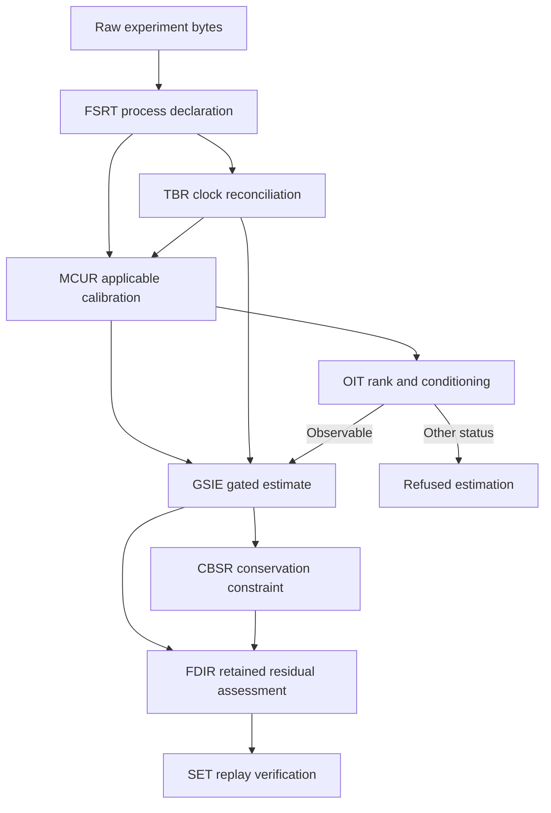

# Calibrated, observable two-channel process experiment

`ciw calibrated-observable` executes the synthetic two-reservoir process case
through eight source-pinned repositories. It retains raw observations, clock
maps and synchronization evidence, calibration applicability and uncertainty,
the finite-horizon observability gate, the state estimate, conservation-law
reconciliation, and fault-signature assessment. SET verifies content bindings
and a fresh numerical recomputation before CIW saves a completed session.

## Operation graph



| Owner | CIW operation | Retained result |
| --- | --- | --- |
| FSRT | `fsrt.declare-calibrated-two-channel.v1` | Bound process declaration and channel order |
| TBR | `ciw.tbrt-two-channel.v1` | Original timestamps, affine maps, reference frame, propagated time uncertainty |
| MCUR | `ciw.mcur-two-channel.v1` | Raw values, applicable calibration profiles, corrected values and declared covariance |
| OIT | `oit.finite-horizon-linear.v1` | Horizon, rank, condition number, condition limit and four-state status |
| GSIE | `ciw.gsie-observable-predict-update.v1` | Gated estimate, covariance, prior innovation and innovation covariance |
| CBSR | `cbsr.affine-exact.v1` | Candidate and separate accepted, held or refused conservation receipt |
| FDIR | `fdir.residual-isolability.v1` | Residual detector, declared signature fits and isolability status |
| SET | Replay verifier | Content binding and numerical replay verification artifact |

The pinned revisions and source roots are recorded in
the [`calibrated-observable` descriptor](../src/ciw/pipelines/descriptors/calibrated-observable.json).
Every scientific operation executes in its owner's checkout. CIW supplies the
fixed operation graph and retained identity structure.

## Commands

Install CIW using `python -m pip install -e ".[dev]"`. Check out all providers at
their exact manifest revisions. The following examples use short sibling
directory names matching the roles in the manifest.

```sh
python -m ciw calibrated-observable create \
  --source examples/calibrated-observable/source.json \
  --fsrt-repo ../fsrt --tbrt-repo ../tbrt --mcur-repo ../mcur \
  --oit-repo ../oit --gsie-repo ../gsie --cbsr-repo ../cbsr \
  --fdir-repo ../fdir --set-repo ../set \
  --output-dir results/calibrated-original

python -m ciw calibrated-observable inspect \
  results/calibrated-original/calibrated-observable-session.json

python -m ciw calibrated-observable replay \
  results/calibrated-original/calibrated-observable-session.json \
  --fsrt-repo ../fsrt --tbrt-repo ../tbrt --mcur-repo ../mcur \
  --oit-repo ../oit --gsie-repo ../gsie --cbsr-repo ../cbsr \
  --fdir-repo ../fdir --set-repo ../set \
  --output-dir results/calibrated-replay
```

The commands save `ciw.calibrated-observable-session.v1` JSON only after all
required operations and verification succeed. Existing output files are refused.
Inspection checks retained content without recomputation. Replay reconstructs
every request from the exact source bytes, reexecutes the pinned producers,
and creates fresh session, execution and result identities. Numerical result
identities remain equal across a matching replay.

## Declared experiment and analytic result

The [source fixture](../examples/calibrated-observable/source.json) contains two
raw channels, their separate clock frames and maps, calibration profiles,
full joint uncertainty, covariance evidence and every model/threshold.
The channels share a reference clock and ordered mass coordinates.

| Quantity | Tank 1 | Tank 2 |
| --- | ---: | ---: |
| Raw device timestamp (s) | 1005 | 2004 |
| Reference event time (s) | 5 | 5 |
| Raw recorded value | 51000 | 45000 |
| Indicated mass (kg) | 51 | 45 |
| Calibrated mass (kg) | 52 | 46 |
| GSIE posterior mass (kg) | 50.5833333333 | 49.0833333333 |
| CBSR reconciled mass (kg) | 50.75 | 49.25 |

With `F = H = I`, horizon 2, and declared state scales of one, OIT returns
rank 2 and condition number 1. Calibration gives covariance
`[[1, 0.25], [0.25, 1]]`; GSIE retains innovation `[2, -4]` and innovation
covariance `[[1.25, 0.25], [0.25, 1.25]]`. CBSR accepts the declared 100 kg
total constraint. FDIR consumes that retained innovation covariance and
returns NIS `58/3`, above the detection threshold 9.21. Of the two declared
bias signatures, only the tank-2 signature meets the unexplained-NIS limit 4.
This is uniqueness within the declared signature set, not identification of
an actual physical failure.

## Refusal, held results and uncertainty

- Absent clock maps, missing synchronization evidence, mismatched raw clock
  frames and expired or inapplicable calibration refuse the experiment.
- Unknown calibration or combined measurement cross-covariance blocks estimation.
  Explicit `declared_zero` remains a positive declaration and must match the matrix.
- Observability uses the exact GSIE transition, observation matrix and model ID.
  `unobservable`, `ill_conditioned` and `unresolved` all block the GSIE update.
- CBSR can hold the reconciliation while retaining the original GSIE candidate.
  FDIR retains the CBSR status alongside its residual assessment.
- Unknown FDIR cross-covariance produces `ambiguous` and no unique nominated fault,
  even if a residual detector crosses its threshold.
- Configuration, source, operation graph and model substitutions are rejected
  independently of the outer bundle digest. Exact replay checks retained result
  contents against recomputation under the pinned runtimes.

Retained configuration, provider requests and numerical projections are compared
as canonical JSON bytes. Boolean, integer and floating-point substitutions such
as `true`, `1` and `1.0` are distinct, even after recomputing the outer digest.

The time policy is explicitly `nominal_alignment_with_retained_time_uncertainty`.
It is bounded to a stationary hold model (`F = I`, `Q = 0`): time uncertainty is
retained and no undeclared dynamic time-to-measurement uncertainty term is invented.
Raw timestamps are never overwritten. Source timestamps, the UTC epoch and
calibration validity bounds must be exactly representable at microsecond
precision. Extra trailing fractional zeros are accepted; a nonzero digit beyond
microseconds is refused before provider binding. The scalar aligned time must
also exactly represent its declared origin plus delta, and precision loss is
refused before calibration. This path does not extract stream features;
MCUR's separate compatibility assessment requires declared transformation/window
compatibility before a calibration can commute with a feature operation.

The experiment is synthetic. Evidence references are retained declarations;
computation and matching replay do not certify a physical calibration or
authenticate the referenced source evidence. SET verification is explicitly
non-independent, and this path performs no ESM admission or physical action.

## Validation

`python scripts/check_calibrated_observable.py` clones the exact manifest pins
into temporary role directories and runs the complete test path. With existing
clean pinned checkouts, use:

```sh
CIW_CALIBRATED_STACK_ROOT=/path/to/role-checkouts \
  python -m pytest -q tests/test_calibrated_observable.py
```

The dedicated GitHub workflow runs on Python 3.11 and 3.12. Tests cover the
analytic solution, original/replay identity separation, retained residual
covariance, unknown covariance, clock authority, calibration expiry, all
non-admissible observability statuses, held reconciliation, ambiguous isolation,
and rehashed content/model substitutions. The companion ICRH
`calibrated-observable-telemetry.v1` profile retains original, replay and fault
fixtures for cross-repository conformance.
