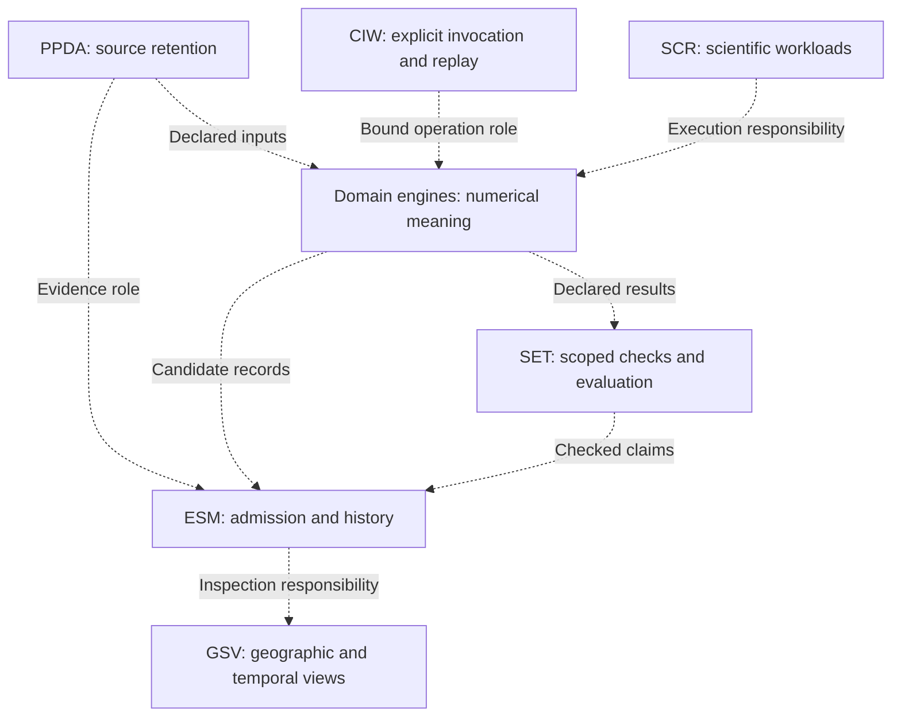
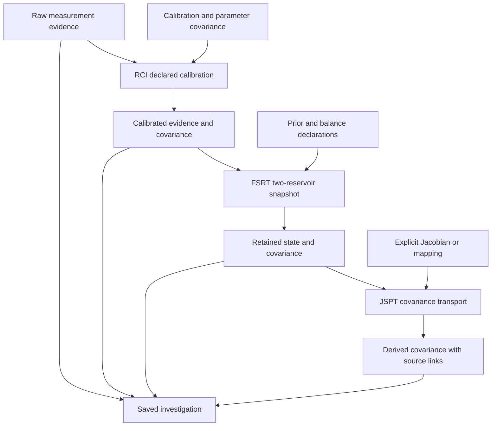
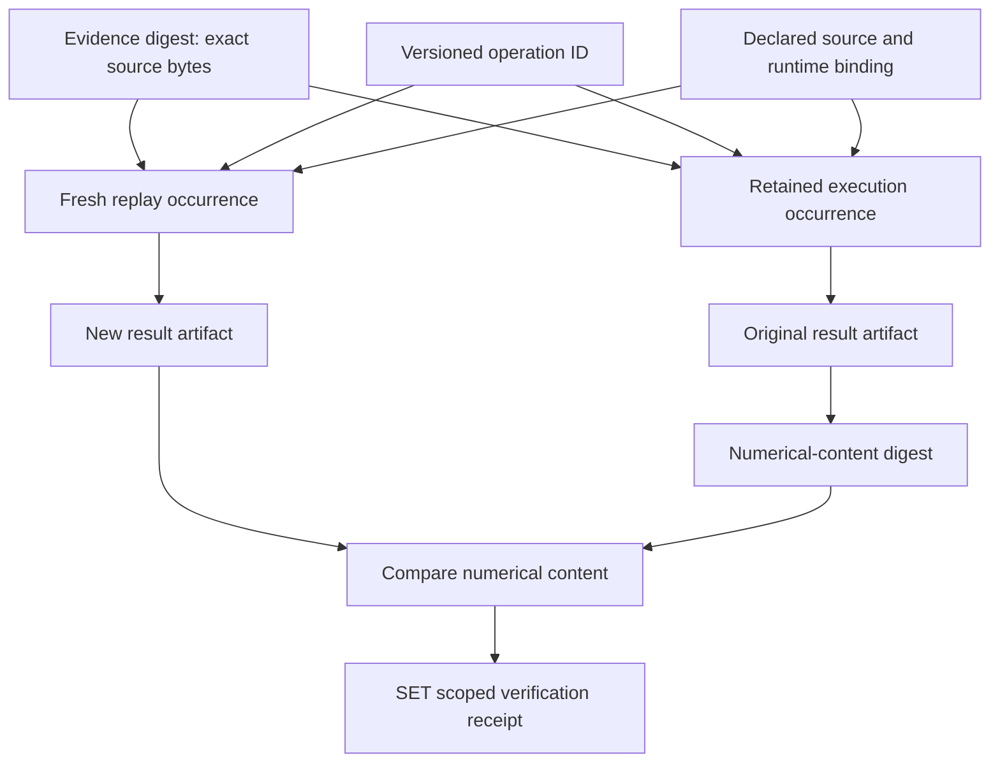

# Instrumentation diagram atlas

Text-based diagrams for Notation Systems' computational instrumentation stack.
Every diagram is editable Mermaid inside Markdown; no generated image is needed.
The [stack inventory](STACK.md) records integration status, and each provider's
versioned contract remains authoritative for fields, numerical assumptions and
refusals. Repository default branches can evolve beyond CIW's pinned providers.

## Reading the diagrams

Rectangles name inputs, operations or retained records; diamonds mark a choice
or gate. Solid arrows show a path implemented within the stated scope. Dotted
arrows in an ownership diagram describe responsibilities, not callable adapters.
An optional implemented branch has a solid arrow labelled optional. A successful
calculation, a content digest and a verification receipt answer different questions.

| View | What it explains |
| --- | --- |
| [Workbench overview](../README.md#workbench-at-a-glance) | Capture, execution, retained outcomes and inspection |
| [Implemented stack paths](STACK.md#how-to-read-the-stack) | Which external workflows share a container |
| [Retained scalar telemetry](TELEMETRY.md#retained-data-and-calculation-flow) | Full covariance, declared models and optional reconciliation |
| [Operation admission](ARCHITECTURE.md#admission-and-retained-outcomes) | Pre-admission rejection versus retained execution refusal |
| [Reopen and replay](ARCHITECTURE.md#reopen-and-replay-are-separate-actions) | Read retained records or explicitly create a new occurrence |
| [Covariance contract](COVARIANCE.md) | Ordered quantities, source lineage and uncertainty assumptions |
| [Exchange inspection](EXCHANGE.md) | Read-only conformance without native workspace import |

## Ownership boundaries

This is a responsibility map, not an end-to-end execution graph. A domain
engine's output needs the receiving subsystem's explicit contract and admission
rules before it becomes that subsystem's state. ESM now offers a separate
[native telemetry candidate-evidence adapter](https://github.com/giasonpooni/Evidence-and-State-Management/blob/claude/payload-os-frontend-cm3d22/docs/INSTRUMENT_CANDIDATE_EVIDENCE.md): fresh replay and source-policy checks
permit read-only review or explicitly requested retention as `UNADMITTED`.
This does not admit canonical state or activate a release. The telemetry command
itself performs no ESM admission. CIW has no SCR execution adapter or GSV
publication connection.

## Measurement and covariance lineage

The implemented RCI / FSRT / JSPT investigation retains raw measurements,
calibration declarations, estimation inputs and ordered covariance artifacts.
The [measurement guide](ADAPTERS.md) and [covariance guide](COVARIANCE.md) state
the supported source pins and operation versions.

This path does not infer independence, add missing uncertainty or establish
physical validity. Applicability at acquisition and serving-time expiry remain
separate. A held reconciliation keeps its status even when its numerical values
match the posterior; a missing observation remains missing.

## Identity and replay in retained telemetry

References bind records with different meanings; the arrows below are record
relationships in `ciw.telemetry-session.v1`, not signatures or claims of authorship.
Numerical-content comparison is independent of occurrence identity.

Replay also checks retained byte/content bindings and declarations as described
in [TELEMETRY.md](TELEMETRY.md). Matching numbers alone do not validate a changed
model or source claim. The receipt records SET's checked scope; it is neither
independent algorithm verification nor ESM state admission. Other CIW workflows
have their own verification status and are not assigned this receipt implicitly.

## Instrument and repository navigation

Each README contains a local workflow diagram and links to deeper mechanism
diagrams. These groups organize documentation, not a universal execution order.

### Work environment, acquisition and evidence

| Repository | Diagram focus |
| --- | --- |
| [Computational Instrumentation Workbench](https://github.com/giasonpooni/Computational-Instrumentation-Workbench#readme) | Operation, persistence and replay |
| [Provenance Preserving Data Acquisition](https://github.com/giasonpooni/Provenance-Preserving-Data-Acquisition#readme) | Source retention and extraction lineage |
| [Scientific Computation Runtime](https://github.com/giasonpooni/Scientific-Computation-Runtime#readme) | Checked computation and state boundaries |
| [Evidence and State Management](https://github.com/giasonpooni/Evidence-and-State-Management#readme) | Admission, review and release |
| [Geospatial State Visualization](https://github.com/giasonpooni/Geospatial-State-Visualization#readme) | Read-only geographic and temporal views |

### Measurements, estimation and checks

| Repository | Diagram focus |
| --- | --- |
| [Retrofitted Computational Instrumentation](https://github.com/giasonpooni/Retrofitted-Computational-Instrumentation#readme) | Declared calibration and measurement records |
| [Streaming Telemetry Feature Extraction](https://github.com/giasonpooni/Streaming-Telemetry-Feature-Extraction#readme) | Causal window support and full covariance |
| [Geometric State Inference Engine](https://github.com/giasonpooni/Geometric-State-Inference-Engine#readme) | Prediction, update and candidate state |
| [State Estimation Evaluation Testbed](https://github.com/giasonpooni/State-Estimation-Evaluation-Testbed#readme) | Scoped evaluation and replay binding |
| [Constraint Based State Reconciliation](https://github.com/giasonpooni/Constraint-Based-State-Reconciliation#readme) | Exact constraints, encoding and receipts |
| [Fluid State Reconstruction Testbed](https://github.com/giasonpooni/Fluid-State-Reconstruction-Testbed#readme) | Reservoir state and covariance lineage |

### Standalone numerical foundations

| Repository | Diagram focus |
| --- | --- |
| [Time Base Reconciliation Runtime](https://github.com/giasonpooni/Time-Base-Reconciliation-Runtime#readme) | Supplied affine clock and time uncertainty |
| [Observability Identifiability Testbed](https://github.com/giasonpooni/Observability-Identifiability-Testbed#readme) | Rank, nullspace and local information |
| [Metrological Calibration Uncertainty Runtime](https://github.com/giasonpooni/Metrological-Calibration-Uncertainty-Runtime#readme) | Affine calibration and correlated uncertainty |
| [System Identification Dynamics Testbed](https://github.com/giasonpooni/System-Identification-Dynamics-Testbed#readme) | Fully observed model fitting and holdout |
| [Fault Detection Isolation Runtime](https://github.com/giasonpooni/Fault-Detection-Isolation-Runtime#readme) | NIS, whitening and CUSUM state |
| [Experiment Design Sensor Placement Testbed](https://github.com/giasonpooni/Experiment-Design-Sensor-Placement-Testbed#readme) | Finite candidate information ranking |

### Geometry and sensitivity

| Repository | Diagram focus |
| --- | --- |
| [Geometric Telemetry Engine](https://github.com/giasonpooni/Geometric-Telemetry-Engine#readme) | Circle reconciliation and tangent covariance |
| [Jacobian Sensitivity Propagation Testbed](https://github.com/giasonpooni/Jacobian-Sensitivity-Propagation-Testbed#readme) | Local maps and covariance propagation |
| [Flat Torus Geodesic Reference](https://github.com/giasonpooni/Flat-Torus-Geodesic-Reference#readme) | Flat reference and representation invariants |
| [Curved Surface Geodesic Sensitivity Runtime](https://github.com/giasonpooni/Curved-Surface-Geodesic-Sensitivity-Runtime#readme) | Curved path and sensitivity calculation |
| [Covariance Geometry and Geodesic Testbed](https://github.com/giasonpooni/Covariance-Geometry-and-Geodesic-Testbed#readme) | Bounded affine-invariant SPD geometry; native execution and replay |
| [Intrinsic Surface Geodesics Testbed](https://github.com/giasonpooni/Intrinsic-Surface-Geodesics-Testbed#readme) | Mesh-edge shortest-path baseline; continuous solver remains unimplemented |
| [Translation Surface Dynamics Explorer](https://github.com/giasonpooni/Translation-Surface-Dynamics-Explorer#readme) | Exact rational square-tiled flows; explicit partial trajectories |

### Domain decisions and computational resources

| Repository | Diagram focus |
| --- | --- |
| [Parameterized Lyapunov Stability Runtime](https://github.com/giasonpooni/Parameterized-Lyapunov-Stability-Runtime#readme) | Declared stability computation and verdicts |
| [Construction State Estimator for BIM](https://github.com/giasonpooni/Construction-State-Estimator-for-BIM#readme) | BIM evidence and disposition boundaries |
| [Schematics Retrieval Agent](https://github.com/giasonpooni/Schematics-Retrieval-Agent#readme) | Retrieval eligibility and bounded kernels |
| [Yield Weighted Inference Runtime](https://github.com/giasonpooni/Yield-Weighted-Inference-Runtime#readme) | Budget admission and settlement |

## Maintaining the visual documentation

Keep each diagram focused on one mechanism or boundary. Prefer top-down flow
for branched workflows, use short node labels, and put mathematical assumptions
and exact status names in the surrounding text. Show missingness and refusal
where they affect interpretation. A planned role must be labelled as planned;
do not use an integration arrow merely because two repositories are related.

When an operation changes, update its README overview and detailed diagram with
the corresponding contract. Preserve historical evidence and frozen identities.
Use graphs of measured performance only when the plotted values have a retained
source, units and experimental conditions; these architecture diagrams make no
empirical performance claims.
