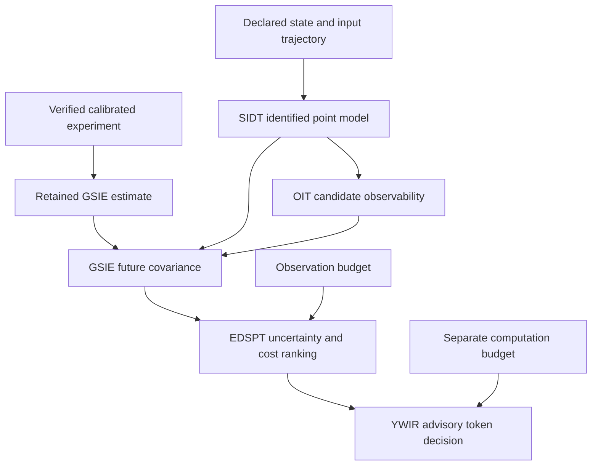

# Identified model and budgeted next observation

`ciw identified-design` extends a retained calibrated-observable experiment with
an executable next-observation decision. The existing calibration, time,
observability, estimation, reconciliation and residual evidence remain embedded
in the new session. Eleven source-pinned providers participate across the two
connected operation graphs.

The extension identifies one declared discrete linear model, tests each proposed
sensor's observability, propagates the retained GSIE uncertainty by one declared
sample interval, and ranks feasible measurement candidates by expected uncertainty
reduction and declared cost. Its output is an advisory experiment selection.



## Scientific contract

The fitted dynamics have the form

$$x_{k+1}=A x_k+B u_k+w_k.$$

Training data declare their sample interval, coordinate order, units and source
evidence. SIDT's rank and conditioning diagnostics stay attached to the fitted
model. The retained calibration session supplies the current GSIE estimate and
covariance. The conservation-adjusted CBSR result is also retained upstream; it
does not silently replace the uncertainty used for this decision.

For the initial bounded operation, the next input is explicitly zero. SIDT's
fitted input matrix remains retained. GSIE predicts one step with declared process
covariance. EDSPT computes each eligible candidate's information update; its
posterior covariance is equivalent to the Joseph update:

$$P^- = A P A^\top + Q,$$

$$S_i=H_iP^-H_i^\top+R_i,\qquad K_i=P^-H_i^\top S_i^{-1},$$

$$P_i^+=(I-K_iH_i)P^-(I-K_iH_i)^\top+K_iR_iK_i^\top.$$

The future measurement value is not observed. These are conditional covariance
calculations: in a linear Gaussian model, the covariance update does not depend
on the measured value. A hypothetical innovation cannot be promoted to evidence
that a real sensor has supplied a measurement.

SIDT does not supply a calibrated distribution over its fitted parameters.
Accordingly, the uncertainty scope is
`conditional_on_identified_point_model`. Parameter uncertainty is unknown and is
not silently set to zero. A ranking under this conditional model does not claim
total predictive uncertainty or demonstrated physical performance.

The operation requires separate declarations for process-noise independence and
future measurement independence from the prior. Each candidate supplies its full
within-measurement covariance. Unknown required cross-covariance prevents the
unsupported calculation.

Candidate identifiers describe hypothetical future measurement options. Their
noise covariance and evidence applicability are caller declarations. Upstream
FDIR diagnostics remain retained, including the synthetic tank-2 bias flag;
selecting a tank-2 placement does not establish that the earlier sensor is fit
for reuse. This operation does not infer a repaired sensor, revised calibration,
or unbiased future observation from the ranking.

OIT tests the exact fitted transition and each candidate's observation matrix over
the declared finite horizon. A full-rank but poorly conditioned candidate remains
`ill_conditioned`; `unobservable`, `ill_conditioned` and `unresolved` candidates
cannot support the strong observation claim used by this operation. Their
diagnostics remain visible. Finite-horizon observability and expected reduction
from one future measurement are retained as separate quantities.

## Separate budgets and authority

| Quantity | Owner | Meaning |
| --- | --- | --- |
| Expected uncertainty reduction | GSIE and EDSPT | Improvement conditional on the declared fitted model, process covariance and candidate noise |
| Candidate cost and observation budget | EDSPT | Eligibility in the declared cost unit |
| Advisory computation tokens | YWIR | Independent admission decision under a token budget |
| Upstream calibration and residual evidence | Original instrument owners | Retained observations and results from the completed process experiment |

An affordable candidate need not pass the computation-token decision, and token
admission does not fund or authorize a physical observation. The operation does
not dispatch a sensor, purchase equipment, replace the fitted model in an
operational estimator, or admit a new physical state into ESM.

EDSPT retains the prior baseline, each candidate's expected reduction and its
cost, including candidates that exceed the available budget. A-optimal ranking
uses the reduction in covariance trace in the declared scaled coordinates;
D-optimal ranking uses the gain in
log-determinant precision. Eligible candidates are ranked by the selected
reduction, with deterministic candidate-ID tie breaking. Cost is an eligibility
constraint; this operation does not optimize reduction divided by cost or choose
a multi-observation portfolio.

The previous experiment's stationary time-alignment declaration remains intact.
Identifying dynamics for a future step does not rewrite raw timestamps or add
undeclared timing uncertainty terms to the earlier calibration experiment.

## Replay and identity

The session retains the exact source bytes, the upstream experiment, pinned
provider identities, each operation request/result, and explicit verification
records. A fresh execution of the upstream chain checks its numerical content
before it supplies the prior. The new operation graph is also replayed against
its exact source-pinned producers.

Content inspection checks retained identity and graph bindings without executing
providers. It is distinct from numerical replay. Matching replay preserves
mathematical result identities while creating fresh execution, result-occurrence
and verification identities. Neither kind of verification authenticates the
physical provenance of caller-supplied evidence references.

## Commands

First create a calibrated session using the
[calibrated-observable guide](CALIBRATED_OBSERVABLE.md). Supply its saved JSON as
the upstream artifact and the
[identified-design declaration](../examples/identified-design/source.json) as the
new source. Each role checkout must match its manifest pin.

```sh
python3.12 -m ciw identified-design create \
  --source examples/identified-design/source.json \
  --upstream results/calibrated-original/calibrated-observable-session.json \
  --fsrt-repo ../fsrt --tbrt-repo ../tbrt --mcur-repo ../mcur \
  --oit-repo ../oit --gsie-repo ../gsie --cbsr-repo ../cbsr \
  --fdir-repo ../fdir --set-repo ../set \
  --sidt-repo ../sidt --edspt-repo ../edspt --ywir-repo ../ywir \
  --output-dir results/identified-original

python3.12 -m ciw identified-design inspect \
  results/identified-original/identified-design-session.json

python3.12 -m ciw identified-design replay \
  results/identified-original/identified-design-session.json \
  --fsrt-repo ../fsrt --tbrt-repo ../tbrt --mcur-repo ../mcur \
  --oit-repo ../oit --gsie-repo ../gsie --cbsr-repo ../cbsr \
  --fdir-repo ../fdir --set-repo ../set \
  --sidt-repo ../sidt --edspt-repo ../edspt --ywir-repo ../ywir \
  --output-dir results/identified-replayed
```

The supplied synthetic trajectory identifies
`A = [[0.9, 0.1], [0.1, 0.9]]` and `B = [[0.05], [-0.05]]`.
At an observation budget of five measurement credits, the precise tank-2 sensor
is selected. The premium two-channel measurement has greater expected reduction
but costs ten credits. The sum-only sensor does not observe the inter-tank
difference mode and is excluded by OIT. Reducing the budget to two credits selects
the standard tank-1 sensor. These are model-conditional comparisons of one next
measurement block.

With the example's unit state scales, the predicted covariance trace is
`0.348333333333 kg²`. The separate candidate outcomes are:

| Candidate | Expected trace reduction (kg²) | Cost (measurement credits) | Outcome at budget 5 |
| --- | ---: | ---: | --- |
| Standard tank 1 | 0.076113294041 | 2 | Eligible |
| Precise tank 2 | 0.150745784695 | 4 | Selected |
| Premium two-channel block | 0.329485575252 | 10 | Over budget |
| Sum-only sensor | Not ranked | 1 | Unobservable difference mode |

## Validation

The new integration requires Python 3.12 because YWIR declares that minimum.
The existing calibrated-observable and other integration gates retain their
original interpreter coverage.

```sh
python3.12 scripts/check_identified_design.py
```

The check clones all eleven exact source pins, builds and installs the CIW wheel
in an isolated environment, and runs the dedicated tests outside the source
checkout. It refuses skipped integration checks. Existing clean role-named
checkouts can be supplied with `--stack-root /path/to/providers`.

For development against already checked-out providers:

```sh
CIW_IDENTIFIED_DESIGN_STACK_ROOT=/path/to/providers \
  python3.12 -m pytest -q tests/test_identified_design.py
```

The provider manifest extends the eight existing calibrated-observable pins with
SIDT, EDSPT and YWIR. The original manifest is not repurposed for this workload.

The dedicated tests compare the identified matrices with the generating model
and compare EDSPT's posterior uncertainty with an independent Joseph-form matrix
calculation. They exercise deficient identification, OIT exclusions, observation
budget changes, token denial, unknown cross-covariance, coordinate and clock
substitution, future training samples, fresh replay identities and fully rehashed
result forgery. These checks prove the declared computational path; they do not
validate the synthetic training trajectory as a physical process model.
