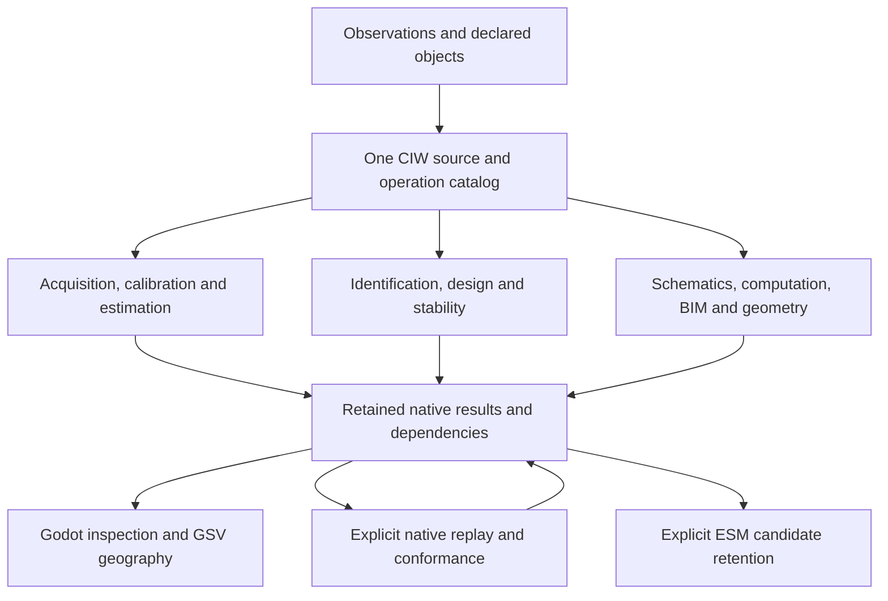

# Notation Systems computational instrumentation stack

The concise provider and loose-tool map is [SYSTEMS_CATALOG.md](SYSTEMS_CATALOG.md).
This page remains the detailed responsibility, boundary and numerical-foundation
reference.

Notation Systems develops computational instrumentation and evidence infrastructure for industrial and cyber-physical systems. The engineering mandate is to connect source observations, explicit mathematical models, computation, inspection and governed state while retaining the evidence needed to reproduce and challenge a result.

The public repositories are components of this stack. Their scientific and engineering functions define their names. The existing physical-economy corpus, acquisition, policy and information-delivery capabilities remain part of the architecture; adding instruments does not replace them.

## How to read the stack

The workbench retains native records in one operating session. Explicit source
and upstream selections connect compatible operations; the view reads that
same history. Numerical providers retain their own APIs, software pins and
scientific scope. The built-in oscillator and read-only exchange inspector
remain available. The
[integration coverage matrix](INTEGRATION_COVERAGE.md) tracks executable
connections and profile gaps across the 29 public components. Start with the
[diagram atlas](DIAGRAMS.md) for mechanism diagrams.

## Component map

This is the public repository inventory reviewed on 2026-09-23. “Executable” describes code present in the component; it does not mean production-qualified, physically validated or integrated with every other component. “Pinned” describes the CIW binding, which can differ from a provider's default branch. Local READMEs and versioned contracts specify exact supported behavior.

| Component | Responsibility | Present scope | CIW connection |
| --- | --- | --- | --- |
| [Notation Systems Workbench](https://github.com/giasonpooni/Notation-Systems-Workbench) | Operation, inspection and replay | Executable prototype | Host; retained telemetry, calibrated process, identified observation decision, measurement/covariance, geometry, Lyapunov, thermal-reference and read-only exchange paths |
| [Provenance Preserving Data Acquisition](https://github.com/giasonpooni/Provenance-Preserving-Data-Acquisition) | Source acquisition and observation lineage | Executable acquisition, storage and source adapters | Shared native snapshot acquisition, exact record-to-calibrated-window mapping and retained telemetry |
| [Streaming Telemetry Feature Extraction](https://github.com/giasonpooni/Streaming-Telemetry-Feature-Extraction) | Signal conditioning and stream-quality diagnostics | Executable bounded regular-grid causal scalar window mean | Shared telemetry and calibrated windows with declared full covariance and native replay |
| [Geometric State Inference Engine](https://github.com/giasonpooni/Geometric-State-Inference-Engine) | Declared geometric state estimation | Executable linear prediction/update and bounded geometry; not a universal inference authority | Pinned telemetry and calibrated process paths with full prior/model/observation retention and explicit OIT gate in the latter |
| [Evidence and State Management](https://github.com/giasonpooni/Evidence-and-State-Management) | Evidence retention, state admission and release | Executable local rails and bounded domain implementations; demonstration corpora | Native telemetry replay review and optional candidate-evidence capture; no canonical-state persistence |
| [Scientific Computation Runtime](https://github.com/giasonpooni/Scientific-Computation-Runtime) | Scientific workload execution and verification records | Executable runtime and state/evidence packages; backend-specific prerequisites | Shared native integer heat-diffusion execution and read-only exchange inspection |
| [Retrofitted Computational Instrumentation](https://github.com/giasonpooni/Retrofitted-Computational-Instrumentation) | Measurement-chain records and declared calibration | Executable host-side software with simulated examples | Shared measurement-chain investigation with native FSRT/JSPT results; historical calibration pin remains explicit |
| [Fluid State Reconstruction Testbed](https://github.com/giasonpooni/Fluid-State-Reconstruction-Testbed) | Fluid-state estimation and balance reconciliation | Executable experimental fluid toolkit | Pinned snapshot/covariance workflows and calibrated two-channel process declaration |
| [Jacobian Sensitivity Propagation Testbed](https://github.com/giasonpooni/Jacobian-Sensitivity-Propagation-Testbed) | Local derivatives, sensitivity and covariance transport | Executable numerical testbed | Pinned covariance propagation provider |
| [Geometric Telemetry Engine](https://github.com/giasonpooni/Geometric-Telemetry-Engine) | Geometric reconciliation and tangent uncertainty | Executable experimental circle operation | Shared geometric-circle operation, native covariance/held-candidate inspection and replay |
| [Parameterized Lyapunov Stability Runtime](https://github.com/giasonpooni/Parameterized-Lyapunov-Stability-Runtime) | Quadratic Lyapunov evaluation | Executable runtime in development | Shared identified-model/state assessment and SRA companion calls; general terminal bundles remain supported |
| [Construction State Estimator for BIM](https://github.com/giasonpooni/Construction-State-Estimator-for-BIM) | BIM evidence-to-decision computation | Executable experimental BIM runtime | Shared native quantity conditioning, invariant rollback and replayed execution ledger |
| [Schematics Retrieval Agent](https://github.com/giasonpooni/Schematics-Retrieval-Agent) | Typed schematic retrieval and kernel eligibility | Executable graph and optional companion adapters | Shared schematic assessment and selected native JSPT/PLSR companion execution |
| [Yield Weighted Inference Runtime](https://github.com/giasonpooni/Yield-Weighted-Inference-Runtime) | Inference-token budget admission and settlement | Executable runtime in development | Pinned advisory token decision in identified-design; token budgets remain distinct from measurement cost and no reservation is created |
| [Geospatial State Visualization](https://github.com/giasonpooni/Geospatial-State-Visualization) | Geographic and temporal inspection | Executable browser client with synthetic provider | Read-only CIW provider over explicitly declared geographic sources in the same session |
| [Flat Torus Geodesic Reference](https://github.com/giasonpooni/Flat-Torus-Geodesic-Reference) | Exact flat-geometry reference and representation invariants | Executable mathematical reference | Shared `ciw.flat-torus-reference.v1` with retained native trajectory and replay |
| [Curved Surface Geodesic Sensitivity Runtime](https://github.com/giasonpooni/Curved-Surface-Geodesic-Sensitivity-Runtime) | Curvature-dependent path sensitivity | Executable numerical engine and tolerance experiments | Shared `ciw.curved-path-transfer.v1` for declared constant curvature, sensitivity and covariance |
| [State Estimation Evaluation Testbed](https://github.com/giasonpooni/State-Estimation-Evaluation-Testbed) | Instrument-exchange validation, declared-truth evaluation and replay binding | Executable validators, scoped metrics and binding checks; no estimator | Pinned exchange checker, telemetry and calibrated process replay verification |
| [Constraint Based State Reconciliation](https://github.com/giasonpooni/Constraint-Based-State-Reconciliation) | Reconciliation under declared constraints | Executable bounded affine-exact reconciliation plus invariant corpus | Optional telemetry reconciliation and calibrated process conservation receipt |
| [Instrument Conformance and Replay Harness](https://github.com/giasonpooni/Instrument-Conformance-and-Replay-Harness) | Cross-repository conformance and replay | Executable independent inspectors, compiled profiles, retained fixtures and trusted pinned runners | Independent profiles cover telemetry, calibration, identification, acquired windows, residual monitoring, native objects and the shared measurement/geometry/stability operations |
| [Covariance Geometry and Geodesic Testbed](https://github.com/giasonpooni/Covariance-Geometry-and-Geodesic-Testbed) | Geometry of covariance matrices | Bounded affine-invariant SPD distance and geodesics | Shared session, native evidence and replay |
| [Intrinsic Surface Geodesics Testbed](https://github.com/giasonpooni/Intrinsic-Surface-Geodesics-Testbed) | Intrinsic paths on triangle meshes | Bounded mesh-edge shortest-path baseline | Shared session; continuous surface solver remains unimplemented |
| [Translation Surface Dynamics Explorer](https://github.com/giasonpooni/Translation-Surface-Dynamics-Explorer) | Trajectory dynamics on translation surfaces | Exact rational square-tiled flow prefixes | Shared session with explicit vertex and event-budget stops |

The oscillator is built into CIW and is not an additional repository. The first table contains 23 repositories, including three bounded geometry providers. The six numerical foundations below bring the inventory to 29 repositories. A bounded executable does not imply a live acquisition bus, generic sensor fusion or physical validation. Historical operation and runtime pins remain supported.

## Implemented workbench paths

| Path | What is retained | Exact operating guide |
| --- | --- | --- |
| Synthetic oscillator → CIW → terminal/optional Godot | Numerical channels, selection, analysis and saved workspace | [Quickstart](quickstart.md) |
| RCI → FSRT → JSPT through pinned subprocesses | Shared measurement-chain object, exact raw and calibrated evidence, two-reservoir result, full covariance and explicitly mapped quantity | [Shared module operations](REMAINING_MODULES.md), [native measurement contract](ADAPTERS.md) |
| Retained covariance → JSPT | Explicit mapping/Jacobian, ordered covariance and source/result relationships | [Covariance workflow](COVARIANCE.md) |
| Retained scalar bytes → PPDA → STFE → GSIE → SET, optional CBSR | Exact original bytes, full temporal covariance, explicit mappings, window, prior/model, operation/runtime pins, distinct identities and numerical replay | [Telemetry operation script](TELEMETRY.md) |
| FSRT → TBRT → MCUR → OIT → GSIE → CBSR → FDIR → SET | Exact source bytes, raw clock frames, synchronization/calibration evidence, full covariance, observability, held/accepted reconciliation and declared fault isolability | [Calibrated observable process](CALIBRATED_OBSERVABLE.md) |
| Retained calibrated process → SIDT → OIT → GSIE → EDSPT → YWIR | Freshly replayed upstream evidence, fitted point model, conditional covariance prediction, candidate observability, expected reduction, observation cost and separate advisory token decision | [Identified model and next observation](IDENTIFIED_DESIGN.md) |
| Declared circle observations → GTE | Shared geometry object with original observations, held/eligible candidate, residuals, full tangent uncertainty and replay inputs | [Shared module operations](REMAINING_MODULES.md), [native geometry contract](GTE.md) |
| Selected identified model/state + declared certificate → PLSR | Bound discrete model and sample interval, retained GSIE prediction and covariance context, sealed native certificate, complete verdict and fresh replay | [Shared module operations](REMAINING_MODULES.md), [general terminal workflow](PLSR.md) |
| Retained PPDA records → calibrated windows → FDIR/OIT | Exact row lineage, native time/calibration transforms and GSIE innovations, observability-gated CUSUM, unknown temporal dependence and ambiguous isolation | [Acquired streams](ACQUIRED_STREAM.md) |
| SRA → JSPT/PLSR; declared field → SCR; IFC quantity → CSE | Typed graph and native calls, integer field computation, or full quantity covariance and execution ledger in the common catalog | [Declared workloads](DECLARED_WORKLOADS.md), [native module integration](INTEGRATED_MODULES.md) |
| Acquisition/runtime exchange artifacts → pinned testbed validator → CIW inspector | Read-only conformance report, original parsed artifacts, byte digests and supplied-reference matches; no workspace import | [Exchange inspection](EXCHANGE.md) |

These bounded paths now share source selection, native result and execution
inspection, and explicit replay. The Godot Workbench tab displays retained
measurements, uncertainty, residuals and typed objects from that same session;
its oscillator tab retains the existing playback controls. GSV supplies the
read-only geographic view. General hardware acquisition, GNSS/RTK processing
and automatic equipment control remain separate workloads.

The [shared geodesic reference operations](GEODESIC_REFERENCES.md) retain the native flat lattice and constant-curvature transfer separately; they do not infer physical geometry. Additional standalone companion relationships exist: the flat-torus reference exports a versioned geometry artifact; CSE can bind companion commitments; SRA can call optional pinned numerical kernels. A commitment binding records identity and does not by itself compose scientific meaning or validate a measurement.

## Numerical foundations and their integrations

The following six repositories extend the stack with bounded Python APIs,
synthetic examples, local tests and optional exporters for the existing
`notation.instrument.result-artifact.v1` format. Four execute in the
calibrated process path; the identified observation-decision path connects
the remaining two to the same retained substrate.

| Instrument | Implemented numerical foundation | CIW integration and boundary |
| --- | --- | --- |
| [Time Base Reconciliation Runtime](https://github.com/giasonpooni/Time-Base-Reconciliation-Runtime) | Supplied affine clock mapping, evidence and correlated first-order time uncertainty | Pinned calibrated process operation; raw timestamps/frame retained; absent map or synchronization evidence refuses |
| [Observability and Identifiability Testbed](https://github.com/giasonpooni/Observability-Identifiability-Testbed) | Finite-horizon linear observability, rank/conditioning and local sensitivity/Fisher diagnostics | Pinned calibrated process gate bound to GSIE F/H/model; only `observable` permits the update |
| [Metrological Calibration and Uncertainty Runtime](https://github.com/giasonpooni/Metrological-Calibration-Uncertainty-Runtime) | Applicable affine calibration and full correlated first-order uncertainty | Pinned calibrated process operation with explicit cross-covariance policy; historical RCI operations remain supported |
| [System Identification and Dynamics Testbed](https://github.com/giasonpooni/System-Identification-Dynamics-Testbed) | Fully observed discrete linear least squares and one-step evaluation | Pinned declared-identification operation in identified-design; adoption stays explicit and parameter covariance remains unknown |
| [Fault Detection and Isolation Runtime](https://github.com/giasonpooni/Fault-Detection-Isolation-Runtime) | Innovation NIS/whitening, CUSUM and declared residual-signature isolability | Pinned calibrated process assessment consumes retained GSIE/CBSR outputs and covariance; unknown cross-covariance returns ambiguity |
| [Experiment Design and Sensor Placement Testbed](https://github.com/giasonpooni/Experiment-Design-Sensor-Placement-Testbed) | Finite candidate information ranking with D- and A-optimal criteria plus cost-budgeted next observation | Pinned uncertainty-reduction ranking conditional on the identified point model; advisory selection does not command acquisition |

The [calibrated guide](CALIBRATED_OBSERVABLE.md),
[identified-design guide](IDENTIFIED_DESIGN.md) and
[coverage matrix](INTEGRATION_COVERAGE.md) distinguish exercised paths from
remaining integration targets. The original six example exports exercised SET's
existing validator, pinned by their optional `exchange` dependencies to
[`bd261a765281a95312f7c91a3857233476294c5b`](https://github.com/giasonpooni/State-Estimation-Evaluation-Testbed/tree/bd261a765281a95312f7c91a3857233476294c5b).
Producer-side conformance alone does not establish execution or replay; the
calibrated and identified-design paths separately supply their bindings and
ICRH fixture corpora.
Historical CIW bindings and source pins remain supported.

Exports retain explicitly mapped inputs and numerical outputs. Evidence,
operation, caller-supplied execution, result and verification identities remain
separate; supplied source revisions are labelled unattested and verification
references start empty. Neither export conformance nor successful numerical
execution establishes independent verification, physical validity, calibrated
measurement truth, evidence admission or actuation authority. Each repository's
numerical contract owns its exact assumptions and refusal conditions.

## Responsibility and authority

| Boundary | Owner and rule |
| --- | --- |
| Acquisition | Source adapters retain original material, extraction lineage and explicit missingness. |
| Evidence and state | The owning subsystem applies its declared admission/review rules. CIW workspaces, scientific canonical state and domain corpus state are distinct stores. |
| Numerical meaning | The domain engine owns its model, numerical method, assumptions, diagnostics and refusal conditions. |
| Invocation | CIW or another explicit caller binds the operation, source revision, inputs and execution environment. |
| Inspection | Clients display scientific records and derived views; render geometry does not become calculation input or state authority. |
| Verification | A check identifies its subject, method and claim scope. Execution success, a digest and a plausible plot are not independent verification. |

New workloads, representations and proof backends extend these boundaries through adapters. They do not create a second canonical write path or silently replace an established scientific engine.

## Interchange requirements

Integration must declare quantity order and units, coordinate frame and basis, observation time and support interval, source lineage, calibration applicability, uncertainty status, model assumptions and software binding to the extent required by the operation. Unknown uncertainty stays unknown; absence of a cross-covariance term does not establish independence. Frame conversion, resampling and calibration are named transformations with retained inputs.

Evidence, operation, execution, result and verification identities remain distinct. Reading a retained artifact does not authorize execution. Re-execution records a new invocation rather than replacing the evidence that produced the original result. Source revision, contract version and result identity answer different questions.

The [CIW protocol](PROTOCOL.md), [covariance contract](COVARIANCE.md) and each provider's operation contract remain authoritative for implemented fields. The separate [State Estimation Evaluation Testbed](https://github.com/giasonpooni/State-Estimation-Evaluation-Testbed) validates `notation.instrument.*` exchange artifacts; those schemas are not automatically interchangeable with CIW's `ciw.*` records. CIW now inspects those exchange artifacts through the [read-only conformance path](EXCHANGE.md), without translating them into native workspace or covariance records. A translation requires an explicit mapping and validation. This map does not introduce a new universal wire protocol.

The [Streaming Telemetry Feature Extraction contract](https://github.com/giasonpooni/Streaming-Telemetry-Feature-Extraction/blob/main/docs/CONTRACT.md) defines the implemented bounded regular-grid causal scalar window mean and its retained window, feature and quality records. Its result-artifact projection participates in the explicitly mapped [retained-telemetry path](TELEMETRY.md). This bounded operation does not establish generic frequency-domain exchange, filtering or live-stream processing.

## Scientific use and qualification

The stack supports research and development across measurement chains, fluid systems, built assets, geometric sensitivity and declared dynamical models. Materials/process experimentation, robotics and compact GNSS instrumentation are application directions requiring their own models, adapters, calibration and experimental validation.

Numerical correctness, uncertainty calibration, model adequacy, hardware performance and operational authorization are separate claims. Every public capability statement should identify whether it is an implemented standalone operation, an exercised integration, a contract-only surface or a planned scaffold. Numerical results retain their model and run conditions; scaffold checks establish metadata consistency only.

## Public documentation and compatibility

Current entry points describe engineering roles, executable behavior, contracts, methods and qualified results. Earlier portfolio narratives and product metaphors do not define component scope. Historical measurements, source citations, frozen specifications and evidence-bearing records keep their original identities and limits. A display rename is not a schema migration.

Public documentation describes reusable interfaces. Customer state, private deployment configuration, proprietary calibration knowledge and internal generative planning remain outside that interface documentation. Existing licenses and source rights control reuse; this stack map neither relicenses repositories nor changes visibility.

When an integration changes, update the producer's role page, the consumer's operating guide and this map together. Identify the supported source pins, exact input/output contract, failure behavior and validation scope. An architecture arrow or a related-repository link alone is not an implemented integration.

