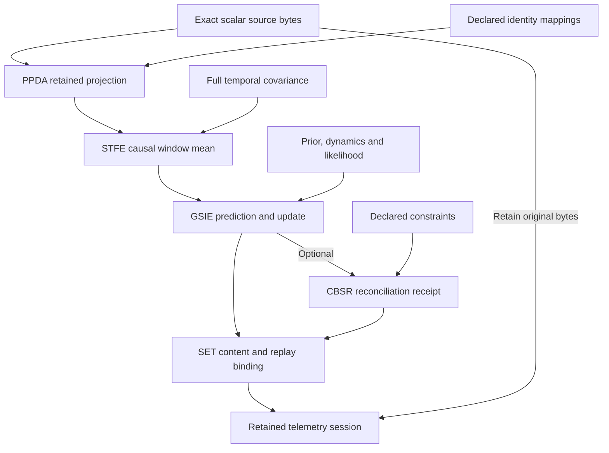

# Retained telemetry operation script

This path also executes inside the shared workbench as `ciw.telemetry.v1`, with
native PPDA/STFE views and ESM candidate retention. See
[shared telemetry setup and protocol](SHARED_TELEMETRY.md).

`ciw telemetry` runs a bounded, synthetic-or-retained scalar path:
PPDA projection → STFE window mean → GSIE prediction/update → SET replay binding.
Optional CBSR reconciliation retains an accepted, held or refused receipt; it
does not replace the estimator output or establish physical constraint truth.
This is an additive `ciw.telemetry-session.v1` container. Existing `run.v1`,
operation, exchange and shared-viewport contracts are unchanged.

## Retained data and calculation flow



Solid arrows show this implemented, pinned script. The feature variance uses
the full sample covariance; prior-feature independence is a separate explicit
declaration. CBSR retains its receipt alongside the estimate, including held
or refused outcomes. SET's receipt states its checked scope; it does not admit
state to ESM or authorize a physical action. Inspection reads the bundle;
explicit replay executes the producers again under the recorded bindings.
See the [diagram atlas](DIAGRAMS.md) for the wider stack.

## Implemented scope

The input is one `ciw.telemetry-source.v1` JSON artifact containing 1–32 scalar
samples, exact received/event times, units, a full temporal covariance matrix,
named identity clock/frame mappings and complete mapping declarations. The
example is explicitly synthetic; this command does not acquire a live sensor.
No general clock fit, coordinate transform, FFT, imputation or GNSS fusion is
implemented. Times must round-trip through microsecond-resolution UTC mapping.
STFE enforces a complete regular, causal, half-open window. Unknown crosscovariance
is refused; `declared_zero` is explicit, not inferred. The estimator separately
requires `prior_measurement_crosscov_policy: declared_zero`: full sample-sample
covariance does not establish prior-feature independence. The GSIE observation
model must explicitly declare
`feature_observation_semantics: window_mean_observes_declared_state_at_window_end`.
This is a caller-declared likelihood interpretation, not a property inferred
from averaging. The provided example uses constant-state dynamics (F=H=1,Q=0).

Source acquisition references, calibration references and mapping applicability
remain caller declarations. The resulting estimate and covariance do not prove
physical accuracy, observability, calibration validity or unique fault isolation.

## Commands

Install CIW with its normal developer dependencies. Bind explicit local checkouts
at the revisions in `src/ciw/pipelines/descriptors/telemetry.json`; no branch or artifact-supplied
executable is selected. The examples below assume sibling checkouts.

```sh
python -m ciw telemetry create \
  --source examples/telemetry/source.json \
  --configuration examples/telemetry/configuration.json \
  --ppda-repo ../Provenance-Preserving-Data-Acquisition \
  --stfe-repo ../Streaming-Telemetry-Feature-Extraction \
  --gsie-repo ../Geometric-State-Inference-Engine \
  --set-repo ../State-Estimation-Evaluation-Testbed \
  --output-dir results/telemetry-create

python -m ciw telemetry inspect results/telemetry-create/telemetry-session.json

python -m ciw telemetry replay results/telemetry-create/telemetry-session.json \
  --ppda-repo ../Provenance-Preserving-Data-Acquisition \
  --stfe-repo ../Streaming-Telemetry-Feature-Extraction \
  --gsie-repo ../Geometric-State-Inference-Engine \
  --set-repo ../State-Estimation-Evaluation-Testbed \
  --output-dir results/telemetry-replay
```

The output is written only after successful computation and verification.
Existing session files are not overwritten. Inspection executes no producer and
reports content consistency, not a fresh verification. Replay recomputes PPDA's
projection from original source bytes and every subsequent scientific operation;
it does not merely compare saved hashes. It first reproduces complete result
artifacts using the retained caller metadata, then executes a fresh occurrence;
thus altering a non-numerical source/model claim cannot evade numerical comparison.
Fresh execution and result occurrences
are retained; numerical equivalence is compared separately.

For optional reconciliation, add `cbsr` to the configuration with `state_labels`,
`state_units`, `frame_ref`, `constraints`, `crosscov_policy`, and
`max_normalized_residual`, then bind `--cbsr-repo`. CIW fills the state, full
covariance and source-result binding directly from GSIE. The complete candidate,
constraint, residuals, rounding diagnostics and status remain in the receipt.

## Identity and trust boundaries

| Identity | Meaning |
| --- | --- |
| Evidence digest | Exact retained source bytes; no authorship claim |
| Operation ID | Declared versioned mathematical operation |
| Execution ID | One fresh local occurrence; not an SCR commitment |
| Result ID | Producer artifact occurrence/content identity |
| Numerical-result digest | Canonical numerical content independent of occurrence |
| State ID | GSIE predecessor/model/observation-bound transition identity |
| Verification ID | SET's scoped binding/comparison receipt; not a signature |

The session retains source bytes, PPDA batch bytes, mapping declarations,
calibration references, window, prior, dynamics, observation model, parameters,
runtime identities, complete requests/results and numerical objects. It is a
script of separately pinned operations, not a scientific megapackage.

GSIE/STFE/SET/CBSR use the existing full-tree clean-checkout adapter and isolated,
time/output-bounded Python processes. PPDA contains a vendor gitlink, so only its
standalone stdlib `bridge/instrumentation.py` is allowlisted by SHA256 and commit;
already-checked source bytes execute without importing its package initializer
or vendor tree. Other PPDA files are not executed by this seam. Python executable
bytes and Python/NumPy/SciPy versions are retained and must match on replay.
Installed dependency binaries and the local machine remain trusted; this is not
a process sandbox or authenticated execution attestation.

SET verifies retained byte/content bindings, exchange covariance eligibility,
operation/runtime declarations and exact fresh numerical comparison. Producer
replay is not independent verification of the producer algorithm. A self-consistent
newly constructed input is a new candidate, not authenticated historical evidence.
No ESM admission, release, CSE disposition, spend, or GSV publication occurs here.

## Validation

`CIW_TELEMETRY_STACK_ROOT=/path/to/siblings python -m pytest -q tests/test_telemetry.py`
runs pinned integration tests. The fixture has a nonzero 0.25 cross-covariance;
its mean is 3, feature variance 0.625, posterior mean 24/13 and variance 5/13.
Tests cover scientific replay, fresh identities, malformed/raw uncertainty,
sub-microsecond time refusal, mapping mismatch, altered prior/model/evidence,
rehashed tampering, operation identity drift, runtime pin mismatch and CLI
inspection. The pinned workflow runs the integration tests with explicit source
checkouts; ordinary unit runs skip the externally configured integrations.
