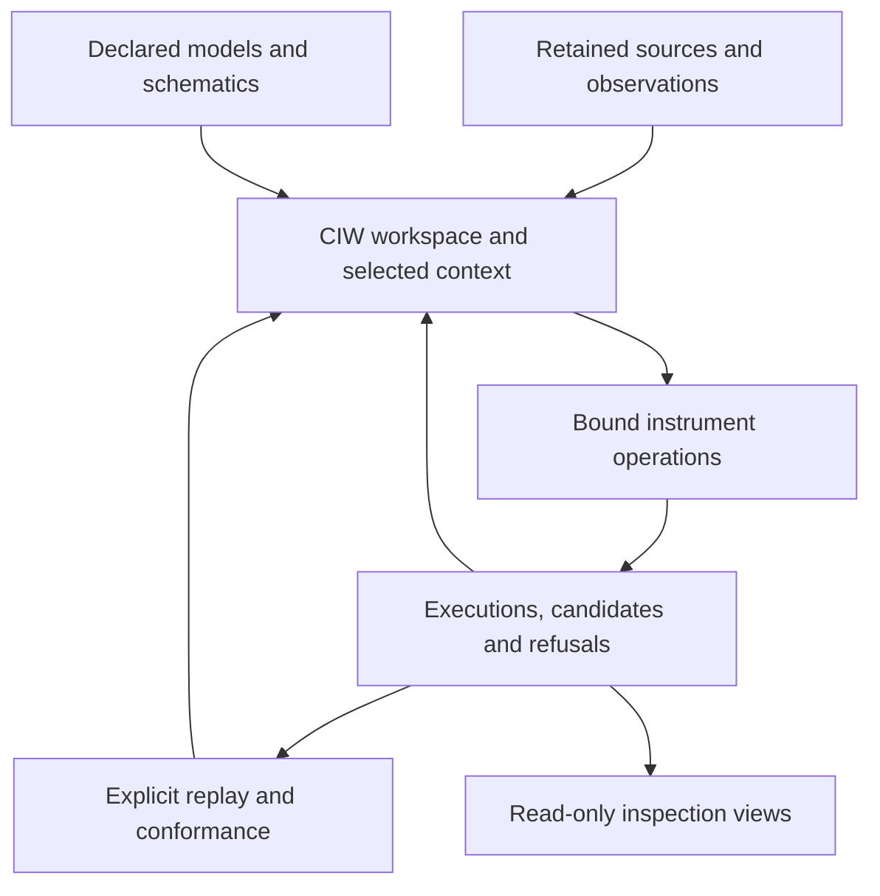

# Assembling the shared workbench

The target is one computational, algebraic, numerical and algebraic-topological
suite with sensor fusion and streaming visualization. Its common substrate is a
selected experiment, typed retained objects, declared compatible operations,
native execution records and replay evidence. Provider repositories keep their
scientific responsibilities while their operations and artifacts join this suite.

The [Workbench desktop tab](EXPERIMENT_VIEW.md) is now implemented over that
substrate: it links eleven retained workflows to measurement/state/covariance and
residual panels, native input dependencies, evidence inspection and live session
invalidation. It introduces no additional estimator or parallel result store.

The [SRA/SCR assembly](DECLARED_WORKLOADS.md) now adds typed schematic assessment
and native deterministic integer numerical execution to that same catalog,
inspection view and replay history. [Native module integration](INTEGRATED_MODULES.md)
adds actual SRA/JSPT/PLSR calls, PPDA incremental acquisition, CSE quantity
conditioning and GSV geographic inspection. [Acquired calibrated streams](ACQUIRED_STREAM.md)
now bind exact PPDA records to calibrated windows and native FDIR/OIT monitoring.
Hardware acquisition scheduling remains separate. Algebraic and topological providers
should enter as declared operations on explicit domains, bases, chain complexes
or filtrations, with exact versus numerical arithmetic and verification scope
retained. Topological outputs require an explicit observation model and uncertainty
before they can enter GSIE fusion. These are delivery targets, not implemented
algebra/topology APIs. Specialized geodesic runtimes and deferred geometry
research remain governed by concrete workload needs.

GSIE, CBSR, FDIR and ESM now have an explicit shared-session handoff. See
[state, diagnostics and candidate evidence](STATE_DIAGNOSTICS_EVIDENCE.md) for
native instrument views, fresh candidate inspection and optional ESM retention.
PPDA/STFE scalar telemetry now shares that session too; see
[retained acquisition and window features](SHARED_TELEMETRY.md).

CIW is the common place to bring in observations, operate compatible instruments,
inspect candidate state and uncertainty, and retain executions and replay evidence.
Separate provider repositories supply the scientific operations. Their outputs
belong in the same working context when their declarations permit a connection.

The first shared process context is the calibrated, time-aligned two-channel
reservoir experiment. It brings raw measurements, synchronization and calibration
evidence, observability, GSIE state, the CBSR constraint candidate, and FDIR
diagnostics into one operating workspace. The identified-observation extension
consumes that retained experiment and adds model and next-observation advice.
These bounded operations already have their own numerical contracts and replay
profiles; assembly connects them to the workbench session.

## Operate the shared session

The live session exposes telemetry, calibrated-process and identified-observation
workflows through `operation.list` and `operation.execute`, alongside existing
session operations. Its common source, bundle, result and execution interfaces
keep the native records available. `fusion.list` projects the retained contexts
for inspection; it does not initiate another state update.

Start CIW from an environment with the dependencies described in the
[calibrated-process](CALIBRATED_OBSERVABLE.md) and
[identified-observation](IDENTIFIED_DESIGN.md) guides. Put clean provider
checkouts at the exact manifest pins in role-named directories beneath one
stack root: `fsrt`, `tbrt`, `mcur`, `oit`, `gsie`, `cbsr`, `fdir`, `set`, plus
`sidt`, `edspt` and `ywir` for observation design.

```sh
# Bind both workflows using the eleven checked-out providers.
python -m ciw serve --identified-stack-root /path/to/stack \
  --output-dir results/shared-workbench
```

Use `--calibrated-stack-root /path/to/stack` instead for the eight-provider
calibrated process alone. The two stack flags are mutually exclusive. These
paths are operator startup configuration; request payloads and saved artifacts
cannot choose an interpreter or executable checkout.

From another terminal, inspect the common session:

```sh
python -m ciw send operation.list
python -m ciw send source.list
python -m ciw send bundle.list
python -m ciw send fusion.list
python -m ciw send result.list
python -m ciw send execution.list
```

To exercise the complete synthetic process and observation-design handoff
against that running server, use:

```sh
python examples/shared-workbench/run.py --with-design
```

This client retains both declarations, selects the process result by its returned
identity, executes design in the same server session, saves the workspace and
prints its posterior/prediction contexts. Omit `--with-design` for the eight-provider
process alone. The following commands show the individual protocol requests.

Prepare a request retaining the exact source bytes from the synthetic fixture:

```sh
python - <<'PY'
import base64
import json
from pathlib import Path

request = {
    "kind": "calibrated-observable",
    "label": "Two-reservoir process",
    "bytes_b64": base64.b64encode(
        Path("examples/calibrated-observable/source.json").read_bytes()
    ).decode("ascii"),
}
Path("source-request.json").write_text(json.dumps(request), encoding="utf-8")
PY
python -m ciw send source.add --payload-file source-request.json
```

Use the returned `source_id` in the operation request. The following literal
placeholders stand for IDs returned by this session:

```sh
python -m ciw send operation.execute --timeout 300 \
  --payload '{"operation_id":"ciw.calibrated-observable.v1","parameters":{"source_id":"SOURCE_ID"}}'
python -m ciw send bundle.get --payload '{"bundle_id":"BUNDLE_ID"}'
python -m ciw send bundle.replay --timeout 300 \
  --payload '{"bundle_id":"BUNDLE_ID"}'
python -m ciw send workspace.save
```

For observation design, register `examples/identified-design/source.json` with
`kind: "identified-design"`, then execute `ciw.identified-design.v1` with
`parameters` containing its `source_id` and the selected calibrated
`upstream_bundle_id`. The operation uses that retained upstream bundle and
performs its existing fresh replay checks. It does not quietly select the last
state or run a second independent fusion of the same observations.

| Session surface | Meaning |
| --- | --- |
| `source.add`, `source.list`, `source.get` | Retain exact submitted source bytes and inspect them by identity. |
| `operation.list`, `operation.execute` | Inspect registered workflow availability and invoke an explicitly selected source/context. |
| `bundle.list`, `bundle.get`, `bundle.replay` | Inspect full native bundles or explicitly rerun a selected bundle with bound providers. |
| `fusion.list` | Inspect retained compatible-state contexts and their lineage. |
| `result.list`, `result.get`, `execution.list` | Inspect common history across native workflow bundles and existing session operations. |
| `session.get` | Read the snapshot, including its `workbench` state. |
| `workspace.save` | Persist the assembled workspace in format 3. |

The registry also accepts `telemetry`, with an explicit window/model configuration
at `operation.execute`. It does not import arbitrary saved workflow bundles or
PLSR bundles. Existing
standalone commands remain available while those artifact families gain shared
session mappings. Execution publishes a bundle only after the existing
workflow's complete validation and verification succeed.

`ciw watch` emits `workbench.changed` invalidation events when shared content
changes; clients refresh `session.get` to obtain the current snapshot. This is
a shared session protocol used by the Godot Workbench tab. Geographic clients
receive restricted invalidations through the read-only `/spatial` endpoint.

Reopen `results/shared-workbench/workspace.json` using `ciw serve --workspace`
to inspect retained content without executing providers. Bind the appropriate
stack at startup when new execution or replay is required. Workspace formats 1
and 2 remain readable; format 3 adds workbench state without discarding the
existing recording, selection and operation history.

Call `workspace.save` to checkpoint accepted sources and completed bundles;
normal server shutdown also saves them. A workflow that refuses before producing
a bundle returns an error and leaves its source retained, without publishing a
partial state. The catalog permits at most 64 sources, 128 completed bundles and
64 MiB of retained content. Existing protocol frame limits still apply. It
supports eleven executable source kinds and source-only geography; it is not an arbitrary bundle
importer or a live acquisition service.

## What shares a workspace



The workspace owns source selection, operation routing and retained history.
An instrument keeps its numerical implementation and versioned input/output
contract. Native artifacts remain available in full; a summary or plot does not
replace their covariance, frame, timestamps, applicability or evidence links.
Opening saved content validates records and does not execute a provider.

One operating point can contain several declared fusion contexts. A reservoir
mass estimate, a camera position and a Lyapunov sample do not become compatible
because they appear together. A state update requires matching declared time,
ordered quantities, units, model and frame, plus supported covariance assumptions.
GSIE owns the supported state-estimation calculation. A reconciled CBSR candidate
remains a child of that estimate; it is not an independent sensor to fuse again.

The workbench must also preserve observation identity across delivery retries.
Raw observations and their calibrated or aggregated descendants retain lineage
so they cannot silently be counted as independent measurements. Missing
cross-covariance and absent clock/frame maps remain explicit reasons to hold or
refuse a connection.

## Component placement

| Component | Place in the assembled workbench | Current connection and remaining work |
| --- | --- | --- |
| CIW | Operator session, source and native-artifact registry, operation routing, result history and inspection | Shared session assembly; existing numerical workflows retain their original contracts. |
| PPDA and RCI | Acquisition and measurement sources with original evidence, assembly, delivery and missingness | PPDA retained observation projection now executes with STFE in the shared session. RCI investigation exists separately; live sensor acquisition remains a delivery item. |
| TBRT, MCUR and STFE | Declared clock mapping, calibration and stream-window transforms | Shared calibrated windows preserve full joint covariance. Exact PPDA record selection and native FDIR/OIT monitoring now connect bounded acquired sequences; physical polling remains separate. |
| OIT and GSIE | Observability gate and state/covariance computation for a declared context | Calibrated process operation already binds the gate to the estimator's exact transition and observation matrices. |
| CBSR and FDIR | Constraint-conditioned candidates and residual/isolability diagnostics | Consume retained state and declared residual covariance; hold/refusal remains visible alongside the original estimate. |
| SRA | Authored instrument/model schematic, typed relationships and eligibility | Native assessment and selected JSPT/PLSR companion execution share retained upstream graph/result bindings. |
| JSPT and PLSR | Local sensitivity/covariance propagation and declared-model certificate assessment | Existing CIW operations are reusable; selecting a compatible retained state/model for PLSR still requires an explicit mapping. |
| SCR | Delegated scientific computation with declared workload and execution records | Native integer diffusion now executes through the shared session with byte commitments, host-bound engine identity and ICRH oracle. |
| CSE | BIM/project context, construction intent and domain dispositions | Native quantity conditioning and ledger replay are integrated; surveyed-frame geometry inspection remains a delivery item. |
| GSV | Read-only spatial and temporal panels consuming selected retained context | CIW geographic sources enter its native provider and WorldStore; explicit CRS84 authority is required. |
| SET and ICRH | Exchange validation, evaluation and replay/conformance evidence | Reuse existing profiles for scientific paths and test session assembly separately; no additional numerical profile is created merely for a registry. |
| ESM | Candidate-evidence retention and later governed admission | Candidate retention only. Workbench selection, matching replay and a passed receipt do not admit canonical state. |

The ESM adapter accepts both `ciw.telemetry-session.v1` and
`ciw.calibrated-observable-session.v1` through separately pinned operator bindings,
with fresh replay inside each boundary. Identified-design bundles are not accepted
ESM inputs. Candidate retention never establishes canonical-state admission.

## Reuse the existing assembly assets

SRA already has a typed function/factor graph with variable, function,
measurement, prior, constraint, certificate, observer and evidence nodes. It
records eligibility decisions and actual optional JSPT-to-PLSR companion calls.
Stale or ambiguous Jacobian records cannot open dependent calculations. CIW
now retains and exposes that native graph and its assessment through a provider
operation; selected native companion calls now retain that assessment as upstream. SRA graph eligibility
does not itself supply sensor time alignment or state-estimation authority.

CSE already supplies a native `GatSession`, execution ledger and domain
workbench projections for BIM structure, graph and state. Its project world
remains CSE-owned. CIW now hosts quantity conditioning and its native ledger.
GSV supplies `SpatialDataProvider` and `WorldStore`; its application can select
the explicit CIW read-only provider while retaining synthetic-demo mode. A
process experiment without geographic coordinates does not acquire a geographic
frame through display.

PPDA already supplies a source registry, acquisition orchestrator and durable
pool. SCR already has checked native `run_specification` dispatch and a separate
materials `ExperimentSession`. Their acquisition and execution paths should be
called through their native boundaries. A computed SCR simulation is not a
physical sensor observation, and its materials state is not a replacement for a
GSIE estimate.

CIW already exposes Session bindings for FSRT, JSPT and GTE. Calibrated-process
and observation-design bundles now join the shared session without being
flattened into oscillator recordings. Its telemetry workflow now shares that
registry. The PLSR workflow supplies retained native artifacts; its shared-session
mapping remains assembly work. Inspection should show their distinct roles and link
the result to its exact source and execution.

GTE remains a specialized geometry provider. The curved-surface geodesic runtime
and flat-torus reference can likewise expose bounded operations or artifacts
when a workload needs them. Covariance-geometry, intrinsic-surface and
translation-surface research scaffolds remain deferred until a GSIE, GTE or CBSR
workload needs a specific operation.

## Delivery work items

These items are the next assembly work, not claims that their full connections
are implemented. Each should extend the common workspace and one of the process,
manufacturing-cycle or geometry/BIM demonstrations.

| Order | Delivery item | Concrete completion evidence |
| --- | --- | --- |
| 1 | Shared acquisition and calibrated stream window | A PPDA/RCI source retained in the selected context; TBRT/MCUR/STFE compatibility declared; full temporal covariance and raw lineage preserved; fresh replay plus missing-map, expired-calibration, nonlinear-calibration/mean-order and drift cases. |
| 2 | SRA graph operation in the workspace | Retain authored JSON schematic, eligibility decisions and actual companion call records; expose stale/refused/unresolved states and bound provider revisions; replay a supported call with adversarial stale-binding fixtures. |
| 3 | SCR delegated dispatch | Select one declared deterministic heat or structural workload; bind input bytes, descriptor, backend and arithmetic; retain its native execution/result records and reproduce them; refuse unavailable backend or unsupported input. |
| 4 | GSV view of shared context | Project one supported retained spatial result with evidence/result references and frame/time basis; preserve selected-context identity; incompatible comparisons are refused and view changes cannot alter scientific input. |
| 5 | CSE frame-bound inspection | Bind measured quantity to explicit surveyed/design frame authority and construction context; operate one declared constraint using existing GTE/JSPT/CBSR capabilities; retain original candidate, uncertainty, disagreement and held outcome. |

Row 2 now includes selected native companion calls. Row 3's bounded integer
heat dispatch is implemented with native replay and an ICRH oracle. Row 4 has
an explicit source-only geographic view. Row 1 now connects bounded PPDA acquisition
to calibrated windows and residual monitoring, with fixed reference priors and
unknown temporal dependence retained. Row 5 has native CSE quantity
conditioning; surveyed-frame geometry composition remains pending. See
[declared workloads](DECLARED_WORKLOADS.md) and [new modules](INTEGRATED_MODULES.md).

A later PLSR connection consumes a specifically selected compatible model and
state, including state order, equilibrium, continuous/discrete convention,
sample period, certificate and margin. It preserves numerical-inconclusive and
refusal states. Next-observation advice remains advisory until a separately
declared acquisition operation exists.

## Source and runtime availability

A capability is available only through its actual operator-bound runtime.
Repository default branches and historical runtime pins are separate facts.
Loading a workspace cannot select executable paths or authorize a new provider.

For example, the CIW RCI adapter pin
`f863bdd69d49224e0cdc871943bbb052e5b0a975` contains
`instrument_chain.ciw_adapter` and the supported calibration endpoints. RCI's
default `main` at the 2026-09-22 scan,
`7643df720cdf9a94fce70b081ba7255654458d5f`, contains the host measurement records
but does not contain that adapter file. This does not justify changing the pin:
the workbench should expose the bound revision and unavailable operations
clearly. Installing every repository's latest default branch is not an
integration procedure.

Existing source manifests remain authoritative for their operations. Retained
artifacts can be inspected without an available provider; new execution and
replay require the correct binding. Operation, evidence, execution, numerical
result and verification identities remain distinct across the shared workspace.

## Source evidence for these connections

The public portfolio scan checked implemented sources as well as repository
descriptions. These are the principal existing seams, not evidence that every
future connection above has shipped.

| Seam | Source |
| --- | --- |
| Shared session and existing operation bindings | [`session.py`](../src/ciw/session.py), [`investigation.py`](../src/ciw/investigation.py), [`covariance_workflow.py`](../src/ciw/covariance_workflow.py), [`geodesic.py`](../src/ciw/geodesic.py) |
| Typed estimation and exact observability binding | [GSIE contracts](https://github.com/giasonpooni/Geometric-State-Inference-Engine/blob/main/src/geometric_state_inference/contracts.py), [estimator](https://github.com/giasonpooni/Geometric-State-Inference-Engine/blob/main/src/geometric_state_inference/estimator.py), [exchange](https://github.com/giasonpooni/Geometric-State-Inference-Engine/blob/main/src/geometric_state_inference/exchange.py) |
| Authored schematic, routing and currentness | [SRA IR](https://github.com/giasonpooni/Schematics-Retrieval-Agent/blob/main/src/schematics/ir.py), [agent](https://github.com/giasonpooni/Schematics-Retrieval-Agent/blob/main/src/schematics/agent.py), [binding contract](https://github.com/giasonpooni/Schematics-Retrieval-Agent/blob/main/docs/KERNEL.md) |
| Measurement versus delivery identity | [RCI observation](https://github.com/giasonpooni/Retrofitted-Computational-Instrumentation/blob/main/src/instrument_chain/observation.py), [receiver](https://github.com/giasonpooni/Retrofitted-Computational-Instrumentation/blob/main/src/instrument_chain/receiver.py), [pinned calibration adapter](https://github.com/giasonpooni/Retrofitted-Computational-Instrumentation/blob/f863bdd69d49224e0cdc871943bbb052e5b0a975/src/instrument_chain/ciw_adapter.py) |
| Acquisition and exchange projection | [PPDA orchestrator](https://github.com/giasonpooni/Provenance-Preserving-Data-Acquisition/blob/477d6cb454423a27543b16961d3b169709c40c31/daf/orchestration/orchestrator.py), [durable pool](https://github.com/giasonpooni/Provenance-Preserving-Data-Acquisition/blob/477d6cb454423a27543b16961d3b169709c40c31/daf/storage/durable_pool.py), [instrumentation bridge](https://github.com/giasonpooni/Provenance-Preserving-Data-Acquisition/blob/477d6cb454423a27543b16961d3b169709c40c31/bridge/instrumentation.py) |
| Checked scientific dispatch | [SCR engine](https://github.com/giasonpooni/Scientific-Computation-Runtime/blob/a59aba283b0304faeeb3e5d305087e7709e171ca/execution/engine.py), [dispatcher](https://github.com/giasonpooni/Scientific-Computation-Runtime/blob/a59aba283b0304faeeb3e5d305087e7709e171ca/execution/dispatcher.py), [exchange exports](https://github.com/giasonpooni/Scientific-Computation-Runtime/blob/a59aba283b0304faeeb3e5d305087e7709e171ca/execution/instrumentation.py) |
| Existing read-only geographic client | [GSV provider](https://github.com/giasonpooni/Geospatial-State-Visualization/blob/58713d02d4e79c52290ee9d0da51ea6b4d0677ed/src/data/provider.ts), [world store](https://github.com/giasonpooni/Geospatial-State-Visualization/blob/58713d02d4e79c52290ee9d0da51ea6b4d0677ed/src/data/store.ts), [application binding](https://github.com/giasonpooni/Geospatial-State-Visualization/blob/58713d02d4e79c52290ee9d0da51ea6b4d0677ed/src/app/app.ts) |
| Native BIM session and views | [CSE session](https://github.com/giasonpooni/Construction-State-Estimator-for-BIM/blob/4b74abda40bba3277de69bf61e9e09283ae2d5b3/gat/session.py), [domain workbench](https://github.com/giasonpooni/Construction-State-Estimator-for-BIM/blob/4b74abda40bba3277de69bf61e9e09283ae2d5b3/gat/workbench.py) |
| Bounded candidate retention | [ESM instrument-result adapter](https://github.com/giasonpooni/Evidence-and-State-Management/blob/2522703747826cf8e8a1f397fae8ab5fd970076f/src/data-os/instrument-result.ts), [candidate-evidence contract](https://github.com/giasonpooni/Evidence-and-State-Management/blob/2522703747826cf8e8a1f397fae8ab5fd970076f/docs/INSTRUMENT_CANDIDATE_EVIDENCE.md) |
| Process declaration and retained covariance | [FSRT calibrated declaration](https://github.com/giasonpooni/Fluid-State-Reconstruction-Testbed/blob/main/src/set_lcm/bridge/calibrated_observable.py), [covariance bridge](https://github.com/giasonpooni/Fluid-State-Reconstruction-Testbed/blob/main/src/set_lcm/bridge/ciw_covariance.py) |
| Evaluation and replay verification | [SET evaluation](https://github.com/giasonpooni/State-Estimation-Evaluation-Testbed/blob/main/state_estimation_testbed/evaluation.py), [replay](https://github.com/giasonpooni/State-Estimation-Evaluation-Testbed/blob/main/state_estimation_testbed/replay.py), [ICRH profiles](https://github.com/giasonpooni/Instrument-Conformance-and-Replay-Harness/tree/main/profiles) |

See [integration coverage](INTEGRATION_COVERAGE.md) for the exercised scientific
paths and their conformance scope. Existing operation guides retain exact
inputs, provider pins, numerical limits and replay instructions.
