# Evidence-labelled computational instruments for curved-surface observation

*Generated draft from retained CIW lab reports. Not peer reviewed. Contains no hardware-measured findings.*

## Abstract

*Thesis (generated from the retained findings).* Across 59 tasks, 295 of 392 findings are established (1 analytic, 288 numerically_verified, 6 independently_verified); 64 findings refute a general statement by counterexample, for example “c = s - kappa(0)^2 s^3/24 + O(s^5) along every surface geodesic” (T046); “For constant space curvature kappa, c = 2 sin(kappa s/2)/kappa” (T046); “The chord-versus-geodesic correction is a property of the surface alone, independent of path direction” (T047); 89 physical, calibration, sensor or authority claims remain not established, and physical validation is not established for any of them. The results are computational: none of them is a physical measurement.

The argument in the authors' words, its discussion against the literature and its conclusions are outstanding (see Outstanding work).

## Introduction

This draft reports 59 queued computational experiments from the sections observation, sensor-fusion, manufacturing, energy-gpu. Each task states a hypothesis and a mathematical prediction, runs a synthetic or provider-backed protocol, compares the result with an independent reference where one exists, and records every result as a finding whose evidence label is computed from its declared basis. The questions:

- T045 — Define typed observation modes: intrinsic geodesic distance; camera chord distance; reconstructed surface distance; encoder displacement; tracker measurement; image residual; IMU orientation.
- T046 — Derive the chord-versus-geodesic correction.
- T047 — Validate the cylinder chord coefficient analytically and numerically.
- T048 — Generate synthetic camera measurements.
- T049 — Add camera calibration perturbations.
- T050 — Add perspective and lens-distortion perturbations.
- T051 — Add quantization and pixel noise.
- T052 — Add encoder bias, scale, and backlash.
- T053 — Add IMU drift and orientation noise.
- T054 — Add asynchronous timestamps.
- T055 — Add dropped observations.
- T056 — Add stale-state observations.
- T057 — Compare raw, filtered, and smoothed measurements.
- T058 — Track the exact observation frame and clock basis.
- T059 — Test whether each observation can be retained without being admitted as state.
- T060 — Build a deterministic multi-sensor synthetic bench.
- T061 — Generate known ground truth and known covariance.
- T062 — Test independent-noise and correlated-noise cases.
- T063 — Propagate covariance through frame transforms.
- T064 — Propagate covariance through the Jacobi transfer matrix.
- T065 — Model filter-induced correlation.
- T066 — Verify that filtered residuals use filter covariance, not raw sensor covariance.
- T067 — Add Mahalanobis gating.
- T068 — Add outlier rejection.
- T069 — Add missing-data behavior.
- T070 — Add stale-clock behavior.
- T071 — Add frame mismatch behavior.
- T072 — Add calibration-expiry behavior.
- T073 — Add sensor-track-lost behavior.
- T074 — Compare fused state against analytic ground truth.
- T075 — Keep observation, candidate state, and admitted state as separate objects.
- T076 — Ensure fusion defaults to read-only and `not_performed`.
- T115 — Measure CPU energy per geodesic trajectory.
- T116 — Measure GPU energy per batch.
- T117 — Compare Python, Rust, Julia, and GPU implementations.
- T118 — Record RTX 2080 utilization, temperature, power, and kernel duration.
- T119 — Measure energy per accepted numerical result.
- T120 — Compare precision versus energy cost.
- T121 — Detect whether GPU reductions alter numerical conclusions.
- T122 — Build a bounded free-energy-style computational example.
- T123 — Keep numerical free energy distinct from physical energy.
- T124 — Retain raw telemetry and device/runtime identity.
- T125 — Test replay of energy telemetry reports.
- T126 — Design a flat-plate control experiment.
- T127 — Design a rolled-cylinder control experiment.
- T128 — Design a curved coupon experiment.
- T129 — Define a surface metrology protocol.
- T130 — Define calibration artifacts and datum frames.
- T131 — Define repeatability and Gage R&R procedures.
- T132 — Model fibre/tape placement path tolerance.
- T133 — Model winding path sensitivity.
- T134 — Model coating or welding trajectory sensitivity.
- T135 — Model robotic inspection scan paths.
- T136 — Rank paths by calibration tolerance.
- T137 — Rank paths by focus margin.
- T138 — Compare predicted and measured path separation.
- T139 — Retain raw measurements, calibration, and frame metadata.
- T140 — Report whether uncertainty is instrument-, geometry-, or solver-limited.
- T141 — Keep production acceptance outside the system until independently validated.

The textbook results these tasks use are listed under References; a related-work discussion is outstanding.

## Methods

### Evidence labels

| Label | Meaning | Produced by |
| --- | --- | --- |
| `analytic` | Derived in closed form from declared assumptions | A cited derivation only |
| `synthetic` | Computed from declared generated inputs | A generator without a passing reference check |
| `numerically_verified` | A stated numerical condition passed | Passing analytic, high-precision, invariant, self-convergence, exact or refusal checks |
| `provider_backed` | Returned by a pinned external runtime | Executed provider with repository, revision and tree |
| `hardware_measured` | Acquired from an identified physical device | Acquisition record with raw digest, time and calibration reference, after a hardware probe succeeded in the same task |
| `independently_verified` | Agreement between implementations of different origin, not verification by another party | e.g. ciw against scipy, sympy, mpmath or a pinned provider |
| `not_established` | Not supported by the basis | Any failed check, any physical claim without acquisition, every claim filed in an authority domain |

`independently_verified` means independent implementation agreement; independent verification by another party is outside what the queue can establish.

Each finding's basis is shown beside its label: the basis components it declares and the identity each declares (generator and seed, provider repository@revision, acquisition device), as `ciw.lab.evidence.describe_basis` renders them. A passing check outranks provenance in the label rules, so two findings with one label can rest on different bases; identities are as declared, not authenticated.

### Tasks

#### T045 — Define typed observation modes: intrinsic geodesic distance; camera chord distance; reconstructed surface distance; encoder displacement; tracker measurement; image residual; IMU orientation.

*Hypothesis.* A typed registry can make every observation declare its frame, clock basis, calibration and geometry class, and can refuse malformed records and silent substitution of one mode for another; a model-derived surface distance can carry T044's geometry and sensor variance components separately.

*Model.* Each mode is a tuple (quantity, unit, components, frame kind, clock basis in {acquisition, arrival}, geometry in {intrinsic, extrinsic, none}, noise model, non-observables). A camera chord is extrinsic; it maps to a surface distance only through an inverted chord-arc relation of a declared surface model (T046/T047). The derived distance carries T044's split: sensor_m2 = (ds/dc)^2 sigma_c^2 and geometry_m2 = sum_p (ds/dp)^2 sigma_p^2 over the declared model parameters (implicit differentiation of c^2 = 4 R^2 sin^2(s cos(alpha)/(2R)) + s^2 sin^2(alpha)).

#### T046 — Derive the chord-versus-geodesic correction.

*Hypothesis.* Along a unit-speed surface geodesic the chord deficit is s - c = kappa^2 s^3/24 + O(s^4), with kappa the absolute normal curvature; the s^4 term -kappa kappa' s^4/24 vanishes only when kappa kappa' = 0, and the circle formula 2 sin(kappa s/2)/kappa additionally needs zero torsion.

*Model.* Taylor expansion of gamma(s) - gamma(0) in the Frenet frame (T' = kappa N, N' = -kappa T + tau B, B' = -tau N): |delta|^2 = s^2 - kappa^2 s^4/12 - kappa kappa' s^5/12 + O(s^6), so c = s - kappa^2 s^3/24 - kappa kappa' s^4/24 + c5 s^5 with c5 = (3 kappa^4 + 8 kappa^2 tau^2 - 72 kappa kappa'' - 64 kappa'^2)/5760. For a geodesic k_g = 0, hence kappa = |II(T, T)|. For a circle (tau = 0) c = 2 sin(kappa s/2)/kappa exactly.

#### T047 — Validate the cylinder chord coefficient analytically and numerically.

*Hypothesis.* On a cylinder of radius R, the geodesic at angle alpha from the circumferential direction has chord deficit s - c = cos^4(alpha) s^3/(24 R^2) + O(s^5): largest circumferentially, zero on rulings, although the Gaussian curvature is zero everywhere.

*Model.* Helix X(s) = (R cos(s cos(a)/R), R sin(s cos(a)/R), s sin(a)); kappa = cos^2(a)/R, tau = sin(a) cos(a)/R; c^2 = (2R sin(s cos(a)/2R))^2 + (s sin(a))^2 = s^2 - cos^4(a) s^4/(12R^2) + cos^6(a) s^6/(360 R^4) + O(s^8).

#### T048 — Generate synthetic camera measurements.

*Hypothesis.* A declared pinhole stereo pair observing markers on the cylinder recovers chords exactly without noise; the chord differs from the geodesic distance by the T047 correction, which a declared surface model removes; for long circumferential chords that bias exceeds the error caused by 0.25 px pixel noise, while along rulings it vanishes.

*Model.* x_cam = R X + t, pixels u = f x/z + c; linear DLT triangulation on normalized coordinates; chord = |X_i - X_j|; arc from chord by inverting the helix chord on its monotone branch. Noise: sigma_c^2 = (sigma^2 + 1/12) sum J^2 over the 8 pixel coordinates of a pair (T051) and sigma_s = sigma_c / c'(s) for the converted arc.

#### T049 — Add camera calibration perturbations.

*Hypothesis.* Chord errors caused by small calibration errors are linear in the errors, with a Jacobian that matches closed forms where they exist; errors that change horizontal disparity (right-camera yaw, horizontal principal point) dominate, while vertical principal-point and pitch errors barely move chords.

*Model.* Pixels from the true rig are triangulated with a believed rig: focal f + df on both cameras plus an extra right-camera focal error, left and right principal points + (dcx, dcy), right rotation exp([w]) about its centre and right centre shift (dtx, dty, dtz), dtx changing the baseline. Chords are invariant under a rigid motion of the whole believed rig, so left-camera pose errors reduce to right-camera ones. Rectified rig: Z_b = Z f_b/f and X_b = X, so c_b^2 = dX^2 + dY^2 + (dZ f_b/f)^2; dZ/dcx = -Z^2/(b f); a believed baseline b' scales X, Y, Z and every chord by b'/b.

#### T050 — Add perspective and lens-distortion perturbations.

*Hypothesis.* Uncorrected radial distortion displaces pixels by f(k1 r^3 + k2 r^5), producing chord biases that are first order and linear in k1, grow as r^2 with image radius for chords of fixed image extent and vanish when the generating model is inverted; strong barrel distortion makes the model non-invertible inside the image. Perspective displaces the image centre of a tilted circular marker from its projected centre by O(f rho^2 / Z^2), which biases chords as J_pix delta_pix and vanishes for fronto-parallel markers or an affine projection.

*Model.* x_d = x (1 + k1 r^2 + k2 r^4) + [2 p1 x y + p2 (r^2 + 2x^2), p1 (r^2 + 2y^2) + 2 p2 x y]; chord bias ~ J_pix delta_pix with J_pix = d chord / d pixels; only displacement differences (between endpoints, and between cameras through disparity) matter, and for radii differing by dr they are f k1 ((r + dr)^3 - r^3) ~ 3 f k1 r^2 dr (slope 2 in r, 1 in k1). r (1 + k1 r^2) peaks at r = 1/sqrt(-3 k1) with distorted radius (2/3)/sqrt(-3 k1); the fold enters an image of corner radius rho when k1 < -4/(27 rho^2). Circular marker (centre C = (X, Y, Z), unit normal n, radius rho, camera coordinates): the dual image conic is H diag(rho^2, rho^2, -1) H^T with H = [e1 e2 C], so the ellipse centre (pole of the line at infinity) is Z C - rho^2 t with t = e_z - n_z n, i.e. x_e = (Z X - rho^2 t_x)/(Z^2 - rho^2 t_z); its offset from X/Z is rho^2 (X t_z - Z t_x)/(Z (Z^2 - rho^2 t_z)), zero when t = 0 and under any affine projection (affine maps preserve ellipse centres).

#### T051 — Add quantization and pixel noise.

*Hypothesis.* Rounding to integer pixels after Gaussian noise gives error variance sigma^2 + 1/12 when the true coordinate is uniformly placed on the pixel grid, and chord standard deviations follow linear propagation through the triangulation Jacobian when the grid phase is independent per marker; a phase shared by all markers of a camera correlates their rounding errors, and the chord variance then follows J Sigma J^T with the sawtooth covariance.

*Model.* e = round(x + n) - x = n + q; with frac(x) ~ U(0,1) independent of n, q ~ U(-1/2, 1/2) is independent of n, so Var e = sigma^2 + 1/12. sigma_c^2 = (sigma^2 + 1/12) sum_j J_j^2 (8 pixel coordinates per pair). With one phase shared by two coordinates of one camera and axis, the sawtooth Fourier series gives Cov(e_1, e_2) = sum_k cos(2 pi k d) exp(-4 pi^2 k^2 sigma^2)/(2 pi^2 k^2), d = frac(x_1 - x_2), which is 1/12 - d(1 - d)/2 for sigma = 0; then sigma_c^2 = J Sigma J^T.

#### T052 — Add encoder bias, scale, and backlash.

*Hypothesis.* With reading = (1 + scale) play_b(x) + bias + noise, the backlash error lies in [0, b], changes only during take-up after reversals, and a direction-aware least-squares fit recovers scale, bias and backlash.

*Model.* Play operator: y_k = max(min(y_{k-1}, x_k + b), x_k) (engaged on the positive flank at start); engaged samples: reading = (1 + s) x + beta + (1 + s) b [falling]. A fit on [x, 1] alone absorbs the OLS projection of (1 + s)(play(x) - x) onto [x, 1] into its coefficients.

#### T053 — Add IMU drift and orientation noise.

*Hypothesis.* Integrating a gyro with constant bias b and white rate noise of density N gives heading error with mean b t and variance N^2 t; in 3-D the bias error rotates with the body, so transverse bias stays bounded while the random walk stays isotropic.

*Model.* Single axis: e(t) = b t + N W(t). Strapdown: E_{k+1} = exp(-[w] dt) E_k exp([w + b + n] dt); linearized e_{k+1} = exp(-[w] dt) e_k + J_r(w dt)(b + n) dt, so transverse components circle with radius |b_perp|/|w| (maximum 2|b_perp|/|w|).

#### T054 — Add asynchronous timestamps.

*Hypothesis.* An uncorrected clock offset delta between two sensors produces an error -v delta to first order at the sample times and exactly -S delta after linear interpolation to a common time, where the interpolant slope S equals the velocity up to a sinc(omega h/2) factor; jitter adds a predictable variance; a declared clock mapping removes the offset.

*Model.* x(t) attributed to t + delta: e = x(t) - x(t + delta) = -v delta - a delta^2/2 + ...; linear interpolation I(t - delta) - I(t) = -S delta off the knots, with S = v(t_mid) sinc(omega h/2) per tone, so regressing on -v delta gives sinc^2(omega h/2) weighted by (A omega)^2; jitter j_i: e = -S((1 - w) j_i + w j_{i+1}) to first order.

#### T055 — Add dropped observations.

*Hypothesis.* Dropped observations must stay explicit gaps: zero-filling biases estimates and cannot be detected reliably from values, while explicit gaps keep estimates unbiased; burst losses degrade hold estimates more than independent losses at the same rate.

*Model.* Mean of received samples is unbiased with variance sigma^2 E[1/N]; zero-filled mean has expectation (1 - p) mu. Hold error of a random walk: E e^2 = q E[age] + r with E[age] = p/(1 - p) (Bernoulli) or pi_B / P(bad -> good) (Gilbert-Elliott, all samples lost in the bad state).

#### T056 — Add stale-state observations.

*Hypothesis.* An observation used after its validity age must be flagged, with age measured from acquisition, not arrival; using a stale position of a moving target costs velocity x age to first order.

*Model.* age = t_use - (t_arrival - latency); stale iff age > limit. Error x(t) - x(t - a) = v a - x'' a^2/2 + ..., exact v a for constant velocity; |residual| <= max|x''| a^2 / 2.

#### T057 — Compare raw, filtered, and smoothed measurements.

*Hypothesis.* For a linear-Gaussian constant-velocity track, the RTS smoother's covariance is below the filter's in matrix order and the ensemble RMSE orders smoothed <= filtered <= raw, with NEES consistent with chi-square bounds; the ordering holds in the ensemble, not per sample.

*Model.* x_{k+1} = F x_k + w, F = [[1, dt], [0, 1]], Q = q [[dt^3/3, dt^2/2], [dt^2/2, dt]]; z_k = x_k[0] + v, R = r. Kalman filter (Joseph form) and RTS: P_s = P_f + C (P_s' - P_p') C^T with P_s' <= P_p', so P_s <= P_f. NEES averaged over N runs ~ chi2(2N)/N.

#### T058 — Track the exact observation frame and clock basis.

*Hypothesis.* Observations that carry frame id, clock id, epoch and time basis can be combined only after an explicit declared mapping, which is then applied exactly and recorded.

*Model.* Frame mapping p' = R p + t between frames of one kind (distances invariant, checked on tracker positions; distance-mode records are carried unchanged by design); clock mapping t' = rate t + offset from (clock, epoch, basis) to another; arrival -> acquisition by the declared latency.

#### T059 — Test whether each observation can be retained without being admitted as state.

*Hypothesis.* Retention and admission are separate: any observation can be retained as evidence without changing state; a store or ledger is read-only unless constructed writable; and only a retained, validated, admitted observation bound by content digest (admission recorded as synthetic_only) can update state or reach the fusion session.

*Model.* State (mean, variance) per component; retain(o) stores (o, digest(o)) with state_admission = not_performed; admit(digest) on a writable ledger validates mode and references and records synthetic_only; update applies K = P/(P + R), m' = m + K (z - m), P' = (1 - K) P only for admitted digests, with R the record's declared total variance (geometry_m2 + sensor_m2) when it carries a split and R > 0 always; the fusion intake converts only ledger-admitted records.

#### T060 — Build a deterministic multi-sensor synthetic bench.

*Hypothesis.* A seeded, stream-separated generator can produce a planar multi-sensor bench whose truth, raw readings, noise draws and declared covariances are exactly reproducible and rate-exact.

*Model.* Truth x = (px, py, vx, vy), x_{k+1} = F x_k + w_k with the exact white-noise-acceleration discretization F = [[I, dt I], [0, I]], Q = q [[dt^3/3 I, dt^2/2 I], [dt^2/2 I, dt I]] (dt = 0.05 s, q = 0.05 m^2/s^3). Sensors: camera position (10 Hz, R = [[0.04, 0.012], [0.012, 0.04]] m^2), encoder speed |v| (20 Hz, 0.01 m^2/s^2), IMU heading rate as an integrating gyro wrap(theta_k - theta_{k-1})/dt (20 Hz, 4e-4 rad^2/s^2), tracker position (2 Hz, 0.0025 I m^2).

#### T061 — Generate known ground truth and known covariance.

*Hypothesis.* The empirical residual and process-noise moments reproduce the declared means (zero) and covariances within a stated Monte Carlo bound, and the bound's power against a misstated covariance is quantified exactly rather than read off one run.

*Model.* For N i.i.d. N(0, R) residuals with known zero mean, S = sum r r^T / N has E S = R and Var S_ij = (R_ij^2 + R_ii R_jj)/N; the mean has Var = R_ii / N. 28 standardized moments are tested jointly with a Bonferroni bound at family error 1e-3. Power against a declared c R: N S_ii / R_ii ~ chi2(N), so the variance test flags with probability P(|chi2(N)/N - c| >= z_crit c sqrt(2/N)). Q(dt) = int_0^dt F(u) G q G^T F(u)^T du.

#### T062 — Test independent-noise and correlated-noise cases.

*Hypothesis.* NEES/NIS consistency holds for a filter whose R matches the truth, whether the sensor noises are correlated or independent, and fails in either direction of mismatch: dropping a real cross-covariance makes the filter overconfident while its mean NIS still passes, and assuming an absent one makes it underconfident while its NIS fails; the size of each failure follows from an exact moment recursion.

*Model.* Camera and tracker positions z_c = p + e_m + e_c, z_t = p + e_m + e_t. Correlated truth: Var e_c = Var e_t = 0.04 I, common mode Var e_m = 0.09 I, R_true = [[0.13 I, 0.09 I], [0.09 I, 0.13 I]]. Independent truth: no common mode, R = blockdiag(0.13 I, 0.13 I) (same marginal variances). Each truth is filtered with both R. CV motion dt = 0.1 s, q = 0.05. Mismatched moments: joint [x; x_hat] mean and covariance propagated exactly tick by tick (mismatch_moments).

#### T063 — Propagate covariance through frame transforms.

*Hypothesis.* For affine frame maps y = J x + b (rotation, translation, unit scale and their composite) the covariance transforms as J P J^T, translations do not change it, and Mahalanobis distance is invariant when vector and covariance are transformed together.

*Model.* State (x, y, vx, vy) with declared body covariance (std 0.30, 0.05 m, 0.10, 0.06 m/s, correlations 0.2-0.4). Rotation J = blockdiag(R, R) with R = R(35 deg); translation (12.5, -4.0) m acts on positions; unit change J = 1000 I; composite J = 1000 blockdiag(R, R). d^2 = e^T P^-1 e is invariant because (J e)^T (J P J^T)^-1 (J e) = e^T P^-1 e for invertible J.

#### T064 — Propagate covariance through the Jacobi transfer matrix.

*Hypothesis.* A declared [lateral, heading] covariance propagates along a geodesic as Phi(s) P Phi(s)^T, collapses in the heading direction at a conjugate point, and the first-order propagation fails in a curvature-dependent way as the perturbation grows.

*Model.* Normal Jacobi field j'' + K j = 0; Phi(s) = [[j_lat, j_head], [j_lat', j_head']]. Unit sphere (K = 1) along the equator from (theta, phi) = (pi/2, 0); hyperbolic plane (K = -1, g = I/y^2) along x = 0 from (0, 1). P0: lateral std 0.002, heading std 0.02 rad, correlation 0.25. Exact heading-only laterals: asin(sin a sin s) (sphere), asinh(sin a sinh s) (hyperbolic); second-order relative variance error cos^2 s sigma^2 and cosh^2 s sigma^2.

#### T065 — Model filter-induced correlation.

*Hypothesis.* Filtered estimates are correlated in time even when the sensor noise is white; the steady-state correlation is [(I - K H) F]^j P, and ignoring it underestimates the variance of averaged filter outputs.

*Model.* e_{k+1} = (I - K H) F e_k + (I - K H) w_k - K v_{k+1} in steady state gives Cov(e_{k+j}, e_k) = A^j P with A = (I - K H) F. Scalar random walk: q = 1, r = 30, M^2 = qM + qr -> M = 6, P = 5, K = 1/6, a = 5/6; Var(mean of n) = P/n^2 [n + 2 sum_j (n - j) a^j]. Innovations of the optimal filter are white.

#### T066 — Verify that filtered residuals use filter covariance, not raw sensor covariance.

*Hypothesis.* Filter residuals must be normalized by the filter's own covariance: S for innovations and R - H P+ H^T for post-fit residuals (the two normalized statistics coincide). The raw sensor covariance R over-states the first and under-states the second by predictable amounts.

*Model.* nu = z - H x-, Cov nu = S = H P- H^T + R; r = z - H x+ = (I - H K) nu, Cov r = R S^-1 R = R - H P+ H^T. E[nu^T R^-1 nu] = tr(R^-1 S) > m; E[r^T R^-1 r] = tr(S^-1 R) < m. Planar CV, dt = 0.1 s, q = 0.5, camera R = [[0.04, 0.012], [0.012, 0.04]].

#### T067 — Add Mahalanobis gating.

*Hypothesis.* A gate NIS <= chi2_m(p) on the correctly normalized innovation rejects valid readings at rate 1 - p when the decision does not feed back; closed-loop gating inflates the rate because a rejection preserves the large prior error that caused it.

*Model.* NIS = nu^T S^-1 nu ~ chi2(2), independent across ticks for the optimal filter (white innovations); rejections ~ Binomial(N, 1 - p). Gates: chi2_2(p) = -2 ln(1 - p).

#### T068 — Add outlier rejection.

*Hypothesis.* A 99% chi-square gate on the correctly normalized NIS detects an outlier with probability 1 - F_ncx2(gate; b^T S^-1 b), removes gross outliers at ~1% false-alarm cost, cannot remove outliers comparable to sqrt(S), and can lock out valid data after an undetected outlier.

*Model.* Readings z = H x + v + o with o = b u (u uniform on the unit circle) at 5% of ticks; an outlier's NIS is noncentral chi2(2) with lambda = b^T S^-1 b when the prior error is N(0, P-). Under the broad prior P0 (0.5 m std) a 1.5 m first-reading outlier has small lambda and often passes.

#### T069 — Add missing-data behavior.

*Hypothesis.* A missing reading is handled by prediction only: the covariance grows exactly by the model and the filter stays consistent; any substituted value (zero, hold-last) is refused because it fabricates information.

*Model.* P(k + n | k) = F(n dt) P F(n dt)^T + Q(n dt) with F(t) = [[I, t I], [0, I]], Q(t) = q [[t^3/3 I, t^2/2 I], [t^2/2 I, t I]]; the position variance gains q (n dt)^3 / 3 plus the propagated terms. dt = 0.1 s, q = 0.05.

#### T070 — Add stale-clock behavior.

*Hypothesis.* An unmodelled clock offset biases innovations only when another sensor pins the true time; a mean test then detects it, and an offset state in the filter removes it. A declared latency is applied by the fusion API, which fuses each reading at the tick it refers to and refuses a reading that is older than its clock rather than fusing it at the wrong time.

*Model.* Camera reports z_k = p(t_k - tau) + v = p_k - tau v_k + eta + v with tau = dt = 0.1 s; tracker (2 Hz, R = 0.0025 I) reports p_k + v. Naive filter: z = p + v. Augmented EKF: state (p, v, tau), h = p - tau v, H = [I, -tau I, -v], R + q dt^3/3 I. Expected naive innovations follow from the same linear filter run on noise-free mean readings.

#### T071 — Add frame mismatch behavior.

*Hypothesis.* A measurement expressed in a rotated frame inflates NIS when another sensor fixes the true frame; alone it is invisible to NIS; frame-id mismatches must therefore be refused at the API rather than left to statistical detection.

*Model.* Tracker readings R(theta)^T p + v with theta = 2 deg about the world origin; filter assumes p + v. The bias (R^T - I) p grows with |p|. Expected NIS/NEES per tick from the exact joint moments of [x; x_hat] (mismatch_moments).

#### T072 — Add calibration-expiry behavior.

*Hypothesis.* A calibration record with a validity interval must gate fusion: readings outside it are retained for audit but never fused, and the refusal leaves the state exactly as if they had not arrived.

*Model.* CalibrationRecord covers ticks in [valid_from, valid_until); fuse() records first, then refuses with calibration_expired before any arithmetic. After expiry the state is predicted only, P(k + n) = F(n dt) P F(n dt)^T + Q(n dt).

#### T073 — Add sensor-track-lost behavior.

*Hypothesis.* After a sensor stops, the covariance grows by the model, the track-lost tick is predictable exactly from a declared radius rule, a lost track is neither updated nor admitted (and a refused update has no side effects), and reacquisition is an explicit, refusable operation with an exact initial covariance.

*Model.* P(n) = F(n dt) P F(n dt)^T + Q(n dt); lost when sqrt(lambda_max(P_pos) chi2_2(0.99)) > 1 m. Two-point initialization p = z2, v = (z2 - z1)/dt has error covariance [[R, R/dt], [R/dt, 2R/dt^2 + q dt/3 I]], equal to J blockdiag(R, R, Q(dt)) J^T for the error map J. A coordinated turn at omega has linear transition T(t); with white acceleration through the turn, E[NEES] = tr(P_f^-1 (T P T^T + Q_turn(t))) + d^T P_f^-1 d with d = (T - F) x_hat.

#### T074 — Compare fused state against analytic ground truth.

*Hypothesis.* For the linear-Gaussian bench the Kalman recursion is the exact posterior: its estimate and covariance equal the batch information-form posterior (by block elimination, and by a dense solve without recursion over time), and its errors against the simulated truth are NEES-consistent.

*Model.* Batch posterior over x_0..x_K minimizes |x_0 - mu0|^2_P0 + sum |x_k - F x_{k-1}|^2_Q + sum |z_k - H x_k|^2_R (normal equations, information matrix of size 4(K+1)); its marginal at K is the filtering posterior. Camera every tick, tracker every 5 ticks (stacked, R = blockdiag(R_camera, 0.0025 I)).

#### T075 — Keep observation, candidate state, and admitted state as separate objects.

*Hypothesis.* Keeping observations, candidate states and admitted states as separate types, with a single explicit gate whose every check is load-bearing and candidates that carry the evidence of every update their state depends on, guards against a candidate becoming state by accident, naive tampering or omission, including a prediction issued after an inconsistent update; the same separation holds end to end from a typed section-4 record through declared mappings, fusion and a candidate to an explicit admission.

*Model.* Admission = ordered conjunction of declared checks (declared, writable, typed, finite, covariance, integrity, provenance, frame, fresh, track, uncertainty, innovation, calibration); fresh means the most recently issued candidate at the session tick; the innovation check covers every innovation since the last admitted, initialized or reacquired state and the calibration check every calibration since the last initialization or reacquisition; fail closed on any exception. Mutation m_i removes check i.

#### T076 — Ensure fusion defaults to read-only and `not_performed`.

*Hypothesis.* The fusion API cannot estimate, fuse or admit anything unless a caller constructs a writable session, the flag cannot be flipped afterwards, and its authority record uses the CIW vocabulary (sensor_fusion and state_admission not_performed); the section-4 ledger and the intake inherit the same default, and no lab estimator writes a state_admission value outside {not_performed, synthetic_only}.

*Model.* Not numerical: a default-argument and refusal audit of FusionSession, ObservationLedger, StateStore and ObservationIntake against ciw.declared_workload.AUTHORITY.

#### T115 — Measure CPU energy per geodesic trajectory.

*Hypothesis.* The deterministic work of a fixed-step RK4 geodesic trajectory is exactly 4N right-hand-side evaluations, and that of a batch of the common Gaussian VI workload exactly replicas x (24 K + 7) operations; their CPU energy can be read only from package counters bracketing repeated batches, which an operator captures outside the lab runner.

*Model.* E_gross = sum over package domains of (E(after) - E(before)) / units, one wrap allowed; E_idle-subtracted = (E_gross_total - E_idle * t_work / t_idle) / units, where units are trajectories (repeats x 6) or common-workload batches; work proxy W = 4N evaluations (RK4), the Dormand-Prince count, or replicas x (24 K + 7) flops for a Gaussian VI batch.

#### T116 — Measure GPU energy per batch.

*Hypothesis.* Gross GPU-device energy per batch of the fixed binary64 Gaussian VI workload is measurable from NVML total-energy counter differences bracketing each batch.

*Model.* E_batch = (E(end of measurement) - E(start)) / n_batches, gross, background-inclusive, no idle subtraction; per-batch increments from the counter read after each batch.

#### T117 — Compare Python, Rust, Julia, and GPU implementations.

*Hypothesis.* Implementations of one computation in Python/NumPy, Rust and the GPU agree: the sphere RK4 geodesic kernel to rounding error in Python and Rust (libm sin/cos may differ), and the common Gaussian VI workload, which uses only correctly rounded +, -, x and / in one declared order, bitwise in NumPy, Rust and the gaussian_vi PTX kernel.

*Model.* Unit sphere, theta'' = sin cos phi'^2, phi'' = -2 cot(theta) theta' phi'; RK4 with h = L/N and the operation order of ciw.lab.integrators.step_rk4. Common workload: g = ((P m)_i evaluated left to right) - b_i, m <- m - alpha g, Q <- (1 - beta) Q + beta P for K iterations, then C = adj(Q) / det(Q), every operation rounded to nearest with no fused multiply-add.

#### T118 — Record RTX 2080 utilization, temperature, power, and kernel duration.

*Hypothesis.* During the T116 workload the RTX 2080 power draw is steady (coefficient of variation <= 0.10 over the measurement phase) and its temperature drifts by at most 5 C; kernel-only time is out of scope until an Nsight Systems report is ingested.

*Model.* Measurement-phase min/mean/max of NVML power, temperature and graphics clock; power CV = population standard deviation / mean; temperature drift = max - min; utilization from nvidia-smi rows whose UTC timestamps fall inside the measurement window.

#### T119 — Measure energy per accepted numerical result.

*Hypothesis.* Energy per accepted result is well defined only when counter brackets are valid and every counted solve meets the declared accuracy target; otherwise it must be withheld. Its denominator must say whether it counts replica solves or distinct results.

*Model.* E_acc = Delta E_measurement / #{replica solves with KL(q || p) <= target}; replicas in a batch are bitwise-identical copies of one result (constant-row encoding), so E per distinct accepted result = Delta E / #{distinct accepted output byte strings}; boundary-dependent (measurement phase only, gross, no idle subtraction).

#### T120 — Compare precision versus energy cost.

*Hypothesis.* Lower precision buys nothing once roundoff dominates: float32 RK4 matches float64 until truncation error reaches float32 roundoff, and the float32 Gaussian VI iteration meets the workload's declared KL target as early as float64 but stalls at a roundoff floor below it; the counted operations per step or iteration are precision-independent, so any energy difference comes from how the hardware executes them, which only a capture can show.

*Model.* RK4: global error ~ C h^4 + c N u with u = 2^-24 (float32) or 2^-53 (float64); cost ~ 4 N right-hand-side evaluations. Gaussian VI: a contraction toward the posterior, so KL decays geometrically until the iterate's rounding (relative u) leaves KL ~ u^2 above zero; cost replicas x (24 K + 7) operations per batch in either precision.

#### T121 — Detect whether GPU reductions alter numerical conclusions.

*Hypothesis.* GPU-style reduction orders keep float32 sums within their order-specific a priori bounds, yet the order differences suffice to flip sign and pass/fail decisions near their boundary; float64 suffers the same with data scaled to its precision. For the common Gaussian VI workload, whose reductions are fixed two-term dot products, a precision relaxation and a determinant, a compiler's fused multiply-add contraction changes the outputs in the last bits but not the workload's KL acceptance decision.

*Model.* |fl(sum x) - sum x| <= gamma_d sum|x_i|, gamma_d = d u / (1 - d u), where d is the largest number of additions any input passes through (n - 1 sequential, log2 n trees, block height plus partial fold otherwise); Kahan (2u + n u^2) sum|x| to leading order. Kernel reductions: fma(a, b, c) = round(a b + c) replaces round(round(a b) + c) under the contraction rules; KL(q || p) against the exact posterior decides acceptance at 1e-8 nats.

#### T122 — Build a bounded free-energy-style computational example.

*Hypothesis.* Bounded natural-gradient/Euclidean descent on the Gaussian variational free energy reaches the exact posterior, with F + log Z = KL at every iterate; convergence speed depends on normalization.

*Model.* F(q) = E_q[-log p(y|x)] + KL(q || p(x)) = KL(q || p(x|y)) - log p(y); mean step m <- m - alpha (Lambda m - b), precision Q <- (1 - beta) Q + beta Lambda.

#### T123 — Keep numerical free energy distinct from physical energy.

*Hypothesis.* Variational free energy (nats, information) and device energy (joules) are different dimensions; a typed check refuses to combine them, and CIW records already keep them in disjoint fields.

*Model.* Quantities carry a dimension vector over {information, energy, time, count}; power is energy/time; addition, subtraction and comparison (including equality) require equal vectors; multiplication and division combine them.

#### T124 — Retain raw telemetry and device/runtime identity.

*Hypothesis.* The energy-log format keeps raw timestamped counter readings with device and runtime identity fields, and its validator refuses edits to them unless the log is deliberately resealed; a log captured on the RTX 2080 host is retained byte-exactly with identity fields that name its device (no placeholder) and bind to that host's NVML identity. Without such a log only the format audit on the four synthetic fixtures runs, and the task is partial.

*Model.* log_digest = sha256(canonical(log without digest)); structural profile of energy_records.validate_log; analysis eligibility rules of energy_records.analyze.

#### T125 — Test replay of energy telemetry reports.

*Hypothesis.* Replaying a retained energy analysis through a ciw Session recomputes the same numerical result (stable numerical_result_id) under fresh execution and result identities.

*Model.* numerical_result_id = digest({operation_id, data = energy_records.analyze(log)}); execution and result identities include a fresh occurrence UUID.

#### T126 — Design a flat-plate control experiment.

*Hypothesis.* On a flat plate the chord between markers equals their geodesic distance and the Jacobi transfer is [[1, s], [0, 1]], so the plate isolates instrument, frame and procedure error from curvature.

*Model.* Plane z = 0; geodesics are straight lines; j'' = 0 gives j_lat = 1, j_head = s; offset-path separation e(s) = delta + s dtheta.

#### T127 — Design a rolled-cylinder control experiment.

*Hypothesis.* A rolled cylinder has zero Gaussian curvature, so its Jacobi transfer equals the plate's, while its extrinsic curvature makes marker chords shorter than geodesic distances by d^3/(24 R^2) + O(d^5); a surface distance measured independently of the chord (an unrolled-film gauge) exposes that gap.

*Model.* Cylinder X(phi, z) = (R cos phi, R sin phi, z), R = 100 mm; development (R phi, z) is an isometry; gap(d) = d - 2 R sin(d / 2R) for circumferential pairs; resolvable arc solves gap(d) = k sqrt(2) u. Datum frame: least-squares cylinder axis A, scribe B, end face C, z along A, origin at A meets C, x towards B.

#### T128 — Design a curved coupon experiment.

*Hypothesis.* Across the dome, positive Gaussian curvature focuses laterally offset geodesic routes: the 2 mm offset route crosses the nominal route inside the coupon, a signature absent on the flat plate and on the cylinder.

*Model.* Coupon z = h exp(-(x^2 + y^2) / (2 sigma^2)), h = 10 mm, sigma = 20 mm; nominal route from (-60, 0) along +x to x = 140; separation = delta j_lat + dtheta j_head with j'' + K j = 0.

#### T129 — Define a surface metrology protocol.

*Hypothesis.* A surface metrology protocol for the coupon needs two things: the sampling that resolves curvature (a local quadratic fit whose bias is set by the quartic profile term and whose noise grows as the window shrinks, so the window must come from the actual profile, not from its osculating circle), and an identification of the as-built dome (height, width, centre) with a covariance that can replace the declared forming tolerances in T138 and T140, valid only while a residual test accepts the Gaussian model.

*Model.* Local fit: least-squares z = a + b x + c x^2 over a centred window W with spacing d: bias(2c) = (3/7) q W^2, std(2c) = sigma sqrt(720 d) W^(-5/2) (large-n); tolerance split half bias, half k = 2 noise. Global fit: z = z0 + a_x x + a_y y + h exp(-((x - x0)^2 + (y - y0)^2) / (2 sigma^2)) by Gauss-Newton; covariance sigma^2 (J^T J)^-1 plus declared scale and registration terms; model test chi2 / dof <= 1 + 3.09 sqrt(2 / dof). Registration: Kabsch; E[SSR] = sigma^2 (3N - 6); rotation covariance sigma^2 (sum |p|^2 I - p p^T)^-1.

#### T130 — Define calibration artifacts and datum frames.

*Hypothesis.* A frame chain INSTRUMENT -> WORLD -> FIXTURE -> PART -> CAD with left-perturbation covariances propagates to point uncertainty by first-order adjoints, and the 3-2-1 datum and artifact fits have the linearized covariances their Jacobians predict.

*Model.* T_true = exp(xi) T; composition C = sum Ad(T_1..T_k-1) C_k Ad^T; point covariance [I, -(Tp)^] C [I, -(Tp)^]^T; 3-2-1 datum: A plane normal z, B direction x, origin on the A, B and C planes; geometric sphere fit; step gauge m = (1 + e) L + b.

#### T131 — Define repeatability and Gage R&R procedures.

*Hypothesis.* The ANOVA method recovers the variance components of a balanced crossed study without bias (before truncation), and a single 10 x 3 x 3 study estimates %GRR only within a wide sampling interval; the procedure of a real study must therefore fix its parts, run order, blinding, re-fixturing and reference variation in advance.

*Model.* y_ijk = mu + P_i + O_j + (PO)_ij + e_ijk; expected mean squares give s_e^2 = MS_E, s_po^2 = (MS_PO - MS_E)/r, s_o^2 = (MS_O - MS_PO)/(p r), s_p^2 = (MS_P - MS_PO)/(o r); %GRR = 100 sqrt(GRR / total); ndc = 1.41 s_p / s_GRR; type-1 study Cg = 0.2 T / (6 s), Cgk = (0.1 T - |bias|) / (3 s).

#### T132 — Model fibre/tape placement path tolerance.

*Hypothesis.* On a cylindrical mandrel geodesic placement paths are helices (straight in the development); a steered variable-angle course has geodesic curvature of magnitude theta' cos theta; lateral placement errors grow linearly (flat Jacobi transfer) and radius error enters through the machine-angle programming.

*Model.* Development (R phi, z); kappa_g = <u'' + Gamma(u', u'), N> / |u'|^2 with N the tangent rotated +90 deg (signed -theta'(z) cos theta for theta measured from the axis); kappa_n = II(u', u') / I(u', u'); e(s) = delta + R cos(theta) dphi + s (dpsi + sin(theta) cos(theta) dR / R); RSS with k = 2.

#### T133 — Model winding path sensitivity.

*Hypothesis.* Geodesic winding on a torus conserves the Clairaut constant, so heading errors move the turnaround latitude predictably; because a heading error changes the Clairaut constant and with it the azimuth advance per period, the heading-error Jacobi field grows secularly (linearly) in both the librating and the circulating regime, at a rate set by d(advance)/dc; constant-angle winding is not geodesic on the torus and needs friction abs(kappa_g / kappa_n).

*Model.* Torus R = 150 mm, r = 50 mm, K = cos(theta) / (r (R + r cos theta)); Clairaut c = rho^2 dphi/ds; period P(c) and advance A(c) by quadrature of r dtheta / sqrt(1 - c^2 / rho^2); one-period monodromy M with trace 2 (Killing field), j_head(nP) = n M01, M01 = rho0^2 sin^2(psi) dA/dc; rate = |M01| / P; theta_turn = acos((|c| - R) / r); d theta_turn = rho0 sin(psi) dpsi / (r sin theta_turn); loxodrome dphi/ds = cos(psi)/rho, dtheta/ds = sin(psi)/r.

#### T134 — Model coating or welding trajectory sensitivity.

*Hypothesis.* Along a trajectory across the dome, lateral registration errors propagate by the Jacobi transfer, produce a second-order standoff error -kappa e^2 / 2 and a first-order tilt kappa e, and the tool-centre-point path X + H n has speed factor sqrt((1 - H kappa_n)^2 + (H tau_g)^2), which on the symmetry axis (tau_g = 0) is |1 - H kappa_n| and vanishes where the standoff equals the concave radius.

*Model.* e(s) = delta j_lat + dtheta j_head; standoff error by ray casting along the programmed axis; TCP path P = X + H n with dn/ds = -kappa_n t - tau_g N (Weingarten), so |P'| = sqrt((1 - H kappa_n)^2 + (H tau_g)^2).

#### T135 — Model robotic inspection scan paths.

*Hypothesis.* Positive curvature focuses geodesic scan rows, so rows launched at the swath spacing cross near the dome and leave gaps; coverage must be bought with path length, and constant-y (chart-parallel) rows reach full coverage sooner on this coupon.

*Model.* Rows: geodesics launched along +x from the edge x = -60 mm at offsets k * spacing, or chart lines y = const; footprint = points within 10 mm (3D) of a row polyline; coverage = covered area / area estimated on Halton (2, 3) chart points weighted by sqrt(det g); path length = rows + edge transitions.

#### T136 — Rank paths by calibration tolerance.

*Hypothesis.* The calibration tolerance a route requires is the inverse of its Jacobi sensitivity: routes whose heading field j_head grows least tolerate the largest heading calibration error; the first-order allocation must be derated where second-order terms push a tolerance corner past the spec.

*Model.* Lateral error e(s) = delta j_lat(s) + dtheta j_head(s) + O(2); first order delta_req = spec / (2 max|j_lat|), dtheta_req = spec / (2 max|j_head|); both derated by the worst exact corner ratio until all four corners are within 0.9999 of the spec; flat reference spec / (2 L).

#### T137 — Rank paths by focus margin.

*Hypothesis.* Two margins rank the routes differently. The focus margin s_c - L (T024: first conjugate point, a zero of j_head, minus the route length) is positive for every candidate route, so each is locally length minimizing to the edge; the focal clearance ratio (nearest zero of j_lat or j_head over L) separates them and ranks routes differently from length: the straight route over the dome is the shortest candidate route to the far edge yet has a focal point of lateral offsets inside it.

*Model.* Conjugate points: zeros of j_head (s > 0); focal points: zeros of j_lat. Focus margin = s_c - L, recorded as no value when censored (no conjugate point within the horizon), with the lower bound horizon - L kept separately; focal clearance ratio = s_focus / L with s_focus the nearest focal or conjugate point, or horizon / L as a lower bound; L''(0) = j_head(L) j_head'(L) for routes from a point to a straight edge line.

#### T138 — Compare predicted and measured path separation.

*Hypothesis.* The predicted separation of the 2 mm offset tape (and its crossing near s = 154 mm) can be compared with measurement by the normalized error E_n, provided the prediction uncertainty includes the realized start pose of the tape (budgeted open loop, or removed by conditioning on its measured start pose); the comparison is only meaningful against acquired hardware evidence, and bytes an operator binds are compared computationally without becoming that evidence.

*Model.* E_n = |m - p| / sqrt(U_m^2 + U_p^2), U = 2 u. Open loop: u_p^2 = u_geometry^2 + u_solver^2 + u_start^2 with u_start from the declared start-pose error (insert and laying 0.05 mm, 0.5 mrad; two jig seatings of 0.01 mm, 0.1 mrad each; in quadrature) times central-difference start sensitivities of the exactly re-integrated offset route. Conditioned: p is re-integrated from the CMM start pose and u_start uses its estimate uncertainty (offset sqrt(2) u_cmm, heading 2 u_cmm / 20 mm). Scan-conditioned: u_geometry^2 = g^T C g with g the dome sensitivities (height, width, centre) and C the MFG-SCAN-01 covariance (T129) instead of the declared tolerances. Pair comparator: E_n per plate marker pair (chord = geodesic) or cylinder pair (chord-geodesic gap, U_p = 2 |d gap / dR| u_R). Captures: a separation is the difference of two station targets projected on the model's in-surface normal of the nominal route; the start pose solves e(0) = delta, e(20) = delta j_lat(20) + dtheta j_head(20).

#### T139 — Retain raw measurements, calibration, and frame metadata.

*Hypothesis.* A retention record that binds raw-byte digests, calibration reference and validity window, frame chain with covariances and an explicit clock is sufficient to supply the acquisition fields of a hardware_measured finding, and every omission is refused; a record bound to the run with its raw files is validated against those bytes and retained with them.

*Model.* Record = {raw digests, instrument identity, calibration (applied/not_applied), frame chain links (R, t, C), clock}; identity = SHA-256 of canonical JSON; to_acquisition maps a valid measurement record to device / raw_sha256 (SHA-256 of the raw manifest) / acquired_at / calibration. A bound record's raw entries are matched to the bytes bound under the capture roles photogrammetry, cmm, film, scanner by SHA-256.

#### T140 — Report whether uncertainty is instrument-, geometry-, or solver-limited.

*Hypothesis.* Under the declared instrument, start-pose and dome uncertainties each predicted quantity has a limiting uncertainty term: extrinsic chord-geodesic gaps are instrument-limited; heading-offset separations and the plate separation are limited open loop by the realized start pose (a CMM start-pose measurement removes that limit on the coupon but not over the 240 mm plate route, where the 20 mm heading baseline still dominates); the 2 mm lateral-offset separation at the coupon route end and the location of a Jacobi focus are geometry-limited under the declared dome tolerances, because they depend sensitively on the dome shape; conditioning on an as-built scan (T129) replaces those tolerances by the scan-derived dome covariance and shrinks the geometry term.

*Model.* u_c^2 = u_instrument^2 + u_geometry^2 + u_execution^2 + u_solver^2; u_geometry from central differences over rectangular tolerances (u = a / sqrt 3), or g^T C g with the MFG-SCAN-01 dome covariance C over height, width and centre when conditioned on the scan; u_execution = start-pose uncertainty times the Jacobi fields (declared insert-and-laying error and two jig seatings open loop, CMM estimate when conditioned); u_solver = |Q(h) - Q(2h)| / 15 for a reported h-solution and (16/15) |Q(h) - Q(2h)| when the reported value is the coarse one (the 6-step control); u_instrument(focal) = u_pair / |d sep / ds|; limiting term = variance share > 50%, otherwise mixed.

#### T141 — Keep production acceptance outside the system until independently validated.

*Hypothesis.* Production acceptance is an authority decision outside the workbench: no evidence basis makes a claim filed in an authority domain established, no policy call or protocol field can record a decision, and an acceptance statement filed in another domain is refused by its wording where the screens know the phrase, while a paraphrase they do not know is still labelled by its checks.

*Model.* Label function L(basis, domain) = not_established for every authority domain; AcceptancePolicy.decide always refuses; protocols require production_acceptance = outside_system and hypothesis-status criteria; evidence.screen_authority_claim refuses authority-outcome phrases in computational and physical claims in every section; this section's screen also refuses decision words (accepted, approved, rejected, scrapped, quarantined, signed off, dispositioned, released for or to production, passed or passes inspection or acceptance, certified for production) in claims and string values outside the authority domains.

### Qualifications

Assumptions the tasks state that limit the independence of their references or of their `independently_verified` rows (for a task with such rows, every assumption that mentions independence, same origin or ciw-written code, statistical independence of noise and events excepted):

- T046:
  - Both sympy references are curve models written in ciw.lab.observation_chord; sympy's independence covers their series expansion, simplification and exact arithmetic, and the explicit-curve route is evaluated at three rational curves, not symbolically
- T047:
  - The sympy reference's chord expression is written in ciw.lab.observation_chord; sympy's independence covers its series expansion and simplification
- T119:
  - The recomputation shares its origin (ciw) with energy_records, so it is a cross-implementation check, not independent verification
- T125:
  - Replay determinism is not independent verification by another party
- T128:
  - Geometry independence (sympy) covers six points; elsewhere the geometry is checked against ciw finite differences only.

## Results

### Selected findings

One finding per task: its first established finding, or its first finding when none is established. Every finding is in the Appendix.

| Task | Selected finding | Value | Unit | Evidence | Basis | Report |
| --- | --- | --- | --- | --- | --- | --- |
| T045 | Seven typed observation modes declare quantity, unit, frame kind, clock basis, geometry class, noise model and non-observables | {"examples_accepted": 7, "missing_declarations": 0, "modes": 7, "extrinsic[0]": "camera_chord_distance" …(+3)} |  | `numerically_verified` | derivation, reference checks | `sha256:cc7c6bbff1e7` |
| T046 | Chord expansion c = s - kappa0^2 s^3/24 - kappa0 kappa0' s^4/24 + c5 s^5 + O(s^6) with c5 = (3 kappa0^4 + 8 kappa0^2 tau0^2 - 72 kappa0 kappa0'' - 64 kappa0'^2)/5760, which is kappa^4/1920 + kappa^2 tau^2/720 for constant curvature and torsion | {"c3": "-kappa0^2/24", "c4": "-kappa0*kappa0'/24", "c5": "(3 kappa0^4 + 8 kappa0^2 tau0^2 - 72 kappa0 kappa0'' - 64 …", "c5_constant_curvature_torsion": "kappa^4/1920 + kappa^2*tau^2/720"} |  | `independently_verified` | derivation, independent check, reference checks | `sha256:0980e9b96ce0` |
| T047 | The exact helix chord expands as s - cos^4(alpha) s^3/(24 R^2) + (kappa^4/1920 + kappa^2 tau^2/720) s^5 with kappa = cos^2(alpha)/R, tau = sin(alpha)cos(alpha)/R | {"c3": "-cos(alpha)^4/(24 R^2)", "c5": "cos(alpha)^6 (3 + 5 sin(alpha)^2)/(5760 R^4)"} |  | `independently_verified` | derivation, independent check | `sha256:452e1b56c74d` |
| T048 | Noise-free triangulation of the synthetic rig reproduces ground-truth marker chords | {"dlt_midpoint_gap_m": 1.9984014443252818e-15, "max_chord_error_m": 3.885780586188048e-16} | m | `numerically_verified` | reference checks, synthetic inputs (declared stereo rig and cylinder markers) | `sha256:161edd48b921` |
| T049 | The finite-difference chord Jacobian matches the analytic focal-length, right-camera horizontal principal-point and baseline derivatives on a rectified rig | 1.0553356164047979e-08 |  | `numerically_verified` | reference checks | `sha256:a4d104645c00` |
| T050 | The implemented radial term displaces an on-axis image point by f (k1 r^3 + k2 r^5), as the Brown-Conrady model defines (implementation consistency check) | {"formula_relative_error": 9.763423403086335e-11} |  | `numerically_verified` | reference checks | `sha256:aa2ac3c74d46` |
| T051 | Rounding plus Gaussian pixel noise has error variance sigma^2 + 1/12 px^2 under a uniform grid phase | {"sigma_px[0]": 0.0, "sigma_px[1]": 0.1, "sigma_px[2]": 0.25, "sigma_px[3]": 0.5 …(+6)} |  | `numerically_verified` | reference checks, synthetic inputs (uniform sub-pixel phase, Gaussian noise, integer rounding, seed 51) | `sha256:b5510095aac2` |
| T052 | Backlash error stays within [0, b] for a play operator of width b | {"backlash_m": 2e-05, "max_m": 2.0000000000000052e-05, "min_m": 0.0} | m | `numerically_verified` | reference checks, synthetic inputs (two-tone reference with drift, seed 52) | `sha256:2ae52f66eb5a` |
| T053 | Single-axis gyro heading error has mean b t and variance N^2 t | {"mean_z[0]": 0.13435458371144826, "mean_z[1]": 0.5118676019085241, "mean_z[2]": 1.3484644898289062, "mean_z[3]": -0.14565651995622358 …(+8)} |  | `numerically_verified` | reference checks, synthetic inputs (gyro bias plus white rate noise, seed 53) | `sha256:b7bc9e661889` |
| T054 | A clock offset delta produces error -v delta + O(delta^2) at the sample times | {"bound_violations": 0, "residual_slope": 2.0004987614543297} |  | `numerically_verified` | reference checks | `sha256:ecc105cb7c40` |
| T055 | Dropped observations are retained as explicit gaps at their sequence positions | {"dropped": 46, "position_mismatch": 0, "present": 154} |  | `numerically_verified` | reference checks | `sha256:0af911281262` |
| T056 | Observations older than the validity limit are flagged exactly by acquisition-time age | {"flag_mismatch": 0, "fresh": 192, "stale": 208} |  | `numerically_verified` | reference checks, synthetic inputs (uniform latency and processing delay, seed 56) | `sha256:1e14af9ba0be` |
| T057 | The RTS smoothed covariance never exceeds the filtered covariance in matrix order | {"interior_min_trace_reduction": 0.06444518848961221, "min_eigenvalue_filtered_minus_smoothed": 0.0} |  | `numerically_verified` | reference checks, synthetic inputs (constant-velocity track, seed 57) | `sha256:27e531ca2d95` |
| T058 | Combining observations across frames, clocks, epochs or time bases without a declared mapping is refused | {"clock_basis_mismatch": "clock_basis_mismatch", "clock_mismatch": "clock_mismatch", "epoch_mismatch": "epoch_mismatch", "frame_mismatch": "frame_mismatch"} |  | `numerically_verified` | reference checks | `sha256:8d563583bb62` |
| T059 | Every observation mode can be retained without changing estimator state; retained records carry state_admission not_performed | {"labelled_not_performed": 7, "modes": 7, "state_unchanged": 7} |  | `numerically_verified` | reference checks | `sha256:94daa4c0d519` |
| T060 | Regenerating the bench with the same seed reproduces the truth and all four sensor streams bit for bit, and a different seed changes every stream | {"arrays_compared": 5, "other_seed_fraction_changed": 1.0, "same_seed_arrays_differing": 0} |  | `numerically_verified` | reference checks, synthetic inputs (ciw.lab.sensor_fusion_bench, seed 602026) | `sha256:a855932b10bd` |
| T061 | Sample means and covariances of every sensor residual z - h(truth) and of the process noise x_{k+1} - F x_k agree with the declared covariances within a Bonferroni-corrected 99.9% Monte Carlo bound | {"max_abs_z": 3.2379033796806405, "moments_tested": 28, "z_critical": 4.133588386895672} |  | `numerically_verified` | reference checks, synthetic inputs (ciw.lab.sensor_fusion_bench, seed 602026) | `sha256:82beb59878c1` |
| T062 | With the correct cross-correlated measurement covariance, run-averaged NEES and NIS lie inside their per-tick 99% chi-square intervals at 90% or more of ticks and the whitened innovations have identity covariance | {"whitened_max_z": 1.4486690572953456, "z_critical": 3.89059188641312, "nees.fraction_above": 0.02, "nees.fraction_below": 0.0 …(+14)} |  | `numerically_verified` | reference checks, synthetic inputs (ciw.lab.sensor_fusion_bench, seed 602088) | `sha256:92ddc5205528` |
| T063 | Monte Carlo covariances of rotated, translated, metre-to-millimetre and composite-transformed states match P' = J P J^T within a Bonferroni-corrected 99.9% sampling bound | {"max_abs_z": 1.58872527437002, "moments_tested": 40, "z_critical": 4.214799669993038, "per_transform_max_abs_z.composite": 1.4103545401969466 …(+3)} |  | `numerically_verified` | reference checks, synthetic inputs (ciw.lab.sensor_fusion_bench, seed 632026) | `sha256:79dc4080cd9f` |
| T064 | The Jacobi transfer matrix integrated by ciw.lab.jacobi.transfer matches the constant-curvature closed forms (cos s, sin s; cosh s, sinh s) with unit Wronskian on both surfaces | {"hyperbolic.max_det_error": 4.234834705130197e-12, "hyperbolic.max_phi_error": 2.4961348543683926e-09, "sphere.max_det_error": 1.5655254870239332e-12, "sphere.max_phi_error": 1.0446887799275828e-10} |  | `numerically_verified` | derivation, reference checks | `sha256:44e47fcdab99` |
| T065 | The scalar random-walk filter with q = 1, r = 30 has the exact rational steady state M = 6, P = 5, K = 1/6 and error autocovariance Cov(e_{k+j}, e_k) = (5/6)^j P | {"K": "1/6", "M": "6", "P": "5", "V_n": "9845123271808561/4874877920083968" …(+5)} |  | `numerically_verified` | derivation, reference checks | `sha256:8bf5d494dc60` |
| T066 | Innovations normalized by S = H P- H^T + R are chi-square(2) consistent: run-averaged NIS lies inside its per-tick 99% interval at 90% or more of ticks and the grand mean matches 2 | {"fraction_above": 0.01, "fraction_below": 0.01, "fraction_inside": 0.98, "grand_mean": 1.9980863694095867 …(+2)} |  | `numerically_verified` | reference checks, synthetic inputs (ciw.lab.sensor_fusion_bench, seed 662026) | `sha256:c7d51236e8a5` |
| T067 | Open loop, the false-rejection rate of a gate at the chi-square(2) p-quantile of the correctly normalized NIS matches 1 - p within a 99.9% Wilson interval for p = 0.9, 0.99 and 0.999 | {"0.9.binomial_z": 1.050000000000014, "0.9.count": 4063, "0.9.rate": 0.101575, "0.9.trials": 40000 …(+14)} |  | `numerically_verified` | reference checks, synthetic inputs (ciw.lab.sensor_fusion_bench, seed 672026) | `sha256:e58449a86b9a` |
| T068 | Gross 1.5 m outliers are detected at the rate predicted by the noncentral chi-square(2) law with lambda = b^T S^-1 b at each outlier's own prior covariance | {"detection_rate": 0.9926315789473684, "detection_z": 0.9041642803100759, "first_reading_detection_predicted": 0.4708166614834159, "outliers": 1900 …(+1)} |  | `numerically_verified` | reference checks, synthetic inputs (ciw.lab.sensor_fusion_bench, seed 682026) | `sha256:3d5b5724f787` |
| T069 | Prediction-only steps grow the covariance exactly as F(n dt) P F(n dt)^T + Q(n dt), identically in the session API and the batch schedule | {"max_relative_error": 8.629212722298735e-16, "growth[0].cubic_term": 1.666666666666667e-05, "growth[0].gap_ticks": 1, "growth[0].position_variance_x": 0.012077057467508331 …(+13)} |  | `numerically_verified` | derivation, reference checks | `sha256:62bf1f307764` |
| T070 | With a correctly clocked tracker fused alongside, an unmodelled one-tick camera lag biases the whitened innovations of both sensors; a mean test detects it and the bias matches the exact linear prediction within sampling error | {"max_abs_mean_z": 20.81323810317474, "max_abs_z_vs_predicted": 1.6163524284484705, "z_critical": 4.030934372846465, "camera_whitened_mean[0]": -0.3335196226444212 …(+5)} |  | `numerically_verified` | reference checks, synthetic inputs (ciw.lab.sensor_fusion_bench, seed 702026) | `sha256:37f35d777e7e` |
| T071 | Fusing a tracker expressed in a frame rotated by 2 degrees with a world-frame camera inflates NIS as the target moves away from the rotation centre, matching the exact mismatched-filter moments within sampling error | {"dof": 4, "early_fraction_inside": 0.95, "final_nees": 313.793072652473, "final_predicted_nees": 308.36830232417213 …(+5)} |  | `numerically_verified` | reference checks, synthetic inputs (ciw.lab.sensor_fusion_bench, seed 712026) | `sha256:5e072c1be41e` |
| T072 | Readings inside the half-open validity interval [0, 60) are fused and every later reading is refused with calibration_expired, exactly at the boundary | {"first_refused": 60, "fused": 59, "refused_expired": 41, "boundary.tick_at_expiry": "calibration_expired" …(+6)} |  | `numerically_verified` | derivation, reference checks | `sha256:b4c442ef011b` |
| T073 | The track is declared lost at exactly the tick at which the 99% position ellipse, grown in closed form from the last update, first exceeds the 1 m radius | {"active_ticks": 30, "observed_lost_tick": 41, "predicted_lost_tick": 41, "radius_at_loss": 1.009661364098545 …(+1)} |  | `numerically_verified` | derivation, reference checks | `sha256:c27f1c8ac99f` |
| T074 | The recursive covariance-form Kalman estimate and covariance equal the batch information-form posterior marginal at K = 10, 40 and 100 ticks to near roundoff, by block elimination and, at K = 10 and 40, by a dense solve with no recursion over time | {"comparisons[0].K": 10, "comparisons[0].batch_unknowns": 44, "comparisons[0].max_relative_covariance_difference": 2.9909050131509136e-14, "comparisons[0].max_relative_mean_difference": 1.018119047824677e-13 …(+18)} |  | `numerically_verified` | reference checks, synthetic inputs (ciw.lab.sensor_fusion_bench, seed 742026) | `sha256:f94e1bd6685a` |
| T075 | Every admission check refuses the candidates built to violate it, with that check's own refusal code, including a candidate superseded by a second update at the same tick and predictions issued after an inconsistent update or after a calibration revocation | {"calibration.check": "calibration", "calibration.expected": "calibration_revoked", "calibration.full_gate": "calibration_revoked", "covariance.check": "covariance" …(+44)} |  | `numerically_verified` | derivation, reference checks | `sha256:54b868f5fe4a` |
| T076 | The CIW authority vocabulary declares state_admission and sensor_fusion not_performed and physical_truth not_established, and the fusion session's default authority equals it | {"matches": true, "ciw_authority.physical_truth": "not_established", "ciw_authority.sensor_fusion": "not_performed", "ciw_authority.state_admission": "not_performed" …(+3)} |  | `numerically_verified` | derivation, reference checks | `sha256:86a9c65b723a` |
| T115 | Fixed-step RK4 spends exactly 4N = 1024 right-hand-side evaluations per trajectory (N = 256) | [1024, 1024, 1024, 1024 …(+2)] | evaluations/trajectory | `numerically_verified` | reference checks, synthetic inputs (equatorial unit-sphere geodesics) | `sha256:b6a062040fe1` |
| T116 | GPU-domain gross energy per measured batch | null | J/batch | `not_established` | no declared basis | `sha256:560a0302a203` |
| T117 | Rust and Python closed-form RK4 kernels agree on every endpoint to 1e-12 | 0.0 | radians or radians per unit length | `numerically_verified` | reference checks, synthetic inputs (equatorial unit-sphere geodesics) | `sha256:88eeabc4b19d` |
| T118 | RTX 2080 power draw during the measurement phase (NVML) | null | W | `not_established` | no declared basis | `sha256:8da363268545` |
| T119 | Energy per accepted replica solve of the synthetic baseline fixture, recomputed from raw counter readings, directly decoded outputs and a textbook Gaussian KL, equals the CIW analysis value | 0.05 | J per accepted replica solve (synthetic fixture values) | `numerically_verified` | reference checks, synthetic inputs (examples/energy-accuracy synthetic fixtures) | `sha256:0646a06ceb9d` |
| T120 | float64 RK4 endpoint error converges at order 4 on the sphere geodesics (N = 16..256) | 3.9632677890817516 | order | `numerically_verified` | reference checks, synthetic inputs (equatorial unit-sphere geodesics) | `sha256:d95b0ca6da7f` |
| T121 | Every emulated float32 summation order of the positive dataset stays within its order-specific a priori error bound; relative spread across orders | {"relative_spread": 4.022247476013461e-06, "worst_fraction_of_order_bound": 0.12485540998144516, "worst_order": "kahan"} | relative | `numerically_verified` | reference checks, synthetic inputs (seeded reduction datasets, seed 20260923) | `sha256:207b4ae9f2e2` |
| T122 | The variational free-energy identity F + log Z = KL(q \|\| p) holds at every iterate to 1e-10 nats | 2.842170943040401e-14 | nat | `numerically_verified` | reference checks, synthetic inputs (declared two-latent linear-Gaussian problem) | `sha256:020cd41874b0` |
| T123 | Typed arithmetic refuses to add, compare (including ==) or convert nats of variational free energy with joules, watts with joules, and quantities with untyped numbers | {"add": "Cannot add information and energy", "compare": "Cannot compare information and energy", "convert": "Cannot express energy in nat", "equal": "Cannot compare information and energy" …(+3)} |  | `numerically_verified` | reference checks | `sha256:5c76d93baac1` |
| T124 | Every fixture retains raw timestamped counter readings and the 14 device/runtime identity fields (placeholder values in these synthetic fixtures) | {"baseline.batches": 2, "baseline.identity_fields_present": 14, "baseline.placeholder_values": 11, "baseline.raw_counter_readings": 12 …(+16)} |  | `numerically_verified` | reference checks, synthetic inputs (examples/energy-accuracy synthetic fixtures) | `sha256:3868289f1206` |
| T125 | Session replay keeps numerical_result_id identical across original, reproduction and replay for every fixture | {"baseline": 1, "missing": 1, "reset": 1, "under-target": 1} |  | `numerically_verified` | reference checks, synthetic inputs (examples/energy-accuracy synthetic fixtures) | `sha256:9dae5a286bc3` |
| T126 | Flat-plate control: chord and geodesic marker distances coincide | 5.684341886080802e-14 | mm | `numerically_verified` | derivation, reference checks | `sha256:c423a1c1ace8` |
| T127 | Rolled-cylinder chord-geodesic gaps for the protocol marker pairs | {"axial 100 mm": 0.0, "axial 200 mm": 0.0, "circumferential 120 deg": 36.23442948243181, "circumferential 150 deg": 68.61422254133572 …(+6)} | mm | `numerically_verified` | derivation, reference checks | `sha256:935cd32ac3dd` |
| T128 | Laterally offset routes cross the nominal route at the first focal point (small-offset limit) | 153.40715534052734 | mm | `numerically_verified` | reference checks | `sha256:5ec3fc966244` |
| T129 | Sampling design resolving profile curvature to tolerance at k = 2 | {"coupon crest.repeats": 1, "coupon crest.samples": 23, "coupon crest.spacing_mm": 0.6457054880813021, "coupon crest.tolerance_per_mm": 0.00125 …(+11)} |  | `numerically_verified` | derivation, reference checks | `sha256:a0097a7ae876` |
| T130 | First-order covariance of the INSTRUMENT->CAD frame chain predicts the Monte Carlo spread of coupon points | {"cad_origin[0]": 0.04194164156659862, "cad_origin[1]": 0.03828946693134838, "cad_origin[2]": 0.03990978915662219, "coupon_far_corner[0]": 0.04491644090233507 …(+2)} | mm | `numerically_verified` | reference checks, synthetic inputs (left-perturbed SE(3) frame chain, seed 20260926) | `sha256:f3f6118a5818` |
| T131 | ANOVA Gage R&R recovers the declared variance components on synthetic studies | {"interaction": 1.5788541857960467e-05, "operator": 3.562216272593771e-05, "part": 0.0025037632147100718, "repeatability": 9.974210072026998e-05} | mm^2 | `numerically_verified` | reference checks, synthetic inputs (crossed random-effects study, seed 20260926) | `sha256:fc94a87a0cda` |
| T132 | Geodesic curvature of a 30-to-60 degree variable-angle steered course on the R = 100 mm mandrel | {"max_kappa_g_per_mm": 0.0015114994701951807, "min_steering_radius_mm": 661.5946745061508} |  | `numerically_verified` | derivation, reference checks | `sha256:410ab6c74a32` |
| T133 | The Clairaut constant is conserved along geodesic windings of the torus mandrel | {"psi50": 128.55752193730788, "psi70": 68.40402866513377} | mm | `numerically_verified` | reference checks | `sha256:75e5c5768574` |
| T134 | Lateral-error envelope of the coupon trajectory under the declared registration box | {"at_s_mm": 60.265098257503546, "max_mm": 0.4201180983610448} | mm | `numerically_verified` | derivation, reference checks | `sha256:68edd937d1af` |
| T135 | Coverage and path length of candidate inspection scan plans on the domed coupon | {"chart-parallel x0.6.coverage": 1.0, "chart-parallel x0.6.length_mm": 3598.4612954458516, "chart-parallel x0.6.rows": 17, "chart-parallel x0.7.coverage": 1.0 …(+29)} |  | `numerically_verified` | reference checks | `sha256:019791229cce` |
| T136 | Candidate coupon routes ranked by the heading calibration tolerance that keeps the exactly perturbed route within a 0.5 mm lateral spec | {"derating.fan+0deg": 1.0, "derating.fan+10deg": 1.0, "derating.fan+15deg": 0.9908346220619293, "derating.fan+20deg": 0.9975982132139856 …(+20)} |  | `numerically_verified` | derivation, reference checks | `sha256:df8b48a15ad8` |
| T137 | Candidate coupon routes ranked by focus margin s_c - L (first conjugate point, a zero of j_head, minus the route length, as T024 defines it) | {"focus_margin_lower_bound_mm.fan+0deg": 297.82031552321394, "focus_margin_lower_bound_mm.fan+10deg": 304.5991978437602, "focus_margin_lower_bound_mm.fan+15deg": 312.3625787812062, "focus_margin_lower_bound_mm.fan+20deg": 322.3271937005462 …(+32)} | mm | `numerically_verified` | reference checks | `sha256:e6f77ff2b7d8` |
| T138 | Predicted separation of the 2 mm offset route at the MFG-COUPON-01 stations | {"conditioned_expanded_mm[0]": 0.005656853385586897, "conditioned_expanded_mm[1]": 0.011618211781505024, "conditioned_expanded_mm[2]": 0.021594997295433363, "conditioned_expanded_mm[3]": 0.03788350442755218 …(+32)} | mm | `numerically_verified` | reference checks | `sha256:1d26de387d5f` |
| T139 | The retention schema refuses records missing raw digests, calibration, frame-chain or clock metadata | 11 | refused mutations | `numerically_verified` | reference checks | `sha256:4b2b2382b21c` |
| T140 | Uncertainty budget per predicted quantity and its limiting term | {"coarse-solver control (6 RK4 steps).dominant": "solver", "coarse-solver control (6 RK4 steps).execution": 0.021641261053807325, "coarse-solver control (6 RK4 steps).geometry": 0.022512830500950105, "coarse-solver control (6 RK4 steps).instrument": 0.028284271247461905 …(+68)} | mm | `numerically_verified` | reference checks | `sha256:1e188a61a408` |
| T141 | No basis establishes a claim filed in an authority domain, and the acceptance policy, the protocol validator and this section's acceptance-language screen refuse acceptance decisions | {"basis_domain_cases": 320, "refusals": 9, "violations": 0} | cases | `numerically_verified` | reference checks | `sha256:99adfa492111` |

### Figures

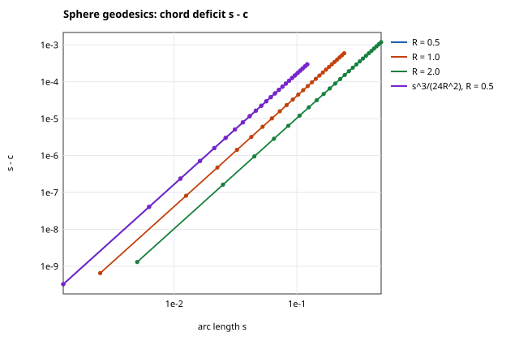
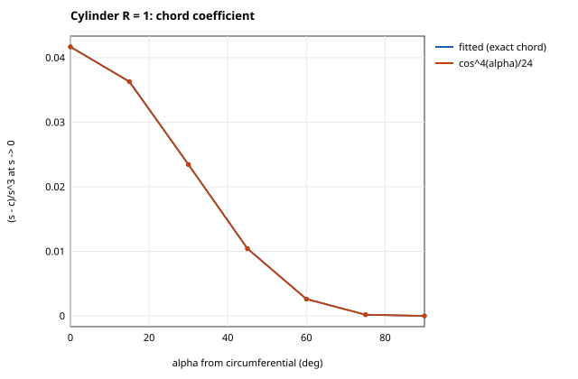
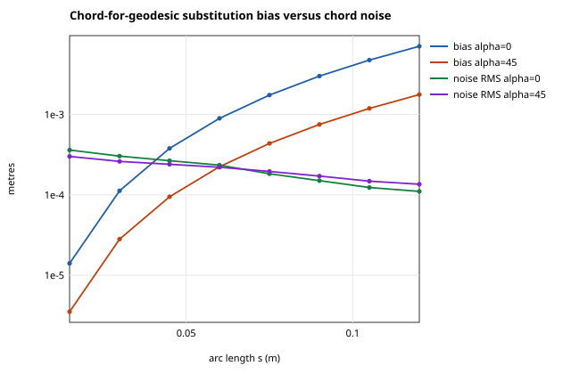
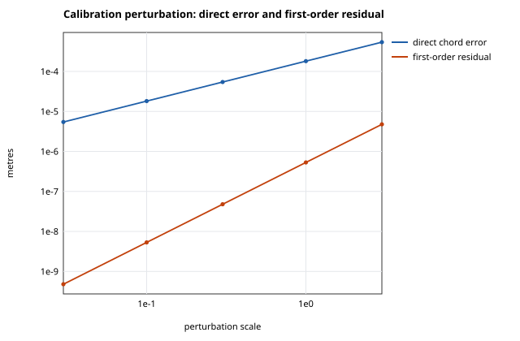
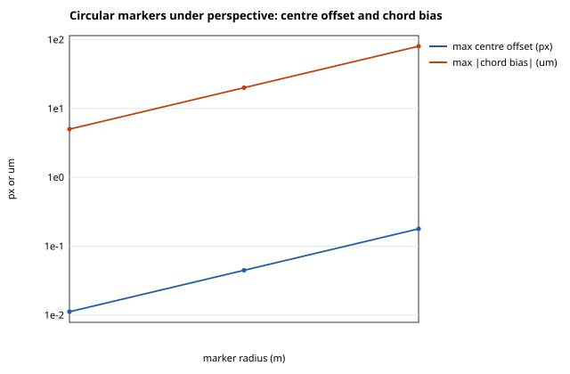
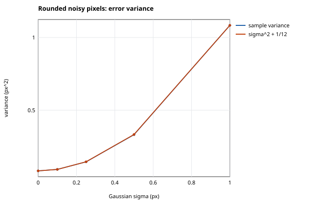
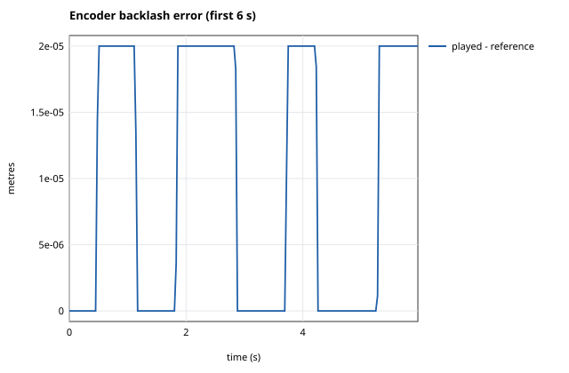
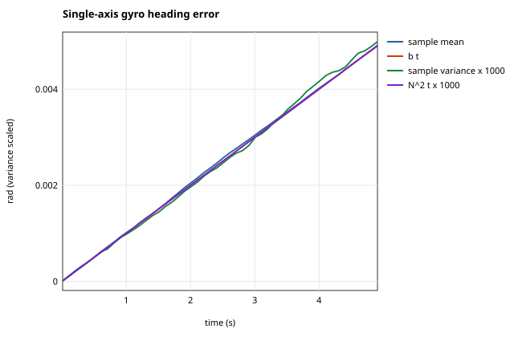
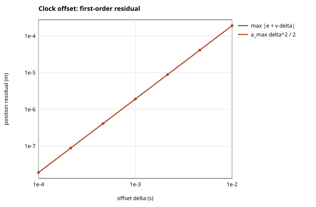
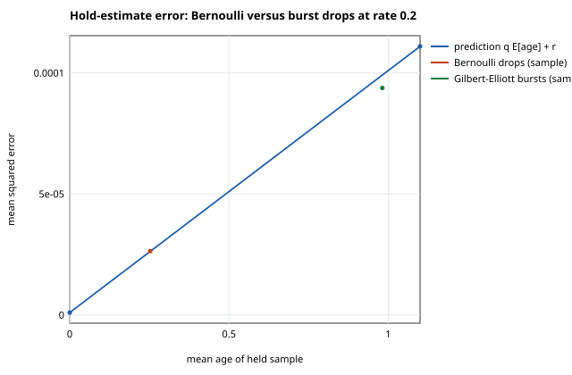
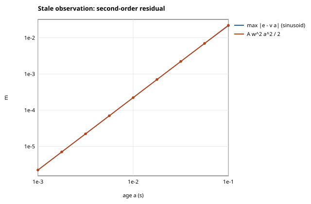
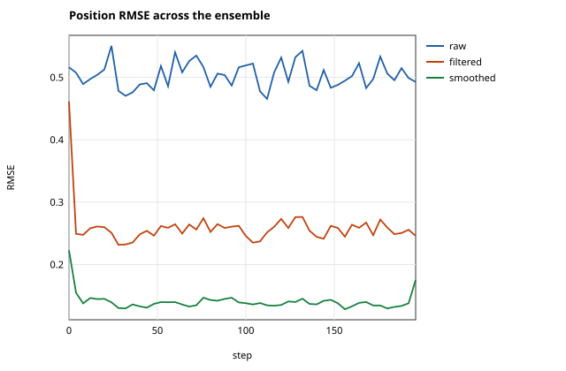
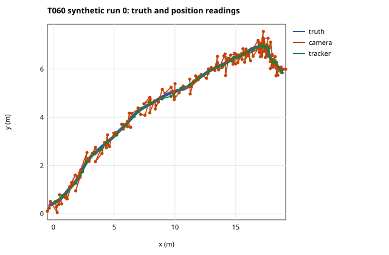
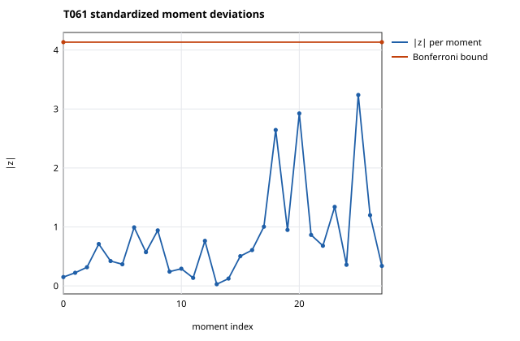
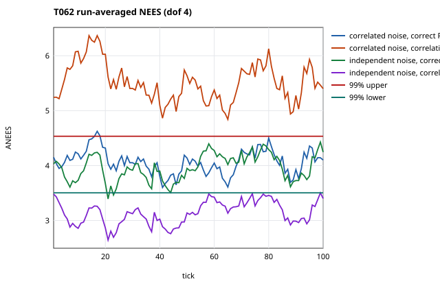
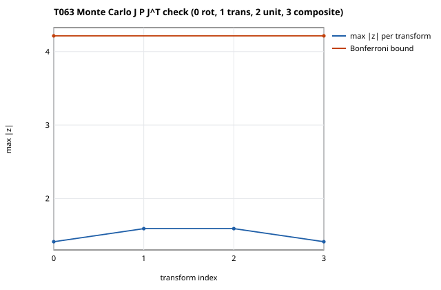
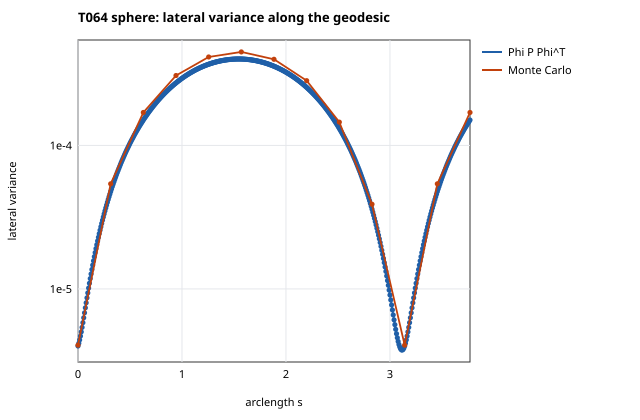
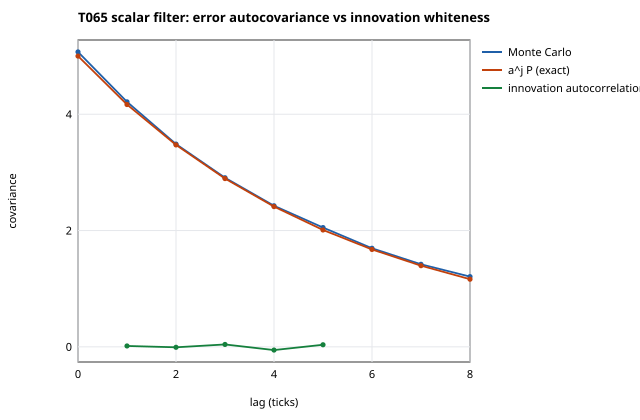
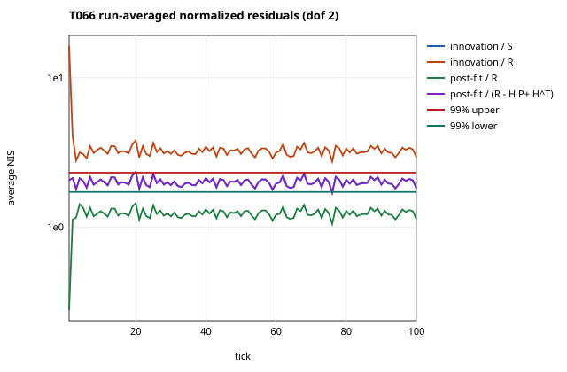
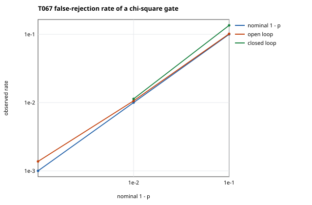
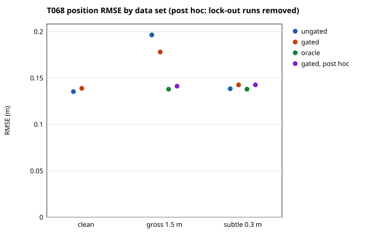
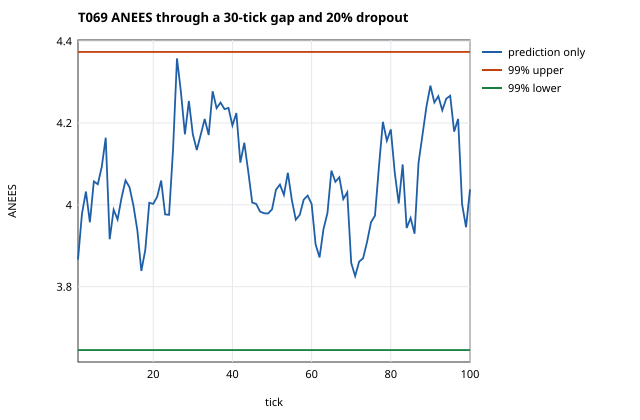
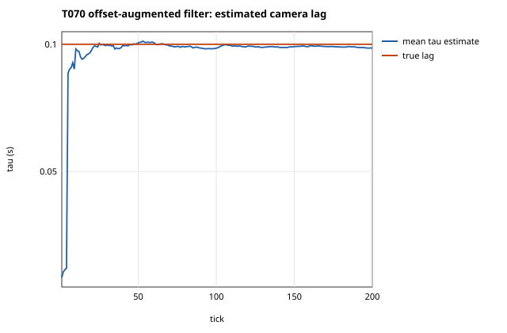
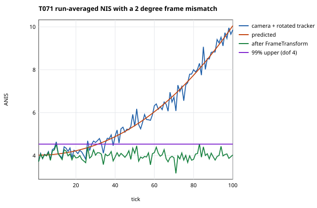
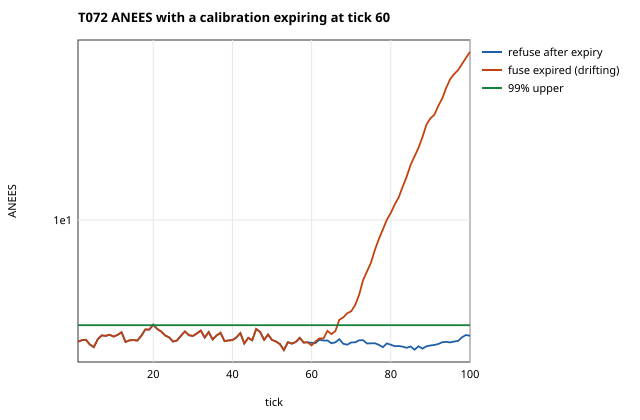
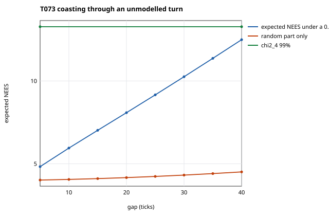
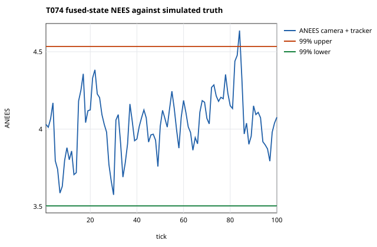
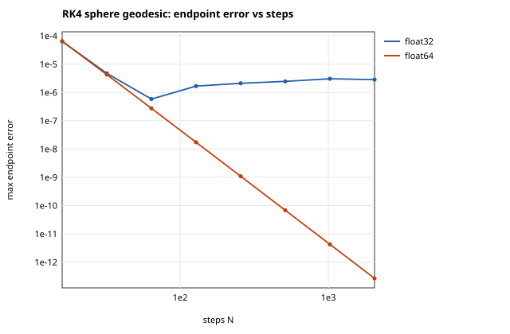
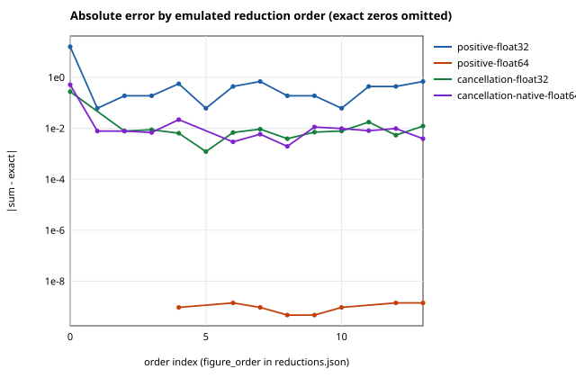
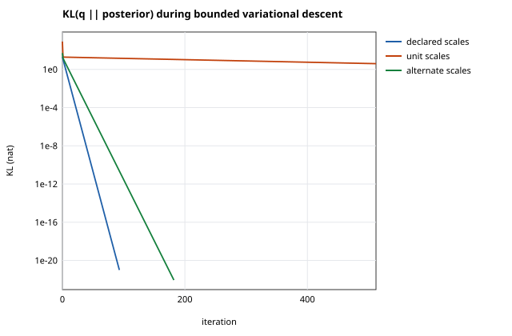
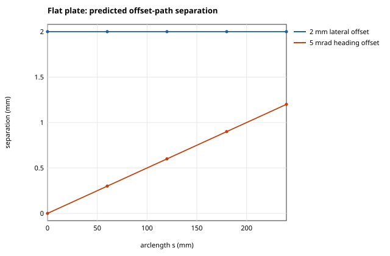
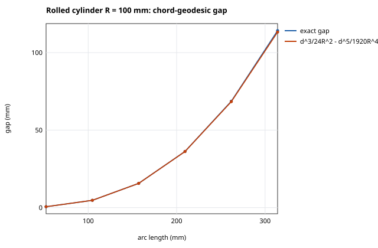
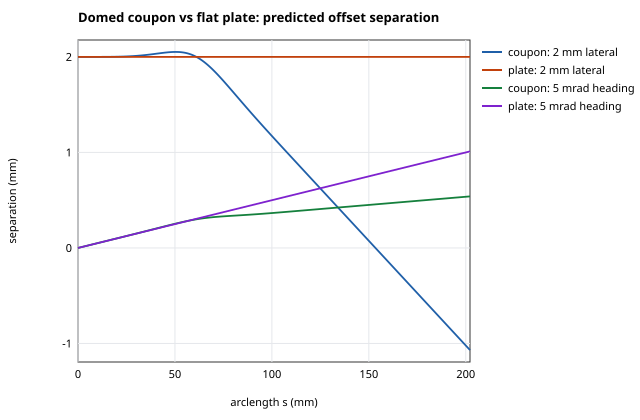
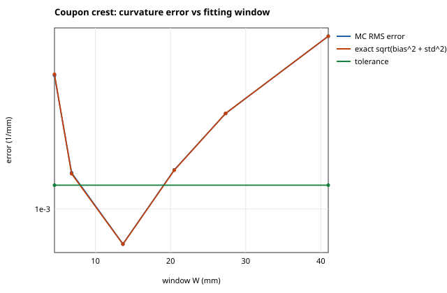
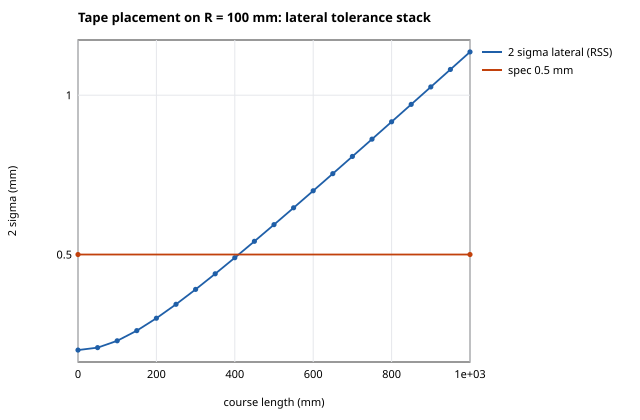
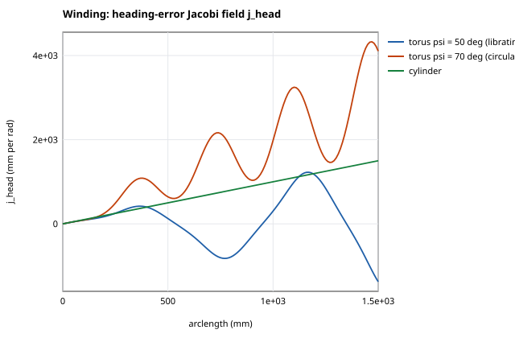
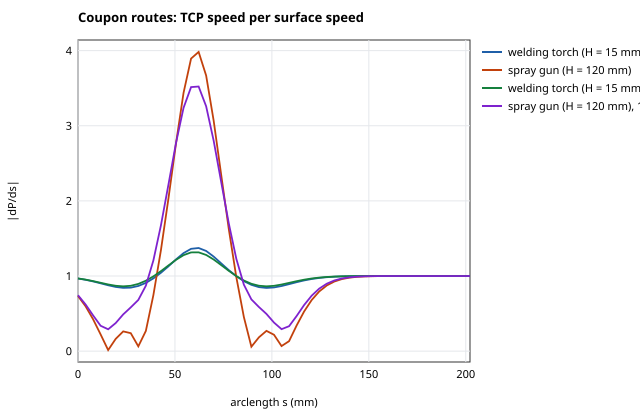
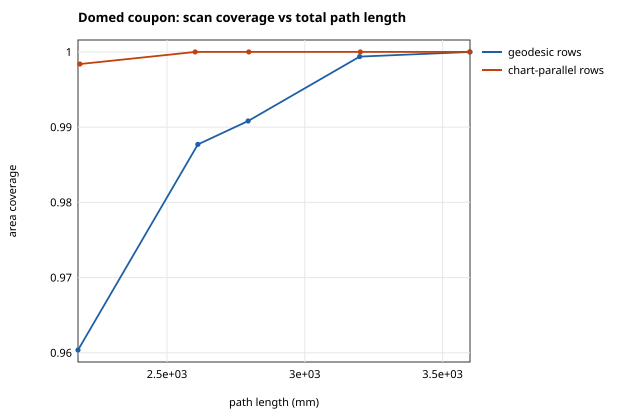
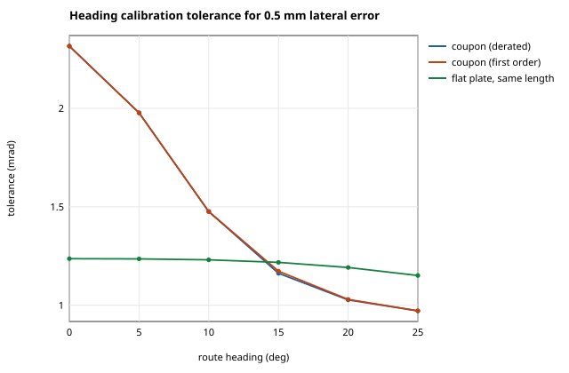
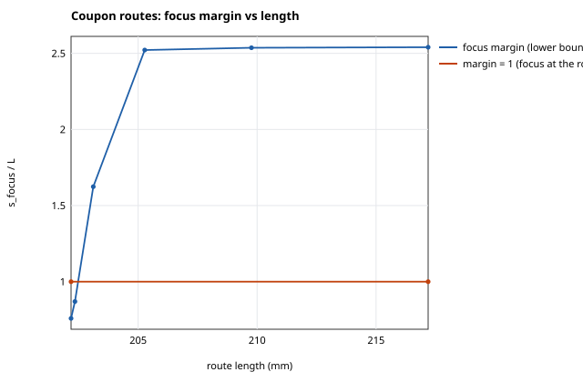

## Discussion

### Counterexamples

Each finding below refutes a general statement; the statement must not be restated without the qualification its witness shows.

- T046 refutes “c = s - kappa(0)^2 s^3/24 + O(s^5) along every surface geodesic”: A torus geodesic with varying curvature keeps the s^4 term kappa0 kappa0'/24 at the start point (`numerically_verified`; reference checks, synthetic inputs (ciw.lab.jacobi.transfer RK4 on Torus(2, 1))). Witness: `{"heading_rad": 0.6, "kappa0": 0.4967476850397676, "kappa0_prime": -0.222669223718571, "s4_coefficient": -0.0046087696213116995 …(+3)}`.
- T046 refutes “For constant space curvature kappa, c = 2 sin(kappa s/2)/kappa”: Constant curvature alone does not give the circle chord: a cylinder helix with torsion deviates at order s^5 by kappa^2 tau^2/720 (`numerically_verified`; reference checks, synthetic inputs (ciw.lab.jacobi.transfer RK4 on Cylinder(1))). Witness: `{"alpha_deg": 45.0, "gap": 2.839002859589268e-05, "kappa": 0.5000000000000001, "s": 0.8 …(+2)}`.
- T047 refutes “The chord-versus-geodesic correction is a property of the surface alone, independent of path direction”: Axial rulings (alpha = 90 deg) have zero chord correction; circumferential paths have the largest coefficient 1/(24 R^2) (`numerically_verified`; reference checks). Witness: `{"alpha_deg_max_correction": 0, "alpha_deg_zero_correction": 90, "coefficient_at_0_deg_R1": 0.04166666666657247, "surface": "cylinder"}`.
- T047 refutes “On an intrinsically flat surface (K = 0) a chord equals the geodesic distance”: Zero Gaussian curvature does not make chord and geodesic distance equal (`numerically_verified`; reference checks). Witness: `{"alpha_deg": 0, "chord": 0.09995833854135666, "s": 0.1, "surface": "cylinder R = 1"}`.
- T049 refutes “A common focal-length error rescales every measured distance by one factor”: A common focal-length error leaves same-depth chords unchanged and scales only the depth component (`numerically_verified`; reference checks). Witness: `{"circumferential_relative_change": 0.00018211500785203505, "focal_error_px": 5.0, "rig": "rectified", "ruling_relative_change": 1.5543122344752192e-15}`.
- T050 refutes “The Brown-Conrady radial model can be inverted everywhere in the image”: Strong barrel distortion (k1 = -0.6) folds inside the image, so the radial model is not invertible there (`numerically_verified`; reference checks). Witness: `{"distorted_radius": 0.481525, "fold_radius_distorted": 0.4969039949999533, "image_corner_radius": 0.5333333333333333, "k1": -0.6 …(+2)}`.
- T050 refutes “The centre of a circular marker's image ellipse is the projection of the marker's centre”: Under full perspective the image-ellipse centre of a tilted circular marker is displaced from the projected marker centre by rho^2 (X t_z - Z t_xy) / (Z (Z^2 - rho^2 t_z)); the displacement vanishes for fronto-parallel markers and under a weak-perspective (affine) projection (`numerically_verified`; reference checks). Witness: `{"camera": "left", "marker": 10, "marker_radius_m": 0.008, "offset_px[0]": -0.1782213150095231 …(+1)}`.
- T051 refutes “Integer pixel rounding always adds 1/12 px^2 to the noise variance”: Without a random grid phase the quantization variance is not 1/12: an integer-aligned coordinate with sigma = 0.1 px has almost no total error, because rounding cancels the Gaussian noise, so the error variance is far below both sigma^2 + 1/12 and sigma^2 (`numerically_verified`; reference checks). Witness: `{"sample_variance": 0.0, "sigma_px": 0.1, "true_coordinate_px": 512.0}`.
- T051 refutes “With a uniform grid phase, integer-rounded pixel errors give chord variance (sigma^2 + 1/12) sum J^2”: A grid phase shared by all markers of a camera correlates their rounding errors: the chord variance follows J Sigma J^T with the sawtooth covariance, and without Gaussian noise (sigma = 0) the independent-error law (sigma^2 + 1/12) sum J^2 is refuted (`numerically_verified`; reference checks, synthetic inputs (ciw.lab.observation_camera.noisy_chords(shared_phase=True))). Witness: `{"alpha_deg": 45.0, "arc_m": 0.06, "grid_phase": "shared by all markers of a camera", "predicted_departure": -0.44041853644450124 …(+2)}`.
- T052 refutes “Fitting reading = a x + c without a direction term gives unbiased scale and bias under backlash”: Least squares that ignores backlash biases the offset estimate by the projection of the play error onto [x, 1] (`numerically_verified`; reference checks). Witness: `{"backlash_m": 2e-05, "bias_error_over_backlash": 0.49788561310110585, "naive_bias_z": 40.156837606636714}`.
- T053 refutes “The mean orientation error from a constant gyro bias grows as |bias| t”: On a body rotating about z, transverse gyro bias produces a bounded orientation error 2 |b_perp| / |omega| instead of |b_perp| t (`numerically_verified`; reference checks). Witness: `{"max_transverse_rad": 0.0006365184325471376, "stationary_transverse_rad": 0.009999999999999929, "bias_rad_per_s[0]": 0.002, "bias_rad_per_s[1]": 0.0 …(+4)}`.
- T055 refutes “Zero-filled gaps can be recognized from the values alone”: Values alone recognize zero fills only in favourable signals: a neighbour-median detector finds every fill 50 sigma from zero, but on a stationary quantized encoder axis a fill equals a genuine zero-count reading (`numerically_verified`; reference checks). Witness: `{"dropped": 46, "fills_equal_to_genuine_readings": 26, "identical_stream_gap_m": 0.0, "seed": 55 …(+1)}`.
- T055 refutes “The drop rate alone determines how much estimates degrade”: Hold-estimate error follows q E[age] + r; bursts at the same drop rate raise it (`numerically_verified`; reference checks, synthetic inputs (random walk through Bernoulli and Gilbert-Elliott channels, seed 55)). Witness: `{"bernoulli_mse": 2.6377978571622868e-05, "burst_mse": 9.379806297833248e-05, "drop_rate": 0.2}`.
- T057 refutes “The smoothed estimate is closer to truth than the filtered estimate at every sample”: Smoothing does not reduce the error of every individual sample (`numerically_verified`; reference checks). Witness: `{"fraction_worse": 0.28528333333333333, "seed": 57}`.
- T061 refutes “A covariance check on one bench run detects a 10% misstatement for every sensor”: At this sample size a 10% understatement of every declared variance is detected with probability above 0.999 per variance for the 10-20 Hz streams but only about half the time for the 2 Hz tracker (exact chi-square power); replicate tracker noise streams reproduce that power (`numerically_verified`; reference checks, synthetic inputs (ciw.lab.sensor_fusion_bench, seed 602087)). Witness: `{"detected_this_run": false, "detection_power": 0.4901452071629382, "samples": 2000, "sensor": "tracker" …(+2)}`.
- T062 refutes “Ignoring correlation between sensor noises is harmless”: Ignoring the camera-tracker cross-correlation makes the filter overconfident: run-averaged NEES exceeds the 99% upper bound at nearly every tick (`numerically_verified`; reference checks, synthetic inputs (ciw.lab.sensor_fusion_bench, seed 602088)). Witness: `{"common_mode_covariance": 0.09, "grand_mean_nees": 5.514214143152381, "nominal": 4.0}`.
- T062 refutes “A passing mean-NIS chi-square test shows the measurement noise model is correct”: The ignored-correlation filter still passes the mean-NIS test (grand mean near 4); among innovation-based tests, which need no ground truth, only the whitened-innovation covariance test exposes the missing cross-correlation (`numerically_verified`; reference checks, synthetic inputs (ciw.lab.sensor_fusion_bench, seed 602088)). Witness: `{"grand_mean_nis": 3.9174506536208624, "whitened_cross_term": 0.6662952145647711}`.
- T062 refutes “Assuming correlation between sensor noises where there is none is a conservative, harmless choice”: Assuming a common-mode correlation that the noise does not have makes the filter underconfident (run-averaged NEES below the 99% lower bound at nearly every tick) and less accurate than the block-diagonal filter, while its NIS exceeds the 99% upper bound at nearly every tick: the reverse mismatch is neither harmless nor invisible (`numerically_verified`; reference checks, synthetic inputs (ciw.lab.sensor_fusion_bench, seed 602088)). Witness: `{"common_mode_assumed": 0.09, "grand_mean_nees": 3.1372673894736733, "grand_mean_nis": 7.722661371152557, "nominal": 4.0 …(+2)}`.
- T063 refutes “Rotating a measurement into another frame without rotating its covariance is harmless”: Rotating a position measurement by 35 degrees without rotating its covariance inflates the mean Mahalanobis distance to tr(P^-1 R P R^T) and multiplies the 99% gate rejection rate (`numerically_verified`; reference checks, synthetic inputs (ciw.lab.sensor_fusion_bench, seed 632026)). Witness: `{"mean_d2": 14.49496148224193, "nominal_mean_d2": 2.0, "rejection_rate_at_99pct_gate": 0.42499, "rotation_deg": 35.0}`.
- T063 refutes “A unit change of the measurement vector alone leaves gating decisions unchanged”: Converting a state to millimetres while keeping its covariance in metres multiplies every squared Mahalanobis distance by exactly 10^6 (`numerically_verified`; reference checks, synthetic inputs (ciw.lab.sensor_fusion_bench, seed 632026)). Witness: `{"consistent_mean_d2": 1.9955687303281424, "mean_d2": 1995568.7303281422}`.
- T064 refutes “Lateral position uncertainty grows monotonically with distance travelled”: Lateral variance collapses at the sphere's conjugate point s = pi: the heading contribution vanishes because j_head(pi) = 0, leaving only the initial lateral variance (`numerically_verified`; reference checks, synthetic inputs (ciw.lab.sensor_fusion_bench, seed 642026)). Witness: `{"s": 3.141592653589793, "surface": "unit sphere", "variance_ratio_to_peak": 0.009048433205893418}`.
- T064 refutes “A first-order (Phi P Phi^T) covariance is accurate for any heading uncertainty below 0.1 rad”: The heading standard deviation at which the first-order variance is 10% too large is about ten times smaller on the hyperbolic plane at s = 3 than on the sphere near its conjugate point (s = 0.9 pi) (`numerically_verified`; reference checks, synthetic inputs (ciw.lab.sensor_fusion_bench, seed 642026)). Witness: `{"relative_variance_error": 0.5892623400956292, "s": 3.0, "sigma_heading": 0.1, "surface": "hyperbolic plane"}`.
- T065 refutes “Successive filtered estimates can be averaged as independent samples”: Treating 20 successive filtered outputs as independent underestimates the variance of their average by the exact factor V_20 / (P/20), and a naive 95% interval covers far less often (`numerically_verified`; reference checks, synthetic inputs (ciw.lab.sensor_fusion_bench, seed 652026)). Witness: `{"n": 20, "naive_95_coverage": 0.5095463774037217, "variance_ratio": 8.078252159913767}`.
- T066 refutes “Innovations can be tested against the raw sensor covariance”: Normalizing innovations by the raw sensor covariance R inflates NIS to tr(R^-1 S) and fails the chi-square test at nearly every tick (`numerically_verified`; reference checks, synthetic inputs (ciw.lab.sensor_fusion_bench, seed 662026)). Witness: `{"grand_mean_nis": 3.3625270796684887, "nominal": 2.0}`.
- T066 refutes “Post-fit residuals have the sensor covariance R”: Normalizing post-fit residuals by the raw R deflates them to tr(S^-1 R) < 2, which would hide an inconsistent filter (`numerically_verified`; reference checks, synthetic inputs (ciw.lab.sensor_fusion_bench, seed 662026)). Witness: `{"grand_mean": 1.2273555630758988, "nominal": 2.0}`.
- T067 refutes “The false-rejection rate of a gated filter equals the nominal 1 - p”: Closed loop, a gated filter rejects valid readings more often than 1 - p at p = 0.9: a rejected reading signals a large prior error that the filter then keeps (`numerically_verified`; reference checks, synthetic inputs (ciw.lab.sensor_fusion_bench, seed 672026)). Witness: `{"p": 0.9, "rate": 0.135175, "rate_after_a_rejection": 0.29975705475612036, "wilson[0]": 0.12964829573860664 …(+1)}`.
- T067 refutes “A chi-square gate on raw-R Mahalanobis distance has false-rejection rate 1 - p”: Gating the NIS computed with the raw sensor covariance R at the 99% quantile rejects valid readings at more than twice the nominal 1% rate (`numerically_verified`; reference checks, synthetic inputs (ciw.lab.sensor_fusion_bench, seed 672026)). Witness: `{"nominal": 0.01, "rate": 0.0366}`.
- T068 refutes “A chi-square gate protects a filter from gross outliers”: Cold-start lock-out: a gross outlier in the first reading passes the gate under the broad prior, and the corrupted state then rejects runs of valid readings; every lock-out run starts this way (`numerically_verified`; reference checks, synthetic inputs (ciw.lab.sensor_fusion_bench, seed 682026)). Witness: `{"longest_valid_rejection_streak": 36, "rmse_gated": 1.9753980773555264, "rmse_oracle": 0.13815641328637332, "run": 150}`.
- T068 refutes “Gating never degrades the estimate when the data are clean”: On clean data the 99% gate raises false alarms at about 1% and increases the mean squared error: the rejected valid readings are the ones that would have corrected a large prior error (`numerically_verified`; reference checks, synthetic inputs (ciw.lab.sensor_fusion_bench, seed 682026)). Witness: `{"paired_z": 9.577530243653909, "rmse_gated": 0.13882950665782604, "rmse_ungated": 0.13535119430297377}`.
- T068 refutes “A Mahalanobis gate removes injected outliers and so improves the estimate”: Subtle 0.3 m outliers pass the gate at the predicted low detection rate; for them gating costs more accuracy than the outliers do (`numerically_verified`; reference checks, synthetic inputs (ciw.lab.sensor_fusion_bench, seed 682026)). Witness: `{"detection_rate": 0.08105263157894736, "magnitude_m": 0.3, "rmse.gated": 0.1426001142269842, "rmse.oracle": 0.13794394236831456 …(+1)}`.
- T069 refutes “A zero placeholder for a missing reading is harmless”: Zero-filling missing readings by hand drags the estimate toward the origin and destroys consistency by the amount the exact joint moments predict (`numerically_verified`; reference checks, synthetic inputs (ciw.lab.sensor_fusion_bench, seed 692026)). Witness: `{"grand_mean_nees": 2305.6002151702023, "nominal": 4.0, "rmse_m": 3.7711939615873082}`.
- T070 refutes “A stale sensor clock always shows up as a bias in the filter innovations”: With the stale camera as the only position sensor the lag is invisible to the innovations: the lagged constant-velocity path is itself a constant-velocity path, so the estimate is biased by about -tau E[v] while the mean test passes (`numerically_verified`; reference checks, synthetic inputs (ciw.lab.sensor_fusion_bench, seed 702026)). Witness: `{"sensors": "camera only", "camera_mean_z[0]": 0.4228861059098964, "camera_mean_z[1]": -0.5395726400825746, "position_error_mean_m[0]": -0.09866380307289671 …(+1)}`.
- T071 refutes “A passing NIS test shows that the sensor frames agree”: Near the rotation centre (ticks 1-20) the same mismatch goes undetected by the per-tick NIS test at this sample size, where its predicted inflation is only about 2%; the run-level grand-mean NIS there agrees with the exact prediction and comes close to the family bound against the nominal value, so a pooled test nearly flags what the per-tick test misses (`numerically_verified`; reference checks, synthetic inputs (ciw.lab.sensor_fusion_bench, seed 712026)). Witness: `{"early_grand_nis": 4.1307324105019, "early_z_vs_nominal": 3.323742365144154, "fraction_inside": 0.95, "rotation_deg": 2.0 …(+1)}`.
- T071 refutes “A frame mismatch always produces NIS inflation”: A rotated sensor fused alone keeps NIS consistent (its readings form a rotated constant-velocity path) while NEES grows: the estimate is confidently in the wrong frame (`numerically_verified`; reference checks, synthetic inputs (ciw.lab.sensor_fusion_bench, seed 712026)). Witness: `{"final_nees": 343.25789304896057, "late_grand_nis": 1.9946921697683178, "sensors": "rotated tracker alone"}`.
- T072 refutes “Readings taken after calibration expiry can be fused like the others”: Under a declared post-expiry drift of 1 cm per tick, refusing expired readings keeps NEES consistent (with a growing covariance) while fusing them makes the filter overconfident by the amount the exact joint moments predict (`numerically_verified`; reference checks, synthetic inputs (ciw.lab.sensor_fusion_bench, seed 722027)). Witness: `{"drift_m_per_tick": 0.01, "nominal": 4.0, "post_expiry_grand_nees": 14.024327327919162}`.
- T073 refutes “A coasting track stays statistically consistent for any gap because its covariance grows”: Under an unmodelled 0.2 rad/s turn during the gap, the expected NEES of the coasting track exceeds the 99% chi-square(4) quantile after a finite gap even though its covariance keeps growing; a radius rule protects against this only if its radius is below the ellipse radius reached by then (`numerically_verified`; derivation, reference checks, synthetic inputs (ciw.lab.sensor_fusion_bench, seed 732028)). Witness: `{"gap_ticks": 44, "omega_rad_s": 0.2, "radius_at_inconsistency_m": 4.590603032028965}`.
- T119 refutes “Gross energy divided by executed solves is an energy per accepted numerical result”: Dividing gross energy by executed solves reports a finite energy per result for the under-target fixture although no result is accepted (`numerically_verified`; reference checks, synthetic inputs (examples/energy-accuracy synthetic fixtures)). Witness: `{"accepted_solves": 0, "fixture": "under-target", "naive_j_per_solve": 0.05}`.
- T120 refutes “Halving floating-point precision reaches every accuracy target at no greater operation count”: Lowering precision to float32 cannot reach a 1e-7 endpoint accuracy at any step count up to 2048, while float64 reaches it (`numerically_verified`; reference checks, synthetic inputs (equatorial unit-sphere geodesics)). Witness: `{"float32_min_error": 5.826263982645739e-07, "float64_steps": 128, "target": 1e-07}`.
- T120 refutes “Halving floating-point precision reaches every accuracy target of the Gaussian VI workload at no greater operation count”: Lowering the common Gaussian VI workload to float32 cannot reach a 1e-14 nat KL target within 256 iterations, while float64 reaches it (`numerically_verified`; reference checks, synthetic inputs (common Gaussian VI workload (examples/energy-accuracy/problem.json))). Witness: `{"float32_floor_kl": 2.429755366417848e-14, "float64_iteration": 69, "target_kl_nats": 1e-14}`.
- T121 refutes “The sign of a float32 reduction (a pass/fail decision at threshold 0) does not depend on the reduction order”: Reduction order alone flips the sign of a float32 sum whose exact value is +0.25 (the one-thread sequential CPU fold against the GPU-style orders) (`numerically_verified`; reference checks, synthetic inputs (seeded reduction datasets, seed 20260923)). Witness: `{"exact_sum": 0.25, "found_by": "first flipping seed of 1..399 comparing sequential …", "seed": 201, "sums.atomic-0": 0.2431640625 …(+13)}`.
- T121 refutes “float64 reductions are order-robust for sign decisions”: Reduction order alone flips the sign of a float64 sum of float64-native cancellation data whose exact value is +0.25 (the sequential fold against the GPU-style orders) (`numerically_verified`; reference checks, synthetic inputs (seeded reduction datasets, seed 20260923)). Witness: `{"exact_sum": 0.25, "scale": 1099511627776.0, "seed": 1, "sums.atomic-0": 0.2529296875 …(+13)}`.
- T121 refutes “Atomic completion order cannot change a float32 pass/fail decision on identical inputs”: Atomic completion order alone changes a float32 pass/fail test |S - 0.25| <= 0.01 on identical inputs (`numerically_verified`; reference checks, synthetic inputs (seeded reduction datasets, seed 20260923)). Witness: `{"exact_sum": 0.25, "tolerance": 0.01, "failing.atomic-5": 0.232421875, "failing.atomic-7": 0.23779296875 …(+6)}`.
- T121 refutes “Accumulating the same block partials yields the same float32 result whatever the atomic completion order”: Emulated atomicAdd completion orders of identical float32 block partials give distinct sums (`numerically_verified`; reference checks, synthetic inputs (seeded reduction datasets, seed 20260923)). Witness: `{"distinct_results[0]": 4102183.5, "distinct_results[1]": 4102183.75, "distinct_results[2]": 4102184.0, "distinct_results[3]": 4102184.25}`.
- T121 refutes “A max reduction built from a comparison select is bitwise order-invariant for every IEEE input”: A comparison-select maximum (a if a >= b else b, the rule numpy documents for np.maximum) returns its first operand for +0.0 and -0.0, so the sign of the result depends on operand order (`numerically_verified`; reference checks). Witness: `{"orders[0]": "(+0.0, -0.0)", "orders[1]": "(-0.0, +0.0)", "signbits[0]": false, "signbits[1]": true}`.
- T121 refutes “A fixed-order reduction gives the same binary64 result whether or not the compiler contracts its multiply-adds”: Fused multiply-add contraction of the common workload's in-kernel reductions changes its binary64 outputs, so a bitwise CPU/GPU comparison detects a contracting build (`numerically_verified`; reference checks, synthetic inputs (common Gaussian VI workload (examples/energy-accuracy/problem.json))). Witness: `{"iterations": 38, "max_ulp": 6, "variant": "fma-second"}`.
- T122 refutes “Gradient descent on the variational free energy converges for every positive step size”: A mean step 1.2 times the stability bound makes KL grow instead of converge (`numerically_verified`; reference checks, synthetic inputs (declared two-latent linear-Gaussian problem)). Witness: `{"alpha": 0.563720425245574, "stable_bound": 0.46976702103797835}`.
- T122 refutes “Coordinate normalization changes only units, not bounded convergence”: Unit scales leave the same problem unconverged after 512 iterations (condition number 1.3e3) (`numerically_verified`; reference checks, synthetic inputs (declared two-latent linear-Gaussian problem)). Witness: `{"declared_iterations": 93, "unit_final_kl_nats": 3.9917424034797877}`.
- T123 refutes “Adding variational free energy to physical energy yields a unit-independent quantity”: An untyped sum of free energy and physical energy changes when the energy unit changes (`analytic`; derivation). Witness: `{"energy": "0.2 J = 200 mJ", "free_energy_nats": 8.40639441534792}`.
- T124 refutes “A valid log digest shows that the retained readings are unmodified hardware output”: A log whose counter readings were doubled and then resealed passes validation (`numerically_verified`; reference checks, synthetic inputs (examples/energy-accuracy synthetic fixtures)). Witness: `{"log_digest": "sha256:d93ef3111f855922cfa1fd87f8fe04d6b18b63b70836e93b48a47 …", "mutation": "every energy_mj doubled, then energy_records.seal"}`.
- T124 refutes “The declared origin of a retained energy log authenticates a physical measurement”: Relabelling a synthetic fixture as physical_measurement makes its analysis eligible for physical comparison (`numerically_verified`; reference checks, synthetic inputs (examples/energy-accuracy synthetic fixtures)). Witness: `{"origin": "physical_measurement", "run_id": "energy-run-11111111111111111111111111111111"}`.
- T127 refutes “On an intrinsically flat (developable) part the straight chord between two markers equals their surface distance, as on the flat plate”: A marker chord differs from the surface distance on a developable (intrinsically flat) part (`numerically_verified`; reference checks). Witness: `{"chord_mm": 141.42135623730948, "dphi_deg": 90, "geodesic_mm": 157.07963267948966, "radius_mm": 100.0}`.
- T129 refutes “A window chosen from the osculating circle keeps the quadratic-fit curvature bias within tolerance on any convex profile”: The osculating-circle window rule under-predicts the coupon-crest curvature bias (`numerically_verified`; reference checks). Witness: `{"bias_per_mm": 0.002450826969304161, "profile": "Gaussian crest h = 10 mm, sigma = 20 mm", "quartic_ratio_gauss_over_circle": 3.999999999999999, "window_mm": 27.325202042558928}`.
- T129 refutes “Sampling a smaller neighbourhood (more local fit) always improves the curvature estimate”: A smaller fitting window at fixed spacing can make the curvature estimate worse (`numerically_verified`; reference checks, synthetic inputs (gaussian scanner noise, seed 20260926)). Witness: `{"rms_error_per_mm": 0.0034813081403234844, "spacing_mm": 0.6457054880813021, "window_mm": 4.554200340426489}`.
- T129 refutes “A dome inside the declared forming tolerances is described by the nominal Gaussian model, so its parameters alone fix the prediction”: The fit residual flags an elliptical as-built dome inside the declared width tolerance (chi2 model test) (`numerically_verified`; reference checks, synthetic inputs (synthetic coupon scans, seed 20260935)). Witness: `{"chi2_per_dof": 19.979819127048078, "sigma_x_mm": 20.5, "sigma_y_mm": 19.5, "threshold": 1.0858002377726916}`.
- T132 refutes “A helix programmed in machine coordinates (phi, z) is insensitive to mandrel radius error because it is a geodesic on every cylinder”: Programming a helix in machine angles transfers mandrel radius error into lateral drift (`numerically_verified`; reference checks). Witness: `{"course_mm": 1000.0, "fibre_angle_deg": 45.0, "radius_error_mm": 0.2, "radius_mm": 100.0}`.
- T133 refutes “A constant winding angle (as on a cylinder) is a geodesic, slip-free path on every mandrel of revolution”: A constant winding angle is not geodesic on the torus mandrel (`numerically_verified`; reference checks). Witness: `{"heading_from_parallel_deg": 50, "max_slippage_ratio": 0.44362847281391804, "mandrel.chart": "(phi, theta)", "mandrel.major": 150.0 …(+2)}`.
- T134 refutes “The standoff (offset) tool path of a smooth surface path is itself a smooth path the robot can follow at constant speed”: A spray standoff beyond the concave radius of curvature folds the tool-centre-point path (`numerically_verified`; reference checks). Witness: `{"min_concave_radius_mm": 94.49847176098345, "route": "coupon nominal route across the dome rim", "standoff_mm": 120.0}`.
- T135 refutes “Geodesic scan rows launched at the swath spacing cover a curved coupon as completely as they cover a flat plate”: Geodesic rows at the swath spacing leave gaps on the domed coupon (`numerically_verified`; reference checks). Witness: `{"coverage": 0.9603546538097882, "max_j_lat": 1.5555839572007397, "plan": "geodesic x1", "plate_coverage": 1.0}`.
- T136 refutes “Allocating spec / (2 max |j|) to each error source keeps the exactly perturbed route within the spec”: The first-order tolerance allocation exceeds the spec at a tolerance corner on some off-axis routes (`numerically_verified`; reference checks). Witness: `{"route": "fan+15deg", "worst_corner_ratio": 1.0091492341266857}`.
- T137 refutes “The shortest route between a station and an edge is also the one farthest, relative to its length, from a focal or conjugate point (largest focal clearance ratio)”: The shortest candidate route has the lowest focal clearance ratio (`numerically_verified`; reference checks). Witness: `{"focus_margin_lower_bound_mm": 297.82031552321394, "focus_margin_mm": null, "length_mm": 202.1796844767861, "nearest_focus_kind": "focal" …(+4)}`.
- T138 refutes “A physically correct model passes E_n <= 1 against its open-loop prediction when U covers only the instrument and the dome tolerances”: A 2-sigma start offset of the declared jig makes a correct model fail E_n <= 1 unless the start pose is budgeted or measured (`numerically_verified`; reference checks, synthetic inputs (exactly re-integrated realized tape (model output as ideal data), seed 20260926)). Witness: `{"declared_jig_sigma_mm": 0.05196152422706632, "max_en_without_execution": 1.8788917732749837, "realized_offset_mm": 2.1039230484541327}`.
- T140 refutes “The uncertainty of a curved-surface prediction compared with a photogrammetric measurement is limited by the instrument”: The coupon focal-distance prediction is geometry-limited, not instrument-limited, under the declared dome tolerances, instrument and start-pose uncertainties (`numerically_verified`; reference checks). Witness: `{"quantity": "coupon focal distance", "components_mm.execution": 0.8324762391006113, "components_mm.geometry": 4.388650263504834, "components_mm.instrument": 1.2903303761332685 …(+1)}`.
- T141 refutes “evidence.finding labels a claim from its basis and domain alone, so an acceptance statement filed in a computational domain with a passing check is established (the loophole T141 recorded before evidence.screen_authority_claim)”: evidence.finding and validate_finding refuse an acceptance or rejection statement filed in a computational or physical domain because of its wording (`numerically_verified`; reference checks). Witness: `{"claim": "Coupon lot accepted for production", "domain": "computational_pipeline", "refused_by": "ciw.lab.evidence.screen_authority_claim"}`.
- T141 refutes “The lab API cannot mark production acceptance”: A paraphrased acceptance statement outside both screened vocabularies, filed in a computational domain with a passing check, is still labelled by its checks (`numerically_verified`; reference checks). Witness: `{"claim": "Coupon lot fit for shipment to the customer", "domain": "computational_pipeline", "label": "numerically_verified", "screens_passed[0]": "ciw.lab.evidence.screen_authority_claim" …(+1)}`.

Their interpretation against the literature is outstanding.

## Limitations

What a computational experiment may establish, and what it cannot establish alone:

| A computational experiment may establish | It cannot establish alone |
| --- | --- |
| Analytic agreement | Physical truth |
| Numerical convergence | Calibration validity |
| Synthetic sensor performance | Real sensor performance |
| Replay determinism | Independent verification by another party |
| Schema/provenance integrity | Machine safety |
| GPU/CPU agreement | Industrial readiness |
| A plausible use case | Actual customer demand |
| A simulated control response | Safe actuator authority |

### Claims not established

- T045 [sensor_performance]: The declared noise-model parameters describe real instruments of these modes — not established.
- T046 [physical]: The chord correction computed from nominal curvature holds for chords measured on a physical part — not established.
- T047 [physical]: Chords measured between physical markers on a cylindrical part follow the cos^4(alpha)/(24 R^2) coefficient — not established.
- T048 [sensor_performance]: A physical stereo rig with this geometry achieves the synthetic chord accuracy — not established.
- T049 [calibration]: The declared perturbation magnitudes bound the calibration error of a real stereo rig — not established.
- T050 [calibration]: A two-term radial plus tangential Brown-Conrady model describes a real lens to the required accuracy — not established.
- T050 [sensor_performance]: Real circular markers and their detector show only the modelled perspective centre bias — not established.
- T051 [sensor_performance]: Real image noise is Gaussian with sigma = 0.25 px and marker localization rounds to whole pixels — not established.
- T052 [physical]: A real encoder drive train behaves as a constant-width play operator with constant scale and bias — not established.
- T053 [sensor_performance]: Real gyroscopes have constant bias and white rate noise with the declared densities — not established.
- T054 [physical]: Real sensor clocks have the declared constant offset and white jitter — not established.
- T055 [sensor_performance]: Real links drop observations as Bernoulli or two-state burst processes with these rates — not established.
- T056 [physical]: Real tracker latencies and target speeds match the declared values — not established.
- T057 [sensor_performance]: A real tracker's measurement noise and target motion match the constant-velocity model — not established.
- T058 [calibration]: The declared frame and clock mappings equal the real extrinsic calibration and clock synchronization — not established.
- T059 [actuator_authority]: Admission as workbench state confers authority to act on a machine — not established.
- T060 [sensor_performance]: The bench's noise levels, rates and motion describe real camera, encoder, IMU or tracker hardware — not established.
- T061 [sensor_performance]: Real sensors' noise covariance equals the covariance declared for this bench — not established.
- T062 [sensor_performance]: Real camera and tracker noises share the common-mode covariance assumed here, or are independent — not established.
- T063 [calibration]: The declared 35 degree rotation, translation and body covariance describe a real sensor mounting or extrinsic calibration — not established.
- T064 [physical]: The declared [lateral, heading] covariance and these surfaces predict the path uncertainty of a real vehicle or tool on a real curved part — not established.
- T065 [sensor_performance]: A real sensor's internally filtered output can be fused downstream as white noise — not established.
- T066 [sensor_performance]: A real residual monitor normalized by datasheet sensor covariance is correctly calibrated — not established.
- T067 [sensor_performance]: A real gate at the 99% quantile rejects 1% of valid real readings — not established.
- T068 [sensor_performance]: Real outliers are rare, isolated and of fixed magnitude as in this contamination model — not established.
- T069 [sensor_performance]: Real sensor dropouts are independent of the state and of the noise, as assumed here — not established.
- T070 [calibration]: The recovered offset calibrates the clock of a real camera — not established.
- T071 [calibration]: A 2 degree rotation is the size of a real extrinsic calibration error — not established.
- T072 [calibration]: The validity interval [0, 60) reflects how long a real camera calibration stays valid — not established.
- T073 [machine_safety]: A 1 m, 99% track-loss radius is a safe operating threshold — not established.
- T074 [physical]: The fused estimate equals the physical state of a real target within its covariance — not established.
- T075 [actuator_authority]: An admitted synthetic state may command actuators — not established.
- T075 [calibration]: The declared tracker latency, synchronization and room-to-cell mapping are those of a real tracker installation — not established.
- T076 [production_acceptance]: Synthetic fusion output is admissible as production state — not established.
- T115 [physical]: Gross CPU package energy (background-inclusive, idle not subtracted) per geodesic trajectory — not established.
- T115 [physical]: Idle-subtracted CPU package energy per geodesic trajectory (equal-length idle bracket after the workload) — not established.
- T115 [physical]: Gross CPU package energy (background-inclusive, idle not subtracted) per batch of the common Gaussian VI workload (NumPy float64 reference) — not established.
- T115 [physical]: Idle-subtracted CPU package energy per batch of the common Gaussian VI workload (NumPy float64 reference) — not established.
- T116 [physical]: GPU-domain gross energy per measured batch — not established.
- T116 [sensor_performance]: The NVML total-energy counter of the RTX 2080 has a characterized accuracy and resolution — not established.
- T117 [numerical]: The gaussian_vi PTX kernel on the GPU reproduces the NumPy reference bitwise on every replica of the common Gaussian VI workload — not established.
- T117 [numerical]: A Julia implementation of the common Gaussian VI workload agrees with the NumPy reference — not established.
- T117 [physical]: CPU package energy per batch of the common Gaussian VI workload: Rust port and NumPy reference (RAPL, gross and idle-subtracted) — not established.
- T118 [physical]: RTX 2080 power draw during the measurement phase (NVML) — not established.
- T118 [physical]: RTX 2080 temperature during the measurement phase (NVML) — not established.
- T118 [physical]: RTX 2080 graphics clock during the measurement phase (NVML) — not established.
- T118 [physical]: Host-bracketed batch solve duration (launch, sync and copy included) — not established.
- T118 [physical]: RTX 2080 GPU utilization during the measurement phase (nvidia-smi rows inside the measurement window) — not established.
- T118 [physical]: RTX 2080 power draw is steady over the measurement phase (coefficient of variation <= 0.10) — not established.
- T118 [physical]: RTX 2080 temperature drifts by at most 5 C over the measurement phase — not established.
- T118 [physical]: RTX 2080 kernel-only duration of the Gaussian VI kernel — not established.
- T119 [physical]: Physical GPU energy per accepted numerical result — not established.
- T120 [physical]: CPU package energy per batch of the common Gaussian VI workload in float32 and in float64 (NumPy reference, RAPL, gross and idle-subtracted) — not established.
- T120 [physical]: GPU energy per batch of a float32 build of the common Gaussian VI workload — not established.
- T121 [numerical]: The gaussian_vi PTX kernel keeps the declared unfused order of its in-kernel reductions on the GPU: its outputs equal the NumPy reference bitwise — not established.
- T121 [numerical]: A device-wide reduction of the common workload's per-replica outputs on the RTX 2080 (a fixed tree per T148's policy, and atomicAdd) reproduces the emulated order spreads and sign flips — not established.
- T122 [physical]: The variational free energy of this model equals a thermodynamic free energy of a physical system — not established.
- T123 [physical]: A decrease of variational free energy corresponds to a decrease of physical energy consumed by the computation — not established.
- T124 [physical]: The fixtures' counter readings were produced by a physical GPU and NVML counter — not established.
- T124 [provenance]: The bound operator log retains raw timestamped counter readings and every device/runtime identity field, none a placeholder — not established.
- T124 [physical]: The bound operator log names an NVML device present on this analyzing host (UUID, name, driver, NVML version and NVML library digest equal this host's; the capture is unauthenticated) — not established.
- T125 [physical]: Replayed energy values are physically valid measurements — not established.
- T126 [physical]: Measured marker chords on the physical plate equal the predicted geodesic distances within instrument uncertainty — not established.
- T126 [calibration]: The declared instrument uncertainties (camera 0.02 mm, tracker 0.015 mm, CMM 0.002 mm) hold for the instruments that will be used — not established.
- T127 [physical]: Measured chords and surface distances on the physical tube match the predicted gaps — not established.
- T127 [calibration]: The physical tube radius and roundness lie within the declared +/- 0.1 mm — not established.
- T127 [calibration]: The unrolled-film gauge achieves the declared 0.05 mm on marker-to-marker surface distances — not established.
- T128 [physical]: Measured separations of offset routes on the physical coupon follow the Jacobi prediction and cross at the predicted focal point — not established.
- T128 [calibration]: The formed coupon matches the declared dome (height 10 mm, sigma 20 mm) within tolerance — not established.
- T128 [physical]: An unsteered 3 mm tape laid on the coupon follows a geodesic of the as-built surface (no in-plane bending, lift-off or slip) — not established.
- T128 [calibration]: The start jig realizes the relative start pose of the offset tape within the declared 0.05 mm and 0.5 mrad of its insert and the laying and 0.01 mm and 0.1 mrad per seating of the jig — not established.
- T129 [sensor_performance]: A real laser line scanner achieves the declared 0.01 mm point noise on the coupon surface (finish, incidence angle, speckle) — not established.
- T129 [physical]: The formed coupon passes the Gaussian model test and its fitted height and width lie within the declared forming tolerances — not established.
- T129 [calibration]: The declared scanner scale (20 ppm) and target registration uncertainties hold for the scan — not established.
- T130 [calibration]: The physical gauge sphere, step gauge and scale bar have their certified dimensions, and the lab frame chain has the declared covariances — not established.
- T131 [sensor_performance]: The real gage (instrument, fixture and operators) has %GRR below 10% on the coupon features — not established.
- T131 [production_acceptance]: The measurement system is approved for production use — not established.
- T132 [physical]: Tows placed by a real AFP head follow the programmed course within the stack, with gaps and overlaps inside 0.5 mm — not established.
- T132 [physical]: The declared 635 mm minimum steering radius avoids tow wrinkling for the placed material — not established.
- T133 [physical]: Fibre does not slip on a real mandrel wherever abs(kappa_g / kappa_n) <= 0.2 (the friction coefficient is declared, not measured) — not established.
- T134 [physical]: The torch or gun on a real cell stays within the predicted lateral and standoff band — not established.
- T134 [machine_safety]: The trajectory is safe to execute on a welding or coating robot cell — not established.
- T135 [sensor_performance]: The real scanner footprint is a 20 mm swath on this surface at the planned standoff — not established.
- T136 [calibration]: The robot, fixture and frame calibration achieves the required heading and lateral tolerances — not established.
- T137 [physical]: Physical paths near a predicted focus show the predicted loss of lateral-error ordering — not established.
- T138 [computational_pipeline]: Normalized errors of the bound metrology captures against the prediction of their protocol, computed from their unauthenticated bytes — not established.
- T138 [physical]: Measured separation on the coupon agrees with the prediction (E_n <= 1 at every station) — not established.
- T138 [calibration]: The start jig realizes the relative start pose of the offset tape within the declared 0.05 mm and 0.5 mrad of its insert and the laying and 0.01 mm and 0.1 mrad per seating of the jig — not established.
- T139 [computational_pipeline]: A bound retention record validates against the raw bytes bound with it and yields acquisition fields (computational: the bytes are unauthenticated) — not established.
- T139 [physical]: A real measurement with raw bytes, calibration and frame metadata has been retained — not established.
- T140 [calibration]: The declared instrument uncertainties are the uncertainties of the instruments used — not established.
- T140 [calibration]: The start jig realizes the relative start pose of the offset tape within the declared 0.05 mm and 0.5 mrad of its insert and the laying and 0.01 mm and 0.1 mrad per seating of the jig — not established.
- T140 [physical]: The budget contains every significant physical error source (thermal, fixturing, tape bending along the route, target centring) — not established.
- T141 [computational_pipeline]: Domain assignment of free-text claims is machine-checked across the lab — not established.
- T141 [production_acceptance]: Production acceptance of the coupon, cylinder or plate process — not established.
- T141 [industrial_readiness]: The manufacturing protocols and models are ready for industrial use — not established.
- T141 [customer_demand]: Manufacturers need curvature-aware placement, winding, coating or inspection path checking — not established.

### Unfinished tasks

What each blocked, deferred or partial task is missing, in its own words (its unresolved assumptions):

- T115 is partial; missing or unresolved:
  - Evaluation and operation counts are work proxies, not energy measurements
  - Package energy is not attributed to this process; idle subtraction assumes the idle interval after the workload represents the background during it
  - A capture is an operator record: identity binding is checked, authenticity is not
  - CPU energy per common-workload batch (here) and GPU energy per batch (T116) are for the same computation (the RAPL gate and T116's NVML gate both require the common workload's kernel, problem, prepared inputs, K and replicas) but different counters, scopes and batch boundaries: package versus whole device; the NumPy bracket excludes the prepared inputs (computed once before bracketing) and includes their per-batch broadcast to the replica columns, the GPU batch includes launch, synchronization, copy and the worker's output check; no finding combines them
  - no rapl-log capture was bound (--capture rapl-log=PATH or CIW_LAB_RAPL_LOG); the lab runner acquires no energy measurement: make one with `python -m ciw.lab.energy_gpu_telemetry rapl-capture` on a Linux host with readable intel-rapl counters (needs hardware:rapl)
- T116 is blocked; missing or unresolved:
  - Blocked here: no NVIDIA GPU or NVML
  - NVML documents the total-energy counter for Volta-or-newer fully supported devices; GeForce support is not documented, so `ciw energy probe` must confirm it on this RTX 2080
  - An operator log is an unauthenticated record; the gate binds it to this host's NVML identity but cannot prove the capture genuine
- T117 is partial; missing or unresolved:
  - No Julia implementation of the common Gaussian VI workload exists in the repository (T145 plans a Julia worker behind the SCR boundary; none exists), so that comparison cannot run on any host, whatever the tool:julia probe reports; the GPU comparison runs wherever an NVIDIA GPU answers the probe
  - Deferred research question: a Julia port of the common Gaussian VI workload with the kernel's operation order (no fused multiply-add), run through the Julia worker T145 plans behind the SCR boundary and compared bitwise with the NumPy reference
  - Deferred research question: extend the common workload's GPU path beyond the binary64 gaussian_vi PTX kernel of ciw.energy_cuda: a float32 rendering of the same kernel, and a device-wide reduction of its per-replica outputs (a fixed tree over the stored order per T148's REDUCTION_POLICY, plus one atomicAdd variant), each compared with the NumPy reference by compare_outputs on the RTX 2080 host and captured with `ciw energy record` for energy; until then those claims stay not_established on every host
  - Cross-platform bitwise identity of the sphere kernel is not claimed
  - The Rust and NumPy RAPL brackets share one boundary except process overhead: both exclude the prepared inputs (computed once before bracketing, telemetry.NUMPY_BOUNDARY and RUST_BOUNDARY); the Rust bracket includes one process start and one JSON exchange for all its batches, and the NumPy bracket vectorizes each batch across replicas; rust_over_numpy_idle_subtracted compares these two bracket contents, not the arithmetic alone
  - no NVIDIA GPU answered the hardware:nvidia-gpu probe in this task; the PTX kernel of the common workload exists (ciw.energy_cuda gaussian_vi), so this comparison runs on a host where the probe succeeds (needs hardware:nvidia-gpu)
  - no rapl-log capture was bound (--capture rapl-log=PATH or CIW_LAB_RAPL_LOG); the lab runner acquires no energy measurement: make one with `python -m ciw.lab.energy_gpu_telemetry rapl-capture` on a Linux host with readable intel-rapl counters (needs hardware:rapl)
- T118 is blocked; missing or unresolved:
  - Blocked here: no NVIDIA GPU
  - Batch windows in log.json include launch, synchronization and copy; they are not kernel durations
  - The steady-state limits (CV 0.10, 5 C) are declared protocol criteria, not derived
  - Deferred research question: ingest `nsys stats --report cuda_gpu_kern_sum` output (its raw bytes retained as an artifact, bound through the acquisition gate to the same device UUID and capture session) so T118 can report RTX 2080 kernel-only duration; until then that claim stays not_established on every host
- T119 is partial; missing or unresolved:
  - Idle subtraction and first-attainment accounting are intentionally not applied
  - The recomputation shares its origin (ciw) with energy_records, so it is a cross-implementation check, not independent verification
  - An operator log is an unauthenticated record; the gate binds it to this host's NVML identity but cannot prove the capture genuine
  - no operator NVML log was supplied (--capture energy-log=PATH or CIW_LAB_ENERGY_LOG); the repository fixtures are synthetic, so no physical energy per accepted result was measured
- T120 is partial; missing or unresolved:
  - Operation counts do not capture memory traffic, vector width, transcendental cost or GPU float32 throughput; only a capture relates precision to energy
  - The NumPy reference runs each precision vectorized across replicas; CPU energy per batch reflects that implementation, not the GPU kernel
  - Both precision brackets share one boundary (telemetry.NUMPY_BOUNDARY): the prepared inputs are computed once before bracketing and excluded; each batch includes the rounding of the 15 inputs to its precision and their broadcast to the replica columns
  - implementation missing: no float32 implementation of the gaussian_vi PTX kernel exists (ciw.energy_cuda is binary64 only, and `ciw energy record` captures only it), so a float32 GPU workload cannot run on any host
  - Deferred research question: extend the common workload's GPU path beyond the binary64 gaussian_vi PTX kernel of ciw.energy_cuda: a float32 rendering of the same kernel, and a device-wide reduction of its per-replica outputs (a fixed tree over the stored order per T148's REDUCTION_POLICY, plus one atomicAdd variant), each compared with the NumPy reference by compare_outputs on the RTX 2080 host and captured with `ciw energy record` for energy; until then those claims stay not_established on every host
  - no rapl-log capture was bound (--capture rapl-log=PATH or CIW_LAB_RAPL_LOG); the lab runner acquires no energy measurement: make one with `python -m ciw.lab.energy_gpu_telemetry rapl-capture` on a Linux host with readable intel-rapl counters (needs hardware:rapl)
- T121 is partial; missing or unresolved:
  - Device-wide GPU reduction orders and warp-shuffle trees were not observed: no device reduction kernel exists; the kernel's in-kernel contraction is emulated here and observed only where the GPU runs
  - The pass/fail tolerance 0.01 was chosen inside the observed atomic spread; it shows that such flips exist, not how often they occur
  - The a priori guard is sound but so conservative that it decides none of the cancellation signs
  - T148's policy for fixed-order reductions: pairwise: fixed binary tree split at n//2 over the stored order (bitwise reproducible only for the same order and length); error <= gamma_{ceil(log2 n)} sum|x|
  - Deferred research question: extend the common workload's GPU path beyond the binary64 gaussian_vi PTX kernel of ciw.energy_cuda: a float32 rendering of the same kernel, and a device-wide reduction of its per-replica outputs (a fixed tree over the stored order per T148's REDUCTION_POLICY, plus one atomicAdd variant), each compared with the NumPy reference by compare_outputs on the RTX 2080 host and captured with `ciw energy record` for energy; until then those claims stay not_established on every host
  - no NVIDIA GPU answered the hardware:nvidia-gpu probe in this task; the PTX kernel of the common workload exists (ciw.energy_cuda gaussian_vi), so this comparison runs on a host where the probe succeeds (needs hardware:nvidia-gpu)
- T124 is partial; missing or unresolved:
  - Sealing is integrity, not authenticity: no signature binds a log to the device
  - Hardware provenance of every fixture is not established
  - The fixtures' identity fields are present but mostly placeholders, including a compute capability given to the placeholder device
  - A real device's identity is bound only by the acquisition gate on the GPU host: the gate binds a log to that host's NVML identity, it does not authenticate the capture
  - The acquisition gate establishes an identity binding, not the origin of the readings: a resealed synthetic log whose identity strings were edited to name this host's device passes it (see the resealing and relabelling counterexamples), so a bound log names a device present here but its counter readings are not shown to come from that device
  - Deferred research question: a signed capture that binds a log's readings to the device (no signature scheme exists)
  - Not performed: retaining raw telemetry and device/runtime identity of a real device (no operator NVML log passed the acquisition gate in this run); only the synthetic fixtures were retained
  - no operator NVML log was bound (--capture energy-log=PATH or CIW_LAB_ENERGY_LOG)
- T138 is partial; missing or unresolved:
  - The physical comparison has not been performed; its outcome is unknown.
  - The tapes are assumed to follow geodesics after their measured start; in-plane tape bending is not budgeted.
  - Operator captures are unauthenticated: their origin header and u column are declarations, and no metrology instrument probe exists on any analysing host. Deferred research question: a signed-capture trust anchor (an instrument-held key that signs each export, verified by the workbench) or a hardware:metrology probe of an instrument attached to the analysing host; until one exists, a bound capture yields computational comparisons only and the physical claims stay not_established.
  - The plate and cylinder cmm captures (tape start poses) are read and retained but do not yet condition those predictions.
- T139 is partial; missing or unresolved:
  - No acquisition was bound, so no raw measurement, calibration record or frame metadata has been retained: the task stays partial until a real acquisition of a control protocol is retained with its record. Synthetic or absent material never completes a retention task.
  - Media-type-specific readers (images, point clouds) are not defined; digests cover bytes, not content semantics.
  - The validators cannot tell whether raw bytes came from an instrument; the runner also requires a hardware probe in the task that cites them, and no metrology instrument probe or signed-capture trust anchor exists (deferred research question, T138), so a retained record's acquisition fields support no physical label.

## Outstanding work

- Missing from this draft, which the lab cannot write: the thesis in the authors' words (the generated thesis restates counts and counterexamples of the retained findings only), a related-work discussion (the reference list is the T156 textbook ledger's name matches), an interpretation of the counterexamples against the literature, conclusions, figure selection and captions, and external peer review. The draft stays partial until they exist.
- T115: Measure package energy per geodesic trajectory and per common-workload batch on a Linux host with readable intel-rapl counters (docs/lab/ENERGY_GPU.md), hardware_measured through the RAPL identity gate: `python -m ciw.lab.energy_gpu_telemetry rapl-capture runs/rapl-<date>.json`, then `ciw lab run T115 T117 T120 --capture rapl-log=runs/rapl-<date>.json --output-dir results/rapl-<date>` on the same host, then `ciw lab hardware retain results/rapl-<date> --retained lab --run-id rapl-<date> --host "<RAPL host>"`
- T116: Measure gross device energy per batch of the common Gaussian VI workload on the RTX 2080 host (protocol in docs/lab/ENERGY_GPU.md), hardware_measured through the NVML identity gate, in the run that also holds the device telemetry, the energy per accepted result and the kernel's CPU/GPU comparisons: `mkdir -p runs/rtx2080-<date>`; `ciw energy probe --gpu-index 0` must return a reading with status ok; start `TZ=UTC nvidia-smi --query-gpu=timestamp,uuid,name,utilization.gpu,utilization.memory,temperature.gpu,power.draw,clocks.sm,clocks.mem,pstate --format=csv,nounits -lms 100 -f runs/rtx2080-<date>/smi.csv` in the background; `ciw energy record --problem examples/energy-accuracy/problem.json --output-dir runs/rtx2080-<date>/capture --duration 10 --replicas 4096 --warmup-batches 2 --idle-duration 2 --gpu-index 0`; stop the sidecar; `ciw energy replay runs/rtx2080-<date>/capture/log.json`; then `CIW_LAB_NVIDIA_SMI_UTC_OFFSET=+00:00 ciw lab run T116 T117 T118 T119 T120 T121 T124 T147 --capture energy-log=runs/rtx2080-<date>/capture/log.json --capture nvidia-smi-csv=runs/rtx2080-<date>/smi.csv --output-dir results/rtx2080-<date>` on the same host and `ciw lab hardware retain results/rtx2080-<date> --retained lab --run-id rtx2080-<date> --host "<RTX 2080 host>"`
- T117: Compare the PTX kernel's outputs with the NumPy reference bit for bit on the RTX 2080 host (protocol in docs/lab/ENERGY_GPU.md): `mkdir -p runs/rtx2080-<date>`; `ciw energy probe --gpu-index 0` must return a reading with status ok; start `TZ=UTC nvidia-smi --query-gpu=timestamp,uuid,name,utilization.gpu,utilization.memory,temperature.gpu,power.draw,clocks.sm,clocks.mem,pstate --format=csv,nounits -lms 100 -f runs/rtx2080-<date>/smi.csv` in the background; `ciw energy record --problem examples/energy-accuracy/problem.json --output-dir runs/rtx2080-<date>/capture --duration 10 --replicas 4096 --warmup-batches 2 --idle-duration 2 --gpu-index 0`; stop the sidecar; `ciw energy replay runs/rtx2080-<date>/capture/log.json`; then `CIW_LAB_NVIDIA_SMI_UTC_OFFSET=+00:00 ciw lab run T116 T117 T118 T119 T120 T121 T124 T147 --capture energy-log=runs/rtx2080-<date>/capture/log.json --capture nvidia-smi-csv=runs/rtx2080-<date>/smi.csv --output-dir results/rtx2080-<date>` on the same host and `ciw lab hardware retain results/rtx2080-<date> --retained lab --run-id rtx2080-<date> --host "<RTX 2080 host>"`. Measure the Rust port's and the NumPy reference's package energy per batch on a Linux host with readable intel-rapl counters (docs/lab/ENERGY_GPU.md): `python -m ciw.lab.energy_gpu_telemetry rapl-capture runs/rapl-<date>.json`, then `ciw lab run T115 T117 T120 --capture rapl-log=runs/rapl-<date>.json --output-dir results/rapl-<date>` on the same host, then `ciw lab hardware retain results/rapl-<date> --retained lab --run-id rapl-<date> --host "<RAPL host>"`. Deferred research question: a Julia port of the common Gaussian VI workload with the kernel's operation order (no fused multiply-add), run through the Julia worker T145 plans behind the SCR boundary and compared bitwise with the NumPy reference
- T118: Record power, temperature, clock and utilization of the common workload on the RTX 2080 host (protocol in docs/lab/ENERGY_GPU.md): `mkdir -p runs/rtx2080-<date>`; `ciw energy probe --gpu-index 0` must return a reading with status ok; start `TZ=UTC nvidia-smi --query-gpu=timestamp,uuid,name,utilization.gpu,utilization.memory,temperature.gpu,power.draw,clocks.sm,clocks.mem,pstate --format=csv,nounits -lms 100 -f runs/rtx2080-<date>/smi.csv` in the background; `ciw energy record --problem examples/energy-accuracy/problem.json --output-dir runs/rtx2080-<date>/capture --duration 10 --replicas 4096 --warmup-batches 2 --idle-duration 2 --gpu-index 0`; stop the sidecar; `ciw energy replay runs/rtx2080-<date>/capture/log.json`; then `CIW_LAB_NVIDIA_SMI_UTC_OFFSET=+00:00 ciw lab run T116 T117 T118 T119 T120 T121 T124 T147 --capture energy-log=runs/rtx2080-<date>/capture/log.json --capture nvidia-smi-csv=runs/rtx2080-<date>/smi.csv --output-dir results/rtx2080-<date>` on the same host and `ciw lab hardware retain results/rtx2080-<date> --retained lab --run-id rtx2080-<date> --host "<RTX 2080 host>"`; kernel-only duration awaits the deferred research question of ingesting `nsys stats --report cuda_gpu_kern_sum` output (see unresolved assumptions)
- T119: Measure energy per accepted replica solve of the common Gaussian VI workload on the RTX 2080 host (protocol in docs/lab/ENERGY_GPU.md), through the same acquisition gate as the device energy per batch: `mkdir -p runs/rtx2080-<date>`; `ciw energy probe --gpu-index 0` must return a reading with status ok; start `TZ=UTC nvidia-smi --query-gpu=timestamp,uuid,name,utilization.gpu,utilization.memory,temperature.gpu,power.draw,clocks.sm,clocks.mem,pstate --format=csv,nounits -lms 100 -f runs/rtx2080-<date>/smi.csv` in the background; `ciw energy record --problem examples/energy-accuracy/problem.json --output-dir runs/rtx2080-<date>/capture --duration 10 --replicas 4096 --warmup-batches 2 --idle-duration 2 --gpu-index 0`; stop the sidecar; `ciw energy replay runs/rtx2080-<date>/capture/log.json`; then `CIW_LAB_NVIDIA_SMI_UTC_OFFSET=+00:00 ciw lab run T116 T117 T118 T119 T120 T121 T124 T147 --capture energy-log=runs/rtx2080-<date>/capture/log.json --capture nvidia-smi-csv=runs/rtx2080-<date>/smi.csv --output-dir results/rtx2080-<date>` on the same host and `ciw lab hardware retain results/rtx2080-<date> --retained lab --run-id rtx2080-<date> --host "<RTX 2080 host>"`
- T120: Measure float32 and float64 package energy per batch of the common workload on a Linux host with readable intel-rapl counters (docs/lab/ENERGY_GPU.md): `python -m ciw.lab.energy_gpu_telemetry rapl-capture runs/rapl-<date>.json`, then `ciw lab run T115 T117 T120 --capture rapl-log=runs/rapl-<date>.json --output-dir results/rapl-<date>` on the same host, then `ciw lab hardware retain results/rapl-<date> --retained lab --run-id rapl-<date> --host "<RAPL host>"`. Deferred research question: extend the common workload's GPU path beyond the binary64 gaussian_vi PTX kernel of ciw.energy_cuda: a float32 rendering of the same kernel, and a device-wide reduction of its per-replica outputs (a fixed tree over the stored order per T148's REDUCTION_POLICY, plus one atomicAdd variant), each compared with the NumPy reference by compare_outputs on the RTX 2080 host and captured with `ciw energy record` for energy; until then those claims stay not_established on every host
- T121: Check on the RTX 2080 host (protocol in docs/lab/ENERGY_GPU.md) that the PTX kernel keeps its in-kernel reductions unfused: `mkdir -p runs/rtx2080-<date>`; `ciw energy probe --gpu-index 0` must return a reading with status ok; start `TZ=UTC nvidia-smi --query-gpu=timestamp,uuid,name,utilization.gpu,utilization.memory,temperature.gpu,power.draw,clocks.sm,clocks.mem,pstate --format=csv,nounits -lms 100 -f runs/rtx2080-<date>/smi.csv` in the background; `ciw energy record --problem examples/energy-accuracy/problem.json --output-dir runs/rtx2080-<date>/capture --duration 10 --replicas 4096 --warmup-batches 2 --idle-duration 2 --gpu-index 0`; stop the sidecar; `ciw energy replay runs/rtx2080-<date>/capture/log.json`; then `CIW_LAB_NVIDIA_SMI_UTC_OFFSET=+00:00 ciw lab run T116 T117 T118 T119 T120 T121 T124 T147 --capture energy-log=runs/rtx2080-<date>/capture/log.json --capture nvidia-smi-csv=runs/rtx2080-<date>/smi.csv --output-dir results/rtx2080-<date>` on the same host and `ciw lab hardware retain results/rtx2080-<date> --retained lab --run-id rtx2080-<date> --host "<RTX 2080 host>"`. Deferred research question: extend the common workload's GPU path beyond the binary64 gaussian_vi PTX kernel of ciw.energy_cuda: a float32 rendering of the same kernel, and a device-wide reduction of its per-replica outputs (a fixed tree over the stored order per T148's REDUCTION_POLICY, plus one atomicAdd variant), each compared with the NumPy reference by compare_outputs on the RTX 2080 host and captured with `ciw energy record` for energy; until then those claims stay not_established on every host
- T124: Retain the first RTX 2080 log with its device and runtime identity through the acquisition gate on the RTX 2080 host (protocol in docs/lab/ENERGY_GPU.md): `mkdir -p runs/rtx2080-<date>`; `ciw energy probe --gpu-index 0` must return a reading with status ok; start `TZ=UTC nvidia-smi --query-gpu=timestamp,uuid,name,utilization.gpu,utilization.memory,temperature.gpu,power.draw,clocks.sm,clocks.mem,pstate --format=csv,nounits -lms 100 -f runs/rtx2080-<date>/smi.csv` in the background; `ciw energy record --problem examples/energy-accuracy/problem.json --output-dir runs/rtx2080-<date>/capture --duration 10 --replicas 4096 --warmup-batches 2 --idle-duration 2 --gpu-index 0`; stop the sidecar; `ciw energy replay runs/rtx2080-<date>/capture/log.json`; then `CIW_LAB_NVIDIA_SMI_UTC_OFFSET=+00:00 ciw lab run T116 T117 T118 T119 T120 T121 T124 T147 --capture energy-log=runs/rtx2080-<date>/capture/log.json --capture nvidia-smi-csv=runs/rtx2080-<date>/smi.csv --output-dir results/rtx2080-<date>` on the same host and `ciw lab hardware retain results/rtx2080-<date> --retained lab --run-id rtx2080-<date> --host "<RTX 2080 host>"`. Deferred research question: a signed capture that binds a log's readings to the device (no signature scheme exists; the gate binds a log only to the host's NVML identity)
- T138: Deferred research question: define a signed-capture trust anchor (instrument-held signing keys and their verification) or a hardware:metrology probe, without which no capture can support a physical label. Meanwhile acquire MFG-COUPON-01 and bind its exports (ciw lab run T138 --capture photogrammetry=<targets.csv> --capture cmm=<start-pose.csv>), then retain the run with ciw lab hardware retain.
- T139: Deferred research question: a signed-capture trust anchor (instrument-held keys that sign each export) or a hardware:metrology probe, without which a retained record supports no physical label. Meanwhile retain the first real acquisition of a control protocol: run ciw lab run T139 --capture retention=<record.json> with its raw files bound under their roles (--capture photogrammetry=<targets.csv> --capture cmm=<start-pose.csv> ...), the record listing each file with its SHA-256, instrument serial, calibration certificate and validity window, frame chain with covariances and clock; then retain the run with ciw lab hardware retain.
- T045 (1 physical claim not established; its own next step): Deferred research question: a mesh-reconstruction conversion that fills geometry_m2 = sigma_vertex^2 |grad d|^2 from T043's linearized vertex-noise gain (valid only while the unfolded segment stays in its face corridor), checked against T044's nested Monte Carlo, so a reconstructed_surface_distance derived from a scanned mesh carries the same split as one derived from a parametric model. A physical check of the split needs paired chord and tape readings. The runner can retain their raw export as an operator capture (ciw lab run --capture ROLE=PATH), but no section-4 task reads a capture or parses a camera, tracker or tape export, so a capture parser for chord and tape readings is missing; and a capture is unauthenticated, so without an instrument probe or a signed-capture trust anchor for these roles its physical findings stay not_established. No hardware_measured observation exists.
- T046 (1 physical claim not established; its own next step): Deferred research question: estimate kappa0 and kappa0' from the chords of three or more markers along one geodesic (inverting the series derived here) and propagate their estimation error into the chord correction, so the correction no longer needs a curvature known in advance; T047 validates the coefficient only for a known cylinder.
- T047 (1 physical claim not established; its own next step): Deferred research question: bound the cylinder chord correction when the part departs from an exact cylinder (a declared radius taper or ovality) or the markers sit a declared lateral offset off the geodesic, and report through the T045 geometry/sensor split which term then dominates the chord-derived distance.
- T048 (1 physical claim not established; its own next step): Deferred research question: model occluded and mismatched markers (a marker seen by one camera only, or two correspondences swapped) and test that triangulation refuses or flags them instead of returning a chord; T048-T051 assume every marker is seen by both cameras and matched correctly.
- T049 (1 physical claim not established; its own next step): Deferred research question: propagate a declared calibration covariance (intrinsics and extrinsic rotation, including the aspect ratio and skew held fixed here) to the chord variance and attach it as a calibration component beside T045's geometry/sensor split, instead of evaluating fixed perturbations one at a time.
- T050 (2 physical claims not established; its own next step): Deferred research question: give each camera its own distortion model and a distortion centre offset from the principal point, and measure how much chord error an unmodelled centre offset adds to T050's shared-model case.
- T051 (1 physical claim not established; its own next step): Deferred research question: a partially correlated grid-phase model (correlation rho between the markers of one camera) that interpolates T051's independent and shared cases, with its predicted chord variance checked by Monte Carlo, so a real rig's phase correlation becomes one declared parameter to measure.
- T052 (1 physical claim not established; its own next step): Deferred research question: estimate encoder scale, bias and backlash jointly against a reference instrument that has its own declared noise (errors in variables), and report whether backlash stays identifiable from direction reversals; this task assumes the reference position is exact.
- T053 (1 physical claim not established; its own next step): Deferred research question: add bias instability (a random-walk gyro bias with a declared Allan-variance floor) and a time-varying rotation rate, and test whether this task's orientation-error prediction still holds or needs an estimated bias state.
- T054 (1 physical claim not established; its own next step): Deferred research question: estimate a drifting clock offset (random-walk offset and rate) online from paired stamps and report its identifiability against jitter; this task's offset is constant and its jitter white.
- T055 (1 physical claim not established; its own next step): Deferred research question: signal-dependent (missing-not-at-random) drops, for example a marker lost whenever it leaves the field of view, and the bias they leave in the T057 filter even with prediction-only gaps; this task's drops are independent of the signal.
- T056 (1 physical claim not established; its own next step): Deferred research question: an unknown or variable latency estimated from the data (cross-correlation with a reference stream) with a declared uncertainty, and a staleness decision taken on that uncertain acquisition age rather than a known one.
- T057 (1 physical claim not established; its own next step): Deferred research question: compare filter and smoother under a mismatched process model (a wrong q) and with dropped samples, where the smoother's gain over the filter can shrink or reverse; this task compares them only under the exact model with every sample present.
- T058 (1 physical claim not established; its own next step): Deferred research question: give ClockMapping an uncertain rate and offset (a declared drift covariance) and carry it into the fusion intake as extra measurement covariance (velocity times time uncertainty), then test NEES consistency against a drifting synthetic clock; the intake today refuses any stamp that a static, exact mapping does not put on the tick grid.
- T060 (1 physical claim not established; its own next step): Deferred research question: an EKF (and a UKF) that fuses the encoder and IMU streams with the position sensors under the T052 (scale, bias, backlash) and T053 (gyro bias, angle random walk) error models, as encoder_displacement and imu_orientation records through intake channels or as this bench's speed and heading-rate streams, with NEES/NIS consistency and linearization breakdown measured as in T064; the bench generates both streams but no experiment fuses them.
- T061 (1 physical claim not established; its own next step): Deferred research question: repeat the covariance-moment test on heavy-tailed (Student-t) and autocorrelated residuals, with the kurtosis-corrected variance of S_ij, and measure how far the Gaussian-law z-test's false-alarm rate and power drift; this task's residuals are Gaussian and independent by construction.
- T062 (1 physical claim not established; its own next step): Deferred research question: a slowly varying common-mode bias (first-order Gauss-Markov) shared by camera and tracker, fused with and without an augmented bias state, and its detection from NIS alone (no ground truth); this task covers only white common-mode error.
- T063 (1 physical claim not established; its own next step): Deferred research question: an uncertain extrinsic, a rotation angle with a declared variance, adding J_theta Sigma_theta J_theta^T to the transformed covariance, checked by Monte Carlo over the angle and carried through the fusion intake's frame mapping, which today treats every mapping as exact.
- T064 (1 physical claim not established; its own next step): Deferred research question: repeat the Jacobi covariance propagation and the linearization-breakdown study on the variable-curvature torus and Gaussian bump, using as references the geodesic integrator that T002 validates against 34-digit solutions on those surfaces (largest gap 6.4e-14) and the Jacobi columns that T006 checks against finite-difference flow there.
- T065 (1 physical claim not established; its own next step): Deferred research question: the transient (time-varying) cross-covariance between successive estimates from initialization to steady state, and its size under a mismatched q where the innovations are no longer white; this task analyses only the steady state under the exact model.
- T066 (1 physical claim not established; its own next step): Deferred research question: a truth-free consistency monitor built from NIS and its lag-one autocorrelation over a sliding window, with its detection power against a declared R understatement computed exactly (noncentral chi-square) as a function of window length.
- T067 (1 physical claim not established; its own next step): Deferred research question: bound the closed-loop gate excess (the rejection rate above 1 - p caused by the gate's feedback on the state) analytically, or with a Monte Carlo large enough that its interval either excludes zero or bounds the excess below 0.1 percentage point; this task finds it inside the sampling interval, not zero.
- T068 (1 physical claim not established; its own next step): Deferred research question: lock-out recovery, covariance inflation or automatic reacquisition after k consecutive gate rejections, and its trade-off between recovering from a real manoeuvre and admitting an outlier burst; neither run_gated nor the session gate implements recovery.
- T069 (1 physical claim not established; its own next step): Deferred research question: require every fused reading to cite a retained section-4 raw reference (the fusion intake's lineage) and refuse readings that bypass the intake, so a caller-built (0, 0) reading, which the session cannot tell from a genuine reading at the origin, is refusable; the session refuses requested substitutes but not a fabricated Observation.
- T070 (1 physical claim not established; its own next step): Deferred research question: an out-of-sequence measurement update (retrodiction) for readings older than the session clock, compared with this task's refusal and with the batch posterior, so a late reading can be used rather than refused; the session and the intake refuse such readings today.
- T071 (1 physical claim not established; its own next step): Deferred research question: a translated (lever-arm) frame mismatch, which adds a constant bias instead of a rotation, and its detection by T070's mean-innovation test; this task rotates about the world origin only.
- T072 (1 physical claim not established; its own next step): Deferred research question: a calibration that degrades gradually (R inflated, or a drift growing with time since calibration) instead of expiring at a hard tick, and whether readings retained after expiry may be re-fused under a renewed calibration with their original digests preserved.
- T074 (1 physical claim not established; its own next step): Deferred research question: extend the batch-posterior reference to the nonlinear encoder-speed and IMU heading-rate readings (a Gauss-Newton MAP over the window) and measure how far an EKF's estimate and covariance depart from it; equality with the batch posterior is established here only for linear position readings.
- T075 (1 physical claim not established; its own next step): Deferred research question: an intrinsic surface-chart channel, a record mode that delivers a two-component chart position with its geometry/sensor split (for example a pair of tape readings along declared geodesics, or a tracker position unrolled through a declared surface model as T045 does for chords), so the intrinsic session has an admissible input instead of only a refusal; then repeat this pipeline on it.
- T122 (1 physical claim not established; its own next step): Deferred research question: a bounded free-energy example with a non-Gaussian posterior (for example a two-component mixture likelihood), where F + log Z = KL still holds but KL has no closed form, so the identity must be checked against a quadrature or Monte Carlo KL with its own stated uncertainty
- T123 (1 physical claim not established; its own next step): Deferred research question: carry units in exchanged records, so a joule and a nat cannot collide after serialization; the canonical JSON fixed by T146 (ciw.canonical-json.v1) encodes numbers without units, and CIW records keep the unit only in field-name suffixes (_j, _mj, _mw, _nats), which this task's audit relies on
- T125 (1 physical claim not established; its own next step): Deferred research question: replay a retained RTX 2080 log (lab/hardware/<run-id>/artifacts/T116/operator-log.json, once a GPU run is retained) through a Session on a second host and compare its numerical_result_id; whether the ids agree across platforms is open, because they hash binary64 analysis values and ciw.core.identities was not migrated to ciw.canonical-json.v1 (T146 kept the ASCII variant)
- T126 (2 physical claims not established; its own next step): Acquire MFG-FLAT-PLATE-01 and bind its camera export to T138 (ciw lab run T138 --capture photogrammetry=<targets.csv>, format ciw.lab-mfg-target-capture.v1), then retain the run with ciw lab hardware retain; T138's pair comparison of the captured chords is computational, and a physical label needs a metrology instrument probe or a signed-capture trust anchor (deferred research question). Open: bound the plate flatness effect by measuring it rather than by the declared tolerance.
- T127 (3 physical claims not established; its own next step): Acquire MFG-CYLINDER-01 and bind its exports to T138 (ciw lab run T138 --capture photogrammetry=<targets.csv> --capture film=<film.csv>), then retain the run with ciw lab hardware retain; T138's comparison of the captured gaps and chords is computational, and a physical label needs a metrology instrument probe or a signed-capture trust anchor (deferred research question). Open: model the seam weld and out-of-roundness, which the cylinder prediction omits.
- T128 (4 physical claims not established; its own next step): Acquire MFG-SCAN-01 and MFG-COUPON-01 and bind the station-target and start-pose exports to T138 (ciw lab run T138 --capture photogrammetry=<targets.csv> --capture cmm=<start-pose.csv>), then retain the run with ciw lab hardware retain; the comparison is computational until a metrology instrument probe or a signed-capture trust anchor exists (deferred research question). Open: predict the separation on a surface fitted to the scan when the Gaussian model test rejects the as-built dome, which is not implemented.
- T129 (3 physical claims not established; its own next step): Open: a reader of the MFG-SCAN-01 point-cloud format that runs fit_dome and the chi2 model test on a bound scanner capture (none exists; T129 fits synthetic scans only), a prediction on a surface fitted to the scan for an as-built dome the model test rejects, and a higher-order local fit for 1% curvature tolerance (deferred research questions).
- T130 (1 physical claim not established; its own next step): Open: estimate the link covariances from the repeated datum probing of a real acquisition (the three re-seated repeats of each protocol) instead of declaring them, which needs a reader of datum-probing exports that does not exist, and add probe lobing and thermal drift to the chain model.
- T131 (1 physical claim not established; its own next step): Open: read the 10 x 3 x 3 readings of a real study run by gage-rr-procedure.json into gage_rr_anova (no reader of study exports exists) and replace T140's declared instrument terms by the measured repeatability; decide whether to apply the AIAG interaction-pooling rule, which is not applied.
- T132 (2 physical claims not established; its own next step): Open: model tows as strips with width, compaction and tack instead of curves, and compare the placement stack with process data (tow positions, gaps and overlaps at the steering radius), none of which exists here.
- T133 (1 physical claim not established; its own next step): Open: model how a winding machine corrects the path between layers, which decides whether the secular heading-error growth accumulates in a physical winding, and compare the slippage ratio with slip observed under real fibre tension and friction (no such data exists here).
- T134 (1 physical claim not established; its own next step): Open: check robot joint limits and singularities along the tool-centre-point paths, and model the deposition footprint (spray cone, heat input), which the kinematic speed factor does not capture.
- T135 (1 physical claim not established; its own next step): Open: bound uncovered slivers below the sampling resolution (about 1e-4 of the coupon area) with an exact footprint union instead of area sampling, and add occlusion, incidence and depth-of-field limits to the footprint.
- T136 (1 physical claim not established; its own next step): Open: optimize the lateral/heading tolerance split per route instead of half each, and add path-following error after the start, which the corner evaluation omits.
- T137 (1 physical claim not established; its own next step): Open: bound the focus margin and the focal clearance ratio between the sampled fan headings with a continuous heading sweep that tracks the zeros of j_head and j_lat, which the discrete fan leaves unbounded.
- T140 (3 physical claims not established; its own next step): Open: budget in-plane tape bending along the route, thermal drift and target centring, which every row omits, and replace the declared instrument and start-pose terms by values from retained calibration records once a real acquisition and its calibration certificates exist.

## References

Textbook results named in these tasks' reports (T156 ledger):

- do Carmo (1976), Differential Geometry of Curves and Surfaces, ch. 4: Geodesic equation and Christoffel symbols (T064, T117, T128)
- do Carmo (1992), Riemannian Geometry, ch. 5: Jacobi equation j'' + K j = 0; conjugate and focal points (T048, T049, T050, T051, T064, T126, T127, T128, T132, T133, T134, T135, T136, T137, T138, T140)
- do Carmo (1976), section 4-4: Clairaut relation on surfaces of revolution (T133)
- Taylor expansion of a space curve (do Carmo 1976, ch. 1): Chord-arc expansion c = s - kappa^2 s^3/24 to leading order (with start-point curvature an s^4 term -kappa kappa' s^4/24 follows; 2 sin(kappa s/2)/kappa holds for a plane circle, not a helix) (T045, T046, T047, T048, T049, T050, T051, T059, T126, T127, T138, T140)
- Hairer, Norsett and Wanner (1993), Solving ODEs I: Explicit Runge-Kutta methods (Euler, midpoint, RK4, Dormand-Prince 5(4)) (T046, T047, T048, T064, T115, T117, T120, T126, T127, T128, T136)
- Richardson (1911); Roache (1998): Richardson extrapolation and observed order of convergence (T050, T128, T137, T140)
- Kalman (1960); Rauch, Tung and Striebel (1965): Kalman filter, extended Kalman filter and Rauch-Tung-Striebel smoother (T057, T059, T062, T065, T066, T067, T070, T074, T075)
- Bar-Shalom, Li and Kirubarajan (2001): NEES/NIS chi-square consistency, gating and Mahalanobis distance (T057, T061, T062, T063, T066, T067, T068, T069, T071, T072, T073, T074, T129)
- AIAG, Measurement Systems Analysis, 4th ed. (2010): Gage R&R by the ANOVA method (T131)
- Kahan (1965); Neumaier (1974); Higham (2002), ch. 4: Compensated and pairwise summation (T121)
- Metropolis and Ulam (1949); Wilson (1927): Monte Carlo estimation and binomial confidence intervals (T045, T048, T051, T053, T054, T055, T057, T061, T062, T063, T064, T065, T066, T067, T069, T072, T073, T074, T129, T130)
- Golub and Van Loan (2013): Matrix factorizations and least squares (Cholesky, QR, SVD, eigenvalues) (T047, T052, T057, T060, T062, T063, T127, T129, T139)
- IEEE 754-2019; Goldberg (1991); Higham (2002): Floating-point arithmetic, rounding and exact rational reference arithmetic (T046, T047, T048, T051, T052, T058, T065, T074, T115, T116, T117, T120, T121, T123, T133, T139)
- Nocedal and Wright (2006), ch. 8: Finite differences and step-size selection (T045, T049, T128, T137)
- Hartley and Zisserman (2004); Brown (1966): Pinhole camera model and lens distortion (T048, T049, T050)
- Kabsch (1976): Rigid registration (Kabsch) (T129)
- Burden and Faires (2010): Interpolation and quadrature (Hermite, trapezoid, Gauss) (T054, T064, T133, T137, T138)
- JCGM 100:2008 (GUM): Measurement uncertainty (GUM) and tolerance stacking (T132)
- FIPS 180-4 (SHA-256); RFC 8785 (JSON canonicalization): Cryptographic digests and canonical serialization (T131, T139)
- Burden and Faires (2010), ch. 2: Root finding by bisection and Newton iteration (T126, T127, T129)
- Williams, Waterman and Patterson (2009): Roofline model and operation counts (T115)

## Appendix: every finding

| Task | Finding | Value | Unit | Evidence | Basis | Report |
| --- | --- | --- | --- | --- | --- | --- |
| T045 | Seven typed observation modes declare quantity, unit, frame kind, clock basis, geometry class, noise model and non-observables | {"examples_accepted": 7, "missing_declarations": 0, "modes": 7, "extrinsic[0]": "camera_chord_distance" …(+3)} |  | `numerically_verified` | derivation, reference checks | `sha256:cc7c6bbff1e7` |
| T045 | Validation refuses records lacking frame, clock, epoch, calibration or clock-basis references | ["missing_frame", "missing_clock", "missing_epoch", "missing_calibration" …(+5)] |  | `numerically_verified` | reference checks | `sha256:cc7c6bbff1e7` |
| T045 | No observation mode stands in for another: every ordered substitution is refused | {"ordered_pairs": 42, "refused": 42} |  | `numerically_verified` | reference checks | `sha256:cc7c6bbff1e7` |
| T045 | A camera chord becomes a surface distance only through a declared surface model | 2.7755575615628914e-17 | m | `numerically_verified` | reference checks | `sha256:cc7c6bbff1e7` |
| T045 | A model-derived surface distance carries separate geometry and sensor variance components (the T044 split): the first-order sensitivities match finite differences, each component matches the Monte Carlo variance of the arc under its own source, and their sum matches both sources together | {"finite_difference_relative_gap": 5.552019935497997e-10, "geometry_share": 0.08293033413481364, "components.geometry_m2": 4.446218322827751e-09, "components.sensor_m2": 4.916767783728981e-08 …(+12)} | variance ratio (Monte Carlo over linearized) | `numerically_verified` | reference checks, synthetic inputs (numpy.random.PCG64, seed 452026) | `sha256:cc7c6bbff1e7` |
| T045 | The declared noise-model parameters describe real instruments of these modes | null |  | `not_established` | no declared basis | `sha256:cc7c6bbff1e7` |
| T046 | Chord expansion c = s - kappa0^2 s^3/24 - kappa0 kappa0' s^4/24 + c5 s^5 + O(s^6) with c5 = (3 kappa0^4 + 8 kappa0^2 tau0^2 - 72 kappa0 kappa0'' - 64 kappa0'^2)/5760, which is kappa^4/1920 + kappa^2 tau^2/720 for constant curvature and torsion | {"c3": "-kappa0^2/24", "c4": "-kappa0*kappa0'/24", "c5": "(3 kappa0^4 + 8 kappa0^2 tau0^2 - 72 kappa0 kappa0'' - 64 …", "c5_constant_curvature_torsion": "kappa^4/1920 + kappa^2*tau^2/720"} |  | `independently_verified` | derivation, independent check, reference checks | `sha256:0980e9b96ce0` |
| T046 | RK4 sphere geodesics reproduce the chord 2R sin(s/2R) and the s^3 coefficient kappa^2/24 | {"max_c3_relative_error": 1.210610733881623e-08, "max_relative_chord_error": 4.7628567756419216e-14} |  | `numerically_verified` | reference checks, synthetic inputs (ciw.lab.jacobi.transfer RK4 on Sphere(R)) | `sha256:0980e9b96ce0` |
| T046 | A torus geodesic with varying curvature keeps the s^4 term kappa0 kappa0'/24 at the start point | {"fitted_s4": -0.0046087696213116995, "kappa0": 0.4967476850397676, "kappa0_prime": -0.222669223718571, "predicted_s4": -0.004608767558825094} |  | `numerically_verified` | reference checks, synthetic inputs (ciw.lab.jacobi.transfer RK4 on Torus(2, 1)) | `sha256:0980e9b96ce0` |
| T046 | Evaluating the curvature at the arc midpoint removes the s^4 term on the same torus geodesic | {"midpoint_ratio": 3.4228989803754016e-07} |  | `numerically_verified` | reference checks, synthetic inputs (ciw.lab.jacobi.transfer RK4 on Torus(2, 1)) | `sha256:0980e9b96ce0` |
| T046 | Constant curvature alone does not give the circle chord: a cylinder helix with torsion deviates at order s^5 by kappa^2 tau^2/720 | {"fitted_s5_gap": 8.680555725973566e-05, "kappa": 0.5000000000000001, "max_gap": 2.839002859589268e-05, "predicted_s5_gap": 8.68055555555556e-05 …(+1)} |  | `numerically_verified` | reference checks, synthetic inputs (ciw.lab.jacobi.transfer RK4 on Cylinder(1)) | `sha256:0980e9b96ce0` |
| T046 | The chord correction computed from nominal curvature holds for chords measured on a physical part | null |  | `not_established` | no declared basis | `sha256:0980e9b96ce0` |
| T047 | The exact helix chord expands as s - cos^4(alpha) s^3/(24 R^2) + (kappa^4/1920 + kappa^2 tau^2/720) s^5 with kappa = cos^2(alpha)/R, tau = sin(alpha)cos(alpha)/R | {"c3": "-cos(alpha)^4/(24 R^2)", "c5": "cos(alpha)^6 (3 + 5 sin(alpha)^2)/(5760 R^4)"} |  | `independently_verified` | derivation, independent check | `sha256:452e1b56c74d` |
| T047 | Small-s fits of exact helix chords recover cos^4(alpha)/(24 R^2) at every angle and radius | {"max_normalized_error": 6.670184404811154e-12, "fitted_R1[0]": 0.04166666666657247, "fitted_R1[1]": 0.036271362578582295, "fitted_R1[2]": 0.02343749999992194 …(+4)} |  | `numerically_verified` | reference checks, synthetic inputs (exact helix chord sampled at s in R*[0.02, 0.3]) | `sha256:452e1b56c74d` |
| T047 | Geodesics integrated on ciw.lab.surfaces.Cylinder reproduce the exact helix chord and coefficient | {"max_normalized_fit_error": 1.878239856978326e-09, "max_relative_chord_error": 6.0021432268797525e-15} |  | `numerically_verified` | reference checks, synthetic inputs (ciw.lab.jacobi.transfer RK4 on Cylinder(R)) | `sha256:452e1b56c74d` |
| T047 | Axial rulings (alpha = 90 deg) have zero chord correction; circumferential paths have the largest coefficient 1/(24 R^2) | {"circumferential_coefficient_R1": 0.04166666666657247, "ruling_max_abs_deficit_over_R": 2.7755575615628914e-16} |  | `numerically_verified` | reference checks | `sha256:452e1b56c74d` |
| T047 | Zero Gaussian curvature does not make chord and geodesic distance equal | {"gaussian_curvature": 0.0, "s": 0.1, "s_minus_c": 4.166145864334392e-05} |  | `numerically_verified` | reference checks | `sha256:452e1b56c74d` |
| T047 | Chords measured between physical markers on a cylindrical part follow the cos^4(alpha)/(24 R^2) coefficient | null |  | `not_established` | no declared basis | `sha256:452e1b56c74d` |
| T048 | Noise-free triangulation of the synthetic rig reproduces ground-truth marker chords | {"dlt_midpoint_gap_m": 1.9984014443252818e-15, "max_chord_error_m": 3.885780586188048e-16} | m | `numerically_verified` | reference checks, synthetic inputs (declared stereo rig and cylinder markers) | `sha256:161edd48b921` |
| T048 | Using the camera chord as geodesic distance underestimates it by exactly s - c(s); the largest bias is on the circumferential helix | 0.007071505320992932 | m | `numerically_verified` | reference checks | `sha256:161edd48b921` |
| T048 | The declared cylinder model converts noise-free chords to arc lengths | 3.885780586188048e-16 | m | `numerically_verified` | reference checks | `sha256:161edd48b921` |
| T048 | Synthetic chord and model-converted arc RMS errors under 0.25 px Gaussian noise with integer rounding match first-order propagation | {"rms_chord_error_m": 0.00019349426720892093, "per_helix.0.arc_z": -0.1521736926925684, "per_helix.0.chord_z": -0.1622548495725552, "per_helix.0.max_substitution_bias_m": 0.007071505320992932 …(+24)} | m | `numerically_verified` | reference checks, synthetic inputs (ciw.lab.observation_camera.noisy_chords, seed 48) | `sha256:161edd48b921` |
| T048 | For the longest circumferential chord the substitution bias exceeds the 0.25 px noise RMS more than tenfold, while on rulings it vanishes | {"bias_to_noise_ratio": 64.03426858494534, "ruling_max_abs_bias_m": 3.885780586188048e-16} |  | `numerically_verified` | reference checks | `sha256:161edd48b921` |
| T048 | A physical stereo rig with this geometry achieves the synthetic chord accuracy | null |  | `not_established` | no declared basis | `sha256:161edd48b921` |
| T049 | The finite-difference chord Jacobian matches the analytic focal-length, right-camera horizontal principal-point and baseline derivatives on a rectified rig | 1.0553356164047979e-08 |  | `numerically_verified` | reference checks | `sha256:a4d104645c00` |
| T049 | First-order calibration-error prediction agrees with direct recomputation with a second-order residual | {"max_direct_error_m_at_declared": 0.00018075864469929703, "relative_residual_at_declared": 0.0029348391438816642, "residual_slope": 1.998862918345149} |  | `numerically_verified` | reference checks, synthetic inputs (declared calibration perturbation direction) | `sha256:a4d104645c00` |
| T049 | Chord sensitivity to 12 declared calibration parameters of the pinhole rig (per-camera focal length and principal point, right-camera rotation and center; m per px, mrad or mm); disparity-changing errors dominate their like-unit counterparts | {"focal_px[0]": -6.272986304099032e-06, "focal_px[1]": -1.8713657252630855e-05, "focal_px[2]": -3.110312259274606e-05, "focal_px[3]": -4.963770775801013e-05 …(+44)} |  | `numerically_verified` | reference checks | `sha256:a4d104645c00` |
| T049 | A common focal-length error leaves same-depth chords unchanged and scales only the depth component | {"circumferential_relative_change": 0.00018211500785203505, "exact_model_gap_m": 2.914335439641036e-16, "ruling_relative_change": 1.5543122344752192e-15} |  | `numerically_verified` | reference checks | `sha256:a4d104645c00` |
| T049 | A baseline error rescales every chord by b_believed / b on the rectified rig | {"baseline_error_m": 0.001, "min_relative_change": 0.004999999999993454, "model_gap_m": 2.1510571102112408e-16, "predicted_scale": 1.005} |  | `numerically_verified` | reference checks | `sha256:a4d104645c00` |
| T049 | The declared perturbation magnitudes bound the calibration error of a real stereo rig | null |  | `not_established` | no declared basis | `sha256:a4d104645c00` |
| T050 | The implemented radial term displaces an on-axis image point by f (k1 r^3 + k2 r^5), as the Brown-Conrady model defines (implementation consistency check) | {"formula_relative_error": 9.763423403086335e-11} |  | `numerically_verified` | reference checks | `sha256:aa2ac3c74d46` |
| T050 | Uncorrected radial distortion biases chords as J_pix delta_pix to first order: odd and linear in k1 and growing as r^2 with mean image radius | {"first_order_relative_residual": 0.0030165244245241025, "k1_slope_max_error": 8.015442625597391e-05, "odd_symmetry_residual_k1_0.01": 0.0005607748971077611, "radius_slope": 2.036797932462282 …(+14)} |  | `numerically_verified` | reference checks, synthetic inputs (declared rig, 45 deg helix markers shifted across the image) | `sha256:aa2ac3c74d46` |
| T050 | Undistorting with the true Brown-Conrady model (radial and tangential) removes the chord bias | {"corrected_error_m": 5.689893001203927e-16, "uncorrected_bias_m": 0.0015832707250317893} | m | `numerically_verified` | reference checks | `sha256:aa2ac3c74d46` |
| T050 | Strong barrel distortion (k1 = -0.6) folds inside the image, so the radial model is not invertible there | {"fold_radius_distorted": 0.4969039949999533, "image_corner_radius": 0.5333333333333333, "image_fraction_beyond_fold": 0.010487874348958334, "non_injectivity_gap_px": 514.6513009019769 …(+3)} |  | `numerically_verified` | reference checks | `sha256:aa2ac3c74d46` |
| T050 | Under full perspective the image-ellipse centre of a tilted circular marker is displaced from the projected marker centre by rho^2 (X t_z - Z t_xy) / (Z (Z^2 - rho^2 t_z)); the displacement vanishes for fronto-parallel markers and under a weak-perspective (affine) projection | {"closed_form_gap_px": 2.2737367544323206e-13, "fronto_parallel_offset_px": 2.2737367544323206e-13, "offset_radius_slope": 2.0000411758636245, "weak_perspective_offset_px": 2.2737367544323206e-13 …(+6)} |  | `numerically_verified` | reference checks | `sha256:aa2ac3c74d46` |
| T050 | Perspective displacement of circular-marker image centres biases stereo chords as J_pix delta_pix to first order, growing as the square of the marker radius | {"bias_radius_slope": 2.000064369420803, "first_order_relative_residual": 0.00038463697250602904, "marker_radii_m[0]": 0.002, "marker_radii_m[1]": 0.004 …(+4)} | m | `numerically_verified` | reference checks | `sha256:aa2ac3c74d46` |
| T050 | A two-term radial plus tangential Brown-Conrady model describes a real lens to the required accuracy | null |  | `not_established` | no declared basis | `sha256:aa2ac3c74d46` |
| T050 | Real circular markers and their detector show only the modelled perspective centre bias | null |  | `not_established` | no declared basis | `sha256:aa2ac3c74d46` |
| T051 | Rounding plus Gaussian pixel noise has error variance sigma^2 + 1/12 px^2 under a uniform grid phase | {"sigma_px[0]": 0.0, "sigma_px[1]": 0.1, "sigma_px[2]": 0.25, "sigma_px[3]": 0.5 …(+6)} |  | `numerically_verified` | reference checks, synthetic inputs (uniform sub-pixel phase, Gaussian noise, integer rounding, seed 51) | `sha256:b5510095aac2` |
| T051 | Without a random grid phase the quantization variance is not 1/12: an integer-aligned coordinate with sigma = 0.1 px has almost no total error, because rounding cancels the Gaussian noise, so the error variance is far below both sigma^2 + 1/12 and sigma^2 | {"additive_prediction": 0.09333333333333332, "sample_variance": 0.0} |  | `numerically_verified` | reference checks | `sha256:b5510095aac2` |
| T051 | Linear propagation J (sigma^2 + 1/12) J^T predicts the chord standard deviation | {"predicted_sd_m[0]": 0.00035811294844791906, "predicted_sd_m[1]": 0.00022639861935284779, "predicted_sd_m[2]": 0.0001128806322690809, "predicted_sd_m[3]": 0.0002877801112777494 …(+14)} | m | `numerically_verified` | reference checks, synthetic inputs (ciw.lab.observation_camera.noisy_chords, seed 5100) | `sha256:b5510095aac2` |
| T051 | A grid phase shared by all markers of a camera correlates their rounding errors: the chord variance follows J Sigma J^T with the sawtooth covariance, and without Gaussian noise (sigma = 0) the independent-error law (sigma^2 + 1/12) sum J^2 is refuted | {"independent_law_max_abs_z_sigma0": 25.644598901512058, "predicted_departure.0[0]": -0.14894365493557626, "predicted_departure.0[1]": -0.35542933382551534, "predicted_departure.0[2]": -0.06433468727553715 …(+23)} | m^2 | `numerically_verified` | reference checks, synthetic inputs (ciw.lab.observation_camera.noisy_chords(shared_phase=True)) | `sha256:b5510095aac2` |
| T051 | Real image noise is Gaussian with sigma = 0.25 px and marker localization rounds to whole pixels | null |  | `not_established` | no declared basis | `sha256:b5510095aac2` |
| T052 | Backlash error stays within [0, b] for a play operator of width b | {"backlash_m": 2e-05, "max_m": 2.0000000000000052e-05, "min_m": 0.0} | m | `numerically_verified` | reference checks, synthetic inputs (two-tone reference with drift, seed 52) | `sha256:2ae52f66eb5a` |
| T052 | Backlash error changes only while the play is taken up after a direction reversal | {"changes_outside_windows": 0, "error_changes": 192, "reversals": 25} |  | `numerically_verified` | reference checks | `sha256:2ae52f66eb5a` |
| T052 | Least squares with a direction term recovers scale, bias and backlash | {"estimates[0]": 1.0005001030451157, "estimates[1]": 2.998987517118389e-05, "estimates[2]": 2.0039589094003256e-05, "truth[0]": 1.0005 …(+5)} |  | `numerically_verified` | reference checks, synthetic inputs (encoder reading (1 + scale) play(x) + bias + noise, seed 52) | `sha256:2ae52f66eb5a` |
| T052 | Least squares that ignores backlash biases the offset estimate by the projection of the play error onto [x, 1] | {"bias_error_over_backlash": 0.49788561310110585, "falling_fraction": 0.45825, "naive_bias_z": 40.156837606636714, "predicted_over_backlash": 0.49762388078575137} |  | `numerically_verified` | reference checks | `sha256:2ae52f66eb5a` |
| T052 | A real encoder drive train behaves as a constant-width play operator with constant scale and bias | null |  | `not_established` | no declared basis | `sha256:2ae52f66eb5a` |
| T053 | Single-axis gyro heading error has mean b t and variance N^2 t | {"mean_z[0]": 0.13435458371144826, "mean_z[1]": 0.5118676019085241, "mean_z[2]": 1.3484644898289062, "mean_z[3]": -0.14565651995622358 …(+8)} |  | `numerically_verified` | reference checks, synthetic inputs (gyro bias plus white rate noise, seed 53) | `sha256:b7bc9e661889` |
| T053 | Mean squared heading error is N^2 t + (b t)^2 | {"mse[0]": 7.564348097563239e-07, "mse[1]": 1.9988714456910685e-06, "mse[2]": 6.1421410730944775e-06, "mse[3]": 3.0023344344486844e-05 …(+4)} | rad^2 | `numerically_verified` | reference checks | `sha256:b7bc9e661889` |
| T053 | Strapdown bias error follows e_{k+1} = exp(-omega dt) e_k + J_r(omega dt) b dt | {"rotating_relative_error": 0.00031836050646762766, "stationary_relative_error": 5.811323644522345e-15} |  | `numerically_verified` | reference checks | `sha256:b7bc9e661889` |
| T053 | On a body rotating about z, transverse gyro bias produces a bounded orientation error 2 \|b_perp\| / \|omega\| instead of \|b_perp\| t | {"bound_rad": 0.0006366197723675814, "max_transverse_rad": 0.0006365184325471376, "stationary_transverse_rad": 0.009999999999999929} |  | `numerically_verified` | reference checks | `sha256:b7bc9e661889` |
| T053 | Angle random walk stays isotropic, N^2 t per body axis and E\|e - m\|^2 = 3 N^2 t, on stationary and rotating bodies | {"rotating_axis_z[0][0]": -0.2437831964127573, "rotating_axis_z[0][1]": 1.5616697340735581, "rotating_axis_z[0][2]": 0.8778814975632626, "rotating_axis_z[1][0]": 0.37006634967595164 …(+12)} |  | `numerically_verified` | reference checks, synthetic inputs (strapdown SO(3) integration, seed 53) | `sha256:b7bc9e661889` |
| T053 | Real gyroscopes have constant bias and white rate noise with the declared densities | null |  | `not_established` | no declared basis | `sha256:b7bc9e661889` |
| T054 | A clock offset delta produces error -v delta + O(delta^2) at the sample times | {"bound_violations": 0, "residual_slope": 2.0004987614543297} |  | `numerically_verified` | reference checks | `sha256:ecc105cb7c40` |
| T054 | After linear interpolation to a common time the offset error is exactly -S delta (S the interpolant slope); its regression on -v delta is the velocity-weighted sinc^2(omega h/2) | {"exact_residual_m": 9.118140270603092e-17, "predicted_regression": 0.9920766752469412, "velocity_regression": 0.9919034246661147} |  | `numerically_verified` | reference checks | `sha256:ecc105cb7c40` |
| T054 | Timestamp jitter adds mean squared error S^2 sigma_j^2 ((1 - w)^2 + w^2) | {"predicted_mse": 8.254376789701232e-09, "sample_mse": 8.186484882383608e-09, "z": -0.6794132051133122} | m^2 | `numerically_verified` | reference checks, synthetic inputs (Gaussian timestamp jitter, seed 54) | `sha256:ecc105cb7c40` |
| T054 | A declared clock mapping removes the offset error; combining clocks without one is refused | {"mapped_gap_m": 0.0, "unmapped_gap_m": 0.0017606614163031076} |  | `numerically_verified` | reference checks | `sha256:ecc105cb7c40` |
| T054 | Real sensor clocks have the declared constant offset and white jitter | null |  | `not_established` | no declared basis | `sha256:ecc105cb7c40` |
| T055 | Dropped observations are retained as explicit gaps at their sequence positions | {"dropped": 46, "position_mismatch": 0, "present": 154} |  | `numerically_verified` | reference checks | `sha256:0af911281262` |
| T055 | A zero-filled stream and a value without a raw reference are refused | {"unbacked": "unbacked_value", "zero_fill": "zero_filled_missing"} |  | `numerically_verified` | reference checks | `sha256:0af911281262` |
| T055 | Zero-filling biases the mean by -p mu while explicit gaps leave it unbiased with variance sigma^2 E[1/N] | {"explicit_bias_z": -0.7915123313135733, "predicted_bias": -0.1, "variance_inflation": 1.3109684421899774, "zero_filled_bias": -0.1008761827498047} |  | `numerically_verified` | reference checks, synthetic inputs (Bernoulli drops of a constant plus Gaussian noise, seed 55) | `sha256:0af911281262` |
| T055 | Values alone recognize zero fills only in favourable signals: a neighbour-median detector finds every fill 50 sigma from zero, but on a stationary quantized encoder axis a fill equals a genuine zero-count reading | {"complete_stream_code": "accepted", "dropped": 46, "exact_zero_rule_false_positives": 107, "far_from_zero_mismatch": 0 …(+5)} |  | `numerically_verified` | reference checks | `sha256:0af911281262` |
| T055 | Hold-estimate error follows q E[age] + r; bursts at the same drop rate raise it | {"burst_to_bernoulli_mse_ratio": 3.5559230865112377, "bernoulli.mean_age": 0.25291, "bernoulli.mse": 2.6377978571622868e-05, "bernoulli.predicted_mse": 2.6000000000000002e-05 …(+3)} |  | `numerically_verified` | reference checks, synthetic inputs (random walk through Bernoulli and Gilbert-Elliott channels, seed 55) | `sha256:0af911281262` |
| T055 | Real links drop observations as Bernoulli or two-state burst processes with these rates | null |  | `not_established` | no declared basis | `sha256:0af911281262` |
| T056 | Observations older than the validity limit are flagged exactly by acquisition-time age | {"flag_mismatch": 0, "fresh": 192, "stale": 208} |  | `numerically_verified` | reference checks, synthetic inputs (uniform latency and processing delay, seed 56) | `sha256:1e14af9ba0be` |
| T056 | Stale-state error equals velocity times age for constant velocity and to first order otherwise | {"bound_violations": 0, "constant_velocity_error_m": 2.220446049250313e-16, "residual_slope": 1.9962971511124366} |  | `numerically_verified` | reference checks | `sha256:1e14af9ba0be` |
| T056 | Age is refused without a declared latency for arrival stamps and for observations from the future | ["missing_latency", "future_observation"] |  | `numerically_verified` | reference checks | `sha256:1e14af9ba0be` |
| T056 | Staleness is decided by acquisition-time age, not arrival age: a record that arrived 5 ms before use with 35 ms latency is refused under a 30 ms limit | {"acquisition_age_s": 0.039999999999999925, "arrival_age_s": 0.004999999999999893, "latency_s": 0.035, "limit_s": 0.03} |  | `numerically_verified` | reference checks | `sha256:1e14af9ba0be` |
| T056 | Real tracker latencies and target speeds match the declared values | null |  | `not_established` | no declared basis | `sha256:1e14af9ba0be` |
| T057 | The RTS smoothed covariance never exceeds the filtered covariance in matrix order | {"interior_min_trace_reduction": 0.06444518848961221, "min_eigenvalue_filtered_minus_smoothed": 0.0} |  | `numerically_verified` | reference checks, synthetic inputs (constant-velocity track, seed 57) | `sha256:27e531ca2d95` |
| T057 | Ensemble position RMSE orders smoothed <= filtered <= raw | {"filtered": 0.257382445647129, "raw": 0.5032946276997368, "smoothed": 0.14156541608637221} |  | `numerically_verified` | reference checks, synthetic inputs (constant-velocity track, seed 57) | `sha256:27e531ca2d95` |
| T057 | Filtered and smoothed NEES are chi-square consistent across the ensemble | {"bounds_95[0]": 1.7800551468030539, "bounds_95[1]": 2.2325688815650064, "filtered.inside_fraction": 0.97, "filtered.mean_nees": 2.005051908183069 …(+2)} |  | `numerically_verified` | reference checks | `sha256:27e531ca2d95` |
| T057 | The filter's predicted covariance reaches the discrete Riccati fixed point | {"relative_gap": 1.69326995159931e-15, "steady_state[0][0]": 0.08715085266562408, "steady_state[0][1]": 0.12983659974476072, "steady_state[1][0]": 0.12983659974476075 …(+1)} |  | `independently_verified` | independent check, reference checks | `sha256:27e531ca2d95` |
| T057 | Wilson-Hilferty chi-square quantiles give the NEES consistency bounds | {"bounds_95[0]": 1.7800551468030539, "bounds_95[1]": 2.2325688815650064, "cdf_at_bounds[0]": 0.024996340613946844, "cdf_at_bounds[1]": 0.9750023714835245} |  | `independently_verified` | derivation, independent check, reference checks | `sha256:27e531ca2d95` |
| T057 | Smoothing does not reduce the error of every individual sample | {"smoothed_worse_fraction": 0.28528333333333333} |  | `numerically_verified` | reference checks | `sha256:27e531ca2d95` |
| T057 | A real tracker's measurement noise and target motion match the constant-velocity model | null |  | `not_established` | no declared basis | `sha256:27e531ca2d95` |
| T058 | Combining observations across frames, clocks, epochs or time bases without a declared mapping is refused | {"clock_basis_mismatch": "clock_basis_mismatch", "clock_mismatch": "clock_mismatch", "epoch_mismatch": "epoch_mismatch", "frame_mismatch": "frame_mismatch"} |  | `numerically_verified` | reference checks | `sha256:8d563583bb62` |
| T058 | A declared rigid frame mapping is applied exactly on dyadic inputs, preserves distances to rounding and is recorded on the observation | {"chord_records_carried_unchanged": true, "distance_change_m": 8.881784197001252e-16, "exact_gap_m": 0.0, "identity_recorded": true …(+1)} |  | `numerically_verified` | reference checks | `sha256:8d563583bb62` |
| T058 | Declared clock mappings (arrival to acquisition, then clock to clock) are applied exactly | {"combined_dt_gap_s": 0.0, "final_basis": "acquisition", "final_clock": "clock:tracker", "time_gap_s": 0.0} |  | `numerically_verified` | reference checks | `sha256:8d563583bb62` |
| T058 | A mapping declared for another frame, frame kind or epoch is refused | {"epoch_mismatch_mapping": "epoch_mismatch", "frame_kind_mismatch": "frame_kind_mismatch", "mapping_not_applicable": "mapping_not_applicable"} |  | `numerically_verified` | reference checks | `sha256:8d563583bb62` |
| T058 | A section-4 record reaches the fusion session only through declared frame and clock mappings: the intake applies the declared room-to-cell mapping, latency and synchronization exactly and refuses an unmapped frame, clock or epoch, an arrival stamp without its latency mapping, a latency that contradicts the record, a mapping that changes time basis and clock together (so the record's latency cannot be checked) and a stamp off the fusion tick grid | {"covariance_gap_m2": 0.0, "mappings_recorded": 3, "origin_frame_id": "tracker:cell", "tick": 12 …(+8)} |  | `numerically_verified` | derivation, reference checks, synthetic inputs (ciw.lab.sensor_fusion_intake.tracker_records, seed 752027) | `sha256:8d563583bb62` |
| T058 | The declared frame and clock mappings equal the real extrinsic calibration and clock synchronization | null |  | `not_established` | no declared basis | `sha256:8d563583bb62` |
| T059 | Every observation mode can be retained without changing estimator state; retained records carry state_admission not_performed | {"labelled_not_performed": 7, "modes": 7, "state_unchanged": 7} |  | `numerically_verified` | reference checks | `sha256:94daa4c0d519` |
| T059 | A state store defaults to read-only: for every mode it retains records but refuses admission and update with read_only_session, its state is unchanged and its authority is state_admission not_performed | {"authority_state_admission[0]": "not_performed", "refusals.camera_chord_distance.admit": "read_only_session", "refusals.camera_chord_distance.update": "read_only_session", "refusals.encoder_displacement.admit": "read_only_session" …(+11)} |  | `numerically_verified` | reference checks | `sha256:94daa4c0d519` |
| T059 | Updating state from a retained but unadmitted observation is refused for every mode | {"camera_chord_distance": "not_admitted", "encoder_displacement": "not_admitted", "image_residual": "not_admitted", "imu_orientation": "not_admitted" …(+3)} |  | `numerically_verified` | reference checks | `sha256:94daa4c0d519` |
| T059 | On a writable store an admission is recorded as synthetic_only, and an admitted, digest-bound observation updates state by the exact Kalman formula | {"mean": 1.5, "state_admission": "synthetic_only", "variance": 0.25, "authority.physical_truth": "not_established" …(+2)} |  | `numerically_verified` | reference checks | `sha256:94daa4c0d519` |
| T059 | Tampered, unretained and mode-substituted admissions and a zero update variance are refused | {"admission_digest_mismatch": "admission_digest_mismatch", "invalid_variance": "invalid_variance", "mode_substitution": "mode_substitution", "not_retained": "not_retained"} |  | `numerically_verified` | reference checks | `sha256:94daa4c0d519` |
| T059 | The geometry and sensor variance components of a derived surface distance survive retention, admission and digesting, a state update uses their sum and refuses any other variance, and altering either one changes the content digest | {"declared_total_m2": 6.580072941904499e-08, "digest_preserved": true, "tampered_update": "admission_digest_mismatch", "update_posterior_variance_gap_m2": 0.0 …(+5)} |  | `numerically_verified` | reference checks | `sha256:94daa4c0d519` |
| T059 | The fusion intake refuses a retained but unadmitted record and an unretained one, a record whose admission was refused never reaches fusion, and the same record is fused once admitted | {"final_source_is_last_record": true, "ledger_admissions[0]": "synthetic_only", "refusals.missing_calibration.admission": "missing_calibration", "refusals.missing_calibration.intake": "not_admitted" …(+4)} |  | `numerically_verified` | derivation, reference checks, synthetic inputs (ciw.lab.sensor_fusion_intake.tracker_records, seed 752027) | `sha256:94daa4c0d519` |
| T059 | Admission as workbench state confers authority to act on a machine | null |  | `not_established` | no declared basis | `sha256:94daa4c0d519` |
| T060 | Regenerating the bench with the same seed reproduces the truth and all four sensor streams bit for bit, and a different seed changes every stream | {"arrays_compared": 5, "other_seed_fraction_changed": 1.0, "same_seed_arrays_differing": 0} |  | `numerically_verified` | reference checks, synthetic inputs (ciw.lab.sensor_fusion_bench, seed 602026) | `sha256:a855932b10bd` |
| T060 | Every sensor reports exactly at its declared rate on the 20 Hz base clock over 20 s (camera 10 Hz, encoder 20 Hz, IMU 20 Hz, tracker 2 Hz) | {"max_count_mismatch": 0, "off_grid_ticks": 0, "per_sensor.camera.expected": 200, "per_sensor.camera.rate_hz": 10.0 …(+10)} |  | `numerically_verified` | reference checks, synthetic inputs (ciw.lab.sensor_fusion_bench, seed 602026) | `sha256:a855932b10bd` |
| T060 | Every raw reading of all four sensors equals the noise-free sensor function of a trajectory recomputed from the retained initial state and process-noise draws by cumulative sums with the declared dt, plus its retained noise draw, to roundoff; the recomputed trajectory equals the retained truth to roundoff | {"max_abs_trajectory_difference": 7.105427357601002e-14, "max_abs_residual_by_sensor.camera": 6.922240558537851e-14, "max_abs_residual_by_sensor.encoder": 4.6629367034256575e-15, "max_abs_residual_by_sensor.imu": 1.372863628334997e-12 …(+1)} | max abs difference | `numerically_verified` | reference checks, synthetic inputs (ciw.lab.sensor_fusion_bench, seed 602026) | `sha256:a855932b10bd` |
| T060 | Changing the tracker rate from 2 Hz to 4 Hz leaves the truth and the camera, encoder and IMU streams unchanged (independent spawned PCG64 streams) | 0 |  | `numerically_verified` | reference checks, synthetic inputs (ciw.lab.sensor_fusion_bench, seed 602026) | `sha256:a855932b10bd` |
| T060 | Every declared sensor covariance is symmetric positive definite | 0.0004 | smallest eigenvalue | `numerically_verified` | derivation, reference checks | `sha256:a855932b10bd` |
| T060 | The bench's noise levels, rates and motion describe real camera, encoder, IMU or tracker hardware | "not established: every stream is a declared synthetic draw" |  | `not_established` | synthetic inputs (ciw.lab.sensor_fusion_bench, seed 602026) | `sha256:a855932b10bd` |
| T061 | Sample means and covariances of every sensor residual z - h(truth) and of the process noise x_{k+1} - F x_k agree with the declared covariances within a Bonferroni-corrected 99.9% Monte Carlo bound | {"max_abs_z": 3.2379033796806405, "moments_tested": 28, "z_critical": 4.133588386895672} |  | `numerically_verified` | reference checks, synthetic inputs (ciw.lab.sensor_fusion_bench, seed 602026) | `sha256:82beb59878c1` |
| T061 | At this sample size a 10% understatement of every declared variance is detected with probability above 0.999 per variance for the 10-20 Hz streams but only about half the time for the 2 Hz tracker (exact chi-square power); replicate tracker noise streams reproduce that power | {"tracker_replicate_z": -0.6059259893077257, "z_critical": 4.133588386895672, "power.camera.detected_in_this_run": true, "power.camera.per_axis": 0.9996637457152081 …(+32)} |  | `numerically_verified` | reference checks, synthetic inputs (ciw.lab.sensor_fusion_bench, seed 602087) | `sha256:82beb59878c1` |
| T061 | The relative variance misstatement that one variance test flags with probability one half is z_crit sqrt(2 / N) to within 1% of the exact chi-square value for every stream | {"camera.closed_form": 0.058457767580157846, "camera.exact": 0.05852833529932944, "encoder.closed_form": 0.04133588386895672, "encoder.exact": 0.0413705960144678 …(+4)} |  | `numerically_verified` | derivation, reference checks | `sha256:82beb59878c1` |
| T061 | The declared process-noise covariance Q(dt) equals the continuous-time integral of F(u) G q G^T F(u)^T and composes as Q(a + b) = F(b) Q(a) F(b)^T + Q(b); the discrete white-noise-acceleration alternative fails the integral | {"alternative_model_relative_error": 0.2500000000000002, "dt": 0.05, "q": 0.05, "quadrature_relative_error": 2.168404344971008e-16 …(+1)} |  | `numerically_verified` | derivation, reference checks | `sha256:82beb59878c1` |
| T061 | Real sensors' noise covariance equals the covariance declared for this bench | "not established: residuals are synthetic draws from the …" |  | `not_established` | synthetic inputs (ciw.lab.sensor_fusion_bench, seed 602026) | `sha256:82beb59878c1` |
| T062 | With the correct cross-correlated measurement covariance, run-averaged NEES and NIS lie inside their per-tick 99% chi-square intervals at 90% or more of ticks and the whitened innovations have identity covariance | {"whitened_max_z": 1.4486690572953456, "z_critical": 3.89059188641312, "nees.fraction_above": 0.02, "nees.fraction_below": 0.0 …(+14)} |  | `numerically_verified` | reference checks, synthetic inputs (ciw.lab.sensor_fusion_bench, seed 602088) | `sha256:92ddc5205528` |
| T062 | With independent camera and tracker noise (no common mode) and the matching block-diagonal covariance, run-averaged NEES and NIS lie inside their per-tick 99% chi-square intervals at 90% or more of ticks and the whitened innovations have identity covariance | {"whitened_max_z": 1.6324562171029051, "z_critical": 3.89059188641312, "nees.fraction_above": 0.0, "nees.fraction_below": 0.02 …(+14)} |  | `numerically_verified` | reference checks, synthetic inputs (ciw.lab.sensor_fusion_bench, seed 602088) | `sha256:92ddc5205528` |
| T062 | Ignoring the camera-tracker cross-correlation makes the filter overconfident: run-averaged NEES exceeds the 99% upper bound at nearly every tick | {"predicted_mean_nees": 5.4350781551546445, "nees.fraction_above": 1.0, "nees.fraction_below": 0.0, "nees.fraction_inside": 0.0 …(+5)} |  | `numerically_verified` | reference checks, synthetic inputs (ciw.lab.sensor_fusion_bench, seed 602088) | `sha256:92ddc5205528` |
| T062 | The ignored-correlation filter still passes the mean-NIS test (grand mean near 4); among innovation-based tests, which need no ground truth, only the whitened-innovation covariance test exposes the missing cross-correlation | {"whitened_max_z": 84.66993711053826, "z_critical": 3.89059188641312, "nis.fraction_above": 0.01, "nis.fraction_below": 0.03 …(+6)} |  | `numerically_verified` | reference checks, synthetic inputs (ciw.lab.sensor_fusion_bench, seed 602088) | `sha256:92ddc5205528` |
| T062 | Assuming a common-mode correlation that the noise does not have makes the filter underconfident (run-averaged NEES below the 99% lower bound at nearly every tick) and less accurate than the block-diagonal filter, while its NIS exceeds the 99% upper bound at nearly every tick: the reverse mismatch is neither harmless nor invisible | {"position_rmse": 0.1702093166820166, "position_rmse_block_diagonal": 0.1677997619241889, "predicted_mean_nees": 3.15881908374372, "predicted_mean_nis": 7.730764152165082 …(+18)} |  | `numerically_verified` | reference checks, synthetic inputs (ciw.lab.sensor_fusion_bench, seed 602088) | `sha256:92ddc5205528` |
| T062 | Monte Carlo grand-mean NEES and NIS of all four filters agree with the exact moment recursion for tr(P_f^-1 E[e e^T]) and tr(S_f^-1 E[nu nu^T]) within 4 run-level standard errors | {"max_gap_in_standard_errors": 1.1388368841615117, "observed_position_rmse.assumed_correlated": 0.1702093166820166, "observed_position_rmse.correct": 0.2098572260313429, "observed_position_rmse.ignored": 0.21180406657782963 …(+13)} |  | `numerically_verified` | reference checks, synthetic inputs (ciw.lab.sensor_fusion_bench, seed 602088) | `sha256:92ddc5205528` |
| T062 | Real camera and tracker noises share the common-mode covariance assumed here, or are independent | "not established: the cross-correlation is a declared …" |  | `not_established` | synthetic inputs (ciw.lab.sensor_fusion_bench, seed 602088) | `sha256:92ddc5205528` |
| T063 | Monte Carlo covariances of rotated, translated, metre-to-millimetre and composite-transformed states match P' = J P J^T within a Bonferroni-corrected 99.9% sampling bound | {"max_abs_z": 1.58872527437002, "moments_tested": 40, "z_critical": 4.214799669993038, "per_transform_max_abs_z.composite": 1.4103545401969466 …(+3)} |  | `numerically_verified` | reference checks, synthetic inputs (ciw.lab.sensor_fusion_bench, seed 632026) | `sha256:79dc4080cd9f` |
| T063 | Roundoff sanity: the sample covariance of transformed samples equals J S J^T, J^-1 (J P J^T) J^-T returns P, and every transformed covariance (J P J^T and the FrameTransform output) is symmetric, to roundoff (algebraic identities that check the arithmetic, not the propagation law) | {"relative_asymmetry": 1.2176752799798933e-16, "relative_roundtrip_error": 3.0839528461809903e-16, "relative_transport_error": 2.2770527735624006e-14} |  | `numerically_verified` | reference checks, synthetic inputs (ciw.lab.sensor_fusion_bench, seed 632026) | `sha256:79dc4080cd9f` |
| T063 | Transformed sample means match the declared maps: rotation and unit change act on the whole state, and the translation moves positions only, so the transformed velocities average to J_v mu_v | {"max_abs_z": 1.7035969695753024, "means_tested": 16, "velocity_max_abs_z": 0.8220051113711001, "z_critical": 4.003167571450172} |  | `numerically_verified` | reference checks, synthetic inputs (ciw.lab.sensor_fusion_bench, seed 632026) | `sha256:79dc4080cd9f` |
| T063 | Mahalanobis distance is invariant under every transform, including the metre-to-millimetre unit change, when the covariance is transformed with the vector | {"composite": 2.3253064000617867e-13, "rotation": 4.3010729345958187e-14, "translation": 4.1260009903535366e-14, "unit_m_to_mm": 7.530102263211514e-15} | max relative difference | `numerically_verified` | reference checks, synthetic inputs (ciw.lab.sensor_fusion_bench, seed 632026) | `sha256:79dc4080cd9f` |
| T063 | FrameTransform.apply moves a typed position observation to value R z + t and covariance R Sigma R^T, matching J P J^T to roundoff | 6.938893903907228e-18 | max abs difference | `numerically_verified` | derivation, reference checks | `sha256:79dc4080cd9f` |
| T063 | Rotating a position measurement by 35 degrees without rotating its covariance inflates the mean Mahalanobis distance to tr(P^-1 R P R^T) and multiplies the 99% gate rejection rate | {"mean_d2": 14.49496148224193, "predicted_mean_d2": 14.432123677786244, "rejection_rate": 0.42499, "rejection_rate_with_rotated_covariance": 0.01058 …(+1)} |  | `numerically_verified` | reference checks, synthetic inputs (ciw.lab.sensor_fusion_bench, seed 632026) | `sha256:79dc4080cd9f` |
| T063 | Converting a state to millimetres while keeping its covariance in metres multiplies every squared Mahalanobis distance by exactly 10^6 | {"exact_ratio": 1000000.0, "max_relative_deviation_from_scale_squared": 8.881784197001252e-16, "mean_d2": 1995568.7303281422, "mean_d2_consistent": 1.9955687303281424} |  | `numerically_verified` | reference checks, synthetic inputs (ciw.lab.sensor_fusion_bench, seed 632026) | `sha256:79dc4080cd9f` |
| T063 | The declared 35 degree rotation, translation and body covariance describe a real sensor mounting or extrinsic calibration | "not established: the transform and covariance are declared …" |  | `not_established` | synthetic inputs (ciw.lab.sensor_fusion_bench, seed 632026) | `sha256:79dc4080cd9f` |
| T064 | The Jacobi transfer matrix integrated by ciw.lab.jacobi.transfer matches the constant-curvature closed forms (cos s, sin s; cosh s, sinh s) with unit Wronskian on both surfaces | {"hyperbolic.max_det_error": 4.234834705130197e-12, "hyperbolic.max_phi_error": 2.4961348543683926e-09, "sphere.max_det_error": 1.5655254870239332e-12, "sphere.max_phi_error": 1.0446887799275828e-10} |  | `numerically_verified` | derivation, reference checks | `sha256:44e47fcdab99` |
| T064 | Phi P Phi^T predicts the Monte Carlo covariance of (lateral offset, lateral rate) over perturbed geodesics on the sphere and the hyperbolic plane within a Bonferroni 99.9% bound | {"batched_rhs_vs_christoffel": 8.881784197001252e-16, "max_abs_z": 2.316950757428374, "moments_tested": 78, "z_critical": 4.363146328176402} |  | `numerically_verified` | reference checks, synthetic inputs (ciw.lab.sensor_fusion_bench, seed 642026) | `sha256:44e47fcdab99` |
| T064 | Lateral variance collapses at the sphere's conjugate point s = pi: the heading contribution vanishes because j_head(pi) = 0, leaving only the initial lateral variance | {"conjugate_point": 3.1415926536894068, "initial_lateral_variance": 4e-06, "monte_carlo_ratio_to_peak": 0.009048433205893418, "monte_carlo_variance_at_pi": 4.057119462748996e-06 …(+3)} |  | `numerically_verified` | reference checks, synthetic inputs (ciw.lab.sensor_fusion_bench, seed 642026) | `sha256:44e47fcdab99` |
| T064 | On the hyperbolic plane (K = -1) there is no conjugate point and the lateral variance grows as the closed form cosh^2 s sigma_l^2 + 2 cosh s sinh s c + sinh^2 s sigma_h^2 | {"closed_form_growth_factor": 10641.422517609722, "growth_factor_s0_to_s3": 10641.422512308469, "monte_carlo_final_lateral_variance": 0.04177529631790024, "predicted_final_lateral_variance": 0.04256569004923388} |  | `numerically_verified` | reference checks, synthetic inputs (ciw.lab.sensor_fusion_bench, seed 642026) | `sha256:44e47fcdab99` |
| T064 | The first-order variance sigma^2 j_head^2 overestimates the exact lateral variance by a relative error that grows like cos^2(s) sigma^2 on the sphere and cosh^2(s) sigma^2 on the hyperbolic plane; integrated geodesics agree with the exact nonlinear expectation | {"closed_form_integration_error": 2.227007245281243e-09, "leading_coefficient_relative_error": 0.001496135254942188, "max_abs_z_monte_carlo_vs_exact": 0.9585409979505136, "z_critical": 3.89059188641312 …(+30)} |  | `numerically_verified` | reference checks, synthetic inputs (ciw.lab.sensor_fusion_bench, seed 642026) | `sha256:44e47fcdab99` |
| T064 | The heading standard deviation at which the first-order variance is 10% too large is about ten times smaller on the hyperbolic plane at s = 3 than on the sphere near its conjugate point (s = 0.9 pi) | {"hyperbolic": 0.033686698423569666, "sphere": 0.3244201224630762} | rad | `numerically_verified` | reference checks, synthetic inputs (ciw.lab.sensor_fusion_bench, seed 642026) | `sha256:44e47fcdab99` |
| T064 | The declared [lateral, heading] covariance and these surfaces predict the path uncertainty of a real vehicle or tool on a real curved part | "not established: normalized synthetic surfaces and declared …" |  | `not_established` | synthetic inputs (ciw.lab.sensor_fusion_bench, seed 642026) | `sha256:44e47fcdab99` |
| T065 | The scalar random-walk filter with q = 1, r = 30 has the exact rational steady state M = 6, P = 5, K = 1/6 and error autocovariance Cov(e_{k+j}, e_k) = (5/6)^j P | {"K": "1/6", "M": "6", "P": "5", "V_n": "9845123271808561/4874877920083968" …(+5)} |  | `numerically_verified` | derivation, reference checks | `sha256:8bf5d494dc60` |
| T065 | Monte Carlo error autocovariances of the scalar filter match a^j P at lags 0-8, while its innovations are white | {"lag1_correlation_errors": 0.8307042903951943, "lag1_correlation_innovations": 0.003039760344939585, "max_abs_z_autocovariance": 1.4292287444923168, "max_abs_z_innovation_lags_1_5": 1.5728273596609426 …(+1)} |  | `numerically_verified` | reference checks, synthetic inputs (ciw.lab.sensor_fusion_bench, seed 652026) | `sha256:8bf5d494dc60` |
| T065 | On the planar constant-velocity bench the lag-j cross-covariance of filtered errors equals [(I - K H) F]^j P_ss for j = 0-5 | {"max_abs_z": 1.5913556361760697, "moments_tested": 90, "riccati_residual": 1.9888395648849283e-16, "z_critical": 4.394337440842989 …(+6)} |  | `numerically_verified` | reference checks, synthetic inputs (ciw.lab.sensor_fusion_bench, seed 652026) | `sha256:8bf5d494dc60` |
| T065 | Treating 20 successive filtered outputs as independent underestimates the variance of their average by the exact factor V_20 / (P/20), and a naive 95% interval covers far less often | {"exact_variance": 2.0195630399784417, "monte_carlo_variance": 2.0343860107063927, "naive_coverage_exact": 0.5095463774037217, "naive_coverage_monte_carlo": 0.507 …(+3)} |  | `numerically_verified` | reference checks, synthetic inputs (ciw.lab.sensor_fusion_bench, seed 652026) | `sha256:8bf5d494dc60` |
| T065 | A real sensor's internally filtered output can be fused downstream as white noise | "not established: the correlation shown is that of a …" |  | `not_established` | synthetic inputs (ciw.lab.sensor_fusion_bench, seed 652026) | `sha256:8bf5d494dc60` |
| T066 | Innovations normalized by S = H P- H^T + R are chi-square(2) consistent: run-averaged NIS lies inside its per-tick 99% interval at 90% or more of ticks and the grand mean matches 2 | {"fraction_above": 0.01, "fraction_below": 0.01, "fraction_inside": 0.98, "grand_mean": 1.9980863694095867 …(+2)} |  | `numerically_verified` | reference checks, synthetic inputs (ciw.lab.sensor_fusion_bench, seed 662026) | `sha256:c7d51236e8a5` |
| T066 | Post-fit residuals z - H x+ have covariance R - H P+ H^T = R S^-1 R, and normalizing them by it reproduces the innovation NIS exactly, so the post-fit test carries no information beyond the innovation test | {"identity_error": 1.0408340855860843e-17, "max_relative_difference_from_innovation_nis": 3.930189507173054e-14} |  | `numerically_verified` | derivation, reference checks | `sha256:c7d51236e8a5` |
| T066 | Normalizing innovations by the raw sensor covariance R inflates NIS to tr(R^-1 S) and fails the chi-square test at nearly every tick | {"fraction_above": 1.0, "fraction_below": 0.0, "fraction_inside": 0.0, "grand_mean": 3.3625270796684887 …(+2)} |  | `numerically_verified` | reference checks, synthetic inputs (ciw.lab.sensor_fusion_bench, seed 662026) | `sha256:c7d51236e8a5` |
| T066 | Normalizing post-fit residuals by the raw R deflates them to tr(S^-1 R) < 2, which would hide an inconsistent filter | {"fraction_above": 0.0, "fraction_below": 1.0, "fraction_inside": 0.0, "grand_mean": 1.2273555630758988 …(+2)} |  | `numerically_verified` | reference checks, synthetic inputs (ciw.lab.sensor_fusion_bench, seed 662026) | `sha256:c7d51236e8a5` |
| T066 | The fusion API normalizes its residuals by the filter covariance: the NIS each FusionSession candidate records, which the admission gate's innovation check consumes, equals nu^T S^-1 nu from the gain schedule and stays below the raw-R value nu^T R^-1 nu by the factor lambda_max(S^-1 R) | {"max_ratio_to_raw_R_nis": 0.6921504913952975, "max_relative_difference_from_schedule_nis": 2.7422508708241367e-14, "ratio_bound": 0.695782646607976, "readings": 300 …(+1)} |  | `numerically_verified` | reference checks, synthetic inputs (ciw.lab.sensor_fusion_bench, seed 662026) | `sha256:c7d51236e8a5` |
| T066 | A real residual monitor normalized by datasheet sensor covariance is correctly calibrated | "not established: synthetic Gaussian bench only" |  | `not_established` | synthetic inputs (ciw.lab.sensor_fusion_bench, seed 662026) | `sha256:c7d51236e8a5` |
| T067 | Open loop, the false-rejection rate of a gate at the chi-square(2) p-quantile of the correctly normalized NIS matches 1 - p within a 99.9% Wilson interval for p = 0.9, 0.99 and 0.999 | {"0.9.binomial_z": 1.050000000000014, "0.9.count": 4063, "0.9.rate": 0.101575, "0.9.trials": 40000 …(+14)} |  | `numerically_verified` | reference checks, synthetic inputs (ciw.lab.sensor_fusion_bench, seed 672026) | `sha256:e58449a86b9a` |
| T067 | The chi-square quantiles used by the gate invert the closed-form chi-square CDF to roundoff for 1-6 degrees of freedom | {"dof4_closed_form_error": 1.1102230246251565e-16, "max_cdf_roundtrip_error": 8.881784197001252e-16, "gates.0.9": 4.605170185988092, "gates.0.99": 9.21034037197618 …(+1)} |  | `numerically_verified` | derivation, reference checks | `sha256:e58449a86b9a` |
| T067 | Closed loop, a gated filter rejects valid readings more often than 1 - p at p = 0.9: a rejected reading signals a large prior error that the filter then keeps | {"0.9.count": 5407, "0.9.rate": 0.135175, "0.9.rejection_rate_after_a_rejection": 0.29975705475612036, "0.9.trials": 40000 …(+8)} |  | `numerically_verified` | reference checks, synthetic inputs (ciw.lab.sensor_fusion_bench, seed 672026) | `sha256:e58449a86b9a` |
| T067 | Gating the NIS computed with the raw sensor covariance R at the 99% quantile rejects valid readings at more than twice the nominal 1% rate | {"confidence": 0.999, "count": 1464, "rate": 0.0366, "trials": 40000 …(+2)} |  | `numerically_verified` | reference checks, synthetic inputs (ciw.lab.sensor_fusion_bench, seed 672026) | `sha256:e58449a86b9a` |
| T067 | The fusion API gates the same way: a FusionSession constructed with gate_probability p refuses exactly the readings run_gated rejects in closed loop (same rates at p = 0.9 and 0.99 over the replayed runs), retains each with disposition refused:innovation_gate_rejected, and ends in the same state to roundoff | {"0.9.decision_mismatches": 0, "0.9.max_relative_final_state_difference": 5.479357980515638e-16, "0.9.run_gated_rejections_same_runs": 534, "0.9.runs": 40 …(+10)} |  | `numerically_verified` | reference checks, synthetic inputs (ciw.lab.sensor_fusion_bench, seed 672026) | `sha256:e58449a86b9a` |
| T067 | A real gate at the 99% quantile rejects 1% of valid real readings | "not established: real noise may be heavy-tailed, correlated …" |  | `not_established` | synthetic inputs (ciw.lab.sensor_fusion_bench, seed 672026) | `sha256:e58449a86b9a` |
| T068 | Gross 1.5 m outliers are detected at the rate predicted by the noncentral chi-square(2) law with lambda = b^T S^-1 b at each outlier's own prior covariance | {"detection_rate": 0.9926315789473684, "detection_z": 0.9041642803100759, "first_reading_detection_predicted": 0.4708166614834159, "outliers": 1900 …(+1)} |  | `numerically_verified` | reference checks, synthetic inputs (ciw.lab.sensor_fusion_bench, seed 682026) | `sha256:3d5b5724f787` |
| T068 | Over all runs with gross outliers, gating lowers the per-run mean squared error in most runs (sign test), while the cold-start lock-out runs together give back more than half of the summed MSE it gains in the other runs; the mean difference, its paired z and the outcome-conditioned comparison without the lock-out runs are reported descriptively, not as tests | {"lockout_runs": 10, "lockout_runs_lost_by_gating": 3, "lockout_share_of_other_runs_gain": 0.6180538260207067, "descriptive.paired_mse_z_gated_minus_ungated": -0.7022936860857409 …(+21)} |  | `numerically_verified` | reference checks, synthetic inputs (ciw.lab.sensor_fusion_bench, seed 682026) | `sha256:3d5b5724f787` |
| T068 | The fusion API reproduces the gated filter on the contaminated readings: FusionSession(gate_probability=0.99) makes run_gated's accept/reject decision for every reading of the replayed runs, including every lock-out run, which locks out in the session too, and ends in the same state to roundoff | {"decision_mismatches": 0, "lockout_runs_locked_out_in_session": 10, "lockout_runs_replayed": 10, "max_relative_final_state_difference": 3.019106466923501e-16 …(+4)} |  | `numerically_verified` | reference checks, synthetic inputs (ciw.lab.sensor_fusion_bench, seed 682026) | `sha256:3d5b5724f787` |
| T068 | Cold-start lock-out: a gross outlier in the first reading passes the gate under the broad prior, and the corrupted state then rejects runs of valid readings; every lock-out run starts this way | {"accepted_first_reading_outliers": 11, "first_reading_outliers": 24, "lockout_runs": 10, "lockout_runs_with_accepted_first_outlier": 10 …(+4)} |  | `numerically_verified` | reference checks, synthetic inputs (ciw.lab.sensor_fusion_bench, seed 682026) | `sha256:3d5b5724f787` |
| T068 | On clean data the 99% gate raises false alarms at about 1% and increases the mean squared error: the rejected valid readings are the ones that would have corrected a large prior error | {"longest_valid_rejection_streak": 3, "paired_mse_se": 9.957537020004894e-05, "paired_mse_z_gated_minus_ungated": 9.577530243653909, "rmse_gated": 0.13882950665782604 …(+7)} |  | `numerically_verified` | reference checks, synthetic inputs (ciw.lab.sensor_fusion_bench, seed 682026) | `sha256:3d5b5724f787` |
| T068 | Subtle 0.3 m outliers pass the gate at the predicted low detection rate; for them gating costs more accuracy than the outliers do | {"detection_rate": 0.08105263157894736, "detection_z": 0.5700408287906554, "paired_mse_z_gated_minus_ungated": 10.103632439810655, "predicted": 0.07756359738304183 …(+3)} |  | `numerically_verified` | reference checks, synthetic inputs (ciw.lab.sensor_fusion_bench, seed 682026) | `sha256:3d5b5724f787` |
| T068 | The vectorized and scalar noncentral chi-square CDFs agree | 1.1102230246251565e-16 |  | `numerically_verified` | derivation, reference checks | `sha256:3d5b5724f787` |
| T068 | Real outliers are rare, isolated and of fixed magnitude as in this contamination model | "not established: the contamination model is declared, not …" |  | `not_established` | synthetic inputs (ciw.lab.sensor_fusion_bench, seed 682026) | `sha256:3d5b5724f787` |
| T069 | Prediction-only steps grow the covariance exactly as F(n dt) P F(n dt)^T + Q(n dt), identically in the session API and the batch schedule | {"max_relative_error": 8.629212722298735e-16, "growth[0].cubic_term": 1.666666666666667e-05, "growth[0].gap_ticks": 1, "growth[0].position_variance_x": 0.012077057467508331 …(+13)} |  | `numerically_verified` | derivation, reference checks | `sha256:62bf1f307764` |
| T069 | With a 30-tick gap and 20% dropout handled by prediction only, NEES stays chi-square consistent and the error covariance at the end of the gap equals the grown covariance | {"gap_end_max_abs_z": 2.2033947727418295, "gap_variance_growth": 86.28585014236369, "missing_ticks": 47, "z_critical": 3.89059188641312 …(+8)} |  | `numerically_verified` | reference checks, synthetic inputs (ciw.lab.sensor_fusion_bench, seed 692026) | `sha256:62bf1f307764` |
| T069 | After a prediction-only gap that loses the track, the session refuses requested substitution strategies (zero_fill, hold_last), a non-integer prediction tick, a reading older than its clock, a reading under an expired calibration and a reading into the lost track (refused after its prediction was computed on copies); none of these refusals changes the state, covariance, clock, track status or latest candidate, and every refused reading is retained with its refusal. NaN and absent values are refused by the Observation type before any session call | {"absent_value": "missing_reading", "expired_calibration": "calibration_expired", "fractional_tick": "malformed_tick", "hold_last": "gap_strategy_refused" …(+9)} |  | `numerically_verified` | derivation, reference checks | `sha256:62bf1f307764` |
| T069 | Zero-filling missing readings by hand drags the estimate toward the origin and destroys consistency by the amount the exact joint moments predict | {"predict_only_rmse": 0.45941593755123217, "zero_fill.grand_mean_nees": 2305.6002151702023, "zero_fill.grand_se": 59.8761327147386, "zero_fill.max_anees": 9107.261415249604 …(+11)} |  | `numerically_verified` | reference checks, synthetic inputs (ciw.lab.sensor_fusion_bench, seed 692026) | `sha256:62bf1f307764` |
| T069 | Real sensor dropouts are independent of the state and of the noise, as assumed here | "not established: the dropout pattern is declared and …" |  | `not_established` | synthetic inputs (ciw.lab.sensor_fusion_bench, seed 692026) | `sha256:62bf1f307764` |
| T070 | With a correctly clocked tracker fused alongside, an unmodelled one-tick camera lag biases the whitened innovations of both sensors; a mean test detects it and the bias matches the exact linear prediction within sampling error | {"max_abs_mean_z": 20.81323810317474, "max_abs_z_vs_predicted": 1.6163524284484705, "z_critical": 4.030934372846465, "camera_whitened_mean[0]": -0.3335196226444212 …(+5)} |  | `numerically_verified` | reference checks, synthetic inputs (ciw.lab.sensor_fusion_bench, seed 702026) | `sha256:37f35d777e7e` |
| T070 | A filter that estimates the clock offset as a state (h = p - tau v) removes the innovation bias and recovers tau = 0.1 s | {"max_abs_mean_z": 2.2901573025069744, "nees_grand_mean": 5.053538876035398, "nees_grand_z": 0.5855399424590109, "tau_mean": 0.09848583490372408 …(+3)} |  | `numerically_verified` | reference checks, synthetic inputs (ciw.lab.sensor_fusion_bench, seed 702026) | `sha256:37f35d777e7e` |
| T070 | With the stale camera as the only position sensor the lag is invisible to the innovations: the lagged constant-velocity path is itself a constant-velocity path, so the estimate is biased by about -tau E[v] while the mean test passes | {"camera_mean_z[0]": 0.4228861059098964, "camera_mean_z[1]": -0.5395726400825746, "nees.fraction_above": 1.0, "nees.fraction_below": 0.0 …(+14)} |  | `numerically_verified` | reference checks, synthetic inputs (ciw.lab.sensor_fusion_bench, seed 702026) | `sha256:37f35d777e7e` |
| T070 | Declared in the camera's calibration record, the one-tick latency is applied by the fusion API: the session fuses each lagged reading at the tick it refers to, its estimates equal the correctly timed linear filter to roundoff, and that filter's position error is unbiased, so the camera-only bias of about -tau E[v] disappears | {"api_readings": 995, "api_runs": 5, "latency_ticks": 1, "max_relative_difference_from_timed_filter": 4.1406820185214455e-16 …(+15)} |  | `numerically_verified` | reference checks, synthetic inputs (ciw.lab.sensor_fusion_bench, seed 702026) | `sha256:37f35d777e7e` |
| T070 | The fusion API never fuses a reading at the wrong time: a lagged reading delivered after a newer reference reading, a lagged reading that refers to a time before tick 0, an undelayed reading older than the clock and a backward prediction are refused with out_of_order, leave the state, covariance, clock, track status and latest candidate unchanged and are retained with that refusal, while a lagged reading that refers to the current tick is fused at that tick | {"lagged_reading_at_clock_fused_at": 5, "reference_tick": 5, "session_refusals_changing_state": 0, "codes.lagged_reading_after_newer_reference": "out_of_order" …(+6)} |  | `numerically_verified` | derivation, reference checks | `sha256:37f35d777e7e` |
| T070 | The recovered offset calibrates the clock of a real camera | "not established: the lag is a declared synthetic fault" |  | `not_established` | synthetic inputs (ciw.lab.sensor_fusion_bench, seed 702026) | `sha256:37f35d777e7e` |
| T071 | Fusing a tracker expressed in a frame rotated by 2 degrees with a world-frame camera inflates NIS as the target moves away from the rotation centre, matching the exact mismatched-filter moments within sampling error | {"dof": 4, "early_fraction_inside": 0.95, "final_nees": 313.793072652473, "final_predicted_nees": 308.36830232417213 …(+5)} |  | `numerically_verified` | reference checks, synthetic inputs (ciw.lab.sensor_fusion_bench, seed 712026) | `sha256:5e072c1be41e` |
| T071 | Near the rotation centre (ticks 1-20) the same mismatch goes undetected by the per-tick NIS test at this sample size, where its predicted inflation is only about 2%; the run-level grand-mean NIS there agrees with the exact prediction and comes close to the family bound against the nominal value, so a pooled test nearly flags what the per-tick test misses | {"early_fraction_inside": 0.95, "early_grand_nis": 4.1307324105019, "early_predicted_nis": 4.090633987763374, "early_z_vs_nominal": 3.323742365144154 …(+2)} |  | `numerically_verified` | reference checks, synthetic inputs (ciw.lab.sensor_fusion_bench, seed 712026) | `sha256:5e072c1be41e` |
| T071 | A rotated sensor fused alone keeps NIS consistent (its readings form a rotated constant-velocity path) while NEES grows: the estimate is confidently in the wrong frame | {"dof": 2, "early_fraction_inside": 1.0, "final_nees": 343.25789304896057, "final_predicted_nees": 338.25052957256463 …(+5)} |  | `numerically_verified` | reference checks, synthetic inputs (ciw.lab.sensor_fusion_bench, seed 712026) | `sha256:5e072c1be41e` |
| T071 | Applying the declared FrameTransform before fusion restores chi-square consistency | {"dof": 4, "early_fraction_inside": 1.0, "final_nees": 4.0809639998989296, "final_predicted_nees": 4.000000000013028 …(+5)} |  | `numerically_verified` | reference checks, synthetic inputs (ciw.lab.sensor_fusion_bench, seed 712026) | `sha256:5e072c1be41e` |
| T071 | The session refuses an observation whose frame id differs from its own, and a transform refuses an observation from another source frame; the refused observation is retained in the log | {"fuse_after_transform": "none", "fuse_in_wrong_frame": "frame_mismatch", "transform_from_wrong_frame": "frame_mismatch", "log_dispositions[0]": "refused:frame_mismatch" …(+1)} |  | `numerically_verified` | derivation, reference checks | `sha256:5e072c1be41e` |
| T071 | A 2 degree rotation is the size of a real extrinsic calibration error | "not established: the rotation is a declared synthetic fault" |  | `not_established` | synthetic inputs (ciw.lab.sensor_fusion_bench, seed 712026) | `sha256:5e072c1be41e` |
| T072 | Readings inside the half-open validity interval [0, 60) are fused and every later reading is refused with calibration_expired, exactly at the boundary | {"first_refused": 60, "fused": 59, "refused_expired": 41, "boundary.tick_at_expiry": "calibration_expired" …(+6)} |  | `numerically_verified` | derivation, reference checks | `sha256:b4c442ef011b` |
| T072 | Refused readings are retained with their digests and dispositions, and they do not change the state: the session equals a shadow session that never saw them, bit for bit | {"retained": 100, "retained_digests_match": true, "state_equals_prediction_only_shadow": true, "dispositions.fused": 59 …(+1)} |  | `numerically_verified` | derivation, reference checks | `sha256:b4c442ef011b` |
| T072 | Revoked, unknown, other-sensor and other-frame calibrations are refused, and the expired record stays expired after a renewal is registered | {"other_frame": "calibration_frame_mismatch", "other_sensor": "calibration_unknown", "revoked": "calibration_revoked", "stale_record_after_renewal": "calibration_expired" …(+1)} |  | `numerically_verified` | derivation, reference checks | `sha256:b4c442ef011b` |
| T072 | Under a declared post-expiry drift of 1 cm per tick, refusing expired readings keeps NEES consistent (with a growing covariance) while fusing them makes the filter overconfident by the amount the exact joint moments predict | {"drift_m_per_tick": 0.01, "final_position_std_fusing": 0.09624647812254881, "final_position_std_refusing": 1.358216970561659, "runs": 200 …(+23)} |  | `numerically_verified` | reference checks, synthetic inputs (ciw.lab.sensor_fusion_bench, seed 722027) | `sha256:b4c442ef011b` |
| T072 | The validity interval [0, 60) reflects how long a real camera calibration stays valid | "not established: the record and the post-expiry drift are …" |  | `not_established` | synthetic inputs (ciw.lab.sensor_fusion_bench, seed 722026) | `sha256:b4c442ef011b` |
| T073 | The track is declared lost at exactly the tick at which the 99% position ellipse, grown in closed form from the last update, first exceeds the 1 m radius | {"active_ticks": 30, "observed_lost_tick": 41, "predicted_lost_tick": 41, "radius_at_loss": 1.009661364098545 …(+1)} |  | `numerically_verified` | derivation, reference checks | `sha256:c27f1c8ac99f` |
| T073 | A lost track is not admissible and cannot be updated, and the refused update leaves the state, covariance and clock unchanged; reacquisition is explicit, needs two consecutive readings no older than the session clock, and is refused while tracking; both readings of a refused reacquisition are retained with its refusal code | {"admit_after_reacquisition": "none", "admit_lost": "track_lost", "clock_after_refusals": 41, "fuse_lost": "track_lost_requires_reacquisition" …(+11)} |  | `numerically_verified` | derivation, reference checks | `sha256:c27f1c8ac99f` |
| T073 | The two-point reacquisition covariance [[R, R/dt], [R/dt, 2R/dt^2 + q dt/3 I]] is exact for the constant-velocity truth | {"formula_vs_error_map": 2.2199835526768386e-16, "max_abs_z": 2.387245667789383, "nees_mean": 4.010713195622558, "nees_z": 0.5356597811279062 …(+3)} |  | `numerically_verified` | reference checks, synthetic inputs (ciw.lab.sensor_fusion_bench, seed 732027) | `sha256:c27f1c8ac99f` |
| T073 | Under an unmodelled 0.2 rad/s turn during the gap, the expected NEES of the coasting track exceeds the 99% chi-square(4) quantile after a finite gap even though its covariance keeps growing; a radius rule protects against this only if its radius is below the ellipse radius reached by then | {"first_inconsistent_gap_ticks": 44, "gap_ticks_before_track_loss": 11, "omega_rad_s": 0.2, "radius_at_inconsistency_m": 4.590603032028965 …(+8)} |  | `numerically_verified` | derivation, reference checks, synthetic inputs (ciw.lab.sensor_fusion_bench, seed 732028) | `sha256:c27f1c8ac99f` |
| T073 | A 1 m, 99% track-loss radius is a safe operating threshold | "not established: the threshold is a declared policy value" |  | `not_established` | synthetic inputs (ciw.lab.sensor_fusion_bench, seed 732026) | `sha256:c27f1c8ac99f` |
| T074 | The recursive covariance-form Kalman estimate and covariance equal the batch information-form posterior marginal at K = 10, 40 and 100 ticks to near roundoff, by block elimination and, at K = 10 and 40, by a dense solve with no recursion over time | {"comparisons[0].K": 10, "comparisons[0].batch_unknowns": 44, "comparisons[0].max_relative_covariance_difference": 2.9909050131509136e-14, "comparisons[0].max_relative_mean_difference": 1.018119047824677e-13 …(+18)} |  | `numerically_verified` | reference checks, synthetic inputs (ciw.lab.sensor_fusion_bench, seed 742026) | `sha256:f94e1bd6685a` |
| T074 | In exact rational arithmetic the scalar filter's final mean and variance are identical to the batch posterior | {"batch_mean": "131187322690969/78388097130050", "batch_variance": "181595932309/1567761942601", "filter_mean": "131187322690969/78388097130050", "filter_variance": "181595932309/1567761942601" …(+13)} |  | `numerically_verified` | derivation, reference checks | `sha256:f94e1bd6685a` |
| T074 | The fused estimate's error against the simulated truth is NEES-consistent: run-averaged NEES lies inside its per-tick 99% interval at 90% or more of ticks and the grand mean matches 4 | {"grand_z": 0.7765966067436942, "nees.fraction_above": 0.01, "nees.fraction_below": 0.0, "nees.fraction_inside": 0.99 …(+5)} |  | `numerically_verified` | reference checks, synthetic inputs (ciw.lab.sensor_fusion_bench, seed 742026) | `sha256:f94e1bd6685a` |
| T074 | The fused estimate equals the physical state of a real target within its covariance | "not established: agreement is with the declared model's …" |  | `not_established` | synthetic inputs (ciw.lab.sensor_fusion_bench, seed 742026) | `sha256:f94e1bd6685a` |
| T075 | Every admission check refuses the candidates built to violate it, with that check's own refusal code, including a candidate superseded by a second update at the same tick and predictions issued after an inconsistent update or after a calibration revocation | {"calibration.check": "calibration", "calibration.expected": "calibration_revoked", "calibration.full_gate": "calibration_revoked", "covariance.check": "covariance" …(+44)} |  | `numerically_verified` | derivation, reference checks | `sha256:54b868f5fe4a` |
| T075 | Mutation analysis: deleting the check a scenario targets changes that scenario's outcome for every scenario, and the violating candidate is then admitted except in two scenarios where a later check still refuses it (a missing declaration fails the innovation check closed; a forged candidate is not the latest issue, so the freshness check refuses it) | {"checks": 13, "mutants_killed": 16, "scenarios": 16, "sole_guard_scenarios": 14 …(+18)} |  | `numerically_verified` | derivation, reference checks | `sha256:54b868f5fe4a` |
| T075 | A candidate carries every innovation fused since the last admitted, initialized or reacquired state and every calibration its state was built under since the last initialization or reacquisition: after an inconsistent update a later consistent update is still refused until an explicit re-initialization, a prediction after a revocation cites the revoked calibration, and after an admission the next candidate carries only the innovations fused after it | {"innovations_carried_after_admission": 1, "innovations_carried_before_admission": 10, "update_after_outlier_innovations": 12, "update_after_outlier_max_nis": 200.9420026895398 …(+4)} |  | `numerically_verified` | derivation, reference checks | `sha256:54b868f5fe4a` |
| T075 | Observations, candidates and admitted states are unrelated types; candidates are never admitted automatically; an admitted state exists only through the gate and is immutable | {"admitted_after_gate": 1, "admitted_digest_matches_candidate": true, "auto_admitted_before_gate": 0, "construct_admitted_directly": "admission_requires_gate" …(+17)} |  | `numerically_verified` | derivation, reference checks | `sha256:54b868f5fe4a` |
| T075 | End to end, section-4 tracker records pass through declared frame and clock mappings into a writable fusion session whose candidate equals the batch posterior of the hand-mapped readings; nothing is admitted until one explicit gate call, and every reading the session fused traces to its own retained, ledger-admitted section-4 record with a raw reference | {"admitted_after_gate": 1, "auto_admitted_before_gate": 0, "admitted_checks[0]": "declared", "admitted_checks[1]": "writable" …(+22)} |  | `numerically_verified` | reference checks, synthetic inputs (ciw.lab.sensor_fusion_bench, seed 752027) | `sha256:54b868f5fe4a` |
| T075 | The intake refuses, before fusing and without changing the session, an extrinsic record offered to an intrinsic surface-chart state, a mode of another geometry class, a mode without a declared channel, an uncalibrated record or one citing an undeclared calibration, an expired or revoked fusion calibration, a latency declared twice, a record it already fused and a re-sent copy of one; the session's own out-of-order refusal passes through, and the lineage trace refuses a session that fused a reading around the intake | {"state_unchanged": true, "bypass.fused_by_session_after_bypass": 2, "bypass.trace_after_direct_fusion": "untraced_reading", "bypass.traced_before_bypass": 1 …(+12)} |  | `numerically_verified` | derivation, reference checks, synthetic inputs (ciw.lab.sensor_fusion_bench, seed 752027) | `sha256:54b868f5fe4a` |
| T075 | An admitted synthetic state may command actuators | "not established: admission is a software gate over …" |  | `not_established` | synthetic inputs (ciw.lab.sensor_fusion_bench, seed 752026) | `sha256:54b868f5fe4a` |
| T075 | The declared tracker latency, synchronization and room-to-cell mapping are those of a real tracker installation | "not established: every mapping, latency and noise value in …" |  | `not_established` | synthetic inputs (ciw.lab.sensor_fusion_bench, seed 752027) | `sha256:54b868f5fe4a` |
| T076 | The CIW authority vocabulary declares state_admission and sensor_fusion not_performed and physical_truth not_established, and the fusion session's default authority equals it | {"matches": true, "ciw_authority.physical_truth": "not_established", "ciw_authority.sensor_fusion": "not_performed", "ciw_authority.state_admission": "not_performed" …(+3)} |  | `numerically_verified` | derivation, reference checks | `sha256:86a9c65b723a` |
| T076 | FusionSession defaults to read-only: every estimation or admission call (initialize, predict, handle_gap, fuse, reacquire, admit) is refused with read_only_session, observations are still retained, and no state or admitted state exists | {"admitted": 0, "no_state": true, "read_only_default": true, "record_disposition": "recorded" …(+10)} |  | `numerically_verified` | derivation, reference checks | `sha256:86a9c65b723a` |
| T076 | The read-only flag and the authority record are fixed at construction: rebinding either is refused with read_only_session and the authority record cannot be edited in place | {"authority_mutable": false, "still_read_only_after_rebinding": true, "rebinding.authority": "read_only_session", "rebinding.read_only": "read_only_session"} |  | `numerically_verified` | derivation, reference checks | `sha256:86a9c65b723a` |
| T076 | Enabling fusion explicitly at construction changes the authority only to synthetic_only; physical truth stays not_established | {"physical_truth": "not_established", "sensor_fusion": "synthetic_only", "state_admission": "synthetic_only"} |  | `numerically_verified` | derivation, reference checks | `sha256:86a9c65b723a` |
| T076 | Through the fusion intake the defaults still hold: a default ledger refuses admission with read_only_session, so the intake refuses its records as not_admitted, and a default session refuses fusion of an admitted record with read_only_session; no state is created | {"intake_on_default_ledger": "not_admitted", "ledger_admit": "read_only_session", "ledger_read_only": true, "read_only_session_through_intake": "read_only_session" …(+7)} |  | `numerically_verified` | derivation, reference checks, synthetic inputs (ciw.lab.sensor_fusion_bench, seed 752027) | `sha256:86a9c65b723a` |
| T076 | No lab estimator writes a state_admission value outside {not_performed, synthetic_only}: section-4 state stores and ledgers, the fusion session with its candidate and admitted states, and the intake lineage, read-only and writable | {"estimators.FusionSession (default)[0]": "not_performed", "estimators.FusionSession (writable)[0]": "synthetic_only", "estimators.ObservationIntake[0]": "synthetic_only", "estimators.ObservationLedger (default)[0]": "not_performed" …(+8)} |  | `numerically_verified` | derivation, reference checks, synthetic inputs (ciw.lab.sensor_fusion_bench, seed 752027) | `sha256:86a9c65b723a` |
| T076 | Synthetic fusion output is admissible as production state | "not established: sensor_fusion and state_admission are …" |  | `not_established` | derivation | `sha256:86a9c65b723a` |
| T115 | Fixed-step RK4 spends exactly 4N = 1024 right-hand-side evaluations per trajectory (N = 256) | [1024, 1024, 1024, 1024 …(+2)] | evaluations/trajectory | `numerically_verified` | reference checks, synthetic inputs (equatorial unit-sphere geodesics) | `sha256:b6a062040fe1` |
| T115 | The fixed-step trajectories are accepted results: embedded endpoint error against the exact great circle is below 1e-8 | 1.087370094109951e-09 | normalized length | `numerically_verified` | reference checks, synthetic inputs (equatorial unit-sphere geodesics) | `sha256:b6a062040fe1` |
| T115 | Adaptive Dormand-Prince 5(4) (rtol 1e-9) reaches every great-circle endpoint within 1e-7 with these right-hand-side evaluation counts per trajectory | [487, 427, 361, 337 …(+2)] | evaluations/trajectory | `numerically_verified` | reference checks, synthetic inputs (equatorial unit-sphere geodesics) | `sha256:b6a062040fe1` |
| T115 | One batch of the common Gaussian VI workload performs exactly replicas x (24 K + 7) floating-point operations, the arithmetic instructions of the gaussian_vi PTX kernel | {"flops_per_batch": 3764224, "flops_per_replica_iteration": 24, "flops_per_replica_output": 7, "iterations": 38 …(+1)} | floating-point operations | `numerically_verified` | reference checks, synthetic inputs (common Gaussian VI workload (examples/energy-accuracy/problem.json)) | `sha256:b6a062040fe1` |
| T115 | Gross CPU package energy (background-inclusive, idle not subtracted) per geodesic trajectory | null | J/trajectory | `not_established` | no declared basis | `sha256:b6a062040fe1` |
| T115 | Idle-subtracted CPU package energy per geodesic trajectory (equal-length idle bracket after the workload) | null | J/trajectory | `not_established` | no declared basis | `sha256:b6a062040fe1` |
| T115 | Gross CPU package energy (background-inclusive, idle not subtracted) per batch of the common Gaussian VI workload (NumPy float64 reference) | null | J/batch | `not_established` | no declared basis | `sha256:b6a062040fe1` |
| T115 | Idle-subtracted CPU package energy per batch of the common Gaussian VI workload (NumPy float64 reference) | null | J/batch | `not_established` | no declared basis | `sha256:b6a062040fe1` |
| T116 | GPU-domain gross energy per measured batch | null | J/batch | `not_established` | no declared basis | `sha256:560a0302a203` |
| T116 | The NVML total-energy counter of the RTX 2080 has a characterized accuracy and resolution | null |  | `not_established` | no declared basis | `sha256:560a0302a203` |
| T117 | Rust and Python closed-form RK4 kernels agree on every endpoint to 1e-12 | 0.0 | radians or radians per unit length | `numerically_verified` | reference checks, synthetic inputs (equatorial unit-sphere geodesics) | `sha256:88eeabc4b19d` |
| T117 | The compiled Rust kernel's rhs() counts exactly 4 N T = 6144 calls for T = 6 trajectories of N = 256 steps | 6144 | evaluations | `numerically_verified` | reference checks, synthetic inputs (equatorial unit-sphere geodesics) | `sha256:88eeabc4b19d` |
| T117 | Rust kernel endpoint error against the exact great circle is below 1e-8 | 1.0873703982101779e-09 | normalized length | `numerically_verified` | reference checks, synthetic inputs (equatorial unit-sphere geodesics) | `sha256:88eeabc4b19d` |
| T117 | The compiled Rust kernel refuses malformed and nonfinite inputs | {"malformed": "Rust kernel refused its input: states must be a list of …", "nonfinite": "Rust kernel refused its input: nonfinite state"} |  | `numerically_verified` | reference checks | `sha256:88eeabc4b19d` |
| T117 | Generic Christoffel-symbol RK4 (ciw.lab.surfaces) and the closed-form kernel agree to 1e-12 | 8.881784197001252e-16 | radians or radians per unit length | `numerically_verified` | reference checks, synthetic inputs (equatorial unit-sphere geodesics) | `sha256:88eeabc4b19d` |
| T117 | The Rust port of the common Gaussian VI workload reproduces the NumPy reference bitwise in float64 | {"iterations_executed": 155648, "max_ulp": 0} |  | `numerically_verified` | reference checks, synthetic inputs (common Gaussian VI workload (examples/energy-accuracy/problem.json)) | `sha256:88eeabc4b19d` |
| T117 | The Rust port of the common Gaussian VI workload reproduces the NumPy reference bitwise in float32 | {"iterations_executed": 155648, "max_ulp": 0} |  | `numerically_verified` | reference checks, synthetic inputs (common Gaussian VI workload (examples/energy-accuracy/problem.json)) | `sha256:88eeabc4b19d` |
| T117 | The compiled Rust port of the common Gaussian VI workload refuses malformed inputs | {"iterations-above-kernel-limit": "Rust port refused its input: iterations must be an integer …", "short-inputs": "Rust port refused its input: values must hold the 15 …", "unknown-precision": "Rust port refused its input: precision must be float64 or …"} |  | `numerically_verified` | reference checks | `sha256:88eeabc4b19d` |
| T117 | The gaussian_vi PTX kernel on the GPU reproduces the NumPy reference bitwise on every replica of the common Gaussian VI workload | null |  | `not_established` | no declared basis | `sha256:88eeabc4b19d` |
| T117 | A Julia implementation of the common Gaussian VI workload agrees with the NumPy reference | null |  | `not_established` | no declared basis | `sha256:88eeabc4b19d` |
| T117 | CPU package energy per batch of the common Gaussian VI workload: Rust port and NumPy reference (RAPL, gross and idle-subtracted) | null | J/batch | `not_established` | no declared basis | `sha256:88eeabc4b19d` |
| T118 | RTX 2080 power draw during the measurement phase (NVML) | null | W | `not_established` | no declared basis | `sha256:8da363268545` |
| T118 | RTX 2080 temperature during the measurement phase (NVML) | null | C | `not_established` | no declared basis | `sha256:8da363268545` |
| T118 | RTX 2080 graphics clock during the measurement phase (NVML) | null | MHz | `not_established` | no declared basis | `sha256:8da363268545` |
| T118 | Host-bracketed batch solve duration (launch, sync and copy included) | null | ms | `not_established` | no declared basis | `sha256:8da363268545` |
| T118 | RTX 2080 GPU utilization during the measurement phase (nvidia-smi rows inside the measurement window) | null | % | `not_established` | no declared basis | `sha256:8da363268545` |
| T118 | RTX 2080 power draw is steady over the measurement phase (coefficient of variation <= 0.10) | null | ratio | `not_established` | no declared basis | `sha256:8da363268545` |
| T118 | RTX 2080 temperature drifts by at most 5 C over the measurement phase | null | C | `not_established` | no declared basis | `sha256:8da363268545` |
| T118 | RTX 2080 kernel-only duration of the Gaussian VI kernel | null | ms | `not_established` | no declared basis | `sha256:8da363268545` |
| T119 | Energy per accepted replica solve of the synthetic baseline fixture, recomputed from raw counter readings, directly decoded outputs and a textbook Gaussian KL, equals the CIW analysis value | 0.05 | J per accepted replica solve (synthetic fixture values) | `numerically_verified` | reference checks, synthetic inputs (examples/energy-accuracy synthetic fixtures) | `sha256:0646a06ceb9d` |
| T119 | Energy per distinct accepted result (one batch output; its replicas are bitwise copies) of the synthetic baseline fixture | 0.2 | J per distinct accepted result (synthetic fixture values) | `numerically_verified` | reference checks, synthetic inputs (examples/energy-accuracy synthetic fixtures) | `sha256:0646a06ceb9d` |
| T119 | The metric is withheld for the reset, missing-bracket and under-target fixtures | {"missing[0]": "missing_endpoint_brackets", "missing[1]": "missing_or_misaligned_batch_counter_read", "reset[0]": "reset_or_wrap_ambiguous", "reset[1]": "observed_counter_continuity_loss" …(+1)} |  | `numerically_verified` | reference checks, synthetic inputs (examples/energy-accuracy synthetic fixtures) | `sha256:0646a06ceb9d` |
| T119 | Dividing gross energy by executed solves reports a finite energy per result for the under-target fixture although no result is accepted | {"accepted_solves": 0, "executed_solves": 4, "gross_energy_j": 0.2, "naive_j_per_solve": 0.05} |  | `numerically_verified` | reference checks, synthetic inputs (examples/energy-accuracy synthetic fixtures) | `sha256:0646a06ceb9d` |
| T119 | Widening the boundary from the measurement phase to the whole run multiplies the baseline energy per accepted result by 7 | 6.999999999999999 | ratio | `numerically_verified` | reference checks, synthetic inputs (examples/energy-accuracy synthetic fixtures) | `sha256:0646a06ceb9d` |
| T119 | Physical GPU energy per accepted numerical result | null | J/accepted replica solve | `not_established` | no declared basis | `sha256:0646a06ceb9d` |
| T120 | float64 RK4 endpoint error converges at order 4 on the sphere geodesics (N = 16..256) | 3.9632677890817516 | order | `numerically_verified` | reference checks, synthetic inputs (equatorial unit-sphere geodesics) | `sha256:d95b0ca6da7f` |
| T120 | float32 RK4 endpoint error stops improving: its minimum is a truncation/roundoff crossover inside the step grid, followed by a roundoff-dominated plateau above it | {"crossover_min_error": 5.826263982645739e-07, "crossover_steps": 64, "error_at_2048": 2.8277606642363056e-06, "float64_error_at_2048": 2.667457915712433e-13 …(+1)} | normalized length | `numerically_verified` | reference checks, synthetic inputs (equatorial unit-sphere geodesics) | `sha256:d95b0ca6da7f` |
| T120 | Smallest grid N (>= 16) meeting each accuracy target, by precision (None: not reached for N <= 2048; 16 is censored at the grid minimum) | {"0.0001.float32": 16, "0.0001.float64": 16, "1e-05.float32": 32, "1e-05.float64": 32 …(+6)} |  | `numerically_verified` | reference checks, synthetic inputs (equatorial unit-sphere geodesics) | `sha256:d95b0ca6da7f` |
| T120 | Lowering precision to float32 cannot reach a 1e-7 endpoint accuracy at any step count up to 2048, while float64 reaches it | {"float32_min_error": 5.826263982645739e-07, "float64_steps": 128} |  | `numerically_verified` | reference checks, synthetic inputs (equatorial unit-sphere geodesics) | `sha256:d95b0ca6da7f` |
| T120 | Per RK4 step the kernel performs the same counted arithmetic in float32 and float64, every ufunc result staying in the declared precision (the float32 and float64 transcendental implementations differ) | {"flops_per_step": 80, "rhs_evaluations_per_step": 4, "state_values": 4, "transcendentals_per_step": 8 …(+14)} |  | `numerically_verified` | reference checks, synthetic inputs (equatorial unit-sphere geodesics) | `sha256:d95b0ca6da7f` |
| T120 | float32 and float64 runs of the common Gaussian VI workload first meet its declared 1e-8 nat KL target at the same iteration, the one `ciw energy record` plans | {"float32": 38, "float64": 38, "planned_iterations": 38} | iterations | `numerically_verified` | reference checks, synthetic inputs (common Gaussian VI workload (examples/energy-accuracy/problem.json)) | `sha256:d95b0ca6da7f` |
| T120 | The float32 iteration stalls at a KL floor set by float32 roundoff while float64 keeps converging | {"float32_floor_iteration": 66, "float32_floor_kl": 2.429755366417848e-14, "float32_kl_at_256": 2.4317914299766754e-14, "float64_kl_at_256": 6.078793145049708e-32} | nat | `numerically_verified` | reference checks, synthetic inputs (common Gaussian VI workload (examples/energy-accuracy/problem.json)) | `sha256:d95b0ca6da7f` |
| T120 | Lowering the common Gaussian VI workload to float32 cannot reach a 1e-14 nat KL target within 256 iterations, while float64 reaches it | {"float32_floor_kl": 2.429755366417848e-14, "float64_iteration": 69} |  | `numerically_verified` | reference checks, synthetic inputs (common Gaussian VI workload (examples/energy-accuracy/problem.json)) | `sha256:d95b0ca6da7f` |
| T120 | Per replica iteration the float32 and float64 runs of the common workload execute the same 24 counted operations (7 in the output block), every result in the declared precision | {"float32.iteration_flops": 24, "float32.output_flops": 7, "float32.results_outside_dtype": 0, "float32.result_dtypes[0]": "float32" …(+4)} |  | `numerically_verified` | reference checks, synthetic inputs (common Gaussian VI workload (examples/energy-accuracy/problem.json)) | `sha256:d95b0ca6da7f` |
| T120 | CPU package energy per batch of the common Gaussian VI workload in float32 and in float64 (NumPy reference, RAPL, gross and idle-subtracted) | null | J/batch | `not_established` | no declared basis | `sha256:d95b0ca6da7f` |
| T120 | GPU energy per batch of a float32 build of the common Gaussian VI workload | null | J/batch | `not_established` | no declared basis | `sha256:d95b0ca6da7f` |
| T121 | Every emulated float32 summation order of the positive dataset stays within its order-specific a priori error bound; relative spread across orders | {"relative_spread": 4.022247476013461e-06, "worst_fraction_of_order_bound": 0.12485540998144516, "worst_order": "kahan"} | relative | `numerically_verified` | reference checks, synthetic inputs (seeded reduction datasets, seed 20260923) | `sha256:207b4ae9f2e2` |
| T121 | Every emulated float64 summation order of the same data stays within its order-specific bound; relative spread | {"relative_spread": 6.81092704563903e-16, "worst_fraction_of_order_bound": 0.043202378175756805, "worst_order": "atomic-7"} | relative | `numerically_verified` | reference checks, synthetic inputs (seeded reduction datasets, seed 20260923) | `sha256:207b4ae9f2e2` |
| T121 | Reduction order alone flips the sign of a float32 sum whose exact value is +0.25 (the one-thread sequential CPU fold against the GPU-style orders) | {"atomic-0": 1, "atomic-1": 1, "atomic-2": 1, "atomic-3": 1 …(+10)} |  | `numerically_verified` | reference checks, synthetic inputs (seeded reduction datasets, seed 20260923) | `sha256:207b4ae9f2e2` |
| T121 | float64 accumulation of these float32-valued cancellation inputs is exact in every emulated order (all errors 0), hence sign-correct | {"exact_zero_errors": 14, "max_abs_error": 0.0} |  | `numerically_verified` | reference checks, synthetic inputs (seeded reduction datasets, seed 20260923) | `sha256:207b4ae9f2e2` |
| T121 | Reduction order alone flips the sign of a float64 sum of float64-native cancellation data whose exact value is +0.25 (the sequential fold against the GPU-style orders) | {"atomic-0": 1, "atomic-1": 1, "atomic-2": 1, "atomic-3": 1 …(+10)} |  | `numerically_verified` | reference checks, synthetic inputs (seeded reduction datasets, seed 20260923) | `sha256:207b4ae9f2e2` |
| T121 | Atomic completion order alone changes a float32 pass/fail test \|S - 0.25\| <= 0.01 on identical inputs | {"atomic-0": true, "atomic-1": true, "atomic-2": true, "atomic-3": true …(+4)} |  | `numerically_verified` | reference checks, synthetic inputs (seeded reduction datasets, seed 20260923) | `sha256:207b4ae9f2e2` |
| T121 | Emulated atomicAdd completion orders of identical float32 block partials give distinct sums | 4 | distinct results | `numerically_verified` | reference checks, synthetic inputs (seeded reduction datasets, seed 20260923) | `sha256:207b4ae9f2e2` |
| T121 | The bound-guarded sign test (decide only when \|S\| exceeds the order's own a priori bound) cannot contradict across orders but leaves both cancellation sums undecided in every emulated order | {"cancellation-float32.decided_orders": 0, "cancellation-float32.largest_abs_sum": 0.2578125, "cancellation-float32.orders": 14, "cancellation-float32.smallest_order_bound": 0.9986378276577599 …(+4)} |  | `numerically_verified` | reference checks, synthetic inputs (seeded reduction datasets, seed 20260923) | `sha256:207b4ae9f2e2` |
| T121 | A comparison-select maximum (a if a >= b else b, the rule numpy documents for np.maximum) returns its first operand for +0.0 and -0.0, so the sign of the result depends on operand order | [false, true] |  | `numerically_verified` | reference checks | `sha256:207b4ae9f2e2` |
| T121 | Fused multiply-add contraction of the common workload's in-kernel reductions changes its binary64 outputs, so a bitwise CPU/GPU comparison detects a contracting build | {"fma-first.max_ulp": 3, "fma-second.max_ulp": 6, "reassociated.max_ulp": 0} |  | `numerically_verified` | reference checks, synthetic inputs (common Gaussian VI workload (examples/energy-accuracy/problem.json)) | `sha256:207b4ae9f2e2` |
| T121 | Neither fused multiply-add contraction nor reassociation of the in-kernel reductions changes the common workload's KL acceptance decision at its declared 1e-8 nat target | {"kl_reference": 6.851256876989986e-09, "margin_nats": 3.1487431230100146e-09, "target_kl_nats": 1e-08, "kl_nats.fma-first": 6.851256876989986e-09 …(+2)} | nat | `numerically_verified` | reference checks, synthetic inputs (common Gaussian VI workload (examples/energy-accuracy/problem.json)) | `sha256:207b4ae9f2e2` |
| T121 | The gaussian_vi PTX kernel keeps the declared unfused order of its in-kernel reductions on the GPU: its outputs equal the NumPy reference bitwise | null |  | `not_established` | no declared basis | `sha256:207b4ae9f2e2` |
| T121 | A device-wide reduction of the common workload's per-replica outputs on the RTX 2080 (a fixed tree per T148's policy, and atomicAdd) reproduces the emulated order spreads and sign flips | null |  | `not_established` | no declared basis | `sha256:207b4ae9f2e2` |
| T122 | The variational free-energy identity F + log Z = KL(q \|\| p) holds at every iterate to 1e-10 nats | 2.842170943040401e-14 | nat | `numerically_verified` | reference checks, synthetic inputs (declared two-latent linear-Gaussian problem) | `sha256:020cd41874b0` |
| T122 | KL to the exact posterior decreases monotonically and ends below 1e-12 nats within the 512-iteration bound | {"condition_number": 7.2943769712106, "final_kl_nats": 1.0002092777780527e-21, "initial_kl_nats": 20.401454571982327, "iterations": 93 …(+1)} |  | `numerically_verified` | reference checks, synthetic inputs (declared two-latent linear-Gaussian problem) | `sha256:020cd41874b0` |
| T122 | The raw-unit posterior and log evidence are invariant under the choice of normalization scales | 1.7763568394002505e-15 |  | `numerically_verified` | reference checks, synthetic inputs (declared two-latent linear-Gaussian problem) | `sha256:020cd41874b0` |
| T122 | A mean step 1.2 times the stability bound makes KL grow instead of converge | {"alpha": 0.563720425245574, "kl_final": 4.8689598836483e+18, "kl_initial": 20.401454571982327, "spectral_radius": 1.4} |  | `numerically_verified` | reference checks, synthetic inputs (declared two-latent linear-Gaussian problem) | `sha256:020cd41874b0` |
| T122 | Unit scales leave the same problem unconverged after 512 iterations (condition number 1.3e3) | {"condition_number": 1293.8276986715925, "final_kl_nats": 3.9917424034797877, "iterations": 512} |  | `numerically_verified` | reference checks, synthetic inputs (declared two-latent linear-Gaussian problem) | `sha256:020cd41874b0` |
| T122 | The variational free energy of this model equals a thermodynamic free energy of a physical system | null | nat | `not_established` | no declared basis | `sha256:020cd41874b0` |
| T123 | Typed arithmetic refuses to add, compare (including ==) or convert nats of variational free energy with joules, watts with joules, and quantities with untyped numbers | {"add": "Cannot add information and energy", "compare": "Cannot compare information and energy", "convert": "Cannot express energy in nat", "equal": "Cannot compare information and energy" …(+3)} |  | `numerically_verified` | reference checks | `sha256:5c76d93baac1` |
| T123 | Typed arithmetic within one dimension agrees with hand-converted values to binary64 rounding: 0.2 J + 100 mJ = 0.3 J, 1000 mW = 1 W, 1 bit = ln 2 nat, 1 J == 1000 mJ, F + log Z - KL = 0 nat | {"bits": 0.0, "energy_per_solve_dimension": "energy/count", "identity_nats": -1.7763578396095284e-15, "joules": 5.551115123125783e-17 …(+2)} |  | `numerically_verified` | reference checks | `sha256:5c76d93baac1` |
| T123 | CIW energy records and free-energy records keep joules, watts and nats in distinct unit-bearing fields | {"energy_record_joule_fields[0]": "amortized_domain_energy_j_per_qualified_solve", "energy_record_joule_fields[1]": "counter_delta_mj", "energy_record_joule_fields[2]": "energy_mj", "energy_record_joule_fields[3]": "gross_energy_j" …(+15)} |  | `numerically_verified` | reference checks | `sha256:5c76d93baac1` |
| T123 | An untyped sum of free energy and physical energy changes when the energy unit changes | {"energy_j": 0.2, "free_energy_nats": 8.40639441534792, "sum_with_joules": 8.60639441534792, "sum_with_millijoules": 208.40639441534793} |  | `analytic` | derivation | `sha256:5c76d93baac1` |
| T123 | A decrease of variational free energy corresponds to a decrease of physical energy consumed by the computation | null |  | `not_established` | no declared basis | `sha256:5c76d93baac1` |
| T124 | Every fixture retains raw timestamped counter readings and the 14 device/runtime identity fields (placeholder values in these synthetic fixtures) | {"baseline.batches": 2, "baseline.identity_fields_present": 14, "baseline.placeholder_values": 11, "baseline.raw_counter_readings": 12 …(+16)} |  | `numerically_verified` | reference checks, synthetic inputs (examples/energy-accuracy synthetic fixtures) | `sha256:3868289f1206` |
| T124 | The energy-log validator refuses 9 classes of tampering | ["UTC timestamp of a reading removed", "calibration metadata invented for the sensor", "failed counter read keeps a fabricated energy", "monotonic read bracket reversed" …(+5)] |  | `numerically_verified` | reference checks, synthetic inputs (examples/energy-accuracy synthetic fixtures) | `sha256:3868289f1206` |
| T124 | A log whose counter readings were doubled and then resealed passes validation | {"gross_energy_j_original": 0.2, "gross_energy_j_resealed": 0.4} |  | `numerically_verified` | reference checks, synthetic inputs (examples/energy-accuracy synthetic fixtures) | `sha256:3868289f1206` |
| T124 | Relabelling a synthetic fixture as physical_measurement makes its analysis eligible for physical comparison | {"classification": "physical_domain_measurement", "hardware_provenance": "retained_operator_record_not_authenticated"} |  | `numerically_verified` | reference checks, synthetic inputs (examples/energy-accuracy synthetic fixtures) | `sha256:3868289f1206` |
| T124 | A resealed sensor/workload UUID mismatch validates but is withheld by the analysis | ["workload_sensor_device_mismatch"] |  | `numerically_verified` | reference checks, synthetic inputs (examples/energy-accuracy synthetic fixtures) | `sha256:3868289f1206` |
| T124 | The fixtures' counter readings were produced by a physical GPU and NVML counter | null |  | `not_established` | no declared basis | `sha256:3868289f1206` |
| T124 | The bound operator log retains raw timestamped counter readings and every device/runtime identity field, none a placeholder | null |  | `not_established` | no declared basis | `sha256:3868289f1206` |
| T124 | The bound operator log names an NVML device present on this analyzing host (UUID, name, driver, NVML version and NVML library digest equal this host's; the capture is unauthenticated) | null |  | `not_established` | no declared basis | `sha256:3868289f1206` |
| T125 | Session replay keeps numerical_result_id identical across original, reproduction and replay for every fixture | {"baseline": 1, "missing": 1, "reset": 1, "under-target": 1} |  | `numerically_verified` | reference checks, synthetic inputs (examples/energy-accuracy synthetic fixtures) | `sha256:9dae5a286bc3` |
| T125 | Each replay is a fresh analysis occurrence with new execution, result and bundle identities | {"baseline.bundle_digests": 2, "baseline.execution_ids": 4, "baseline.result_ids": 2, "missing.bundle_digests": 2 …(+8)} |  | `numerically_verified` | reference checks, synthetic inputs (examples/energy-accuracy synthetic fixtures) | `sha256:9dae5a286bc3` |
| T125 | Replay receipts record a numerical match, no state admission, a non-independent method and no fresh hardware measurement | ["fresh_analysis_of_same_retained_measurement"] |  | `numerically_verified` | reference checks, synthetic inputs (examples/energy-accuracy synthetic fixtures) | `sha256:9dae5a286bc3` |
| T125 | Saving and restoring the Session workspace reproduces the retained workbench exactly | {"bundles": 8, "restored_equal": true} |  | `numerically_verified` | reference checks, synthetic inputs (examples/energy-accuracy synthetic fixtures) | `sha256:9dae5a286bc3` |
| T125 | Replaying a retained bundle whose numerical result was edited is refused, with or without resealed envelopes | {"edited_and_resealed_bundle": "Retained energy analysis binding differs", "edited_bundle": "Energy analysis bundle identity, schema or size differs"} |  | `numerically_verified` | reference checks, synthetic inputs (examples/energy-accuracy synthetic fixtures) | `sha256:9dae5a286bc3` |
| T125 | Replayed energy values are physically valid measurements | null |  | `not_established` | no declared basis | `sha256:9dae5a286bc3` |
| T126 | Flat-plate control: chord and geodesic marker distances coincide | 5.684341886080802e-14 | mm | `numerically_verified` | derivation, reference checks | `sha256:c423a1c1ace8` |
| T126 | Flat-plate Jacobi transfer is [[1, s], [0, 1]] along the 240 mm control path | {"[0][0]": 1.0, "[0][1]": 240.0, "[1][0]": 0.0, "[1][1]": 1.0} |  | `numerically_verified` | reference checks | `sha256:c423a1c1ace8` |
| T126 | Flat-plate protocol record validates and refuses malformed variants | 21 | refused mutations | `numerically_verified` | reference checks | `sha256:c423a1c1ace8` |
| T126 | Measured marker chords on the physical plate equal the predicted geodesic distances within instrument uncertainty | null |  | `not_established` | no declared basis | `sha256:c423a1c1ace8` |
| T126 | The declared instrument uncertainties (camera 0.02 mm, tracker 0.015 mm, CMM 0.002 mm) hold for the instruments that will be used | null |  | `not_established` | no declared basis | `sha256:c423a1c1ace8` |
| T127 | Rolled-cylinder chord-geodesic gaps for the protocol marker pairs | {"axial 100 mm": 0.0, "axial 200 mm": 0.0, "circumferential 120 deg": 36.23442948243181, "circumferential 150 deg": 68.61422254133572 …(+6)} | mm | `numerically_verified` | derivation, reference checks | `sha256:935cd32ac3dd` |
| T127 | Rolled-cylinder Jacobi transfer equals the flat-plate transfer (K = 0) | 0.0 |  | `numerically_verified` | reference checks | `sha256:935cd32ac3dd` |
| T127 | A marker chord differs from the surface distance on a developable (intrinsically flat) part | 15.658276442180181 | mm | `numerically_verified` | reference checks | `sha256:935cd32ac3dd` |
| T127 | Minimum circumferential marker separation that resolves the chord-geodesic gap at k = 2 | {"camera": 23.861538590627383, "cmm": 11.073483585822455, "tracker": 21.678748622880462} | mm | `numerically_verified` | reference checks | `sha256:935cd32ac3dd` |
| T127 | The axis-primary datum frame (cylinder-fit axis A, scribe B, end face C) recovers a known tube pose from noise-free synthetic CMM points and refuses degenerate datums | {"pose_error": 2.930988785010413e-14, "radius_error_mm": 1.4210854715202004e-14} |  | `numerically_verified` | reference checks, synthetic inputs (noise-free CMM points on the MFG-CYLINDER-01 datum features in a known pose) | `sha256:935cd32ac3dd` |
| T127 | Rolled-cylinder protocol record validates and refuses malformed variants | 21 | refused mutations | `numerically_verified` | reference checks | `sha256:935cd32ac3dd` |
| T127 | Measured chords and surface distances on the physical tube match the predicted gaps | null |  | `not_established` | no declared basis | `sha256:935cd32ac3dd` |
| T127 | The physical tube radius and roundness lie within the declared +/- 0.1 mm | null |  | `not_established` | no declared basis | `sha256:935cd32ac3dd` |
| T127 | The unrolled-film gauge achieves the declared 0.05 mm on marker-to-marker surface distances | null |  | `not_established` | no declared basis | `sha256:935cd32ac3dd` |
| T128 | Laterally offset routes cross the nominal route at the first focal point (small-offset limit) | 153.40715534052734 | mm | `numerically_verified` | reference checks | `sha256:5ec3fc966244` |
| T128 | Domed-coupon Jacobi transfer at the end of the nominal route | {"length_mm": 202.1796844767861, "phi_end[0][0]": -0.5345512537841435, "phi_end[0][1]": 107.94190794770816, "phi_end[1][0]": -0.010960088893584432 …(+1)} |  | `numerically_verified` | reference checks | `sha256:5ec3fc966244` |
| T128 | Linearized separation remainder is at least second order (third order on the symmetry axis) | {"off_axis": 1.9990522412723226, "on_axis": 2.999804140976071} |  | `numerically_verified` | reference checks | `sha256:5ec3fc966244` |
| T128 | Curvature signature relative to the flat-plate control at the route end | {"coupon_heading_5mrad": 0.5397095397385409, "coupon_lateral_2mm": -1.0373617092070082, "expanded_uncertainty_mm": 0.327084099668953, "plate_heading_5mrad": 1.0108984223839306 …(+1)} | mm | `numerically_verified` | reference checks | `sha256:5ec3fc966244` |
| T128 | The RK4 coupon transfer agrees with ciw's adaptive Dormand-Prince 5(4) integration of the same equations | 9.824155142723612e-07 |  | `numerically_verified` | reference checks | `sha256:5ec3fc966244` |
| T128 | Coupon Christoffel symbols and Gaussian curvature agree with finite-difference derivations from the metric and from the height values | {"christoffel": 4.245544887870878e-13, "curvature": 7.776293161915887e-11} |  | `numerically_verified` | reference checks | `sha256:5ec3fc966244` |
| T128 | scipy DOP853 integrating the ciw right-hand side agrees with the RK4 coupon transfer (independent time stepping; the geometry code is shared) | 9.82036297614286e-07 |  | `independently_verified` | independent check | `sha256:5ec3fc966244` |
| T128 | A sympy derivation of the coupon Christoffel symbols and Gaussian curvature from the height formula agrees with ciw at six points | 8.673617379884035e-19 |  | `independently_verified` | independent check | `sha256:5ec3fc966244` |
| T128 | Domed-coupon protocol record validates and refuses malformed variants | 21 | refused mutations | `numerically_verified` | reference checks | `sha256:5ec3fc966244` |
| T128 | Measured separations of offset routes on the physical coupon follow the Jacobi prediction and cross at the predicted focal point | null |  | `not_established` | no declared basis | `sha256:5ec3fc966244` |
| T128 | The formed coupon matches the declared dome (height 10 mm, sigma 20 mm) within tolerance | null |  | `not_established` | no declared basis | `sha256:5ec3fc966244` |
| T128 | An unsteered 3 mm tape laid on the coupon follows a geodesic of the as-built surface (no in-plane bending, lift-off or slip) | null |  | `not_established` | no declared basis | `sha256:5ec3fc966244` |
| T128 | The start jig realizes the relative start pose of the offset tape within the declared 0.05 mm and 0.5 mrad of its insert and the laying and 0.01 mm and 0.1 mrad per seating of the jig | null |  | `not_established` | no declared basis | `sha256:5ec3fc966244` |
| T129 | Sampling design resolving profile curvature to tolerance at k = 2 | {"coupon crest.repeats": 1, "coupon crest.samples": 23, "coupon crest.spacing_mm": 0.6457054880813021, "coupon crest.tolerance_per_mm": 0.00125 …(+11)} |  | `numerically_verified` | derivation, reference checks | `sha256:a0097a7ae876` |
| T129 | Monte Carlo curvature error on the coupon crest matches the derived bias and noise | {"exact_bias": 0.0006657997992673206, "exact_std": 0.0002755397795424104, "fraction_within_tolerance": 0.9795, "mc_mean_error": 0.000667326914290737 …(+1)} | 1/mm | `numerically_verified` | reference checks, synthetic inputs (gaussian scanner noise, seed 20260926) | `sha256:a0097a7ae876` |
| T129 | The osculating-circle window rule under-predicts the coupon-crest curvature bias | 1.9606615754433288 |  | `numerically_verified` | reference checks | `sha256:a0097a7ae876` |
| T129 | A smaller fitting window at fixed spacing can make the curvature estimate worse | {"rms_at_design_window": 0.0007220856326827806, "rms_at_one_third_window": 0.0034813081403234844} | 1/mm | `numerically_verified` | reference checks, synthetic inputs (gaussian scanner noise, seed 20260926) | `sha256:a0097a7ae876` |
| T129 | Registration residual and rotation covariance of repeat scans follow chi-square(3N - 6) and the inertia formula | {"lever_arm_error_mm": 0.006689774765982837, "ssr_ratio": 0.9978261574951414, "rotation_std_urad[0]": 50.893839287994325, "rotation_std_urad[1]": 55.085539109464754 …(+1)} |  | `numerically_verified` | reference checks, synthetic inputs (kabsch registration trials, seed 20260926) | `sha256:a0097a7ae876` |
| T129 | Repeat scans needed at the native 0.05 mm spacing versus curvature tolerance (coupon crest) | {"1%": 109, "2%": 5, "5%": 1} | scans | `numerically_verified` | derivation, reference checks | `sha256:a0097a7ae876` |
| T129 | The as-built dome fit (height, width, centre, base plane) recovers a perturbed dome and has its linearized covariance on synthetic scans | {"correlation_height_sigma": -0.5945135616643445, "points": 2601, "scan_standard_uncertainty_mm.height_mm": 0.0016084673894437732, "scan_standard_uncertainty_mm.sigma_mm": 0.002570018582000692 …(+6)} | mm | `numerically_verified` | reference checks, synthetic inputs (synthetic coupon scans, seed 20260935) | `sha256:a0097a7ae876` |
| T129 | The fit residual flags an elliptical as-built dome inside the declared width tolerance (chi2 model test) | {"elliptical_chi2_per_dof": 19.979819127048078, "false_alarm_fraction": 0.005, "threshold": 1.0858002377726916} |  | `numerically_verified` | reference checks, synthetic inputs (synthetic coupon scans, seed 20260935) | `sha256:a0097a7ae876` |
| T129 | Surface-scan protocol record validates and refuses malformed variants | 17 | refused mutations | `numerically_verified` | reference checks | `sha256:a0097a7ae876` |
| T129 | A real laser line scanner achieves the declared 0.01 mm point noise on the coupon surface (finish, incidence angle, speckle) | null |  | `not_established` | no declared basis | `sha256:a0097a7ae876` |
| T129 | The formed coupon passes the Gaussian model test and its fitted height and width lie within the declared forming tolerances | null |  | `not_established` | no declared basis | `sha256:a0097a7ae876` |
| T129 | The declared scanner scale (20 ppm) and target registration uncertainties hold for the scan | null |  | `not_established` | no declared basis | `sha256:a0097a7ae876` |
| T130 | First-order covariance of the INSTRUMENT->CAD frame chain predicts the Monte Carlo spread of coupon points | {"cad_origin[0]": 0.04194164156659862, "cad_origin[1]": 0.03828946693134838, "cad_origin[2]": 0.03990978915662219, "coupon_far_corner[0]": 0.04491644090233507 …(+2)} | mm | `numerically_verified` | reference checks, synthetic inputs (left-perturbed SE(3) frame chain, seed 20260926) | `sha256:f3f6118a5818` |
| T130 | The 3-2-1 datum frame is orthonormal, equivariant under rigid motion and has the propagated covariance | {"std_rotation_urad[0]": 102.57371484452337, "std_rotation_urad[1]": 117.40608407024568, "std_rotation_urad[2]": 132.58252154488193, "std_translation_mm[0]": 0.024578975126344292 …(+2)} |  | `numerically_verified` | reference checks | `sha256:f3f6118a5818` |
| T130 | Gauge-sphere fit on a 75 degree cap recovers centre and radius with the linearized covariance | {"linear_std_mm[0]": 0.0007780440647743839, "linear_std_mm[1]": 0.0007399049488888543, "linear_std_mm[2]": 0.001874418753169645, "linear_std_mm[3]": 0.0012468652531944218 …(+4)} | mm | `numerically_verified` | reference checks, synthetic inputs (CMM probing noise, seed 20260926) | `sha256:f3f6118a5818` |
| T130 | Step-gauge fit recovers a declared 50 ppm scale error and 1 um offset | {"linear_std[0]": 1.938916835823703e-06, "linear_std[1]": 0.00023226572803806557, "mc_std[0]": 1.8765881895272054e-06, "mc_std[1]": 0.00022507347974348463} |  | `numerically_verified` | reference checks, synthetic inputs (step gauge noise, seed 20260926) | `sha256:f3f6118a5818` |
| T130 | The physical gauge sphere, step gauge and scale bar have their certified dimensions, and the lab frame chain has the declared covariances | null |  | `not_established` | no declared basis | `sha256:f3f6118a5818` |
| T131 | ANOVA Gage R&R recovers the declared variance components on synthetic studies | {"interaction": 1.5788541857960467e-05, "operator": 3.562216272593771e-05, "part": 0.0025037632147100718, "repeatability": 9.974210072026998e-05} | mm^2 | `numerically_verified` | reference checks, synthetic inputs (crossed random-effects study, seed 20260926) | `sha256:fc94a87a0cda` |
| T131 | Sampling spread of %GRR from a single 10 x 3 x 3 study | {"0.05": 16.48224820522897, "0.5": 24.456209604376856, "0.95": 38.926069261852476, "true": 23.94060019837055} | % | `numerically_verified` | reference checks, synthetic inputs (crossed random-effects study, seed 20260926) | `sha256:fc94a87a0cda` |
| T131 | Fraction of 10 x 3 x 3 studies whose raw operator component is negative (truncated to zero) | {"f_distribution": 0.11283238062358969, "monte_carlo": 0.1075} |  | `numerically_verified` | reference checks, synthetic inputs (crossed random-effects study, seed 20260926) | `sha256:fc94a87a0cda` |
| T131 | Gage R&R refuses unbalanced or incomplete designs | 2 | refusals | `numerically_verified` | reference checks | `sha256:fc94a87a0cda` |
| T131 | The real gage (instrument, fixture and operators) has %GRR below 10% on the coupon features | null |  | `not_established` | no declared basis | `sha256:fc94a87a0cda` |
| T131 | The measurement system is approved for production use | "not_performed" |  | `not_established` | no declared basis | `sha256:fc94a87a0cda` |
| T132 | Geodesic curvature of a 30-to-60 degree variable-angle steered course on the R = 100 mm mandrel | {"max_kappa_g_per_mm": 0.0015114994701951807, "min_steering_radius_mm": 661.5946745061508} |  | `numerically_verified` | derivation, reference checks | `sha256:410ab6c74a32` |
| T132 | Lateral deviation on the mandrel follows e(s) = delta + s sin(dpsi) (flat Jacobi transfer) | {"perturbed_exact_error_mm": 5.623279619726418e-13, "phi_error": 0.0} |  | `numerically_verified` | reference checks | `sha256:410ab6c74a32` |
| T132 | Tolerance stack of the placed course and the longest course meeting a 0.5 mm lateral spec at k = 2 | {"length_max_mm": 409.82923272992616, "sigma_at_500mm": 0.29687960522743895} | mm | `numerically_verified` | reference checks, synthetic inputs (placement error sources, seed 20260926) | `sha256:410ab6c74a32` |
| T132 | Programming a helix in machine angles transfers mandrel radius error into lateral drift | 0.9990005004983686 | mm | `numerically_verified` | reference checks | `sha256:410ab6c74a32` |
| T132 | End deviation of the steered course from the geodesic along its initial tangent | 122.56351482368811 | mm | `numerically_verified` | derivation, reference checks | `sha256:410ab6c74a32` |
| T132 | Tows placed by a real AFP head follow the programmed course within the stack, with gaps and overlaps inside 0.5 mm | null |  | `not_established` | no declared basis | `sha256:410ab6c74a32` |
| T132 | The declared 635 mm minimum steering radius avoids tow wrinkling for the placed material | null |  | `not_established` | no declared basis | `sha256:410ab6c74a32` |
| T133 | The Clairaut constant is conserved along geodesic windings of the torus mandrel | {"psi50": 128.55752193730788, "psi70": 68.40402866513377} | mm | `numerically_verified` | reference checks | `sha256:75e5c5768574` |
| T133 | Secular growth rate of the heading-error Jacobi field per unit arclength over one winding period, relative to the cylinder (rate 1) | {"cylinder": 1.0, "psi50_librating": 1.0416963111309099, "psi70_circulating": 2.95402193573147, "period_mm.psi50": 782.6872828513744 …(+1)} |  | `numerically_verified` | derivation, reference checks | `sha256:75e5c5768574` |
| T133 | The 50 deg winding librates (turns before the inner equator) and the 70 deg winding circulates through the negatively curved inner region | {"psi50[0]": -2.014009017595071, "psi50[1]": 2.014007658697454, "psi70[0]": 0.0, "psi70[1]": 25.79007419683947} | rad | `numerically_verified` | reference checks | `sha256:75e5c5768574` |
| T133 | Clairaut sensitivity predicts the turnaround-latitude shift of the librating winding | {"shift_per_mrad_rad": 0.003391918804568752, "turn_rad": 2.0140152298206253} |  | `numerically_verified` | reference checks | `sha256:75e5c5768574` |
| T133 | Slippage tendency abs(kappa_g / kappa_n) of constant-angle winding on the torus mandrel | {"psi50.fraction_above_mu": 0.65, "psi50.max_ratio": 0.44362847281391804, "psi70.fraction_above_mu": 0.0, "psi70.max_ratio": 0.13942454248148117} |  | `numerically_verified` | reference checks | `sha256:75e5c5768574` |
| T133 | A constant winding angle is not geodesic on the torus mandrel | 0.004545022346608683 | 1/mm | `numerically_verified` | reference checks | `sha256:75e5c5768574` |
| T133 | Fibre does not slip on a real mandrel wherever abs(kappa_g / kappa_n) <= 0.2 (the friction coefficient is declared, not measured) | null |  | `not_established` | no declared basis | `sha256:75e5c5768574` |
| T134 | Lateral-error envelope of the coupon trajectory under the declared registration box | {"at_s_mm": 60.265098257503546, "max_mm": 0.4201180983610448} | mm | `numerically_verified` | derivation, reference checks | `sha256:68edd937d1af` |
| T134 | Standoff error from a lateral tool offset follows -kappa_lateral e^2 / 2 | {"cylinder_exact_mm_at_1mm": 0.005000125006247913, "max_abs_standoff_error_mm": 0.0017879092735348934, "max_tilt_rad": 0.008721157241887005} | mm | `numerically_verified` | reference checks | `sha256:68edd937d1af` |
| T134 | Tool-centre-point path length element is sqrt((1 - H kappa_n)^2 + (H tau_g)^2) | {"off_axis_max_H_tau_g.spray gun": 0.7806671430626173, "off_axis_max_H_tau_g.welding torch": 0.09758339288282716, "off_axis_spray_speed_factor_range[0]": 0.28825915102154626, "off_axis_spray_speed_factor_range[1]": 3.5540148519001815 …(+6)} |  | `numerically_verified` | reference checks | `sha256:68edd937d1af` |
| T134 | A spray standoff beyond the concave radius of curvature folds the tool-centre-point path | {"min_concave_radius_mm": 94.49847176098345, "reversed_segments": 33, "spray_standoff_mm": 120.0} |  | `numerically_verified` | reference checks | `sha256:68edd937d1af` |
| T134 | The torch or gun on a real cell stays within the predicted lateral and standoff band | null |  | `not_established` | no declared basis | `sha256:68edd937d1af` |
| T134 | The trajectory is safe to execute on a welding or coating robot cell | null |  | `not_established` | no declared basis | `sha256:68edd937d1af` |
| T135 | Coverage and path length of candidate inspection scan plans on the domed coupon | {"chart-parallel x0.6.coverage": 1.0, "chart-parallel x0.6.length_mm": 3598.4612954458516, "chart-parallel x0.6.rows": 17, "chart-parallel x0.7.coverage": 1.0 …(+29)} |  | `numerically_verified` | reference checks | `sha256:019791229cce` |
| T135 | Geodesic rows at the swath spacing leave gaps on the domed coupon | 0.03964534619021176 |  | `numerically_verified` | reference checks | `sha256:019791229cce` |
| T135 | Shortest evaluated scan plan with no uncovered sample among 32000 area samples | {"length_mm": 2602.3076520769973, "plan": "chart-parallel x0.9"} |  | `numerically_verified` | reference checks | `sha256:019791229cce` |
| T135 | Geodesic rows at spacing swath / max j_lat (first-order Jacobi tightening) leave under 0.1% uncovered | {"coverage": 0.9998443518623129, "coverage_refined": 0.9997665279813868, "length_mm": 3398.415589572964, "spacing_mm": 12.856908113137031} |  | `numerically_verified` | derivation, reference checks | `sha256:019791229cce` |
| T135 | The real scanner footprint is a 20 mm swath on this surface at the planned standoff | null |  | `not_established` | no declared basis | `sha256:019791229cce` |
| T136 | Candidate coupon routes ranked by the heading calibration tolerance that keeps the exactly perturbed route within a 0.5 mm lateral spec | {"derating.fan+0deg": 1.0, "derating.fan+10deg": 1.0, "derating.fan+15deg": 0.9908346220619293, "derating.fan+20deg": 0.9975982132139856 …(+20)} |  | `numerically_verified` | derivation, reference checks | `sha256:df8b48a15ad8` |
| T136 | The first-order tolerance allocation exceeds the spec at a tolerance corner on some off-axis routes | {"fan+0deg": 0.7653732767812682, "fan+10deg": 0.7455545647457993, "fan+15deg": 1.0091492341266857, "fan+20deg": 1.0023073284971098 …(+2)} |  | `numerically_verified` | reference checks | `sha256:df8b48a15ad8` |
| T136 | The dome loosens the heading tolerance of the straight route relative to a flat plate of equal length | 1.8730416064774404 |  | `numerically_verified` | reference checks | `sha256:df8b48a15ad8` |
| T136 | The robot, fixture and frame calibration achieves the required heading and lateral tolerances | null |  | `not_established` | no declared basis | `sha256:df8b48a15ad8` |
| T137 | Candidate coupon routes ranked by focus margin s_c - L (first conjugate point, a zero of j_head, minus the route length, as T024 defines it) | {"focus_margin_lower_bound_mm.fan+0deg": 297.82031552321394, "focus_margin_lower_bound_mm.fan+10deg": 304.5991978437602, "focus_margin_lower_bound_mm.fan+15deg": 312.3625787812062, "focus_margin_lower_bound_mm.fan+20deg": 322.3271937005462 …(+32)} | mm | `numerically_verified` | reference checks | `sha256:e6f77ff2b7d8` |
| T137 | Candidate coupon routes ranked by focal clearance ratio (nearest focal or conjugate point, a zero of j_lat or j_head, over the route length) | {"focal_clearance_ratio.fan+0deg": 0.7587664197692487, "focal_clearance_ratio.fan+10deg": 1.6239881838757226, "focal_clearance_ratio.fan+15deg": 2.5216748291824573, "focal_clearance_ratio.fan+20deg": 2.5366351682305432 …(+17)} |  | `numerically_verified` | reference checks | `sha256:e6f77ff2b7d8` |
| T137 | The shortest candidate route has the lowest focal clearance ratio | {"focal_clearance_ratio": 0.7587664197692487, "focus_margin_lower_bound_mm": 297.82031552321394, "focus_margin_mm": null, "length_mm": 202.1796844767861 …(+1)} |  | `numerically_verified` | reference checks | `sha256:e6f77ff2b7d8` |
| T137 | The second variation of route length equals the Jacobi index form j_head(L) j_head'(L) | {"finite_difference_mm": 36.96327031529435, "index_form_mm": 36.963864221406915} | mm | `numerically_verified` | reference checks | `sha256:e6f77ff2b7d8` |
| T137 | The calibration-tolerance ranking and the focal-clearance ranking put the straight route at opposite ends | {"calibration_first": "fan+0deg", "focal_clearance_last": "fan+0deg"} |  | `numerically_verified` | reference checks | `sha256:e6f77ff2b7d8` |
| T137 | Physical paths near a predicted focus show the predicted loss of lateral-error ordering | null |  | `not_established` | no declared basis | `sha256:e6f77ff2b7d8` |
| T138 | Predicted separation of the 2 mm offset route at the MFG-COUPON-01 stations | {"conditioned_expanded_mm[0]": 0.005656853385586897, "conditioned_expanded_mm[1]": 0.011618211781505024, "conditioned_expanded_mm[2]": 0.021594997295433363, "conditioned_expanded_mm[3]": 0.03788350442755218 …(+32)} | mm | `numerically_verified` | reference checks | `sha256:1d26de387d5f` |
| T138 | A 2-sigma start offset of the declared jig makes a correct model fail E_n <= 1 unless the start pose is budgeted or measured | {"max_en_conditioned": 0.46399236585309744, "max_en_open_loop": 0.8579336693949243, "max_en_without_execution": 1.8788917732749837, "realized_offset_mm": 2.1039230484541327} |  | `numerically_verified` | reference checks, synthetic inputs (exactly re-integrated realized tape (model output as ideal data), seed 20260926) | `sha256:1d26de387d5f` |
| T138 | The comparison refuses to run without acquired hardware evidence | 7 | refusals | `numerically_verified` | reference checks | `sha256:1d26de387d5f` |
| T138 | The capture reader and its reductions recover the separations, start pose, chords and gaps of noise-free synthetic captures and refuse malformed or relabelled ones | {"conditioned_separation_error_mm": 0.00012819057266177936, "cylinder_chord_error_mm": 5.684341886080802e-14, "cylinder_gap_error_mm": 5.684341886080802e-14, "cylinder_signature_max_en": 480.1300285869009 …(+5)} | mm | `numerically_verified` | reference checks, synthetic inputs (noise-free synthetic captures (manufacturing.synthetic_capture) of MFG-COUPON-0…) | `sha256:1d26de387d5f` |
| T138 | Normalized errors of the bound metrology captures against the prediction of their protocol, computed from their unauthenticated bytes | null |  | `not_established` | no declared basis | `sha256:1d26de387d5f` |
| T138 | Measured separation on the coupon agrees with the prediction (E_n <= 1 at every station) | null |  | `not_established` | no declared basis | `sha256:1d26de387d5f` |
| T138 | The start jig realizes the relative start pose of the offset tape within the declared 0.05 mm and 0.5 mrad of its insert and the laying and 0.01 mm and 0.1 mrad per seating of the jig | null |  | `not_established` | no declared basis | `sha256:1d26de387d5f` |
| T139 | The retention schema refuses records missing raw digests, calibration, frame-chain or clock metadata | 11 | refused mutations | `numerically_verified` | reference checks | `sha256:4b2b2382b21c` |
| T139 | The retention schema keeps a rank-deficient frame covariance whose rounding-level negative eigenvalue an absolute threshold would refuse, and still refuses a negative one at the same scale | {"max_eigenvalue_mm2": 1000000.0, "min_eigenvalue_mm2": -9.97307337115007e-09} | mm^2 | `numerically_verified` | reference checks | `sha256:4b2b2382b21c` |
| T139 | Retention record identity is independent of key order and bound to every raw digest | "sha256:eae8d469902139370a09e287fdde5378b44f6a371bc8e08dcf21a …" |  | `numerically_verified` | reference checks | `sha256:4b2b2382b21c` |
| T139 | A schema fixture (as is or relabelled as a measurement), or a record without its raw bytes, is refused as hardware evidence | 3 | refusals | `numerically_verified` | reference checks | `sha256:4b2b2382b21c` |
| T139 | A bound retention record validates against the raw bytes bound with it and yields acquisition fields (computational: the bytes are unauthenticated) | null |  | `not_established` | no declared basis | `sha256:4b2b2382b21c` |
| T139 | A real measurement with raw bytes, calibration and frame metadata has been retained | 0 | records | `not_established` | no declared basis | `sha256:4b2b2382b21c` |
| T140 | Uncertainty budget per predicted quantity and its limiting term | {"coarse-solver control (6 RK4 steps).dominant": "solver", "coarse-solver control (6 RK4 steps).execution": 0.021641261053807325, "coarse-solver control (6 RK4 steps).geometry": 0.022512830500950105, "coarse-solver control (6 RK4 steps).instrument": 0.028284271247461905 …(+68)} | mm | `numerically_verified` | reference checks | `sha256:1e188a61a408` |
| T140 | The coupon focal-distance prediction is geometry-limited, not instrument-limited, under the declared dome tolerances, instrument and start-pose uncertainties | 0.8909267675541553 |  | `numerically_verified` | reference checks | `sha256:1e188a61a408` |
| T140 | On the coupon, the heading-offset separation at the route end is limited by the start pose open loop, and a CMM start-pose measurement removes that limit, under the declared instrument and start-pose uncertainties | {"conditioned_execution_share": 0.26383035256294685, "open_loop_dominant": "execution", "open_loop_share": 0.7498527050077409} |  | `numerically_verified` | reference checks | `sha256:1e188a61a408` |
| T140 | Conditioning on the as-built scan (T129) shrinks the geometry term of the coupon focal distance and of the 2 mm lateral separation at L at least tenfold, under the declared scanner uncertainties and the Gaussian dome model | {"2 mm lateral separation at L.geometry_as_built_scan_mm": 0.0019056698448294493, "2 mm lateral separation at L.geometry_declared_tolerances_mm": 0.14830587273383286, "2 mm lateral separation at L.limiting_after_scan": "instrument", "focal distance.geometry_as_built_scan_mm": 0.05644261530280129 …(+2)} | mm | `numerically_verified` | reference checks | `sha256:1e188a61a408` |
| T140 | The classification detects a solver-limited prediction in the coarse-solver control | "solver" |  | `numerically_verified` | reference checks | `sha256:1e188a61a408` |
| T140 | The declared instrument uncertainties are the uncertainties of the instruments used | null |  | `not_established` | no declared basis | `sha256:1e188a61a408` |
| T140 | The start jig realizes the relative start pose of the offset tape within the declared 0.05 mm and 0.5 mrad of its insert and the laying and 0.01 mm and 0.1 mrad per seating of the jig | null |  | `not_established` | no declared basis | `sha256:1e188a61a408` |
| T140 | The budget contains every significant physical error source (thermal, fixturing, tape bending along the route, target centring) | null |  | `not_established` | no declared basis | `sha256:1e188a61a408` |
| T141 | No basis establishes a claim filed in an authority domain, and the acceptance policy, the protocol validator and this section's acceptance-language screen refuse acceptance decisions | {"basis_domain_cases": 320, "refusals": 9, "violations": 0} | cases | `numerically_verified` | reference checks | `sha256:99adfa492111` |
| T141 | evidence.finding and validate_finding refuse an acceptance or rejection statement filed in a computational or physical domain because of its wording | 4 | refusals | `numerically_verified` | reference checks | `sha256:99adfa492111` |
| T141 | A paraphrased acceptance statement outside both screened vocabularies, filed in a computational domain with a passing check, is still labelled by its checks | "numerically_verified" |  | `numerically_verified` | reference checks | `sha256:99adfa492111` |
| T141 | Domain assignment of free-text claims is machine-checked across the lab | null |  | `not_established` | no declared basis | `sha256:99adfa492111` |
| T141 | Production acceptance of the coupon, cylinder or plate process | "not_performed" |  | `not_established` | no declared basis | `sha256:99adfa492111` |
| T141 | The manufacturing protocols and models are ready for industrial use | null |  | `not_established` | no declared basis | `sha256:99adfa492111` |
| T141 | Manufacturers need curvature-aware placement, winding, coating or inspection path checking | null |  | `not_established` | no declared basis | `sha256:99adfa492111` |
