# Geodesic, Jacobi and route-sensitivity experiments with explicit validity domains

*Generated draft from retained CIW lab reports. Not peer reviewed. Contains no hardware-measured findings.*

## Abstract

*Thesis (generated from the retained findings).* Across 44 tasks, 280 of 305 findings are established (3 analytic, 251 numerically_verified, 26 independently_verified); 84 findings refute a general statement by counterexample, for example “A chart with nonzero Christoffel symbols describes a curved surface” (T001); “A surface that bends in space has nonzero Christoffel symbols in every chart” (T001); “An effective order near 5 is observed whatever solution a DP5(4) pair advances” (T003); 25 physical, calibration, sensor or authority claims remain not established, and physical validation is not established for any of them. The results are computational: none of them is a physical measurement.

The argument in the authors' words, its discussion against the literature and its conclusions are outstanding (see Outstanding work).

## Introduction

This draft reports 44 queued computational experiments from the sections geodesic-jacobi, flat-torus-topology, surfaces-discrete. Each task states a hypothesis and a mathematical prediction, runs a synthetic or provider-backed protocol, compares the result with an independent reference where one exists, and records every result as a finding whose evidence label is computed from its declared basis. The questions:

- T001 — Re-derive the geodesic equation for the plane, sphere, cylinder, saddle, torus, and variable-curvature surfaces.
- T002 — Build high-precision reference solutions for each surface.
- T003 — Verify Euler, midpoint, RK4, and adaptive integrator orders.
- T004 — Measure unit-speed drift without hidden renormalization.
- T005 — Verify the Jacobi separation law across positive, zero, and negative curvature.
- T006 — Compare integrated Jacobi fields with finite-difference flow perturbations.
- T007 — Measure the Wronskian and transfer-matrix determinant.
- T008 — Locate conjugate and focal points numerically.
- T009 — Compare lateral-displacement and heading-perturbation columns separately.
- T010 — Generate near-focus and post-focus counterexamples.
- T011 — Test coordinate-change invariance under nonlinear parameterizations.
- T012 — Test frame-change invariance under rotations and tangent-basis changes.
- T013 — Quantify the flat-cylinder/developable-surface limit.
- T014 — Test geodesic reversal and path truncation.
- T015 — Explore long-horizon numerical drift.
- T016 — Study stiff behavior on strongly negative-curvature surfaces.
- T017 — Derive validity domains for the first-order approximation.
- T018 — Generate a report comparing intrinsic curvature effects with integrator error.
- T019 — Enumerate equivalent lattice representatives.
- T020 — Classify geodesics by winding vector.
- T021 — Compare shortest path against least-sensitive path.
- T022 — Detect degenerate shortest representatives.
- T023 — Compute sensitivity across all starting headings.
- T024 — Add focus-margin-aware route ranking.
- T025 — Generate Pareto fronts for length, amplification, and focus margin.
- T026 — Test modular-reduction invariance.
- T027 — Build polygonal translation-surface examples.
- T028 — Trace geodesics across glued edges.
- T029 — Detect cone singularities.
- T030 — Compare smooth and discrete geodesic approximations.
- T031 — Study route changes under small metric perturbations.
- T032 — Create a counterexample library for “shortest means safest.”
- T033 — Implement a reusable metric/Christoffel/curvature surface interface.
- T034 — Add automatic differentiation or symbolic derivative checks.
- T035 — Compare analytic and finite-difference metric derivatives.
- T036 — Add chart-transition support.
- T037 — Detect coordinate singularities.
- T038 — Build a triangle-mesh intrinsic geodesic solver.
- T039 — Measure convergence under mesh refinement.
- T040 — Compare smooth and mesh Jacobi approximations.
- T041 — Quantify mesh-quality effects.
- T042 — Define refusal states for invalid or incomplete surface data.
- T043 — Add uncertainty on vertices, normals, and curvature.
- T044 — Test geometry uncertainty separately from sensor uncertainty.

The textbook results these tasks use are listed under References; a related-work discussion is outstanding.

## Methods

### Evidence labels

| Label | Meaning | Produced by |
| --- | --- | --- |
| `analytic` | Derived in closed form from declared assumptions | A cited derivation only |
| `synthetic` | Computed from declared generated inputs | A generator without a passing reference check |
| `numerically_verified` | A stated numerical condition passed | Passing analytic, high-precision, invariant, self-convergence, exact or refusal checks |
| `provider_backed` | Returned by a pinned external runtime | Executed provider with repository, revision and tree |
| `hardware_measured` | Acquired from an identified physical device | Acquisition record with raw digest, time and calibration reference, after a hardware probe succeeded in the same task |
| `independently_verified` | Agreement between implementations of different origin, not verification by another party | e.g. ciw against scipy, sympy, mpmath or a pinned provider |
| `not_established` | Not supported by the basis | Any failed check, any physical claim without acquisition, every claim filed in an authority domain |

`independently_verified` means independent implementation agreement; independent verification by another party is outside what the queue can establish.

Each finding's basis is shown beside its label: the basis components it declares and the identity each declares (generator and seed, provider repository@revision, acquisition device), as `ciw.lab.evidence.describe_basis` renders them. A passing check outranks provenance in the label rules, so two findings with one label can rest on different bases; identities are as declared, not authenticated.

### Tasks

#### T001 — Re-derive the geodesic equation for the plane, sphere, cylinder, saddle, torus, and variable-curvature surfaces.

*Hypothesis.* The metric, Christoffel symbols, geodesic equations and Gaussian curvature derived by hand (doc table) and symbolically from each chart's embedding (or intrinsic metric) coincide with the exact-derivative implementation in ciw.lab.surfaces, and the extrinsic and intrinsic curvatures agree.

*Model.* g_ij = X_i . X_j (or the declared intrinsic metric), Gamma^k_ij = 1/2 g^kl (d_i g_jl + d_j g_il - d_l g_ij), u''^k = -Gamma^k_ij u'^i u'^j (first variation of length), K from the second fundamental form (LN - M^2)/det g, from the Brioschi formula (sympy) and from the Riemann tensor of finite-differenced Christoffel symbols.

#### T002 — Build high-precision reference solutions for each surface.

*Hypothesis.* Every declared standard path has a reference end state accurate far beyond the integrators under test: closed forms on constant-curvature charts and a 34-digit extrapolated integration on the saddle, torus and gaussian bump.

*Model.* Great circle X(s) = cos(s/R) X0 + R sin(s/R) T0; helix and polar lines through the flat development; hyperbolic semicircles; transfer matrices cn_K, sn_K; otherwise the sympy-derived geodesic + Jacobi system integrated by Gragg-Bulirsch-Stoer in mpmath.

#### T003 — Verify Euler, midpoint, RK4, and adaptive integrator orders.

*Hypothesis.* On charts with nonzero Christoffel symbols the global endpoint error of Euler, midpoint and RK4 scales like h^1, h^2 and h^4, and the Dormand-Prince error scales like (evaluations)^-5 and like the requested tolerance, which distinguishes it from a pair advancing with y4 ((evaluations)^-4, tol^0.8).

*Model.* Global error e(h) = C h^p + O(h^(p+1)) for a p-th order one-step method on a smooth ODE; for DP5(4) with per-step error control and local extrapolation, h ~ tol^(1/5) and e ~ h^5 ~ tol; advancing with y4 gives e ~ h^4 ~ tol^(4/5).

#### T004 — Measure unit-speed drift without hidden renormalization.

*Hypothesis.* Without renormalization the speed invariant g(v, v) drifts at the global order of each method, and a non-unit initial speed is carried unchanged, showing that nothing resets it.

*Model.* g(v, v) is a first integral of the geodesic flow; for a p-th order method its global defect is O(h^p). A renormalizing step would force g(v, v) = 1 whatever the initial speed.

#### T005 — Verify the Jacobi separation law across positive, zero, and negative curvature.

*Hypothesis.* Along a unit-speed geodesic of constant curvature K the heading Jacobi column is sn_K(s) and the lateral column cn_K(s), so separation oscillates (K > 0), grows linearly (K = 0) or exponentially (K < 0); the torus equators realize K = 1/(r(R+r)) and K = -1/(r(R-r)).

*Model.* j'' + K j = 0 with j(0) = 0, j'(0) = 1 (heading) and j(0) = 1, j'(0) = 0 (lateral); on a torus of radii R > r the equators theta = 0 and theta = pi are geodesics with K = cos(theta)/(r(R + r cos(theta))); on constant curvature d(gamma_eps(s), gamma_0(s)) = |eps| |j(s)| (1 + O(eps^2)), e.g. sin(d/2) = sin(eps/2) |sin s| on the unit sphere.

#### T006 — Compare integrated Jacobi fields with finite-difference flow perturbations.

*Hypothesis.* The integrated lateral and heading Jacobi columns are the derivatives of the geodesic flow with respect to exact lateral displacement and heading rotation of the start.

*Model.* gamma_eps(s) = exp flow of the perturbed start; (gamma_eps - gamma_0)/eps = J + O(eps) and (gamma_eps - gamma_-eps)/(2 eps) = J + O(eps^2), with J = j N and g(J, N) = j.

#### T007 — Measure the Wronskian and transfer-matrix determinant.

*Hypothesis.* det Phi(s) = 1 exactly; its numerical drift measures each method: Euler drifts at O(h) through the per-step factor 1 + h^2 K, and RK4 drifts at O(h^4) or better.

*Model.* Phi' = A(s) Phi with A = [[0, 1], [-K, 0]] and tr A = 0 (Liouville). Step matrices: Euler [[1, h], [-h K_n, 1]]; midpoint det = 1 + h^2 (K_mid - K_n)/2 + h^4 K_n K_mid/4; RK4 det - 1 has no h^1..h^5 terms for smooth K (sympy) and equals -h^6 K^3/72 + h^8 K^4/576 for constant K.

#### T008 — Locate conjugate and focal points numerically.

*Hypothesis.* Zeros of the heading column are conjugate points and zeros of the lateral column are focal points; on constant K > 0 they sit at multiples of pi/sqrt(K) and half-way between, none exist where K <= 0, and on variable curvature none occurs before pi/sqrt(max K) and each lies between the first zeros of the comparison equations for the upper and lower curvature envelopes along the geodesic.

*Model.* j_head = sn_K, j_lat = cn_K on constant K; Sturm comparison: K <= K_max gives no conjugate point before pi/sqrt(K_max), and K <= 0 gives j_head >= s, j_lat >= 1; the Pruefer angle theta = atan2(j, j') obeys theta' = cos^2 theta + K sin^2 theta, which increases with K, so K_lo(s) <= K(s) <= K_hi(s) gives theta_lo <= theta <= theta_hi.

#### T009 — Compare lateral-displacement and heading-perturbation columns separately.

*Hypothesis.* On a constant-K background a curvature change at arclength s moves j_lat(L) with weight sn(L-s) cn(s), which decreases along the path when K <= 0 or sqrt(K) L <= pi/2 (before the first focal distance), and j_head(L) with weight sn(L-s) sn(s), which is symmetric about mid-path for every K and vanishes at both ends; exactly, reversing the curvature profile leaves j_head(L) unchanged. The two columns therefore respond differently to where curvature sits along a path and can order paths differently.

*Model.* Endpoint normal displacement = j_lat(L) delta_perp + j_head(L) delta_alpha; delta j(L) = -int G(L, s) j(s) delta K(s) ds with G(L, s) = j_lat(s) j_head(L) - j_head(s) j_lat(L); reversal maps Phi(L) to D Phi(L)^-1 D; model spaces give j_head/j_lat = tan(sqrt(K)L)/sqrt(K), L, tanh(sqrt(-K)L)/sqrt(-K).

#### T010 — Generate near-focus and post-focus counterexamples.

*Hypothesis.* Where the first-order separation eps j(s) vanishes (conjugate or focal points) the true separation is of higher order in eps, so the relative first-order error diverges there; past the zero the separation changes sign (image inversion) and the first-order prediction recovers as |j| grows again; symmetric configurations raise the order of the true separation.

*Model.* Unit-speed geodesics with j'' + K j = 0; d(s; eps) = eps j(s) + r(eps, s). At s* with j(s*) = 0, d(s*) = r(eps, s*). Torus(2, 1) outer equator: K = 1/3, s* = pi sqrt(3); a reflection theta -> -theta makes the normal offset odd in eps and the O(eps^2) along-track lag -eps^2 sin(2 w s)/(4 w) vanish at s*, so d(s*) = O(eps^3). Unit sphere: all great circles through a point refocus exactly at s = pi; the combined perturbation (lateral eps, heading eps) has j = eps (cos s + sin s) with zero at 3pi/4 where the exact chord is eps^2/2 + O(eps^3).

#### T011 — Test coordinate-change invariance under nonlinear parameterizations.

*Hypothesis.* A geodesic and its Jacobi fields are geometric: the same initial point and unit tangent give the same embedded endpoint, length and transfer matrix in any chart, up to integration error; the size of that error, however, depends on the chart.

*Model.* Pullback metric g'(a) = J^T g(phi(a)) J with exact Hessian terms (Reparametrized); the initial tangent is t_a = J^{-1} t_u, so the geometric initial data coincide. RK4 local error ~ h^5 y^(5); a near fold u = c + mu a + a^3/3 makes the chart velocity ~ 1/mu over an arclength window ~ mu^(3/2), so the derivatives entering the error grow as mu decreases.

#### T012 — Test frame-change invariance under rotations and tangent-basis changes.

*Hypothesis.* Geodesics and Jacobi fields are intrinsic: an ambient rotation changes only the embedded coordinates (which rotate exactly), and the choice of reference basis for headings is a relabeling; an orientation-reversing basis changes the meaning of '+eps' and of the normal together, so a consistently expressed first-order (Jacobi) separation is unchanged; the finite-eps separation is unchanged exactly only where it is odd in eps.

*Model.* Rotated(base, R): X' = R X, so X'_i . X'_j = X_i . X_j and the second fundamental form is unchanged; in exact arithmetic the chart ODE is identical. A basis with f1 = cos(beta) e1 + sin(beta) e2 and f2 = N(f1), the metric +90 degree rotation, is orthonormal, and heading h - beta in it is the unit tangent of heading h; a heading change +/- eps stated in it is the geometric heading perturbation, so (d(+eps) - d(-eps)) / (2 eps) = j_head + O(eps^2) with d measured along N by g(delta u, N). In the left-handed basis (e1, -e2) the heading -h + eps is the right-handed heading h - eps, and its +90 degree normal is -N. With d(eps) = J_eps . N = eps j + C2 eps^2 + ..., the left-handed run measured along -N is -d(-eps) = eps j - C2 eps^2 + ..., so (J_eps . (-N)) equals the right-handed J_eps . N to first order in eps; the eps^2 parts have opposite signs, so the finite separations agree exactly only where the separation is odd in eps, as on the unit sphere (sin(s) sin(eps)), and otherwise own/right - 1 = -2 C2 eps / j + O(eps^2). Measured along -N the left-handed separation is exactly minus its value along N, so its ratio to the right-handed one is minus the ratio along N by construction.

#### T013 — Quantify the flat-cylinder/developable-surface limit.

*Hypothesis.* Intrinsic flatness (K = 0) makes Jacobi fields identical to the plane's even when the surface is curved in space, while chords (extrinsic) differ; along the outer equator of a torus with growing major radius the Jacobi deviation from flat vanishes like K L^3/6 ~ 1/R.

*Model.* Cylinder: the second fundamental form has only the phi-phi entry, so K = 0 and j_head = s exactly, but a helix of angle alpha has chord sqrt((2R sin(L cos(alpha)/(2R)))^2 + (L sin(alpha))^2). Torus(R, 1) outer equator: K = 1/(R + 1), j_head = sin(wL)/w, w = sqrt(K), L - j_head = K L^3/6 - K^2 L^5/120 + ...; the equator is a circle of radius R + 1 with chord deficit 2 (R + 1)(x - sin x), x = L/(2 (R + 1)), = L^3/(24 (R + 1)^2) + ...

#### T014 — Test geodesic reversal and path truncation.

*Hypothesis.* The geodesic flow is reversible, so integrating forward, flipping velocities and Jacobi derivatives, and integrating again returns to the start up to the method's global error; truncate-and-continue on an identical grid is the same arithmetic as direct integration.

*Model.* With (u, v, j, j') -> (u, -v, j, -j') the flow over L is inverted. For a one-step method with local error C h^(p+1), the step with -h has local error C (-h)^(p+1); the composition cancels at order h^(p+1) when p is even, so the return error is O(h^(p+1)) for even p and O(h^p) for odd p. Linear check: RK4 R(z) R(-z) = 1 + z^6/72 + ..., midpoint 1 + z^4/4, Euler 1 - z^2.

#### T015 — Explore long-horizon numerical drift.

*Hypothesis.* Non-symplectic integrators drift in the first integrals of the geodesic flow (speed, Clairaut constant, angular momentum); adaptive local-error control accumulates a linear secular drift, while a fixed step on these closed or quasi-periodic orbits can keep the speed drift bounded over long stretches; bounded speed error does not guarantee the right orbit.

*Model.* Energy g(v, v) = 1, torus Clairaut rho^2 phi' and sphere angular momentum M = X x X' are exact first integrals. On the unit sphere |M| is the speed and M/|M| the normal of the orbit plane, so a position error splits into a cross-track part, bounded by the tilt of M/|M|, and an along-track (phase) part. A speed error advances the point along its circle by the integrated excess arclength int (|X'| - 1) ds; a speed error growing ~ L therefore gives along-track error ~ L^2 (adaptive DP45). A tilt of the orbit plane growing ~ L gives cross-track error ~ L (fixed-step RK4, whose local error rotates the plane secularly while its speed error stays bounded). On Torus(2, 1) the orbit oscillates between |theta| <= arccos((c - R)/r); a Clairaut drift across the separatrix changes it into an orbit winding around the tube.

#### T016 — Study stiff behavior on strongly negative-curvature surfaces.

*Hypothesis.* On K = -k^2 the Jacobi fields grow like e^(kL), so absolute errors are amplified by e^(kL) and a fixed relative accuracy needs steps growing with k; this is intrinsic instability of the flow (eigenvalues +k and -k of the Jacobi linearization), not classical stiffness, so A-stable implicit methods do not remove it. Concentrated negative curvature (Saddle with large c) does not produce exponential growth.

*Model.* j'' = k^2 j, j_head = sinh(kL)/k. A one-step method of order p with R(z) = e^z (1 + c z^(p+1) + ...) on the growing mode has relative error N |c| (kh)^(p+1), so N(tau) = L (L |c| k^(p+1) / tau)^(1/p) ~ k^((p+1)/p): RK4 c = -1/120 (k^(5/4)), implicit midpoint c = 1/12 (k^(3/2), pole at kh = 2 and negative factor beyond), 2-stage Gauss-Legendre (the (2, 2) Pade approximant) c = -1/720 (k^(5/4), no real pole). RK4 stability for the decaying mode needs kh <= 2.785. Saddle ridge y = 0: K = -c^2/(1 + c^2 x^2)^2 ~ -1/(4 s^2) away from the saddle point, where j'' = j/(4 s^2) has solutions |s|^((1 +/- sqrt(2))/2); matching the inbound and outbound power laws through the core of width 1/c gives j_head(L) ~ c^sqrt(2) (matched asymptotics, not a proof).

#### T017 — Derive validity domains for the first-order approximation.

*Hypothesis.* The first-order remainder r(eps, s) = d(s) - eps |j(s)| is C2(s) eps^2 + C3(s) eps^3 + ...; the first-order prediction is within relative tolerance tau while |C2 eps + C3 eps^2| <= tau |j|, a domain that shrinks to zero where j vanishes unless the remainder vanishes there too.

*Model.* Unsigned separation d at matched arclength. Unit sphere, pure heading: d = 2 arcsin(|sin s| sin(eps/2)), so C2 = 0, C3 = -|sin s| cos^2 s / 24 and eps_max = sqrt(24 tau)/|cos s| (no collapse at s = pi). Hyperbolic plane: d = 2 asinh(sinh s sin(eps/2)), C2 = 0, eps_max = sqrt(24 tau)/cosh s. Generic paths: a normal eps^2 term C2(s*) != 0, so eps_max ~ tau |j'(s*)| |s - s*| / |C2(s*)| -> 0; symmetric paths: C2 = 0 and eps_max ~ sqrt(|s - s*|). Sphere lateral+heading: the eps^2/2 offset at s0 = 3pi/4 is along-track, orthogonal to eps j N, so d = sqrt((eps j)^2 + eps^4/4) near s0 and eps_max = 2 |j| sqrt(2 tau + tau^2) ~ 2 sqrt(2 tau) |j'(s0)| |s - s0|.

#### T018 — Generate a report comparing intrinsic curvature effects with integrator error.

*Hypothesis.* A curvature effect in a numerical Jacobi field is meaningful only where it exceeds the integrator error; the working expectation was that weak curvature (small |K| L^3/6) is the hard case for coarse steps and low-order methods.

*Model.* Signal S = |j_head(L) - L| (zero on flat surfaces; |K| L^3/6 for small constant K). Truncation error E(h) ~ C h^p. For j'' + K j = 0 the Euler and midpoint errors are themselves proportional to K (the K-free part j = s is integrated exactly), so S/E is independent of K as K -> 0; the RK4 error enters at O(K^2 h^4), so S/E grows like 1/K. For constant K the Jacobi part of every explicit Runge-Kutta stage is linear, so a run's deviation is the method's step matrix to the power N plus rounding; evaluating that matrix in exact rational arithmetic separates the truncation part from the rounding part exactly. The limit is floating point: when S approaches ulp(L) = 4.4e-16 the computed deviation is rounded away. Resolved when S/E >= 10 for every finer step.

#### T019 — Enumerate equivalent lattice representatives.

*Hypothesis.* Every SL(2,Z) change of basis of a lattice reduces, by exact Gauss/Lagrange reduction, to one canonical Gram form; the number of reduced bases equals the stabilizer count predicted by the position of tau in the closed fundamental domain; non-unimodular or orientation-reversing matrices are refused.

*Model.* Lattice Lambda = Z w1 + Z w2 carried by its Gram matrix G = B^T B; basis change B' = B M acts as G' = M^T G M; canonical form |2b| <= a <= c with b >= 0 on the boundary; tau = (b + i sqrt(det G)) / a.

#### T020 — Classify geodesics by winding vector.

*Hypothesis.* Closed geodesics of a flat torus are exactly the straight lines in nonzero lattice directions: primitive (m, n) gives a closed geodesic traversed once with length |m w1 + n w2|, (k m', k n') its k-fold cover, and irrational directions never close although their return gaps shrink.

*Model.* Lattice-coordinate flow alpha = alpha0 + m t, beta = beta0 + n t on R^2 / Z^2 with metric Q(m, n) = a m^2 + 2 b m n + c n^2; predicted first return at t = 1/gcd(m, n) with displacement the primitive vector; Q(g m', g n') = g^2 Q(m', n'); intersection number |det(v, w)|; Binet: ||F_k phi|| = phi^-k and |F_k phi^-k - 1/sqrt 5| = phi^-2k / sqrt 5.

#### T021 — Compare shortest path against least-sensitive path.

*Hypothesis.* On a flat torus the heading amplification of a route equals its length, so among the geodesics joining two points the shortest is exactly the least heading-sensitive.

*Model.* Geodesics p -> q on C / Lambda lift to segments p -> q + lambda; with K = 0 the Jacobi equation j'' = 0 gives j_head(s) = s and j_lat(s) = 1 along every route.

#### T022 — Detect degenerate shortest representatives.

*Hypothesis.* Shortest representatives are tied exactly on the cut locus (the Voronoi boundary of the lattice): multiplicity 2 on edges and 3 or 4 at vertices, with sum over vertices of (k - 2) = 2 for every flat torus; binary64 cannot decide ties below its resolution, and a declared relative tolerance is needed so that exact ties at non-representable targets are not reported as unique.

*Model.* Squared lengths Q(z + lambda) are exact rationals for rational z and integer G; the cut locus of a point is a graph with V vertices of multiplicity k_v and E = sum k_v / 2 edges, and V - E + 1 = chi = 0.

#### T023 — Compute sensitivity across all starting headings.

*Hypothesis.* The return distance r(theta; L) vanishes exactly at headings of primitive lattice vectors with |v| <= L, each zero is a V of slope |v| (closing error per unit heading error = loop length), so low-order (short) closed geodesics have the widest closure basins.

*Model.* r(theta; L) = min over lattice points lambda != 0 of dist(lambda, {s u(theta): s_min <= s <= L}); near theta_v = arg v, r = |v| sin|theta - theta_v|, basin {r < eps} has width 2 arcsin(eps/|v|).

#### T024 — Add focus-margin-aware route ranking.

*Hypothesis.* Between two points of the torus of revolution the ranking of geodesic routes by length, by heading amplification |j_head(L)| and by focus margin s_c - L (s_c the first conjugate point of p, the first zero of j_head) disagree; on a flat torus there are no conjugate points (infinite margin).

*Model.* Geodesic + heading Jacobi system on Torus(R=2, r=1), chart (phi, theta); K = cos theta / (r (R + r cos theta)); focus margin = s_c - L for the first zero s_c > 0 of j_head along the extended geodesic (negative: the route passes a conjugate point and is not locally minimizing); targeting condition 1/|j_head(L)|.

#### T025 — Generate Pareto fronts for length, amplification, and focus margin.

*Hypothesis.* Length, amplification and focus margin conflict, so the three-objective Pareto front of the torus routes has several members.

*Model.* Minimize (L, |j_head(L)|, -margin) with margin the focus margin s_c - L (s_c the first zero of j_head) and censored margins treated as +infinity; a dominates b when no worse in every objective and better in one. The shortest route is on the front by definition (nothing is shorter), so its membership is not a test.

#### T026 — Test modular-reduction invariance.

*Hypothesis.* Length spectrum, area and systole are invariant under every SL(2,Z) change of basis and under reduction, exactly for integer Gram forms; winding labels transport by M^-1; orientation and index are not captured by the spectrum alone.

*Model.* G' = M^T G M, det G' = det G, Q'(M^-1 c) = Q(c); spectrum = multiset of Q over lattice vectors within R^2 = 60; systole^2 = first entry of the canonical form.

#### T027 — Build polygonal translation-surface examples.

*Hypothesis.* The square-tiled L (3 squares) and the regular octagon with opposite sides glued are genus-2 translation surfaces with one vertex class; their horizontal cylinder decompositions are exactly predictable; non-translation pairings are refused.

*Model.* Surface = convex polygons + edge involution; chi = V - E + F; genus (2 - chi)/2; octagon of side 1 in Q(sqrt 2): area 2 + 2 sqrt 2, horizontal cylinders of circumference 1 + sqrt 2 (height 1) and 2 + sqrt 2 (height sqrt 2 / 2).

#### T028 — Trace geodesics across glued edges.

*Hypothesis.* Straight-line flow crosses glued edges by the edge translations: on the square-tiled L every rational direction is completely periodic or ends in a saddle connection (exactly decided), and on the octagon a float trajectory reproduces the exact Q(sqrt 2) trajectory within a declared tolerance.

*Model.* Flow x + t d inside a polygon; exit edge by exact segment intersection; re-entry at x + (a' - b) on the partner edge; a hit on a cone point terminates (saddle connection); closure multiplier k with displacement k (p, q) in Z^2 and 1 <= k <= 3 on the 3-square surface (Veech dichotomy).

#### T029 — Detect cone singularities.

*Hypothesis.* Vertex classes after gluing carry cone angles that sum corner angles; translation surfaces have angles 2 pi (k + 1); the octagon has one 6 pi point; Gauss-Bonnet sum (2 pi - theta_v) = 2 pi chi holds with chi known independently of the vertex classes.

*Model.* Union-find on corners (b ~ a', a ~ b' per glued pair), corner angles as exact rational multiples of pi; origami cone points = cycles of the commutator r u r^-1 u^-1 (angle 2 pi times length) and chi = -sum (c - 1) (Riemann-Hurwitz); declared chi for the polygon gluings (genus-2 octagon, tori, sphere). With chi = V - E + F from the same union-find, Gauss-Bonnet holds for every partition of the corners (sum theta_v = pi sum_f (n_f - 2)), so only the comparison with an independent chi tests the classes.

#### T030 — Compare smooth and discrete geodesic approximations.

*Hypothesis.* Grid graph shortest paths do not converge to the Euclidean geodesic length under refinement: the relative error is set by direction (sqrt 2 - 1 = 41.4% at 45 deg for 4 neighbours, sqrt(4 - 2 sqrt 2) - 1 = 8.24% near 22.5 deg for 8 neighbours) and is independent of the spacing, whereas fast marching converges.

*Model.* Graph distance -> stencil norm |dx| + |dy| (4-nbr) or max + (sqrt 2 - 1) min (8-nbr); eikonal |grad T| = 1 solved by first-order fast marching (error O(h log 1/h) for a point source).

#### T031 — Study route changes under small metric perturbations.

*Hypothesis.* Near a tie, an arbitrarily small constant metric perturbation g = I + eps h switches the shortest route discontinuously: the switch occurs at eps* = 4 delta for a target delta away from the tie, the heading jumps by about 127 deg, and the minimal length stays continuous.

*Model.* Flat torus Z^2 with g = I + eps h, h = [[0, 1], [1, 0]]; Q_eps(x) = |x|^2 + 2 eps x1 x2; routes a = (1/2 - delta, 1/4) and b = a - (1, 0) tie when eps* = (|b|^2 - |a|^2) / (a^T h a - b^T h b) = 4 delta.

#### T032 — Create a counterexample library for “shortest means safest.”

*Hypothesis.* 'Shortest means safest' fails on curved surfaces: a shortest geodesic can have larger heading amplification, a smaller focus margin, a tie with another route, or a near-conjugate endpoint, while the flat torus (T021) and simply connected negatively curved surfaces admit no such witness.

*Model.* Heading amplification |j_head(L)|, targeting condition 1/|j_head(L)| and focus margin s_c - L from j'' + K j = 0 along each route; exact anchors: inner equator K = -1 (j_head = sinh s), outer equator K = 1/3 (conjugate at pi sqrt 3), unit sphere (j_head = sin s, conjugate at pi).

#### T033 — Implement a reusable metric/Christoffel/curvature surface interface.

*Hypothesis.* Every catalogue surface, the reparametrized charts plane-polar and gaussian-bump-shear and a rigidly rotated torus satisfy the interface identities on their declared domains, and the Gauss equation holds: curvature recomputed from the metric alone equals the supplied K.

*Model.* g symmetric positive definite; Gamma^k_ij = 1/2 g^kl (d_i g_jl + d_j g_il - d_l g_ij) symmetric in ij; d_k g_ij = Gamma^l_ki g_lj + Gamma^l_kj g_il; d_l d_k g_ij symmetric in kl; Brioschi K(E, F, G and their first and second derivatives) = supplied K.

#### T034 — Add automatic differentiation or symbolic derivative checks.

*Hypothesis.* At seeded points of every conformance surface, the hand-coded metric, metric derivatives, Christoffel symbols and Gaussian curvature equal those of its closed-form embedding (or metric) computed by an independent symbolic system (sympy differentiation, and sympy.diffgeom for the connection and curvature of seven surfaces) and by forward-mode automatic differentiation; for those seven surfaces the symbolic curvature equals the declared closed form exactly.

*Model.* Re-expressed X(u) per surface with exact rational parameters; g = X_i . X_j; dg by differentiation; sympy.diffgeom Gamma from metric_to_Christoffel_2nd and K = g_0m R^m_101 / det g from metric_to_Riemann_components; ciw-assembled Gamma and R_1212 / det g from sympy derivatives; dual-number K from Brioschi with exact second derivatives and from LN - M^2.

#### T035 — Compare analytic and finite-difference metric derivatives.

*Hypothesis.* Central differences of the metric approach the analytic dg as h^2 until rounding, which grows as eps/h, takes over; the optimum lies near h* = (3 eps |g| / |d^3 g|)^(1/3) ~ eps^(1/3).

*Model.* D_h g = (g(u + h e_k) - g(u - h e_k)) / 2h = d_k g + h^2/6 d_k^3 g + O(h^4); rounding error ~ eps |g| / h; total minimized at h* with error ~ eps^(2/3).

#### T036 — Add chart-transition support.

*Hypothesis.* An atlas of charts with exact transitions through the embedding integrates geodesics through or near a chart's coordinate singularity with an accuracy that does not depend on how close they pass, while a single chart loses accuracy or fails near its singular point. Shown for the two-chart polar atlas of the sphere (great circles through and near a pole) and for the Monge-plus-polar atlas of the Gaussian bump built from a ChartMap (geodesics through and near the apex).

*Model.* Atlas: charts X_c with closed-form inverses; u_B = X_B^{-1}(X_A(u_A)), v_B = g_B^{-1} J_B^T J_A v_A; regularity lambda_min / lambda_max of g (scale free); switch between RK4 steps when the active chart's regularity < 1/4. Sphere: chart A X = R(sin t cos p, sin t sin p, cos t), chart B = R_y(pi/2) X_A; regularity sin^2 theta = det g / R^4 in each chart and sin^2 theta_A + sin^2 theta_B = 1 + y^2/R^2 >= 1, so the better chart always has regularity >= 1/2. Meridian in chart A: angular momentum L = sin^2(theta) v_phi (0 on the meridian, sin(delta) on a unit-speed great circle passing delta from the pole) starts at a declared seed L0; near a pole the chart is the plane's polar chart, so the outcome depends on d/h and L0/h only (d the closest RK4 stage point's distance to the pole); a crossing multiplies L by a factor proportional to (h/d)^2 and turns nonlinear once L h^2/d^3 reaches order 1, so two crossings fail within about d* = (L0 h^4)^(1/5) (exponent from this argument, constant fitted). Graph z = f(x, y): Monge chart g = I + grad f grad f^T with regularity 1/(1 + |grad f|^2), and the polar chart (r, t) pulled back through PolarChart, singular at r = 0.

#### T037 — Detect coordinate singularities.

*Hypothesis.* A scan into a candidate point, along approach loops that are preimages of geodesic circles, separates coordinate singularities (det g -> 0 or cond g -> infinity with bounded K and circumference ratio 1) from conical points (circumference deficit above 1e-6), curvature singularities (|K| ~ r^a with a <= -0.05) and boundaries at infinite distance (radial speed ~ r^b with b <= -1 + 1e-3); beyond these detection limits it misclassifies, and it leaves a metric blow-up at finite distance with bounded K unclassified even when that is a removable coordinate singularity. A pointwise guard refuses points whose metric condition number or |K| exceeds its declared bounds, with codes.

*Model.* Fit power laws r^a on r in [1e-8, 1e-5] for det g, cond(g), max|Gamma|, |K| and the radial speed |dX/dr|; a fit is clean when its max log residual is <= 0.05. Radial distance int r^b dr diverges iff b <= -1; circumference ratio C(r) / (2 pi rho(r)) -> 1 at smooth points and sin(alpha) at a cone apex.

#### T038 — Build a triangle-mesh intrinsic geodesic solver.

*Hypothesis.* Unfolding across edges (straight in faces, equal angles at edges) yields exact straightest geodesics on developable meshes. Window propagation (Chen-Han with the Xin-Wang priority queue, saddle, reflex-boundary and flat pseudo-sources and pruning against vertex distances) yields the exact polyhedral distance, the length of the globally shortest surface path, so that edge-graph, Steiner-graph and locally shortest paths never fall below it; whether traced straightest geodesics shorter than pi are shortest paths is tested against it.

*Model.* Straightest geodesic: in each face a straight segment; at an edge the direction keeps its edge component and the magnitude of its perpendicular component (rotation about the edge). Exact distance: windows (an edge interval with its source unfolded into the plane and the source's own distance) propagated face by face in increasing order of the smallest distance they carry; every vertex whose angle sum is not below flat by more than 1e-9 re-emits windows as a pseudo-source; a window part that a path through a vertex of its edge or faces beats by more than a rounding margin is pruned; surface points become vertices by planar face and edge splits. Graph distances: Dijkstra on the edge graph and on the graph of k Steiner points per edge; vertex hits are refused by the tracer.

#### T039 — Measure convergence under mesh refinement.

*Hypothesis.* Straightest mesh geodesics converge to smooth geodesics; the length (metric) error is O(h^2) on inscribed meshes, the lateral error decreases at least like O(h) but not as a clean power law, and edge-graph distances do not converge.

*Model.* Inscribed icosphere: chord/arc metric error O(h^2). Lateral error of a straightest geodesic is driven by the imbalance of vertex curvature point masses on either side of the path (a discrepancy sum), so its order is not a single power law. Prism cylinder: development circumference 2nR sin(pi/n) gives L cos(alpha) (a / sin a - 1) ~ L cos(alpha) pi^2 / (6 n^2), plus a chord-position term atan(s tan a) - s a of relative size O(1/n). Edge graph at a valence-5 source: floor sqrt(5) - 2.

#### T040 — Compare smooth and mesh Jacobi approximations.

*Hypothesis.* Mesh Jacobi fields and angle-defect curvature approximate the smooth ones only in the right order of limits and at vertices whose stars become regular.

*Model.* Smooth: j'' + K j = 0, j_head(s) = sin(s) for K = 1. Mesh: curvature is concentrated at vertices (cone points); two geodesics are rotated relative to each other only when a vertex lies between them, so the finite-difference field depends on delta/h. For vertices on a sphere the angle defect tends to K times the circumcentric (Voronoi) cell area, so defect/(A/3) tends to K Voronoi/(A/3): 3K / (4 cos^2(pi/n)) at regular valence-n stars, and a value other than K wherever the star stays irregular.

#### T041 — Quantify mesh-quality effects.

*Hypothesis.* Under isotropic tangential jitter of the icosphere at fixed vertex count, worse triangle quality comes with larger curvature error; within the latitude-longitude family and across families quality metrics do not order the errors pairwise (and the barycentric estimator's cross-family ranking reverses with the mixed Voronoi area); the maximum radius ratio is positively rank-correlated with the Voronoi-area curvature and geodesic errors over the pooled meshes, an association carried by the jitter family that vanishes within the latitude-longitude family; the dihedral fold check is neither necessary nor sufficient for an inverted face; Hausdorff convergence does not imply convergence of area, distances, normals or mean curvature.

*Model.* Quality: minimum angle and radius ratio R_circ / (2 r_in). Curvature: angle defect over the barycentric area A/3 or the mixed Voronoi area. Schwarz lantern with m = q n^2 bands: face height sqrt((H/m)^2 + R^2 (1 - cos(pi/n))^2), so area and developed height tend to sqrt(1 + (pi^2 q R / 2H)^2) times their cylinder values while d_H = R (1 - cos(pi/n)) -> 0.

#### T042 — Define refusal states for invalid or incomplete surface data.

*Hypothesis.* Each declared defect class in the mesh, trace and query catalogues (MESH_CODES, TRACE_CODES, QUERY_CODES) is detected before geometry is computed and reported under a stable name (inverted_face only for a mesh declared star-shaped about a centre), and valid meshes pass; defects outside the catalogue, including inverted faces of meshes without a declared centre whose bends stay below the fold threshold, are not claimed.

*Model.* Validation order: invalid_shape, empty_mesh, nonfinite_vertex, invalid_face_index, degenerate_face, non_manifold_edge, inconsistent_orientation, non_manifold_vertex, folded_face, inverted_face, unreferenced_vertex, disconnected_components, open_boundary. Tracing refusals: point_outside_face, invalid_direction, boundary_reached, vertex_hit, step_budget_exceeded. Query refusals: unreachable_target, boundary_vertex_curvature, mesh_too_large, invalid_strip.

#### T043 — Add uncertainty on vertices, normals, and curvature.

*Hypothesis.* Gaussian vertex noise propagates to geodesic length and normals nearly linearly, while angle-defect curvature needs sigma << h^2 / R for linearization and becomes noisier as the mesh is refined; linearized per-vertex normal and curvature standard deviations under a declared vertex covariance match Monte Carlo at every vertex in the linear regime; the fixed-corridor distance stays meaningful only below a strip-dependent noise level that the vertex margin alone does not order.

*Model.* Linearization Var[f] = sigma^2 |grad f|^2 (or sum_j J_j C_j J_j^T for a declared per-vertex covariance C_j) with a central finite-difference Jacobian (step 1e-6) over the vertices that affect f; seeded Monte Carlo with the same noise. Marker distance = planar distance after unfolding a fixed face strip with barycentric markers.

#### T044 — Test geometry uncertainty separately from sensor uncertainty.

*Hypothesis.* For a marker-distance observation on an uncertain surface, geometry and sensor variances add (law of total variance), can be separated by a nested design, and averaging sensor readings cannot remove the geometry part; which part dominates depends on the geometry noise model as well as on the sigmas.

*Model.* Residual r = y - d(V_nominal), y = d(V_nominal + eta) + eps, eta ~ N(0, sigma_g^2 I) per vertex coordinate (or sigma_g along each vertex normal), eps ~ N(0, sigma_s^2) independent. Var(r) = sigma_s^2 + Var_eta(d) ~ sigma_s^2 + sigma_g^2 |grad d|^2, with |grad_n d|^2 in place of |grad d|^2 for normal-only noise. Nested design: within-group variance estimates sigma_s^2, corrected between-group variance estimates the geometry part.

### Qualifications

Assumptions the tasks state that limit the independence of their references or of their `independently_verified` rows (for a task with such rows, every assumption that mentions independence, same origin or ciw-written code, statistical independence of noise and events excepted):

- T001:
  - sympy simplification is trusted to be correct; it is an independent implementation, not a proof checker
- T002:
  - Only the equations of the 34-digit reference are independent of ciw (sympy derives them); its Gragg-Bulirsch-Stoer integrator is ciw-authored and mpmath supplies the arithmetic. The scipy DOP853 comparison integrates the ciw equations, so only its integrator is independent
- T018:
  - The SciPy cross-check shares ciw's right-hand side and is independent in the integrator only
- T034:
  - sympy.diffgeom assembles the connection and curvature only for seven surfaces; for gaussian-bump, gaussian-bump-shear and rotated-torus they come from ciw-written assembly of sympy derivatives, which is same-origin evidence.
  - Dual-number agreement is same-origin (ciw) evidence.

## Results

### Selected findings

One finding per task: its first established finding, or its first finding when none is established. Every finding is in the Appendix.

| Task | Selected finding | Value | Unit | Evidence | Basis | Report |
| --- | --- | --- | --- | --- | --- | --- |
| T001 | Sympy-derived metrics, Christoffel symbols and geodesic equations match ciw.lab.surfaces on nine charts | {"cylinder": 1.1102230246251565e-16, "cylinder-polar": 2.220446049250313e-16, "gaussian-bump": 1.474514954580286e-17, "hyperbolic-plane": 2.048224298943313e-16 …(+5)} |  | `independently_verified` | independent check, synthetic inputs (seeded chart samples, seed 20260923) | `sha256:1812f85646b1` |
| T002 | ciw Richardson RK4 end states match closed-form geodesics and transfer matrices on the six closed-form charts | {"cylinder": 1.8491463559123068e-14, "cylinder-polar": 2.5084292464429545e-14, "hyperbolic-plane": 2.871617124444836e-14, "plane": 2.220446049250313e-14 …(+2)} |  | `numerically_verified` | reference checks | `sha256:c2d51bae9c2d` |
| T003 | Explicit Euler global endpoint error converges at order 1 on every chart with nonzero Christoffel symbols | {"cylinder-polar": 1.0067496119764763, "gaussian-bump": 1.0027342687578236, "hyperbolic-plane": 1.007283300174659, "plane-polar": 1.0071050564304065 …(+3)} |  | `numerically_verified` | reference checks, synthetic inputs (declared standard geodesics) | `sha256:5212317dad00` |
| T004 | Unit-speed drift max\|g(v,v) - 1\| scales like h^p for Euler, midpoint and RK4 on every chart with nonzero Christoffel symbols | {"euler.cylinder-polar": 1.006764851696603, "euler.gaussian-bump": 1.0026927194942863, "euler.hyperbolic-plane": 1.0129999457858216, "euler.plane-polar": 0.9784061511020454 …(+17)} |  | `numerically_verified` | reference checks, synthetic inputs (declared standard geodesics) | `sha256:87c19788b3b6` |
| T005 | The heading Jacobi column follows sin(sqrt(K)s)/sqrt(K), s and sinh(sqrt(-K)s)/sqrt(-K) on positive, zero and negative curvature | {"cylinder": 2.803593496528173e-15, "hyperbolic-long": 1.2561964420119912e-09, "plane": 2.0441663628976168e-15, "sphere-great-circle": 2.6582168133337802e-09 …(+2)} |  | `numerically_verified` | reference checks, synthetic inputs (declared constant-curvature geodesics) | `sha256:65f3c07843ff` |
| T006 | Central finite differences of perturbed geodesics converge to the integrated Jacobi columns at second order | {"gaussian-bump.heading": 1.998409092931523, "gaussian-bump.lateral": 1.987230580205772, "sphere.heading": 2.001214536357786, "sphere.lateral": 1.9996977123619228 …(+2)} |  | `numerically_verified` | reference checks, synthetic inputs (perturbed geodesics) | `sha256:f1f63df70090` |
| T007 | Explicit Euler multiplies det Phi by exactly 1 + h^2 K(gamma_n) per step, so it is not area-preserving where K is nonzero | {"constant_curvature_prediction_error": 1.8084274401897394e-14, "per_step_factor_error": 4.824514648044523e-16, "variable_curvature_orders.bump-radial": 1.0229902664953436, "variable_curvature_orders.gaussian-bump": 0.9954741092263205 …(+3)} |  | `numerically_verified` | reference checks, synthetic inputs (declared geodesics) | `sha256:f62be9efdb31` |
| T008 | Sphere conjugate points lie at pi R and 2 pi R and focal points at pi R/2 and 3 pi R/2 (R = 1 and R = 2) | {"R1.conjugate[0]": 3.1415926595845836, "R1.conjugate[1]": 6.283185319164188, "R1.focal[0]": 1.57079632979444, "R1.focal[1]": 4.712388989374272 …(+4)} |  | `numerically_verified` | reference checks, synthetic inputs (great circles) | `sha256:f8f5f99c2caa` |
| T009 | Endpoint sensitivities to lateral offset (\|j_lat(L)\|) and heading error (\|j_head(L)\|) per path | {"bump-radial.heading": 2.9455288379948854, "bump-radial.lateral": 0.6771972872846138, "cylinder.heading": 3.0000000000000027, "cylinder.lateral": 1.0 …(+24)} |  | `numerically_verified` | reference checks, synthetic inputs (declared geodesics) | `sha256:c6005f2196f5` |
| T010 | On the torus outer equator the separation at the conjugate point scales as eps^3, not eps^2 | {"chord_exponent": 3.0003126899802814, "grid_relative_difference": 0.00015218413314643797, "signed_exponent": 3.000108734140718, "chord_at_s_star[0]": 8.502363791585313e-08 …(+3)} |  | `numerically_verified` | derivation, reference checks, synthetic inputs (ciw.lab.geodesic_jacobi_limits:torus-equator-family) | `sha256:5de900415a18` |
| T011 | Converged geodesic endpoints, lengths and Jacobi transfer matrices agree in every chart | {"max_adaptive_error": 1.3217071881399534e-10, "max_length_error": 1.925495318744197e-10, "by_reference.analytic": 1.3217071881399534e-10, "by_reference.self_convergence": 1.3090595274434236e-10} |  | `numerically_verified` | derivation, reference checks, synthetic inputs (ciw.lab.geodesic_jacobi_limits:chart-study) | `sha256:beedb340bb9e` |
| T012 | Ambient rotations leave chart trajectories and Jacobi fields unchanged to roundoff | 1.7763568394002505e-15 |  | `numerically_verified` | derivation, reference checks, synthetic inputs (ciw.lab.geodesic_jacobi_limits:frame-study) | `sha256:6f146697c58e` |
| T013 | The cylinder is intrinsically flat: K from its second fundamental form vanishes along the helix and the Jacobi field integrated with that K is j_head(s) = s | {"helix_chart_error": 1.3322676295501878e-15, "j_head_minus_s_max": 2.6645352591003757e-15, "literal_K_plane_cylinder_jacobi_difference": 0.0, "second_form_max_abs_curvature": 0.0} |  | `numerically_verified` | derivation, reference checks, synthetic inputs (ciw.lab.geodesic_jacobi_limits:cylinder-second-form) | `sha256:b4d50a029065` |
| T014 | Reversal error orders are 1 (Euler), 3 (midpoint) and 5 (RK4): even-order methods gain one order | {"hyperbolic-plane: euler": 1.0871829145034768, "hyperbolic-plane: midpoint": 3.0020086126315064, "hyperbolic-plane: rk4": 5.000151728589235, "sphere: euler": 1.0397463460131005 …(+5)} |  | `numerically_verified` | derivation, reference checks, synthetic inputs (ciw.lab.geodesic_jacobi_limits:reversal) | `sha256:7b08f6bb04cb` |
| T015 | Adaptive DP45 energy error grows linearly with length on the torus and the sphere | {"sphere": 0.9977233904023642, "torus": 0.9335193139363184} |  | `numerically_verified` | derivation, reference checks, synthetic inputs (ciw.lab.geodesic_jacobi_limits:drift) | `sha256:17a0765e3485` |
| T016 | Jacobi fields on HyperbolicPlane(k) grow like sinh(kL)/k and adaptive integration resolves them | {"j_head_at_k_8": 555381.9076768042, "max_adaptive_relative_error": 2.61206217014763e-10} |  | `numerically_verified` | derivation, reference checks, synthetic inputs (ciw.lab.geodesic_jacobi_limits:hyperbolic-k) | `sha256:ba9b516c2085` |
| T017 | On a generic torus geodesic C2(s*) != 0 and the validity domain shrinks to zero linearly at the conjugate point | {"C2_at_s_star": 1.5193096777532757, "collapse_slope": 0.007384139832327847, "collapse_slope_predicted": 0.007385655090193269, "eps_max_at_s_star": 8.585102871929361e-13 …(+9)} |  | `numerically_verified` | derivation, reference checks, synthetic inputs (ciw.lab.geodesic_jacobi_limits:validity-torus-generic) | `sha256:4cea98c3a1fd` |
| T018 | RK4 resolves every truncation-dominated curvature signal from N = 16 (h = 1/8) | {"min_ratio_rk4_N_ge_16": 117432.0196008736, "min_ratio_steps": 16, "min_ratio_surface": "hyperbolic k=1", "weakest_signal": 0.00013333066669196647 …(+4)} |  | `numerically_verified` | derivation, reference checks, synthetic inputs (ciw.lab.geodesic_jacobi_limits:resolvability) | `sha256:062cae40cad8` |
| T019 | Every enumerated SL(2,Z) basis and every random word reduces exactly to the same canonical Gram form | {"reductions": 3048, "failures.area": 0, "failures.automorphism": 0, "failures.inverse": 0 …(+2)} |  | `numerically_verified` | reference checks | `sha256:2df292f1df6a` |
| T020 | Every winding with \|m\|, \|n\| <= 6 first returns to its start at t = 1/gcd, displaced by its primitive vector after (\|m\| + \|n\|)/gcd edge crossings, and returns gcd times by t = 1 (a gcd-fold cover of the primitive loop) | {"classes": 168, "failures": 0} |  | `numerically_verified` | derivation, reference checks | `sha256:ff25ffadcedd` |
| T021 | On the test flat torus every route's heading amplification equals its length (ciw.lab.jacobi), so the length and amplification orders coincide | {"discordant_pairs": 0, "max_relative_j_head_error": 4.780060277391527e-16, "routes": 19} |  | `numerically_verified` | derivation, reference checks | `sha256:96dbb27f1a8f` |
| T022 | Square-torus half-period targets have exactly 2 (edge) or 4 (centre) shortest representatives | {"(0, 1/2)": 2, "(1/2, 0)": 2, "(1/2, 1/2)": 4, "(1/3, 1/5)": 1} |  | `numerically_verified` | reference checks | `sha256:05358fda12be` |
| T023 | Zeros of the return distance (tau = 0.31 + 1.07i, L = 3) are exactly the primitive lattice directions with \|v\| <= L | {"found": 18, "predicted": 18} |  | `numerically_verified` | reference checks | `sha256:00c1130f0590` |
| T024 | Every fan-search route p -> q on Torus(2, 1) ends on a lift of q with the Wronskian and the Clairaut integral conserved to tolerance | {"[0].amplification": 1.8341504196036555, "[0].focus_margin": 1.2453092693335792, "[0].heading": 0.7663176018658682, "[0].length": 5.846451377518235 …(+77)} |  | `independently_verified` | independent check, reference checks | `sha256:3077efdd77de` |
| T025 | The three-objective front (length, \|j_head(L)\|, focus margin s_c - L with s_c the first zero of j_head) has several members, and a second computation (numpy dominance matrix; sort-and-sweep for the two-objective fronts) reproduces every front | {"routes": 9, "front[0]": 0, "front[1]": 1, "front[2]": 2 …(+8)} |  | `numerically_verified` | derivation, reference checks | `sha256:a62c47a64107` |
| T026 | Length spectrum (R^2 <= 60), area and systole are exactly invariant under every tested SL(2,Z) change of basis and under reduction | {"matrices": 368, "failures.area": 0, "failures.spectrum": 0, "failures.systole": 0 …(+1)} |  | `numerically_verified` | reference checks | `sha256:805b022410b5` |
| T027 | L-shape and regular octagon are genus-2 translation surfaces with one vertex class | {"H(1,1) origami.area": "4", "H(1,1) origami.edges": 8, "H(1,1) origami.euler_characteristic": -2, "H(1,1) origami.faces": 4 …(+53)} |  | `numerically_verified` | reference checks | `sha256:2e1cd69a961e` |
| T028 | All 96 tested rational trajectories on the L-shape close (multiplier 1-3) or end in a saddle connection | {"closed": 90, "saddle_connections": 6, "undecided": 0} |  | `numerically_verified` | derivation, reference checks | `sha256:bc8ed7417b70` |
| T029 | Cone angles: octagon and L-shape one 6 pi point, H(1,1) two 4 pi points, pillowcase four pi points, square and hexagon tori none | {"H(1,1) origami[0]": "4", "H(1,1) origami[1]": "4", "L-shape[0]": "6", "hexagon[0]": "2" …(+7)} |  | `numerically_verified` | reference checks | `sha256:d9c0692f233c` |
| T030 | 4- and 8-neighbour grid shortest paths do not converge to Euclidean length under refinement | {"ratio4_45deg[0]": 1.414213562373095, "ratio4_45deg[1]": 1.4142135623730965, "ratio4_45deg[2]": 1.4142135623730943, "ratio8_22_62deg[0]": 1.0823898316819596 …(+2)} |  | `independently_verified` | independent check, reference checks | `sha256:6db3817aefc7` |
| T031 | The shortest route switches at eps* = 4 delta, which vanishes as the unperturbed gap vanishes | {"eps_star": "1/250", "scaling[0].delta": "1/10", "scaling[0].eps_star": "2/5", "scaling[0].ratio": "4" …(+9)} |  | `independently_verified` | independent check, reference checks | `sha256:dad127f1f8ee` |
| T032 | Torus inner equator: the shortest route has larger heading amplification than a longer route | {"alternative.amplification": 2.2424499641265205, "alternative.focus_margin": null, "alternative.heading": -0.6654954777289914, "alternative.length": 7.4048964512362 …(+8)} |  | `independently_verified` | independent check, reference checks | `sha256:391a554633a4` |
| T033 | Brioschi curvature from the metric alone equals the supplied Gaussian curvature at every sampled point | 7.569957621233518e-11 | normalized residual | `numerically_verified` | derivation, reference checks | `sha256:1519a9dd5eaa` |
| T034 | sympy-differentiated metric and metric derivatives match the ciw surface interface on every conformance surface | 4.226085531613157e-16 | normalized residual | `independently_verified` | independent check | `sha256:8d1862f31ca8` |
| T035 | Central-difference error of the analytic metric derivatives falls as h^2 on the truncation branch | {"gaussian-bump": 1.99998, "hyperbolic-plane": 2.00003, "sphere": 2.0, "torus": 1.99999} |  | `numerically_verified` | reference checks | `sha256:03b61d0e4e60` |
| T036 | Atlas integration of the great circle through the north pole matches the exact great circle | 4.86e-08 | length | `numerically_verified` | reference checks | `sha256:c792ae692d4e` |
| T037 | The sphere pole in the polar chart is a coordinate singularity: det g -> 0 while K stays 1 | {"classification": "coordinate_singularity", "regularity_in_chart_B": 1.0, "exponents.christoffel": -1.0, "exponents.condition": -2.0 …(+3)} |  | `numerically_verified` | reference checks | `sha256:9d60a00ab5fb` |
| T038 | Straightest geodesics on sheared planar meshes coincide with straight lines | 8.881784197001252e-16 | normalized length | `numerically_verified` | reference checks, synthetic inputs (ciw.lab.surfaces_discrete_mesh_geometry.plane_mesh) | `sha256:75b82d9e399b` |
| T039 | Traced-geodesic length defect on icospheres converges at second order | {"order": 2.002181989260691, "local_orders[0]": 2.062967989312907, "local_orders[1]": 1.9898549346031695, "local_orders[2]": 1.983955634901557 …(+2)} |  | `numerically_verified` | derivation, reference checks | `sha256:c7aa6b235a8d` |
| T040 | The smooth ciw.lab.jacobi heading column equals sin(L) on the unit sphere | 6.80930867247298e-11 |  | `numerically_verified` | reference checks, synthetic inputs (ciw.lab.jacobi.transfer) | `sha256:f6324e9e9ff1` |
| T041 | Seed-averaged curvature RMS error grows and minimum angle falls with tangential jitter | {"[0].amplitude": 0.0, "[0].curvature_rms": 0.02042617452826786, "[0].geodesic_mean": 0.012334617469521443, "[0].max_radius_ratio": 1.0307631773587616 …(+24)} |  | `numerically_verified` | reference checks, synthetic inputs (ciw.lab.surfaces_discrete_mesh_studies.quality_study, seed 20260938) | `sha256:9178171a216c` |
| T042 | Every declared surface-data defect is refused with its named code | {"aimed-at-vertex": "vertex_hit", "bowtie-vertex": "non_manifold_vertex", "curvature-at-boundary-vertex": "boundary_vertex_curvature", "distance-across-components": "unreachable_target" …(+21)} |  | `numerically_verified` | reference checks, synthetic inputs (ciw.lab.surfaces_discrete_mesh_studies.refusal_study) | `sha256:00dcebe6f6f4` |
| T043 | Linearized vertex-noise propagation matches Monte Carlo for the marker distance along a fixed face corridor | {"gradient_norm": 1.0515093665234345, "ratios[0]": 1.0049536213813617, "ratios[1]": 1.0024880461627421, "ratios[2]": 0.975339008040431 …(+5)} |  | `numerically_verified` | reference checks, synthetic inputs (ciw.lab.surfaces_discrete_mesh_geometry.icosphere, seed 20260938) | `sha256:667bca9ebf5e` |
| T044 | Residual variance equals geometry variance plus sensor variance in every scenario | {"corridor_left_fraction": 0.0, "fresh_ratio[0]": 0.9950280512988768, "fresh_ratio[1]": 1.006972816193483, "fresh_ratio[2]": 0.9908944486612336 …(+9)} |  | `numerically_verified` | derivation, reference checks | `sha256:d4fb7a1edec6` |

### Figures

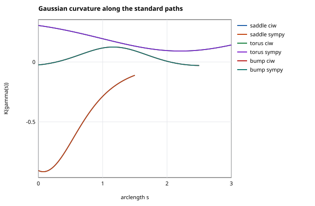
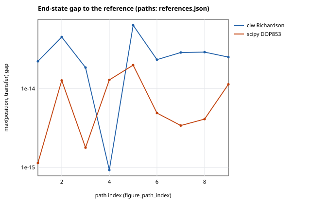
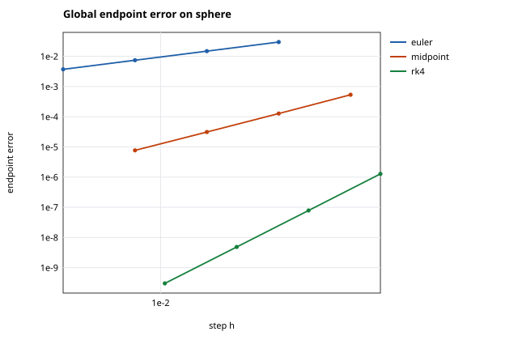
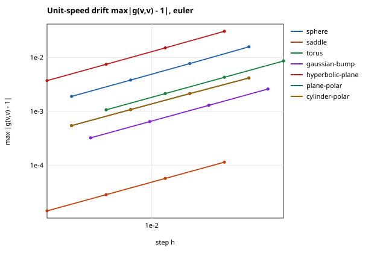
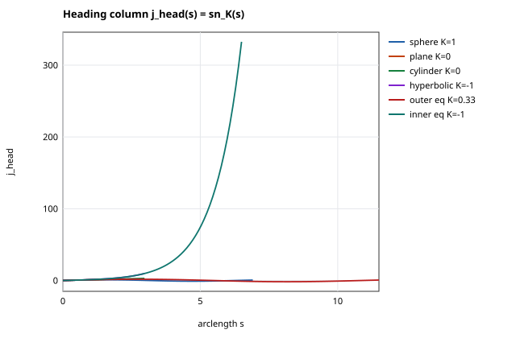
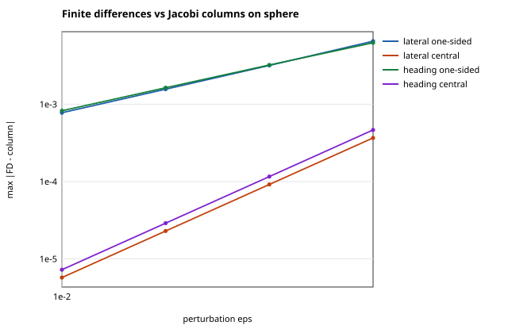
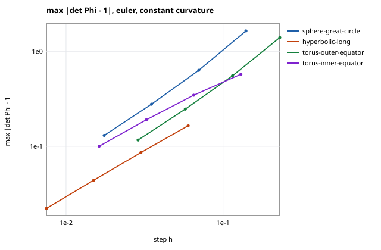
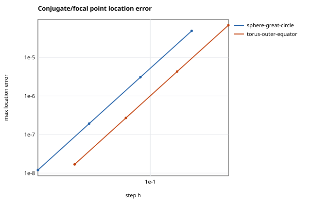
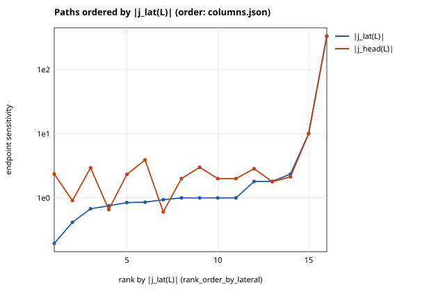
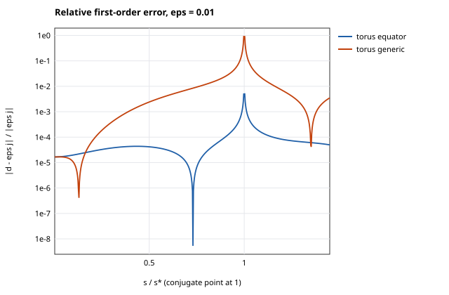
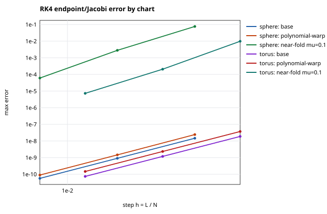
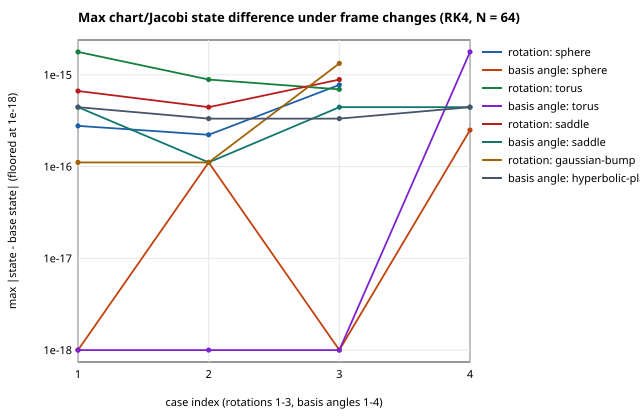
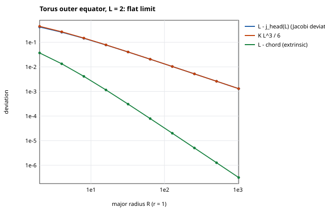
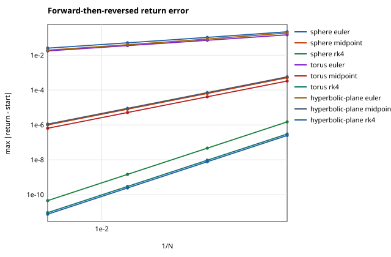
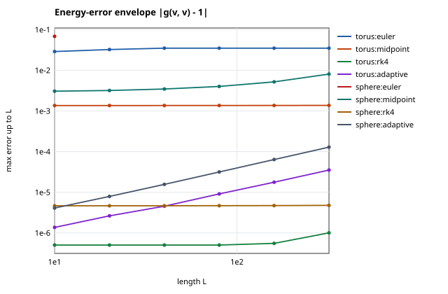
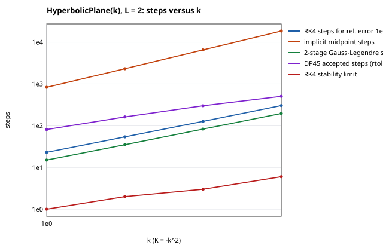
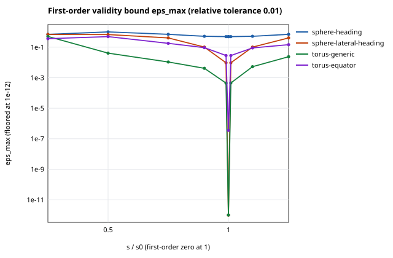
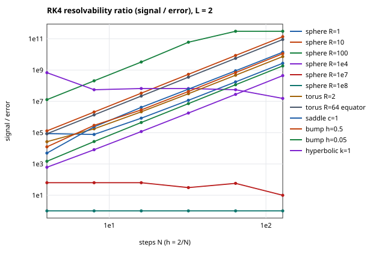
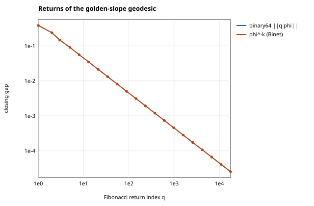
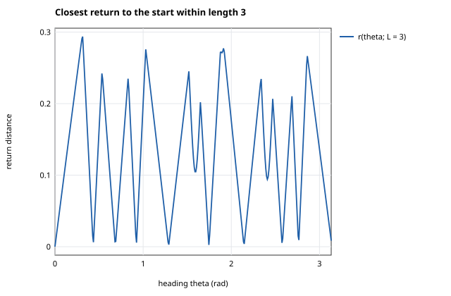
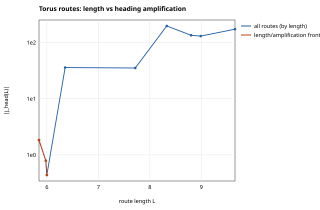
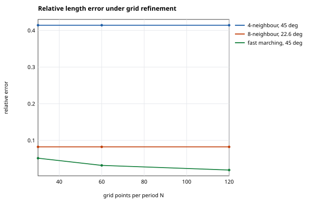
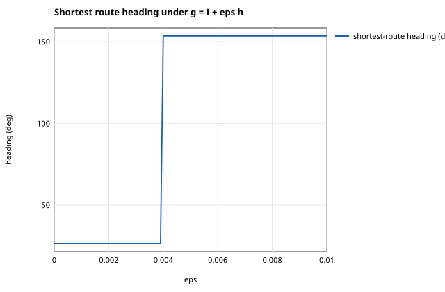
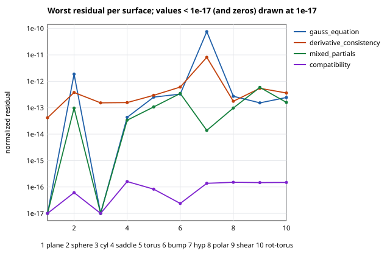
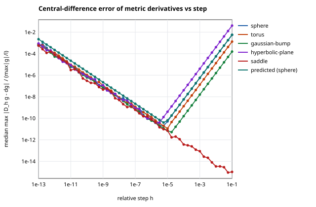
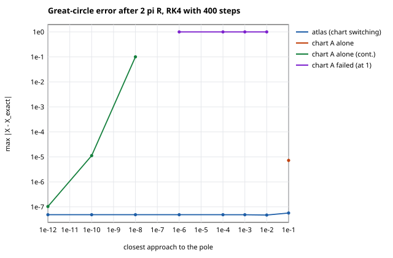
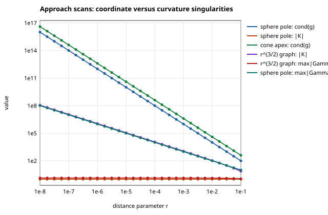
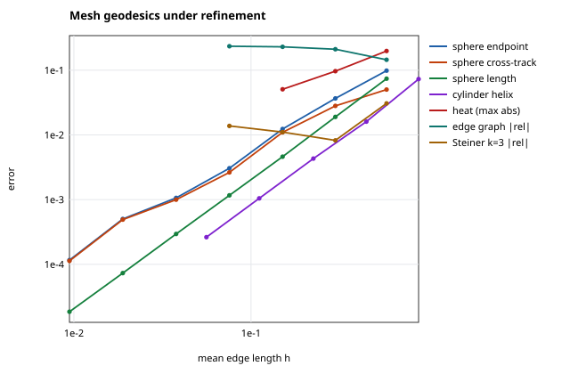
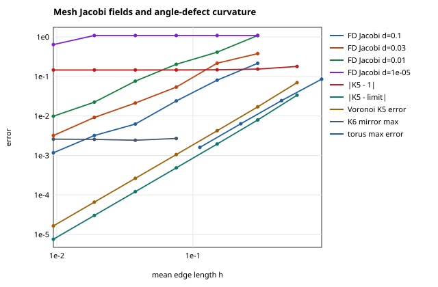
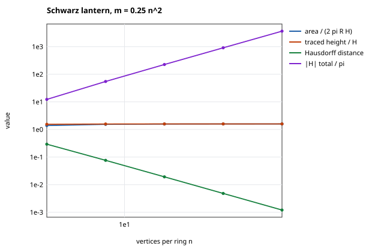
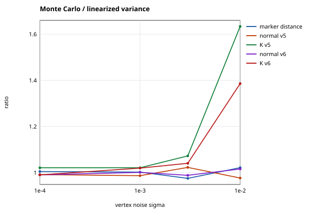
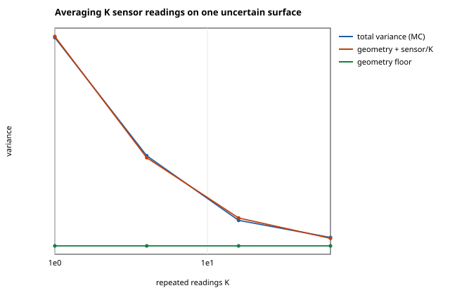

## Discussion

### Counterexamples

Each finding below refutes a general statement; the statement must not be restated without the qualification its witness shows.

- T001 refutes “A chart with nonzero Christoffel symbols describes a curved surface”: Nonzero Christoffel symbols do not imply curvature: the polar charts of the plane and cylinder are flat (`numerically_verified`; reference checks, synthetic inputs (seeded chart samples, seed 20260923)). Witness: `{"chart": "plane-polar", "christoffel": "Gamma^r_tt = -r, Gamma^t_rt = 1/r", "gaussian_curvature": 0.0}`.
- T001 refutes “A surface that bends in space has nonzero Christoffel symbols in every chart”: An extrinsically curved surface can have identically zero Christoffel symbols: the cylinder in (phi, z) (`numerically_verified`; reference checks, synthetic inputs (seeded chart samples, seed 20260923)). Witness: `{"chart": "cylinder (phi, z)", "normal_curvature_phi": -1.0}`.
- T003 refutes “An effective order near 5 is observed whatever solution a DP5(4) pair advances”: The adaptive-order checks reject a Dormand-Prince variant that advances with its fourth-order solution (`numerically_verified`; reference checks, synthetic inputs (declared standard geodesics)). Witness: `{"median_effective_order": 4.189750093080622, "median_tolerance_exponent": 0.7826906298237313, "variant": "advance with y4"}`.
- T003 refutes “Every integrator exhibits its nominal convergence order on every surface”: No convergence order is observable on flat Cartesian charts: every method is exact to rounding there (`numerically_verified`; reference checks, synthetic inputs (declared standard geodesics)). Witness: `{"reason": "Gamma vanishes, so Euler, midpoint and RK4 reproduce u(s) = …", "charts[0]": "plane", "charts[1]": "cylinder", "max_endpoint_error.cylinder": 2.0945586572537882e-14 …(+1)}`.
- T004 refutes “A computed geodesic whose speed stays exactly 1 is accurate”: Unit speed does not certify an accurate path: renormalized Euler keeps |g - 1| at rounding with a first-order endpoint error (`numerically_verified`; reference checks, synthetic inputs (renormalized Euler on the standard sphere path)). Witness: `{"endpoint_error": 0.013938653977328111, "method": "Euler with per-step speed renormalization", "steps": 128, "surface": "sphere"}`.
- T006 refutes “A smaller finite-difference step always gives a more accurate Jacobi estimate”: Shrinking the finite-difference step far below its optimum degrades the Jacobi estimate (cancellation) (`numerically_verified`; reference checks, synthetic inputs (perturbed geodesics)). Witness: `{"best_eps": 1e-07, "best_error": 1.2829856288476549e-08, "column": "heading", "eps": 1e-11 …(+2)}`.
- T007 refutes “The RK4 transfer-matrix determinant drifts at the method's global order h^4”: RK4 determinant drift is O(h^5), one order above its O(h^4) global error, on constant and variable curvature (`numerically_verified`; reference checks, synthetic inputs (declared geodesics)). Witness: `{"per_step_defect": "-h^6 K^3/72 + O(h^7) (constant K); O(h^6) for smooth K(s)", "orders.bump-radial": 4.989849579481997, "orders.gaussian-bump": 4.992984430686957, "orders.hyperbolic-long": 5.001956250322552 …(+6)}`.
- T007 refutes “Explicit Euler never preserves the transfer-matrix determinant”: Where K = 0 every method preserves det Phi = 1 exactly, Euler included (`numerically_verified`; reference checks, synthetic inputs (declared geodesics)). Witness: `{"max_drift": 0.0, "per_step_factor": "1 + h^2 K = 1", "charts[0]": "plane", "charts[1]": "cylinder"}`.
- T008 refutes “The first focal point lies at half the first conjugate distance”: On variable curvature the first focal point is not half the first conjugate distance (`numerically_verified`; reference checks, synthetic inputs (seeded torus geodesic)). Witness: `{"first_conjugate": 7.785018442790264, "first_focal": 3.465336236529439, "heading": 0.8753827096614808, "surface": "torus" …(+2)}`.
- T009 refutes “Ranking paths by sensitivity to heading error gives the same order as ranking by sensitivity to lateral offset”: Lateral and heading sensitivities rank paths differently (`numerically_verified`; reference checks, synthetic inputs (declared geodesics)). Witness: `{"length": 3.0, "heading.torus-inner-to-outer": 2.8459238929397412, "heading.torus-outer-to-inner": 3.907448965394896, "lateral.torus-inner-to-outer": 1.8031835771642162 …(+3)}`.
- T010 refutes “The separation at a conjugate point is of exact order eps^2”: On the torus outer equator the separation at the conjugate point scales as eps^3, not eps^2 (`numerically_verified`; derivation, reference checks, synthetic inputs (ciw.lab.geodesic_jacobi_limits:torus-equator-family)). Witness: `{"chord_exponent": 3.0003126899802814, "path": "outer equator, heading 0", "s_star": 5.441398092702653, "surface": "Torus(2, 1)" …(+4)}`.
- T010 refutes “The first-order separation eps j is accurate along the whole path once eps is small”: The relative first-order error diverges like 1/|s - s*| approaching the conjugate point (`numerically_verified`; derivation, reference checks, synthetic inputs (ciw.lab.geodesic_jacobi_limits:torus-divergence)). Witness: `{"eps": 0.04, "path": "start (0, 0.3), heading 0.5", "relative_error": 3.7958513020004787, "s": 6.036272087666448 …(+6)}`.
- T010 refutes “Neighbouring geodesics stay on the side of the base geodesic they start on (the signed separation keeps its sign along the path)”: After the conjugate point the separation inverts sign and still follows eps j (`numerically_verified`; reference checks, synthetic inputs (ciw.lab.geodesic_jacobi_limits:torus-inversion)). Witness: `{"eps": 0.01, "surface": "Torus(2, 1)", "paths.equator.s_after": 6.801747615878317, "paths.equator.s_before": 2.7206990463513265 …(+8)}`.
- T010 refutes “Once the first-order prediction has failed at a conjugate point it stays invalid beyond it”: Past the conjugate point the first-order prediction recovers: the relative error falls again like 1/|s - s*| (`numerically_verified`; derivation, reference checks, synthetic inputs (ciw.lab.geodesic_jacobi_limits:torus-recovery)). Witness: `{"eps": 0.04, "path": "start (0, 0.3), heading 0.5", "relative_error_after_h": 3.7751136377575443, "relative_error_late": 0.018182546475165935 …(+4)}`.
- T010 refutes “The separation of neighbouring geodesics grows monotonically with length”: Separation does not grow monotonically with length: it nearly vanishes at the conjugate point (`numerically_verified`; reference checks, synthetic inputs (ciw.lab.geodesic_jacobi_limits:torus-equator-family)). Witness: `{"chord_ratio": 0.00015710984529684768, "eps": 0.02, "path": "outer equator", "s_half": 2.7206990463513265 …(+2)}`.
- T010 refutes “The relative first-order error diverges at every conjugate point”: On the unit sphere a pure heading perturbation refocuses exactly: the relative first-order error of the embedded chord is uniform (2 sin(eps/2)/eps - 1, about -eps^2/24) and does not diverge at the conjugate point (`numerically_verified`; derivation, reference checks, synthetic inputs (ciw.lab.geodesic_jacobi_limits:sphere-great-circles)). Witness: `{"eps": 0.02, "perturbation": "pure heading", "relative_error": -1.6590023186879854e-05, "s": 3.129320807286708 …(+1)}`.
- T010 refutes “The image of a family of geodesics keeps its orientation beyond a conjugate point”: On the unit sphere the image inverts after the conjugate point (signed ratio -1) (`numerically_verified`; reference checks, synthetic inputs (ciw.lab.geodesic_jacobi_limits:sphere-great-circles)). Witness: `{"eps": 0.02, "perturbation": "pure heading", "s_after": 3.9269908169872414, "s_before": 2.356194490192345 …(+4)}`.
- T011 refutes “A change of chart that preserves the geometry leaves the fixed-step integration error unchanged”: A geometry-preserving near-fold chart multiplies the fixed-step error by a large factor (`numerically_verified`; reference checks, synthetic inputs (ciw.lab.geodesic_jacobi_limits:chart-study)). Witness: `{"chart": "u_axis = c + mu a + a^3/3, mu = 0.1 (det J >= 0.1)", "factor_sphere": 1069563.9789352638, "factor_torus": 98109.38296653116, "plane_error_base": 1.1102230246251565e-14 …(+5)}`.
- T012 refutes “Finite-eps signed separations are invariant under an orientation-reversing basis change expressed consistently”: On a non-symmetric surface the orientation-reversed separation agrees only to first order: own/right - 1 is proportional to eps (Torus(2, 1) generic path) (`numerically_verified`; derivation, reference checks, synthetic inputs (ciw.lab.geodesic_jacobi_limits:frame-study)). Witness: `{"path": "Torus(2, 1) from (0, 0.3), heading 0.5, L = 3", "eps[0]": 0.001, "eps[1]": 0.01, "eps[2]": 0.04 …(+3)}`.
- T013 refutes “Surfaces with identical Jacobi fields (intrinsic geometry) have identical chords between corresponding points”: Equal Jacobi fields do not imply equal chords: the helix chord is shorter than the plane chord (`numerically_verified`; reference checks, synthetic inputs (ciw.lab.geodesic_jacobi_limits:plane-cylinder)). Witness: `{"chord_cylinder": 2.5382081174896274, "chord_plane": 3.0000000000000018, "heading": 0.6, "length": 3.0 …(+4)}`.
- T013 refutes “Intrinsic (Jacobi) and extrinsic (chord) signatures of curvature vanish at the same rate in the flat limit”: The chord deficit vanishes faster (exponent -2 in R + 1) than the Jacobi deviation (-1) (`numerically_verified`; derivation, reference checks, synthetic inputs (ciw.lab.geodesic_jacobi_limits:torus-flat-limit)). Witness: `{"chord_exponent_in_R_plus_1": -1.9999677621250946, "jacobi_exponent_in_R_plus_1": -0.9974853377423354}`.
- T014 refutes “Forward-then-reversed integration with a method of order p returns to the start with error proportional to h^p”: Reversal error orders are 1 (Euler), 3 (midpoint) and 5 (RK4): even-order methods gain one order (`numerically_verified`; derivation, reference checks, synthetic inputs (ciw.lab.geodesic_jacobi_limits:reversal)). Witness: `{"mean_orders.euler": 1.049562088626885, "mean_orders.midpoint": 3.0007881457739116, "mean_orders.rk4": 4.998833708326354, "surfaces[0]": "sphere" …(+2)}`.
- T014 refutes “Truncate-and-continue reproduces fixed-step integration bit for bit for any truncation length”: With decimal truncation lengths the step sizes differ in the last bit and bitwise reproduction fails (`numerically_verified`; reference checks, synthetic inputs (ciw.lab.geodesic_jacobi_limits:truncation-search)). Witness: `{"L1": 1.13, "L2": 3.0, "N1": 113, "N2": 300 …(+6)}`.
- T015 refutes “The fixed-step RK4 position error on the sphere is the phase error of its speed error (a constant speed error gives position error ~ L)”: Fixed-step RK4 sphere position error is cross-track: the precessing orbit plane, not the speed error, sets it (`numerically_verified`; derivation, reference checks, synthetic inputs (ciw.lab.geodesic_jacobi_limits:drift)). Witness: `{"L": 320.0, "along_over_integrated_speed_error": -0.16027306137215694, "along_track_at_320": -2.5966475792261697e-05, "cross_track_at_320": 0.0005408552664065206 …(+6)}`.
- T015 refutes “The energy error of a non-symplectic fixed-step integrator grows linearly with length at every horizon”: Fixed-step RK4 energy error has a flat (oscillation-dominated) envelope up to L = 160 on the torus and L = 320 on the sphere; on the torus a secular term emerges between L = 160 and 320 (`numerically_verified`; reference checks, synthetic inputs (ciw.lab.geodesic_jacobi_limits:drift)). Witness: `{"exponent": 0.027506236135538223, "h": 0.125, "method": "rk4", "surface": "Torus(2, 1)" …(+10)}`.
- T015 refutes “A bounded energy (speed) error implies a qualitatively correct long-horizon geodesic”: Euler on the torus keeps a bounded energy error but changes the orbit type (Clairaut drift) (`numerically_verified`; reference checks, synthetic inputs (ciw.lab.geodesic_jacobi_limits:drift)). Witness: `{"h": 0.125, "max_energy_error": 0.03499256018697694, "method": "euler", "surface": "Torus(2, 1)" …(+2)}`.
- T016 refutes “An implicit (A-stable) integrator removes the growth of the step count with k on strongly negatively curved surfaces”: A-stable implicit methods do not remove the growth of the required steps with k (implicit midpoint ~ k^(3/2), 2-stage Gauss-Legendre ~ k^(5/4)); implicit midpoint is qualitatively wrong beyond kh = 2 (`numerically_verified`; derivation, reference checks, synthetic inputs (ciw.lab.geodesic_jacobi_limits:implicit-methods)). Witness: `{"beyond_pole_kh": 2.2857142857142856, "gauss_legendre_2_steps[0]": 15, "gauss_legendre_2_steps[1]": 35, "gauss_legendre_2_steps[2]": 83 …(+29)}`.
- T016 refutes “Jacobi growth is exponential in sqrt(peak |K|) times the length”: Saddle(c): peak |K| = c^2 but Jacobi growth is polynomial in c; the local exponent of j_head(L) decreases toward sqrt(2) (`numerically_verified`; derivation, reference checks, synthetic inputs (ciw.lab.geodesic_jacobi_limits:saddle-ridge)). Witness: `{"c": 16384.0, "log_j_head": 14.554722514358353, "peak_abs_curvature": 268435456.0, "sqrt_peak_times_L": 32768.0}`.
- T017 refutes “The validity domain of the first-order approximation shrinks to zero at every conjugate point”: Unit sphere, pure heading: C2 = 0, C3 = -|sin s| cos^2 s / 24, and the domain does not shrink at s = pi (`numerically_verified`; derivation, reference checks, synthetic inputs (ciw.lab.geodesic_jacobi_limits:validity-sphere)). Witness: `{"perturbation": "pure heading", "surface": "unit sphere", "tau": 0.01, "eps_max_near_pi.0.999": 0.4899060501928133 …(+1)}`.
- T018 refutes “Weaker intrinsic curvature is harder to resolve at a fixed step size”: Weak curvature is harder to resolve for Euler and midpoint only down to K ~ 1e-2: for K <= 1e-2 their ratios no longer depend on K, and the RK4 ratio grows like 1/K (`numerically_verified`; derivation, reference checks, synthetic inputs (ciw.lab.geodesic_jacobi_limits:resolvability)). Witness: `{"truncation_dominated_ratios_at_N16.euler.sphere R=1": 8.733790907567972, "truncation_dominated_ratios_at_N16.euler.sphere R=10": 5.585141207296921, "truncation_dominated_ratios_at_N16.euler.sphere R=100": 5.565415886526588, "truncation_dominated_ratios_at_N16.euler.sphere R=1e4": 5.565217996909997 …(+7)}`.
- T018 refutes “Refining the step size always makes a nonzero curvature effect resolvable”: Below the floating-point resolution of L no step size resolves the curvature signal, although the methods' truncation errors alone would resolve it (`numerically_verified`; derivation, reference checks, synthetic inputs (ciw.lab.geodesic_jacobi_limits:resolvability)). Witness: `{"computed_deviation": 0.0, "signal": 1.3333333333333334e-16, "surface": "Sphere(1e8), K = 1e-16", "steps[0]": 4 …(+5)}`.
- T019 refutes “Any integer change of basis generates the same lattice”: Integer matrices with det != 1 are refused as SL(2,Z) basis changes (`numerically_verified`; derivation, reference checks). Witness: `{"canonical[0]": "5", "canonical[1]": "2", "canonical[2]": "7", "gram[0]": 5 …(+9)}`.
- T020 refutes “A floating-point geodesic direction can be irrational (non-closing)”: A binary64 heading slope is rational, so a float simulation cannot represent a non-closing direction (`analytic`; derivation). Witness: `{"closes_after_alpha_turns": 562949953421312, "exact_fraction": "910872158600853/2^49", "float_phi": 1.618033988749895}`.
- T022 refutes “Converting a target to binary64 preserves its shortest-representative multiplicity”: Rounding the target to binary64 changes its shortest-representative multiplicity (exact 1, binary64 2) (`numerically_verified`; reference checks). Witness: `{"binary64_multiplicity": 2, "exact_multiplicity": 1, "target": "(1/2 + 2^-60, 1/4)", "binary64_target[0]": 0.5 …(+1)}`.
- T022 refutes “Floating-point distance comparison finds every shortest representative”: At exact cut-locus ties that binary64 cannot represent, raw float comparison undercounts some multiplicities while a relative tolerance of 1e-9 recovers all of them (`numerically_verified`; reference checks). Witness: `{"binary64": 2, "exact": 3, "lattice": "generic", "tolerance": 3 …(+2)}`.
- T024 refutes “The shortest route also minimizes amplification and maximizes focus margin s_c - L”: Rankings by length, amplification |j_head(L)| and focus margin s_c - L (s_c the first zero of j_head) disagree: the shortest route is neither the least amplifying nor in the best focus-margin group (`numerically_verified`; reference checks). Witness: `{"best_margin_group[0].amplification": 35.84781929262236, "best_margin_group[0].focus_margin": null, "best_margin_group[0].heading": 1.328869465787598, "best_margin_group[0].length": 6.354490781532511 …(+50)}`.
- T026 refutes “Winding labels transform with the same matrix as the basis”: Transporting winding labels with M instead of M^-1 breaks length invariance (`numerically_verified`; reference checks). Witness: `{"correct_rule": "c' = M^-1 c", "lattice": "generic", "mismatches": 6428, "q_g_of_winding": "5" …(+18)}`.
- T026 refutes “Equal length spectra imply SL(2,Z)-equivalent oriented lattices”: The length spectrum does not determine the oriented shape: a mirror image is isospectral but not SL(2,Z)-equivalent (`numerically_verified`; reference checks). Witness: `{"same_canonical": false, "same_spectrum": true, "canonical[0]": "5", "canonical[1]": "-2" …(+4)}`.
- T029 refutes “Every polygon vertex of a glued surface is a cone singularity”: Polygon vertices need not be cone singularities: the glued hexagon's vertices are regular points (`numerically_verified`; reference checks). Witness: `{"surface": "regular hexagon, opposite sides glued", "vertex_classes": 2, "cone_angles_over_pi[0]": "2", "cone_angles_over_pi[1]": "2"}`.
- T030 refutes “Grid shortest-path lengths converge to geodesic length as the grid is refined”: 4- and 8-neighbour grid shortest paths do not converge to Euclidean length under refinement (`independently_verified`; independent check, reference checks). Witness: `{"direction": "45 deg", "ratio": 1.414213562373095, "stencil": "4-neighbour", "grids[0]": 30 …(+2)}`.
- T031 refutes “A small metric perturbation changes the shortest route only slightly”: A metric perturbation just above eps* = 1/250 (0.4%) turns the shortest-route heading by about 127 deg while the minimal length changes continuously (`numerically_verified`; derivation, reference checks). Witness: `{"delta": "1/1000", "eps_after": 0.0041, "eps_before": 0.0039, "eps_star": "1/250" …(+8)}`.
- T032 refutes “The shortest geodesic between two points has the least heading amplification”: Torus inner equator: the shortest route has larger heading amplification than a longer route (`independently_verified`; independent check, reference checks). Witness: `{"alternative.amplification": 2.2424499641265205, "alternative.focus_margin": null, "alternative.heading": -0.6654954777289914, "alternative.length": 7.4048964512362 …(+16)}`.
- T032 refutes “The shortest geodesic has the largest focus margin s_c - L (farthest from its first conjugate point)”: Torus outer equator: the shortest route has a smaller focus margin s_c - L (s_c the first zero of j_head) than a longer route (`independently_verified`; independent check, reference checks). Witness: `{"alternative.amplification": 29.49806945310811, "alternative.focus_margin": null, "alternative.heading": -1.3844466400297355, "alternative.length": 6.723214266466979 …(+16)}`.
- T032 refutes “The shortest route between two points is unique”: Torus (0, 0) -> (2.2, 0): two mirror-image shortest routes tie, so 'the' shortest route is not unique (`numerically_verified`; reference checks). Witness: `{"first.amplification": 3.893697160114145, "first.focus_margin": 2.0712536359131057, "first.heading": -0.932959589373497, "first.length": 6.30866770803647 …(+16)}`.
- T032 refutes “Low heading amplification certifies a robust (locally minimizing) route”: Gaussian bump: a longer route over the top has smaller amplification but passes a conjugate point (`independently_verified`; independent check, reference checks). Witness: `{"alternative.amplification": 6.488420201199406, "alternative.focus_margin": -1.9973831828910869, "alternative.heading": 0.0, "alternative.length": 5.8779306681414605 …(+15)}`.
- T032 refutes “Minimizing geodesics on the unit sphere have focus margin s_c - L bounded below by a positive constant”: On the unit sphere the minimizing arc between points at separation pi - delta ends delta before its conjugate point, so minimizing geodesics have no positive lower bound on the focus margin s_c - L (`numerically_verified`; derivation, reference checks). Witness: `{"kind": "near-conjugate conditioning", "surface": "unit sphere", "delta[0]": 0.1, "delta[1]": 0.01 …(+7)}`.
- T033 refutes “Metric symmetry, positive definiteness, Christoffel symmetry, metric compatibility and derivative consistency together certify a surface implementation”: A curvature-misscaled sphere passes every identity except the Gauss equation (`numerically_verified`; reference checks). Witness: `{"gauss_residual": 0.167, "mutant": "misscaled-curvature (sphere R = 2 returning K = 1/R)", "failed[0]": "gauss_equation"}`.
- T033 refutes “A metric-compatible connection certifies the metric derivatives”: Metric compatibility cannot detect wrong metric derivatives (`numerically_verified`; derivation, reference checks). Witness: `{"mutant": "saddle with dg negated", "failed[0]": "derivative_consistency", "failed[1]": "gauss_equation"}`.
- T034 refutes “Finite, index-symmetric hand-coded metric derivatives are correct”: Dual-number checks expose a hand-coded derivative defect that symmetry checks cannot see (`numerically_verified`; reference checks). Witness: `{"mutant": "gaussian-bump with f_xy dropped", "normalized_error": 0.0608}`.
- T035 refutes “Decreasing the finite-difference step always improves agreement with the analytic derivative”: Smaller finite-difference steps can be far less accurate (`numerically_verified`; reference checks). Witness: `{"log10_error_at_1e-12": -3.993, "log10_error_at_h_opt": -10.7, "log10_h_opt": -5.25, "surface": "sphere"}`.
- T035 refutes “Every smooth metric shows an O(h^2) truncation branch in central-difference error”: Quadratic metrics have no truncation branch and a constant metric differences to exactly zero (`numerically_verified`; reference checks). Witness: `{"error_at_1e-2": 3.4e-15, "surface": "saddle, E = 1 + c^2 x^2 (degree-2 metric)"}`.
- T036 refutes “Fixed-step RK4 in a single polar chart integrates every great circle as accurately as a chart-switching atlas at the same step count”: A single polar chart fails or loses accuracy on great circles passing near its pole (`numerically_verified`; reference checks). Witness: `{"log10_delta_0.1_atlas_error": -7.246, "log10_delta_0.1_single_error": -5.141, "log10_delta_failed[0]": -2, "log10_delta_failed[1]": -3 …(+2)}`.
- T036 refutes “Fixed-step integration in a single polar chart across its pole always fails”: From a declared angular-momentum seed of 1e-12, chart A alone crosses both poles of the meridian at 400 RK4 steps to within 1e-6 (`numerically_verified`; reference checks). Witness: `{"error": 1.03344e-07, "seed": 1e-12, "steps": 400}`.
- T036 refutes “A single-chart integration that crosses a pole accurately at one step count stays accurate at nearby step counts”: Across declared seeds from 1e-15 to 1e-10, chart A alone fails on the meridian whenever an RK4 stage point lands within 0.9 d* of a pole and never beyond 1.5 d*, d* = (L0 h^4)^(1/5), but no single multiple of d* separates the outcomes at every seed (350 to 450 RK4 steps at 1e-12, the step counts within 2 d* at the other half-decade seeds) (`numerically_verified`; reference checks). Witness: `{"error_at_400": 1.03344e-07, "failed_steps[0]": 355, "failed_steps[1]": 377, "failed_steps[2]": 399 …(+2)}`.
- T037 refutes “The scan detects every coordinate singularity, that is every det g -> 0 or cond g -> infinity at finite distance with bounded K”: The scan misses the removable coordinate singularity of the plane in the cube-root chart (`numerically_verified`; reference checks). Witness: `{"approach": "plane-cube-root-chart", "observed": "unclassified", "true": "coordinate_singularity"}`.
- T037 refutes “A nondegenerate metric chart implies bounded Gaussian curvature”: The graph z = r^(3/2) has a curvature singularity although its Monge metric is regular (`numerically_verified`; reference checks). Witness: `{"K_at_1e-8": 112500000.0, "det_g_at_1e-8": 1.0, "surface": "z = r^(3/2)"}`.
- T037 refutes “Christoffel-symbol blow-up indicates a curvature singularity”: Christoffel blow-up and curvature blow-up are independent near singular points (`numerically_verified`; reference checks). Witness: `{"sphere_pole_K": 1.0, "sphere_pole_max_gamma_at_1e-8": 100000000.0}`.
- T037 refutes “Pointwise metric and curvature invariants distinguish a removable coordinate singularity from a conical point”: A cone apex and the polar-chart origin share every pointwise exponent; only the circumference ratio separates them (`numerically_verified`; reference checks). Witness: `{"angle_deficit": 3.14, "conical": "cone alpha = pi/6 apex", "removable": "plane in polar chart at r = 0"}`.
- T037 refutes “The approach scan classifies every singular point correctly”: Cases just beyond each classification threshold are misclassified (`numerically_verified`; reference checks). Witness: `{"cone-small-deficit-apex.observed": "coordinate_singularity", "cone-small-deficit-apex.true": "conical_singularity", "conformal-0.9995-boundary.observed": "infinite_distance_boundary", "conformal-0.9995-boundary.true": "curvature_singularity" …(+2)}`.
- T037 refutes “The scan classifies a degenerate point independently of the approach loops chosen by the caller”: Cartesian loops around the sphere pole in the polar chart make a coordinate singularity read as a conical point (`numerically_verified`; reference checks). Witness: `{"cartesian_loops": "conical_singularity", "point": "sphere north pole, chart A", "polar_loops": "coordinate_singularity"}`.
- T038 refutes “A straightest geodesic shorter than pi on a mesh inscribed in the unit sphere is a shortest path between its endpoints”: Traced straightest geodesics are never shorter than the exact distance between their endpoints, yet on every icosphere level 1-4 some of length 2 (below pi) are not shortest paths, by an excess that falls with refinement (`numerically_verified`; reference checks, synthetic inputs (ciw.lab.surfaces_discrete_mesh_studies.traced_exact_study)). Witness: `{"exact": 1.9999625298889687, "excess": 3.747011103172326e-05, "level": 4, "start": 1 …(+1)}`.
- T039 refutes “Edge-graph shortest paths converge to the geodesic distance under mesh refinement”: Edge-graph Dijkstra distance from a valence-5 vertex keeps a relative-error floor that tends to sqrt(5) - 2 (`numerically_verified`; derivation, reference checks). Witness: `{"mesh": "icosphere levels 1-4, source vertex 0 (valence 5)", "max_signed_relative_error[0]": 0.1448504685578944, "max_signed_relative_error[1]": 0.21078482135841448, "max_signed_relative_error[2]": 0.22958417381401675 …(+1)}`.
- T039 refutes “Refining the mesh alone makes a Steiner-graph distance with fixed k converge to the geodesic distance”: Steiner graphs with a fixed number of points per edge keep a relative-error floor (`numerically_verified`; reference checks, synthetic inputs (ciw.lab.surfaces_discrete_mesh_geometry.steiner_graph)). Witness: `{"k": 3, "max_abs_relative_error[0]": 0.030675797123964732, "max_abs_relative_error[1]": 0.008227705748911074, "max_abs_relative_error[2]": 0.011039725230062247 …(+1)}`.
- T040 refutes “On a fixed mesh the finite-difference Jacobi field converges to the smooth Jacobi field as the perturbation tends to zero”: At fixed mesh a 1e-5 heading offset gives the flat Jacobi value L instead of sin(L) while no vertex lies between the paired geodesics (`numerically_verified`; derivation, reference checks). Witness: `{"delta": 1e-05, "j_fd": 2.0, "j_smooth": 0.9092974268256817, "levels[0]": 2 …(+4)}`.
- T040 refutes “The angle defect over one third of the incident area converges pointwise to the Gaussian curvature under refinement”: Angle-defect curvature at valence-5 icosphere vertices converges to (4.5 - 1.5 sqrt 5) K, not K (`numerically_verified`; derivation, reference checks). Witness: `{"finest_value": 1.1459056232841356, "limit": 1.1458980337503153, "mesh": "icosphere, 12 valence-5 vertices"}`.
- T040 refutes “Angle-defect curvature with the barycentric area converges pointwise at the valence-6 vertices of icosphere refinements”: Barycentric angle-defect curvature does not converge pointwise at valence-6 icosphere vertices on the icosahedral mirror planes (`numerically_verified`; reference checks, synthetic inputs (ciw.lab.surfaces_discrete_mesh_studies.icosahedral_mirror_classes)). Witness: `{"base_edge_max_error[0]": 0.0019319256495926584, "base_edge_max_error[1]": 0.002431873259649331, "base_edge_max_error[2]": 0.0025567564634368933, "base_edge_max_error[3]": 0.002587970803474504 …(+8)}`.
- T041 refutes “The dihedral fold check (folded_face) refuses every jittered icosphere that has an inverted face”: Over 60 further seeds per amplitude the dihedral fold check accepts some jittered meshes with an inverted face (`numerically_verified`; reference checks, synthetic inputs (ciw.lab.surfaces_discrete_mesh_studies.fold_rate_study)). Witness: `{"amplitude": 0.2, "face": 854, "normal_radial": -0.3410445645964844, "seed": 20261944 …(+6)}`.
- T041 refutes “Tangential jitter of 0.2 h or more inverts a face of the level-3 icosphere for every seed”: A tangential jitter of 0.2 h inverts a face for some but not all of 60 further seeds (`numerically_verified`; reference checks, synthetic inputs (ciw.lab.surfaces_discrete_mesh_studies.fold_rate_study)). Witness: `{"amplitude": 0.2, "meshes": 60, "without_inverted_face": 21}`.
- T041 refutes “A larger minimum angle implies a smaller geodesic error”: A mesh with a smaller minimum angle can have a smaller geodesic error (`numerically_verified`; reference checks, synthetic inputs (ciw.lab.surfaces_discrete_mesh_studies._jitter_unvalidated, seed 20260939)). Witness: `{"better_quality": "icosphere-3", "worse_quality": "icosphere-3-jitter0.05-s20260939"}`.
- T041 refutes “Minimum angle orders the barycentric angle-defect curvature error across mesh families”: Across mesh families a much smaller minimum angle can come with a smaller barycentric-area angle-defect RMS error (`numerically_verified`; reference checks, synthetic inputs (ciw.lab.surfaces_discrete_mesh_geometry.uv_sphere)). Witness: `{"better_quality": "icosphere-3", "note": "the icosphere's RMS is dominated by its 12 valence-5 …", "worse_quality": "uv-sphere-20x32"}`.
- T041 refutes “Within one mesh family better triangle quality (larger minimum angle, smaller radius ratio) implies smaller curvature error”: Within the latitude-longitude family a mesh with smaller minimum angle and larger radius ratio can have smaller curvature errors under both area choices (`numerically_verified`; reference checks, synthetic inputs (ciw.lab.surfaces_discrete_mesh_geometry.uv_sphere)). Witness: `{"better_quality": "uv-sphere-40x16", "worse_quality": "uv-sphere-10x64"}`.
- T041 refutes “Hausdorff convergence of a mesh to a surface implies convergence of area”: Schwarz lantern meshes converge in Hausdorff distance but not in area (`numerically_verified`; derivation, reference checks). Witness: `{"area_ratio": 1.5872559353818663, "bands": 1024, "hausdorff": 0.001204543794827706, "n": 64 …(+1)}`.
- T041 refutes “Hausdorff convergence of a mesh implies convergence of its geodesic distances”: Schwarz lantern intrinsic height does not converge to the cylinder height (`numerically_verified`; derivation, reference checks). Witness: `{"H": 1.0, "n": 64, "traced_height": 1.5878935490351203}`.
- T041 refutes “Hausdorff convergence of a mesh implies convergence of its normals and curvature”: Lantern angle defects vanish while total absolute mean curvature grows like n^2 and normal tilt converges to atan(pi^2 q R / 2H) instead of 0 (`numerically_verified`; derivation, reference checks). Witness: `{"n": 64, "tilt_deg": 50.96720303293561, "total_abs_mean_curvature": 11440.883001930979}`.
- T041 refutes “The dihedral fold check refuses a mesh only when a face is inverted”: A strongly pleated lantern (m = n^2) is refused as folded although no face normal points towards the axis (`numerically_verified`; reference checks, synthetic inputs (ciw.lab.surfaces_discrete_mesh_geometry.cylinder_mesh)). Witness: `{"min_normal_radial": 0.20107436521303879, "n": 8, "q": 1.0}`.
- T042 refutes “Curvature and normal formulas can be evaluated safely on unvalidated meshes”: Curvature and normals evaluated on an unvalidated zero-area face are nonfinite (`numerically_verified`; reference checks, synthetic inputs (ciw.lab.surfaces_discrete_mesh_geometry.TriMesh)). Witness: `{"defect": "zero-area face", "mesh": "square plus a collinear face"}`.
- T042 refutes “Structural validation, including the dihedral fold check, refuses every mesh with an inverted face”: Without a declared centre the validator accepts a jittered icosphere with an inverted face (`numerically_verified`; reference checks, synthetic inputs (ciw.lab.surfaces_discrete_mesh_studies._jitter_unvalidated, seed 20261940)). Witness: `{"amplitude": 0.2, "seed": 20261940}`.
- T043 refutes “A fixed face corridor (fixed mesh combinatorics) represents the perturbed marker geodesic at every tested vertex-noise level”: The declared marker segment stays in its face corridor for sigma <= 1e-3 but leaves it in over 10% of samples at sigma = 1e-2 (`numerically_verified`; reference checks, synthetic inputs (ciw.lab.surfaces_discrete_mesh_geometry.icosphere, seed 20260938)). Witness: `{"left_fraction": 0.39525, "sigma": 0.01}`.
- T043 refutes “The fixed-corridor marker distance is valid for sigma <= 1e-3 on icosphere-3 whichever declared geodesic carries the markers”: The noise level at which a fixed face corridor fails depends on the strip, and the declared strip, which has the largest vertex margin of the six, stays in its corridor for sigma <= 1e-3 (`numerically_verified`; reference checks, synthetic inputs (ciw.lab.surfaces_discrete_mesh_studies.corridor_study, seed 20260968)). Witness: `{"left_fraction": 0.3715, "sigma": 0.001, "start_index": 0, "vertex_margin": 0.002659028956720544}`.
- T043 refutes “The strip with the largest vertex margin leaves its fixed face corridor least often at every tested noise level”: A strip with a smaller vertex margin than the declared strip leaves its face corridor less often at every tested sigma >= 3e-3 (`numerically_verified`; reference checks, synthetic inputs (ciw.lab.surfaces_discrete_mesh_studies.corridor_study, seed 20260968)). Witness: `{"declared_start_index": 5, "more_robust_start_index": 1, "declared_left_fraction[0]": 0.02825, "declared_left_fraction[1]": 0.41075 …(+4)}`.
- T043 refutes “First-order (linearized) propagation of vertex noise is adequate for angle-defect curvature at sigma = 1e-2 on icosphere-3”: First-order propagation underestimates angle-defect curvature variance at sigma = 1e-2 (`numerically_verified`; derivation, reference checks). Witness: `{"h": 0.1507297051948821, "min_ratio": 1.3859890674673723, "sigma": 0.01}`.
- T043 refutes “Refining the mesh reduces the error of angle-defect curvature”: Under fixed vertex noise the curvature error grows as the mesh is refined (`numerically_verified`; reference checks, synthetic inputs (ciw.lab.surfaces_discrete_mesh_studies.refinement_noise_study, seed 20260988)). Witness: `{"sigma": 0.001, "coarse.discretization_error": 0.008929308868696362, "coarse.h": 0.2993320753185587, "coarse.level": 2 …(+7)}`.
- T044 refutes “Whether geometry or sensor noise dominates the marker-distance residual is fixed by sigma_g and sigma_s alone”: Under normal-only (shape) vertex noise of the same sigma the sensor dominates the baseline residual (`numerically_verified`; reference checks, synthetic inputs (ciw.lab.surfaces_discrete_mesh_studies.variance_split_study, seed 20261038)). Witness: `{"isotropic_geometry_share": 0.8155896045575417, "normal_only_geometry_share": 0.27987315173062316, "sigma_geometry": 0.001, "sigma_sensor": 0.0005}`.
- T044 refutes “Averaging repeated measurements drives the observation error to zero”: Averaging repeated sensor readings leaves the geometry variance as a floor (`numerically_verified`; reference checks, synthetic inputs (ciw.lab.surfaces_discrete_mesh_studies.variance_split_study, seed 20261038)). Witness: `{"geometry_floor": 1.1056719478865147e-06, "repeats": 64, "variance": 1.1753748253402434e-06}`.

Their interpretation against the literature is outstanding.

## Limitations

What a computational experiment may establish, and what it cannot establish alone:

| A computational experiment may establish | It cannot establish alone |
| --- | --- |
| Analytic agreement | Physical truth |
| Numerical convergence | Calibration validity |
| Synthetic sensor performance | Real sensor performance |
| Replay determinism | Independent verification by another party |
| Schema/provenance integrity | Machine safety |
| GPU/CPU agreement | Industrial readiness |
| A plausible use case | Actual customer demand |
| A simulated control response | Safe actuator authority |

### Claims not established

- T005 [physical]: Nearby real trajectories on a physical curved surface separate according to this Jacobi law — not established.
- T009 [physical]: The ranking of lateral versus heading start errors computed here predicts which error dominates the endpoint error of real tool or vehicle paths on physical curved parts — not established.
- T013 [physical]: A physical cylinder or large-radius torus workpiece shows these separations — not established.
- T017 [machine_safety]: These validity domains certify first-order path corrections as safe on real machines — not established.
- T018 [sensor_performance]: Curvature signals resolvable here would be resolvable in measured sensor data — not established.
- T021 [machine_safety]: The shortest route on a physical flat workpiece is the safest route to execute — not established.
- T023 [sensor_performance]: A physical heading sensor closes the shortest loop within the computed heading tolerance — not established.
- T024 [machine_safety]: Ranking routes by focus margin s_c - L selects a route that is safe to execute on a physical part — not established.
- T025 [machine_safety]: A Pareto-optimal route is safe to execute on a physical part — not established.
- T030 [physical]: Grid-planned path lengths predict distances travelled by a physical vehicle or tool — not established.
- T031 [calibration]: A metric calibrated from physical measurements is accurate enough to decide between near-tied routes — not established.
- T032 [machine_safety]: A route from this library is safe (or unsafe) to execute on a physical part or vehicle — not established.
- T033 [physical]: The conformance suite certifies surfaces reconstructed from physical measurements — not established.
- T034 [physical]: Symbolic and dual-number derivative agreement certifies derivatives of surfaces reconstructed from physical measurements — not established.
- T035 [physical]: The optimal-step law derived here applies to derivatives of measured surface samples — not established.
- T036 [industrial_readiness]: Chart-switching geodesic integration is ready for tool paths over physical parts — not established.
- T037 [physical]: The singularity classification applies to scanned physical parts — not established.
- T038 [physical]: Straightest geodesics on a mesh reconstructed from a real scan reproduce the geodesics of the scanned physical surface — not established.
- T039 [physical]: The observed convergence orders transfer to meshes reconstructed from real scans — not established.
- T040 [physical]: Angle-defect curvature of a scanned mesh estimates the Gaussian curvature of the physical part — not established.
- T041 [production_acceptance]: A minimum-angle or radius-ratio threshold certifies a scanned mesh for production metrology — not established.
- T042 [physical]: The refusal catalogue covers every defect present in real scanned surface data — not established.
- T043 [calibration]: Isotropic Gaussian vertex noise of the tested sigma describes the error of a real scanner — not established.
- T044 [sensor_performance]: A real marker-distance sensor on a real scanned part has this geometry and sensor variance split — not established.
- T044 [physical]: The geometry sigma of 1e-3 is the accuracy of a real scanned surface — not established.

### Unfinished tasks

What each blocked, deferred or partial task is missing, in its own words (its unresolved assumptions):

- None.

## Outstanding work

- Missing from this draft, which the lab cannot write: the thesis in the authors' words (the generated thesis restates counts and counterexamples of the retained findings only), a related-work discussion (the reference list is the T156 textbook ledger's name matches), an interpretation of the counterexamples against the literature, conclusions, figure selection and captions, and external peer review. The draft stays partial until they exist.
- T005 (1 physical claim not established; its own next step): Deferred research question (hardware-gated): measure the separation law on real neighbouring trajectories (for example two tracked markers on great circles of a sphere and on a saddle, with a calibrated position sensor) and compare the measured separation with eps j(s) within the sensor's calibrated uncertainty. Route: T005 would read the tracker export as an operator capture (ctx.capture('trajectory-log'), bound with ciw lab run T005 --capture trajectory-log=PATH) and fit the separation from it as a computational finding; the physical finding needs, besides an acquisition record (device, raw_sha256 of the captured bytes, acquired_at, calibration), a probe of the tracker on the analysing host that succeeds in T005 (runner.CAPTURE_INSTRUMENTS has no entry for trajectory-log) or a signed-capture trust anchor, and the run is retained with ciw lab hardware retain under lab/hardware/<run-id>. Neither the capture reader nor a tracker probe exists, so the physical-domain finding stays not_established even when such data exist
- T009 (1 physical claim not established; its own next step): Deferred research question: rank lateral against heading sensitivity over equal-length paths (only the witness pair has equal lengths now) and predict the witness pair's heading difference quantitatively from its two curvature profiles through the first-order kernels, which now explain it only qualitatively
- T013 (1 physical claim not established; its own next step): Deferred research question: fit the flat-limit scaling of L - j_head(L) and of the chord deficit on a cone and a tangent developable (neither is in the core catalogue; each needs a Surface) and on inclined torus geodesics, which average K along the path (only the cylinder and the constant-K outer equator are fitted here)
- T018 (1 physical claim not established; its own next step): Deferred research question: resolvability-aware step selection: choose each method's step from the measured curvature-signal-to-integrator-error ratio and check that the lateral column and the conjugate-point locations (only j_head(L) is compared here) are then resolved on the weak-curvature paths (sensor-level resolvability needs a measured noise floor and is hardware-gated)
- T023 (1 physical claim not established; its own next step): Deferred research question: rank the closing headings under a second definition of heading sensitivity (for example the measure of headings within +-delta whose closest return within L stays below a threshold) and report where that ranking differs from the closest-return definition used here
- T030 (1 physical claim not established; its own next step): Deferred research question: fit the fast-marching convergence order over at least five refinement levels with a confidence interval (three grids and an empirical order now) and compare with a second, independently written eikonal solver
- T031 (1 physical claim not established; its own next step): Deferred research question: repeat the route-switch study with a spatially varying metric perturbation (for example eps cos(2 pi x) added to g11 on the square torus), where routes bend continuously and the switch threshold need not be eps* = 4 delta
- T033 (1 physical claim not established; its own next step): Deferred research question (queue extension after T168): make this conformance suite the admission gate for smooth surface data, run on every Surface before a lab task integrates on it and refusing a nonconforming one with a named code per failed identity (the seeded defects are refused only inside T033 today, the refusal states that T042 defines (MESH_CODES, TRACE_CODES and QUERY_CODES in surfaces_discrete_mesh_geometry.py) are for triangle meshes and do not use this suite).
- T034 (1 physical claim not established; its own next step): Deferred research question: an independent assembly of the connection and curvature for gaussian-bump, gaussian-bump-shear and rotated-torus (for example sympy.diffgeom as for the other seven surfaces, or a second computer algebra system), where ciw-written assembly of sympy derivatives gives only same-origin evidence, and complex-step derivatives once the core surfaces accept complex coordinates.
- T035 (1 physical claim not established; its own next step): Deferred research question (queue extension after T168): with metric samples carrying noise of standard deviation sigma, does the optimal central-difference step move to about (sigma / |d^3 g|)^(1/3) and the smallest derivative error grow like sigma^(2/3)? (T043 propagates vertex noise to mesh lengths, normals and curvature but tests no difference-based metric derivative, so this law is not tested anywhere in the queue.)
- T037 (1 physical claim not established; its own next step): Deferred research question (queue extension after T168): adopt these refusal codes (nonfinite_point, nonfinite_metric, degenerate_metric, curvature_blowup, outside_chart, curvature_singularity, conical_singularity) as the admission refusal states for smooth surface data, and add a removability test (metric regularity in radial arclength coordinates) so the cube-root chart's removable singularity is classified (the refusal states that T042 defines (MESH_CODES, TRACE_CODES and QUERY_CODES in surfaces_discrete_mesh_geometry.py) are for triangle meshes and contain none of these codes).
- T038 (1 physical claim not established; its own next step): Deferred research question: continue traced geodesics through vertices by the Polthier-Schmies rule (they are refused as vertex_hit now) and measure how often generic traces need it on irregular meshes; back-trace the shortest path polyline from the exact solver's windows, which return distances only; and locate where straightest geodesics stop being shortest (the cut locus of the start point, whose branches end at vertices) as a function of refinement and of the distance to the nearest vertex.
- T039 (1 physical claim not established; its own next step): Deferred research question: measure the heat-method convergence rate for time steps t = m h^2 over a range of m (only m = 1, as Crane et al. recommend, is used here) and the endpoint-error order for geodesic directions sampled over their angle to the lattice rows, on which the retained empirical order depends.
- T040 (1 physical claim not established; its own next step): Deferred research question: derive the mechanism of the valence-6 curvature plateau (about 2.6e-3) on the icosahedral mirror planes, for example by testing whether a smooth refinement (Loop subdivision projected to the sphere) instead of the recursive midpoint map removes it, and establish or refute pointwise convergence off the planes beyond level 7 and on irregular torus meshes.
- T042 (1 physical claim not established; its own next step): Deferred research question: detect the defects recorded here as undetected (self-intersections between non-adjacent faces, unwelded seams of coincident duplicate vertices, duplicate faces) as named refusal states, and measure the false-positive rate of every refusal on valid meshes, including legitimate sharp creases that folded_face now refuses.
- T043 (1 physical claim not established; its own next step): Deferred research question: re-trace the geodesic per Monte Carlo sample past the strip-dependent corridor threshold, where the fixed-strip distance stops being the geodesic distance, and propagate a correlated, anisotropic vertex covariance and independently measured normals. A realistic scanner covariance needs acquired scan data (hardware-gated). Route: T043 would read the scan export as an operator capture (ctx.capture('scan-export'), bound with ciw lab run T043 --capture scan-export=PATH) and fit the covariance from it as a computational finding; a scanner claim needs, besides an acquisition record (device, raw_sha256 of the captured bytes, acquired_at, calibration), a probe of the scanner on the analysing host that succeeds in T043 (runner.CAPTURE_INSTRUMENTS has no entry for scan-export) or a signed-capture trust anchor, and the run is retained with ciw lab hardware retain under lab/hardware/<run-id>. Neither the capture reader nor a scanner probe exists, so T043's scanner claims stay not_established even when such data exist.
- T044 (2 physical claims not established; its own next step): Deferred research question: fill reconstructed_surface_distance's geometry_m2 from a mesh, as sigma_vertex^2 |grad d|^2 with T043's linearized vertex-noise gain (valid only while the marker segment stays in its face corridor) instead of declared analytic surface parameters, and check it against this task's nested Monte Carlo. Partly delivered by T045, which carries the geometry/sensor split for model-derived distances on parametric surfaces (plane, sphere, cylinder geodesic) and names the same mesh conversion as its next step, and by T140's instrument and geometry budget for manufacturing predictions. An intrinsic_geodesic_distance reading keeps one sensor sigma: as in this task's residual, its geometry part belongs to the model prediction it is compared with, not to the reading.

## References

Textbook results named in these tasks' reports (T156 ledger):

- do Carmo (1976), Differential Geometry of Curves and Surfaces, ch. 4: Geodesic equation and Christoffel symbols (T001, T003, T004, T005, T012, T033, T034, T037)
- do Carmo (1992), Riemannian Geometry, ch. 5: Jacobi equation j'' + K j = 0; conjugate and focal points (T002, T004, T005, T006, T007, T008, T009, T010, T011, T012, T013, T014, T016, T017, T018, T021, T024, T025, T032, T040)
- do Carmo (1976), section 4-4: Clairaut relation on surfaces of revolution (T002, T015, T024)
- do Carmo (1976), section 4-5; Troyanov (1986): Gauss-Bonnet theorem; cone angles (T028, T029, T040)
- Taylor expansion of a space curve (do Carmo 1976, ch. 1): Chord-arc expansion c = s - kappa^2 s^3/24 to leading order (with start-point curvature an s^4 term -kappa kappa' s^4/24 follows; 2 sin(kappa s/2)/kappa holds for a plane circle, not a helix) (T008, T010, T013, T017, T039)
- Hairer, Norsett and Wanner (1993), Solving ODEs I: Explicit Runge-Kutta methods (Euler, midpoint, RK4, Dormand-Prince 5(4)) (T002, T003, T004, T005, T006, T007, T008, T010, T011, T012, T013, T014, T015, T016, T017, T018, T024, T036)
- Hairer and Wanner (1996), Solving ODEs II: Implicit and A-stable integrators; stiffness (T016, T037)
- Richardson (1911); Roache (1998): Richardson extrapolation and observed order of convergence (T002, T003, T013, T015, T039)
- Brioschi (1852); Gauss (1827): Brioschi formula; Theorema Egregium; fundamental forms (T001, T012, T013, T018, T033, T034)
- Lagrange (1773) and Gauss (1801) reduction of binary quadratic forms: Lattice reduction and the SL(2,Z) action (T019, T020, T021, T022, T023, T026)
- AIAG, Measurement Systems Analysis, 4th ed. (2010): Gage R&R by the ANOVA method (T044)
- Lyapunov (1892); Khalil (2002), Nonlinear Systems: Lyapunov equation, Hurwitz stability and Sylvester equations (T029)
- Kahan (1965); Neumaier (1974); Higham (2002), ch. 4: Compensated and pairwise summation (T025, T039, T041)
- Sethian (1996); Dijkstra (1959): Fast marching and Dijkstra shortest paths (T030, T038, T039)
- Metropolis and Ulam (1949); Wilson (1927): Monte Carlo estimation and binomial confidence intervals (T043, T044)
- Golub and Van Loan (2013): Matrix factorizations and least squares (Cholesky, QR, SVD, eigenvalues) (T016, T017)
- IEEE 754-2019; Goldberg (1991); Higham (2002): Floating-point arithmetic, rounding and exact rational reference arithmetic (T001, T002, T003, T004, T012, T018, T020, T022, T028, T029, T031, T033, T034, T035, T036, T038)
- Nocedal and Wright (2006), ch. 8: Finite differences and step-size selection (T001, T006, T009, T035, T040, T043)
- Griewank and Walther (2008): Automatic differentiation with dual numbers (T034)
- Burden and Faires (2010): Interpolation and quadrature (Hermite, trapezoid, Gauss) (T008, T011, T024, T037)
- Burden and Faires (2010), ch. 2: Root finding by bisection and Newton iteration (T016, T024, T031, T032)

## Appendix: every finding

| Task | Finding | Value | Unit | Evidence | Basis | Report |
| --- | --- | --- | --- | --- | --- | --- |
| T001 | Sympy-derived metrics, Christoffel symbols and geodesic equations match ciw.lab.surfaces on nine charts | {"cylinder": 1.1102230246251565e-16, "cylinder-polar": 2.220446049250313e-16, "gaussian-bump": 1.474514954580286e-17, "hyperbolic-plane": 2.048224298943313e-16 …(+5)} |  | `independently_verified` | independent check, synthetic inputs (seeded chart samples, seed 20260923) | `sha256:1812f85646b1` |
| T001 | Intrinsic Brioschi curvature from sympy matches the ciw Gaussian curvature on nine charts | {"cylinder": 0.0, "cylinder-polar": 0.0, "gaussian-bump": 1.0408340855860843e-17, "hyperbolic-plane": 0.0 …(+5)} |  | `independently_verified` | independent check, synthetic inputs (seeded chart samples, seed 20260923) | `sha256:1812f85646b1` |
| T001 | The hand-derived metrics, Christoffel symbols, geodesic equations and curvatures of the section doc, as transcribed in hand_geometry, match ciw.lab.surfaces on nine charts | {"cylinder.acceleration": 8.250512182813516e-18, "cylinder.christoffel": 2.349193846774299e-17, "cylinder.curvature": 0.0, "cylinder.metric": 1.1102230246251565e-16 …(+32)} |  | `numerically_verified` | derivation, reference checks, synthetic inputs (seeded chart samples, seed 20260923) | `sha256:1812f85646b1` |
| T001 | ciw.lab.surfaces Christoffel symbols are symmetric and metric-compatible and its exact metric derivatives match finite differences | {"cylinder.compatibility": 6.162975822039155e-33, "cylinder.metric_derivatives": 1.1102260975773557e-11, "cylinder.symmetry": 0.0, "cylinder-polar.compatibility": 4.440892098500626e-16 …(+23)} |  | `numerically_verified` | reference checks, synthetic inputs (seeded chart samples, seed 20260923) | `sha256:1812f85646b1` |
| T001 | Intrinsic curvature from finite-differenced Christoffel symbols matches the ciw Gaussian curvature | {"cylinder": 0.0, "cylinder-polar": 1.964112847374832e-12, "gaussian-bump": 4.406477890905869e-10, "hyperbolic-plane": 1.1751106088198071e-08 …(+5)} |  | `numerically_verified` | reference checks, synthetic inputs (seeded chart samples, seed 20260923) | `sha256:1812f85646b1` |
| T001 | The second-fundamental-form curvature (LN - M^2)/det g equals the intrinsic curvature on the six embedded charts (Theorema Egregium) | {"cylinder.extrinsic_vs_brioschi": 0.0, "cylinder.extrinsic_vs_closed_form": 0.0, "cylinder.extrinsic_vs_intrinsic": 0.0, "gaussian-bump.extrinsic_vs_brioschi": 1.734723475976807e-17 …(+14)} |  | `independently_verified` | independent check, reference checks, synthetic inputs (seeded chart samples, seed 20260923) | `sha256:1812f85646b1` |
| T001 | Nonzero Christoffel symbols do not imply curvature: the polar charts of the plane and cylinder are flat | {"cylinder-polar.max_abs_christoffel": 2.3849089821188505, "cylinder-polar.max_abs_intrinsic_curvature": 1.964112847374832e-12, "plane-polar.max_abs_christoffel": 2.4581872115706753, "plane-polar.max_abs_intrinsic_curvature": 8.742192596148665e-13} |  | `numerically_verified` | reference checks, synthetic inputs (seeded chart samples, seed 20260923) | `sha256:1812f85646b1` |
| T001 | An extrinsically curved surface can have identically zero Christoffel symbols: the cylinder in (phi, z) | {"max_abs_christoffel": 2.349193846774299e-17, "normal_curvature_phi": -1.0} |  | `numerically_verified` | reference checks, synthetic inputs (seeded chart samples, seed 20260923) | `sha256:1812f85646b1` |
| T002 | ciw Richardson RK4 end states match closed-form geodesics and transfer matrices on the six closed-form charts | {"cylinder": 1.8491463559123068e-14, "cylinder-polar": 2.5084292464429545e-14, "hyperbolic-plane": 2.871617124444836e-14, "plane": 2.220446049250313e-14 …(+2)} |  | `numerically_verified` | reference checks | `sha256:c2d51bae9c2d` |
| T002 | ciw Richardson RK4 matches a 34-digit integration of the sympy-derived equations on the saddle path | {"ciw_minus_reference": 9.222205069512407e-16, "reference_end_state[0]": 1.1281533540905775, "reference_end_state[1]": 0.85376046416804, "reference_end_state[2]": 0.6910137583919217 …(+5)} |  | `independently_verified` | independent check, reference checks | `sha256:c2d51bae9c2d` |
| T002 | ciw Richardson RK4 matches a 34-digit integration of the sympy-derived equations on the torus path | {"ciw_minus_reference": 6.378231276471524e-14, "reference_end_state[0]": 1.157398536397543, "reference_end_state[1]": 1.233412559238834, "reference_end_state[2]": 0.4050492375133295 …(+5)} |  | `independently_verified` | independent check, reference checks | `sha256:c2d51bae9c2d` |
| T002 | ciw Richardson RK4 matches a 34-digit integration of the sympy-derived equations on the gaussian-bump path | {"ciw_minus_reference": 2.3309462240877263e-14, "reference_end_state[0]": 1.2222127316295845, "reference_end_state[1]": 0.6630040047245069, "reference_end_state[2]": 0.9666549409931171 …(+5)} |  | `independently_verified` | independent check, reference checks | `sha256:c2d51bae9c2d` |
| T002 | Clairaut's integral rho^2 phi' is conserved along the torus reference path | {"ciw_richardson": 6.750155989720952e-14, "ciw_rk4_100_max": 3.3145450828442335e-09, "ciw_rk4_200_max": 2.0641754971961745e-10, "ciw_rk4_50_max": 5.339766140366464e-08 …(+1)} |  | `numerically_verified` | reference checks | `sha256:c2d51bae9c2d` |
| T003 | Explicit Euler global endpoint error converges at order 1 on every chart with nonzero Christoffel symbols | {"cylinder-polar": 1.0067496119764763, "gaussian-bump": 1.0027342687578236, "hyperbolic-plane": 1.007283300174659, "plane-polar": 1.0071050564304065 …(+3)} |  | `numerically_verified` | reference checks, synthetic inputs (declared standard geodesics) | `sha256:5212317dad00` |
| T003 | Explicit midpoint global endpoint error converges at order 2 on every chart with nonzero Christoffel symbols | {"cylinder-polar": 1.9959681817660186, "gaussian-bump": 1.9815812770314443, "hyperbolic-plane": 2.0034284091119954, "plane-polar": 2.007631064911508 …(+3)} |  | `numerically_verified` | reference checks, synthetic inputs (declared standard geodesics) | `sha256:5212317dad00` |
| T003 | Classical RK4 global endpoint error converges at order 4 on every chart with nonzero Christoffel symbols | {"cylinder-polar": 4.008735600037563, "gaussian-bump": 3.888017719262526, "hyperbolic-plane": 3.965312718796343, "plane-polar": 3.9528800226496705 …(+3)} |  | `numerically_verified` | reference checks, synthetic inputs (declared standard geodesics) | `sha256:5212317dad00` |
| T003 | Adaptive Dormand-Prince error falls with function evaluations at a median effective order near 5 | 5.29791743787106 |  | `numerically_verified` | reference checks, synthetic inputs (declared standard geodesics) | `sha256:5212317dad00` |
| T003 | Adaptive Dormand-Prince endpoint error is proportional to the requested tolerance (median over charts) | 0.9710731803196047 |  | `numerically_verified` | reference checks, synthetic inputs (declared standard geodesics) | `sha256:5212317dad00` |
| T003 | The adaptive-order checks reject a Dormand-Prince variant that advances with its fourth-order solution | {"median_effective_order": 4.189750093080622, "median_tolerance_exponent": 0.7826906298237313} |  | `numerically_verified` | reference checks, synthetic inputs (declared standard geodesics) | `sha256:5212317dad00` |
| T003 | No convergence order is observable on flat Cartesian charts: every method is exact to rounding there | {"cylinder": 2.0945586572537882e-14, "plane": 2.1111760027289807e-14} |  | `numerically_verified` | reference checks, synthetic inputs (declared standard geodesics) | `sha256:5212317dad00` |
| T004 | Unit-speed drift max\|g(v,v) - 1\| scales like h^p for Euler, midpoint and RK4 on every chart with nonzero Christoffel symbols | {"euler.cylinder-polar": 1.006764851696603, "euler.gaussian-bump": 1.0026927194942863, "euler.hyperbolic-plane": 1.0129999457858216, "euler.plane-polar": 0.9784061511020454 …(+17)} |  | `numerically_verified` | reference checks, synthetic inputs (declared standard geodesics) | `sha256:87c19788b3b6` |
| T004 | A non-unit initial speed stays non-unit: g(v,v) remains 1.69 to integrator accuracy | {"hyperbolic-plane.adaptive": 1.9225732117433836e-11, "hyperbolic-plane.rk4": 4.0646286336709636e-10, "sphere.adaptive": 5.97679683522756e-11, "sphere.rk4": 2.1377283720980245e-08 …(+2)} |  | `numerically_verified` | reference checks, synthetic inputs (declared standard geodesics with speed 1.3) | `sha256:87c19788b3b6` |
| T004 | The integrator and geodesic/Jacobi right-hand-side code paths contain no state normalization | {"normalization_calls": 0, "exponential_growth.adaptive_1e-10": 4.561601168962278e-11, "exponential_growth.rk4_64": 1.548614416264312e-08} |  | `numerically_verified` | reference checks | `sha256:87c19788b3b6` |
| T004 | Unit speed does not certify an accurate path: renormalized Euler keeps \|g - 1\| at rounding with a first-order endpoint error | {"plain_endpoint_error": 0.014891199556742403, "plain_max_speed_drift": 0.007682993302337793, "renormalized_endpoint_error": 0.013938653977328111, "renormalized_error_order": 1.0052159069590567 …(+2)} |  | `numerically_verified` | reference checks, synthetic inputs (renormalized Euler on the standard sphere path) | `sha256:87c19788b3b6` |
| T004 | Speed drift is at rounding on flat Cartesian charts, where every method is exact | {"cylinder": 2.220446049250313e-16, "plane": 0.0} |  | `numerically_verified` | reference checks, synthetic inputs (declared standard geodesics) | `sha256:87c19788b3b6` |
| T005 | The heading Jacobi column follows sin(sqrt(K)s)/sqrt(K), s and sinh(sqrt(-K)s)/sqrt(-K) on positive, zero and negative curvature | {"cylinder": 2.803593496528173e-15, "hyperbolic-long": 1.2561964420119912e-09, "plane": 2.0441663628976168e-15, "sphere-great-circle": 2.6582168133337802e-09 …(+2)} |  | `numerically_verified` | reference checks, synthetic inputs (declared constant-curvature geodesics) | `sha256:65f3c07843ff` |
| T005 | The full integrated transfer matrix (lateral column and both rates) follows the model-space law cn_K, sn_K | {"cylinder": 2.803593496528173e-15, "hyperbolic-long": 1.2561964420119912e-09, "plane": 2.0441663628976168e-15, "sphere-great-circle": 2.6582168133337802e-09 …(+2)} |  | `numerically_verified` | reference checks, synthetic inputs (declared constant-curvature geodesics) | `sha256:65f3c07843ff` |
| T005 | Neighbouring closed-form geodesics on the sphere, the plane (seen in its polar chart) and the hyperbolic plane separate as \|sn_K\| (heading) and \|cn_K\| (lateral) per unit perturbation (K = 1, 0, -1) | {"hyperbolic-long.heading.error_at_smallest_eps": 0.0004218476128911917, "hyperbolic-long.heading.order": 1.987959844703613, "hyperbolic-long.lateral.error_at_smallest_eps": 0.00041768199824695123, "hyperbolic-long.lateral.order": 1.9878670145339832 …(+8)} |  | `numerically_verified` | reference checks, synthetic inputs (closed-form perturbed geodesics) | `sha256:65f3c07843ff` |
| T005 | The torus equators are geodesics of constant curvature 1/(r(R+r)) and -1/(r(R-r)) whose Jacobi columns obey the model-space laws | {"torus-inner-equator.curvature": -1.0, "torus-inner-equator.curvature_drift": 0.0, "torus-inner-equator.max_error": 2.6915911645163793e-09, "torus-inner-equator.theta_drift": 0.0 …(+4)} |  | `numerically_verified` | reference checks, synthetic inputs (declared constant-curvature geodesics) | `sha256:65f3c07843ff` |
| T005 | Residuals against the model-space law are fourth-order RK4 discretization error | {"hyperbolic-long": 3.982068546159354, "sphere-great-circle": 4.002782339723584, "torus-inner-equator": 3.982004180907906, "torus-outer-equator": 4.001618058911858} |  | `numerically_verified` | reference checks, synthetic inputs (declared constant-curvature geodesics) | `sha256:65f3c07843ff` |
| T005 | ciw joint geodesic + Jacobi transfer matrices match the pinned CSG provider on six constant-curvature paths | {"cylinder.ciw_rk4_vs_csg_closed_form": 2.803593496528173e-15, "cylinder.ciw_rk4_vs_csg_rk4": 2.803593496528173e-15, "hyperbolic-long.ciw_rk4_vs_csg_closed_form": 1.2561964420119912e-09, "hyperbolic-long.ciw_rk4_vs_csg_rk4": 9.276187254982186e-16 …(+8)} |  | `independently_verified` | independent check, pinned provider run (giasonpooni/Curved-Surface-Geodesic-Sensitivity-Runtime@bbc535af29c3), reference checks | `sha256:65f3c07843ff` |
| T005 | Nearby real trajectories on a physical curved surface separate according to this Jacobi law | null |  | `not_established` | no declared basis | `sha256:65f3c07843ff` |
| T006 | Central finite differences of perturbed geodesics converge to the integrated Jacobi columns at second order | {"gaussian-bump.heading": 1.998409092931523, "gaussian-bump.lateral": 1.987230580205772, "sphere.heading": 2.001214536357786, "sphere.lateral": 1.9996977123619228 …(+2)} |  | `numerically_verified` | reference checks, synthetic inputs (perturbed geodesics) | `sha256:f1f63df70090` |
| T006 | One-sided finite differences converge to the integrated Jacobi columns at first order | {"gaussian-bump.heading": 0.9483507350173194, "gaussian-bump.lateral": 0.9975089318172824, "sphere.heading": 0.9740682278971411, "sphere.lateral": 1.0243627244167715 …(+2)} |  | `numerically_verified` | reference checks, synthetic inputs (perturbed geodesics) | `sha256:f1f63df70090` |
| T006 | Shrinking the finite-difference step far below its optimum degrades the Jacobi estimate (cancellation) | {"log10_best_eps": -7.0, "log10_error_ratio_1e-11_over_best": 3.942057165537953} |  | `numerically_verified` | reference checks, synthetic inputs (perturbed geodesics) | `sha256:f1f63df70090` |
| T007 | Explicit Euler multiplies det Phi by exactly 1 + h^2 K(gamma_n) per step, so it is not area-preserving where K is nonzero | {"constant_curvature_prediction_error": 1.8084274401897394e-14, "per_step_factor_error": 4.824514648044523e-16, "variable_curvature_orders.bump-radial": 1.0229902664953436, "variable_curvature_orders.gaussian-bump": 0.9954741092263205 …(+3)} |  | `numerically_verified` | reference checks, synthetic inputs (declared geodesics) | `sha256:f62be9efdb31` |
| T007 | Midpoint determinant drift is (h^2/4)(K(L) - K(0)) + O(h^3): second order on variable curvature, third order on constant curvature | {"boundary_ratio.bump-radial": 0.9986897812163655, "boundary_ratio.gaussian-bump": 0.9569206039988852, "boundary_ratio.saddle": 1.0035463186788571, "boundary_ratio.torus": 1.003113160361475 …(+15)} |  | `numerically_verified` | reference checks, synthetic inputs (declared geodesics) | `sha256:f62be9efdb31` |
| T007 | RK4 determinant drift is O(h^5), one order above its O(h^4) global error, on constant and variable curvature | {"bump-radial": 4.989849579481997, "gaussian-bump": 4.992984430686957, "hyperbolic-long": 5.001956250322552, "saddle": 4.997545820568775 …(+5)} |  | `numerically_verified` | reference checks, synthetic inputs (declared geodesics) | `sha256:f62be9efdb31` |
| T007 | Adaptive Dormand-Prince determinant drift decreases in proportion to the tolerance or faster (median over paths) | 1.027724743253913 |  | `numerically_verified` | reference checks, synthetic inputs (declared geodesics) | `sha256:f62be9efdb31` |
| T007 | Where K = 0 every method preserves det Phi = 1 exactly, Euler included | 0.0 |  | `numerically_verified` | reference checks, synthetic inputs (declared geodesics) | `sha256:f62be9efdb31` |
| T008 | Sphere conjugate points lie at pi R and 2 pi R and focal points at pi R/2 and 3 pi R/2 (R = 1 and R = 2) | {"R1.conjugate[0]": 3.1415926595845836, "R1.conjugate[1]": 6.283185319164188, "R1.focal[0]": 1.57079632979444, "R1.focal[1]": 4.712388989374272 …(+4)} |  | `numerically_verified` | reference checks, synthetic inputs (great circles) | `sha256:f8f5f99c2caa` |
| T008 | On the torus outer equator conjugate points lie at pi sqrt(r(R+r)) multiples and focal points half-way | {"analytic_first_conjugate": 5.441398092702654, "conjugate[0]": 5.441398101104003, "conjugate[1]": 10.882796202214125, "focal[0]": 2.720699050555387 …(+1)} |  | `numerically_verified` | reference checks, synthetic inputs (torus outer equator) | `sha256:f8f5f99c2caa` |
| T008 | No conjugate or focal point occurs on the torus inner equator or the hyperbolic plane (K < 0) | {"hyperbolic-long.conjugate_count": 0, "hyperbolic-long.focal_count": 0, "hyperbolic-long.max_1_minus_j_lat": -0.00011250210937507887, "hyperbolic-long.max_s_minus_j_head": -5.625000000022973e-07 …(+4)} |  | `numerically_verified` | reference checks, synthetic inputs (negative-curvature paths) | `sha256:f8f5f99c2caa` |
| T008 | Sturm comparison bound holds on every seeded torus geodesic that reaches a conjugate point (none occurs before pi/sqrt(max K)) and rejects a heading column integrated with 2K | {"bound": 5.441398092702654, "control_margin": -0.9330514219119008, "margin": 2.34362035008761, "paths_with_conjugate_point": 2 …(+2)} |  | `numerically_verified` | reference checks, synthetic inputs (seeded torus geodesics, seed 20260931) | `sha256:f8f5f99c2caa` |
| T008 | Two-sided Sturm comparison with piecewise-constant curvature envelopes brackets the heading column on every seeded torus and bump geodesic and declared bump chord, and rejects the column integrated with 2K | {"chords_with_conjugate_point": 4, "largest_control_gap": -0.00323060846611678, "smallest_gap_above_lower_envelope": -5.463074437273008e-11, "smallest_gap_below_upper_envelope": 0.0 …(+18)} |  | `numerically_verified` | reference checks, synthetic inputs (seeded geodesics and declared bump chords, seed 20260931) | `sha256:f8f5f99c2caa` |
| T008 | On variable curvature the first focal point is not half the first conjugate distance | {"conjugate": 7.785018442790264, "focal": 3.465336236529439} |  | `numerically_verified` | reference checks, synthetic inputs (seeded torus geodesic) | `sha256:f8f5f99c2caa` |
| T008 | ciw conjugate and focal points match the pinned CSG provider's focus events on constant-curvature paths | {"hyperbolic-long.closed_form_gap": 0.0, "hyperbolic-long.numeric_gap": 0.0, "sphere-great-circle.closed_form_gap": 2.620059724733892e-09, "sphere-great-circle.numeric_gap": 2.220446049250313e-16 …(+4)} |  | `independently_verified` | independent check, pinned provider run (giasonpooni/Curved-Surface-Geodesic-Sensitivity-Runtime@bbc535af29c3), reference checks | `sha256:f8f5f99c2caa` |
| T009 | Endpoint sensitivities to lateral offset (\|j_lat(L)\|) and heading error (\|j_head(L)\|) per path | {"bump-radial.heading": 2.9455288379948854, "bump-radial.lateral": 0.6771972872846138, "cylinder.heading": 3.0000000000000027, "cylinder.lateral": 1.0 …(+24)} |  | `numerically_verified` | reference checks, synthetic inputs (declared geodesics) | `sha256:c6005f2196f5` |
| T009 | Lateral and heading sensitivities rank paths differently | {"discordant_pairs": 33, "kendall_tau": 0.26373626373626374, "witness_reversal_margin": 0.946371351997063} |  | `numerically_verified` | reference checks, synthetic inputs (declared geodesics) | `sha256:c6005f2196f5` |
| T009 | On a flat background, to first order, curvature at arclength s moves j_lat(L) with weight L - s (early-weighted) and j_head(L) with weight s(L - s) (symmetric about mid-path) | {"first_order_relative_error": 5.6656251856357365e-05, "heading_early_late_asymmetry": 1.742387244899522e-11, "lateral_early_over_late": 4.936857582505496, "responses.0.5.heading": -0.0006418107507686344 …(+5)} |  | `numerically_verified` | derivation, reference checks, synthetic inputs (curvature bump on a flat background) | `sha256:c6005f2196f5` |
| T009 | Reversing a geodesic leaves j_head(L) unchanged and exchanges j_lat(L) with j_head'(L) (transfer matrix D Phi(L)^-1 D) | {"gaussian-bump.heading_change": 2.078337502098293e-13, "gaussian-bump.prediction_error": 1.8096635301390052e-12, "saddle.heading_change": 3.441691376337985e-14, "saddle.prediction_error": 1.9320101074526974e-12 …(+4)} |  | `numerically_verified` | derivation, reference checks, synthetic inputs (declared geodesics and their reversals) | `sha256:c6005f2196f5` |
| T009 | The ranking of lateral versus heading start errors computed here predicts which error dominates the endpoint error of real tool or vehicle paths on physical curved parts | null |  | `not_established` | no declared basis | `sha256:c6005f2196f5` |
| T010 | On the torus outer equator the separation at the conjugate point scales as eps^3, not eps^2 | {"chord_exponent": 3.0003126899802814, "grid_relative_difference": 0.00015218413314643797, "signed_exponent": 3.000108734140718, "chord_at_s_star[0]": 8.502363791585313e-08 …(+3)} |  | `numerically_verified` | derivation, reference checks, synthetic inputs (ciw.lab.geodesic_jacobi_limits:torus-equator-family) | `sha256:5de900415a18` |
| T010 | On a generic torus geodesic the separation at the conjugate point is O(eps^2) while eps j vanishes | {"chord_exponent": 2.023175167643266, "s_star": 6.051400589139297, "chord_at_s_star[0]": 3.82648454732879e-05, "chord_at_s_star[1]": 0.00015412037682610428 …(+2)} |  | `numerically_verified` | derivation, reference checks, synthetic inputs (ciw.lab.geodesic_jacobi_limits:torus-generic-family) | `sha256:5de900415a18` |
| T010 | The relative first-order error diverges like 1/\|s - s*\| approaching the conjugate point | {"relative_error_at_s_star_minus_h_eps_0.04": 3.7958513020004787, "slope_equator_eps_0.04": -1.0119419484943362, "slope_generic_eps_0.01": -0.991200688074655} |  | `numerically_verified` | derivation, reference checks, synthetic inputs (ciw.lab.geodesic_jacobi_limits:torus-divergence) | `sha256:5de900415a18` |
| T010 | After the conjugate point the separation inverts sign and still follows eps j | {"equator.j_after": -1.224744871238089, "equator.j_before": 1.7320508075683134, "equator.ratio_after": 0.999927996957514, "equator.s_after": 6.801747615878317 …(+10)} |  | `numerically_verified` | reference checks, synthetic inputs (ciw.lab.geodesic_jacobi_limits:torus-inversion) | `sha256:5de900415a18` |
| T010 | Past the conjugate point the first-order prediction recovers: the relative error falls again like 1/\|s - s*\| | {"relative_error_at_1.25_s_star_eps_0.04": 0.018182546475165935, "relative_error_at_s_star_plus_h_eps_0.04": 3.7751136377575443, "slope_after_equator_eps_0.04": -0.9895857275963416, "slope_after_generic_eps_0.01": -1.010401090002985} |  | `numerically_verified` | derivation, reference checks, synthetic inputs (ciw.lab.geodesic_jacobi_limits:torus-recovery) | `sha256:5de900415a18` |
| T010 | Separation does not grow monotonically with length: it nearly vanishes at the conjugate point | 0.00015710984529684768 |  | `numerically_verified` | reference checks, synthetic inputs (ciw.lab.geodesic_jacobi_limits:torus-equator-family) | `sha256:5de900415a18` |
| T010 | On the unit sphere a pure heading perturbation refocuses exactly: the relative first-order error of the embedded chord is uniform (2 sin(eps/2)/eps - 1, about -eps^2/24) and does not diverge at the conjugate point | {"max_deviation_from_uniform": 7.656014666679312e-08, "relative_error_at_pi_minus_h": -1.6590023186879854e-05, "uniform_relative_error": -1.6666583333546647e-05} |  | `numerically_verified` | derivation, reference checks, synthetic inputs (ciw.lab.geodesic_jacobi_limits:sphere-great-circles) | `sha256:5de900415a18` |
| T010 | On the unit sphere the image inverts after the conjugate point (signed ratio -1) | -0.999999996944685 |  | `numerically_verified` | reference checks, synthetic inputs (ciw.lab.geodesic_jacobi_limits:sphere-great-circles) | `sha256:5de900415a18` |
| T010 | A combined lateral+heading perturbation on the sphere has true separation eps^2/2 where eps j vanishes | {"coefficient": 0.4999989583372256, "exponent": 1.9999395863581884, "s0": 2.356194490192345} |  | `numerically_verified` | derivation, reference checks, synthetic inputs (ciw.lab.geodesic_jacobi_limits:sphere-lateral-heading) | `sha256:5de900415a18` |
| T011 | Converged geodesic endpoints, lengths and Jacobi transfer matrices agree in every chart | {"max_adaptive_error": 1.3217071881399534e-10, "max_length_error": 1.925495318744197e-10, "by_reference.analytic": 1.3217071881399534e-10, "by_reference.self_convergence": 1.3090595274434236e-10} |  | `numerically_verified` | derivation, reference checks, synthetic inputs (ciw.lab.geodesic_jacobi_limits:chart-study) | `sha256:beedb340bb9e` |
| T011 | Between N = 128 and 256 RK4 error falls at least like h^3.7 in every chart; smooth charts show order 4, near-fold charts are still pre-asymptotic (order above 4) at N = 256 | {"min_fold_order": 4.430712529325345, "min_order": 3.9497846937534242, "min_order_N_64_128": 3.676474289394472, "min_order_N_64_128_chart": "plane: near-fold mu=0.1" …(+17)} |  | `numerically_verified` | reference checks, synthetic inputs (ciw.lab.geodesic_jacobi_limits:chart-study) | `sha256:beedb340bb9e` |
| T011 | A geometry-preserving near-fold chart multiplies the fixed-step error by a large factor | {"error_factor_mu_0.1_at_N_256.sphere": 1069563.9789352638, "error_factor_mu_0.1_at_N_256.torus": 98109.38296653116, "error_factor_mu_0.2_at_N_256.sphere": 8097.748798583593, "error_factor_mu_0.2_at_N_256.torus": 1245.2423102865773 …(+2)} |  | `numerically_verified` | reference checks, synthetic inputs (ciw.lab.geodesic_jacobi_limits:chart-study) | `sha256:beedb340bb9e` |
| T011 | The identity chart reproduces the base-chart integration bit for bit | 0.0 |  | `numerically_verified` | reference checks | `sha256:beedb340bb9e` |
| T012 | Ambient rotations leave chart trajectories and Jacobi fields unchanged to roundoff | 1.7763568394002505e-15 |  | `numerically_verified` | derivation, reference checks, synthetic inputs (ciw.lab.geodesic_jacobi_limits:frame-study) | `sha256:6f146697c58e` |
| T012 | Embedded endpoints rotate exactly with the ambient frame | 1.3732700395566711e-15 |  | `numerically_verified` | reference checks, synthetic inputs (ciw.lab.geodesic_jacobi_limits:frame-study) | `sha256:6f146697c58e` |
| T012 | Gaussian curvature from the rotated second fundamental form is unchanged | 1.9984014443252818e-15 |  | `numerically_verified` | reference checks, synthetic inputs (ciw.lab.geodesic_jacobi_limits:frame-study) | `sha256:6f146697c58e` |
| T012 | A reference tangent basis rotated in ciw's metric (heading measured from e1') gives the same start tangent, and heading perturbations stated in it separate as ciw's Jacobi field predicts | {"max_frame_residual": 4.440892098500626e-16, "max_jacobi_relative_gap": 2.1271427144972646e-08, "max_state_difference": 1.7763568394002505e-15, "max_tangent_difference": 2.220446049250313e-16} |  | `numerically_verified` | derivation, reference checks, synthetic inputs (ciw.lab.geodesic_jacobi_limits:frame-study) | `sha256:6f146697c58e` |
| T012 | A heading change +eps stated in a left-handed basis (e1, -e2) is the geometric perturbation -eps: along the right-handed normal its separation has the opposite sign | {"ratio_along_own_normal": 1.000000000002456, "ratio_along_right_handed_normal": -1.000000000002456, "right_handed_minus_exact": 8.431105640027692e-12} |  | `numerically_verified` | derivation, reference checks, synthetic inputs (ciw.lab.geodesic_jacobi_limits:frame-study) | `sha256:6f146697c58e` |
| T012 | On a non-symmetric surface the orientation-reversed separation agrees only to first order: own/right - 1 is proportional to eps (Torus(2, 1) generic path) | {"loglog_slope": 0.9972359056150474, "eps[0]": 0.001, "eps[1]": 0.01, "eps[2]": 0.04 …(+3)} |  | `numerically_verified` | derivation, reference checks, synthetic inputs (ciw.lab.geodesic_jacobi_limits:frame-study) | `sha256:6f146697c58e` |
| T012 | An improper rotation (reflection) is refused as a frame change | "Frame change requires a proper rotation matrix" |  | `numerically_verified` | reference checks | `sha256:6f146697c58e` |
| T013 | The cylinder is intrinsically flat: K from its second fundamental form vanishes along the helix and the Jacobi field integrated with that K is j_head(s) = s | {"helix_chart_error": 1.3322676295501878e-15, "j_head_minus_s_max": 2.6645352591003757e-15, "literal_K_plane_cylinder_jacobi_difference": 0.0, "second_form_max_abs_curvature": 0.0} |  | `numerically_verified` | derivation, reference checks, synthetic inputs (ciw.lab.geodesic_jacobi_limits:cylinder-second-form) | `sha256:b4d50a029065` |
| T013 | Equal Jacobi fields do not imply equal chords: the helix chord is shorter than the plane chord | {"chord_cylinder": 2.5382081174896274, "chord_plane": 3.0000000000000018} |  | `numerically_verified` | reference checks, synthetic inputs (ciw.lab.geodesic_jacobi_limits:plane-cylinder) | `sha256:b4d50a029065` |
| T013 | Torus outer-equator Jacobi deviation L - j_head(L) matches the closed form for every major radius | 1.7752341818777495e-09 |  | `numerically_verified` | reference checks, synthetic inputs (ciw.lab.geodesic_jacobi_limits:torus-flat-limit) | `sha256:b4d50a029065` |
| T013 | The Jacobi deviation from flat decays like 1/R: exponent -1 in R + 1 = 1/K, with the finite-R offset explained | {"closed_form_exponent": -0.9847201715660304, "fitted_exponent": -0.9847201717012537, "fitted_exponent_in_R_plus_1": -0.9974853377423354, "max_gap_to_K_L3_over_6": 0.011699011471468235 …(+2)} |  | `numerically_verified` | derivation, reference checks, synthetic inputs (ciw.lab.geodesic_jacobi_limits:torus-flat-limit) | `sha256:b4d50a029065` |
| T013 | The chord deficit vanishes faster (exponent -2 in R + 1) than the Jacobi deviation (-1) | {"exponent_in_R": -1.9743918815966817, "exponent_in_R_plus_1": -1.9999677621250946, "max_relative_error_vs_closed_form": 5.136381098225229e-09} |  | `numerically_verified` | derivation, reference checks, synthetic inputs (ciw.lab.geodesic_jacobi_limits:torus-flat-limit) | `sha256:b4d50a029065` |
| T013 | A physical cylinder or large-radius torus workpiece shows these separations | null |  | `not_established` | no declared basis | `sha256:b4d50a029065` |
| T014 | Reversal error orders are 1 (Euler), 3 (midpoint) and 5 (RK4): even-order methods gain one order | {"hyperbolic-plane: euler": 1.0871829145034768, "hyperbolic-plane: midpoint": 3.0020086126315064, "hyperbolic-plane: rk4": 5.000151728589235, "sphere: euler": 1.0397463460131005 …(+5)} |  | `numerically_verified` | derivation, reference checks, synthetic inputs (ciw.lab.geodesic_jacobi_limits:reversal) | `sha256:7b08f6bb04cb` |
| T014 | Adaptive forward-then-reversed integration returns to the start at tolerance level | 0.954654133522581 |  | `numerically_verified` | reference checks, synthetic inputs (ciw.lab.geodesic_jacobi_limits:reversal-adaptive) | `sha256:7b08f6bb04cb` |
| T014 | Truncating at L1 and continuing on the same dyadic grid reproduces direct integration bit for bit | {"euler": 0.0, "midpoint": 0.0, "rk4": 0.0} |  | `numerically_verified` | reference checks, synthetic inputs (ciw.lab.geodesic_jacobi_limits:truncation) | `sha256:7b08f6bb04cb` |
| T014 | With decimal truncation lengths the step sizes differ in the last bit and bitwise reproduction fails | {"differs": true, "max_abs_difference": 4.440892098500626e-16} |  | `numerically_verified` | reference checks, synthetic inputs (ciw.lab.geodesic_jacobi_limits:truncation-search) | `sha256:7b08f6bb04cb` |
| T014 | Adaptive restart at L1 reproduces direct adaptive integration only to tolerance level | 0.010709114151019605 |  | `numerically_verified` | reference checks, synthetic inputs (ciw.lab.geodesic_jacobi_limits:truncation-adaptive) | `sha256:7b08f6bb04cb` |
| T015 | Adaptive DP45 energy error grows linearly with length on the torus and the sphere | {"sphere": 0.9977233904023642, "torus": 0.9335193139363184} |  | `numerically_verified` | derivation, reference checks, synthetic inputs (ciw.lab.geodesic_jacobi_limits:drift) | `sha256:17a0765e3485` |
| T015 | Sphere position error grows like L for fixed-step RK4 and like L^2 for adaptive DP45 | {"adaptive": 2.0529904353388955, "rk4": 1.0151377851200762} |  | `numerically_verified` | derivation, reference checks, synthetic inputs (ciw.lab.geodesic_jacobi_limits:drift) | `sha256:17a0765e3485` |
| T015 | Sphere angular-momentum drift of fixed-step RK4 grows linearly with length and is a tilt of the orbit plane, not a change of its size | {"angular_momentum_exponent": 1.0073868099004275, "momentum_size_at_320": 2.3833006803641865e-06, "plane_tilt_at_320": 0.0005462862916566549, "plane_tilt_exponent": 1.0074120844845493 …(+1)} |  | `numerically_verified` | derivation, reference checks, synthetic inputs (ciw.lab.geodesic_jacobi_limits:drift) | `sha256:17a0765e3485` |
| T015 | Fixed-step RK4 sphere position error is cross-track: the precessing orbit plane, not the speed error, sets it | {"along_over_integrated_speed_error": -0.16027306137215694, "along_track_at_320": -2.5966475792261697e-05, "cross_track_at_320": 0.0005408552664065206, "cross_track_over_plane_tilt": 0.9900582801855337 …(+3)} |  | `numerically_verified` | derivation, reference checks, synthetic inputs (ciw.lab.geodesic_jacobi_limits:drift) | `sha256:17a0765e3485` |
| T015 | Adaptive DP45 sphere position error is along-track and equals its integrated speed error, which grows like L^2 | {"along_over_integrated_speed_error": 0.997749347217412, "along_track_at_320": -0.01020830012528686, "along_track_share": 0.9999822020375145, "cross_track_at_320": 0.00012167751069818315 …(+3)} |  | `numerically_verified` | derivation, reference checks, synthetic inputs (ciw.lab.geodesic_jacobi_limits:drift) | `sha256:17a0765e3485` |
| T015 | Fixed-step RK4 energy error has a flat (oscillation-dominated) envelope up to L = 160 on the torus and L = 320 on the sphere; on the torus a secular term emerges between L = 160 and 320 | {"sphere_exponent_L_10_to_320": 0.006613658411833017, "sphere_growth_factor_10_to_320": 1.0248235813125994, "torus_exponent_L_10_to_160": 0.027506236135538223, "torus_growth_factor_10_to_160": 1.100021087555773 …(+1)} |  | `numerically_verified` | reference checks, synthetic inputs (ciw.lab.geodesic_jacobi_limits:drift) | `sha256:17a0765e3485` |
| T015 | Torus Clairaut drift of adaptive DP45 grows linearly with length from L = 40 on | {"exponent_L_40_to_320": 0.9992597599612544, "local_slopes[0]": 1.332898467466863, "local_slopes[1]": 1.1607747969121782, "local_slopes[2]": 0.9282465031672579 …(+2)} |  | `numerically_verified` | reference checks, synthetic inputs (ciw.lab.geodesic_jacobi_limits:drift) | `sha256:17a0765e3485` |
| T015 | Euler on the torus keeps a bounded energy error but changes the orbit type (Clairaut drift) | {"clairaut_drift_at_320": 2.2008846150507644, "clairaut_initial": 2.2008965407279346, "max_energy_error": 0.03499256018697694, "theta_max_abs": 285.03465063072775 …(+1)} |  | `numerically_verified` | reference checks, synthetic inputs (ciw.lab.geodesic_jacobi_limits:drift) | `sha256:17a0765e3485` |
| T015 | Euler on the sphere leaves the polar chart before the horizon | 14.0 | arclength | `numerically_verified` | reference checks, synthetic inputs (ciw.lab.geodesic_jacobi_limits:drift) | `sha256:17a0765e3485` |
| T016 | Jacobi fields on HyperbolicPlane(k) grow like sinh(kL)/k and adaptive integration resolves them | {"j_head_at_k_8": 555381.9076768042, "max_adaptive_relative_error": 2.61206217014763e-10} |  | `numerically_verified` | derivation, reference checks, synthetic inputs (ciw.lab.geodesic_jacobi_limits:hyperbolic-k) | `sha256:ba9b516c2085` |
| T016 | Fixed-step RK4 relative error grows like k^5 and matches L k^5 h^4 / 120 | {"exponent": 4.940697853736755, "ratio_to_prediction[0]": 1.024383946988133, "ratio_to_prediction[1]": 0.9749753080569532, "ratio_to_prediction[2]": 0.949286444844628 …(+1)} |  | `numerically_verified` | derivation, reference checks, synthetic inputs (ciw.lab.geodesic_jacobi_limits:hyperbolic-k) | `sha256:ba9b516c2085` |
| T016 | RK4 steps for relative accuracy 1e-6 grow like k^(5/4); DP45 accepted steps grow about linearly in k | {"adaptive_exponent": 0.8809837411874845, "rk4_exponent": 1.2392633266856508, "rk4_required_over_predicted[0]": 1.0121284973124025, "rk4_required_over_predicted[1]": 0.9991117860645851 …(+2)} |  | `numerically_verified` | derivation, reference checks, synthetic inputs (ciw.lab.geodesic_jacobi_limits:hyperbolic-k) | `sha256:ba9b516c2085` |
| T016 | This is intrinsic exponential instability, not stiffness: the integrated Jacobi flow grows and decays at the same rate k and accuracy, not stability, sets the step | {"log_growth_slope_in_kL": 1.000894297561897, "measured_rates.1.decay": 0.9999999999962932, "measured_rates.1.growth": 1.0000000000033769, "measured_rates.2.decay": 1.9999999999933311 …(+9)} |  | `numerically_verified` | derivation, reference checks, synthetic inputs (ciw.lab.geodesic_jacobi_limits:hyperbolic-k) | `sha256:ba9b516c2085` |
| T016 | A-stable implicit methods do not remove the growth of the required steps with k (implicit midpoint ~ k^(3/2), 2-stage Gauss-Legendre ~ k^(5/4)); implicit midpoint is qualitatively wrong beyond kh = 2 | {"gauss_legendre_2.exponent": 1.2369214159922024, "gauss_legendre_2.over_rk4_steps[0]": 0.6521739130434783, "gauss_legendre_2.over_rk4_steps[1]": 0.6481481481481481, "gauss_legendre_2.over_rk4_steps[2]": 0.6535433070866141 …(+12)} |  | `numerically_verified` | derivation, reference checks, synthetic inputs (ciw.lab.geodesic_jacobi_limits:implicit-methods) | `sha256:ba9b516c2085` |
| T016 | Saddle(c): peak \|K\| = c^2 but Jacobi growth is polynomial in c; the local exponent of j_head(L) decreases toward sqrt(2) | {"fitted_exponent_c_16_to_16384": 1.4258879402441527, "heuristic_exponent": 1.4142135623730951, "j_head[0]": 3.167908032458897, "j_head[1]": 14.26337708828688 …(+13)} |  | `numerically_verified` | derivation, reference checks, synthetic inputs (ciw.lab.geodesic_jacobi_limits:saddle-ridge) | `sha256:ba9b516c2085` |
| T017 | On a generic torus geodesic C2(s*) != 0 and the validity domain shrinks to zero linearly at the conjugate point | {"C2_at_s_star": 1.5193096777532757, "collapse_slope": 0.007384139832327847, "collapse_slope_predicted": 0.007385655090193269, "eps_max_at_s_star": 8.585102871929361e-13 …(+9)} |  | `numerically_verified` | derivation, reference checks, synthetic inputs (ciw.lab.geodesic_jacobi_limits:validity-torus-generic) | `sha256:4cea98c3a1fd` |
| T017 | The predicted validity boundary holds: new integrations at eps_max/2 and 2 eps_max fall on either side of tau and match the C2/C3 remainder model | {"s": 5.446260530225366, "double.eps": 0.0082412918164584, "double.j": 0.665874702922783, "double.model_relative_error": 0.020107072762936197 …(+11)} |  | `numerically_verified` | derivation, reference checks, synthetic inputs (ciw.lab.geodesic_jacobi_limits:validity-probe) | `sha256:4cea98c3a1fd` |
| T017 | Unit sphere, pure heading: C2 = 0, C3 = -\|sin s\| cos^2 s / 24, and the domain does not shrink at s = pi | {"max_C2_over_j": 1.5663757687783023e-08, "max_C3_relative_error": 8.275677306457396e-05, "max_eps_max_relative_error": 4.083325472370447e-05, "eps_max_near_pi.0.999": 0.4899060501928133 …(+1)} |  | `numerically_verified` | derivation, reference checks, synthetic inputs (ciw.lab.geodesic_jacobi_limits:validity-sphere) | `sha256:4cea98c3a1fd` |
| T017 | Hyperbolic plane, pure heading: C2 = 0 and eps_max = sqrt(24 tau)/cosh(s) shrinks exponentially | {"max_C2_over_C3_eps_min": 0.014169729258414752, "max_eps_max_relative_error": 0.00345180239911258, "eps_max[0]": 0.47498610579044526, "eps_max[1]": 0.43446806911245356 …(+4)} |  | `numerically_verified` | derivation, reference checks, synthetic inputs (ciw.lab.geodesic_jacobi_limits:validity-hyperbolic) | `sha256:4cea98c3a1fd` |
| T017 | Sphere lateral+heading perturbation: C2(s0) = 1/2 at the first-order zero s0 = 3pi/4, and eps_max shrinks to zero linearly there | {"C2_at_s0": 0.5000140349820008, "collapse_slope": 0.40127711021012086, "collapse_slope_predicted": 0.40099875311526834, "eps_max_at_0.9_s0": 0.1008281905308577 …(+1)} |  | `numerically_verified` | derivation, reference checks, synthetic inputs (ciw.lab.geodesic_jacobi_limits:validity-sphere-mixed) | `sha256:4cea98c3a1fd` |
| T017 | Torus outer equator: C2 vanishes along the whole path (reflection symmetry); the remainder is cubic | {"eps_max_at_s_star": 3.5376386015910856e-07, "max_abs_C2": 5.117970796264466e-06, "remainder_exponent_at_s_star": 3.000317287330155} |  | `numerically_verified` | reference checks, synthetic inputs (ciw.lab.geodesic_jacobi_limits:validity-torus-equator) | `sha256:4cea98c3a1fd` |
| T017 | These validity domains certify first-order path corrections as safe on real machines | null |  | `not_established` | no declared basis | `sha256:4cea98c3a1fd` |
| T018 | RK4 resolves every truncation-dominated curvature signal from N = 16 (h = 1/8) | {"min_ratio_rk4_N_ge_16": 117432.0196008736, "min_ratio_steps": 16, "min_ratio_surface": "hyperbolic k=1", "weakest_signal": 0.00013333066669196647 …(+4)} |  | `numerically_verified` | derivation, reference checks, synthetic inputs (ciw.lab.geodesic_jacobi_limits:resolvability) | `sha256:062cae40cad8` |
| T018 | Weak curvature is harder to resolve for Euler and midpoint only down to K ~ 1e-2: for K <= 1e-2 their ratios no longer depend on K, and the RK4 ratio grows like 1/K | {"rk4_ratio_K_1e-4_over_K_1e-2_at_N16": 98.0027758672259, "ratio_K_1e-2_over_K_1_at_N16.euler": 0.6394864803160453, "ratio_K_1e-2_over_K_1_at_N16.midpoint": 0.41185603435685014, "ratio_K_1e-8_over_K_1e-2_at_N16.euler": 0.9964328188585644 …(+1)} |  | `numerically_verified` | derivation, reference checks, synthetic inputs (ciw.lab.geodesic_jacobi_limits:resolvability) | `sha256:062cae40cad8` |
| T018 | Below the floating-point resolution of L no step size resolves the curvature signal, although the methods' truncation errors alone would resolve it | {"max_ratio_K_1e-16": 1.0, "min_truncation_only_ratio_K_1e-16_at_N128": 42.890052356020796, "nonzero_computed_deviations_K_1e-16": 0} |  | `numerically_verified` | derivation, reference checks, synthetic inputs (ciw.lab.geodesic_jacobi_limits:resolvability) | `sha256:062cae40cad8` |
| T018 | Resolvability ratios improve like h^-p with p = 1, 2, 4 (sphere R = 1) | {"euler": 1.0388062197182897, "midpoint": 1.904785224238742, "rk4": 3.888721475066301} |  | `numerically_verified` | reference checks, synthetic inputs (ciw.lab.geodesic_jacobi_limits:resolvability) | `sha256:062cae40cad8` |
| T018 | Flat surfaces (K from the second fundamental form) show no spurious curvature signal for any method or step | {"max_abs_deviation": 0.0, "max_abs_path_curvature": 0.0} |  | `numerically_verified` | reference checks, synthetic inputs (ciw.lab.geodesic_jacobi_limits:resolvability) | `sha256:062cae40cad8` |
| T018 | Curvature signals resolvable here would be resolvable in measured sensor data | null |  | `not_established` | no declared basis | `sha256:062cae40cad8` |
| T019 | Every enumerated SL(2,Z) basis and every random word reduces exactly to the same canonical Gram form | {"reductions": 3048, "failures.area": 0, "failures.automorphism": 0, "failures.inverse": 0 …(+2)} |  | `numerically_verified` | reference checks | `sha256:2df292f1df6a` |
| T019 | Number of reduced bases equals the predicted stabilizer count (2 generic, 4 boundary or square, 12 hexagonal) | {"arc-boundary": 4, "generic": 2, "hexagonal": 12, "rectangular": 2 …(+2)} |  | `numerically_verified` | derivation, reference checks | `sha256:2df292f1df6a` |
| T019 | Integer matrices with det != 1 are refused as SL(2,Z) basis changes | {"det -1 (orientation reversal)": "BASIS_CHANGE_REVERSES_ORIENTATION", "det 2 (index-2 sublattice)": "BASIS_CHANGE_NOT_UNIMODULAR", "non-integer": "BASIS_CHANGE_NOT_INTEGER"} |  | `numerically_verified` | derivation, reference checks | `sha256:2df292f1df6a` |
| T019 | Float Gauss reduction agrees with the pinned FTR fold_to_fundamental_domain on reduced tau and the reducing SL(2,Z) matrix (up to -I) | {"cases": 12, "matrix_mismatches": 0, "max_tau_difference": 1.1304854779871473e-12} |  | `independently_verified` | independent check, pinned provider run (giasonpooni/Flat-Torus-Geodesic-Reference@dc918562cd9e), reference checks | `sha256:2df292f1df6a` |
| T020 | Every winding with \|m\|, \|n\| <= 6 first returns to its start at t = 1/gcd, displaced by its primitive vector after (\|m\| + \|n\|)/gcd edge crossings, and returns gcd times by t = 1 (a gcd-fold cover of the primitive loop) | {"classes": 168, "failures": 0} |  | `numerically_verified` | derivation, reference checks | `sha256:ff25ffadcedd` |
| T020 | For all 120 pairs of the 16 primitive classes with 0 <= m <= 3, \|n\| <= 3 the transverse intersections number \|det(v, w)\| | {"failures": 0, "pairs": 120} |  | `numerically_verified` | reference checks | `sha256:ff25ffadcedd` |
| T020 | The lattice-point count within radius R (including the origin, and its primitive part) equals a brute-force count over a box proven to contain the disk | {"lattice_points_with_origin": 229, "primitive": 142, "radius": 20} |  | `numerically_verified` | derivation, reference checks | `sha256:ff25ffadcedd` |
| T020 | The golden-slope geodesic has positive return gaps phi^-k at Fibonacci returns, with q * gap -> 1/sqrt 5 | {"gap[0]": 0.3819660112501051, "gap[1]": 0.2360679774997898, "gap[2]": 0.1458980337503153, "gap[3]": 0.09016994374947451 …(+38)} |  | `independently_verified` | derivation, independent check, reference checks | `sha256:ff25ffadcedd` |
| T020 | A binary64 heading slope is rational, so a float simulation cannot represent a non-closing direction | {"log2_denominator": 49, "slope_denominator": 562949953421312} |  | `analytic` | derivation | `sha256:ff25ffadcedd` |
| T020 | Closed-geodesic lengths \|m w1 + n w2\|, edge-crossing counts and unit area agree with the pinned FTR loop_length, trace_closed_geodesic and normalized_lattice | {"crossing_mismatches": 0, "lengths": 160, "max_relative_difference": 2.1329254204086564e-16} |  | `independently_verified` | independent check, pinned provider run (giasonpooni/Flat-Torus-Geodesic-Reference@dc918562cd9e), reference checks | `sha256:ff25ffadcedd` |
| T021 | On the test flat torus every route's heading amplification equals its length (ciw.lab.jacobi), so the length and amplification orders coincide | {"discordant_pairs": 0, "max_relative_j_head_error": 4.780060277391527e-16, "routes": 19} |  | `numerically_verified` | derivation, reference checks | `sha256:96dbb27f1a8f` |
| T021 | For every flat torus and every pair of points the least-sensitive geodesic is a shortest one | true |  | `analytic` | derivation | `sha256:96dbb27f1a8f` |
| T021 | Shortest equals least heading-sensitive whenever j_head(L) is one strictly increasing function of L for all routes (constant K <= 0); with K > 0 somewhere, or curvature that differs between routes, the equivalence can fail | true |  | `analytic` | derivation | `sha256:96dbb27f1a8f` |
| T021 | The shortest route on a physical flat workpiece is the safest route to execute | null |  | `not_established` | no declared basis | `sha256:96dbb27f1a8f` |
| T022 | Square-torus half-period targets have exactly 2 (edge) or 4 (centre) shortest representatives | {"(0, 1/2)": 2, "(1/2, 0)": 2, "(1/2, 1/2)": 4, "(1/3, 1/5)": 1} |  | `numerically_verified` | reference checks | `sha256:05358fda12be` |
| T022 | Multiplicity census on the 12 x 12 rational grid equals the predicted cut-locus counts | {"1": 121, "2": 22, "4": 1} |  | `numerically_verified` | reference checks | `sha256:05358fda12be` |
| T022 | On six lattices the cut-locus vertices satisfy sum over vertices of (k_v - 2) = 2 (Euler characteristic 0) | {"arc-boundary": 2, "generic": 2, "hexagonal": 2, "rectangular": 2 …(+2)} |  | `numerically_verified` | derivation, reference checks | `sha256:05358fda12be` |
| T022 | Rounding the target to binary64 changes its shortest-representative multiplicity (exact 1, binary64 2) | {"binary64": 2, "epsilon": "2^-60", "exact": 1, "exact_of_rounded_target": 2} |  | `numerically_verified` | reference checks | `sha256:05358fda12be` |
| T022 | At exact cut-locus ties that binary64 cannot represent, raw float comparison undercounts some multiplicities while a relative tolerance of 1e-9 recovers all of them | {"binary64_undercounts": 4, "ties": 6, "tolerance_undercounts": 0} |  | `numerically_verified` | reference checks | `sha256:05358fda12be` |
| T023 | Zeros of the return distance (tau = 0.31 + 1.07i, L = 3) are exactly the primitive lattice directions with \|v\| <= L | {"found": 18, "predicted": 18} |  | `numerically_verified` | reference checks | `sha256:00c1130f0590` |
| T023 | Near each closing heading the closing error grows at rate \|v\| (the loop length) per radian | {"max_relative_slope_error": 5.891816425508636e-12} |  | `numerically_verified` | derivation, reference checks | `sha256:00c1130f0590` |
| T023 | Closure basins are widest for the shortest (lowest-order) primitive classes | {"discordant_pairs": 0, "unresolved_pairs": 0, "widest[0].basin_width": 0.04137927381071043, "widest[0].length": 0.9667364890456636 …(+18)} |  | `numerically_verified` | reference checks | `sha256:00c1130f0590` |
| T023 | A physical heading sensor closes the shortest loop within the computed heading tolerance | null |  | `not_established` | no declared basis | `sha256:00c1130f0590` |
| T024 | Every fan-search route p -> q on Torus(2, 1) ends on a lift of q with the Wronskian and the Clairaut integral conserved to tolerance | {"[0].amplification": 1.8341504196036555, "[0].focus_margin": 1.2453092693335792, "[0].heading": 0.7663176018658682, "[0].length": 5.846451377518235 …(+77)} |  | `independently_verified` | independent check, reference checks | `sha256:3077efdd77de` |
| T024 | The torus route set is unchanged when the fan density doubles (1440 to 2880 headings) | {"differences": 0, "headings[0]": 1440, "headings[1]": 2880, "routes[0]": 9 …(+1)} |  | `numerically_verified` | reference checks | `sha256:3077efdd77de` |
| T024 | Rankings by length, amplification \|j_head(L)\| and focus margin s_c - L (s_c the first zero of j_head) disagree: the shortest route is neither the least amplifying nor in the best focus-margin group | {"by_amplification[0]": 2, "by_amplification[1]": 1, "by_amplification[2]": 0, "by_amplification[3]": 4 …(+23)} |  | `numerically_verified` | reference checks | `sha256:3077efdd77de` |
| T024 | A flat torus has no conjugate points: j_head(s) = s > 0 has no zero, so the focus margin s_c - L is infinite | 1.0 |  | `numerically_verified` | derivation, reference checks | `sha256:3077efdd77de` |
| T024 | Ranking routes by focus margin s_c - L selects a route that is safe to execute on a physical part | null |  | `not_established` | no declared basis | `sha256:3077efdd77de` |
| T025 | The three-objective front (length, \|j_head(L)\|, focus margin s_c - L with s_c the first zero of j_head) has several members, and a second computation (numpy dominance matrix; sort-and-sweep for the two-objective fronts) reproduces every front | {"routes": 9, "front[0]": 0, "front[1]": 1, "front[2]": 2 …(+8)} |  | `numerically_verified` | derivation, reference checks | `sha256:a62c47a64107` |
| T025 | A Pareto-optimal route is safe to execute on a physical part | null |  | `not_established` | no declared basis | `sha256:a62c47a64107` |
| T026 | Length spectrum (R^2 <= 60), area and systole are exactly invariant under every tested SL(2,Z) change of basis and under reduction | {"matrices": 368, "failures.area": 0, "failures.spectrum": 0, "failures.systole": 0 …(+1)} |  | `numerically_verified` | reference checks | `sha256:805b022410b5` |
| T026 | Area-one float spectra (first 30 lengths) agree within 1e-8 under all 368 basis changes, a conditioning-limited agreement rather than unit roundoff | 1.1122324405657753e-10 |  | `numerically_verified` | reference checks | `sha256:805b022410b5` |
| T026 | Transporting winding labels with M instead of M^-1 breaks length invariance | 6428 |  | `numerically_verified` | reference checks | `sha256:805b022410b5` |
| T026 | The length spectrum does not determine the oriented shape: a mirror image is isospectral but not SL(2,Z)-equivalent | {"same_canonical": false, "same_spectrum": true, "canonical[0]": "5", "canonical[1]": "-2" …(+4)} |  | `numerically_verified` | reference checks | `sha256:805b022410b5` |
| T026 | A det-2 integer matrix changes area and spectrum (an index-2 sublattice, not a basis change) | {"area_sq_ratio": "4", "original_systole_sq": "5", "same_spectrum": false, "systole_sq": "7" …(+3)} |  | `numerically_verified` | derivation, reference checks | `sha256:805b022410b5` |
| T026 | Closed-geodesic lengths before and after the fold agree with the pinned FTR length_pair and its winding transport | {"cases": 12, "max_relative_difference": 5.279494431636665e-13, "winding_mismatches": 0} |  | `independently_verified` | independent check, pinned provider run (giasonpooni/Flat-Torus-Geodesic-Reference@dc918562cd9e), reference checks | `sha256:805b022410b5` |
| T027 | L-shape and regular octagon are genus-2 translation surfaces with one vertex class | {"H(1,1) origami.area": "4", "H(1,1) origami.edges": 8, "H(1,1) origami.euler_characteristic": -2, "H(1,1) origami.faces": 4 …(+53)} |  | `numerically_verified` | reference checks | `sha256:2e1cd69a961e` |
| T027 | Horizontal cylinders: L-shape circumferences equal the r-cycle lengths, octagon strips have circumferences 2 + sqrt 2 and 1 + sqrt 2 with areas summing to the surface area | {"l_shape[0]": 2.0, "l_shape[1]": 1.0, "octagon[0]": 3.414213562373095, "octagon[1]": 2.414213562373095} |  | `numerically_verified` | reference checks | `sha256:2e1cd69a961e` |
| T027 | Pairings that are not translations, or glue unequal edges, are refused as translation surfaces | {"mismatched edge lengths": "EDGE_LENGTH_MISMATCH", "octagon adjacent pairing": "GLUING_NOT_TRANSLATION", "pillowcase": "GLUING_NOT_TRANSLATION"} |  | `numerically_verified` | reference checks | `sha256:2e1cd69a961e` |
| T028 | All 96 tested rational trajectories on the L-shape close (multiplier 1-3) or end in a saddle connection | {"closed": 90, "saddle_connections": 6, "undecided": 0} |  | `numerically_verified` | derivation, reference checks | `sha256:bc8ed7417b70` |
| T028 | Trajectories hitting a cone point are terminated as saddle connections, exactly or within the declared float tolerance | {"exact_l_shape": "SADDLE_CONNECTION", "exact_octagon": "SADDLE_CONNECTION", "float_octagon": "NEAR_VERTEX_WITHIN_TOLERANCE"} |  | `numerically_verified` | reference checks | `sha256:bc8ed7417b70` |
| T028 | A float start within the declared tolerance of a polygon edge is refused as not interior | {"float_start": "START_NOT_INTERIOR"} |  | `numerically_verified` | reference checks | `sha256:bc8ed7417b70` |
| T028 | Float octagon flow reproduces the exact Q(sqrt 2) trajectory (same crossings, closure time) | {"crossings": 20, "time_difference": 1.7763568394002505e-15} |  | `numerically_verified` | reference checks | `sha256:bc8ed7417b70` |
| T028 | A generic float octagon trajectory follows the exact Q(sqrt 2) trace of its binary64 start and direction for 400 crossings and stays farther than the tolerance from every vertex | {"crossings": 400, "max_position_deviation": 1.199040866595169e-14, "min_along_edge_clearance": 0.00027425327282185557, "min_euclidean_vertex_distance": 0.0002425740721023586} |  | `numerically_verified` | reference checks | `sha256:bc8ed7417b70` |
| T029 | Cone angles: octagon and L-shape one 6 pi point, H(1,1) two 4 pi points, pillowcase four pi points, square and hexagon tori none | {"H(1,1) origami[0]": "4", "H(1,1) origami[1]": "4", "L-shape[0]": "6", "hexagon[0]": "2" …(+7)} |  | `numerically_verified` | reference checks | `sha256:d9c0692f233c` |
| T029 | Gauss-Bonnet sum (2 pi - theta_v) = 2 pi chi holds exactly on every surface with chi known independently of the vertex classes (declared topology; Riemann-Hurwitz for origamis) | {"H(1,1) origami.chi": -2, "H(1,1) origami.defect_over_pi": "0", "L-shape.chi": -2, "L-shape.defect_over_pi": "0" …(+8)} |  | `numerically_verified` | derivation, reference checks | `sha256:d9c0692f233c` |
| T029 | Polygon vertices need not be cone singularities: the glued hexagon's vertices are regular points | ["2", "2"] |  | `numerically_verified` | reference checks | `sha256:d9c0692f233c` |
| T030 | 4- and 8-neighbour grid shortest paths do not converge to Euclidean length under refinement | {"ratio4_45deg[0]": 1.414213562373095, "ratio4_45deg[1]": 1.4142135623730965, "ratio4_45deg[2]": 1.4142135623730943, "ratio8_22_62deg[0]": 1.0823898316819596 …(+2)} |  | `independently_verified` | independent check, reference checks | `sha256:6db3817aefc7` |
| T030 | Worst-direction metrication error is sqrt 2 - 1 (4-nbr, 45 deg) and sqrt(4 - 2 sqrt 2) - 1 (8-nbr, 22.5 deg) | {"4": 0.4142135623730949, "8": 0.08239220029239402} |  | `numerically_verified` | derivation, reference checks | `sha256:6db3817aefc7` |
| T030 | Fast marching converges to Euclidean length under refinement | {"observed_order": 0.7120027708331585, "max_relative_error.120": 0.0191733644126737, "max_relative_error.30": 0.05144778819856555, "max_relative_error.60": 0.03184500861733186} |  | `numerically_verified` | reference checks | `sha256:6db3817aefc7` |
| T030 | Grid-planned path lengths predict distances travelled by a physical vehicle or tool | null |  | `not_established` | no declared basis | `sha256:6db3817aefc7` |
| T031 | The shortest route switches at eps* = 4 delta, which vanishes as the unperturbed gap vanishes | {"eps_star": "1/250", "scaling[0].delta": "1/10", "scaling[0].eps_star": "2/5", "scaling[0].ratio": "4" …(+9)} |  | `independently_verified` | independent check, reference checks | `sha256:dad127f1f8ee` |
| T031 | A metric perturbation just above eps* = 1/250 (0.4%) turns the shortest-route heading by about 127 deg while the minimal length changes continuously | {"heading_jump_deg": 126.86975096836686, "length_jump": 8.944644025454807e-08} |  | `numerically_verified` | derivation, reference checks | `sha256:dad127f1f8ee` |
| T031 | A metric calibrated from physical measurements is accurate enough to decide between near-tied routes | null |  | `not_established` | no declared basis | `sha256:dad127f1f8ee` |
| T032 | Torus inner equator: the shortest route has larger heading amplification than a longer route | {"alternative.amplification": 2.2424499641265205, "alternative.focus_margin": null, "alternative.heading": -0.6654954777289914, "alternative.length": 7.4048964512362 …(+8)} |  | `independently_verified` | independent check, reference checks | `sha256:391a554633a4` |
| T032 | Torus outer equator: the shortest route has a smaller focus margin s_c - L (s_c the first zero of j_head) than a longer route | {"alternative.amplification": 29.49806945310811, "alternative.focus_margin": null, "alternative.heading": -1.3844466400297355, "alternative.length": 6.723214266466979 …(+8)} |  | `independently_verified` | independent check, reference checks | `sha256:391a554633a4` |
| T032 | Torus (0, 0) -> (2.2, 0): two mirror-image shortest routes tie, so 'the' shortest route is not unique | {"headings[0]": -0.932959589373497, "headings[1]": 0.932959589373497, "lengths[0]": 6.30866770803647, "lengths[1]": 6.308667708036468} |  | `numerically_verified` | reference checks | `sha256:391a554633a4` |
| T032 | Gaussian bump: a longer route over the top has smaller amplification but passes a conjugate point | {"alternative.amplification": 6.488420201199406, "alternative.focus_margin": -1.9973831828910869, "alternative.heading": 0.0, "alternative.length": 5.8779306681414605 …(+8)} |  | `independently_verified` | independent check, reference checks | `sha256:391a554633a4` |
| T032 | On the unit sphere the minimizing arc between points at separation pi - delta ends delta before its conjugate point, so minimizing geodesics have no positive lower bound on the focus margin s_c - L | {"delta[0]": 0.1, "delta[1]": 0.01, "delta[2]": 0.001, "focus_margin[0]": 0.1000000000875092 …(+8)} |  | `numerically_verified` | derivation, reference checks | `sha256:391a554633a4` |
| T032 | Search on the saddle (K < 0, simply connected) finds exactly one route, consistent with Cartan-Hadamard uniqueness, so this surface admits no witness | {"routes": 1} |  | `numerically_verified` | derivation, reference checks | `sha256:391a554633a4` |
| T032 | Every T032 route search gives the same route set at twice the fan density (720 to 1440 headings) | {"bump.differences": 0, "bump.routes[0]": 3, "bump.routes[1]": 3, "saddle.differences": 0 …(+11)} |  | `numerically_verified` | reference checks | `sha256:391a554633a4` |
| T032 | A route from this library is safe (or unsafe) to execute on a physical part or vehicle | null |  | `not_established` | no declared basis | `sha256:391a554633a4` |
| T033 | Brioschi curvature from the metric alone equals the supplied Gaussian curvature at every sampled point | 7.569957621233518e-11 | normalized residual | `numerically_verified` | derivation, reference checks | `sha256:1519a9dd5eaa` |
| T033 | Metrics are symmetric positive definite at every sampled point of the declared domains | {"max_asymmetry": 0.0, "min_eigenvalue_ratio": 0.1076492566503344, "points_refused_by_core_check": 0} |  | `numerically_verified` | reference checks | `sha256:1519a9dd5eaa` |
| T033 | Christoffel symbols are symmetric in their lower indices at every sampled point | 0.0 |  | `numerically_verified` | reference checks | `sha256:1519a9dd5eaa` |
| T033 | The connection is metric compatible at every sampled point: d_k g_ij = Gamma^l_ki g_lj + Gamma^l_kj g_il | 1.6035737915386125e-16 |  | `numerically_verified` | reference checks | `sha256:1519a9dd5eaa` |
| T033 | Supplied metric derivatives agree with fourth-order differences of the metric at every sampled point | 8.102692869746462e-12 |  | `numerically_verified` | reference checks | `sha256:1519a9dd5eaa` |
| T033 | Differences of the exact metric derivatives have symmetric mixed partials (dg is a gradient field) | 5.882921077369268e-13 |  | `numerically_verified` | reference checks | `sha256:1519a9dd5eaa` |
| T033 | A rigid rotation leaves the torus metric unchanged at every sampled point | 3.665815015959401e-16 |  | `numerically_verified` | reference checks | `sha256:1519a9dd5eaa` |
| T033 | The conformance suite rejects every seeded defect mutant | {"mutants": 7, "undetected": 0} |  | `numerically_verified` | reference checks | `sha256:1519a9dd5eaa` |
| T033 | A curvature-misscaled sphere passes every identity except the Gauss equation | {"gauss_residual": 0.167, "failed[0]": "gauss_equation"} |  | `numerically_verified` | reference checks | `sha256:1519a9dd5eaa` |
| T033 | Metric compatibility cannot detect wrong metric derivatives | {"compatibility_residual_passes": true, "derivative_consistency_residual": 1.0} |  | `numerically_verified` | derivation, reference checks | `sha256:1519a9dd5eaa` |
| T033 | The conformance suite certifies surfaces reconstructed from physical measurements | null |  | `not_established` | no declared basis | `sha256:1519a9dd5eaa` |
| T034 | sympy-differentiated metric and metric derivatives match the ciw surface interface on every conformance surface | 4.226085531613157e-16 | normalized residual | `independently_verified` | independent check | `sha256:8d1862f31ca8` |
| T034 | sympy.diffgeom Christoffel symbols match the ciw surface interface on seven surfaces | 1.817349289946462e-16 | normalized residual | `independently_verified` | independent check | `sha256:8d1862f31ca8` |
| T034 | sympy.diffgeom Riemann curvature R_1212 / det g matches the supplied Gaussian curvature on seven surfaces | 6.977634294120269e-16 | normalized residual | `independently_verified` | independent check | `sha256:8d1862f31ca8` |
| T034 | sympy.diffgeom curvature of seven surfaces simplifies exactly to the closed forms restated from ciw.lab.surfaces | {"mismatches": 0, "surfaces": 7} |  | `independently_verified` | independent check | `sha256:8d1862f31ca8` |
| T034 | Christoffel symbols and curvature assembled in ciw code from sympy derivatives match the interface on every conformance surface | 5.551115123125783e-16 | normalized residual | `numerically_verified` | reference checks | `sha256:8d1862f31ca8` |
| T034 | Nested dual-number derivatives of re-expressed embeddings match the metric, dg and Christoffel symbols | 4.4259596565437094e-16 | normalized residual | `numerically_verified` | reference checks | `sha256:8d1862f31ca8` |
| T034 | Dual-number curvature (Brioschi with exact second derivatives, and LN - M^2) matches the supplied K | 1.0416744990940514e-15 | normalized residual | `numerically_verified` | reference checks | `sha256:8d1862f31ca8` |
| T034 | Dual numbers reproduce closed-form first, mixed and third derivatives without perturbation confusion | 3.552713678800501e-15 |  | `numerically_verified` | reference checks | `sha256:8d1862f31ca8` |
| T034 | Dual-number checks expose a hand-coded derivative defect that symmetry checks cannot see | 0.0608397 |  | `numerically_verified` | reference checks | `sha256:8d1862f31ca8` |
| T034 | Symbolic and dual-number derivative agreement certifies derivatives of surfaces reconstructed from physical measurements | null |  | `not_established` | no declared basis | `sha256:8d1862f31ca8` |
| T035 | Central-difference error of the analytic metric derivatives falls as h^2 on the truncation branch | {"gaussian-bump": 1.99998, "hyperbolic-plane": 2.00003, "sphere": 2.0, "torus": 1.99999} |  | `numerically_verified` | reference checks | `sha256:03b61d0e4e60` |
| T035 | Rounding error of central differences grows as 1/h for small steps | {"gaussian-bump": -1.026, "hyperbolic-plane": -1.03, "sphere": -1.013, "torus": -0.9783} |  | `numerically_verified` | reference checks | `sha256:03b61d0e4e60` |
| T035 | The optimal step lies within a factor 4 of the predicted h* = (3 eps \|g\| / \|d^3 g\|)^(1/3) | {"gaussian-bump": -4.75, "hyperbolic-plane": -5.75, "sphere": -5.25, "torus": -5.0} | log10(relative step) | `numerically_verified` | derivation, reference checks | `sha256:03b61d0e4e60` |
| T035 | The median central-difference error curve bottoms out at or below the predicted minimum error | 4e-11 | normalized error | `numerically_verified` | reference checks | `sha256:03b61d0e4e60` |
| T035 | At every sampled point the best central difference agrees with the analytic metric derivatives to within twice that point's predicted minimum error | 7.4e-11 | normalized error | `numerically_verified` | reference checks | `sha256:03b61d0e4e60` |
| T035 | Smaller finite-difference steps can be far less accurate | 6.71 | log10 error ratio | `numerically_verified` | reference checks | `sha256:03b61d0e4e60` |
| T035 | Quadratic metrics have no truncation branch and a constant metric differences to exactly zero | {"plane_max_error": 0.0, "quadratic_error_at_1e-2": 6.5e-15} |  | `numerically_verified` | reference checks | `sha256:03b61d0e4e60` |
| T035 | The optimal-step law derived here applies to derivatives of measured surface samples | null |  | `not_established` | no declared basis | `sha256:03b61d0e4e60` |
| T036 | Atlas integration of the great circle through the north pole matches the exact great circle | 4.86e-08 | length | `numerically_verified` | reference checks | `sha256:c792ae692d4e` |
| T036 | Atlas accuracy is independent of the distance of closest approach to a pole | 1.21 |  | `numerically_verified` | reference checks | `sha256:c792ae692d4e` |
| T036 | Atlas integration keeps fourth-order convergence across chart switches | [4.16, 3.962] |  | `numerically_verified` | reference checks | `sha256:c792ae692d4e` |
| T036 | Chart transitions are exact: round trip, speed preservation and difference Jacobian | {"jacobian": 3.7175822615951626e-10, "roundtrip": 6.497413668604471e-16, "speed": 5.248858339920839e-16} |  | `numerically_verified` | reference checks | `sha256:c792ae692d4e` |
| T036 | The better chart of the atlas always has det g / R^4 >= 1/2, so switching never chatters | {"covering_min": 0.501614, "min_active_det": 0.254484, "min_det_after_switch": 0.753766} |  | `numerically_verified` | derivation, reference checks | `sha256:c792ae692d4e` |
| T036 | A single polar chart fails or loses accuracy on great circles passing near its pole | {"cases": 8, "degraded": 7, "failed": 4} |  | `numerically_verified` | reference checks | `sha256:c792ae692d4e` |
| T036 | From a declared angular-momentum seed of 1e-12, chart A alone crosses both poles of the meridian at 400 RK4 steps to within 1e-6 | {"closest_stage_to_pole": 0.00254433, "error": 1.03344e-07} | length | `numerically_verified` | reference checks | `sha256:c792ae692d4e` |
| T036 | At 400 RK4 steps the meridian error of chart A alone is proportional to the declared seed: 10 times the error from a seed of 1e-13 matches the error from 1e-12 to within 1e-2 | {"error_ratio": 10.0, "seed_ratio": 10} |  | `numerically_verified` | reference checks | `sha256:c792ae692d4e` |
| T036 | Across declared seeds from 1e-15 to 1e-10, chart A alone fails on the meridian whenever an RK4 stage point lands within 0.9 d* of a pole and never beyond 1.5 d*, d* = (L0 h^4)^(1/5), but no single multiple of d* separates the outcomes at every seed (350 to 450 RK4 steps at 1e-12, the step counts within 2 d* at the other half-decade seeds) | {"failed": 64, "largest_ratio_failed": 1.40857, "runs": 188, "seeds": 11 …(+9)} |  | `numerically_verified` | reference checks | `sha256:c792ae692d4e` |
| T036 | Without a declared seed, rounding seeds at most 1e-16 of angular momentum on the meridian before its first pole crossing (400 RK4 steps) | {"g12_at_start": 1.47e-17, "momentum_before_first_crossing": 7.64e-19, "v_phi_at_start": 0.0} |  | `numerically_verified` | reference checks | `sha256:c792ae692d4e` |
| T036 | The Monge-plus-polar atlas of a graph surface has exact transitions and covers the plane with regularity above the analytic Monge bound | {"covering_min": 0.915791, "jacobian": 3.021773264554725e-10, "monge_bound": 0.915776, "roundtrip": 6.004449063730082e-16 …(+1)} |  | `numerically_verified` | derivation, reference checks | `sha256:c792ae692d4e` |
| T036 | The graph atlas integrates geodesics through and near the Gaussian-bump apex, where its polar chart alone fails or loses accuracy | {"atlas_error": 4.05e-09, "cases": 6, "min_switches": 1, "monge_alone_error": 6.11e-11 …(+2)} |  | `numerically_verified` | reference checks | `sha256:c792ae692d4e` |
| T036 | Chart-switching geodesic integration is ready for tool paths over physical parts | null |  | `not_established` | no declared basis | `sha256:c792ae692d4e` |
| T037 | The sphere pole in the polar chart is a coordinate singularity: det g -> 0 while K stays 1 | {"classification": "coordinate_singularity", "regularity_in_chart_B": 1.0, "exponents.christoffel": -1.0, "exponents.condition": -2.0 …(+3)} |  | `numerically_verified` | reference checks | `sha256:9d60a00ab5fb` |
| T037 | The scan classifies 9 of the 10 declared approaches as their true type, with no false positive at regular points | {"correct": 9, "classes.cone-apex": "conical_singularity", "classes.conformal-0.9-boundary": "curvature_singularity", "classes.hyperbolic-boundary": "infinite_distance_boundary" …(+7)} |  | `numerically_verified` | reference checks | `sha256:9d60a00ab5fb` |
| T037 | The scan misses the removable coordinate singularity of the plane in the cube-root chart | {"condition_exponent": -1.33333, "det_exponent": -1.33333, "max_abs_curvature": 0.0, "observed": "unclassified" …(+2)} |  | `numerically_verified` | reference checks | `sha256:9d60a00ab5fb` |
| T037 | The graph z = r^(3/2) has a curvature singularity although its Monge metric is regular | {"K_times_r": 1.1249999, "christoffel_exponent": -2.32e-06, "curvature_exponent": -1.0, "det_exponent": 2.32e-06} |  | `numerically_verified` | reference checks | `sha256:9d60a00ab5fb` |
| T037 | Christoffel blow-up and curvature blow-up are independent near singular points | {"power_graph.christoffel": -2.316e-06, "power_graph.curvature": -1.0, "sphere_pole.christoffel": -1.0, "sphere_pole.curvature": 0.0} |  | `numerically_verified` | reference checks | `sha256:9d60a00ab5fb` |
| T037 | A cone apex and the polar-chart origin share every pointwise exponent; only the circumference ratio separates them | {"angle_deficit": 3.1415927, "cone_ratio": 0.5, "polar_ratio": 1.0, "signature_difference": 8.88e-16} |  | `numerically_verified` | reference checks | `sha256:9d60a00ab5fb` |
| T037 | The hyperbolic chart boundary y -> 0 is at infinite distance, not a singular point | {"det_exponent": -4.0, "radial_speed_exponent": -1.0} |  | `numerically_verified` | reference checks | `sha256:9d60a00ab5fb` |
| T037 | The boundary of g = y^-1.8 I lies at finite distance and carries a curvature singularity | {"classification": "curvature_singularity", "curvature_exponent": -0.2, "radial_speed_exponent": -0.9} |  | `numerically_verified` | reference checks | `sha256:9d60a00ab5fb` |
| T037 | Cases just beyond each classification threshold are misclassified | {"near_critical_speed_exponent": -0.9995, "slow_curvature_exponent": -0.02, "small_deficit_ratio_defect": 5e-07, "cases.cone-small-deficit-apex.observed": "coordinate_singularity" …(+5)} |  | `numerically_verified` | reference checks | `sha256:9d60a00ab5fb` |
| T037 | Cartesian loops around the sphere pole in the polar chart make a coordinate singularity read as a conical point | {"circumference_ratio": 0.831686, "classification": "conical_singularity", "exponents.christoffel": -1.0, "exponents.condition": -2.0 …(+3)} |  | `numerically_verified` | reference checks | `sha256:9d60a00ab5fb` |
| T037 | The pointwise guard and the core check refuse degenerate, blown-up, nonfinite and out-of-chart points with computed codes, and accept curvature below the declared bound | {"cone apex r = 0 (guard)": "degenerate_metric", "hyperbolic y = -1 (guard, core outside_chart propagated)": "outside_chart", "nonfinite coordinates (guard)": "nonfinite_point", "power graph p = 1.8 at rho = 1e-8, \|K\| below the bound (guard)": "accepted" …(+4)} |  | `numerically_verified` | reference checks | `sha256:9d60a00ab5fb` |
| T037 | The pointwise guard propagates a refusal code that a surface raises at its own apex unchanged | {"power graph apex through the guard": "curvature_singularity"} |  | `numerically_verified` | reference checks | `sha256:9d60a00ab5fb` |
| T037 | The core Surface.check accepts sphere-chart points with metric condition number above 1e10 | 11.5 | log10 condition number | `numerically_verified` | reference checks | `sha256:9d60a00ab5fb` |
| T037 | The singularity classification applies to scanned physical parts | null |  | `not_established` | no declared basis | `sha256:9d60a00ab5fb` |
| T038 | Straightest geodesics on sheared planar meshes coincide with straight lines | 8.881784197001252e-16 | normalized length | `numerically_verified` | reference checks, synthetic inputs (ciw.lab.surfaces_discrete_mesh_geometry.plane_mesh) | `sha256:75b82d9e399b` |
| T038 | Traced prism-cylinder geodesics match the exact planar development of the mesh | 7.993605777301127e-15 | normalized length | `numerically_verified` | reference checks, synthetic inputs (ciw.lab.surfaces_discrete_mesh_geometry.cylinder_mesh) | `sha256:75b82d9e399b` |
| T038 | The unfolded face-strip distance equals the traced length on every completed sphere trace | {"max_abs_difference": 3.1086244689504383e-15, "trace_statuses[0]": "completed"} |  | `numerically_verified` | reference checks, synthetic inputs (ciw.lab.surfaces_discrete_mesh_geometry.icosphere) | `sha256:75b82d9e399b` |
| T038 | Heap Dijkstra edge-graph distances agree with a dense Floyd-Warshall recomputation (and scipy.sparse.csgraph when installed) | 8.881784197001252e-16 | normalized length | `independently_verified` | independent check, reference checks, synthetic inputs (ciw.lab.surfaces_discrete_mesh_geometry.icosphere) | `sha256:75b82d9e399b` |
| T038 | Nested Steiner-graph distances never increase with k, and every Steiner-graph edge lies inside one mesh face | {"edges_checked": 115740, "edges_outside_faces": 0, "max_increase_with_k": 0.0, "vertex0_to_last.0": 1.4344305272278777 …(+3)} |  | `numerically_verified` | derivation, reference checks | `sha256:75b82d9e399b` |
| T038 | Steiner distances between traced endpoints (k = 1, 3, 7) stay above the traced length, and their mean excess shrinks as k grows | {"min_gap": 0.0017535599433380344, "mean_gap_by_k.1": 0.03011309798124127, "mean_gap_by_k.3": 0.01293801727738277, "mean_gap_by_k.7": 0.005299587716630953} | normalized length | `numerically_verified` | reference checks, synthetic inputs (ciw.lab.surfaces_discrete_mesh_geometry.steiner_graph) | `sha256:75b82d9e399b` |
| T038 | Exact polyhedral distances on sheared planar meshes equal Euclidean distances, from a vertex and from a point inserted inside a face | 2.6645352591003757e-15 | normalized length | `numerically_verified` | reference checks, synthetic inputs (ciw.lab.surfaces_discrete_mesh_geometry.plane_mesh) | `sha256:75b82d9e399b` |
| T038 | On an L-shaped planar mesh exact distances equal the Euclidean distance to visible vertices and the path bent at the reflex corner to hidden ones | {"bent_targets": 20, "max_error": 1.1102230246251565e-15, "vertices": 65} | normalized length | `numerically_verified` | reference checks, synthetic inputs (ciw.lab.surfaces_discrete_mesh_studies._l_shape) | `sha256:75b82d9e399b` |
| T038 | Exact polyhedral distances on prism-cylinder meshes equal the shortest segment to the periodic images of the planar development, from a boundary vertex and from an inserted surface point | 7.105427357601002e-15 | normalized length | `numerically_verified` | reference checks, synthetic inputs (ciw.lab.surfaces_discrete_mesh_geometry.cylinder_mesh) | `sha256:75b82d9e399b` |
| T038 | Exact distances between the corners of a refined cube equal the closed forms 1, sqrt 2 and sqrt 5 | {"edge_graph_far_corner": 2.414213562373095, "k": 4, "max_error": 8.881784197001252e-16, "closed_forms[0]": 0.0 …(+15)} | normalized length | `numerically_verified` | reference checks, synthetic inputs (ciw.lab.surfaces_discrete_mesh_geometry.cube_mesh) | `sha256:75b82d9e399b` |
| T038 | Inserting a face point and an edge point as vertices by planar splits leaves exact distances between the original vertices unchanged | 1.3322676295501878e-15 | normalized length | `numerically_verified` | reference checks, synthetic inputs (ciw.lab.surfaces_discrete_mesh_studies.insertion_study) | `sha256:75b82d9e399b` |
| T038 | Exact polyhedral distances from three sources are symmetric between the sources (and agree at every vertex with pygeodesic's exact MMP implementation when installed) on icosphere levels 1-4 and a torus with saddle vertices | {"max_abs_difference": 7.993605777301127e-15, "meshes[0]": "icosphere-1", "meshes[1]": "icosphere-2", "meshes[2]": "icosphere-3" …(+17)} | normalized length | `independently_verified` | independent check, reference checks, synthetic inputs (ciw.lab.surfaces_discrete_mesh_studies.exact_meshes) | `sha256:75b82d9e399b` |
| T038 | FlipOut edge-flip geodesics between vertex pairs (potpourri3d; without it, the edge-graph paths FlipOut starts from) are never shorter than the exact distance | {"min_excess": -4.440892098500626e-15, "pairs": 3267, "meshes[0]": "icosphere-2", "meshes[1]": "icosphere-3" …(+1)} | normalized length | `independently_verified` | independent check, reference checks, synthetic inputs (ciw.lab.surfaces_discrete_mesh_studies.exact_meshes) | `sha256:75b82d9e399b` |
| T038 | Edge-graph Dijkstra distances from vertex 0 are never below the exact polyhedral distance on icosphere levels 1-4 | {"min_excess": 0.0, "valence5_floor": 0.2360679774997898, "levels[0]": 1, "levels[1]": 2 …(+6)} | normalized length | `numerically_verified` | reference checks, synthetic inputs (ciw.lab.surfaces_discrete_mesh_geometry.icosphere) | `sha256:75b82d9e399b` |
| T038 | Steiner-graph distances from vertex 0 are never below the exact polyhedral distance, and their mean excess shrinks as k grows (k = 1, 3, 7 on icosphere levels 2 and 3) | {"min_excess": -1.1102230246251565e-16, "ks[0]": 1, "ks[1]": 3, "ks[2]": 7 …(+14)} | normalized length | `numerically_verified` | reference checks, synthetic inputs (ciw.lab.surfaces_discrete_mesh_geometry.steiner_graph) | `sha256:75b82d9e399b` |
| T038 | The largest heat-method error (t = h^2) against the exact polyhedral distance falls at every refinement level (icosphere levels 1-3) | {"fitted_order": 0.596727577562718, "exact_minus_smooth_max[0]": 0.11539464076467532, "exact_minus_smooth_max[1]": 0.030899184647534828, "exact_minus_smooth_max[2]": 0.007921051266832624 …(+14)} | normalized length | `numerically_verified` | reference checks, synthetic inputs (ciw.lab.surfaces_discrete_mesh_geometry.heat_distance) | `sha256:75b82d9e399b` |
| T038 | Traced straightest geodesics are never shorter than the exact distance between their endpoints, yet on every icosphere level 1-4 some of length 2 (below pi) are not shortest paths, by an excess that falls with refinement | {"length": 2.0, "min_excess": -8.881784197001252e-16, "length_1_level_2.max_excess": 0.00011148586495834945, "length_1_level_2.shortest": 5 …(+17)} | normalized length | `numerically_verified` | reference checks, synthetic inputs (ciw.lab.surfaces_discrete_mesh_studies.traced_exact_study) | `sha256:75b82d9e399b` |
| T038 | Straightest geodesics on a mesh reconstructed from a real scan reproduce the geodesics of the scanned physical surface | null |  | `not_established` | no declared basis | `sha256:75b82d9e399b` |
| T039 | Traced-geodesic length defect on icospheres converges at second order | {"order": 2.002181989260691, "local_orders[0]": 2.062967989312907, "local_orders[1]": 1.9898549346031695, "local_orders[2]": 1.983955634901557 …(+2)} |  | `numerically_verified` | derivation, reference checks | `sha256:c7aa6b235a8d` |
| T039 | Traced-geodesic endpoint error on icospheres decreases at least at first order, with irregular pairwise local orders | {"cross_track_order": 1.5642050157521836, "endpoint_order": 1.6288067358430567, "finest_mean_endpoint": 0.00011617510426007931, "cross_track_local_orders[0]": 1.3698994063012953 …(+12)} |  | `numerically_verified` | reference checks, synthetic inputs (ciw.lab.surfaces_discrete_mesh_geometry.icosphere) | `sha256:c7aa6b235a8d` |
| T039 | Prism-cylinder helix endpoint error equals the closed-form development and chord-position prediction, and n^2 error tends to L cos(alpha) pi^2 / 6 | {"max_abs_minus_exact": 4.0653244659516474e-15, "order": 2.0237175858011835, "local_orders[0]": 2.229405542631075, "local_orders[1]": 1.9097179986891355 …(+7)} |  | `numerically_verified` | derivation, reference checks | `sha256:c7aa6b235a8d` |
| T039 | Edge-graph Dijkstra distance from a valence-5 vertex keeps a relative-error floor that tends to sqrt(5) - 2 | {"aitken_extrapolation": 0.23612512058243176, "prediction": 0.2360679774997898, "levels[0]": 1, "levels[1]": 2 …(+6)} |  | `numerically_verified` | derivation, reference checks | `sha256:c7aa6b235a8d` |
| T039 | Steiner graphs with a fixed number of points per edge keep a relative-error floor | {"k1_max_abs_relative_error[0]": 0.030675797123964732, "k1_max_abs_relative_error[1]": 0.02781558056741229, "k1_max_abs_relative_error[2]": 0.044510672419889596, "k1_max_abs_relative_error[3]": 0.04920837664486166 …(+4)} |  | `numerically_verified` | reference checks, synthetic inputs (ciw.lab.surfaces_discrete_mesh_geometry.steiner_graph) | `sha256:c7aa6b235a8d` |
| T039 | Heat-method distance error decreases under refinement at first order | {"order": 1.0078547915405713, "local_orders[0]": 1.0786428316398602, "local_orders[1]": 0.939894799461312} |  | `numerically_verified` | reference checks, synthetic inputs (ciw.lab.surfaces_discrete_mesh_geometry.heat_distance) | `sha256:c7aa6b235a8d` |
| T039 | The observed convergence orders transfer to meshes reconstructed from real scans | null |  | `not_established` | no declared basis | `sha256:c7aa6b235a8d` |
| T040 | The smooth ciw.lab.jacobi heading column equals sin(L) on the unit sphere | 6.80930867247298e-11 |  | `numerically_verified` | reference checks, synthetic inputs (ciw.lab.jacobi.transfer) | `sha256:f6324e9e9ff1` |
| T040 | Finite-difference mesh Jacobi fields with a 0.1 rad heading offset converge to the smooth field | {"order": 1.532560194023188, "levels[0]": 2, "levels[1]": 3, "levels[2]": 4 …(+14)} |  | `numerically_verified` | reference checks, synthetic inputs (ciw.lab.surfaces_discrete_mesh_geometry.icosphere) | `sha256:f6324e9e9ff1` |
| T040 | At fixed mesh a 1e-5 heading offset gives the flat Jacobi value L instead of sin(L) while no vertex lies between the paired geodesics | {"error_vs_smooth": 1.0907025731743183, "identical_face_sequences": 30, "max_flat_deviation": 4.96358509849415e-10, "pairs": 30 …(+15)} |  | `numerically_verified` | derivation, reference checks | `sha256:f6324e9e9ff1` |
| T040 | Angle-defect curvature at valence-5 icosphere vertices converges to (4.5 - 1.5 sqrt 5) K, not K | {"order_to_limit": 2.0011096480659107, "predicted_limit": 1.1458980337503153, "local_orders_to_limit[0]": 2.0026513212346653, "local_orders_to_limit[1]": 2.000662792609324 …(+8)} |  | `numerically_verified` | derivation, reference checks | `sha256:f6324e9e9ff1` |
| T040 | With the mixed Voronoi area the valence-5 curvature estimate converges | [0.06991069920332804, 0.01703436697063121, 0.004231854874286567, 0.001056307420673086 …(+3)] |  | `numerically_verified` | reference checks, synthetic inputs (ciw.lab.surfaces_discrete_mesh_geometry.mixed_voronoi_area) | `sha256:f6324e9e9ff1` |
| T040 | Barycentric angle-defect curvature does not converge pointwise at valence-6 icosphere vertices on the icosahedral mirror planes | {"base_edge_max_error[0]": 0.0019319256495926584, "base_edge_max_error[1]": 0.002431873259649331, "base_edge_max_error[2]": 0.0025567564634368933, "base_edge_max_error[3]": 0.002587970803474504 …(+16)} |  | `numerically_verified` | reference checks, synthetic inputs (ciw.lab.surfaces_discrete_mesh_studies.icosahedral_mirror_classes) | `sha256:f6324e9e9ff1` |
| T040 | Angle-defect curvature on regular torus grids converges at second order to the sign-changing K | {"order": 1.9334209531237276, "local_orders[0]": 1.8412826683401746, "local_orders[1]": 1.9587870732947334, "local_orders[2]": 1.9895863910151574 …(+4)} |  | `numerically_verified` | reference checks, synthetic inputs (ciw.lab.surfaces_discrete_mesh_geometry.torus_mesh) | `sha256:f6324e9e9ff1` |
| T040 | Angle-defect curvature of a scanned mesh estimates the Gaussian curvature of the physical part | null |  | `not_established` | no declared basis | `sha256:f6324e9e9ff1` |
| T041 | Seed-averaged curvature RMS error grows and minimum angle falls with tangential jitter | {"[0].amplitude": 0.0, "[0].curvature_rms": 0.02042617452826786, "[0].geodesic_mean": 0.012334617469521443, "[0].max_radius_ratio": 1.0307631773587616 …(+24)} |  | `numerically_verified` | reference checks, synthetic inputs (ciw.lab.surfaces_discrete_mesh_studies.quality_study, seed 20260938) | `sha256:9178171a216c` |
| T041 | For the three declared seeds per amplitude, the dihedral fold check refuses exactly the jittered meshes that have an inverted face | {"inverted_faces[0]": 0, "inverted_faces[1]": 0, "inverted_faces[2]": 0, "inverted_faces[3]": 0 …(+44)} |  | `numerically_verified` | reference checks, synthetic inputs (ciw.lab.surfaces_discrete_mesh_studies.quality_study, seed 20260938) | `sha256:9178171a216c` |
| T041 | Over 60 further seeds per amplitude the dihedral fold check accepts some jittered meshes with an inverted face | {"rates[0].amplitude": 0.1, "rates[0].clean_accepted": 60, "rates[0].clean_refused": 0, "rates[0].inverted_accepted": 0 …(+34)} |  | `numerically_verified` | reference checks, synthetic inputs (ciw.lab.surfaces_discrete_mesh_studies.fold_rate_study) | `sha256:9178171a216c` |
| T041 | A tangential jitter of 0.2 h inverts a face for some but not all of 60 further seeds | {"inverted_fraction.0.1": 0.0, "inverted_fraction.0.15": 0.03333333333333333, "inverted_fraction.0.2": 0.65, "inverted_fraction.0.3": 1.0} |  | `numerically_verified` | reference checks, synthetic inputs (ciw.lab.surfaces_discrete_mesh_studies.fold_rate_study) | `sha256:9178171a216c` |
| T041 | Over 60 further seeds per amplitude the dihedral fold check refuses no jittered mesh without an inverted face | {"rates[0].amplitude": 0.1, "rates[0].clean_accepted": 60, "rates[0].clean_refused": 0, "rates[0].inverted_accepted": 0 …(+20)} |  | `numerically_verified` | reference checks, synthetic inputs (ciw.lab.surfaces_discrete_mesh_studies.fold_rate_study) | `sha256:9178171a216c` |
| T041 | A mesh with a smaller minimum angle can have a smaller geodesic error | {"regular.geodesic_mean": 0.012334617469521443, "regular.mesh": "icosphere-3", "regular.min_angle_deg": 54.0995585363326, "witness.geodesic_mean": 0.009929414081371678 …(+2)} |  | `numerically_verified` | reference checks, synthetic inputs (ciw.lab.surfaces_discrete_mesh_studies._jitter_unvalidated, seed 20260939) | `sha256:9178171a216c` |
| T041 | Across mesh families a much smaller minimum angle can come with a smaller barycentric-area angle-defect RMS error | {"regular.curvature_max": 0.14785072359127138, "regular.curvature_rms": 0.02042617452826786, "regular.max_radius_ratio": 1.0307631773587616, "regular.mesh": "icosphere-3" …(+8)} |  | `numerically_verified` | reference checks, synthetic inputs (ciw.lab.surfaces_discrete_mesh_geometry.uv_sphere) | `sha256:9178171a216c` |
| T041 | With the mixed Voronoi area the regular icosphere has a smaller curvature RMS error than every latitude-longitude sphere of the same vertex count | {"icosphere": 0.004777035900366827, "latitude_longitude.uv-sphere-10x64": 0.011105733411546024, "latitude_longitude.uv-sphere-20x32": 0.006270019710208169, "latitude_longitude.uv-sphere-20x32-t0.08": 0.011487716381650736 …(+2)} |  | `numerically_verified` | reference checks, synthetic inputs (ciw.lab.surfaces_discrete_mesh_geometry.mixed_voronoi_area) | `sha256:9178171a216c` |
| T041 | Within the latitude-longitude family a mesh with smaller minimum angle and larger radius ratio can have smaller curvature errors under both area choices | {"better_quality.curvature_max": 0.2195004380023058, "better_quality.curvature_rms": 0.02720448926919287, "better_quality.max_radius_ratio": 2.873046712440642, "better_quality.mesh": "uv-sphere-40x16" …(+8)} |  | `numerically_verified` | reference checks, synthetic inputs (ciw.lab.surfaces_discrete_mesh_geometry.uv_sphere) | `sha256:9178171a216c` |
| T041 | Maximum radius ratio is positively rank-correlated with the mixed-Voronoi curvature error and the geodesic error across the pooled valid 642-vertex meshes, but not within the latitude-longitude family | {"meshes": 15, "pairs": 105, "discordant_pairs.geodesic_mean": 20, "discordant_pairs.voronoi_curvature_rms": 18 …(+16)} |  | `independently_verified` | independent check, reference checks, synthetic inputs (ciw.lab.surfaces_discrete_mesh_studies.quality_study, seed 20260938) | `sha256:9178171a216c` |
| T041 | Schwarz lantern meshes converge in Hausdorff distance but not in area | {"limit_area_ratio": 1.5880859697781753, "area_ratio[0]": 1.3867744389205312, "area_ratio[1]": 1.5356721533539741, "area_ratio[2]": 1.5748478593251627 …(+12)} |  | `numerically_verified` | derivation, reference checks | `sha256:9178171a216c` |
| T041 | Schwarz lantern intrinsic height does not converge to the cylinder height | {"height": 1.0, "traced_height[0]": 1.5403191234385416, "traced_height[1]": 1.575863999874121, "traced_height[2]": 1.5850127822359787 …(+2)} |  | `numerically_verified` | derivation, reference checks | `sha256:9178171a216c` |
| T041 | Lantern angle defects vanish while total absolute mean curvature grows like n^2 and normal tilt converges to atan(pi^2 q R / 2H) instead of 0 | {"growth_exponent_in_n": 2.0066161652004584, "limit_tilt_deg": 50.97283111818916, "max_interior_angle_defect_curvature": 6.420162261836559e-11, "smooth_total_abs_mean_curvature": 3.141592653589793 …(+10)} |  | `numerically_verified` | derivation, reference checks | `sha256:9178171a216c` |
| T041 | A strongly pleated lantern (m = n^2) is refused as folded although no face normal points towards the axis | {"min_normal_radial": 0.20107436521303879, "n": 8, "q": 1.0, "issues[0]": "folded_face"} |  | `numerically_verified` | reference checks, synthetic inputs (ciw.lab.surfaces_discrete_mesh_geometry.cylinder_mesh) | `sha256:9178171a216c` |
| T041 | Straightest geodesics on planar meshes are exact at any tested triangle quality, while edge-graph distance error changes with the edge directions | {"max_trace_error": 8.881784197001252e-16, "max_graph_excess[0]": 0.08231174597004576, "max_graph_excess[1]": 0.04475790710240424, "max_graph_excess[2]": 0.02739739461930646 …(+5)} |  | `numerically_verified` | reference checks, synthetic inputs (ciw.lab.surfaces_discrete_mesh_geometry.plane_mesh) | `sha256:9178171a216c` |
| T041 | A minimum-angle or radius-ratio threshold certifies a scanned mesh for production metrology | null |  | `not_established` | no declared basis | `sha256:9178171a216c` |
| T042 | Every declared surface-data defect is refused with its named code | {"aimed-at-vertex": "vertex_hit", "bowtie-vertex": "non_manifold_vertex", "curvature-at-boundary-vertex": "boundary_vertex_curvature", "distance-across-components": "unreachable_target" …(+21)} |  | `numerically_verified` | reference checks, synthetic inputs (ciw.lab.surfaces_discrete_mesh_studies.refusal_study) | `sha256:00dcebe6f6f4` |
| T042 | Valid control meshes pass validation without issues | 0 |  | `numerically_verified` | reference checks, synthetic inputs (ciw.lab.surfaces_discrete_mesh_studies.refusal_study) | `sha256:00dcebe6f6f4` |
| T042 | A mesh with several defects reports all of them in declared order | ["nonfinite_vertex", "inconsistent_orientation", "unreferenced_vertex"] |  | `numerically_verified` | reference checks, synthetic inputs (ciw.lab.surfaces_discrete_mesh_studies._octahedron) | `sha256:00dcebe6f6f4` |
| T042 | A geodesic stopped at a boundary retains its partial length | 0.5700000000000001 | normalized length | `numerically_verified` | reference checks, synthetic inputs (ciw.lab.surfaces_discrete_mesh_geometry.plane_mesh) | `sha256:00dcebe6f6f4` |
| T042 | Curvature and normals evaluated on an unvalidated zero-area face are nonfinite | {"nonfinite_curvatures": 1, "nonfinite_normals": 3} |  | `numerically_verified` | reference checks, synthetic inputs (ciw.lab.surfaces_discrete_mesh_geometry.TriMesh) | `sha256:00dcebe6f6f4` |
| T042 | Without a declared centre the validator accepts a jittered icosphere with an inverted face | {"amplitude": 0.2, "inverted_faces": 1, "seed": 20261940, "structural_issues": []} |  | `numerically_verified` | reference checks, synthetic inputs (ciw.lab.surfaces_discrete_mesh_studies._jitter_unvalidated, seed 20261940) | `sha256:00dcebe6f6f4` |
| T042 | The refusal catalogue covers every defect present in real scanned surface data | null |  | `not_established` | no declared basis | `sha256:00dcebe6f6f4` |
| T043 | Linearized vertex-noise propagation matches Monte Carlo for the marker distance along a fixed face corridor | {"gradient_norm": 1.0515093665234345, "ratios[0]": 1.0049536213813617, "ratios[1]": 1.0024880461627421, "ratios[2]": 0.975339008040431 …(+5)} |  | `numerically_verified` | reference checks, synthetic inputs (ciw.lab.surfaces_discrete_mesh_geometry.icosphere, seed 20260938) | `sha256:667bca9ebf5e` |
| T043 | The declared marker segment stays in its face corridor for sigma <= 1e-3 but leaves it in over 10% of samples at sigma = 1e-2 | {"seed": 20260938, "start_index": 5, "vertex_margin": 0.05280540132339888, "corridor_study.interval_95_at_max": 0.021494460327023797 …(+11)} |  | `numerically_verified` | reference checks, synthetic inputs (ciw.lab.surfaces_discrete_mesh_geometry.icosphere, seed 20260938) | `sha256:667bca9ebf5e` |
| T043 | The noise level at which a fixed face corridor fails depends on the strip, and the declared strip, which has the largest vertex margin of the six, stays in its corridor for sigma <= 1e-3 | {"sigmas[0]": 0.0001, "sigmas[1]": 0.001, "sigmas[2]": 0.003, "sigmas[3]": 0.01 …(+48)} |  | `numerically_verified` | reference checks, synthetic inputs (ciw.lab.surfaces_discrete_mesh_studies.corridor_study, seed 20260968) | `sha256:667bca9ebf5e` |
| T043 | A strip with a smaller vertex margin than the declared strip leaves its face corridor less often at every tested sigma >= 3e-3 | {"declared.start_index": 5, "declared.vertex_margin": 0.05280540132339888, "declared.left_fraction[0]": 0.0, "declared.left_fraction[1]": 0.0 …(+12)} |  | `numerically_verified` | reference checks, synthetic inputs (ciw.lab.surfaces_discrete_mesh_studies.corridor_study, seed 20260968) | `sha256:667bca9ebf5e` |
| T043 | Linearized vertex-noise propagation matches Monte Carlo for vertex normals at every tested sigma, with no normal sign flips | {"flipped_normals": 0, "min_normal_dot": 0.9816869074782865, "ratios.vertex normal at valence-5 vertex 0[0]": 0.9917660952871518, "ratios.vertex normal at valence-5 vertex 0[1]": 0.9870253780900908 …(+6)} |  | `numerically_verified` | reference checks, synthetic inputs (ciw.lab.surfaces_discrete_mesh_geometry.icosphere, seed 20260938) | `sha256:667bca9ebf5e` |
| T043 | Linearized propagation matches Monte Carlo for angle-defect curvature when sigma <= 1e-3 | {"angle-defect curvature at valence-5 vertex 0[0]": 1.021280945024692, "angle-defect curvature at valence-5 vertex 0[1]": 1.0212754353510558, "angle-defect curvature at valence-5 vertex 0[2]": 1.0726645278141003, "angle-defect curvature at valence-5 vertex 0[3]": 1.6334652716776885 …(+4)} |  | `numerically_verified` | reference checks, synthetic inputs (ciw.lab.surfaces_discrete_mesh_geometry.icosphere, seed 20260938) | `sha256:667bca9ebf5e` |
| T043 | First-order propagation underestimates angle-defect curvature variance at sigma = 1e-2 | {"min_ratio": 1.3859890674673723, "sigma_over_h_squared": 0.4401516158412972, "bias[0]": 0.6359997385538216, "bias[1]": -0.021354373765355206} |  | `numerically_verified` | derivation, reference checks | `sha256:667bca9ebf5e` |
| T043 | Sensitivity to vertex noise scales as h^-2 for curvature, h^-1 for normals and h^0 for the marker distance of one declared geodesic | {"local_slopes.angle-defect curvature at valence-5 vertex 0[0]": -2.0333906874577137, "local_slopes.angle-defect curvature at valence-5 vertex 0[1]": -2.008374282747887, "local_slopes.angle-defect curvature at valence-5 vertex 0[2]": -2.0020951666806215, "local_slopes.angle-defect curvature at valence-6 vertex far from valence 5[0]": -1.7973091893267128 …(+24)} |  | `numerically_verified` | derivation, reference checks | `sha256:667bca9ebf5e` |
| T043 | The marker-distance sensitivity is carried by the marker-face vertices at order h^0 while the interior-strip part decreases under refinement | {"interior_slope": 0.3900111336592245, "marker_face_slope": -0.07379389366227951, "interior_local_slopes[0]": 0.29333524873033456, "interior_local_slopes[1]": 0.3607603289270139 …(+13)} |  | `numerically_verified` | derivation, reference checks | `sha256:667bca9ebf5e` |
| T043 | Under fixed vertex noise the curvature error grows as the mesh is refined | {"discretization_error[0]": 0.008929308868696362, "discretization_error[1]": 0.0034959528570253084, "discretization_error[2]": 0.0010150870472893647, "discretization_error[3]": 0.00021411616684008372 …(+8)} |  | `numerically_verified` | reference checks, synthetic inputs (ciw.lab.surfaces_discrete_mesh_studies.refinement_noise_study, seed 20260988) | `sha256:667bca9ebf5e` |
| T043 | Linearized per-vertex standard deviations of vertex normals and angle-defect curvature match Monte Carlo at every vertex of icosphere-3 under isotropic and normal-dominant vertex covariances | {"two_vertex_cross_check_max_rel": 1.3169465518103607e-12, "vertices": 642, "models.isotropic.covariance": "isotropic", "models.isotropic.max_abs_z_curvature": 2.9886996985935155 …(+20)} |  | `numerically_verified` | reference checks, synthetic inputs (ciw.lab.surfaces_discrete_mesh_studies.vertex_field_study, seed 20260998) | `sha256:667bca9ebf5e` |
| T043 | Isotropic Gaussian vertex noise of the tested sigma describes the error of a real scanner | null |  | `not_established` | no declared basis | `sha256:667bca9ebf5e` |
| T044 | Residual variance equals geometry variance plus sensor variance in every scenario | {"corridor_left_fraction": 0.0, "fresh_ratio[0]": 0.9950280512988768, "fresh_ratio[1]": 1.006972816193483, "fresh_ratio[2]": 0.9908944486612336 …(+9)} |  | `numerically_verified` | derivation, reference checks | `sha256:d4fb7a1edec6` |
| T044 | Nested variance components are consistent with the declared sensor variance and the linearized geometry variance within sampling error | {"between_ratio[0]": 1.0489297857740798, "between_ratio[1]": 0.8875594450358201, "between_ratio[2]": -0.3309768590036692, "between_ratio[3]": 0.9661441782995915 …(+20)} |  | `numerically_verified` | reference checks, synthetic inputs (ciw.lab.surfaces_discrete_mesh_studies.variance_split_study, seed 20261038) | `sha256:d4fb7a1edec6` |
| T044 | Under isotropic vertex noise with barycentric markers, geometry uncertainty dominates the baseline marker-distance residual | {"gain": 1.0515093665234345, "baseline.crossover_sensor_sigma": 0.0010515093665234346, "baseline.geometry_share": 0.8155896045575417, "baseline.sigma_geometry": 0.001 …(+25)} |  | `numerically_verified` | reference checks, synthetic inputs (ciw.lab.surfaces_discrete_mesh_studies.variance_split_study, seed 20261038) | `sha256:d4fb7a1edec6` |
| T044 | Tangential vertex displacement, mostly of the marker-face vertices, carries most of the marker-distance gain \|grad d\|^2 | {"marker_fraction": 0.9270970105582156, "tangential_fraction": 0.9121248755438055, "gain_split.interior": 0.28391335006097834, "gain_split.interior_normal": 0.2834028088486743 …(+6)} |  | `numerically_verified` | derivation, reference checks | `sha256:d4fb7a1edec6` |
| T044 | Under normal-only (shape) vertex noise of the same sigma the sensor dominates the baseline residual | {"crossover_sensor_sigma": 0.00031170668909770053, "gain": 0.31170668909770055, "geometry_share": 0.27987315173062316, "geometry_variance_linear": 9.716106002825055e-08 …(+5)} |  | `numerically_verified` | reference checks, synthetic inputs (ciw.lab.surfaces_discrete_mesh_studies.variance_split_study, seed 20261038) | `sha256:d4fb7a1edec6` |
| T044 | Averaging repeated sensor readings leaves the geometry variance as a floor | {"geometry_floor": 1.1056719478865147e-06, "geometry_share[0]": 0.2165575773712226, "geometry_share[1]": 0.5250922153359593, "geometry_share[2]": 0.8155896045575417 …(+13)} |  | `numerically_verified` | reference checks, synthetic inputs (ciw.lab.surfaces_discrete_mesh_studies.variance_split_study, seed 20261038) | `sha256:d4fb7a1edec6` |
| T044 | A real marker-distance sensor on a real scanned part has this geometry and sensor variance split | null |  | `not_established` | no declared basis | `sha256:d4fb7a1edec6` |
| T044 | The geometry sigma of 1e-3 is the accuracy of a real scanned surface | null |  | `not_established` | no declared basis | `sha256:d4fb7a1edec6` |
