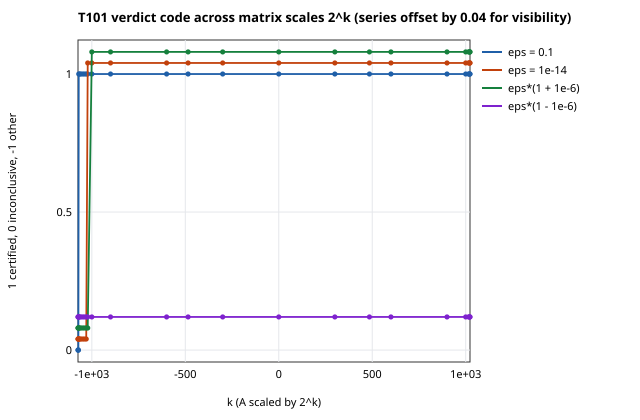
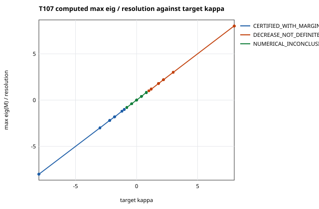
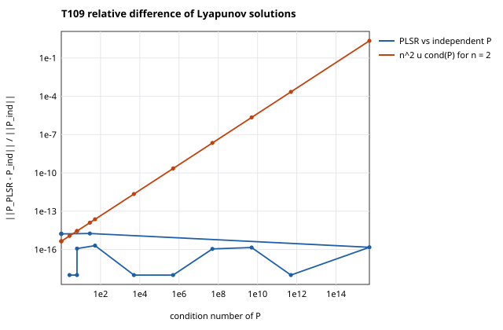
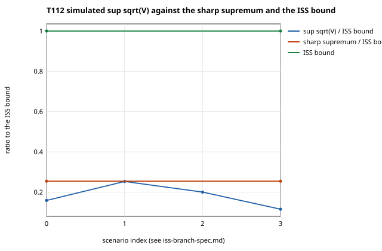
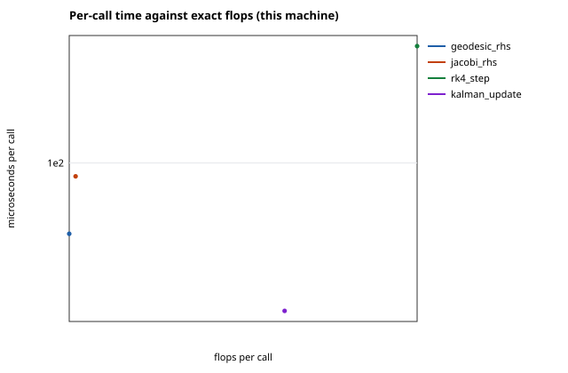
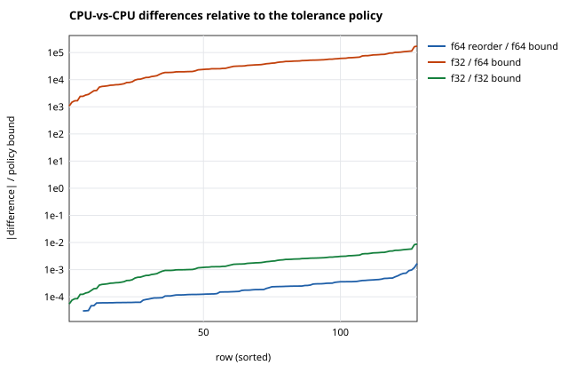
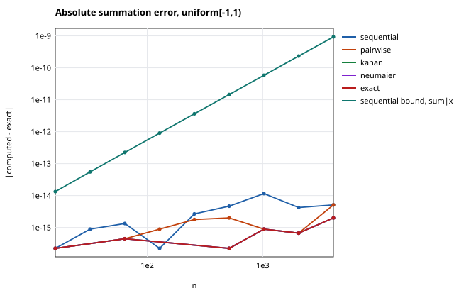
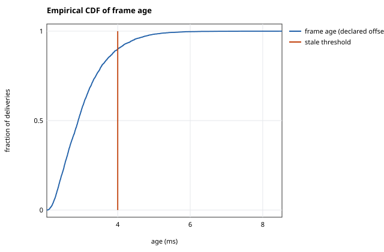
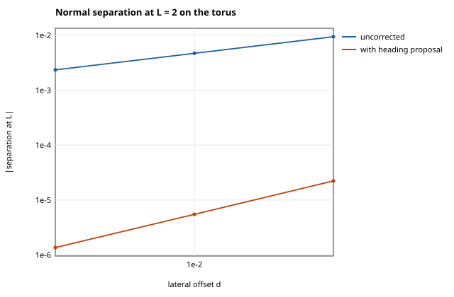

# A non-upgrading evidence-label discipline for computational experiments

*Generated draft from retained CIW lab reports. Not peer reviewed. Contains no hardware-measured findings.*

## Abstract

*Thesis (generated from the retained findings).* Across 51 tasks, 272 of 332 findings are established (7 analytic, 235 numerically_verified, 3 provider_backed, 27 independently_verified); 66 findings refute a general statement by counterexample, for example “Every retained CIW operation result carries a replay-stable numerical-result identity” (T077); “A retained bundle identity binds every provenance record stored in the bundle” (T077); “Canonical-content identity treats numerically equal JSON numbers as equal content” (T079); 38 physical, calibration, sensor or authority claims remain not established, and physical validation is not established for any of them. The results are computational: none of them is a physical measurement.

The argument in the authors' words, its discussion against the literature and its conclusions are outstanding (see Outstanding work).

## Introduction

This draft reports 51 queued computational experiments from the sections exchange-provenance, implementation-targets, lyapunov. Each task states a hypothesis and a mathematical prediction, runs a synthetic or provider-backed protocol, compares the result with an independent reference where one exists, and records every result as a finding whose evidence label is computed from its declared basis. The questions:

- T077 — Build an identity matrix for: source evidence; operation; execution; result; numerical result; verification; bundle; replay; external producer IDs.
- T078 — Test exact source-byte retention.
- T079 — Test whitespace-preserving evidence retention.
- T080 — Test operation/execution/result identity separation.
- T081 — Test stable numerical-result identity.
- T082 — Test fresh replay execution and result identities.
- T083 — Test replay receipt binding.
- T084 — Mutate replay receipt source digest.
- T085 — Mutate replay receipt replayed digest.
- T086 — Mutate verification subject.
- T087 — Mutate verification method.
- T088 — Mutate independence flag.
- T089 — Mutate admission status.
- T090 — Mutate provider runtime identity.
- T091 — Test save/reopen without provider access.
- T092 — Test replay refusal without provider binding.
- T093 — Test unchanged workspace after refusal.
- T094 — Add golden retained bundles.
- T095 — Add malformed exchange fixtures.
- T096 — Add provider-free conformance tests.
- T097 — Add exact SET/SCR/PPDA integration tests when checkouts are available.
- T098 — Record provider HEAD, tree, source hash, lockfile, and engine digest.
- T099 — Verify `cargo build --locked`.
- T100 — Keep synthetic, provider-backed, and physical results visibly distinct.
- T101 — Test the resolution floor over many matrix scales.
- T102 — Test power-of-two homogeneous scaling.
- T103 — Test overflow and underflow state evaluation.
- T104 — Test semidefinite and skew-symmetric edge cases.
- T105 — Test parameter-box comparisons across unit scales.
- T106 — Test every runtime status transition.
- T107 — Verify numerical inconclusive behavior.
- T108 — Verify required-margin monotonicity.
- T109 — Add adversarial eigenvalue cases.
- T110 — Test discrete-time versus continuous-time interpretation.
- T111 — Compare scalar quadratic and matrix-eigenvalue routes.
- T112 — Define a separate disturbance-aware/ISS research branch.
- T113 — Connect filtered residuals without putting sensors inside the kernel.
- T114 — Prepare a non-production servo-axis pilot specification.
- T142 — Identify kernels suitable for Rust.
- T143 — Identify interfaces requiring C++ industrial libraries.
- T144 — Keep Python as orchestration and evidence layer.
- T145 — Use Julia for symbolic, optimization, and exploratory work.
- T146 — Define one canonical serialization across languages.
- T147 — Compare CPU and GPU outputs.
- T148 — Add deterministic reduction policies.
- T149 — Define FPGA telemetry-only interfaces.
- T150 — Record bitstream identity and toolchain.
- T151 — Add FPGA rollback and compatibility metadata.
- T152 — Simulate packet loss, latency, and stale telemetry.
- T153 — Keep actuator writes disabled by default.
- T154 — Treat control outputs as proposals until separately authorized.

The textbook results these tasks use are listed under References; a related-work discussion is outstanding.

## Methods

### Evidence labels

| Label | Meaning | Produced by |
| --- | --- | --- |
| `analytic` | Derived in closed form from declared assumptions | A cited derivation only |
| `synthetic` | Computed from declared generated inputs | A generator without a passing reference check |
| `numerically_verified` | A stated numerical condition passed | Passing analytic, high-precision, invariant, self-convergence, exact or refusal checks |
| `provider_backed` | Returned by a pinned external runtime | Executed provider with repository, revision and tree |
| `hardware_measured` | Acquired from an identified physical device | Acquisition record with raw digest, time and calibration reference, after a hardware probe succeeded in the same task |
| `independently_verified` | Agreement between implementations of different origin, not verification by another party | e.g. ciw against scipy, sympy, mpmath or a pinned provider |
| `not_established` | Not supported by the basis | Any failed check, any physical claim without acquisition, every claim filed in an authority domain |

`independently_verified` means independent implementation agreement; independent verification by another party is outside what the queue can establish.

Each finding's basis is shown beside its label: the basis components it declares and the identity each declares (generator and seed, provider repository@revision, acquisition device), as `ciw.lab.evidence.describe_basis` renders them. A passing check outranks provenance in the label rules, so two findings with one label can rest on different bases; identities are as declared, not authenticated.

### Evidence-label discipline

Labels: `analytic`, `synthetic`, `numerically_verified`, `provider_backed`, `hardware_measured`, `independently_verified`, `not_established`.
Report headline: the weakest established computational label in the order `synthetic` < `analytic` < `provider_backed` < `numerically_verified` < `independently_verified`; `not_established` when a computational finding is refuted or none is established.
Computational domains: computational_pipeline, mathematical, numerical, provenance. Physical domains (need a hardware acquisition): calibration, physical, sensor_performance. Authority domains (never established): actuator_authority, customer_demand, industrial_readiness, machine_safety, production_acceptance.
Independent origins besides `ciw`: cpython, curved-surface-geodesic-sensitivity-runtime, flat-torus-geodesic-reference, git, mpmath, numpy, parameterized-lyapunov-stability-runtime, scientific-computation-runtime, scipy, sympy, zlib.
Check comparisons: abs_le, le, ge, signed_le, signed_ge; thresholds bounded by 1e+100.

The label function `ciw.lab.evidence.supported_label`, the authority-wording screen, basis components and the report rules, as specified in docs/lab/SPECIFICATIONS.md:

1. Authority domains (`machine_safety`, `industrial_readiness`, `customer_demand`, `actuator_authority`, `production_acceptance`): `L = not_established` for every basis. The domain is an input: the finding's author chooses it and review checks it, and `L` never infers it from the claim. T141 showed what that leaves open: the same acceptance statement filed under `computational_pipeline` with a passing check was labelled `numerically_verified` (and filed under `physical` with `A` it would be `hardware_measured`). Rule 10 is a phrase screen against it, not a proof that every authority statement is caught.
2. Any failed check (`F ≠ ∅` or `I` failing): `L = not_established`.
3. Physical domains (`physical`, `calibration`, `sensor_performance`): `L = not_established` unless `A` is present; then `independently_verified` if `I` passes, else `hardware_measured`.
4. Computational domains: `A` is refused (by `L` when no check fails; by `finding` and `validate_finding` whatever the checks say); otherwise the first applicable of `I → independently_verified`, `C ≠ ∅ → numerically_verified`, `P → provider_backed`, `G → synthetic`, `D → analytic`, else `not_established`.
5. Origin rule: `I` requires `origin(producer) ≠ origin(checker)`, where `origin` is the leading ASCII name token of the NFKC-normalized, casefolded implementation identifier, and both origins belong to a closed allowlist (`ciw` plus the recognised external families). The rule is symmetric: a pinned provider's output checked by a `ciw` reference is as independent as `ciw` output checked by the provider. Code in one family never verifies itself independently, and a `cross_implementation` check is never `I`. `independently_verified` therefore means independent implementation agreement; independent verification by another party is outside what the queue can establish.
6. Non-upgrade: a stated label must equal `L(basis, domain)` (`validate_finding`); a derived physical status is `hardware_measured` only if every input is (`physical_status`).
7. Comparisons: a check passes by `holds(observed, tolerance, comparison)` with `abs_le: |x| ≤ t`, `le: x ≤ t` (x ≥ 0 required), `ge: x ≥ t`, `signed_le: x ≤ t`, `signed_ge: x ≥ t`, finite `x`, `|t| ≤ 10¹⁰⁰`. The stated `passed` must equal the computed one.
8. Primary label of a report: with `E` the established computational labels and `R` the refuted computational findings (not `not_established` by declaration), `primary = not_established` if `R ≠ ∅` or `E = ∅`, else `min(E)` in the order `synthetic < analytic < provider_backed < numerically_verified < independently_verified`. The function is order-independent and monotone: adding a weaker finding never raises it.
9. Physical gate: an acquisition record enters a report only when a hardware probe succeeded in the same task and its `raw_sha256` equals the digest of a retained artifact of that task. When the raw bytes are an operator capture (`ctx.capture`), the probe must be of that capture's instrument (`runner.CAPTURE_INSTRUMENTS`); a capture whose instrument has no probe on the host keeps its physical findings `not_established`. The runner resets probes and captures when each task begins, so a probe that succeeded for another task, or one replayed from another task's memo, does not count.
10. Authority wording: `finding` and `validate_finding` refuse (`evidence.screen_authority_claim`) a claim in a computational or physical domain whose wording asserts an authority outcome (production acceptance or disposition, certification for use, machine safety, actuator authorization, industrial readiness, customer demand; `evidence.AUTHORITY_OUTCOME`). An outcome phrase is exempt only when the clause that holds it says, before the phrase, that the software does not make, mark or record it: a negated decision verb whose object reaches the phrase (`evidence.DECLINED_DECISION`: "cannot mark a lot accepted for production", "never claims that the press is safe to operate", "no claim that ..."), a negation directly before a phrase that starts with an active verb ("does not authorize actuation"), or "records <phrase> as not performed, refused, external or pending" (`evidence.RECORDED_AS_UNDECIDED`). Clauses end at `; : ! ?`, a comma or full stop followed by a space, dashes, parentheses and the words *and*, *but*, *while*, *whereas*, *although*, *though*, *yet*, *so* and *because* (`evidence.CLAUSE_BREAK`); a negation after a relative pronoun ("the lot that never failed ...") is not counted, and making the software the subject exempts nothing ("the workbench is ready for industrial deployment" is refused). So "accepted for production; it does not need rework" and "accepted for production, recorded as lot 7" are refused. Filed in an authority domain the same claim is recorded as `not_established` (rule 1). The screen matches phrases, not every paraphrase, so assigning a free-text claim to a domain stays a review question; the manufacturing section additionally refuses its own decision words outside authority domains (`manufacturing_records.screen_acceptance_language`, applied to that section only). Every retained claim passes the screen.
11. Basis components: every finding carries the sorted list of the basis components it declares (`evidence.basis_origin`, stored under the key `origin`), drawn from `acquisition` (`A`), `derivation` (`D`), `independent_check` (`I`), `provider` (`P`, executed only), `reference_checks` (`C ∪ F ≠ ∅`) and `synthetic_inputs` (`G`). These are parts of the basis, not the implementation origin of rule 5. They never enter `L`, so no label changes; they are derived like the label, a stated list must equal them (`validate_finding`), and every component named must be well formed even where `L` never inspects it (an `A` beside a failing check or in an authority domain). Reports and the dashboard show them beside every label as the finding's basis, with the identity each declares (`evidence.describe_basis`: generator name and seed, provider repository@revision, acquisition device): rule 4 ranks a passing check above provenance, so `numerically_verified` from synthetic inputs and `numerically_verified` from a provider's output differ only in their basis. `A` is shown as a hardware acquisition only on a physical-domain finding labelled `hardware_measured` or `independently_verified` (the findings rule 9 gates), and otherwise as a declared acquisition record that was not accepted. A finding retained before basis components were recorded has no `origin` key; readers derive it from the basis, and `build_report` refuses a new finding without one.
12. Workspace classification (`ciw lab classify`): `P` is formed only from a retained runtime identity that is a pin CIW itself declares for the workflow kind (the revision of a pin for the role it is recorded under, or of any pin of the kind for an identity nested inside a role's runtime or recorded in a step; the pin's module and source root where declared; and the source tree CIW records for that revision wherever any CIW pin table records one; `ciw.lab.bridge.declared_pins`). Any other identity leaves the result `not_established` with the reason, so a content-consistent bundle whose tree is not the pin (T100's fabricated bundle) is not `provider_backed`. Where no CIW table records a tree for the revision, any tree is accepted and the row shows `tree_pinned: false` (`ciw.lab.bridge.pins_without_tree`: today every pin of `calibrated-window`, `acquired-calibrated-window`, `telemetry`, `residual-monitor`, `schematic-assessment`, `schematic-companions` and `bim-quantity`, every `calibrated-observable` and `identified-design` pin except `gsie`, and the historical `fsrt` and `rci` adapter pins), so for those kinds an invented tree is not detected. The pins are public constants and workspace seals are unkeyed: a record that copies the pinned revision and tree still classifies `provider_backed`. The comparison checks CIW's declarations, not who produced the record.

### Boundary findings

Retained findings of the tasks that test the discipline's boundary: T100 (Keep synthetic, provider-backed, and physical results visibly distinct.; completed, 13 findings); T141 (Keep production acceptance outside the system until independently validated.; completed, 7 findings).

| Task | Boundary finding | Value | Unit | Evidence | Basis | Report |
| --- | --- | --- | --- | --- | --- | --- |
| T100 | Every earlier report present in the output directory when T100 runs keeps labels among the seven and physical and authority findings unestablished without acquisition | {"label_violations": 0, "reports_absent_of_T001_T099": 0, "reports_checked": 99} |  | `numerically_verified` | reference checks | `sha256:1597530088d6` |
| T100 | Every finding of those reports shows its label in the label column of its rendered Markdown row | {"rendering_violations": 0, "reports_absent_of_T001_T099": 0, "reports_checked": 99} |  | `numerically_verified` | reference checks | `sha256:1597530088d6` |
| T100 | Every finding of those reports shows exactly its declared basis in the Basis column of its rendered Markdown row, an acquisition record as hardware acquisition only on a physical finding it establishes | {"basis_violations": 0, "reports_absent_of_T001_T099": 0, "reports_checked": 99} |  | `numerically_verified` | reference checks | `sha256:1597530088d6` |
| T100 | Every finding of those reports whose basis declares a generator of synthetic inputs or an executed provider names that generator or provider beside its label | {"generator_findings": 245, "not_shown": 0, "provider_findings": 14, "reports_absent_of_T001_T099": 0 …(+1)} |  | `numerically_verified` | reference checks | `sha256:1597530088d6` |
| T100 | A physical finding relabelled with a computational label is refused by the evidence validator | "Evidence label refused: basis supports not_established …" |  | `numerically_verified` | reference checks | `sha256:1597530088d6` |
| T100 | render_markdown keeps the label column for a claim containing a pipe character | {"label_column_shifted": false, "row_cells": 4} |  | `numerically_verified` | reference checks | `sha256:1597530088d6` |
| T100 | CIW keeps the synthetic energy fixture synthetic_only and refuses an unsealed relabel to physical | {"same_occurrence_relabel": "invalid_payload: Identity collision across retained …", "unsealed_relabel": "Retained log digest differs", "synthetic.classification": "synthetic_only", "synthetic.eligible": false …(+2)} |  | `numerically_verified` | reference checks | `sha256:1597530088d6` |
| T100 | A resealed relabel of the synthetic energy fixture under a fresh occurrence is accepted by the workbench and classified as a physical-domain measurement | {"fresh_occurrence_execute": "accepted", "fresh_bundle.classification": "physical_domain_measurement", "fresh_bundle.eligible": true, "fresh_bundle.hardware_provenance": "retained_operator_record_not_authenticated" …(+1)} |  | `numerically_verified` | reference checks | `sha256:1597530088d6` |
| T100 | CIW refuses free-energy sources that relabel synthetic observations as physical or claim physical validation | {"outcomes.declared synthetic policy": "Require a bounded experiment identity", "outcomes.observations relabelled physical": "Unsupported free-energy source or authority policy", "outcomes.physical validation claimed": "Unsupported free-energy source or authority policy", "truth_panel_basis[0]": "synthetic_reference_not_hardware_measurement"} |  | `numerically_verified` | reference checks | `sha256:1597530088d6` |
| T100 | The workspace classifier labels a fabricated, content-consistent numerical-heat bundle whose source tree is not CIW's pinned tree not_established | {"reopen": "accepted", "numerical_labels[0]": "not_established", "reader_view.adapter_version": "fabricated-by-ciw-lab", "reader_view.engine_source_binding": "operator_asserted_not_attested" …(+7)} |  | `numerically_verified` | reference checks | `sha256:1597530088d6` |
| T100 | A fabricated numerical-heat bundle sealed with CIW's pinned SCR revision and source tree reopens and is labelled provider_backed by the workspace classifier, as a provider result is | {"reopen": "accepted", "numerical_labels[0]": "provider_backed", "reader_view.adapter_version": "fabricated-by-ciw-lab", "reader_view.engine_source_binding": "operator_asserted_not_attested" …(+7)} |  | `numerically_verified` | reference checks | `sha256:1597530088d6` |
| T100 | The relabelled energy log is a physical GPU energy measurement | "not established: origin is operator-declared and …" |  | `not_established` | no declared basis | `sha256:1597530088d6` |
| T100 | The synthetic energy fixture characterizes real NVML counter accuracy | "not established: synthetic fixture" |  | `not_established` | no declared basis | `sha256:1597530088d6` |
| T141 | No basis establishes a claim filed in an authority domain, and the acceptance policy, the protocol validator and this section's acceptance-language screen refuse acceptance decisions | {"basis_domain_cases": 320, "refusals": 9, "violations": 0} | cases | `numerically_verified` | reference checks | `sha256:7ddccd842785` |
| T141 | evidence.finding and validate_finding refuse an acceptance or rejection statement filed in a computational or physical domain because of its wording | 4 | refusals | `numerically_verified` | reference checks | `sha256:7ddccd842785` |
| T141 | A paraphrased acceptance statement outside both screened vocabularies, filed in a computational domain with a passing check, is still labelled by its checks | "numerically_verified" |  | `numerically_verified` | reference checks | `sha256:7ddccd842785` |
| T141 | Domain assignment of free-text claims is machine-checked across the lab | null |  | `not_established` | no declared basis | `sha256:7ddccd842785` |
| T141 | Production acceptance of the coupon, cylinder or plate process | "not_performed" |  | `not_established` | no declared basis | `sha256:7ddccd842785` |
| T141 | The manufacturing protocols and models are ready for industrial use | null |  | `not_established` | no declared basis | `sha256:7ddccd842785` |
| T141 | Manufacturers need curvature-aware placement, winding, coating or inspection path checking | null |  | `not_established` | no declared basis | `sha256:7ddccd842785` |

### Tasks

#### T077 — Build an identity matrix for: source evidence; operation; execution; result; numerical result; verification; bundle; replay; external producer IDs.

*Hypothesis.* Each CIW identity on the offline paths is a content or byte hash, a fresh event UUID, a caller- or provider-declared value, or absent, and its binding, replay and reopen behaviour follow from how it is derived.

*Model.* Derivation classes used in the matrix: content_hash, byte_hash, content_hash_of_fresh_occurrence and unkeyed_seal (SHA-256 over canonical JSON or raw bytes); fresh_event_uuid (uuid4 draws); caller_declared, caller_declared_name, constant_name and provider_declared (copied, not derived); code_hash_plus_declared_versions (a code digest beside self-reported versions); provider_pinned (a pinned revision beside host-measured digests); absent. Content identities are sha256 over canonical JSON (sort_keys, compact separators); byte identities are sha256 over raw bytes; event identities are uuid4 draws (collision probability ~2^-122 per pair).

#### T078 — Test exact source-byte retention.

*Hypothesis.* The workbench retains the exact bytes supplied for each source: live, inside every native bundle, and after save and reopen.

*Model.* Let b be the supplied bytes and r the retained bytes (base64-decoded). Prediction: r == b, sha256(r) == evidence_id and len(r) == byte_count for every source; non-canonical base64 is refused, never normalized.

#### T079 — Test whitespace-preserving evidence retention.

*Hypothesis.* Byte variants of one log that differ only in whitespace, key order or float spelling are retained as distinct evidence with distinct byte-level identities, while every content-level identity is equal; CIW's canonical comparison is type-sensitive, so rewriting 1.0 as 1 is a content change.

*Model.* Byte-level identities are functions of the bytes b (sha256(b)); content-level identities are functions of canon(parse(b)) with CIW's canonical JSON, which prints 1 and 1.0 differently. For variants with canon(parse(b_i)) equal and b_i distinct, byte-level identities are pairwise distinct and content-level identities coincide.

#### T080 — Test operation/execution/result identity separation.

*Hypothesis.* Operation, execution and result identities have different kinds (name, fresh occurrence, result occurrence); inconsistent aliases between execution and result identities are refused on reopen, but a consistent re-pairing of two occurrences (execution and result identities and creation times exchanged together) reopens, because oscillator identities are uuid4 draws that bind no content; the selection revision a record claims is not checked against any history.

*Model.* operation_id is a constant per operation; execution_id and result_id are independent uuid4 draws per occurrence (energy result_id = sha256 over a record that includes execution_ref); numerical_result_id excludes the occurrence.

#### T081 — Test stable numerical-result identity.

*Hypothesis.* The energy numerical_result_id is a content identity of the analysed data, and that data includes the retained log's identity (data.log_digest, origin and device_uuid), so it is equal across every occurrence of a canonically identical log (original, sibling, replay, replay after reopen, replay of a replay, separate session in the same process and code) and changes under a resealed metadata-only edit. Re-analysis on reopen refuses numerical edits that leave the retained source bytes unchanged, but not a forger who rewrites and reseals the source log itself. Oscillator results lack a numerical identity and their statistics are only bounds-checked.

*Model.* numerical_result_id = sha256(canon({operation_id, data})) with data = analyze(parse(bytes)) deterministic in-process; data.log_digest = sha256(canon(log without log_digest)). For statistics, |mean| <= rms <= max(|min|, |max|) holds for every sample set (Cauchy-Schwarz and the maximum bound).

#### T082 — Test fresh replay execution and result identities.

*Hypothesis.* Every execution, result, verification, bundle and replay occurrence receives a fresh identity, and a retained workspace that reuses an occurrence is refused; creation times are bound only between the two records of one occurrence.

*Model.* Occurrence identities are uuid4 draws or digests over records containing them; for n occurrences the probability of any uuid4 collision is at most n(n-1) / 2^123.

#### T083 — Test replay receipt binding.

*Hypothesis.* A replay receipt binds the source bundle digest, the replayed bundle digest, the verification subject, the fresh reproduction step, the runtime digest and a not_performed admission, but nothing binds it to a replay event: every field is a copy of, or an unkeyed digest over, retained bundles, and the replay bundle's own identity excludes the receipt. Predicted kills: a false numerical_match, and a receipt moved onto another bundle while its replayed digest stays stale or its verification keeps the donor's reproduction step. Predicted survivors: the same move with the receipt rebuilt from the two bundles (receipt.transplanted-full), a receipt written onto a never-replayed original (receipt.fabricated) and receipt deletion (receipt.deleted).

*Model.* replay_id = sha256(receipt \ replay_id); receipt.verification.subject_ref = source_bundle_digest; receipt.verification.reproduction = the containing bundle's step; bundle_digest = sha256(bundle \ {bundle_digest, verification, replay_receipts}). Every term is computable from retained bundles alone.

#### T084 — Mutate replay receipt source digest.

*Hypothesis.* Predicted kills: a source digest edited without resealing (stale replay_id); resealed to a forged digest (the energy workflow rebuilds the receipt verification with subject = source and refuses the stale subject); re-pointed together with its subject at a digest that is not retained, at the replay itself, or at a bundle of another source log (workbench._validate_links requires a retained source bundle of the same kind, source_id and upstream). Predicted survivor: receipt-source.sibling-execution, because a sibling execution of the same source bytes satisfies every one of those checks and every digest is unkeyed.

*Model.* Each record seal or identity d = sha256(canon(record \ d)) is unkeyed, so any holder can recompute d after an edit. Reopen kills a mutant only if some check compares the edited field with an independently recomputed, fixed or cross-referenced value; otherwise a consistent recomputation survives.

#### T085 — Mutate replay receipt replayed digest.

*Hypothesis.* Predicted kills: the four replayed_bundle_digest edits, resealed or not, because reopen requires it to equal the containing bundle's own digest. Predicted survivor: receipt-replayed.reidentified-bundle, because created_at and session_id sit inside the unkeyed bundle_digest, the forger recomputes that digest, the verification and the receipt together, and no check compares a replay's creation time with its source's.

*Model.* Each record seal or identity d = sha256(canon(record \ d)) is unkeyed, so any holder can recompute d after an edit. Reopen kills a mutant only if some check compares the edited field with an independently recomputed, fixed or cross-referenced value; otherwise a consistent recomputation survives.

#### T086 — Mutate verification subject.

*Hypothesis.* Predicted kills: a receipt verification subject edited with or without recomputed ids (reopen rebuilds the expected verification with subject = receipt source); a bundle verification subject other than the bundle's own digest; oscillator verification fields (protocol v1 fixes them); an ESM candidate naming another bundle; an exchange subject edit without a recomputed verification_id. On the energy path the subject can move only together with the receipt source, which is T084's receipt-source.sibling-execution (cross-referenced here, not re-run). Predicted survivor: oscillator-subject.injected, because sealed oscillator records do not refuse extra keys and their seal is unkeyed (as for the method, independence and admission injections of T087-T089).

*Model.* Each record seal or identity d = sha256(canon(record \ d)) is unkeyed, so any holder can recompute d after an edit. Reopen kills a mutant only if some check compares the edited field with an independently recomputed, fixed or cross-referenced value; otherwise a consistent recomputation survives.

#### T087 — Mutate verification method.

*Hypothesis.* Predicted kills: the three energy verification method edits, because reopen rebuilds the expected verification with the fixed method fresh_analysis_of_same_retained_measurement. Predicted survivor: oscillator-method.injected, because sealed oscillator records do not refuse extra keys and their seal is unkeyed.

*Model.* Each record seal or identity d = sha256(canon(record \ d)) is unkeyed, so any holder can recompute d after an edit. Reopen kills a mutant only if some check compares the edited field with an independently recomputed, fixed or cross-referenced value; otherwise a consistent recomputation survives.

#### T088 — Mutate independence flag.

*Hypothesis.* Predicted kills: independent true in an energy receipt or bundle verification (reopen fixes independent: false) and in an ESM inspection or candidate (the validator requires false). Predicted survivor: oscillator-independent.injected (open key set, unkeyed seal). exchange._identity is predicted to accept a recomputed artifact claiming independence, by design: it checks content only and reports content_recomputed_not_authenticated.

*Model.* Each record seal or identity d = sha256(canon(record \ d)) is unkeyed, so any holder can recompute d after an edit. Reopen kills a mutant only if some check compares the edited field with an independently recomputed, fixed or cross-referenced value; otherwise a consistent recomputation survives.

#### T089 — Mutate admission status.

*Hypothesis.* Predicted kills: receipt admission other than not_performed; energy verification or result authority other than the fixed not_performed record; an oscillator verification_status other than not_verified; an ESM response or candidate claiming admission. Predicted survivor: oscillator-admission.injected (open key set, unkeyed seal).

*Model.* Each record seal or identity d = sha256(canon(record \ d)) is unkeyed, so any holder can recompute d after an edit. Reopen kills a mutant only if some check compares the edited field with an independently recomputed, fixed or cross-referenced value; otherwise a consistent recomputation survives.

#### T090 — Mutate provider runtime identity.

*Hypothesis.* Predicted kills: oscillator runtime edits that break the seal, differ between execution and result, or empty the identity; energy runtime edits that leave bundle_digest stale, differ between a replay and its source (the receipt verification binds one runtime digest), or break the code_sha256 format. Predicted survivors: oscillator-runtime.both (a provider-declared identity checked only for equality between the two records) and energy-runtime.all-bundles and energy-runtime.python-version (reopen format-checks the retained runtime; only a new replay compares it with the current analysis identity).

*Model.* Each record seal or identity d = sha256(canon(record \ d)) is unkeyed, so any holder can recompute d after an edit. Reopen kills a mutant only if some check compares the edited field with an independently recomputed, fixed or cross-referenced value; otherwise a consistent recomputation survives.

#### T091 — Test save/reopen without provider access.

*Hypothesis.* A CIW workspace saved by a session that held a trusted provider binding, with retained oscillator results, an energy-accuracy original and replay and a provider-kind bundle, can be reopened with no provider binding and without reaching any execution entry point, and the binding is not recovered.

*Model.* Reopen = validate(saved JSON) then construct; the guard replaces 73 execution entry points (session analyses, recording operations, the workbench, every workbench workflow's session/step/adapter entry points, provider adapters, subprocesses) with a refusing recorder.

#### T092 — Test replay refusal without provider binding.

*Hypothesis.* Without a host-side trusted binding, CIW refuses every replay or execution of a provider workflow with a named error, and no client or saved value can supply the binding.

*Model.* Workbench._reserve(kind) requires kind in trusted bindings; bindings are process configuration set only by Workbench.bind_workflow, never by a protocol request or a saved workspace. Kinds that consume an upstream bundle are checked for that bundle first.

#### T093 — Test unchanged workspace after refusal.

*Hypothesis.* A refused request other than a recording operation changes neither the session state a save would write nor the session directory; a refused recording operation is retained by design as an execution record.

*Model.* State = digests of selection, results, executions, retained catalog, catalog revision, byte and reservation counters, identity claims, candidates and bindings; plus the session directory listing and the re-saved workspace content without its saved_at timestamp.

#### T094 — Add golden retained bundles.

*Hypothesis.* Workspaces saved by CIW earlier (golden fixtures) still reopen and validate with the current code, with no provider binding and no execution.

*Model.* Golden = exact saved bytes recorded in GOLDEN_MANIFEST; validation = Session.from_workspace (structure, identities, commitments, energy-analysis recomputation) under the execution guard.

#### T095 — Add malformed exchange fixtures.

*Hypothesis.* Each malformed exchange input (duplicate keys, NaN/Infinity, overflow, wrong schema, oversize, truncated bytes, invalid UTF-8, wrong types, extra fields, forged identity) is refused by the relevant CIW validator.

*Model.* Validators: Workbench source.add (energy-accuracy), ciw.session.read_json, ciw.exchange.inspect_exchange (parsing stage, no SET checkout), ciw.exchange._identity, Session.from_workspace, Workbench.restore.

#### T096 — Add provider-free conformance tests.

*Hypothesis.* The provider-free parts of the exchange and ESM candidate boundaries accept valid records and refuse every mutation of a bound field, without any provider checkout.

*Model.* exchange._identity: id = 'sha256:' + SHA-256(schema NUL canonical_json(record without id)); validate_response: equality of boundary fields with the explicit request and the selected bundle.

#### T097 — Add exact SET/SCR/PPDA integration tests when checkouts are available.

*Hypothesis.* The pinned SCR provider, driven through CIW's shared numerical-heat workflow, returns the declared integer heat field, replays with the same numerical identity, and its reopened workspace refuses replay unbound.

*Model.* u_i <- u_i + trunc((u_{i-1} - 2 u_i + u_{i+1}) / 4), fixed ends (SCR heat descriptor, ciw.declared_workload).

#### T098 — Record provider HEAD, tree, source hash, lockfile, and engine digest.

*Hypothesis.* Every bound provider checkout is clean and at a CIW pin; its working bytes reproduce its Git tree; its lockfiles, the bound provider interpreters and the engine used in this run are recorded.

*Model.* Git object ids: blob = H('blob' len NUL bytes), tree = H('tree' len NUL sorted(mode name NUL id)); tracked digest = SHA-256 over 'mode kind sha256(bytes) path' lines in ls-tree order, computed from the working tree and again from Git's HEAD objects; lockfiles = Cargo.lock, uv.lock, poetry.lock, Pipfile.lock, package-lock.json and the other recognised names, plus fully pinned requirements*.txt.

#### T099 — Verify `cargo build --locked`.

*Hypothesis.* The pinned SCR execution engine builds with cargo build --release --locked --offline, leaves the checkout and Cargo.lock unchanged, is reproducible across target directories and executes the heat kernel correctly.

*Model.* Cargo resolution fixed by crates/Cargo.lock (no external crates); determinism = equal binary digests.

#### T100 — Keep synthetic, provider-backed, and physical results visibly distinct.

*Hypothesis.* Retained lab reports keep synthetic, provider-backed and physical results visibly distinct: every rendered finding shows its label and, beside it, the basis it declares (the generator of synthetic inputs, the executed provider, an acquisition); CIW's own records refuse a synthetic-to-physical relabel wherever the record can detect it; and the workspace classifier tells a provider result from a fabricated, content-consistent one exactly as far as its comparison with CIW's pins reaches (T092's counterexample).

*Model.* Allowed labels per domain: physical -> {not_established, hardware_measured, independently_verified with acquisition}; authority -> {not_established}; computational -> never hardware_measured. Rendered row = report.finding_row: claim | value | label | declared basis. The Basis cell is compared whole with the cell docs/lab/AUTHORING.md prescribes, built here without describe_basis: each declared component in basis order, a generator with its name and seed, a provider as repository@revision, and an acquisition record as hardware acquisition (device) only on a physical finding labelled hardware_measured or independently_verified, as declared acquisition record (not accepted) on every other.

#### T101 — Test the resolution floor over many matrix scales.

*Hypothesis.* For the family A = s[[-eps, 1], [-1, -eps]], P = I, PLSR's resolution floor is the documented Higham/Weyl/LAPACK bound and scales exactly with s, so the inconclusive threshold stays at eps* wherever every quantity is a normal binary64 number (this family has a diagonal decrease form, where eigvalsh is exact; T102 tests general near-threshold forms); the bound is not derived for subnormal arithmetic, where it can underflow below the actual rounding error.

*Model.* Continuous decrease form M = A^T P + P A (symmetrised); resolution = n*(2 gamma_{n+3} n max|A| max|P|) + n^3 u max|M|; certified iff -max eig(M) > resolution. For A = s[[-eps, 1], [-1, -eps]], P = I the threshold is eps* = 4 gamma_5/(1 - 8u) = 2.2204e-15 for every s with normal arithmetic.

#### T102 — Test power-of-two homogeneous scaling.

*Hypothesis.* Replacing (A, P, x) by (2^a A, 2^b P, 2^c x) multiplies M, max eig(M) and the resolution by 2^(a+b) exactly, so no verdict code and no margin ratio changes while every quantity stays normal and LAPACK does not rescale internally; outside that window rounding differs and near-threshold codes may move, but never against the exact class of the declared form.

*Model.* Continuous time: M(2^a A, 2^b P) = 2^(a+b) M(A, P) and resolution likewise (homogeneous of degree one in each of max|A|, max|P|, max|M|); PLSR divides x by a power of two before evaluating, so c never enters. Discrete time admits only (P, x) scaling. LAPACK dsyevd rescales by a non-power-of-two factor when max|M| lies outside [2^-485, 2^485]. Exact power-of-two scaling preserves the exact class of M.

#### T103 — Test overflow and underflow state evaluation.

*Hypothesis.* States anywhere in binary64 are classified with the code unchanged through PLSR's power-of-two state scaling (components more than about 2^1022 below the largest one become subnormal in the scaled state and vanish beyond about 2^1075, which a code decided relative to |x|^2 does not see); the reported unscaled V and x^T M x equal the exact values to within rounding or are flagged value_out_of_range, and the flag is set exactly when the exact value is not representable; matrices whose arithmetic leaves binary64 return NUMERICAL_OVERFLOW or an input refusal; no level-set exceedance is missed near the limits. The resolution floor of a subnormal plant is T101's finding, which T103 cites and does not repeat.

*Model.* V(x) = x^T P x and x^T M x are homogeneous of degree two in x, so PLSR evaluates at x / 2^e with the unit state in [1, 2), and reports V = s^2 * scaled_value (s = 2^e), flagging value_out_of_range when that product is infinite or zero while scaled_value is not. The level gate decides V > level as scaled_value > level / s^2 and treats an infinite s^2 as 'exceeded' and a zero s^2 as 'not exceeded'. Exact truth: V = 2^(p + 2e) for P = 2^p I and x = 2^e e1; V and x^T M x of every declared state in rationals.

#### T104 — Test semidefinite and skew-symmetric edge cases.

*Hypothesis.* PLSR never certifies a decrease form that is only semidefinite or indefinite: skew-symmetric plants with P = I give an exactly zero form and must be NUMERICAL_INCONCLUSIVE; defective (Jordan) plants are certified with P = I exactly when lambda > 1/2; a semidefinite Q is refused by the solver.

*Model.* Skew A: A^T + A = 0 exactly; with any P, trace(A^T P + P A) = 0 so the form is never negative definite. Jordan A = [[-l, 1], [0, -l]], P = I: M = [[-2l, 1], [1, -2l]] is negative definite iff l > 1/2 and singular at l = 1/2. Orthogonal discrete A: A^T A - I = 0 up to rounding.

#### T105 — Test parameter-box comparisons across unit scales.

*Hypothesis.* The same physical parameter box and plant expressed in different units give the same PLSR verdicts: box membership is preserved by a monotone conversion and the sign of the decrease form is congruence-invariant.

*Model.* Mass-spring-damper m = 2 kg, c = 3 N s/m, stiffness k in [8, 12] N/m: A(k) = A0 + k A1, common P = [[6, 0.75], [0.75, 1]] (exactly negative definite decrease at both vertices, hence on the box). A unit change is x' = T x, t' = t/tau, k' = c k: A' = tau T A T^-1, P' = T^-1 P T^-1. Inertia is invariant; eigenvalues, max|A| and max|P| (hence margin and resolution) are not.

#### T106 — Test every runtime status transition.

*Hypothesis.* Each of the nine runtime-status-v1 codes is reachable with declared inputs; every transition between two codes that the documented decision order allows through one threshold crossing occurs directly on a one-parameter path, at that crossing; the transitions the order excludes pass through a third code; those involving CERTIFICATE_NOT_POSITIVE need rounding; and the runtime refuses the five host-owned codes.

*Model.* Decision order: outside box -> NUMERICAL_OVERFLOW -> CERTIFICATE_NOT_POSITIVE (min eig P <= 0 or V < 0) -> OUTSIDE_LEVEL_SET -> NOT_CERTIFIED (x^T M x > res |x|^2) -> CERTIFIED_WITH_MARGIN / MARGIN_LOW (margin > res, MARGIN_LOW iff margin <= required margin) -> DECREASE_NOT_DEFINITE (max eig M > res) -> NUMERICAL_INCONCLUSIVE. Its conditions form a gate vector (box, overflow, not_positive, level, scalar_positive, certified, margin_low, not_definite) constrained by scalar_positive => not_definite and not certified (Rayleigh), certified => not not_definite, margin_low => certified. A one-parameter path crosses one threshold at a time: one gate changes, or two whose thresholds coincide (scalar_positive with not_definite for x a top eigenvector of M; certified with margin_low). Two codes are directly connected iff consistent gate vectors giving them differ by one crossing: 24 pairs among the eight rounding-free codes, 8 pairs with CERTIFICATE_NOT_POSITIVE (only through rounding: both certificate kinds refuse min eig P <= 0 when built), 4 pairs excluded.

#### T107 — Verify numerical inconclusive behavior.

*Hypothesis.* PLSR never gives a certifying code to a near-boundary decrease form that is not exactly negative definite; beyond two resolutions from zero it always resolves the sign; under a declared margin of three resolutions no case within two resolutions is CERTIFIED_WITH_MARGIN. A stronger candidate statement formulated for this experiment (it is not quoted from the runtime's documentation) -- that near-boundary spectra yield NUMERICAL_INCONCLUSIVE or MARGIN_LOW rather than CERTIFIED_WITH_MARGIN -- is tested at required_margin 0 as a candidate counterexample.

*Model.* If the resolution bounds the float64 error e of max eig(M) (|e| <= res), then exact lambda < -2 res gives margin > res (certified), exact lambda >= 2 res gives max eig > res (not definite), and exact lambda >= 0 can never give margin > res. With required margin 3 res, certification needs margin > 3 res, impossible for exact lambda >= -2 res.

#### T108 — Verify required-margin monotonicity.

*Hypothesis.* Increasing required_margin never turns a failing verdict into a passing one: CERTIFIED_WITH_MARGIN and meets_required_margin are nonincreasing in the declared margin, non-certifying codes and inequality_certified do not depend on it, and the switch to MARGIN_LOW happens exactly at required_margin = margin.

*Model.* The declared margin r enters the decision order only in the branch margin > res, as MARGIN_LOW iff margin <= r; meets_required_margin = margin > max(r, res). Both are monotone in r by construction; negative or non-finite r must be refused.

#### T109 — Add adversarial eigenvalue cases.

*Hypothesis.* On highly non-normal, exactly defective and clustered Hurwitz plants PLSR either certifies soundly (the exact decrease form of its P is negative definite and P is exactly positive definite) or refuses; its Lyapunov solutions agree with an independent solver to within conditioning; its solver may refuse plants that do have a valid quadratic certificate; floating-point eigenvalues may misjudge stability where the exact certificate route does not.

*Model.* Lyapunov: A Hurwitz iff A^T P + P A = -Q has P > 0 for Q > 0; a certified P bounds transients by ||exp(At)|| <= sqrt(cond P). Non-normal A = [[-1, K], [0, -2]]: P = I certifies iff K < 2 sqrt 2. Defective A = T J T^-1 with integer unimodular T (T Ti = I checked exactly) has exact spectrum {-lambda}; eigenvalue perturbation of an n-Jordan block is O(eps^(1/n)). A backward-stable solve has forward error of order n^2 u cond(P).

#### T110 — Test discrete-time versus continuous-time interpretation.

*Hypothesis.* PLSR distinguishes x' = A x from x+ = A x: the same matrix is certified in a time convention exactly when it is stable in that convention (Hurwitz versus Schur), and the two interpretations give different verdicts whenever the stability quadrants differ.

*Model.* Continuous decrease A^T P + P A, resolution 2 gamma n^2 a p + n^3 u |M|; discrete decrease A^T P A - P, resolution n(2 gamma n^2 a^2 p + u p) + n^3 u |M|. Lyapunov: a positive definite solution of the respective equation with Q = I exists iff A is Hurwitz, respectively Schur.

#### T111 — Compare scalar quadratic and matrix-eigenvalue routes.

*Hypothesis.* The PLSR matrix route (Lyapunov solve, then the sign of max eig of the decrease form beyond the resolution) agrees with independent references -- numpy eigenvalues and SciPy's Bartels-Stewart Lyapunov solvers; PLSR's scalar gate (NOT_CERTIFIED when x^T M x > res |x|^2) fires only where the exact x^T M x is positive and the matrix route finds max eig(M) > res, on margin-separated plants and on near-threshold forms alike; and the scalar quadratic route (the sign of x^T M x at sampled states) cannot certify definiteness and misses thin positive cones.

*Model.* Rayleigh: x^T M x <= max eig(M) |x|^2 for every x, with equality only on the top eigenvector, so sampled negativity never implies negative definiteness. An unstable A has v*(A + A^T)v = 2 Re(lambda)|v|^2 > 0 for an eigenvector v, so P = I can never certify it. If the resolution bounds the error of the computed x^T M x (|x^T E x| <= ||E||_2 |x|^2), then x^T M x > res |x|^2 in float64 implies an exactly positive x^T M x and, by Rayleigh, max eig(M) > res. For n = 1 the decrease form is 2 a p (continuous), so the verdict must follow sign(a) whenever 2|a|p exceeds the resolution.

#### T112 — Define a separate disturbance-aware/ISS research branch.

*Hypothesis.* For x' = A x + B w with |w| <= w_bar, the quadratic ISS-Lyapunov bound sqrt(V(t)) <= max(sqrt(V(0)), 2 ||P^(1/2) B|| w_bar / c) holds on every bounded disturbance; it is conservative against the sharp reachable-set supremum in two dimensions and approached in one dimension; this belongs to a separate research branch, not to the PLSR runtime.

*Model.* V = x^T P x, A^T P + P A = -Q: V' <= -c V + 2 sqrt(V) beta with c = min eig(P^-1 Q), beta = ||P^(1/2) B|| w_bar (Cauchy-Schwarz in the P inner product), so W = sqrt(V) obeys W' <= -(c/2) W + beta. The sharp supremum from x(0) = 0 is max over unit u of w_bar int_0^inf |u^T L^T e^(A s) B| ds with P = L L^T (support function of the reachable set).

#### T113 — Connect filtered residuals without putting sensors inside the kernel.

*Hypothesis.* A host-side adapter can turn filtered residual statistics into plsr-sample-v1 samples (a schema tag and numbers only) while sensor identity, units, calibration and timing stay in a host envelope; host-owned statuses are decided before the kernel and never reach it; forwarding theta_hat together with both ends of its three-standard-error interval keeps a near-bound point estimate from being accepted alone; and the kernel's codes on forwarded samples follow the declared model.

*Model.* Declared discrete map A(theta) = I + h [[0, 1], [-(4 + theta), -0.4]], h = 0.01 s, theta in [-0.5, 0.5], common P from the nominal discrete Lyapunov equation (exactly valid at both vertices, hence on the box by convexity). An EKF on (x, v, theta) yields x_hat, theta_hat, its standard error se and the innovation NIS; mean NIS above 1 + 6 sqrt(2/N) is MODEL_MISMATCH. The adapter forwards theta_hat and theta_hat +- 3 se; the host accepts a window only if the kernel certifies all three.

#### T114 — Prepare a non-production servo-axis pilot specification.

*Hypothesis.* A non-production servo-axis pilot can be specified so that the Lyapunov monitor's scope, data, abort criteria and lack of authority are explicit, the declared level set lies inside the operating envelope, every runtime abort trigger can actually fire for the declared monitor configuration in the pinned runtime, and the offline certificate check passes at every grid inertia before any powered test.

*Model.* Axis J theta'' = -b theta' + Kt u with PD state feedback designed for 20 Hz, damping 0.7 at nominal J; exact ZOH at Ts = 1 ms; closed loop A_cl(J) = Phi(J) - Gamma(J) K on a 9-point grid over J +- 30 %; common P from the discrete Lyapunov equation at nominal J. Online: PLSR on the nominal model with a declared level c such that {V <= c} lies inside the operating envelope (max |x_i| over the ellipsoid is sqrt(c (P^-1)_ii)); for a fixed model the decrease form's sign is state-independent, so the code depends on the state only through the level gate.

#### T142 — Identify kernels suitable for Rust.

*Hypothesis.* Python dispatch overhead, not arithmetic, dominates the geodesic/Jacobi kernels (recorded as not established: only retained timings speak to it); ranked by Python dispatches a port removes, the fused transfer loop is the best Rust target (it contains every geodesic RHS call and RK4 step, so it ranks above them by construction); the Kalman update and a standalone RK4 step are poor targets.

*Model.* Scalar restatements on a counting number type give exact flop counts; RK4 on an n-vector adds 13n+3 flops to four right-hand sides; interpreter dispatches are calls issued from ciw frames (profile hook); arithmetic intensity = flops per byte of state, stage vectors and matrices read or written per call.

#### T143 — Identify interfaces requiring C++ industrial libraries.

*Hypothesis.* EtherCAT monitoring, vendor camera SDKs, PCL/Open3D and OpenCASCADE need C/C++ libraries; OPC UA does not (pure-Python stacks such as asyncua exist) but is assigned certified C/C++ stacks for certification and vendor support. Each interface can sit behind a pinned subprocess boundary that exchanges retained bytes, leaving evidence code in Python.

*Model.* Design inventory: interface -> (native libraries, necessity required or preferred with the pure-Python alternatives passed over, reason, boundary, direction, write path, fieldbus role, identity pins); validation rules: boundary = pinned_subprocess, direction in {read_only, geometry_exchange}, write path absent or disabled, fieldbus role passive_tap (a master originates output process data), identity pins concrete: refused are blank pins, the whole-pin labels current, main, master, trunk, head, dev, develop and x, the words latest, nightly, snapshot, stable, any, unknown, tbd, n/a and na anywhere, HEAD anywhere, the characters * ? < > = ~ ^ and N.x wildcards.

#### T144 — Keep Python as orchestration and evidence layer.

*Hypothesis.* The evidence and identity layer (ciw.lab.evidence, ciw.lab.report, ciw.core.identities, their ciw imports and the packages whose __init__ runs when they are imported) is pure standard-library Python; process spawns use argument vectors without a shell; native loading is confined to declared hardware probes. Whether spawned providers are pinned is not decidable from source and is tested only by a heuristic plus counterexample search.

*Model.* Directed import graph over parsed modules; transitive closure from the evidence roots, adding each visited module's ancestor packages (Python executes their __init__ first); structural rules {closure stdlib-only, no native/spawn in closure, native loading within allowlist, no shell (shell=True, os.system/popen, asyncio.create_subprocess_shell), no compiled extensions}; heuristic rule: a spawning module names an identity token in identifiers or non-docstring strings.

#### T145 — Use Julia for symbolic, optimization, and exploratory work.

*Hypothesis.* Julia can carry symbolic, optimization and exploratory work behind the pinned CIW to SCR boundary; until a pinned Julia environment exists, SymPy demonstrates the symbolic role on the geometry core.

*Model.* Pin procedure from docs/JULIA_SP1.md; symbolic Christoffel symbols Gamma^k_ij = 1/2 g^kl (d_i g_jl + d_j g_il - d_l g_ij) and K = -(1/2W)[d_phi(G_phi/W) + d_theta(E_theta/W)], W = sqrt(EG), for the torus embedding.

#### T146 — Define one canonical serialization across languages.

*Hypothesis.* One canonical JSON encoding (sorted keys, no whitespace, UTF-8, shortest round-trip binary64 with decimal ties to even in CPython repr layout, safe integers, refusals) is reproducible byte for byte by a separately written implementation in another language (Rust), and CIW's existing Python encoders can be measured against it.

*Model.* Encoding E: JSON values -> bytes per ciw.canonical-json.v1; identity = sha256(E(v)). Floats: the fewest digits k for which a k-digit decimal round-trips (monotone in k, found by bisection with exact integers); the nearer of the two k-digit neighbours, even digit on a tie; fixed form iff -4 < decpt <= 16.

#### T147 — Compare CPU and GPU outputs.

*Hypothesis.* A comparison harness with an analytic tolerance policy separates legitimate reduction-order and precision differences from faults: once the fault-free candidate is within the policy, every fault larger than twice the tolerance is detected, detection switches at about the tolerance, and faults up to about the bound escape as often as the fault-size distribution predicts. On the common Gaussian VI workload, whose reductions have a fixed order, T148's policy prescribes a bitwise comparison: it accepts a second implementation of the declared order and flags a build that contracts multiply-adds, and on a GPU host it compares the gaussian_vi PTX kernel's outputs with the CPU reference.

*Model.* For a sum of terms each passing through k roundings, |computed - exact| <= gamma_k * sum|a_j x_j| with gamma_k = k u/(1 - k u), u = 2^-53 (float64) or 2^-24 (float32, inputs rounded). The policy tolerance for two outputs is the sum of their bounds, so the fault-free candidate satisfies |c - r| <= tol; bitwise mode compares bit patterns. A dropped term p gives |c - p - r| >= |p| - tol, so |p| > 2 tol is detected without knowing c - r; with m = max |c - r|/tol, detection switches inside (1 +/- m) tol. With a_ij uniform on [-1, 1), P(|a_ij x_j| <= tol_i) = min(1, tol_i/|x_j|), whose sum over faults predicts the miss count.

#### T148 — Add deterministic reduction policies.

*Hypothesis.* Only a correctly rounded (exact-accumulation) sum is bitwise independent of summation order; fixed-tree pairwise sums are reproducible only for a fixed order; compensated sums are accurate but not order-invariant, and plain Kahan fails on large cancelling terms.

*Model.* Rigorous bounds (u = 2^-53, S = sum|x|, s = exact sum): sequential gamma_{n-1} S; pairwise gamma_{ceil(log2 n)} S; Neumaier u|s| + gamma_{n-1}^2 S (its compensation terms are those of Sum2); exact rounding u|s|. Kahan: 2u S + O(n u^2) S, checked with a declared allowance 4 n u^2 S. Exact sums by integer accumulation at scale 2^1074.

#### T149 — Define FPGA telemetry-only interfaces.

*Hypothesis.* A read-only frame (header, sequence, timestamp, clock id, raw payload, CRC-32) with a single telemetry frame type and no host-to-device field lets the host refuse every corrupted frame and every command or write path before any payload is used, provided the CRC is appended in the order that keeps the frame one codeword.

*Model.* Frame = 28-byte big-endian header | 4*c bytes int32 payload | CRC-32/IEEE (reflected) appended little-endian. Bit p is bit p % 8 of byte p // 8 (LSB first, the reflected CRC's polynomial order). An error pattern e escapes iff its syndrome sum is zero; if the 32 single-bit syndromes of every 32-bit window are linearly independent over GF(2), no burst of length <= 32 escapes. Other patterns escape with probability about 2^-32.

#### T150 — Record bitstream identity and toolchain.

*Hypothesis.* An identity record over canonical JSON can bind a bitstream's sha256 to its exact toolchain version and installation manifest digest, constraint files and source tree, so that a change to any of them is detected when the changed artifact (bitstream, installed toolchain files and reported version, constraint or source files) is checked against the record. The installation digest binds exactly the toolchain files supplied; which files of a vendor toolchain must be supplied is not specified here. Scope: the task records identity and toolchain, a build artifact rather than a measurement, so a synthetic placeholder bitstream exercises every field and refusal of the record; recording a real design's bitstream needs a vendor toolchain and is the deferred research question.

*Model.* record_sha256 = sha256(E(record without record_sha256)), E = ciw.canonical-json.v1; constraints_sha256 = sha256(E({file: sha256})); source tree = sha256(E({path: sha256})); installation_sha256 = sha256(E({toolchain file: sha256})); toolchain version must match [0-9]+(\.[0-9]+){1,3}([-_.](rc|beta|alpha)[0-9]+)?\Z and equal the version the installed toolchain reports; every digest field is 64 lowercase hex digits, sizes are nonnegative integers and the synthetic flag is a boolean.

#### T151 — Add FPGA rollback and compatibility metadata.

*Hypothesis.* A versioned compatibility matrix (bitstream frame format, supported boards, minimum host decoder) and a rollback record bound to retained identities let validation refuse every incompatible or unregistered rollback; 'previous version' is not a safe default.

*Model.* compatible(b, h, r) <=> format(b) in formats(h) and r in boards(b) and h >= min_host(b); a rollback is valid iff both identities are registered with matching digests, target < current, a reason is given, the matrix digest matches and compatible(target, host, board).

#### T152 — Simulate packet loss, latency, and stale telemetry.

*Hypothesis.* Sequence numbers with modulo-2^32 serial arithmetic detect every loss, duplicate and reordering; timestamps with a declared clock offset never miss a stale frame, and their false alarms, like the misses of an offset estimated from minimum delay, occur at the rates the quantization, drift and bias predict.

*Model.* Gilbert-Elliott loss (p_gb=0.005, p_bg=0.2, loss 0.01/0.5), latency L = 2 ms + Gamma(2, 0.5 ms), duplicates p=0.002, period 1 ms, sampling phase U(0, 0.25 ms), timestamps quantized to 50 us, device/host drift 20 ppm, start sequence 2^32-1500, forced loss at 2^32-1. Truly stale iff L > 4 ms; receiver age = L + excess, excess = quantization + drift >= 0. P(L <= x) = 1 - exp(-g/s)(1 + g/s), g = x - 2 ms, s = 0.5 ms. Loss-count variance per frame p(1-p) + 2(l_b-l_g)^2 pi_g pi_b lambda/(1-lambda).

#### T153 — Keep actuator writes disabled by default.

*Hypothesis.* A deny-by-default write policy refuses every write; enabling needs an externally issued, signed, in-scope, unexpired authorization verified against a trust anchor the lab does not hold, so no route opens it here; and a source scan finds no device, serial or fieldbus write path in the package and network paths only in the declared workbench servers, so no other code path reaches a machine that the scan can see.

*Model.* Gate(channel) = refuse unless enabled and verify(authorization, channel, now) passes; verify checks type, issuer, timestamp form (ISO-8601 with a UTC offset, parsed to instants), validity window, scope, signature and trust anchor in that order; the lab build has no trust anchor. Write paths: a module is a device path if it imports a device, serial, fieldbus, industrial-protocol or instrument library or names a device node (/dev/..., \\.\..., COMn), and a network path if it imports a network library or calls a connection or server constructor; network paths are allowed only in declared modules.

#### T154 — Treat control outputs as proposals until separately authorized.

*Hypothesis.* Control outputs can be computed and retained as proposals (frozen objects whose status is re-checked on every use), with content identities, while every conversion to a command is refused without separate authorization; the geometric proposal itself is sound to the order the Jacobi model predicts. This holds for the outputs built here; an inventory records which other control-like outputs of the workbench are not proposals.

*Model.* Normal Jacobi field j(L) = j_lat(L) d + j_head(L) h; proposal h = -j_lat(L) d / j_head(L), undefined at a conjugate point (j_head(L) = 0). On the unit sphere h = -cot(L) d. With h applied, the residual separation is O(d^2).

### Qualifications

Assumptions the tasks state that limit the independence of their references or of their `independently_verified` rows (for a task with such rows, every assumption that mentions independence, same origin or ciw-written code, statistical independence of noise and events excepted):

- T081:
  - The separate session runs in the same process with the same code; it is not an independent reproduction.
- T096:
  - Acceptance of valid records follows from the lab encoder's byte-for-byte agreement with the json.dumps call exchange._identity uses (both CIW-side code, same origin), so it is not independent evidence; producer-sealed artifacts are tested only in T097's PPDA/SCR/SET roundtrip, when those checkouts are bound.
- T101:
  - The resolution comparison is against CIW's transcription of the documented formula: a same-specification check, not an independent one.
- T103:
  - The documented level rule is transcribed from the runtime source at the pinned commit, so agreement with it is a same-specification check; the exact exponent comparison is the independent reference.
- T106:
  - The CIW transcription shares the documented specification with the runtime, so it checks implementation against specification (a same-specification check), not the specification itself.
- T109:
  - The independent solver is SciPy when installed. Without SciPy the CIW Kronecker solve stands in, but it solves the same Kronecker system with numpy.linalg.solve as PLSR's solve_lyapunov, so agreement with it is then recorded as an ordinary check, not an independent one.
- T111:
  - The independent solver is SciPy when installed. Without SciPy the CIW Kronecker solve stands in, but it solves the same Kronecker system with numpy.linalg.solve as PLSR's solve_lyapunov, so agreement with it is then recorded as an ordinary check, not an independent one.

## Results

### Selected findings

One finding per task: its first established finding, or its first finding when none is established. Every finding is in the Appendix.

| Task | Selected finding | Value | Unit | Evidence | Basis | Report |
| --- | --- | --- | --- | --- | --- | --- |
| T077 | Every exercised identity shows its predicted derivation, freshness, binding and reopen properties on the offline paths | {"exercised_rows": 28, "properties": 97, "properties_held": 97, "rederived_properties": 11 …(+17)} |  | `numerically_verified` | reference checks | `sha256:c6badf21d4c5` |
| T078 | Workbench sources retain the exact supplied bytes live, inside native bundles and after offline reopen | {"bundle_artifact_ref_mismatches": 0, "bundle_byte_mismatches": 0, "byte_count_mismatches": 0, "byte_variants": 8 …(+6)} |  | `numerically_verified` | reference checks | `sha256:6e64a0d597ac` |
| T079 | Whitespace, key-order and float-spelling variants under one label retain distinct exact bytes and distinct evidence and source identities while their parsed content is canonically equal | {"artifact_ref_not_equal_to_evidence_id": 0, "canonically_equal": 8, "distinct_evidence_id": 8, "distinct_input_sha256": 8 …(+5)} |  | `numerically_verified` | reference checks | `sha256:884134a472f3` |
| T080 | Operation, execution, result, numerical-result and bundle identities never share a value, and CIW's step validator requires a new result identity, but no new numerical or operation identity, for a new occurrence | {"cross_role_overlaps": 0, "distinct_per_role.bundle": 7, "distinct_per_role.execution": 17, "distinct_per_role.numerical_result": 2 …(+7)} |  | `numerically_verified` | reference checks | `sha256:ef265aa4e68c` |
| T081 | The energy numerical_result_id is identical across original, sibling, replay, replay after offline reopen, replay of a replay and a separate session (same process and code) of one canonically identical log | {"distinct_numerical_result_ids": 1, "distinct_result_ids": 12, "energy_numerical_result_id": "sha256:a928a6f8a5b5c1318e61b0a716ce4887c4d2d0fe5e86ec451a148 …", "occurrences": 12 …(+1)} |  | `numerically_verified` | reference checks | `sha256:d4a18878905d` |
| T082 | Every execution, result, verification, bundle, session and replay occurrence has a fresh identity | {"bundle.distinct": 7, "bundle.occurrences": 7, "bundle_session.distinct": 7, "bundle_session.occurrences": 7 …(+8)} |  | `numerically_verified` | reference checks | `sha256:726e2d4c934b` |
| T083 | Every retained replay receipt binds its source and replayed bundle digests, verification subject, fresh reproduction step, runtime digest and limited authority | {"binding_properties": 30, "held": 30, "receipts": 3} |  | `numerically_verified` | reference checks | `sha256:0613f5ce2b48` |
| T084 | Replay receipt source digest forgeries that leave a digest stale or contradict a recomputed, fixed or cross-referenced value are refused with the pinned message | {"[0].kind": "workspace", "[0].mutant": "receipt-source.naive", "[0].observed": "Invalid retained energy replay receipt", "[0].recompute": "none" …(+16)} |  | `numerically_verified` | reference checks | `sha256:5f289a8fae52` |
| T085 | Replay receipt replayed digest forgeries that leave a digest stale or contradict a recomputed, fixed or cross-referenced value are refused with the pinned message | {"[0].kind": "workspace", "[0].mutant": "receipt-replayed.naive", "[0].observed": "Invalid retained energy replay receipt", "[0].recompute": "none" …(+12)} |  | `numerically_verified` | reference checks | `sha256:1003289381cd` |
| T086 | Verification subject forgeries that leave a digest stale or contradict a recomputed, fixed or cross-referenced value are refused with the pinned message | {"[0].kind": "workspace", "[0].mutant": "receipt-subject.naive", "[0].observed": "Invalid retained energy replay receipt", "[0].recompute": "none" …(+20)} |  | `numerically_verified` | reference checks | `sha256:3cac874ea463` |
| T087 | Verification method forgeries that leave a digest stale or contradict a recomputed, fixed or cross-referenced value are refused with the pinned message | {"[0].kind": "workspace", "[0].mutant": "receipt-method.naive", "[0].observed": "Invalid retained energy replay receipt", "[0].recompute": "none" …(+8)} |  | `numerically_verified` | reference checks | `sha256:5a0b92e07933` |
| T088 | Independence flag forgeries that leave a digest stale or contradict a recomputed, fixed or cross-referenced value are refused with the pinned message | {"[0].kind": "workspace", "[0].mutant": "receipt-independent.naive", "[0].observed": "Invalid retained energy replay receipt", "[0].recompute": "none" …(+16)} |  | `numerically_verified` | reference checks | `sha256:11e9bf3212ff` |
| T089 | Admission status forgeries that leave a digest stale or contradict a recomputed, fixed or cross-referenced value are refused with the pinned message | {"[0].kind": "workspace", "[0].mutant": "receipt-admission.naive", "[0].observed": "Invalid retained energy replay receipt", "[0].recompute": "none" …(+24)} |  | `numerically_verified` | reference checks | `sha256:f61733fc294b` |
| T090 | Provider runtime identity forgeries that leave a digest stale or contradict a recomputed, fixed or cross-referenced value are refused with the pinned message | {"[0].kind": "workspace", "[0].mutant": "oscillator-runtime.naive", "[0].observed": "Operation record integrity mismatch", "[0].recompute": "none" …(+20)} |  | `numerically_verified` | reference checks | `sha256:3aa3fc86bb01` |
| T091 | A saved workspace from a session holding a trusted provider binding, with oscillator results, an energy-accuracy original and replay and a provider-kind numerical-heat bundle, reopens with no provider binding and reaches no execution path | {"bundles": 3, "execution_path_calls": 0, "executions": 1, "read_requests": 11 …(+7)} |  | `numerically_verified` | reference checks | `sha256:17b4ebcbacd0` |
| T092 | Requests to execute or replay unbound provider workflows, or to supply or bypass a binding, are refused with a named error and reach no provider process, adapter or workflow entry point | {"refused_as_expected": 25, "requests": 25, "codes[0]": "invalid_payload", "codes[1]": "operation_unavailable" …(+23)} |  | `numerically_verified` | reference checks | `sha256:0595dbc5227a` |
| T093 | Each of the 16 exercised non-recording request classes is refused and leaves the in-memory session state and the session directory unchanged, and a re-save reproduces the saved workspace content (a refused recording operation is the exception: it is retained as an execution record) | {"directory_changed": false, "refused_as_expected": 16, "requests": 16, "resaved_content_equal": true …(+1)} |  | `numerically_verified` | reference checks | `sha256:ecf3a6fcedb9` |
| T094 | The golden retained workspaces reopen and validate with the current code without execution | {"golden/energy-accuracy-workspace.json.bundles": 2, "golden/energy-accuracy-workspace.json.executions": 0, "golden/energy-accuracy-workspace.json.results": 0, "golden/energy-accuracy-workspace.json.sha256": "cd08fa0a122b27db4d76d27f66e881c58c4bd3b0930f8b3a67d55da7b6ea …" …(+11)} |  | `numerically_verified` | reference checks | `sha256:bad336a36b03` |
| T095 | Every malformed exchange input with a declared CIW refusal text is refused by the validator it targets with exactly that text | {"inputs": 21, "refused_with_declared_text": 19, "with_declared_refusal": 19, "without_declared_refusal.extra top-level workspace field (Session.from_workspace)": "accepted" …(+1)} |  | `numerically_verified` | reference checks | `sha256:f8a186a0d1db` |
| T096 | exchange._identity accepts every synthetic result and verification record sealed by a lab-written canonical encoder that agrees byte for byte with json.dumps, in any member order, and refuses every single-field mutation and a forged identity | {"accepted": 24, "encoder_agreement": 24, "mutations": 114, "refused": 114 …(+2)} |  | `numerically_verified` | reference checks, synthetic inputs (ciw.lab seeded nested JSON records, seed 9601) | `sha256:b5b9476d1053` |
| T097 | SCR executed through CIW's shared numerical-heat workflow and through its own Python API returns the declared integer heat fields | {"api_cases[0][0]": 0, "api_cases[0][1]": 219, "api_cases[0][2]": 313, "api_cases[0][3]": 219 …(+17)} |  | `provider_backed` | pinned provider run (giasonpooni/Scientific-Computation-Runtime@a59aba283b03) | `sha256:3395185a76d0` |
| T098 | The declared-workload and proved-heat workflows pin one SCR revision, while CIW declares more than one revision of SCR and of SET across its workflows | {"scr_revisions.5f0409743e0098a0691a88302a9b3dcdcbcf25fd[0]": ".github/workflows/exchange.yml", "scr_revisions.a59aba283b0304faeeb3e5d305087e7709e171ca[0]": "ciw.declared_workload.PINS[numerical-heat]", "scr_revisions.a59aba283b0304faeeb3e5d305087e7709e171ca[1]": "ciw.proved_heat.PIN", "set_revisions.1467ec5058b3e7ebd6ba4a45f2d9b49148a2560d[0]": "ciw/telemetry-runtimes.json[set]" …(+4)} |  | `numerically_verified` | reference checks | `sha256:c5cb9b44abf3` |
| T099 | cargo build --release --locked --offline of SCR execution-cli succeeds at the pinned revision | {"builds": 2, "cargo_lock_sha256": "24b1db68d762d3457eb40465dae6c3edc8a2da2925d42f3f794d090d18a5 …", "package": "execution-cli", "exit_codes[0]": 0 …(+4)} |  | `numerically_verified` | pinned provider run (giasonpooni/Scientific-Computation-Runtime@a59aba283b03), reference checks | `sha256:f793a0ec7460` |
| T100 | Every earlier report present in the output directory when T100 runs keeps labels among the seven and physical and authority findings unestablished without acquisition | {"label_violations": 0, "reports_absent_of_T001_T099": 0, "reports_checked": 99} |  | `numerically_verified` | reference checks | `sha256:1597530088d6` |
| T101 | PLSR decrease_resolution equals the documented bound transcribed in CIW at every evaluated matrix scale | {"cases": 288, "max_relative_difference": 0.0} |  | `numerically_verified` | pinned provider run (https://github.com/giasonpooni/Parameterized-Lyapunov-Stability-Runtime@19ea69670601), reference checks | `sha256:3a2e72fc2324` |
| T102 | Power-of-two scaling of (A, P, x) inside LAPACK's window never changes the PLSR code or margin ratio | {"code_flips": 0, "evaluations": 550, "ratio_changes": 0} |  | `numerically_verified` | pinned provider run (https://github.com/giasonpooni/Parameterized-Lyapunov-Stability-Runtime@19ea69670601), reference checks | `sha256:4fd40e7be16c` |
| T103 | PLSR decides the level gate exactly as the documented rule predicts across the near-limit scan | {"cases": 68, "disagreements": 0} |  | `numerically_verified` | pinned provider run (https://github.com/giasonpooni/Parameterized-Lyapunov-Stability-Runtime@19ea69670601), reference checks | `sha256:171fc5b5d38c` |
| T104 | PLSR never certifies a semidefinite or indefinite edge-case decrease form | {"cases": 28, "violations": 0} |  | `independently_verified` | independent check, pinned provider run (https://github.com/giasonpooni/Parameterized-Lyapunov-Stability-Runtime@19ea69670601) | `sha256:e514e55144ef` |
| T105 | Interior and boundary stiffness samples give the same PLSR code in all five unit systems | {"mismatches": 0, "samples": 10, "systems": 5} |  | `numerically_verified` | pinned provider run (https://github.com/giasonpooni/Parameterized-Lyapunov-Stability-Runtime@19ea69670601), reference checks | `sha256:181464ccb13f` |
| T106 | The eight rounding-free runtime-status-v1 codes are reached on one-parameter paths far from every rounding threshold | {"codes[0]": "CERTIFIED_WITH_MARGIN", "codes[1]": "DECREASE_NOT_DEFINITE", "codes[2]": "MARGIN_LOW", "codes[3]": "NOT_CERTIFIED" …(+4)} |  | `numerically_verified` | pinned provider run (https://github.com/giasonpooni/Parameterized-Lyapunov-Stability-Runtime@19ea69670601), reference checks | `sha256:088532334f70` |
| T107 | No near-boundary case receives a certifying code unless its exact decrease form is negative definite | {"cases": 102, "violations": 0} |  | `independently_verified` | independent check, pinned provider run (https://github.com/giasonpooni/Parameterized-Lyapunov-Stability-Runtime@19ea69670601) | `sha256:91e46325d690` |
| T108 | Increasing required_margin never turns a failing PLSR verdict into a passing one | {"cases": 36, "evaluations": 280, "inequality_changed": 0, "meets_regained": 0 …(+2)} |  | `numerically_verified` | pinned provider run (https://github.com/giasonpooni/Parameterized-Lyapunov-Stability-Runtime@19ea69670601), reference checks | `sha256:97512b973b89` |
| T109 | Every certifying PLSR verdict on the adversarial plants uses an exactly valid certificate | {"certifying_verdicts": 30, "violations": 0} |  | `independently_verified` | independent check, pinned provider run (https://github.com/giasonpooni/Parameterized-Lyapunov-Stability-Runtime@19ea69670601) | `sha256:da85d376913a` |
| T110 | PLSR certifies each matrix with its own Lyapunov P exactly in the time convention where numpy finds it stable, and its solver refuses the other convention at a documented gate | {"matrices": 40, "mismatches": 0, "solver_refusals": 40} |  | `independently_verified` | independent check, pinned provider run (https://github.com/giasonpooni/Parameterized-Lyapunov-Stability-Runtime@19ea69670601), reference checks | `sha256:806547ea924e` |
| T111 | PLSR continuous-time Lyapunov solutions agree with the reference solver (SciPy's Bartels-Stewart when installed) to within 10 n^2 u cond(P) on the route family | {"max_relative_difference": 1.7301902624474186e-14, "solves": 15} |  | `independently_verified` | independent check, pinned provider run (https://github.com/giasonpooni/Parameterized-Lyapunov-Stability-Runtime@19ea69670601) | `sha256:2f8268da6d9f` |
| T112 | For the four simulated disturbance classes sup sqrt(V) stays below the sharp reachable-set supremum, and worst-case switching comes within 2 % of it | {"to_iss_bound.constant": 0.15879607047685765, "to_iss_bound.random held": 0.11521866811663344, "to_iss_bound.resonant sinusoid": 0.20023718120966036, "to_iss_bound.worst-case switching": 0.2529358526826656 …(+4)} |  | `numerically_verified` | reference checks, synthetic inputs (simulate_iss, seed 112) | `sha256:832f8cc1ddb8` |
| T113 | Forwarded samples receive the runtime codes predicted from the declared model | {"estimate near bound theta 0.48.estimate": "CERTIFIED_WITH_MARGIN", "estimate near bound theta 0.48.lower": "CERTIFIED_WITH_MARGIN", "estimate near bound theta 0.48.upper": "OUTSIDE_PARAMETER_BOX", "estimate outside box theta 0.9.estimate": "OUTSIDE_PARAMETER_BOX" …(+8)} |  | `numerically_verified` | pinned provider run (https://github.com/giasonpooni/Parameterized-Lyapunov-Stability-Runtime@19ea69670601), reference checks | `sha256:5564fec23ccd` |
| T114 | PLSR's monitor code on the declared configuration is the same at every scanned state without a level set and follows the exact V(x) > c decision with the declared level | {"exceeding_states": 90, "level_mismatches": 0, "states": 200, "codes_with_level[0]": "CERTIFIED_WITH_MARGIN" …(+2)} |  | `independently_verified` | independent check, pinned provider run (https://github.com/giasonpooni/Parameterized-Lyapunov-Stability-Runtime@19ea69670601), reference checks | `sha256:3ecb67f2c4e9` |
| T142 | Exact floating-point operation counts of the scalar kernel restatements | {"geodesic_rhs.add": 72, "geodesic_rhs.div": 3, "geodesic_rhs.flops": 173, "geodesic_rhs.mul": 86 …(+26)} | operations per call | `numerically_verified` | reference checks, synthetic inputs (PCG64 torus states and Kalman case, seed 142) | `sha256:f12e7f1a608b` |
| T143 | Industrial interfaces assigned to C/C++ libraries behind a pinned subprocess boundary (required, or preferred over existing pure-Python stacks) | {"preferred[0]": "OPC UA client (read-only subscriptions)", "required[0]": "EtherCAT passive monitoring (network TAP capture)", "required[1]": "Vendor camera SDKs (GenICam GenTL)", "required[2]": "Point cloud processing (PCL / Open3D)" …(+1)} |  | `analytic` | derivation | `sha256:5008b0bd1d71` |
| T144 | Evidence and identity closure is standard-library Python with no native loading or process spawns | ["ciw", "ciw.core", "ciw.core.identities", "ciw.lab" …(+2)] |  | `numerically_verified` | reference checks | `sha256:7899baa10f9f` |
| T145 | Julia provider pin procedure | ["julia_version", "platform", "executable_sha256", "worker_source_sha256" …(+6)] |  | `analytic` | derivation | `sha256:df603ebac1ee` |
| T146 | Canonical JSON v1 test vectors (bytes and sha256) | {"invalid_vectors": 9, "spec": "ciw.canonical-json.v1", "vector_set_sha256": "63f7261753b3bf936967b73c5b36d1efb378b0b31815fedb083717aad348 …", "vectors": 19} |  | `numerically_verified` | reference checks | `sha256:b076877af278` |
| T147 | Under T148's fixed-order policy the harness accepts a second implementation of the common Gaussian VI workload and flags builds that contract its multiply-adds | {"fma-first": true, "fma-second": true, "python-scalar": false} |  | `numerically_verified` | reference checks, synthetic inputs (common Gaussian VI workload) | `sha256:5404b3a7d6d8` |
| T148 | Correctly rounded exact accumulation is permutation-invariant | 1 | distinct results | `independently_verified` | independent check, reference checks, synthetic inputs (PCG64 datasets and 24 permutations, seed 148) | `sha256:d5d744bd0ad5` |
| T149 | Telemetry frames round-trip every header field and channel bit-exactly | 0 | failures | `numerically_verified` | reference checks, synthetic inputs (PCG64 random frames, seed 149) | `sha256:af71838e1c0e` |
| T150 | Bitstream identity record binds bitstream, toolchain version and installation manifest, constraints and source tree | {"accepted_positive_controls": 1, "record_sha256": "8f04faf1ada727853cb4084356fa5e83a3d767c8c8548ae4952ba8240ed1 …", "refused_mutations": 26} |  | `numerically_verified` | reference checks, synthetic inputs (seeded synthetic placeholder bitstream, seed 150) | `sha256:defc0658b5ad` |
| T151 | Compatibility rules and the set construction agree on every combination | {"combinations": 36, "compatible": 15, "disagreements": 0} |  | `numerically_verified` | reference checks | `sha256:310997752a83` |
| T152 | Sequence-number gap detection recovers every lost frame across the 32-bit wrap | {"detected": 120, "duplicates": 13, "lost": 120, "reordered": 522} |  | `numerically_verified` | reference checks, synthetic inputs (Gilbert-Elliott loss, gamma latency, duplicates, quantized timestamps, drift, seed 152) | `sha256:9fe6b20f0732` |
| T153 | Default policy refuses writes on every declared channel | 5 | refused channels | `numerically_verified` | reference checks | `sha256:de6b093a412f` |
| T154 | Control outputs built by this section are constructed with status proposal and cannot be converted to a command here | {"refusals": 7, "status": "proposal"} |  | `numerically_verified` | reference checks | `sha256:25251b8ce763` |

### Figures

## Discussion

### Counterexamples

Each finding below refutes a general statement; the statement must not be restated without the qualification its witness shows.

- T077 refutes “Every retained CIW operation result carries a replay-stable numerical-result identity”: Oscillator operation results carry no replay-stable numerical-result identity (`numerically_verified`; reference checks). Witness: `{"operation": "statistics.v1", "fields[0]": "channel", "fields[1]": "created_at", "fields[2]": "data" …(+17)}`.
- T077 refutes “A retained bundle identity binds every provenance record stored in the bundle”: The energy replay bundle identity excludes its replay receipt and verification (`numerically_verified`; reference checks). Witness: `{"bundle": "bundle:B1", "function": "src/ciw/telemetry.py:_bundle_digest", "removed": "replay_receipts", "replaced": "verification"}`.
- T079 refutes “Canonical-content identity treats numerically equal JSON numbers as equal content”: CIW canonical comparison is type-sensitive (1 != 1.0): a consistent int-for-float rewrite is refused by the stale log seal and, once resealed, retained as distinct evidence rather than aliased (`numerically_verified`; reference checks). Witness: `{"ciw_canonical_equal": false, "edit": "unit diagonal of runtime.workload.solver_settings and …", "python_equal": true, "unsealed": "Retained log digest differs" …(+3)}`.
- T080 refutes “A retained oscillator result stays bound to the execution occurrence that produced it”: Surviving mutant alias.swap-pairing: two statistics occurrences whose execution and result identities and creation times are exchanged consistently reopen re-paired (`numerically_verified`; reference checks). Witness: `{"description": "R1 and R2 exchange executions consistently: result …", "name": "alias.swap-pairing", "observed": "accepted", "recompute": "local" …(+5)}`.
- T080 refutes “Saved execution and result selection revisions are checked against a retained selection history”: Surviving mutant revision.gap: a workspace whose selection revision jumps to 1000, with records claiming revision 999, reopens (`numerically_verified`; reference checks). Witness: `{"description": "selection revision 1000 with execution and result claiming …", "name": "revision.gap", "observed": "accepted", "recompute": "local" …(+3)}`.
- T081 refutes “Reopen re-analysis protects retained energy results from numerical forgery”: Surviving mutant energy-source.resealed: a resealed edit of the retained source log, with every derived record rebuilt, reopens with a different gross energy (`numerically_verified`; reference checks). Witness: `{"description": "first measurement counter sample lowered by 50 mJ in the …", "name": "energy-source.resealed", "observed": "accepted", "recompute": "full" …(+6)}`.
- T081 refutes “Unkeyed record seals detect every edit to a retained numerical result”: Surviving mutant oscillator-stats.resealed: an in-bounds statistics edit with a recomputed seal reopens (`numerically_verified`; reference checks). Witness: `{"description": "statistics mean moved to the midpoint of [minimum …", "name": "oscillator-stats.resealed", "observed": "accepted", "recompute": "local" …(+3)}`.
- T081 refutes “Saved statistics satisfy |mean| <= rms <= max(|min|, |max|)”: Surviving mutant oscillator-stats.impossible-moments: resealed statistics that no sample set can have reopen (`numerically_verified`; reference checks). Witness: `{"description": "R1 mean set to its maximum and rms to half of it (|mean| > …", "name": "oscillator-stats.impossible-moments", "observed": "accepted", "recompute": "local" …(+15)}`.
- T081 refutes “Every retained oscillator result is sealed against edits”: Surviving mutant oscillator-stats.legacy: an edit to an unsealed legacy result reopens (`numerically_verified`; reference checks). Witness: `{"description": "legacy (unsealed) statistics mean moved to the midpoint", "name": "oscillator-stats.legacy", "observed": "accepted", "recompute": "none" …(+3)}`.
- T082 refutes “A retained execution occurrence binds its creation time”: Surviving mutant fresh.created-at-shift: a backdated execution and result pair reopens (`numerically_verified`; reference checks). Witness: `{"description": "created_at backdated identically in execution and result …", "name": "fresh.created-at-shift", "observed": "accepted", "recompute": "local" …(+2)}`.
- T083 refutes “A replay receipt cannot be moved from its replay bundle onto another retained bundle”: Surviving mutant receipt.transplanted-full: a replay receipt moved onto an original sibling and rebuilt from the two bundles reopens there, and the replay reopens without it (`numerically_verified`; reference checks). Witness: `{"description": "receipt moved from the replay B1 onto the original sibling …", "name": "receipt.transplanted-full", "observed": "accepted", "recompute": "full" …(+5)}`.
- T083 refutes “A replay receipt can only be retained on a bundle produced by that replay”: Surviving mutant receipt.fabricated: a receipt written onto a never-replayed original, claiming it replays its sibling, reopens (`numerically_verified`; reference checks). Witness: `{"description": "a new receipt written onto the never-replayed original B0b …", "name": "receipt.fabricated", "observed": "accepted", "recompute": "full" …(+5)}`.
- T083 refutes “A replay bundle cannot be retained without its replay receipt”: Surviving mutant receipt.deleted: a replay bundle reopens without its replay receipt, listed with no receipt like an original execution (`numerically_verified`; reference checks). Witness: `{"description": "replay_receipts removed from the replay bundle", "name": "receipt.deleted", "observed": "accepted", "recompute": "none" …(+5)}`.
- T084 refutes “Unkeyed record seals detect every replay-provenance forgery”: Surviving mutant receipt-source.sibling-execution: a receipt re-pointed, with its verification subject, at a sibling execution of the same bytes reopens (`numerically_verified`; reference checks). Witness: `{"description": "receipt source and verification subject moved together to a …", "name": "receipt-source.sibling-execution", "observed": "accepted", "recompute": "local" …(+4)}`.
- T085 refutes “A retained replay cannot be dated before its source bundle”: Surviving mutant receipt-replayed.reidentified-bundle: a replay re-sessioned and dated before its source, with recomputed digests, reopens (`numerically_verified`; reference checks). Witness: `{"description": "replay bundle dated 2001, before its source, with a new …", "name": "receipt-replayed.reidentified-bundle", "observed": "accepted", "recompute": "full" …(+5)}`.
- T086 refutes “Sealed operation records refuse verification-subject claims outside their schema”: Surviving mutant oscillator-subject.injected: a sealed result carrying an injected verification subject naming its sibling result reopens (`numerically_verified`; reference checks). Witness: `{"description": "subject_ref naming the sibling result R2 injected into a …", "name": "oscillator-subject.injected", "observed": "accepted", "recompute": "local" …(+3)}`.
- T087 refutes “Sealed operation records refuse verification-method claims outside their schema”: Surviving mutant oscillator-method.injected: a sealed result carrying an injected verification_method reopens (`numerically_verified`; reference checks). Witness: `{"description": "verification_method field injected into a sealed result …", "name": "oscillator-method.injected", "observed": "accepted", "recompute": "local" …(+3)}`.
- T088 refutes “Sealed operation records refuse independence claims outside their schema”: Surviving mutant oscillator-independent.injected: sealed records carrying an injected independent: true reopen (`numerically_verified`; reference checks). Witness: `{"description": "independent: true injected into a sealed execution and …", "name": "oscillator-independent.injected", "observed": "accepted", "recompute": "local" …(+3)}`.
- T089 refutes “Sealed operation records refuse admission claims outside their schema”: Surviving mutant oscillator-admission.injected: a sealed result carrying an injected state_admission reopens (`numerically_verified`; reference checks). Witness: `{"description": "state_admission: admitted injected into a sealed result …", "name": "oscillator-admission.injected", "observed": "accepted", "recompute": "local" …(+3)}`.
- T090 refutes “Unkeyed record seals detect a forged provider runtime identity”: Surviving mutant oscillator-runtime.both: a provider runtime forged identically in execution and result reopens (`numerically_verified`; reference checks). Witness: `{"description": "runtime forged identically in execution and result; both …", "name": "oscillator-runtime.both", "observed": "accepted", "recompute": "local" …(+5)}`.
- T090 refutes “Reopening a workspace detects a forged analysis runtime identity”: Surviving mutant energy-runtime.all-bundles: a consistently forged analysis code digest reopens (`numerically_verified`; reference checks). Witness: `{"description": "code_sha256 forged in every energy bundle; every digest …", "name": "energy-runtime.all-bundles", "observed": "accepted", "recompute": "full" …(+5)}`.
- T090 refutes “Reopening a workspace detects forged runtime dependency versions”: Surviving mutant energy-runtime.python-version: forged dependency versions reopen (`numerically_verified`; reference checks). Witness: `{"description": "python_version forged as 3.99.0 in every energy bundle …", "name": "energy-runtime.python-version", "observed": "accepted", "recompute": "full" …(+5)}`.
- T091 refutes “Reopening a saved workspace performs no numerical recomputation”: Reopening recomputes the retained energy analysis to validate content (`numerically_verified`; reference checks). Witness: `{"ciw.energy_records.analyze calls": 7, "new execution occurrences": 0}`.
- T092 refutes “Reopen validation of a retained numerical-heat bundle establishes that its values are the pinned SCR heat-kernel output”: A retained numerical-heat bundle whose values no provider computed passes reopen validation (`numerically_verified`; reference checks). Witness: `{"bundle_id": "sha256:954c39d69990ad4cce8c3bc853d4a79ac19d2dc4a756c4c484bec …", "runtime_repository_root": "/fabricated/not-a-provider-checkout", "reference_values[0]": 0, "reference_values[1]": 16 …(+8)}`.
- T093 refutes “Every refused request leaves the session's in-memory state unchanged”: A refused recording operation is retained as a refused execution record (`numerically_verified`; reference checks). Witness: `{"new_files": 1, "request": "operation.execute ciw.lab-unregistered.v1", "changed[0]": "executions"}`.
- T095 refutes “Every CIW JSON reader refuses nonfinite numbers”: session.read_json accepts an overflowing number as infinity while the exchange and workbench parsers refuse it (`numerically_verified`; reference checks). Witness: `{"fixture": "overflow.json", "parsed_value": "inf", "reader": "ciw.session.read_json"}`.
- T095 refutes “session.read_json refuses every malformed workspace file with a ValueError”: session.read_json does not refuse a 20000-deep array with a ValueError (`numerically_verified`; reference checks). Witness: `{"fixture": "deep-nesting.json", "observed": "RecursionError"}`.
- T095 refutes “Session.from_workspace refuses every malformed workspace with a ValueError”: Session.from_workspace raises AttributeError, not a ValueError refusal, on a workspace holding only its version (`numerically_verified`; reference checks). Witness: `{"error_type": "AttributeError", "fixture": "incomplete-workspace.json", "content.workspace_version": 3}`.
- T095 refutes “Saved workspaces with fields outside the schema are refused on reopen”: Session.from_workspace accepts an unknown top-level field and drops it on re-save (`numerically_verified`; reference checks). Witness: `{"dropped_on_resave": true, "field": "lab_unexpected_field", "reopened": true}`.
- T095 refutes “Workbench source errors name the source, not a bound runtime”: Workbench source.add reports malformed source JSON with text that names a bound runtime (`numerically_verified`; reference checks). Witness: `{"fixture": "duplicate-key.json", "message": "MALFORMED_RESPONSE: The bound runtime did not return …", "request": "source.add (energy-accuracy)"}`.
- T096 refutes “Every exchange artifact identity is bound to its content”: Observation-batch identities are caller-declared: mutated batches pass exchange._identity (`numerically_verified`; reference checks, synthetic inputs (ciw.lab seeded nested JSON records, seed 9601)). Witness: `{"identity_status": "caller_declared_reference", "schema": "notation.instrument.observation-batch.v1"}`.
- T096 refutes “The CIW candidate boundary refuses any ESM response field it does not recognise”: validate_response accepts unknown extra fields in an ESM response (`numerically_verified`; reference checks, synthetic inputs (ciw.lab.exchange_provenance_bundles._candidate_cases)). Witness: `{"reason": "the boundary checks bindings only; ESM owns its record …", "fields[0]": "lab_admission_override", "fields[1]": "candidate.lab_admitted"}`.
- T100 refutes “CIW energy records can distinguish a genuinely acquired log from a relabelled synthetic fixture”: A resealed relabel of the synthetic energy fixture under a fresh occurrence is accepted by the workbench and classified as a physical-domain measurement (`numerically_verified`; reference checks). Witness: `{"classification": "physical_domain_measurement", "hardware_provenance": "retained_operator_record_not_authenticated", "origin": "physical_measurement (declared)", "run_id": "energy-run-22222222222222222222222222222222"}`.
- T100 refutes “CIW's retained records and their classification keep provider-backed results visibly distinct from fabricated ones”: A fabricated numerical-heat bundle sealed with CIW's pinned SCR revision and source tree reopens and is labelled provider_backed by the workspace classifier, as a provider result is (`numerically_verified`; reference checks). Witness: `{"adapter_version": "fabricated-by-ciw-lab", "bundle_id": "sha256:60f6b1a3bc1e43ffe35c1786663264183e5e3788356702dceb044 …", "engine_source_binding": "operator_asserted_not_attested", "repository_root": "/fabricated/not-a-provider-checkout" …(+9)}`.
- T101 refutes “The float64 resolution floor bounds the rounding error of the decrease form at every matrix scale”: PLSR's resolution of a subnormal plant is zero while forming its decrease matrix rounds an exactly indefinite declared form to a negative definite one (`numerically_verified`; pinned provider run (https://github.com/giasonpooni/Parameterized-Lyapunov-Stability-Runtime@19ea69670601), reference checks). Witness: `{"resolution": 0.0, "A_hex[0][0]": "-0x0.0000000000002p-1022", "A_hex[0][1]": "0x0.0000000000005p-1022", "A_hex[1][0]": "0x0.0p+0" …(+15)}`.
- T103 refutes “OUTSIDE_LEVEL_SET is returned whenever V(x) exceeds the declared level”: The PLSR level gate misses exceedances when s^2 underflows: V > level is certified (`numerically_verified`; pinned provider run (https://github.com/giasonpooni/Parameterized-Lyapunov-Stability-Runtime@19ea69670601), reference checks). Witness: `{"A": "-I", "P": "2^500 I", "documented_exceeded": false, "e": -700 …(+7)}`.
- T103 refutes “The level gate is decided exactly through the power-of-two scaling”: The PLSR level gate reports OUTSIDE_LEVEL_SET for V below the level when s^2 overflows (`numerically_verified`; pinned provider run (https://github.com/giasonpooni/Parameterized-Lyapunov-Stability-Runtime@19ea69670601), reference checks). Witness: `{"A": "-I", "P": "2^-1060 I", "documented_exceeded": true, "e": 512 …(+7)}`.
- T103 refutes “Every finite in-box sample yields a runtime-status-v1 code”: A finite in-box theta whose A(theta) overflows raises an input error instead of NUMERICAL_OVERFLOW (`numerically_verified`; pinned provider run (https://github.com/giasonpooni/Parameterized-Lyapunov-Stability-Runtime@19ea69670601), reference checks). Witness: `{"A0": "-I", "A1": "2I", "theta": 1e+308, "box[0]": -1e+308 …(+3)}`.
- T103 refutes “value_out_of_range is set exactly when V or x^T M x is not representable in binary64”: PLSR sets value_out_of_range and reports V = 0 for states whose exact V and x^T M x are representable binary64 subnormals, because s^2 underflows before the product is formed (`numerically_verified`; pinned provider run (https://github.com/giasonpooni/Parameterized-Lyapunov-Stability-Runtime@19ea69670601), reference checks). Witness: `{"code": "CERTIFIED_WITH_MARGIN", "decrease": -0.0, "error_units": null, "exact_representable": true …(+4)}`.
- T105 refutes “The declared box bounds and their binary64 neighbours keep their SI box decision under either conversion formula”: A binary64 neighbour just outside the declared stiffness box is admitted in some unit system when the sample is converted as k / (1 / c) and the bound as k * c (`numerically_verified`; pinned provider run (https://github.com/giasonpooni/Parameterized-Lyapunov-Stability-Runtime@19ea69670601), reference checks). Witness: `{"cases[0]": "um, ms, N/um|k just below 8", "k_hex.k just above 12": "0x1.8000000000001p+3", "k_hex.k just below 8": "0x1.fffffffffffffp+2"}`.
- T105 refutes “Converting the box and the sample with the same formula preserves box membership”: A parameter just above the SI bound is admitted after multiplying bound and sample by 1e-3 (`numerically_verified`; pinned provider run (https://github.com/giasonpooni/Parameterized-Lyapunov-Stability-Runtime@19ea69670601), reference checks). Witness: `{"bound": 64576.90184335635, "hex": "0x1.f881cdbe69934p+15", "codes.SI": "OUTSIDE_PARAMETER_BOX", "codes.x1e-3": "CERTIFIED_WITH_MARGIN"}`.
- T105 refutes “Mathematically equal unit conversions give the same box decision”: A parameter exactly on the SI bound is refused when bound and sample are converted by the two mathematically equal formulas k * 0.001 and k / 1000 (`numerically_verified`; pinned provider run (https://github.com/giasonpooni/Parameterized-Lyapunov-Stability-Runtime@19ea69670601), reference checks). Witness: `{"bound": 2787.074437234679, "hex": "0x1.5c6261ca3211ap+11", "codes.SI": "CERTIFIED_WITH_MARGIN", "codes.x1e-3": "OUTSIDE_PARAMETER_BOX"}`.
- T105 refutes “The same physical plant in different units gets the same PLSR verdict”: The light-damping plant's verdict depends on the unit system although its exact decrease form is negative definite in all of them (`numerically_verified`; pinned provider run (https://github.com/giasonpooni/Parameterized-Lyapunov-Stability-Runtime@19ea69670601), reference checks). Witness: `{"codes.2^-10 m, 2^-7 s, 2^10 N/m": "CERTIFIED_WITH_MARGIN", "codes.m, ms, N/m": "NUMERICAL_INCONCLUSIVE", "codes.m, s, N/m": "CERTIFIED_WITH_MARGIN", "codes.mm, s, N/mm": "CERTIFIED_WITH_MARGIN" …(+6)}`.
- T106 refutes “An in-box sample at which P is not positive definite yields CERTIFICATE_NOT_POSITIVE, which RUNTIME-STATUS-v1 at the pinned commit describes as 'P is not positive definite here, so there is no certificate to evaluate'”: An affine certificate that is singular at an in-box theta raises ValueError instead of returning CERTIFICATE_NOT_POSITIVE (`numerically_verified`; pinned provider run (https://github.com/giasonpooni/Parameterized-Lyapunov-Stability-Runtime@19ea69670601), reference checks). Witness: `{"A0": "-I", "A1": "0", "P0": "I", "P1": "diag(0, 1)" …(+7)}`.
- T107 refutes “Near-boundary spectra yield NUMERICAL_INCONCLUSIVE or MARGIN_LOW rather than CERTIFIED_WITH_MARGIN (candidate hypothesis formulated for T107, not a quoted specification)”: At required_margin 0 near-boundary spectra within two resolutions of zero receive CERTIFIED_WITH_MARGIN, and every such certificate is exactly sound (`numerically_verified`; pinned provider run (https://github.com/giasonpooni/Parameterized-Lyapunov-Stability-Runtime@19ea69670601), reference checks). Witness: `{"case": 3, "code_at_required_margin_0": "CERTIFIED_WITH_MARGIN", "exact_bin": "[-2, -1) res", "exact_class": "negative_definite" …(+12)}`.
- T109 refutes “PLSR's solve_lyapunov refuses only plants for which no valid quadratic certificate is available in float64”: solve_lyapunov refuses an exactly Hurwitz plant for which an exactly valid quadratic certificate exists and PLSR's own verdict certifies it (`numerically_verified`; pinned provider run (https://github.com/giasonpooni/Parameterized-Lyapunov-Stability-Runtime@19ea69670601), reference checks). Witness: `{"certificate": "scipy.linalg.solve_continuous_lyapunov@1.16.2", "certificate_condition": 496874100465.51154, "name": "Jordan n=4, lambda=2^-6", "solver_error": "Lyapunov residual 5.875e-04 exceeds tolerance 1.000e-06 …" …(+1)}`.
- T111 refutes “A negative sampled scalar decrease at every tested state implies a negative definite decrease form”: The scalar route sees decrease at every sampled state of an indefinite form that PLSR reports DECREASE_NOT_DEFINITE (`numerically_verified`; pinned provider run (https://github.com/giasonpooni/Parameterized-Lyapunov-Stability-Runtime@19ea69670601), reference checks). Witness: `{"A": "diag(-0.5, 5e-7)", "M": "diag(-1, 1e-6)", "P": "I", "samples": 64 …(+1)}`.
- T114 refutes “A Lyapunov P solved at the nominal model with Q = I certifies the declared +-30 % inertia interval”: With Q = I the nominal-model P does not cover the declared inertia interval (`numerically_verified`; reference checks). Witness: `{"J[0]": 0.0014, "J[1]": 0.00155, "J[2]": 0.0017000000000000001, "J[3]": 0.00185}`.
- T144 refutes “Numerical providers are invoked only through pinned executables”: Some process spawns run a PATH-resolved executable without comparing it to a pinned identity (`numerically_verified`; reference checks). Witness: `{"executable": "rustc from shutil.which('rustc')", "module": "ciw.lab.implementation_targets_serial", "recorded": "rustc -vV release and commit (provenance, compared with …"}`.
- T144 refutes “A text search for 'subprocess' identifies the process-spawning modules”: Text search for 'subprocess' finds modules that spawn no process (`numerically_verified`; reference checks). Witness: `{"module": "ciw.acquired_dataset", "reason": "mentions ciw.adapters.subprocess or quotes subprocess in …"}`.
- T146 refutes “CIW already has one canonical JSON byte encoding”: ciw.core.identities.canonical_json and ciw.telemetry.canonical produce different bytes for non-ASCII text (`numerically_verified`; reference checks). Witness: `{"identities_sha256": "4e2c3d77419efa08ed3f0637d7db5152bd5b0196396a90b37d4c177a0b52 …", "telemetry_sha256": "e28c9c5bcbf4f143f4aa9c0a207150257ba4ebb473f776aa735b58367ef6 …", "vector": "unicode-bmp"}`.
- T146 refutes “Distinct Python values have distinct CIW content identities”: ciw.core.identities.canonical_json gives {1: 'x'} and {'1': 'x'} the same content identity (`numerically_verified`; reference checks). Witness: `{"canonical": "{\"1\":\"x\"}", "values[0]": "{1: 'x'}", "values[1]": "{'1': 'x'}"}`.
- T146 refutes “Existing CIW canonicalizers enforce the cross-language specification”: Python canonicalizers accept values the specification refuses (`numerically_verified`; reference checks). Witness: `{"vector": "integer-2^53", "accepted_by[0]": "ciw.core.identities.canonical_json", "accepted_by[1]": "ciw.telemetry.canonical"}`.
- T146 refutes “CIW canonical JSON bytes equal RFC 8785 JCS bytes”: CIW canonical JSON differs from RFC 8785 (JCS) numbers and key order (`numerically_verified`; derivation, reference checks). Witness: `{"1.0[0]": "1.0", "1.0[1]": "1", "1e+16[0]": "1e+16", "1e+16[1]": "10000000000000000" …(+2)}`.
- T146 refutes “Rust's shortest float formatting yields the CPython repr digits”: Rust's own shortest float formatting breaks exact decimal ties away from the specification (`numerically_verified`; reference checks). Witness: `{"rust_shortest": "1.0000000000000003e15", "specification": "1000000000000000.2", "value": "1e15 + 0.25"}`.
- T147 refutes “The float32 tolerance policy detects every dropped partial product larger than its row bound”: The float32 policy misses dropped partial products up to about its bound, as often as the product distribution predicts (`numerically_verified`; reference checks). Witness: `{"above_bound.column": 538, "above_bound.magnitude": 0.0005776939797215164, "above_bound.ratio": 1.0001610045362923, "above_bound.row": 14 …(+6)}`.
- T148 refutes “Pairwise summation is order-independent”: Fixed-order pairwise summation is reproducible for one order but not permutation-invariant (`numerically_verified`; reference checks). Witness: `{"dataset": "uniform n=1024 PCG64(148)", "distinct_results": 4}`.
- T148 refutes “Kahan compensated summation is accurate whenever Neumaier's is”: Kahan summation loses the sum [1, 1e100, 1, -1e100] that Neumaier summation keeps (`numerically_verified`; reference checks). Witness: `{"kahan": 0.0, "neumaier": 2.0, "input[0]": 1.0, "input[1]": 1e+100 …(+2)}`.
- T148 refutes “Neumaier summation error is at most 2u|S| + 4n u^2 sum|x|”: The bound 2u|S| + 4n u^2 sum|x| does not bound Neumaier summation (`numerically_verified`; reference checks). Witness: `{"input": "[1] + 1000 x [0.7u(1 + 2^-20)] + [-1]", "n": 1002, "ratio": 12.312657557436786}`.
- T149 refutes “Appending CRC-32 in either byte order keeps the 32-bit burst guarantee”: A big-endian CRC trailer lets a 32-bit burst across the payload/CRC boundary escape (`numerically_verified`; reference checks). Witness: `{"frame": "encode_frame(123456, 987654321, 7, [1, -2, 3, 2**31 - 1])", "trailer": "big-endian", "flipped_bits[0]": 321, "flipped_bits[1]": 326 …(+15)}`.
- T149 refutes “CRC-32 detects every 32-bit burst whatever order the link sends bits in”: The burst guarantee holds only in the LSB-first bit order of the reflected CRC (`numerically_verified`; reference checks). Witness: `{"numbering": "bit p = bit 7 - p % 8 of byte p // 8", "flipped_bits[0]": 228, "flipped_bits[1]": 230, "flipped_bits[2]": 235 …(+16)}`.
- T151 refutes “Rolling back to the immediately previous bitstream is always compatible”: Rolling back to the previous bitstream version can be incompatible (`numerically_verified`; reference checks). Witness: `{"board": "revC", "from": "1.4.1", "host": "1.0", "to": "1.2.0"}`.
- T152 refutes “Summing seq - previous - 1 in arrival order counts lost frames”: Differencing sequence numbers in arrival order miscounts losses under reordering (`numerically_verified`; reference checks). Witness: `{"arrival_order": 1258, "in_order": 119, "true": 120}`.
- T152 refutes “Sequence differences without modular arithmetic count every loss in a sequence-ordered stream”: Non-modular differencing misses the loss at the 32-bit wrap (`numerically_verified`; reference checks). Witness: `{"in_order": 119, "true": 120, "missed_at_wrap[0]": 4294967295}`.
- T153 refutes “An in-process Python flag is an actuator authority boundary”: A frozen in-process policy object can be mutated (`numerically_verified`; reference checks). Witness: `{"mutation": "object.__setattr__(policy, 'enabled', True)", "outcome": "flag changed; the gate still refused because it re-verifies …"}`.
- T154 refutes “A frozen dataclass status field keeps every control output a proposal”: A frozen control proposal's status can be forced in memory, and the forced object is refused (`numerically_verified`; reference checks). Witness: `{"mutation": "object.__setattr__(proposal, 'status', 'command')", "outcome": "status changed; record() and to_command re-check it and …"}`.

Their interpretation against the literature is outstanding.

## Limitations

What a computational experiment may establish, and what it cannot establish alone:

| A computational experiment may establish | It cannot establish alone |
| --- | --- |
| Analytic agreement | Physical truth |
| Numerical convergence | Calibration validity |
| Synthetic sensor performance | Real sensor performance |
| Replay determinism | Independent verification by another party |
| Schema/provenance integrity | Machine safety |
| GPU/CPU agreement | Industrial readiness |
| A plausible use case | Actual customer demand |
| A simulated control response | Safe actuator authority |

### Claims not established

- T077 [physical]: The retained log's device and kernel identities identify the producing GPU and code — not established.
- T077 [provenance]: Retained workspace records are authenticated: a holder without a secret cannot produce a forged record that reopens — not established.
- T078 [physical]: The retained energy logs are real GPU energy measurements — not established.
- T080 [provenance]: Retained workspace records are authenticated: a holder without a secret cannot produce a forged record that reopens — not established.
- T081 [provenance]: Retained workspace records are authenticated: a holder without a secret cannot produce a forged record that reopens — not established.
- T082 [provenance]: Retained workspace records are authenticated: a holder without a secret cannot produce a forged record that reopens — not established.
- T083 [provenance]: Replay agreement establishes verification by an independent party — not established.
- T083 [provenance]: Retained workspace records are authenticated: a holder without a secret cannot produce a forged record that reopens — not established.
- T084 [provenance]: Retained workspace records are authenticated: a holder without a secret cannot produce a forged record that reopens — not established.
- T085 [provenance]: Retained workspace records are authenticated: a holder without a secret cannot produce a forged record that reopens — not established.
- T086 [provenance]: Retained workspace records are authenticated: a holder without a secret cannot produce a forged record that reopens — not established.
- T087 [provenance]: Retained workspace records are authenticated: a holder without a secret cannot produce a forged record that reopens — not established.
- T088 [provenance]: Retained workspace records are authenticated: a holder without a secret cannot produce a forged record that reopens — not established.
- T089 [production_acceptance]: A retained replay receipt or verification authorizes admission of the replayed result into canonical state — not established.
- T089 [provenance]: Retained workspace records are authenticated: a holder without a secret cannot produce a forged record that reopens — not established.
- T090 [provenance]: Retained workspace records are authenticated: a holder without a secret cannot produce a forged record that reopens — not established.
- T092 [production_acceptance]: A content-consistent reopened bundle is acceptable as a verified production result — not established.
- T094 [provenance]: The retained golden numerical-heat values were computed by the pinned SCR engine — not established.
- T096 [production_acceptance]: Passing provider-free conformance admits a candidate into canonical state — not established.
- T097 [physical]: The integer heat field describes physical heat diffusion in a material — not established.
- T098 [provenance]: A matching HEAD, tree and lock digest authenticates the upstream repository, toolchain and built engine — not established.
- T099 [computational_pipeline]: The SP1 proved-heat locked build was not attempted — not established.
- T099 [production_acceptance]: A successful locked build makes the engine acceptable for production use — not established.
- T100 [physical]: The relabelled energy log is a physical GPU energy measurement — not established.
- T100 [sensor_performance]: The synthetic energy fixture characterizes real NVML counter accuracy — not established.
- T105 [physical]: The declared stiffness box contains the stiffness of a real axis — not established.
- T106 [actuator_authority]: A CERTIFIED_WITH_MARGIN verdict (operationally_acceptable) authorizes actuation — not established.
- T112 [physical]: The disturbance bound w_bar = 0.5 holds for a physical plant — not established.
- T112 [machine_safety]: The ISS bound defines a safe operating envelope for a machine — not established.
- T113 [sensor_performance]: The synthetic residual statistics describe a real encoder's performance — not established.
- T113 [sensor_performance]: The EKF standard error of theta covers the true parameter of a real axis at the stated rate — not established.
- T113 [calibration]: The calibration referenced in the host envelope is valid — not established.
- T114 [machine_safety]: The servo-axis pilot is safe to operate — not established.
- T114 [actuator_authority]: The Lyapunov monitor may command, gate or release the axis — not established.
- T114 [production_acceptance]: The pilot configuration is acceptable for production use — not established.
- T114 [industrial_readiness]: The monitor is ready for industrial deployment — not established.
- T114 [physical]: The placeholder inertia interval contains the real axis inertia — not established.
- T114 [calibration]: Encoder and current-sensor calibrations of the bench are valid — not established.
- T142 [computational_pipeline]: Python dispatch overhead, not arithmetic, dominates the run time of the geodesic/Jacobi kernels — not established.
- T142 [industrial_readiness]: Rust ports of the ranked kernels are ready for industrial deployment — not established.
- T143 [industrial_readiness]: The listed interfaces are qualified for plant integration — not established.
- T143 [sensor_performance]: Vendor camera SDK acquisition meets its timing on real cameras — not established.
- T144 [computational_pipeline]: Numerical providers are invoked only through pinned executables — not established.
- T144 [machine_safety]: Keeping native code behind subprocess boundaries makes machine interfaces safe — not established.
- T145 [computational_pipeline]: Julia environment pinned and exercised through the CIW to SCR boundary — not established.
- T146 [computational_pipeline]: Byte-identical canonical JSON holds for Julia, C++ and GPU-host implementations — not established.
- T147 [numerical]: CPU and GPU outputs of the common Gaussian VI workload agree under T148's policy for fixed-order reductions (bitwise) on GPU hardware — not established.
- T147 [industrial_readiness]: GPU/CPU agreement establishes industrial readiness — not established.
- T149 [physical]: The frame format works on real FPGA links — not established.
- T149 [machine_safety]: A telemetry-only interface guarantees the FPGA cannot actuate the machine — not established.
- T150 [physical]: A real bitstream with this identity exists and is loaded on hardware — not established.
- T150 [production_acceptance]: The bitstream is approved for production deployment — not established.
- T151 [machine_safety]: The rollback procedure is safe to execute on a production machine — not established.
- T151 [production_acceptance]: Rollback records are accepted for production change control — not established.
- T152 [physical]: Simulated loss, latency and staleness represent the real FPGA telemetry link — not established.
- T153 [actuator_authority]: The lab holds actuator write authority — not established.
- T153 [machine_safety]: Disabled-by-default software writes make the machine safe — not established.
- T154 [computational_pipeline]: Every control-like output of the workbench is a ControlProposal — not established.
- T154 [actuator_authority]: Heading proposals are authorized for execution as actuator commands — not established.
- T154 [machine_safety]: Applying the proposed heading corrections on a machine is safe — not established.

### Unfinished tasks

What each blocked, deferred or partial task is missing, in its own words (its unresolved assumptions):

- T077 is partial; missing or unresolved:
  - Partial: ESM candidate_id and candidate execution identities (they need an operator-bound ESM adapter and a telemetry or calibrated bundle) and pinned-provider runtime identities (ciw.subprocess-runtime.v1; they need a provider checkout bound to a declared-workload or telemetry workflow) are planned matrix rows that the offline path cannot exercise; their predictions are read from the code, not observed.
  - The ESM rows use a synthetic telemetry-shaped record (schema, digest, three step occurrences), not a telemetry session validated by the telemetry workflow, which needs provider checkouts.
  - Provider-backed workflows (telemetry, declared workloads, proved heat) were not exercised offline; their identity rows are inferred only where they share the energy-accuracy code path.
  - Reopen stability is observed as the value CIW saves again after reopening, which is the reopened session's own serialization of its restored state.
  - Content identities establish consistency, not authorship.
  - Deferred research question (telemetry provider stack): provision the telemetry stack pinned in src/ciw/telemetry-runtimes.json (ppda, stfe, gsie, set, cbsr; scripts/check_lab.py provisions only ppda and set of these, and scripts/reproduce_lab.py TEST_VARIABLES has no variable for stfe, gsie or cbsr), bind it to a telemetry or declared-workload workflow, and observe the ESM candidate, candidate execution and ciw.subprocess-runtime.v1 identity rows and telemetry-validated records that are now read from code or replaced by a synthetic telemetry-shaped record.
  - Deferred research question (key custody and signatures): which key signs CIW workspace records, replay receipts and execution records, who holds it, how is it provisioned, rotated and revoked, and how does a verifier obtain its public key? Every seal and identity on these paths is an unkeyed SHA-256, so 'Retained workspace records are authenticated' stays not_established until records are signed (for example Ed25519 over the canonical record bytes, with an RFC 3161 timestamp for created_at) and T077 and T080-T090 are re-run against the signed records to check that every surviving forgery is refused.
- T099 is partial; missing or unresolved:
  - The binary digest depends on the Rust toolchain recorded in provider_runtime_identity; CI pins rustc 1.94.0 for the proved-heat gate, and other toolchains may produce different digests.
  - The SP1 proved-heat build needs crates.io and GitHub release downloads, the SP1 checkout, the Succinct compiler archive, protoc and >= 7 GiB RAM / 20 GiB disk (.github/workflows/proved-heat.yml); host probes are in sp1-requirements.json.
- T145 is partial; missing or unresolved:
  - No Julia environment, manifest or worker exists; the pin procedure is unexecuted
  - The task has no Julia execution path; julia on PATH is recorded, never used
  - Optimization and exploratory roles are not demonstrated
- T147 is partial; missing or unresolved:
  - The batched dot products have no GPU path and need none: the GPU comparison uses the common Gaussian VI workload, whose PTX kernel exists; a device-wide reduction kernel does not
  - Deferred research question: extend the common workload's GPU path beyond the binary64 gaussian_vi PTX kernel of ciw.energy_cuda: a float32 rendering of the same kernel, and a device-wide reduction of its per-replica outputs (a fixed tree over the stored order per T148's REDUCTION_POLICY, plus one atomicAdd variant), each compared with the NumPy reference by compare_outputs on the RTX 2080 host and captured with `ciw energy record` for energy; until then those claims stay not_established on every host
  - GPU reductions may use FMA and tree shapes not modelled by the 32-lane order
  - Only single dropped products were injected; other fault classes (duplicated terms, wrong operands) have their own detection limits
  - no NVIDIA GPU answered the hardware:nvidia-gpu probe in this task; the PTX kernel of the common workload exists (ciw.energy_cuda gaussian_vi), so this comparison runs on a host where the probe succeeds (needs hardware:nvidia-gpu)

## Outstanding work

- Missing from this draft, which the lab cannot write: the thesis in the authors' words (the generated thesis restates counts and counterexamples of the retained findings only), a related-work discussion (the reference list is the T156 textbook ledger's name matches), an interpretation of the counterexamples against the literature, conclusions, figure selection and captions, and external peer review. The draft stays partial until they exist.
- T077: Complete T077: observe the ESM candidate, candidate execution and pinned-provider runtime identity rows, now read from code, once the telemetry provider stack is provisioned and bound (the deferred research question among the unresolved assumptions), and, as CIW changes, add a numerical_result_id to oscillator operation results and bind replay receipts into a catalog-level seal.
- T099: Run the SP1 proved-heat gate (scripts/check_proved_heat.py) on a machine that meets its recorded requirements (network access to crates.io and GitHub releases, the SP1 checkout b38b612, protoc, at least 7 GiB of RAM and 20 GiB of disk) and retain its outcome; and rebuild execution-cli with CI's pinned rustc 1.94.0 beside this run's toolchain to find whether the engine digest depends on the toolchain.
- T145: Implement the Julia worker behind the SCR boundary (docs/JULIA_SP1.md: handshake, operation allowlist, retained bytes) and a T145 path that dispatches the oscillator fixtures to it; then provision Julia 1.10.12 LTS and rerun T145. Until both exist a Julia host changes no finding
- T147: Judge the PTX kernel's outputs for every replica under the fixed-order policy on the RTX 2080 host (protocol in docs/lab/ENERGY_GPU.md): `mkdir -p runs/rtx2080-<date>`; `ciw energy probe --gpu-index 0` must return a reading with status ok; start `TZ=UTC nvidia-smi --query-gpu=timestamp,uuid,name,utilization.gpu,utilization.memory,temperature.gpu,power.draw,clocks.sm,clocks.mem,pstate --format=csv,nounits -lms 100 -f runs/rtx2080-<date>/smi.csv` in the background; `ciw energy record --problem examples/energy-accuracy/problem.json --output-dir runs/rtx2080-<date>/capture --duration 10 --replicas 4096 --warmup-batches 2 --idle-duration 2 --gpu-index 0`; stop the sidecar; `ciw energy replay runs/rtx2080-<date>/capture/log.json`; then `CIW_LAB_NVIDIA_SMI_UTC_OFFSET=+00:00 ciw lab run T116 T117 T118 T119 T120 T121 T124 T147 --capture energy-log=runs/rtx2080-<date>/capture/log.json --capture nvidia-smi-csv=runs/rtx2080-<date>/smi.csv --output-dir results/rtx2080-<date>` on the same host and `ciw lab hardware retain results/rtx2080-<date> --retained lab --run-id rtx2080-<date> --host "<RTX 2080 host>"`. Deferred research question: extend the common workload's GPU path beyond the binary64 gaussian_vi PTX kernel of ciw.energy_cuda: a float32 rendering of the same kernel, and a device-wide reduction of its per-replica outputs (a fixed tree over the stored order per T148's REDUCTION_POLICY, plus one atomicAdd variant), each compared with the NumPy reference by compare_outputs on the RTX 2080 host and captured with `ciw energy record` for energy; until then those claims stay not_established on every host
- T078 (1 physical claim not established; its own next step): Deferred research question: exercise exact byte retention for the source kinds other than energy-accuracy (they share workbench._source but have their own parsers), and retain the oscillator recording's input bytes, which are supplied as parsed JSON and so do not exist to retain.
- T097 (1 physical claim not established; its own next step): Deferred research question: provision the telemetry provider stack (ppda, stfe, gsie, set and cbsr at the src/ciw/telemetry-runtimes.json pins; scripts/check_lab.py provisions only ppda and set of these, at other pins) and drive CIW's telemetry workflow end to end against it, as the exchange roundtrip here does for PPDA, SCR and SET; and attest the SCR engine a bound replay uses (CIW records a bound engine as operator_asserted_not_attested), for example by requiring a locked build of the bound checkout in the same run before a replay is accepted.
- T100 (2 physical claims not established; its own next step): Deferred research question (CIW change): key the workspace seals, or have the provider sign its runtime identity at execution under a defined key custody, so that a bundle copying CIW's public pins (the retained copied-pin counterexample) is refused or classified not_established; compare a retained runtime identity with CIW's pins on reopen (Session.from_workspace), as ciw lab classify does; record in CIW's pin tables the source tree of every pinned revision that has none (the kinds ciw.lab.bridge.pins_without_tree lists, such as telemetry and calibrated-observable), so that the invented-tree check reaches them; and authenticate energy-log origin at acquisition, outside the workbench, so that a resealed relabel under a fresh occurrence is detected.
- T105 (1 physical claim not established; its own next step): Deferred research question: do outward-rounded parameter boxes (a guard band declared by the host) remove the boundary collisions between unit conventions, and should PLSR document that margin ratios are unit-dependent under non-uniform unit changes? Re-run the unit-scale comparison with outward-rounded boxes to find out.
- T112 (1 physical claim not established; its own next step): Deferred research question: specify a resolution-aware float64 ISS inequality (open question 1 in the retained spec) before any runtime integration (acquiring an evidenced disturbance bound is hardware-gated).
- T113 (3 physical claims not established; its own next step): Deferred research question (hardware-gated): bind the residual adapter to acquired encoder data and check the coverage of its three-standard-error interval there, which synthetic EKF data cannot establish (a sensor_performance claim). Route: T113 would read the encoder log as an operator capture (ctx.capture('encoder-log'), bound with ciw lab run T113 --capture encoder-log=PATH) and run the residual adapter on it as a computational finding; its sensor_performance and calibration findings need, besides an acquisition record (device, raw_sha256 of the captured bytes, acquired_at, calibration), a probe of the encoder on the analysing host that succeeds in T113 (runner.CAPTURE_INSTRUMENTS has no entry for encoder-log) or a signed-capture trust anchor, and the run is retained with ciw lab hardware retain under lab/hardware/<run-id>. Neither the capture reader nor a probe of the encoder exists, so they stay not_established even when such data exist.
- T114 (2 physical claims not established; its own next step): Deferred research question (hardware-gated): identify J, friction and delay on the bench, replace the placeholder interval, re-run this check with an affine over-approximation suitable for PLSR's box semantics, then run T113's adapter on acquired encoder data. Route: T114 would read the servo bench log as an operator capture (ctx.capture('servo-bench-log'), bound with ciw lab run T114 --capture servo-bench-log=PATH) and identify the J, friction and delay interval from it as a computational finding; its physical and calibration findings need, besides an acquisition record (device, raw_sha256 of the captured bytes, acquired_at, calibration), a probe of the bench instrument on the analysing host that succeeds in T114 (runner.CAPTURE_INSTRUMENTS has no entry for servo-bench-log) or a signed-capture trust anchor, and the run is retained with ciw lab hardware retain under lab/hardware/<run-id>. Neither the capture reader nor a probe of the bench instrument exists, so they stay not_established even when such data exist.
- T143 (1 physical claim not established; its own next step): Deferred research question: build the first provider executable behind a pinned subprocess boundary (none exists for any entry), starting with an OPC UA client, and check vendor SDK licensing and platform support and a passive TAP's inability to inject frames on real hardware, which this inventory assumes
- T149 (1 physical claim not established; its own next step): Deferred research question: an HDL implementation of this frame format on an FPGA, driven over a physical transmit-only link, to test the LSB-first burst guarantee and the unidirectional transport this task assumes (the link simulation of this section is software only)
- T150 (1 physical claim not established; its own next step): Deferred research question: toolchain determinism: build one design twice with a vendor toolchain whose installation manifest is recorded and compare the bitstream digests, and specify which toolchain files the installation digest must cover (no real bitstream, design or toolchain exists here)
- T152 (1 physical claim not established; its own next step): Deferred research question: negative clock drift and loss-dependent latency (bursty congestion) in the link simulation; both are assumed away here, and a negative drift would turn false staleness alarms into misses

## References

Textbook results named in these tasks' reports (T156 ledger):

- do Carmo (1976), Differential Geometry of Curves and Surfaces, ch. 4: Geodesic equation and Christoffel symbols (T145)
- do Carmo (1992), Riemannian Geometry, ch. 5: Jacobi equation j'' + K j = 0; conjugate and focal points (T094, T142, T154)
- Hairer, Norsett and Wanner (1993), Solving ODEs I: Explicit Runge-Kutta methods (Euler, midpoint, RK4, Dormand-Prince 5(4)) (T142, T154)
- Hairer and Wanner (1996), Solving ODEs II: Implicit and A-stable integrators; stiffness (T105)
- Kalman (1960); Rauch, Tung and Striebel (1965): Kalman filter, extended Kalman filter and Rauch-Tung-Striebel smoother (T113, T142)
- Bar-Shalom, Li and Kirubarajan (2001): NEES/NIS chi-square consistency, gating and Mahalanobis distance (T113)
- Lyapunov (1892); Khalil (2002), Nonlinear Systems: Lyapunov equation, Hurwitz stability and Sylvester equations (T101, T104, T107, T109, T110, T111, T112, T113, T114)
- Bartels and Stewart (1972): Bartels-Stewart and Schur-form solvers (T109, T110, T111)
- Kahan (1965); Neumaier (1974); Higham (2002), ch. 4: Compensated and pairwise summation (T079, T147, T148)
- Golub and Van Loan (2013): Matrix factorizations and least squares (Cholesky, QR, SVD, eigenvalues) (T105, T106, T109, T110, T111)
- IEEE 754-2019; Goldberg (1991); Higham (2002): Floating-point arithmetic, rounding and exact rational reference arithmetic (T101, T102, T103, T104, T105, T106, T107, T109, T111, T114, T142, T145, T146, T147, T148, T149)
- Burden and Faires (2010): Interpolation and quadrature (Hermite, trapezoid, Gauss) (T112)
- FIPS 180-4 (SHA-256); RFC 8785 (JSON canonicalization): Cryptographic digests and canonical serialization (T077, T079, T080, T081, T083, T093, T094, T096, T098, T146, T149, T150)
- Burden and Faires (2010), ch. 2: Root finding by bisection and Newton iteration (T102, T146)
- Williams, Waterman and Patterson (2009): Roofline model and operation counts (T142)
- Shannon (1949): Sampling and aliasing (T079, T080)

## Appendix: every finding

| Task | Finding | Value | Unit | Evidence | Basis | Report |
| --- | --- | --- | --- | --- | --- | --- |
| T077 | Every exercised identity shows its predicted derivation, freshness, binding and reopen properties on the offline paths | {"exercised_rows": 28, "properties": 97, "properties_held": 97, "rederived_properties": 11 …(+17)} |  | `numerically_verified` | reference checks | `sha256:c6badf21d4c5` |
| T077 | Oscillator operation results carry no replay-stable numerical-result identity | {"data_equal": true, "numerical_result_id_present": false, "result_ids_equal": false} |  | `numerically_verified` | reference checks | `sha256:c6badf21d4c5` |
| T077 | The energy replay bundle identity excludes its replay receipt and verification | {"digest_unchanged_with_replaced_verification": true, "digest_unchanged_without_receipt": true, "excluded_fields[0]": "bundle_digest", "excluded_fields[1]": "replay_receipts" …(+1)} |  | `numerically_verified` | reference checks | `sha256:c6badf21d4c5` |
| T077 | The retained log's device and kernel identities identify the producing GPU and code | {"fixture_hashes_are_placeholders": true, "runtime.implementation.code_sha256": "dddddddddddddddddddddddddddddddddddddddddddddddddddddddddddd …", "runtime.python.executable_sha256": "cccccccccccccccccccccccccccccccccccccccccccccccccccccccccccc …", "runtime.workload.kernel_sha256": "aaaaaaaaaaaaaaaaaaaaaaaaaaaaaaaaaaaaaaaaaaaaaaaaaaaaaaaaaaaa …" …(+1)} |  | `not_established` | no declared basis | `sha256:c6badf21d4c5` |
| T077 | Retained workspace records are authenticated: a holder without a secret cannot produce a forged record that reopens | {"unkeyed_identity_classes[0]": "byte_hash", "unkeyed_identity_classes[1]": "content_hash", "unkeyed_identity_classes[2]": "content_hash_of_fresh_occurrence", "unkeyed_identity_classes[3]": "unkeyed_seal"} |  | `not_established` | no declared basis | `sha256:c6badf21d4c5` |
| T078 | Workbench sources retain the exact supplied bytes live, inside native bundles and after offline reopen | {"bundle_artifact_ref_mismatches": 0, "bundle_byte_mismatches": 0, "byte_count_mismatches": 0, "byte_variants": 8 …(+6)} |  | `numerically_verified` | reference checks | `sha256:6e64a0d597ac` |
| T078 | Non-canonical base64 transports are refused rather than normalized, and refused submissions retain no source | {"refused_submissions": 6, "sources_added_by_refused_submissions": 0, "messages.base64/line-wrapped": "Source bytes must use canonical base64", "messages.base64/missing-padding": "Source bytes must use canonical base64" …(+1)} |  | `numerically_verified` | reference checks | `sha256:6e64a0d597ac` |
| T078 | Evidence identity depends only on bytes: one byte string under two labels shares evidence_id while source_id differs | {"distinct_evidence_ids": 1, "distinct_source_ids": 2, "sources": 2} |  | `numerically_verified` | reference checks | `sha256:6e64a0d597ac` |
| T078 | The oscillator recording path retains canonical content, not caller bytes: its file is a CIW re-serialization named by a content digest | {"recording_file_is_reserialization": true} |  | `numerically_verified` | reference checks | `sha256:6e64a0d597ac` |
| T078 | The retained energy logs are real GPU energy measurements | {"declared_origins[0]": "synthetic_fixture"} |  | `not_established` | no declared basis | `sha256:6e64a0d597ac` |
| T079 | Whitespace, key-order and float-spelling variants under one label retain distinct exact bytes and distinct evidence and source identities while their parsed content is canonically equal | {"artifact_ref_not_equal_to_evidence_id": 0, "canonically_equal": 8, "distinct_evidence_id": 8, "distinct_input_sha256": 8 …(+5)} |  | `numerically_verified` | reference checks | `sha256:884134a472f3` |
| T079 | Content-level identities coincide across the byte variants: one experiment_digest, log_digest and numerical_result_id | {"experiment_digest": 1, "log_digest": 1, "numerical_result_id": 1} |  | `numerically_verified` | reference checks | `sha256:884134a472f3` |
| T079 | CIW canonical comparison is type-sensitive (1 != 1.0): a consistent int-for-float rewrite is refused by the stale log seal and, once resealed, retained as distinct evidence rather than aliased | {"ciw_canonical_equal": false, "python_equal": true, "resealed_retained": true, "unsealed_observed": "Retained log digest differs" …(+3)} |  | `numerically_verified` | reference checks | `sha256:884134a472f3` |
| T079 | A partial int-for-float rewrite of one copy of the solver settings is refused by CIW's cross-field solver check | {"observed": "Workload solver differs from plan"} |  | `numerically_verified` | reference checks | `sha256:884134a472f3` |
| T079 | A UTF-8 byte-order-mark variant with equal content is refused | {"canonical_equal_after_bom_strip": true, "code": "MALFORMED_RESPONSE", "observed": "The bound runtime did not return finite, unambiguous JSON"} |  | `numerically_verified` | reference checks | `sha256:884134a472f3` |
| T080 | Operation, execution, result, numerical-result and bundle identities never share a value, and CIW's step validator requires a new result identity, but no new numerical or operation identity, for a new occurrence | {"cross_role_overlaps": 0, "distinct_per_role.bundle": 7, "distinct_per_role.execution": 17, "distinct_per_role.numerical_result": 2 …(+7)} |  | `numerically_verified` | reference checks | `sha256:ef265aa4e68c` |
| T080 | Inconsistent execution/result aliases (a result or execution naming another occurrence's identity, a result identity with the execution prefix) are refused on reopen with the pinned message; operation substitution is refused only by payload-shape validation | {"[0].kind": "workspace", "[0].mutant": "alias.result-execution", "[0].observed": "Saved result identity mismatch or duplication", "[0].recompute": "local" …(+12)} |  | `numerically_verified` | reference checks | `sha256:ef265aa4e68c` |
| T080 | Surviving mutant alias.swap-pairing: two statistics occurrences whose execution and result identities and creation times are exchanged consistently reopen re-paired | {"mutant": "alias.swap-pairing", "observed": "accepted"} |  | `numerically_verified` | reference checks | `sha256:ef265aa4e68c` |
| T080 | Surviving mutant revision.gap: a workspace whose selection revision jumps to 1000, with records claiming revision 999, reopens | {"mutant": "revision.gap", "observed": "accepted"} |  | `numerically_verified` | reference checks | `sha256:ef265aa4e68c` |
| T080 | Retained workspace records are authenticated: a holder without a secret cannot produce a forged record that reopens | {"surviving_mutants_in_this_task[0]": "alias.swap-pairing", "surviving_mutants_in_this_task[1]": "revision.gap"} |  | `not_established` | no declared basis | `sha256:ef265aa4e68c` |
| T081 | The energy numerical_result_id is identical across original, sibling, replay, replay after offline reopen, replay of a replay and a separate session (same process and code) of one canonically identical log | {"distinct_numerical_result_ids": 1, "distinct_result_ids": 12, "energy_numerical_result_id": "sha256:a928a6f8a5b5c1318e61b0a716ce4887c4d2d0fe5e86ec451a148 …", "occurrences": 12 …(+1)} |  | `numerically_verified` | reference checks | `sha256:d4a18878905d` |
| T081 | A resealed metadata-only log edit changes the energy numerical_result_id while every analysed number stays equal: the identity binds the whole log through data.log_digest | {"edit": "sensor.name renamed; log_digest resealed", "experiment_id_unchanged": true, "numerical_result_id_differs": true, "data_keys_differing[0]": "log_digest"} |  | `numerically_verified` | reference checks | `sha256:d4a18878905d` |
| T081 | The computed statistics.v1 result satisfies \|mean\| <= rms <= max(\|min\|, \|max\|) and agrees with a direct recomputation from the retained samples | {"max_relative_difference": 0.0, "sample_count": 64, "inequalities.abs_mean_le_rms": true, "inequalities.rms_le_max_abs": true} |  | `numerically_verified` | reference checks | `sha256:d4a18878905d` |
| T081 | CIW refuses to analyse a resealed variant of a log beside the original in one workbench when both keep one run_id | {"code": "invalid_payload", "message": "Identity collision across retained workbench artifacts", "outcome": "refused"} |  | `numerically_verified` | reference checks | `sha256:d4a18878905d` |
| T081 | Numerical edits that leave the retained source bytes unchanged and break a seal, a digest, the statistics bounds or the recomputed analysis are refused on reopen | {"[0].kind": "workspace", "[0].mutant": "energy-data.naive", "[0].observed": "Energy analysis bundle identity, schema or size differs", "[0].recompute": "none" …(+12)} |  | `numerically_verified` | reference checks | `sha256:d4a18878905d` |
| T081 | Surviving mutant energy-source.resealed: a resealed edit of the retained source log, with every derived record rebuilt, reopens with a different gross energy | {"mutant": "energy-source.resealed", "observed": "accepted"} |  | `numerically_verified` | reference checks | `sha256:d4a18878905d` |
| T081 | Surviving mutant oscillator-stats.resealed: an in-bounds statistics edit with a recomputed seal reopens | {"mutant": "oscillator-stats.resealed", "observed": "accepted"} |  | `numerically_verified` | reference checks | `sha256:d4a18878905d` |
| T081 | Surviving mutant oscillator-stats.impossible-moments: resealed statistics that no sample set can have reopen | {"mutant": "oscillator-stats.impossible-moments", "observed": "accepted"} |  | `numerically_verified` | reference checks | `sha256:d4a18878905d` |
| T081 | Surviving mutant oscillator-stats.legacy: an edit to an unsealed legacy result reopens | {"mutant": "oscillator-stats.legacy", "observed": "accepted"} |  | `numerically_verified` | reference checks | `sha256:d4a18878905d` |
| T081 | Retained workspace records are authenticated: a holder without a secret cannot produce a forged record that reopens | {"surviving_mutants_in_this_task[0]": "energy-source.resealed", "surviving_mutants_in_this_task[1]": "oscillator-stats.impossible-moments", "surviving_mutants_in_this_task[2]": "oscillator-stats.legacy", "surviving_mutants_in_this_task[3]": "oscillator-stats.resealed"} |  | `not_established` | no declared basis | `sha256:d4a18878905d` |
| T082 | Every execution, result, verification, bundle, session and replay occurrence has a fresh identity | {"bundle.distinct": 7, "bundle.occurrences": 7, "bundle_session.distinct": 7, "bundle_session.occurrences": 7 …(+8)} |  | `numerically_verified` | reference checks | `sha256:726e2d4c934b` |
| T082 | Reused or colliding occurrence identities are refused on reopen with the pinned message | {"[0].kind": "workspace", "[0].mutant": "fresh.energy-replay-reuse", "[0].observed": "Declared workload bundles must have distinct execution and …", "[0].recompute": "full" …(+16)} |  | `numerically_verified` | reference checks | `sha256:726e2d4c934b` |
| T082 | Surviving mutant fresh.created-at-shift: a backdated execution and result pair reopens | {"mutant": "fresh.created-at-shift", "observed": "accepted"} |  | `numerically_verified` | reference checks | `sha256:726e2d4c934b` |
| T082 | Retained workspace records are authenticated: a holder without a secret cannot produce a forged record that reopens | {"surviving_mutants_in_this_task[0]": "fresh.created-at-shift"} |  | `not_established` | no declared basis | `sha256:726e2d4c934b` |
| T083 | Every retained replay receipt binds its source and replayed bundle digests, verification subject, fresh reproduction step, runtime digest and limited authority | {"binding_properties": 30, "held": 30, "receipts": 3} |  | `numerically_verified` | reference checks | `sha256:0613f5ce2b48` |
| T083 | A false numerical-match claim, and a receipt moved onto another bundle with a stale replayed digest or with the donor's reproduction step, are refused on reopen | {"[0].kind": "workspace", "[0].mutant": "receipt.numerical-match-false", "[0].observed": "Invalid retained energy replay receipt", "[0].recompute": "local" …(+8)} |  | `numerically_verified` | reference checks | `sha256:0613f5ce2b48` |
| T083 | Surviving mutant receipt.transplanted-full: a replay receipt moved onto an original sibling and rebuilt from the two bundles reopens there, and the replay reopens without it | {"mutant": "receipt.transplanted-full", "observed": "accepted"} |  | `numerically_verified` | reference checks | `sha256:0613f5ce2b48` |
| T083 | Surviving mutant receipt.fabricated: a receipt written onto a never-replayed original, claiming it replays its sibling, reopens | {"mutant": "receipt.fabricated", "observed": "accepted"} |  | `numerically_verified` | reference checks | `sha256:0613f5ce2b48` |
| T083 | Surviving mutant receipt.deleted: a replay bundle reopens without its replay receipt, listed with no receipt like an original execution | {"mutant": "receipt.deleted", "observed": "accepted"} |  | `numerically_verified` | reference checks | `sha256:0613f5ce2b48` |
| T083 | Replay agreement establishes verification by an independent party | {"method": "fresh_analysis_of_same_retained_measurement", "receipt_independent_flags[0]": false, "receipt_independent_flags[1]": false, "receipt_independent_flags[2]": false} |  | `not_established` | no declared basis | `sha256:0613f5ce2b48` |
| T083 | Retained workspace records are authenticated: a holder without a secret cannot produce a forged record that reopens | {"surviving_mutants_in_this_task[0]": "receipt.deleted", "surviving_mutants_in_this_task[1]": "receipt.fabricated", "surviving_mutants_in_this_task[2]": "receipt.transplanted-full"} |  | `not_established` | no declared basis | `sha256:0613f5ce2b48` |
| T084 | Replay receipt source digest forgeries that leave a digest stale or contradict a recomputed, fixed or cross-referenced value are refused with the pinned message | {"[0].kind": "workspace", "[0].mutant": "receipt-source.naive", "[0].observed": "Invalid retained energy replay receipt", "[0].recompute": "none" …(+16)} |  | `numerically_verified` | reference checks | `sha256:5f289a8fae52` |
| T084 | Surviving mutant receipt-source.sibling-execution: a receipt re-pointed, with its verification subject, at a sibling execution of the same bytes reopens | {"mutant": "receipt-source.sibling-execution", "observed": "accepted"} |  | `numerically_verified` | reference checks | `sha256:5f289a8fae52` |
| T084 | Retained workspace records are authenticated: a holder without a secret cannot produce a forged record that reopens | {"surviving_mutants_in_this_task[0]": "receipt-source.sibling-execution"} |  | `not_established` | no declared basis | `sha256:5f289a8fae52` |
| T085 | Replay receipt replayed digest forgeries that leave a digest stale or contradict a recomputed, fixed or cross-referenced value are refused with the pinned message | {"[0].kind": "workspace", "[0].mutant": "receipt-replayed.naive", "[0].observed": "Invalid retained energy replay receipt", "[0].recompute": "none" …(+12)} |  | `numerically_verified` | reference checks | `sha256:1003289381cd` |
| T085 | Surviving mutant receipt-replayed.reidentified-bundle: a replay re-sessioned and dated before its source, with recomputed digests, reopens | {"mutant": "receipt-replayed.reidentified-bundle", "observed": "accepted"} |  | `numerically_verified` | reference checks | `sha256:1003289381cd` |
| T085 | Retained workspace records are authenticated: a holder without a secret cannot produce a forged record that reopens | {"surviving_mutants_in_this_task[0]": "receipt-replayed.reidentified-bundle"} |  | `not_established` | no declared basis | `sha256:1003289381cd` |
| T086 | Verification subject forgeries that leave a digest stale or contradict a recomputed, fixed or cross-referenced value are refused with the pinned message | {"[0].kind": "workspace", "[0].mutant": "receipt-subject.naive", "[0].observed": "Invalid retained energy replay receipt", "[0].recompute": "none" …(+20)} |  | `numerically_verified` | reference checks | `sha256:3cac874ea463` |
| T086 | Surviving mutant oscillator-subject.injected: a sealed result carrying an injected verification subject naming its sibling result reopens | {"mutant": "oscillator-subject.injected", "observed": "accepted"} |  | `numerically_verified` | reference checks | `sha256:3cac874ea463` |
| T086 | The verification subject moves with the receipt source: T084's surviving mutant receipt-source.sibling-execution rebinds both to a sibling execution and reopens | {"mutant": "receipt-source.sibling-execution", "task": "T084", "post_reopen.receipt_source": "bundle:B0b", "post_reopen.replay_bundle": "bundle:B1" …(+1)} |  | `numerically_verified` | reference checks | `sha256:3cac874ea463` |
| T086 | Retained workspace records are authenticated: a holder without a secret cannot produce a forged record that reopens | {"surviving_mutants_in_this_task[0]": "oscillator-subject.injected"} |  | `not_established` | no declared basis | `sha256:3cac874ea463` |
| T087 | Verification method forgeries that leave a digest stale or contradict a recomputed, fixed or cross-referenced value are refused with the pinned message | {"[0].kind": "workspace", "[0].mutant": "receipt-method.naive", "[0].observed": "Invalid retained energy replay receipt", "[0].recompute": "none" …(+8)} |  | `numerically_verified` | reference checks | `sha256:5a0b92e07933` |
| T087 | Surviving mutant oscillator-method.injected: a sealed result carrying an injected verification_method reopens | {"mutant": "oscillator-method.injected", "observed": "accepted"} |  | `numerically_verified` | reference checks | `sha256:5a0b92e07933` |
| T087 | Retained workspace records are authenticated: a holder without a secret cannot produce a forged record that reopens | {"surviving_mutants_in_this_task[0]": "oscillator-method.injected"} |  | `not_established` | no declared basis | `sha256:5a0b92e07933` |
| T088 | Independence flag forgeries that leave a digest stale or contradict a recomputed, fixed or cross-referenced value are refused with the pinned message | {"[0].kind": "workspace", "[0].mutant": "receipt-independent.naive", "[0].observed": "Invalid retained energy replay receipt", "[0].recompute": "none" …(+16)} |  | `numerically_verified` | reference checks | `sha256:11e9bf3212ff` |
| T088 | Surviving mutant oscillator-independent.injected: sealed records carrying an injected independent: true reopen | {"mutant": "oscillator-independent.injected", "observed": "accepted"} |  | `numerically_verified` | reference checks | `sha256:11e9bf3212ff` |
| T088 | exchange._identity checks content only: a recomputed verification artifact claiming independent: true is accepted with status content_recomputed_not_authenticated | {"documented_behaviour": "exchange._identity recomputes content only and returns …", "full_inspector": "not run: inspect_exchange needs the pinned State Estimation …", "observed": "accepted:content_recomputed_not_authenticated"} |  | `numerically_verified` | reference checks | `sha256:11e9bf3212ff` |
| T088 | Retained workspace records are authenticated: a holder without a secret cannot produce a forged record that reopens | {"surviving_mutants_in_this_task[0]": "oscillator-independent.injected"} |  | `not_established` | no declared basis | `sha256:11e9bf3212ff` |
| T089 | Admission status forgeries that leave a digest stale or contradict a recomputed, fixed or cross-referenced value are refused with the pinned message | {"[0].kind": "workspace", "[0].mutant": "receipt-admission.naive", "[0].observed": "Invalid retained energy replay receipt", "[0].recompute": "none" …(+24)} |  | `numerically_verified` | reference checks | `sha256:f61733fc294b` |
| T089 | Surviving mutant oscillator-admission.injected: a sealed result carrying an injected state_admission reopens | {"mutant": "oscillator-admission.injected", "observed": "accepted"} |  | `numerically_verified` | reference checks | `sha256:f61733fc294b` |
| T089 | A retained replay receipt or verification authorizes admission of the replayed result into canonical state | {"receipt_admissions[0]": "not_performed", "receipt_admissions[1]": "not_performed", "receipt_admissions[2]": "not_performed"} |  | `not_established` | no declared basis | `sha256:f61733fc294b` |
| T089 | Retained workspace records are authenticated: a holder without a secret cannot produce a forged record that reopens | {"surviving_mutants_in_this_task[0]": "oscillator-admission.injected"} |  | `not_established` | no declared basis | `sha256:f61733fc294b` |
| T090 | Provider runtime identity forgeries that leave a digest stale or contradict a recomputed, fixed or cross-referenced value are refused with the pinned message | {"[0].kind": "workspace", "[0].mutant": "oscillator-runtime.naive", "[0].observed": "Operation record integrity mismatch", "[0].recompute": "none" …(+20)} |  | `numerically_verified` | reference checks | `sha256:3aa3fc86bb01` |
| T090 | Surviving mutant oscillator-runtime.both: a provider runtime forged identically in execution and result reopens | {"mutant": "oscillator-runtime.both", "observed": "accepted"} |  | `numerically_verified` | reference checks | `sha256:3aa3fc86bb01` |
| T090 | Surviving mutant energy-runtime.all-bundles: a consistently forged analysis code digest reopens | {"mutant": "energy-runtime.all-bundles", "observed": "accepted"} |  | `numerically_verified` | reference checks | `sha256:3aa3fc86bb01` |
| T090 | Surviving mutant energy-runtime.python-version: forged dependency versions reopen | {"mutant": "energy-runtime.python-version", "observed": "accepted"} |  | `numerically_verified` | reference checks | `sha256:3aa3fc86bb01` |
| T090 | A consistently forged energy runtime identity is detected only when a replay recomputes the current analysis identity | {"replay_after_reopen.message": "Retained energy analysis binding differs", "replay_after_reopen.outcome": "refused"} |  | `numerically_verified` | reference checks | `sha256:3aa3fc86bb01` |
| T090 | Retained workspace records are authenticated: a holder without a secret cannot produce a forged record that reopens | {"surviving_mutants_in_this_task[0]": "energy-runtime.all-bundles", "surviving_mutants_in_this_task[1]": "energy-runtime.python-version", "surviving_mutants_in_this_task[2]": "oscillator-runtime.both"} |  | `not_established` | no declared basis | `sha256:3aa3fc86bb01` |
| T091 | A saved workspace from a session holding a trusted provider binding, with oscillator results, an energy-accuracy original and replay and a provider-kind numerical-heat bundle, reopens with no provider binding and reaches no execution path | {"bundles": 3, "execution_path_calls": 0, "executions": 1, "read_requests": 11 …(+7)} |  | `numerically_verified` | reference checks | `sha256:17b4ebcbacd0` |
| T091 | The execution guard intercepts a replay attempted while it is active | "intercepted" |  | `numerically_verified` | reference checks | `sha256:17b4ebcbacd0` |
| T091 | Reopening recomputes the retained energy analysis to validate content | 7 |  | `numerically_verified` | reference checks | `sha256:17b4ebcbacd0` |
| T091 | After reopen the binding-free energy-accuracy workflow still replays with a numerical match | true |  | `numerically_verified` | reference checks | `sha256:17b4ebcbacd0` |
| T092 | Requests to execute or replay unbound provider workflows, or to supply or bypass a binding, are refused with a named error and reach no provider process, adapter or workflow entry point | {"refused_as_expected": 25, "requests": 25, "codes[0]": "invalid_payload", "codes[1]": "operation_unavailable" …(+23)} |  | `numerically_verified` | reference checks | `sha256:0595dbc5227a` |
| T092 | A retained numerical-heat bundle whose values no provider computed passes reopen validation | {"mismatched_cells": 3, "reopen_outcome": "accepted", "reference_values[0]": 0, "reference_values[1]": 16 …(+8)} |  | `numerically_verified` | reference checks | `sha256:0595dbc5227a` |
| T092 | The binding-free energy-accuracy replay succeeds in the same reopened session | true |  | `numerically_verified` | reference checks | `sha256:0595dbc5227a` |
| T092 | A content-consistent reopened bundle is acceptable as a verified production result | "not decided by the workbench" |  | `not_established` | no declared basis | `sha256:0595dbc5227a` |
| T093 | Each of the 16 exercised non-recording request classes is refused and leaves the in-memory session state and the session directory unchanged, and a re-save reproduces the saved workspace content (a refused recording operation is the exception: it is retained as an execution record) | {"directory_changed": false, "refused_as_expected": 16, "requests": 16, "resaved_content_equal": true …(+1)} |  | `numerically_verified` | reference checks | `sha256:ecf3a6fcedb9` |
| T093 | A refused reopen of a corrupted workspace creates no output directory | {"output_directory_created": false, "refusal": "Saved result does not refer to this evidence"} |  | `numerically_verified` | reference checks | `sha256:ecf3a6fcedb9` |
| T093 | A refused recording operation is retained as a refused execution record | {"new_files": 1, "outcome": "operation_unavailable: No trusted provider bound for …", "resaved_workspace_changed": true, "state_parts_changed[0]": "executions"} |  | `numerically_verified` | reference checks | `sha256:ecf3a6fcedb9` |
| T094 | The golden retained workspaces reopen and validate with the current code without execution | {"golden/energy-accuracy-workspace.json.bundles": 2, "golden/energy-accuracy-workspace.json.executions": 0, "golden/energy-accuracy-workspace.json.results": 0, "golden/energy-accuracy-workspace.json.sha256": "cd08fa0a122b27db4d76d27f66e881c58c4bd3b0930f8b3a67d55da7b6ea …" …(+11)} |  | `numerically_verified` | reference checks | `sha256:bad336a36b03` |
| T094 | Golden fixture SHA-256 digests | {"golden/energy-accuracy-workspace.json": "cd08fa0a122b27db4d76d27f66e881c58c4bd3b0930f8b3a67d55da7b6ea …", "golden/numerical-heat-workspace.json": "98ba55e5be14213e6787024576b424cba6d4ba4da0a8cc905ddf65245249 …", "golden/oscillator-workspace.json": "68e63248edcb7bb6660734cbf0efe751c53ede53c5029873b4e21fb598a1 …"} |  | `numerically_verified` | reference checks | `sha256:bad336a36b03` |
| T094 | Reopening recomputes the golden energy analysis bit for bit on this platform | {"refused_as_platform_dependent": []} |  | `numerically_verified` | reference checks | `sha256:bad336a36b03` |
| T094 | The retained golden numerical-heat bundle names the pinned SCR revision, tree and recorded engine digest, and its values equal the integer Jacobi reference | [0, 16, 24, 16 …(+1)] |  | `numerically_verified` | reference checks | `sha256:bad336a36b03` |
| T094 | The retained golden numerical-heat values were computed by the pinned SCR engine | "not established by reopen: a fabricated content-consistent …" |  | `not_established` | no declared basis | `sha256:bad336a36b03` |
| T094 | Replay of the golden SCR bundle without a binding is refused | "operation_unavailable: No trusted repositories bound for …" |  | `numerically_verified` | reference checks | `sha256:bad336a36b03` |
| T095 | Every malformed exchange input with a declared CIW refusal text is refused by the validator it targets with exactly that text | {"inputs": 21, "refused_with_declared_text": 19, "with_declared_refusal": 19, "without_declared_refusal.extra top-level workspace field (Session.from_workspace)": "accepted" …(+1)} |  | `numerically_verified` | reference checks | `sha256:f8a186a0d1db` |
| T095 | session.read_json accepts an overflowing number as infinity while the exchange and workbench parsers refuse it | {"exchange_refused": true, "session_read_json_refused": false, "session_read_json_value": "inf", "workbench_refused": true} |  | `numerically_verified` | reference checks | `sha256:f8a186a0d1db` |
| T095 | session.read_json does not refuse a 20000-deep array with a ValueError | "not_refused_with_value_error" |  | `numerically_verified` | reference checks | `sha256:f8a186a0d1db` |
| T095 | Session.from_workspace raises AttributeError, not a ValueError refusal, on a workspace holding only its version | "AttributeError" |  | `numerically_verified` | reference checks | `sha256:f8a186a0d1db` |
| T095 | Session.from_workspace accepts an unknown top-level field and drops it on re-save | {"accepted": true, "dropped_on_resave": true} |  | `numerically_verified` | reference checks | `sha256:f8a186a0d1db` |
| T095 | The committed malformed fixtures equal their generator's bytes | {"fixtures": 14, "differing": [], "extra": [], "missing": []} |  | `numerically_verified` | reference checks | `sha256:f8a186a0d1db` |
| T095 | Workbench source.add reports malformed source JSON with text that names a bound runtime | "MALFORMED_RESPONSE: The bound runtime did not return …" |  | `numerically_verified` | reference checks | `sha256:f8a186a0d1db` |
| T096 | exchange._identity accepts every synthetic result and verification record sealed by a lab-written canonical encoder that agrees byte for byte with json.dumps, in any member order, and refuses every single-field mutation and a forged identity | {"accepted": 24, "encoder_agreement": 24, "mutations": 114, "refused": 114 …(+2)} |  | `numerically_verified` | reference checks, synthetic inputs (ciw.lab seeded nested JSON records, seed 9601) | `sha256:b5b9476d1053` |
| T096 | candidate_evidence.validate_response accepts valid synthetic ESM responses and refuses every boundary mutation | {"mutations": 64, "mutations_refused": 64, "valid": 6, "valid_accepted": 6} |  | `numerically_verified` | reference checks, synthetic inputs (ciw.lab.exchange_provenance_bundles._candidate_cases) | `sha256:b5b9476d1053` |
| T096 | Observation-batch identities are caller-declared: mutated batches pass exchange._identity | {"accepted": 24, "mutations": 24} |  | `numerically_verified` | reference checks, synthetic inputs (ciw.lab seeded nested JSON records, seed 9601) | `sha256:b5b9476d1053` |
| T096 | validate_response accepts unknown extra fields in an ESM response | {"accepted": 2, "cases": 2} |  | `numerically_verified` | reference checks, synthetic inputs (ciw.lab.exchange_provenance_bundles._candidate_cases) | `sha256:b5b9476d1053` |
| T096 | Passing provider-free conformance admits a candidate into canonical state | "not decided by the workbench" |  | `not_established` | no declared basis | `sha256:b5b9476d1053` |
| T097 | SCR executed through CIW's shared numerical-heat workflow and through its own Python API returns the declared integer heat fields | {"api_cases[0][0]": 0, "api_cases[0][1]": 219, "api_cases[0][2]": 313, "api_cases[0][3]": 219 …(+17)} |  | `provider_backed` | pinned provider run (giasonpooni/Scientific-Computation-Runtime@a59aba283b03) | `sha256:3395185a76d0` |
| T097 | SCR heat outputs from the workbench and from SCR's Python API equal an independent integer reference | {"cases": 5, "mismatched_cells": 0} |  | `independently_verified` | independent check, pinned provider run (giasonpooni/Scientific-Computation-Runtime@a59aba283b03) | `sha256:3395185a76d0` |
| T097 | SCR replay reproduces the numerical identity with fresh execution occurrences and a non-independent verification | {"numerical_identity_equal": true, "runs": 1, "verification_independent": false, "fresh_occurrences_per_run[0]": 4} |  | `numerically_verified` | pinned provider run (giasonpooni/Scientific-Computation-Runtime@a59aba283b03), reference checks | `sha256:3395185a76d0` |
| T097 | The reopened SCR workspace carries no binding and refuses replay | {"replay": "operation_unavailable: No trusted repositories bound for …", "available[0]": "ciw.energy-accuracy.v1", "bindings": []} |  | `numerically_verified` | reference checks | `sha256:3395185a76d0` |
| T097 | The pinned SET contracts validator reports the synthetic observation conformant with effective covariance rank 2 and refuses an indefinite covariance | {"effective_rank": 2, "indefinite_covariance": "covariance.matrix is not positive-semidefinite", "may_authorize": false, "status": "conformant"} |  | `numerically_verified` | pinned provider run (giasonpooni/State-Estimation-Evaluation-Testbed@542e672be512), reference checks | `sha256:3395185a76d0` |
| T097 | PPDA and SCR exchange artifacts pass the pinned SET checker, link to each other, keep a failed verification failed and a changed result is refused | {"changed_result_refusal": "result_id does not match the artifact content", "may_authorize": false, "status": "conformant", "verification_outcome": "failed" …(+3)} |  | `numerically_verified` | pinned provider run (giasonpooni/State-Estimation-Evaluation-Testbed@542e672be512), reference checks | `sha256:3395185a76d0` |
| T097 | The integer heat field describes physical heat diffusion in a material | "not established: dimensionless integer arithmetic" |  | `not_established` | no declared basis | `sha256:3395185a76d0` |
| T098 | The declared-workload and proved-heat workflows pin one SCR revision, while CIW declares more than one revision of SCR and of SET across its workflows | {"scr_revisions.5f0409743e0098a0691a88302a9b3dcdcbcf25fd[0]": ".github/workflows/exchange.yml", "scr_revisions.a59aba283b0304faeeb3e5d305087e7709e171ca[0]": "ciw.declared_workload.PINS[numerical-heat]", "scr_revisions.a59aba283b0304faeeb3e5d305087e7709e171ca[1]": "ciw.proved_heat.PIN", "set_revisions.1467ec5058b3e7ebd6ba4a45f2d9b49148a2560d[0]": "ciw/telemetry-runtimes.json[set]" …(+4)} |  | `numerically_verified` | reference checks | `sha256:c5cb9b44abf3` |
| T098 | Every bound provider checkout is clean and at a CIW pin and, where CIW pins one, the pinned tree | {"accepted.csg.head": "bbc535af29c30997e56fd120320c570830676462", "accepted.csg.tree": "181b6eb73288d001f45c39bb149b1a80a431f34b", "accepted.csg.pins[0]": "ciw.geodesic_reference.PINS[curved-path-transfer]", "accepted.ftr.head": "dc918562cd9e351a65475d29f46963c9f2fd7db8" …(+18)} |  | `numerically_verified` | reference checks | `sha256:c5cb9b44abf3` |
| T098 | The working bytes of every clean bound checkout reproduce Git's HEAD tree id | {"csg": "181b6eb73288d001f45c39bb149b1a80a431f34b", "ftr": "1f082c6b443f2e301ac5889122912f26968ae756", "ppda": "7140bf71289161245e73801e0cd934dc93156509", "scr": "4068a711534932e8d89bb0d87d373376dafdf6cd" …(+2)} |  | `independently_verified` | independent check | `sha256:c5cb9b44abf3` |
| T098 | Tracked-source and lockfile digests of every clean bound checkout agree between its working tree and Git's HEAD objects | {"csg.tracked_files": 96, "csg.tracked_sha256": "9a2a9839c6913a4cc23b2f0870da79523915ee7ad0a8a465f28a31049d6e …", "csg.lockfiles.uv.lock": "d552b3f5719f40d1abe6d7aebc6af4d7103dcea2744f2dba18a023e70e45 …", "ftr.tracked_files": 50 …(+30)} |  | `independently_verified` | independent check | `sha256:c5cb9b44abf3` |
| T098 | CIW's pinned subprocess adapter accepts each clean bound checkout for the module pins at its HEAD and refuses it at any other revision, including a control revision taken from another repository's pin | {"acceptance_cases": 4, "refusal_cases": 9, "csg.control_refused": true, "csg.at_head[0]": "ciw.geodesic_reference.PINS[curved-path-transfer]" …(+16)} |  | `numerically_verified` | reference checks | `sha256:c5cb9b44abf3` |
| T098 | The SCR engine recorded for this run executes the SCR heat descriptor on the survey input | {"cargo_lock_sha256": "24b1db68d762d3457eb40465dae6c3edc8a2da2925d42f3f794d090d18a5 …", "descriptor_sha256": "223827f3570c6a265a172ddd08d4f6eb7ab5e73c87398087410fad988893 …", "engine_origin": "cargo_build_locked_offline_in_this_run", "survey_output[0]": 0 …(+4)} |  | `provider_backed` | pinned provider run (giasonpooni/Scientific-Computation-Runtime@a59aba283b03) | `sha256:c5cb9b44abf3` |
| T098 | The PLSR runtime installed in the bound plsr-python interpreter has CIW's pinned version and source file digests | {"package_version": "0.1.0rc1", "pin": "19ea6967060166ba09db6cd4563bd87bd6b3d196", "source_files": 20, "differing_source_files": []} |  | `numerically_verified` | reference checks | `sha256:c5cb9b44abf3` |
| T098 | A matching HEAD, tree and lock digest authenticates the upstream repository, toolchain and built engine | "not established: digests are not signatures" |  | `not_established` | no declared basis | `sha256:c5cb9b44abf3` |
| T099 | cargo build --release --locked --offline of SCR execution-cli succeeds at the pinned revision | {"builds": 2, "cargo_lock_sha256": "24b1db68d762d3457eb40465dae6c3edc8a2da2925d42f3f794d090d18a5 …", "package": "execution-cli", "exit_codes[0]": 0 …(+4)} |  | `numerically_verified` | pinned provider run (giasonpooni/Scientific-Computation-Runtime@a59aba283b03), reference checks | `sha256:f793a0ec7460` |
| T099 | The locked build leaves Cargo.lock and the checkout unchanged and is bit-reproducible across fresh target directories | {"cargo_lock_unchanged": true, "checkout_clean": true, "distinct_binary_digests": 1} |  | `numerically_verified` | pinned provider run (giasonpooni/Scientific-Computation-Runtime@a59aba283b03), reference checks | `sha256:f793a0ec7460` |
| T099 | The freshly built engine's heat output equals an independent integer reference | [0, 219, 313, 219 …(+1)] |  | `independently_verified` | independent check, pinned provider run (giasonpooni/Scientific-Computation-Runtime@a59aba283b03) | `sha256:f793a0ec7460` |
| T099 | The SP1 proved-heat locked build was not attempted | {"attempted": false, "requirements.command": "cargo +1.94.0 build --release --locked --manifest-path …", "requirements.gate": "scripts/check_proved_heat.py via …", "requirements.guest_sha256": "a14e3750da7e221d31842bd6cf983fcc8c0f530b2811537e2a9a9fe803da …" …(+21)} |  | `not_established` | no declared basis | `sha256:f793a0ec7460` |
| T099 | A successful locked build makes the engine acceptable for production use | "not decided by the workbench" |  | `not_established` | no declared basis | `sha256:f793a0ec7460` |
| T100 | Every earlier report present in the output directory when T100 runs keeps labels among the seven and physical and authority findings unestablished without acquisition | {"label_violations": 0, "reports_absent_of_T001_T099": 0, "reports_checked": 99} |  | `numerically_verified` | reference checks | `sha256:1597530088d6` |
| T100 | Every finding of those reports shows its label in the label column of its rendered Markdown row | {"rendering_violations": 0, "reports_absent_of_T001_T099": 0, "reports_checked": 99} |  | `numerically_verified` | reference checks | `sha256:1597530088d6` |
| T100 | Every finding of those reports shows exactly its declared basis in the Basis column of its rendered Markdown row, an acquisition record as hardware acquisition only on a physical finding it establishes | {"basis_violations": 0, "reports_absent_of_T001_T099": 0, "reports_checked": 99} |  | `numerically_verified` | reference checks | `sha256:1597530088d6` |
| T100 | Every finding of those reports whose basis declares a generator of synthetic inputs or an executed provider names that generator or provider beside its label | {"generator_findings": 245, "not_shown": 0, "provider_findings": 14, "reports_absent_of_T001_T099": 0 …(+1)} |  | `numerically_verified` | reference checks | `sha256:1597530088d6` |
| T100 | A physical finding relabelled with a computational label is refused by the evidence validator | "Evidence label refused: basis supports not_established …" |  | `numerically_verified` | reference checks | `sha256:1597530088d6` |
| T100 | render_markdown keeps the label column for a claim containing a pipe character | {"label_column_shifted": false, "row_cells": 4} |  | `numerically_verified` | reference checks | `sha256:1597530088d6` |
| T100 | CIW keeps the synthetic energy fixture synthetic_only and refuses an unsealed relabel to physical | {"same_occurrence_relabel": "invalid_payload: Identity collision across retained …", "unsealed_relabel": "Retained log digest differs", "synthetic.classification": "synthetic_only", "synthetic.eligible": false …(+2)} |  | `numerically_verified` | reference checks | `sha256:1597530088d6` |
| T100 | A resealed relabel of the synthetic energy fixture under a fresh occurrence is accepted by the workbench and classified as a physical-domain measurement | {"fresh_occurrence_execute": "accepted", "fresh_bundle.classification": "physical_domain_measurement", "fresh_bundle.eligible": true, "fresh_bundle.hardware_provenance": "retained_operator_record_not_authenticated" …(+1)} |  | `numerically_verified` | reference checks | `sha256:1597530088d6` |
| T100 | CIW refuses free-energy sources that relabel synthetic observations as physical or claim physical validation | {"outcomes.declared synthetic policy": "Require a bounded experiment identity", "outcomes.observations relabelled physical": "Unsupported free-energy source or authority policy", "outcomes.physical validation claimed": "Unsupported free-energy source or authority policy", "truth_panel_basis[0]": "synthetic_reference_not_hardware_measurement"} |  | `numerically_verified` | reference checks | `sha256:1597530088d6` |
| T100 | The workspace classifier labels a fabricated, content-consistent numerical-heat bundle whose source tree is not CIW's pinned tree not_established | {"reopen": "accepted", "numerical_labels[0]": "not_established", "reader_view.adapter_version": "fabricated-by-ciw-lab", "reader_view.engine_source_binding": "operator_asserted_not_attested" …(+7)} |  | `numerically_verified` | reference checks | `sha256:1597530088d6` |
| T100 | A fabricated numerical-heat bundle sealed with CIW's pinned SCR revision and source tree reopens and is labelled provider_backed by the workspace classifier, as a provider result is | {"reopen": "accepted", "numerical_labels[0]": "provider_backed", "reader_view.adapter_version": "fabricated-by-ciw-lab", "reader_view.engine_source_binding": "operator_asserted_not_attested" …(+7)} |  | `numerically_verified` | reference checks | `sha256:1597530088d6` |
| T100 | The relabelled energy log is a physical GPU energy measurement | "not established: origin is operator-declared and …" |  | `not_established` | no declared basis | `sha256:1597530088d6` |
| T100 | The synthetic energy fixture characterizes real NVML counter accuracy | "not established: synthetic fixture" |  | `not_established` | no declared basis | `sha256:1597530088d6` |
| T101 | PLSR decrease_resolution equals the documented bound transcribed in CIW at every evaluated matrix scale | {"cases": 288, "max_relative_difference": 0.0} |  | `numerically_verified` | pinned provider run (https://github.com/giasonpooni/Parameterized-Lyapunov-Stability-Runtime@19ea69670601), reference checks | `sha256:3a2e72fc2324` |
| T101 | Inside the binary64 normal range the resolution scales exactly with 2^k and PLSR certifies exactly when eps > eps* | {"analytic_mismatches": 0, "max_normalised_resolution_deviation": 0.0, "normal_range_cases": 112, "unit_scale_mismatches": 0 …(+8)} |  | `numerically_verified` | pinned provider run (https://github.com/giasonpooni/Parameterized-Lyapunov-Stability-Runtime@19ea69670601), reference checks | `sha256:3a2e72fc2324` |
| T101 | NUMERICAL_OVERFLOW first appears exactly where the CIW-recomputed decrease form overflows | {"0.code": "NUMERICAL_OVERFLOW", "0.k": 512, "1.code": "NUMERICAL_OVERFLOW", "1.k": 512 …(+4)} |  | `numerically_verified` | pinned provider run (https://github.com/giasonpooni/Parameterized-Lyapunov-Stability-Runtime@19ea69670601), reference checks | `sha256:3a2e72fc2324` |
| T101 | PLSR's resolution of a subnormal plant is zero while forming its decrease matrix rounds an exactly indefinite declared form to a negative definite one | {"exact_class": "has_positive_eigenvalue", "exact_det_units2": -1.0, "formation_error_units": 1.0, "resolution": 0.0 …(+4)} |  | `numerically_verified` | pinned provider run (https://github.com/giasonpooni/Parameterized-Lyapunov-Stability-Runtime@19ea69670601), reference checks | `sha256:3a2e72fc2324` |
| T101 | Inconclusive threshold of the family A = s[[-eps, 1], [-1, -eps]], P = I: certified iff eps > 4 gamma_5 / (1 - 8u), independent of s | 2.2204460492503162e-15 |  | `analytic` | derivation | `sha256:3a2e72fc2324` |
| T101 | The documented decision order, transcribed in CIW, places the family's threshold at eps* in the normal range | {"mismatches": 0, "normal_range_cases": 112} |  | `numerically_verified` | reference checks, synthetic inputs (T101 F1 family) | `sha256:3a2e72fc2324` |
| T101 | CIW's re-derived resolution scales exactly with a power-of-two matrix scale in the normal range | {"max_relative_deviation": 0.0, "scales": 14} |  | `numerically_verified` | reference checks, synthetic inputs (power-of-two scales of [[-0.1, 1], [-1, -0.1]]) | `sha256:3a2e72fc2324` |
| T101 | The subnormal witness's exact decrease form is indefinite while its binary64 evaluation is negative definite | {"exact_class": "has_positive_eigenvalue", "exact_det_units2": -1.0, "float_class": "negative_definite", "float_det_units2": 8.0} |  | `numerically_verified` | reference checks | `sha256:3a2e72fc2324` |
| T102 | Power-of-two scaling of (A, P, x) inside LAPACK's window never changes the PLSR code or margin ratio | {"code_flips": 0, "evaluations": 550, "ratio_changes": 0} |  | `numerically_verified` | pinned provider run (https://github.com/giasonpooni/Parameterized-Lyapunov-Stability-Runtime@19ea69670601), reference checks | `sha256:4fd40e7be16c` |
| T102 | Scaling P and x by powers of two never changes a discrete-time PLSR code, near the threshold included | {"code_flips": 0, "evaluations": 36} |  | `numerically_verified` | pinned provider run (https://github.com/giasonpooni/Parameterized-Lyapunov-Stability-Runtime@19ea69670601), reference checks | `sha256:4fd40e7be16c` |
| T102 | Outside LAPACK's scaling window power-of-two rescaling of A and P never moves a PLSR code to a certificate that the exact class contradicts | {"evaluations": 250, "unsound": 0} |  | `numerically_verified` | pinned provider run (https://github.com/giasonpooni/Parameterized-Lyapunov-Stability-Runtime@19ea69670601), reference checks | `sha256:4fd40e7be16c` |
| T102 | Scaling the witness by 2^-1074 drives its resolution to zero while its unit-scale code is DECREASE_NOT_DEFINITE; the scaled code is retained as an artifact | {"scaled_resolution": 0.0, "unit_code": "DECREASE_NOT_DEFINITE"} |  | `numerically_verified` | pinned provider run (https://github.com/giasonpooni/Parameterized-Lyapunov-Stability-Runtime@19ea69670601), reference checks | `sha256:4fd40e7be16c` |
| T102 | No unscaled PLSR verdict certifies a form whose exact class is not negative definite | {"unsound": 0, "verdicts": 62} |  | `independently_verified` | independent check, pinned provider run (https://github.com/giasonpooni/Parameterized-Lyapunov-Stability-Runtime@19ea69670601) | `sha256:4fd40e7be16c` |
| T102 | numpy.linalg.eigvalsh commutes exactly with power-of-two scaling while max\|M\| stays in [2^-485, 2^485] | {"inside_bitwise_equal": 72, "inside_total": 72} |  | `numerically_verified` | reference checks, synthetic inputs (near_threshold_family, seed 1020) | `sha256:4fd40e7be16c` |
| T103 | PLSR decides the level gate exactly as the documented rule predicts across the near-limit scan | {"cases": 68, "disagreements": 0} |  | `numerically_verified` | pinned provider run (https://github.com/giasonpooni/Parameterized-Lyapunov-Stability-Runtime@19ea69670601), reference checks | `sha256:171fc5b5d38c` |
| T103 | States from 2^-1074 to the largest binary64 number leave the PLSR code of a fixed negative definite form unchanged | {"code": "CERTIFIED_WITH_MARGIN", "mismatches": 0, "states": 10} |  | `numerically_verified` | pinned provider run (https://github.com/giasonpooni/Parameterized-Lyapunov-Stability-Runtime@19ea69670601), reference checks | `sha256:171fc5b5d38c` |
| T103 | Non-finite states are refused as input errors, not classified | {"inf": "raises ValueError", "nan": "raises ValueError"} |  | `numerically_verified` | pinned provider run (https://github.com/giasonpooni/Parameterized-Lyapunov-Stability-Runtime@19ea69670601), reference checks | `sha256:171fc5b5d38c` |
| T103 | Matrices whose decrease form or scaled V leaves binary64 return NUMERICAL_OVERFLOW as predicted, and a control at the limit is still certified | {"A=-2^1000 I, P=2^30 I": "NUMERICAL_OVERFLOW", "A=-2^511 I, P=2^511 I": "CERTIFIED_WITH_MARGIN", "A=-2^512 I, P=2^511 I": "NUMERICAL_OVERFLOW", "P=2^1022 I, x=(1.5, 1.5)": "NUMERICAL_OVERFLOW"} |  | `numerically_verified` | pinned provider run (https://github.com/giasonpooni/Parameterized-Lyapunov-Stability-Runtime@19ea69670601), reference checks | `sha256:171fc5b5d38c` |
| T103 | The PLSR level gate misses exceedances when s^2 underflows: V > level is certified | {"cases": 68, "missed": 5} |  | `numerically_verified` | pinned provider run (https://github.com/giasonpooni/Parameterized-Lyapunov-Stability-Runtime@19ea69670601), reference checks | `sha256:171fc5b5d38c` |
| T103 | The PLSR level gate reports OUTSIDE_LEVEL_SET for V below the level when s^2 overflows | {"cases": 68, "spurious": 9} |  | `numerically_verified` | pinned provider run (https://github.com/giasonpooni/Parameterized-Lyapunov-Stability-Runtime@19ea69670601), reference checks | `sha256:171fc5b5d38c` |
| T103 | A finite in-box theta whose A(theta) overflows raises an input error instead of NUMERICAL_OVERFLOW | {"theta:+1e308,c=1": "NUMERICAL_OVERFLOW", "theta:+1e308,c=2": "raises ValueError", "theta:-1e308,c=1": "NUMERICAL_OVERFLOW"} |  | `numerically_verified` | pinned provider run (https://github.com/giasonpooni/Parameterized-Lyapunov-Stability-Runtime@19ea69670601), reference checks | `sha256:171fc5b5d38c` |
| T103 | PLSR's reported V and x^T M x equal the exact values to within one rounding unless value_out_of_range is set, and the flag is set for every state whose exact V or x^T M x is not representable | {"flagged": 22, "missed_flags": 0, "states": 37, "unflagged_compared": 15 …(+1)} |  | `independently_verified` | independent check, pinned provider run (https://github.com/giasonpooni/Parameterized-Lyapunov-Stability-Runtime@19ea69670601), reference checks | `sha256:171fc5b5d38c` |
| T103 | PLSR sets value_out_of_range and reports V = 0 for states whose exact V and x^T M x are representable binary64 subnormals, because s^2 underflows before the product is formed | {"representable_but_flagged": 2, "states": 37} |  | `numerically_verified` | pinned provider run (https://github.com/giasonpooni/Parameterized-Lyapunov-Stability-Runtime@19ea69670601), reference checks | `sha256:171fc5b5d38c` |
| T103 | The documented level rule, re-derived in CIW, misses exceedances when s^2 underflows and reports spurious ones when s^2 overflows | {"cases": 68, "predicted_missed": 5, "predicted_spurious": 9} |  | `numerically_verified` | reference checks | `sha256:171fc5b5d38c` |
| T104 | PLSR never certifies a semidefinite or indefinite edge-case decrease form | {"cases": 28, "violations": 0} |  | `independently_verified` | independent check, pinned provider run (https://github.com/giasonpooni/Parameterized-Lyapunov-Stability-Runtime@19ea69670601) | `sha256:e514e55144ef` |
| T104 | Every edge-case code is consistent with its exact class and exact distance from the resolution (resolved beyond two resolutions, never against the exact sign) | {"cases": 28, "unexpected_codes": 0, "jordan.Jordan lambda=0.25, P=I": "DECREASE_NOT_DEFINITE", "jordan.Jordan lambda=0.49, P=I": "DECREASE_NOT_DEFINITE" …(+5)} |  | `numerically_verified` | pinned provider run (https://github.com/giasonpooni/Parameterized-Lyapunov-Stability-Runtime@19ea69670601), reference checks | `sha256:e514e55144ef` |
| T104 | PLSR's Lyapunov solver and certificate constructor refuse a semidefinite Q and a singular P | {"quadratic:psd": "raises ValueError", "solve:0.001": "P returned", "solve:0.01": "P returned", "solve:0.1": "P returned" …(+2)} |  | `numerically_verified` | pinned provider run (https://github.com/giasonpooni/Parameterized-Lyapunov-Stability-Runtime@19ea69670601), reference checks | `sha256:e514e55144ef` |
| T104 | No verdict certifies with a P that quadratic() accepts although it is exactly indefinite | {"candidates": 16, "certifying_verdicts": 0} |  | `numerically_verified` | pinned provider run (https://github.com/giasonpooni/Parameterized-Lyapunov-Stability-Runtime@19ea69670601), reference checks | `sha256:e514e55144ef` |
| T104 | Exact rational classes of the declared edge-case decrease forms | {"skew_P_identity_exactly_zero": 5, "groups.Jordan P=I.has_positive_eigenvalue": 2, "groups.Jordan P=I.negative_definite": 3, "groups.Jordan P=I.negative_semidefinite": 1 …(+9)} |  | `numerically_verified` | reference checks, synthetic inputs (edge_cases, seed 104) | `sha256:e514e55144ef` |
| T105 | Interior and boundary stiffness samples give the same PLSR code in all five unit systems | {"mismatches": 0, "samples": 10, "systems": 5} |  | `numerically_verified` | pinned provider run (https://github.com/giasonpooni/Parameterized-Lyapunov-Stability-Runtime@19ea69670601), reference checks | `sha256:181464ccb13f` |
| T105 | check_vertices passes for the converted box in every unit system | {"2^-10 m, 2^-7 s, 2^10 N/m": true, "m, ms, N/m": true, "m, s, N/m": true, "mm, s, N/mm": true …(+1)} |  | `numerically_verified` | pinned provider run (https://github.com/giasonpooni/Parameterized-Lyapunov-Stability-Runtime@19ea69670601), reference checks | `sha256:181464ccb13f` |
| T105 | Margin ratios are not invariant under non-uniform unit changes | {"interior0_ratio_spread": 7604466.762708691} |  | `numerically_verified` | pinned provider run (https://github.com/giasonpooni/Parameterized-Lyapunov-Stability-Runtime@19ea69670601), reference checks | `sha256:181464ccb13f` |
| T105 | The declared box bounds 8 and 12 N/m keep their SI box decision in all five unit systems under both conversion formulas, and their binary64 neighbours keep it when bound and sample are both multiplied | {"bound_refused_by_second_formula": {}, "just_outside_admitted.k just above 12": [], "just_outside_admitted.k just below 8": []} |  | `numerically_verified` | pinned provider run (https://github.com/giasonpooni/Parameterized-Lyapunov-Stability-Runtime@19ea69670601), reference checks | `sha256:181464ccb13f` |
| T105 | A binary64 neighbour just outside the declared stiffness box is admitted in some unit system when the sample is converted as k / (1 / c) and the bound as k * c | {"evaluations": 10, "neighbours_admitted_by_second_formula.um, ms, N/um\|k just below 8": "CERTIFIED_WITH_MARGIN"} |  | `numerically_verified` | pinned provider run (https://github.com/giasonpooni/Parameterized-Lyapunov-Stability-Runtime@19ea69670601), reference checks | `sha256:181464ccb13f` |
| T105 | A parameter just above the SI bound is admitted after multiplying bound and sample by 1e-3 | {"SI": "OUTSIDE_PARAMETER_BOX", "x1e-3": "CERTIFIED_WITH_MARGIN"} |  | `numerically_verified` | pinned provider run (https://github.com/giasonpooni/Parameterized-Lyapunov-Stability-Runtime@19ea69670601), reference checks | `sha256:181464ccb13f` |
| T105 | A parameter exactly on the SI bound is refused when bound and sample are converted by the two mathematically equal formulas k * 0.001 and k / 1000 | {"SI": "CERTIFIED_WITH_MARGIN", "x1e-3": "OUTSIDE_PARAMETER_BOX"} |  | `numerically_verified` | pinned provider run (https://github.com/giasonpooni/Parameterized-Lyapunov-Stability-Runtime@19ea69670601), reference checks | `sha256:181464ccb13f` |
| T105 | The light-damping plant's verdict depends on the unit system although its exact decrease form is negative definite in all of them | {"2^-10 m, 2^-7 s, 2^10 N/m": "CERTIFIED_WITH_MARGIN", "m, ms, N/m": "NUMERICAL_INCONCLUSIVE", "m, s, N/m": "CERTIFIED_WITH_MARGIN", "mm, s, N/mm": "CERTIFIED_WITH_MARGIN" …(+1)} |  | `numerically_verified` | pinned provider run (https://github.com/giasonpooni/Parameterized-Lyapunov-Stability-Runtime@19ea69670601), reference checks | `sha256:181464ccb13f` |
| T105 | P = [[6, 0.75], [0.75, 1]] is an exact common quadratic certificate for the SI stiffness box [8, 12] | {"vertex_classes[0]": "negative_definite", "vertex_classes[1]": "negative_definite"} |  | `numerically_verified` | derivation, reference checks | `sha256:181464ccb13f` |
| T105 | Converting box bounds in binary64 collapses neighbours and depends on the formula used | {"draws": 2000, "formula_disagreements.0.001": 282, "formula_disagreements.1e-06": 612, "neighbour_collisions.0.001": 32 …(+1)} |  | `numerically_verified` | reference checks, synthetic inputs (conversion_scan, seed 1051) | `sha256:181464ccb13f` |
| T105 | The declared stiffness box contains the stiffness of a real axis | null |  | `not_established` | no declared basis | `sha256:181464ccb13f` |
| T106 | The eight rounding-free runtime-status-v1 codes are reached on one-parameter paths far from every rounding threshold | {"codes[0]": "CERTIFIED_WITH_MARGIN", "codes[1]": "DECREASE_NOT_DEFINITE", "codes[2]": "MARGIN_LOW", "codes[3]": "NOT_CERTIFIED" …(+4)} |  | `numerically_verified` | pinned provider run (https://github.com/giasonpooni/Parameterized-Lyapunov-Stability-Runtime@19ea69670601), reference checks | `sha256:088532334f70` |
| T106 | Codes along each one-parameter path follow the documented decision order | {"box edge theta = 1, DECREASE_NOT_DEFINITE inside[0]": "DECREASE_NOT_DEFINITE", "box edge theta = 1, DECREASE_NOT_DEFINITE inside[1]": "OUTSIDE_PARAMETER_BOX", "box edge theta = 1, MARGIN_LOW inside[0]": "MARGIN_LOW", "box edge theta = 1, MARGIN_LOW inside[1]": "OUTSIDE_PARAMETER_BOX" …(+69)} |  | `numerically_verified` | pinned provider run (https://github.com/giasonpooni/Parameterized-Lyapunov-Stability-Runtime@19ea69670601), reference checks | `sha256:088532334f70` |
| T106 | Every transition the decision order allows between two rounding-free codes occurs in PLSR between consecutive path steps at its crossing, and no PLSR code changes at a crossing the order does not allow | {"allowed": 24, "code_changes": 28, "exercised": 24, "undeclared": 0} |  | `numerically_verified` | pinned provider run (https://github.com/giasonpooni/Parameterized-Lyapunov-Stability-Runtime@19ea69670601), reference checks | `sha256:088532334f70` |
| T106 | The exactly indefinite P witnesses are never certified along their weak direction | {"certifying": 0, "witnesses": 8} |  | `numerically_verified` | pinned provider run (https://github.com/giasonpooni/Parameterized-Lyapunov-Stability-Runtime@19ea69670601), reference checks | `sha256:088532334f70` |
| T106 | An affine certificate that is singular at an in-box theta raises ValueError instead of returning CERTIFICATE_NOT_POSITIVE | {"theta = -0.5": "CERTIFIED_WITH_MARGIN", "theta = -1": "raises ValueError"} |  | `numerically_verified` | pinned provider run (https://github.com/giasonpooni/Parameterized-Lyapunov-Stability-Runtime@19ea69670601), reference checks | `sha256:088532334f70` |
| T106 | The runtime refuses to emit the five host-owned status codes | {"CERTIFICATE_EXPIRED.Verdict": "raises ValueError", "CERTIFICATE_EXPIRED.require_status": "raises ValueError", "INVALID_SENSOR_DATA.Verdict": "raises ValueError", "INVALID_SENSOR_DATA.require_status": "raises ValueError" …(+6)} |  | `numerically_verified` | pinned provider run (https://github.com/giasonpooni/Parameterized-Lyapunov-Stability-Runtime@19ea69670601), reference checks | `sha256:088532334f70` |
| T106 | Pinned runtime constants: resolution factor, numerical policy, status vocabulary | {"DECREASE_RESOLUTION_FACTOR": 1.0, "MAX_KRONECKER_DIM": 24, "MIN_DECREASE_MARGIN": 0.0, "NUMERICAL_POLICY_VERSION": "float64-decrease-v1" …(+15)} |  | `numerically_verified` | pinned provider run (https://github.com/giasonpooni/Parameterized-Lyapunov-Stability-Runtime@19ea69670601), reference checks | `sha256:088532334f70` |
| T106 | The documented decision order, transcribed in CIW, assigns the eight rounding-free codes to the constructed path steps | {"codes[0]": "CERTIFIED_WITH_MARGIN", "codes[1]": "DECREASE_NOT_DEFINITE", "codes[2]": "MARGIN_LOW", "codes[3]": "NOT_CERTIFIED" …(+4)} |  | `numerically_verified` | reference checks, synthetic inputs (status_paths) | `sha256:088532334f70` |
| T106 | The decision order connects the eight rounding-free codes by one threshold crossing in the pairs the transition graph allows, and the CIW transcription realises each at its crossing on the constructed paths | {"allowed": 24, "excluded": 4, "realised": 24, "rounding_only": 8 …(+1)} |  | `numerically_verified` | derivation, reference checks, synthetic inputs (status_paths) | `sha256:088532334f70` |
| T106 | A CERTIFIED_WITH_MARGIN verdict (operationally_acceptable) authorizes actuation | null |  | `not_established` | derivation | `sha256:088532334f70` |
| T107 | No near-boundary case receives a certifying code unless its exact decrease form is negative definite | {"cases": 102, "violations": 0} |  | `independently_verified` | independent check, pinned provider run (https://github.com/giasonpooni/Parameterized-Lyapunov-Stability-Runtime@19ea69670601) | `sha256:91e46325d690` |
| T107 | Beyond two resolutions from zero PLSR always resolves the sign | {"resolved_cases": 36, "unresolved": 0} |  | `independently_verified` | independent check, pinned provider run (https://github.com/giasonpooni/Parameterized-Lyapunov-Stability-Runtime@19ea69670601) | `sha256:91e46325d690` |
| T107 | With a declared margin of three resolutions no case within two resolutions of zero is CERTIFIED_WITH_MARGIN | {"band_cases": 66, "certified": 0} |  | `independently_verified` | independent check, pinned provider run (https://github.com/giasonpooni/Parameterized-Lyapunov-Stability-Runtime@19ea69670601) | `sha256:91e46325d690` |
| T107 | At required_margin 0 near-boundary spectra within two resolutions of zero receive CERTIFIED_WITH_MARGIN, and every such certificate is exactly sound | {"band_cases": 66, "certified": 18, "certified_within_one_resolution": 2, "unsound": 0} |  | `numerically_verified` | pinned provider run (https://github.com/giasonpooni/Parameterized-Lyapunov-Stability-Runtime@19ea69670601), reference checks | `sha256:91e46325d690` |
| T107 | MARGIN_LOW appears exactly when the resolvable margin does not exceed the declared margin | {"margin_low_observed": true, "mismatches": 0} |  | `numerically_verified` | pinned provider run (https://github.com/giasonpooni/Parameterized-Lyapunov-Stability-Runtime@19ea69670601), reference checks | `sha256:91e46325d690` |
| T107 | Share of exactly negative definite band cases answered NUMERICAL_INCONCLUSIVE without a declared margin | {"inconclusive_share": 0.4375} |  | `provider_backed` | pinned provider run (https://github.com/giasonpooni/Parameterized-Lyapunov-Stability-Runtime@19ea69670601) | `sha256:91e46325d690` |
| T107 | The near-boundary family populates every exact resolution bin of max eig(M) | {"cases": 102, "bins.[-1, 0) res": 16, "bins.[-2, -1) res": 16, "bins.[0, 1) res": 16 …(+3)} |  | `numerically_verified` | reference checks, synthetic inputs (boundary_family, seed 107) | `sha256:91e46325d690` |
| T108 | Increasing required_margin never turns a failing PLSR verdict into a passing one | {"cases": 36, "evaluations": 280, "inequality_changed": 0, "meets_regained": 0 …(+2)} |  | `numerically_verified` | pinned provider run (https://github.com/giasonpooni/Parameterized-Lyapunov-Stability-Runtime@19ea69670601), reference checks | `sha256:97512b973b89` |
| T108 | The switch from CERTIFIED_WITH_MARGIN to MARGIN_LOW happens exactly at required_margin = margin | {"mismatches": 0} |  | `numerically_verified` | pinned provider run (https://github.com/giasonpooni/Parameterized-Lyapunov-Stability-Runtime@19ea69670601), reference checks | `sha256:97512b973b89` |
| T108 | Negative and non-finite required margins are refused | {"-1": "raises ValueError", "-1e-300": "raises ValueError", "inf": "raises ValueError", "nan": "raises ValueError"} |  | `numerically_verified` | pinned provider run (https://github.com/giasonpooni/Parameterized-Lyapunov-Stability-Runtime@19ea69670601), reference checks | `sha256:97512b973b89` |
| T108 | Monotonicity of the verdict in the declared margin follows from the decision order | "margin enters only as MARGIN_LOW iff margin <= r and meets …" |  | `analytic` | derivation | `sha256:97512b973b89` |
| T108 | The CIW transcription of the documented decision order never regains a passing code and never changes a non-certifying code as the required margin grows on the same margin grids | {"noncertifying_code_changed": 0, "passing_regained": 0} |  | `numerically_verified` | reference checks, synthetic inputs (near_threshold_family + razor_family, seed 108) | `sha256:97512b973b89` |
| T109 | Every certifying PLSR verdict on the adversarial plants uses an exactly valid certificate | {"certifying_verdicts": 30, "violations": 0} |  | `independently_verified` | independent check, pinned provider run (https://github.com/giasonpooni/Parameterized-Lyapunov-Stability-Runtime@19ea69670601) | `sha256:da85d376913a` |
| T109 | PLSR Lyapunov solutions agree with the reference solver (SciPy's Bartels-Stewart when installed) to within 10 n^2 u cond(P) on every solved adversarial case | {"beyond_bound": 0, "cases": 14} |  | `independently_verified` | independent check, pinned provider run (https://github.com/giasonpooni/Parameterized-Lyapunov-Stability-Runtime@19ea69670601) | `sha256:da85d376913a` |
| T109 | Certified non-normal plants respect the Lyapunov transient bound \|\|exp(At)\|\| <= sqrt(cond P) | {"cases": 8, "max_ratio": 0.6180339887498949} |  | `numerically_verified` | pinned provider run (https://github.com/giasonpooni/Parameterized-Lyapunov-Stability-Runtime@19ea69670601), reference checks | `sha256:da85d376913a` |
| T109 | With P = I the non-normal plants are certified exactly when K < 2 sqrt 2, including K = 2.82 and 2.83 on either side | {"mismatches": 0, "codes.non-normal K=1": "CERTIFIED_WITH_MARGIN", "codes.non-normal K=10": "NOT_CERTIFIED", "codes.non-normal K=100": "NOT_CERTIFIED" …(+7)} |  | `numerically_verified` | pinned provider run (https://github.com/giasonpooni/Parameterized-Lyapunov-Stability-Runtime@19ea69670601), reference checks | `sha256:da85d376913a` |
| T109 | PLSR's solve_lyapunov returns only exactly valid certificates on the exactly Hurwitz Jordan plants and otherwise raises ValueError at a documented gate | {"Jordan n=3, lambda=2^-0": "P returned", "Jordan n=4, lambda=2^-6": "raises ValueError", "Jordan n=5, lambda=2^-12": "raises ValueError", "Jordan n=6, lambda=2^-10": "raises ValueError" …(+3)} |  | `independently_verified` | independent check, pinned provider run (https://github.com/giasonpooni/Parameterized-Lyapunov-Stability-Runtime@19ea69670601), reference checks | `sha256:da85d376913a` |
| T109 | solve_lyapunov refuses an exactly Hurwitz plant for which an exactly valid quadratic certificate exists and PLSR's own verdict certifies it | {"refused_with_valid_certificate": 1, "plants[0]": "Jordan n=4, lambda=2^-6"} |  | `numerically_verified` | pinned provider run (https://github.com/giasonpooni/Parameterized-Lyapunov-Stability-Runtime@19ea69670601), reference checks | `sha256:da85d376913a` |
| T109 | numpy.linalg.eigvals misplaces the exact eigenvalue -lambda of every defective test matrix by far more than machine precision | {"cases": 7, "misplaced_beyond_1e3_eps": 7} |  | `numerically_verified` | reference checks, synthetic inputs (adversarial_cases, seed 109) | `sha256:da85d376913a` |
| T110 | PLSR certifies each matrix with its own Lyapunov P exactly in the time convention where numpy finds it stable, and its solver refuses the other convention at a documented gate | {"matrices": 40, "mismatches": 0, "solver_refusals": 40} |  | `independently_verified` | independent check, pinned provider run (https://github.com/giasonpooni/Parameterized-Lyapunov-Stability-Runtime@19ea69670601), reference checks | `sha256:806547ea924e` |
| T110 | No Lyapunov P solved for one convention certifies a matrix in the other convention where numpy finds it unstable | {"cross_verdicts": 40, "unsound": 0} |  | `independently_verified` | independent check, pinned provider run (https://github.com/giasonpooni/Parameterized-Lyapunov-Stability-Runtime@19ea69670601) | `sha256:806547ea924e` |
| T110 | The two time interpretations give different PLSR outcomes exactly for the matrices whose stability differs between conventions | {"differing": 20, "off_quadrant_matrices": 20, "pattern_mismatches": 0} |  | `numerically_verified` | pinned provider run (https://github.com/giasonpooni/Parameterized-Lyapunov-Stability-Runtime@19ea69670601), reference checks | `sha256:806547ea924e` |
| T110 | Diagonal plants with P = I receive the code of each convention's exact decrease form | {"diag(-0.5, -0.25) continuous": "CERTIFIED_WITH_MARGIN", "diag(-0.5, -0.25) discrete": "CERTIFIED_WITH_MARGIN", "diag(-1.5, -0.25) continuous": "CERTIFIED_WITH_MARGIN", "diag(-1.5, -0.25) discrete": "NOT_CERTIFIED" …(+4)} |  | `numerically_verified` | pinned provider run (https://github.com/giasonpooni/Parameterized-Lyapunov-Stability-Runtime@19ea69670601), reference checks | `sha256:806547ea924e` |
| T110 | A discrete plant refuses a theta_dot | {"code": "raises ValueError"} |  | `numerically_verified` | pinned provider run (https://github.com/giasonpooni/Parameterized-Lyapunov-Stability-Runtime@19ea69670601), reference checks | `sha256:806547ea924e` |
| T110 | A CIW Kronecker Lyapunov solution is positive definite exactly when numpy calls the matrix stable in that time convention | {"agreeing": 80, "solves": 80} |  | `numerically_verified` | reference checks, synthetic inputs (quadrant_family, seed 110) | `sha256:806547ea924e` |
| T111 | PLSR continuous-time Lyapunov solutions agree with the reference solver (SciPy's Bartels-Stewart when installed) to within 10 n^2 u cond(P) on the route family | {"max_relative_difference": 1.7301902624474186e-14, "solves": 15} |  | `independently_verified` | independent check, pinned provider run (https://github.com/giasonpooni/Parameterized-Lyapunov-Stability-Runtime@19ea69670601) | `sha256:2f8268da6d9f` |
| T111 | PLSR discrete-time Lyapunov solutions agree with the reference solver (SciPy's Bartels-Stewart when installed) to within 10 n^2 u cond(P) on the route family | {"max_relative_difference": 4.496319237175107e-16, "solves": 15} |  | `independently_verified` | independent check, pinned provider run (https://github.com/giasonpooni/Parameterized-Lyapunov-Stability-Runtime@19ea69670601) | `sha256:2f8268da6d9f` |
| T111 | PLSR's scalar NOT_CERTIFIED gate fires only where the exact x^T M x is positive and its eigenvalue route finds max eig(M) above the resolution, on the route family and on T107's near-threshold forms | {"agreement.near threshold.eigen_vs_exact_class": 0.8431372549019608, "agreement.near threshold.scalar_vs_eigen": 0.7352941176470589, "agreement.near threshold.scalar_vs_exact_sample_sign": 0.9607843137254902, "agreement.route family.eigen_vs_exact_class": 1.0 …(+12)} |  | `independently_verified` | independent check, pinned provider run (https://github.com/giasonpooni/Parameterized-Lyapunov-Stability-Runtime@19ea69670601), reference checks | `sha256:2f8268da6d9f` |
| T111 | PLSR's solve_lyapunov returns a P exactly for the plants numpy's eigenvalues call stable and raises ValueError for the others | {"mismatches": 0, "plants": 50, "refused": 20} |  | `independently_verified` | independent check, pinned provider run (https://github.com/giasonpooni/Parameterized-Lyapunov-Stability-Runtime@19ea69670601), reference checks | `sha256:2f8268da6d9f` |
| T111 | PLSR's verdict certifies every numpy-stable plant with its own P and no numpy-unstable plant with P = I | {"stable_not_certified": 0, "unstable_certified_with_identity": 0} |  | `independently_verified` | independent check, pinned provider run (https://github.com/giasonpooni/Parameterized-Lyapunov-Stability-Runtime@19ea69670601) | `sha256:2f8268da6d9f` |
| T111 | The scalar route sees decrease at every sampled state of an indefinite form that PLSR reports DECREASE_NOT_DEFINITE | {"exact_class": "has_positive_eigenvalue", "exactly_indefinite": true, "samples": 64, "scalar_negative": 64 …(+1)} |  | `numerically_verified` | pinned provider run (https://github.com/giasonpooni/Parameterized-Lyapunov-Stability-Runtime@19ea69670601), reference checks | `sha256:2f8268da6d9f` |
| T111 | For n = 1 the PLSR verdict follows the sign of a throughout the normal range | {"-1": "CERTIFIED_WITH_MARGIN", "-1e-10": "CERTIFIED_WITH_MARGIN", "-1e-300": "CERTIFIED_WITH_MARGIN", "-4.94066e-324": "CERTIFIED_WITH_MARGIN" …(+4)} |  | `numerically_verified` | pinned provider run (https://github.com/giasonpooni/Parameterized-Lyapunov-Stability-Runtime@19ea69670601), reference checks | `sha256:2f8268da6d9f` |
| T111 | The independent Lyapunov route (positive definite P) agrees with the numpy eigenvalue route on every route-family plant | {"agreeing": 50, "plants": 50} |  | `numerically_verified` | reference checks, synthetic inputs (route_family, seed 111) | `sha256:2f8268da6d9f` |
| T112 | For the four simulated disturbance classes sup sqrt(V) stays below the sharp reachable-set supremum, and worst-case switching comes within 2 % of it | {"to_iss_bound.constant": 0.15879607047685765, "to_iss_bound.random held": 0.11521866811663344, "to_iss_bound.resonant sinusoid": 0.20023718120966036, "to_iss_bound.worst-case switching": 0.2529358526826656 …(+4)} |  | `numerically_verified` | reference checks, synthetic inputs (simulate_iss, seed 112) | `sha256:832f8cc1ddb8` |
| T112 | The sharp reachable-set supremum of sqrt(V) is converged in the quadrature step and lies below the quadratic ISS bound | {"sharp_supremum": 0.41175425146104444, "step_refinement_relative_change": 2.062430440230863e-06, "to_iss_bound": 0.25443322145727687} |  | `numerically_verified` | reference checks, synthetic inputs (reachable_sup) | `sha256:832f8cc1ddb8` |
| T112 | Quadratic ISS-Lyapunov bound for the synthetic oscillator | {"beta": 0.36084391824351614, "c": 0.4459489136356866, "sqrt_V_bound": 1.618319530376988, "state_bound": 2.2622064284977506} |  | `analytic` | derivation | `sha256:832f8cc1ddb8` |
| T112 | In one dimension the quadratic ISS bound w_bar / a is approached: sup \|x\| over 30 s is (1 - e^-30) of it | {"exact_sup": 0.4999999999999532, "ratio": 0.9999999999999062, "state_bound": 0.5000000000000001} |  | `numerically_verified` | reference checks | `sha256:832f8cc1ddb8` |
| T112 | The series matrix exponential behind the exact ZOH simulation agrees with its closed form and, where available, an independent exponential | {"max_abs_difference_closed_form": 1.0491350084691764e-17, "max_abs_difference_independent": 1.1102230246251565e-16} |  | `independently_verified` | independent check, reference checks | `sha256:832f8cc1ddb8` |
| T112 | The ISS branch adds no runtime-status-v1 code, sample field or verdict to PLSR | "research branch only" |  | `analytic` | derivation | `sha256:832f8cc1ddb8` |
| T112 | The disturbance bound w_bar = 0.5 holds for a physical plant | null |  | `not_established` | no declared basis | `sha256:832f8cc1ddb8` |
| T112 | The ISS bound defines a safe operating envelope for a machine | null |  | `not_established` | derivation | `sha256:832f8cc1ddb8` |
| T113 | Forwarded samples receive the runtime codes predicted from the declared model | {"estimate near bound theta 0.48.estimate": "CERTIFIED_WITH_MARGIN", "estimate near bound theta 0.48.lower": "CERTIFIED_WITH_MARGIN", "estimate near bound theta 0.48.upper": "OUTSIDE_PARAMETER_BOX", "estimate outside box theta 0.9.estimate": "OUTSIDE_PARAMETER_BOX" …(+8)} |  | `numerically_verified` | pinned provider run (https://github.com/giasonpooni/Parameterized-Lyapunov-Stability-Runtime@19ea69670601), reference checks | `sha256:5564fec23ccd` |
| T113 | The host accepts a window only when the kernel certifies theta_hat and both interval ends, so the near-bound estimate is rejected | {"near_bound_accepted": 0, "accepted.estimate near bound theta 0.48": false, "accepted.estimate outside box theta 0.9": false, "accepted.nominal theta -0.3": true …(+1)} |  | `numerically_verified` | pinned provider run (https://github.com/giasonpooni/Parameterized-Lyapunov-Stability-Runtime@19ea69670601), reference checks | `sha256:5564fec23ccd` |
| T113 | The kernel refuses every host-owned code the adapter emitted | {"CERTIFICATE_EXPIRED": "raises ValueError", "INVALID_SENSOR_DATA": "raises ValueError", "MODEL_MISMATCH": "raises ValueError", "STALE_STATE": "raises ValueError"} |  | `numerically_verified` | pinned provider run (https://github.com/giasonpooni/Parameterized-Lyapunov-Stability-Runtime@19ea69670601), reference checks | `sha256:5564fec23ccd` |
| T113 | Samples the adapter emits for the kernel carry only the plsr-sample-v1 fields with numeric values, and no envelope metadata | {"emitted_windows": 4, "malformed_samples": 0, "samples": 12, "metadata_leaks": []} |  | `numerically_verified` | reference checks | `sha256:5564fec23ccd` |
| T113 | The adapter forwards theta_hat with both ends of its three-standard-error interval, and a near-bound estimate yields an interval end outside the box | {"forwarded_windows": 4, "guard_errors": 0, "near_bound_windows[0]": "estimate near bound theta 0.48"} |  | `numerically_verified` | reference checks | `sha256:5564fec23ccd` |
| T113 | Host statuses are decided in the adapter, are host-owned codes and are never forwarded | {"certificate expired": "CERTIFICATE_EXPIRED", "sensor dropout": "INVALID_SENSOR_DATA", "stale window": "STALE_STATE", "structural mismatch damping 3": "MODEL_MISMATCH"} |  | `numerically_verified` | reference checks | `sha256:5564fec23ccd` |
| T113 | EKF theta estimates of forwarded windows lie within three standard errors of the synthetic truth | {"forwarded": 4, "misses": 0} |  | `numerically_verified` | reference checks, synthetic inputs (adapter_windows, seed 1131) | `sha256:5564fec23ccd` |
| T113 | The adapter's common P is exactly valid at both box vertices of the declared discrete map | {"vertex_classes[0]": "negative_definite", "vertex_classes[1]": "negative_definite"} |  | `numerically_verified` | reference checks | `sha256:5564fec23ccd` |
| T113 | The synthetic residual statistics describe a real encoder's performance | null |  | `not_established` | no declared basis | `sha256:5564fec23ccd` |
| T113 | The EKF standard error of theta covers the true parameter of a real axis at the stated rate | null |  | `not_established` | no declared basis | `sha256:5564fec23ccd` |
| T113 | The calibration referenced in the host envelope is valid | null |  | `not_established` | no declared basis | `sha256:5564fec23ccd` |
| T114 | PLSR's monitor code on the declared configuration is the same at every scanned state without a level set and follows the exact V(x) > c decision with the declared level | {"exceeding_states": 90, "level_mismatches": 0, "states": 200, "codes_with_level[0]": "CERTIFIED_WITH_MARGIN" …(+2)} |  | `independently_verified` | independent check, pinned provider run (https://github.com/giasonpooni/Parameterized-Lyapunov-Stability-Runtime@19ea69670601), reference checks | `sha256:3ecb67f2c4e9` |
| T114 | PLSR produces every runtime code named as an abort trigger on the declared monitor configuration, and no code outside the expected set | {"abort_codes[0]": "OUTSIDE_LEVEL_SET", "expected_codes[0]": "CERTIFIED_WITH_MARGIN", "expected_codes[1]": "OUTSIDE_LEVEL_SET", "produced[0]": "CERTIFIED_WITH_MARGIN" …(+1)} |  | `numerically_verified` | pinned provider run (https://github.com/giasonpooni/Parameterized-Lyapunov-Stability-Runtime@19ea69670601), reference checks | `sha256:3ecb67f2c4e9` |
| T114 | The unit-balanced nominal P gives an exactly negative definite discrete decrease at every grid inertia | {"grid_points": 9, "not_negative_definite": 0} |  | `numerically_verified` | reference checks, synthetic inputs (servo_models) | `sha256:3ecb67f2c4e9` |
| T114 | With Q = I the nominal-model P does not cover the declared inertia interval | {"failing_grid_points": 4, "grid_points": 9} |  | `numerically_verified` | reference checks | `sha256:3ecb67f2c4e9` |
| T114 | The ZOH exponential agrees with its closed form and, where available, an independent exponential | {"max_abs_difference_closed_form": 6.938893903907228e-18, "max_abs_difference_independent": 2.168404344971009e-19} |  | `independently_verified` | independent check, reference checks | `sha256:3ecb67f2c4e9` |
| T114 | The declared level set {V <= c} lies inside the operating envelope | {"exact_largest_squared_extent_ratio": 0.9999990000000001, "sampled_boundary_extent_ratio": 0.9999994999998749} |  | `numerically_verified` | reference checks, synthetic inputs (level_set_boundary_extent) | `sha256:3ecb67f2c4e9` |
| T114 | By the CIW transcription of the documented decision order, the monitor's code is the same at every scanned state without a level set and follows the exact V(x) > c decision with the declared level | {"exceeding_states": 90, "level_mismatches": 0, "states": 200, "codes_with_level[0]": "CERTIFIED_WITH_MARGIN" …(+2)} |  | `numerically_verified` | reference checks, synthetic inputs (monitor_states, seed 1141) | `sha256:3ecb67f2c4e9` |
| T114 | By the CIW transcription of the documented decision order, every runtime code named as an abort trigger is produced by the declared monitor configuration, and no code outside the expected set | {"abort_codes[0]": "OUTSIDE_LEVEL_SET", "expected_codes[0]": "CERTIFIED_WITH_MARGIN", "expected_codes[1]": "OUTSIDE_LEVEL_SET", "produced[0]": "CERTIFIED_WITH_MARGIN" …(+1)} |  | `numerically_verified` | reference checks, synthetic inputs (monitor_states, seed 1141) | `sha256:3ecb67f2c4e9` |
| T114 | The servo-axis pilot is safe to operate | null |  | `not_established` | derivation | `sha256:3ecb67f2c4e9` |
| T114 | The Lyapunov monitor may command, gate or release the axis | null |  | `not_established` | derivation | `sha256:3ecb67f2c4e9` |
| T114 | The pilot configuration is acceptable for production use | null |  | `not_established` | no declared basis | `sha256:3ecb67f2c4e9` |
| T114 | The monitor is ready for industrial deployment | null |  | `not_established` | no declared basis | `sha256:3ecb67f2c4e9` |
| T114 | The placeholder inertia interval contains the real axis inertia | null |  | `not_established` | no declared basis | `sha256:3ecb67f2c4e9` |
| T114 | Encoder and current-sensor calibrations of the bench are valid | null |  | `not_established` | no declared basis | `sha256:3ecb67f2c4e9` |
| T142 | Exact floating-point operation counts of the scalar kernel restatements | {"geodesic_rhs.add": 72, "geodesic_rhs.div": 3, "geodesic_rhs.flops": 173, "geodesic_rhs.mul": 86 …(+26)} | operations per call | `numerically_verified` | reference checks, synthetic inputs (PCG64 torus states and Kalman case, seed 142) | `sha256:f12e7f1a608b` |
| T142 | Interpreter calls issued by ciw code per kernel call | {"geodesic_rhs": 73, "jacobi_rhs": 79, "jacobi_transfer_fixed": 6, "jacobi_transfer_per_step": 319 …(+2)} | calls | `numerically_verified` | reference checks | `sha256:f12e7f1a608b` |
| T142 | Ranked Rust port recommendation | ["jacobi_transfer (fused geodesic + Jacobi RK4 loop)", "geodesic_rhs (generic embedded Christoffel contraction)", "kalman_update (CIW Joseph-form reference, n=4, m=2; not a …", "rk4_step alone (right-hand side stays in Python)"] |  | `numerically_verified` | derivation, reference checks | `sha256:f12e7f1a608b` |
| T142 | Python dispatch overhead, not arithmetic, dominates the run time of the geodesic/Jacobi kernels | null |  | `not_established` | no declared basis | `sha256:f12e7f1a608b` |
| T142 | Rust fused RK4 loop reproduces ciw.lab.jacobi.transfer on the unit sphere | 4.440892098500626e-16 |  | `numerically_verified` | reference checks, synthetic inputs (sphere geodesic u0=(1.1, 0.2), heading 0.3, L=3, 600 RK4 steps) | `sha256:f12e7f1a608b` |
| T142 | Rust ports of the ranked kernels are ready for industrial deployment | null |  | `not_established` | no declared basis | `sha256:f12e7f1a608b` |
| T143 | Industrial interfaces assigned to C/C++ libraries behind a pinned subprocess boundary (required, or preferred over existing pure-Python stacks) | {"preferred[0]": "OPC UA client (read-only subscriptions)", "required[0]": "EtherCAT passive monitoring (network TAP capture)", "required[1]": "Vendor camera SDKs (GenICam GenTL)", "required[2]": "Point cloud processing (PCL / Open3D)" …(+1)} |  | `analytic` | derivation | `sha256:5008b0bd1d71` |
| T143 | Inventory validator refuses in-process bindings, write-capable directions or bus roles, unpinned entries and unexplained native preferences | 12 | refused mutations | `numerically_verified` | reference checks | `sha256:5008b0bd1d71` |
| T143 | The listed interfaces are qualified for plant integration | null |  | `not_established` | no declared basis | `sha256:5008b0bd1d71` |
| T143 | Vendor camera SDK acquisition meets its timing on real cameras | null |  | `not_established` | no declared basis | `sha256:5008b0bd1d71` |
| T144 | Evidence and identity closure is standard-library Python with no native loading or process spawns | ["ciw", "ciw.core", "ciw.core.identities", "ciw.lab" …(+2)] |  | `numerically_verified` | reference checks | `sha256:7899baa10f9f` |
| T144 | Package-wide structural rules hold (no shell spawns, native loading only in declared hardware probes, no compiled extensions) | 0 | violations | `numerically_verified` | reference checks | `sha256:7899baa10f9f` |
| T144 | Every process-spawning module names an identity in its code (heuristic, not a pin) | 0 | violations | `numerically_verified` | reference checks | `sha256:7899baa10f9f` |
| T144 | Scanner flags forged modules that cross the boundary | 11 | detected mutations | `numerically_verified` | reference checks | `sha256:7899baa10f9f` |
| T144 | Some process spawns run a PATH-resolved executable without comparing it to a pinned identity | {"witness": "ciw.lab.implementation_targets_serial"} |  | `numerically_verified` | reference checks | `sha256:7899baa10f9f` |
| T144 | Numerical providers are invoked only through pinned executables | null |  | `not_established` | no declared basis | `sha256:7899baa10f9f` |
| T144 | Text search for 'subprocess' finds modules that spawn no process | {"witness": "ciw.acquired_dataset"} |  | `numerically_verified` | reference checks | `sha256:7899baa10f9f` |
| T144 | Keeping native code behind subprocess boundaries makes machine interfaces safe | null |  | `not_established` | no declared basis | `sha256:7899baa10f9f` |
| T145 | Julia environment pinned and exercised through the CIW to SCR boundary | null |  | `not_established` | no declared basis | `sha256:df603ebac1ee` |
| T145 | Julia provider pin procedure | ["julia_version", "platform", "executable_sha256", "worker_source_sha256" …(+6)] |  | `analytic` | derivation | `sha256:df603ebac1ee` |
| T145 | Symbolic torus Christoffel symbols and curvature agree with ciw.lab.surfaces.Torus | 4.440892098500626e-16 |  | `independently_verified` | independent check | `sha256:df603ebac1ee` |
| T146 | Canonical JSON v1 test vectors (bytes and sha256) | {"invalid_vectors": 9, "spec": "ciw.canonical-json.v1", "vector_set_sha256": "63f7261753b3bf936967b73c5b36d1efb378b0b31815fedb083717aad348 …", "vectors": 19} |  | `numerically_verified` | reference checks | `sha256:b076877af278` |
| T146 | ciw.telemetry.canonical reproduces the specification bytes on every accepted vector and tested float | {"float_mismatches": 0, "floats": 2164, "vector_mismatches": 0, "vectors": 19} | mismatches | `numerically_verified` | reference checks | `sha256:b076877af278` |
| T146 | ciw.core.identities.canonical_json reproduces the ASCII-escaped variant, not the specification bytes | {"ascii_variant_mismatches": 0, "float_ascii_variant_mismatches": 0, "differs_from_specification[0]": "unicode-bmp", "differs_from_specification[1]": "unicode-supplementary" …(+3)} |  | `numerically_verified` | reference checks | `sha256:b076877af278` |
| T146 | ciw.core.identities.canonical_json and ciw.telemetry.canonical produce different bytes for non-ASCII text | {"differing_vectors[0]": "unicode-bmp", "differing_vectors[1]": "unicode-supplementary", "differing_vectors[2]": "escapes-and-controls", "differing_vectors[3]": "no-normalization" …(+1)} |  | `numerically_verified` | reference checks | `sha256:b076877af278` |
| T146 | ciw.core.identities.canonical_json gives {1: 'x'} and {'1': 'x'} the same content identity | "50258d013c04133cf55f8dc9d9f096c7681c91045eaf870ead85f88b5c05 …" |  | `numerically_verified` | reference checks | `sha256:b076877af278` |
| T146 | Python canonicalizers accept values the specification refuses | {"ciw.core.identities.canonical_json[0]": "integer-2^53", "ciw.core.identities.canonical_json[1]": "integer-minus-2^53", "ciw.core.identities.canonical_json[2]": "integer-10^30", "ciw.core.identities.canonical_json[3]": "non-string-key" …(+5)} |  | `numerically_verified` | reference checks | `sha256:b076877af278` |
| T146 | The exact shortest-digit rule agrees with CPython repr and NumPy Dragon4 on vector, random and decimal-tie binary64 values | {"cpython_mismatches": 0, "decimal_ties": 96, "numpy_mismatches": 0, "values": 2164} |  | `independently_verified` | independent check, reference checks | `sha256:b076877af278` |
| T146 | CIW canonical JSON differs from RFC 8785 (JCS) numbers and key order | {"key_order_differs": true, "number_differences": 12} |  | `numerically_verified` | derivation, reference checks | `sha256:b076877af278` |
| T146 | Rust canonical JSON is byte-identical to the specification and refuses the same inputs | {"byte_mismatches": 0, "decimal_ties": 96, "float_mismatches": 0, "floats": 2164 …(+2)} |  | `numerically_verified` | reference checks | `sha256:b076877af278` |
| T146 | Rust's own shortest float formatting breaks exact decimal ties away from the specification | {"decimal_ties": 96, "rust_shortest_differs": 42} |  | `numerically_verified` | reference checks | `sha256:b076877af278` |
| T146 | Byte-identical canonical JSON holds for Julia, C++ and GPU-host implementations | null |  | `not_established` | no declared basis | `sha256:b076877af278` |
| T147 | CPU and GPU outputs of the common Gaussian VI workload agree under T148's policy for fixed-order reductions (bitwise) on GPU hardware | null |  | `not_established` | no declared basis | `sha256:5404b3a7d6d8` |
| T147 | Under T148's fixed-order policy the harness accepts a second implementation of the common Gaussian VI workload and flags builds that contract its multiply-adds | {"fma-first": true, "fma-second": true, "python-scalar": false} |  | `numerically_verified` | reference checks, synthetic inputs (common Gaussian VI workload) | `sha256:5404b3a7d6d8` |
| T147 | Bitwise policy detects reduction-order differences between float64 CPU orders | 123 | rows of 128 | `numerically_verified` | reference checks, synthetic inputs (PCG64 128x1024 uniform batched dot products, seed 147) | `sha256:5404b3a7d6d8` |
| T147 | Float64 reduction-order differences lie within the analytic error-bound policy | 0.0017336060475265365 | fraction of the policy bound | `numerically_verified` | reference checks | `sha256:5404b3a7d6d8` |
| T147 | Float32 results violate the float64 policy and satisfy the float32 policy | {"max_ratio_under_f32_policy": 0.008739922233413161, "violations_under_f64_policy": 128} |  | `numerically_verified` | reference checks | `sha256:5404b3a7d6d8` |
| T147 | The harness detects every dropped partial product larger than twice the row tolerance under both policies | {"float32.above_twice_tolerance": 129813, "float32.fault_free_violations": 0, "float32.faults": 131072, "float32.undetected": 708 …(+6)} | faults | `numerically_verified` | reference checks | `sha256:5404b3a7d6d8` |
| T147 | The float32 policy misses dropped partial products up to about its bound, as often as the product distribution predicts | {"band_half_width": 0.008739922233413161, "detected_below_band": 0, "expected_undetected": 665.2564380228861, "faults": 131072 …(+15)} |  | `numerically_verified` | reference checks | `sha256:5404b3a7d6d8` |
| T147 | GPU/CPU agreement establishes industrial readiness | null |  | `not_established` | no declared basis | `sha256:5404b3a7d6d8` |
| T148 | Correctly rounded exact accumulation is permutation-invariant | 1 | distinct results | `independently_verified` | independent check, reference checks, synthetic inputs (PCG64 datasets and 24 permutations, seed 148) | `sha256:d5d744bd0ad5` |
| T148 | Fixed-order pairwise summation is reproducible for one order but not permutation-invariant | {"distinct_results": 4, "first_order_sum_hex": "0x1.37ba78f5c1348p+4", "orders": 25, "tree_mismatches": 0} |  | `numerically_verified` | reference checks | `sha256:d5d744bd0ad5` |
| T148 | Kahan summation loses the sum [1, 1e100, 1, -1e100] that Neumaier summation keeps | {"exact": 2.0, "kahan": 0.0, "neumaier": 2.0} |  | `numerically_verified` | reference checks | `sha256:d5d744bd0ad5` |
| T148 | Observed errors of the sequential, pairwise, Neumaier and exact sums lie within their rigorous bounds | {"exact": 0.41061384407648716, "neumaier": 0.41061384284980085, "pairwise": 0.21575304081315524, "sequential": 0.34965068310285535} | fraction of the bound | `numerically_verified` | reference checks | `sha256:d5d744bd0ad5` |
| T148 | Observed Kahan errors lie within 2u sum\|x\| plus the declared second-order allowance | 0.34983344078055906 | fraction of the allowance | `numerically_verified` | reference checks | `sha256:d5d744bd0ad5` |
| T148 | The bound 2u\|S\| + 4n u^2 sum\|x\| does not bound Neumaier summation | {"n": 1002, "ratio_to_rigorous_bound": 0.05783203686201874, "ratio_to_superseded_bound": 12.312657557436786} | error over bound | `numerically_verified` | reference checks | `sha256:d5d744bd0ad5` |
| T148 | Distinct results under permutation for each algorithm and dataset | {"absorbed-tiny-terms.exact": 1, "absorbed-tiny-terms.kahan": 24, "absorbed-tiny-terms.neumaier": 23, "absorbed-tiny-terms.pairwise": 13 …(+21)} | distinct results | `numerically_verified` | reference checks, synthetic inputs (PCG64 permutations, seed 1480) | `sha256:d5d744bd0ad5` |
| T148 | Deterministic reduction policy record | {"fixed_layout_arrays": "pairwise: fixed binary tree split at n//2 over the stored …", "identity_bearing_sums": "exact: integer accumulation at scale 2^1074 with one final …", "schema": "ciw.reduction-policy.v1", "streaming_accumulators": "neumaier: compensated, error <= u\|S\| + gamma_{n-1}^2 sum\|x\| …" …(+3)} |  | `analytic` | derivation | `sha256:d5d744bd0ad5` |
| T149 | Telemetry frames round-trip every header field and channel bit-exactly | 0 | failures | `numerically_verified` | reference checks, synthetic inputs (PCG64 random frames, seed 149) | `sha256:af71838e1c0e` |
| T149 | CIW table-driven CRC-32 agrees with zlib and the catalogue check value | {"check_value": "0xcbf43926", "messages": 500, "mismatches": 0} |  | `independently_verified` | independent check, reference checks | `sha256:af71838e1c0e` |
| T149 | Every burst of at most 32 bits and every single-bit error in a frame is refused by the decoder | {"burst_windows": 353, "rank_deficient_windows": 0, "random_multi_bit[0]": 5000, "random_multi_bit[1]": 5000 …(+2)} |  | `numerically_verified` | reference checks | `sha256:af71838e1c0e` |
| T149 | A big-endian CRC trailer lets a 32-bit burst across the payload/CRC boundary escape | {"first_window": 321, "rank_deficient_windows": 16, "witness_bits[0]": 321, "witness_bits[1]": 326 …(+15)} |  | `numerically_verified` | reference checks | `sha256:af71838e1c0e` |
| T149 | The burst guarantee holds only in the LSB-first bit order of the reflected CRC | {"rank_deficient_windows_msb_first": 132, "witness_bits[0]": 228, "witness_bits[1]": 230, "witness_bits[2]": 235 …(+16)} |  | `numerically_verified` | reference checks | `sha256:af71838e1c0e` |
| T149 | Decoder, encoder and interface validator refuse every command, write or malformed path | 13 | refusals | `numerically_verified` | reference checks | `sha256:af71838e1c0e` |
| T149 | Host receiver exposes only accept() and plain data attributes, with no sending method or transport handle | {"bases[0]": "object", "non_data_attributes": [], "public_methods[0]": "accept"} |  | `numerically_verified` | reference checks | `sha256:af71838e1c0e` |
| T149 | The frame format works on real FPGA links | null |  | `not_established` | no declared basis | `sha256:af71838e1c0e` |
| T149 | A telemetry-only interface guarantees the FPGA cannot actuate the machine | null |  | `not_established` | no declared basis | `sha256:af71838e1c0e` |
| T150 | Bitstream identity record binds bitstream, toolchain version and installation manifest, constraints and source tree | {"accepted_positive_controls": 1, "record_sha256": "8f04faf1ada727853cb4084356fa5e83a3d767c8c8548ae4952ba8240ed1 …", "refused_mutations": 26} |  | `numerically_verified` | reference checks, synthetic inputs (seeded synthetic placeholder bitstream, seed 150) | `sha256:defc0658b5ad` |
| T150 | Deployment of a synthetic placeholder bitstream is refused | "synthetic_bitstream" |  | `numerically_verified` | reference checks | `sha256:defc0658b5ad` |
| T150 | A real bitstream with this identity exists and is loaded on hardware | null |  | `not_established` | no declared basis | `sha256:defc0658b5ad` |
| T150 | The bitstream is approved for production deployment | null |  | `not_established` | no declared basis | `sha256:defc0658b5ad` |
| T151 | Compatibility rules and the set construction agree on every combination | {"combinations": 36, "compatible": 15, "disagreements": 0} |  | `numerically_verified` | reference checks | `sha256:310997752a83` |
| T151 | Rollback validation refuses incompatible, unregistered, no-op, forward and unexplained rollbacks | 8 | refusals | `numerically_verified` | reference checks | `sha256:310997752a83` |
| T151 | Rolling back to the previous bitstream version can be incompatible | {"cases": 4, "witness.board": "revC", "witness.from": "1.4.1", "witness.host": "1.0" …(+1)} |  | `numerically_verified` | reference checks | `sha256:310997752a83` |
| T151 | The rollback procedure is safe to execute on a production machine | null |  | `not_established` | no declared basis | `sha256:310997752a83` |
| T151 | Rollback records are accepted for production change control | null |  | `not_established` | no declared basis | `sha256:310997752a83` |
| T152 | Sequence-number gap detection recovers every lost frame across the 32-bit wrap | {"detected": 120, "duplicates": 13, "lost": 120, "reordered": 522} |  | `numerically_verified` | reference checks, synthetic inputs (Gilbert-Elliott loss, gamma latency, duplicates, quantized timestamps, drift, seed 152) | `sha256:9fe6b20f0732` |
| T152 | With the declared clock offset no stale frame is missed and false alarms match the timestamp quantization and drift prediction | {"expected_false_alarms": 39.12613784281423, "false_alarms": 39, "flagged": 392, "missed": 0 …(+1)} |  | `numerically_verified` | reference checks | `sha256:9fe6b20f0732` |
| T152 | An offset estimated from minimum delay misses stale frames at the rate its bias predicts | {"bias_ns": 2043166, "evaluated": 3693, "expected_missed": 326.557371482148, "false_alarms": 0 …(+2)} |  | `numerically_verified` | reference checks | `sha256:9fe6b20f0732` |
| T152 | Loss rate and mean latency of a long run match the declared link model | {"frames": 200000, "loss_rate": 0.0236, "mean_latency_ns": 3001064.62895, "stationary_loss": 0.02195121951219512} |  | `numerically_verified` | reference checks, synthetic inputs (link_draws, seed 1520) | `sha256:9fe6b20f0732` |
| T152 | Differencing sequence numbers in arrival order miscounts losses under reordering | {"arrival_order": 1258, "in_order": 119, "true": 120} |  | `numerically_verified` | reference checks | `sha256:9fe6b20f0732` |
| T152 | Non-modular differencing misses the loss at the 32-bit wrap | {"in_order": 119, "true": 120, "wrap_gap[0]": 4294967295} |  | `numerically_verified` | reference checks | `sha256:9fe6b20f0732` |
| T152 | Simulated loss, latency and staleness represent the real FPGA telemetry link | null |  | `not_established` | no declared basis | `sha256:9fe6b20f0732` |
| T153 | Default policy refuses writes on every declared channel | 5 | refused channels | `numerically_verified` | reference checks | `sha256:de6b093a412f` |
| T153 | Enabling writes is refused on every route, including a well-formed external record | 12 | refused routes | `numerically_verified` | reference checks | `sha256:de6b093a412f` |
| T153 | A frozen in-process policy object can be mutated | {"flag_mutated": true, "writes_still_refused": true} |  | `numerically_verified` | reference checks | `sha256:de6b093a412f` |
| T153 | No ciw module imports a device, serial or fieldbus library or names a device node, and network libraries appear only in the declared workbench servers (source scan) | {"declared_network[0]": "ciw.cli", "declared_network[1]": "ciw.lab.mcp_server", "declared_network[2]": "ciw.server", "device_paths": [] …(+1)} |  | `numerically_verified` | reference checks | `sha256:de6b093a412f` |
| T153 | The lab holds actuator write authority | null |  | `not_established` | no declared basis | `sha256:de6b093a412f` |
| T153 | Disabled-by-default software writes make the machine safe | null |  | `not_established` | no declared basis | `sha256:de6b093a412f` |
| T154 | Control outputs built by this section are constructed with status proposal and cannot be converted to a command here | {"refusals": 7, "status": "proposal"} |  | `numerically_verified` | reference checks | `sha256:25251b8ce763` |
| T154 | A frozen control proposal's status can be forced in memory, and the forced object is refused | {"refusals": 3, "status_forced": true} |  | `numerically_verified` | reference checks | `sha256:25251b8ce763` |
| T154 | Jacobi heading proposal cancels a lateral offset to second order | {"corrected_order": 2.015879532447984, "uncorrected_order": 1.0020840125403259} | observed order | `numerically_verified` | reference checks, synthetic inputs (torus R=2 r=1, u0=(0.4, 0.3), heading 0.5, L=2, d in {0.02, 0.01, 0.005}) | `sha256:25251b8ce763` |
| T154 | Control-like outputs named in the package are all inventoried (keyword scan) | {"modules_naming_control_terms[0]": "ciw.lab.implementation_targets", "modules_naming_control_terms[1]": "ciw.lab.implementation_targets_authority", "modules_naming_control_terms[2]": "ciw.lab.implementation_targets_fpga", "modules_naming_control_terms[3]": "ciw.lab.lyapunov" …(+7)} |  | `numerically_verified` | reference checks | `sha256:25251b8ce763` |
| T154 | Every control-like output of the workbench is a ControlProposal | null |  | `not_established` | no declared basis | `sha256:25251b8ce763` |
| T154 | Heading proposals are authorized for execution as actuator commands | null |  | `not_established` | no declared basis | `sha256:25251b8ce763` |
| T154 | Applying the proposed heading corrections on a machine is safe | null |  | `not_established` | no declared basis | `sha256:25251b8ce763` |
