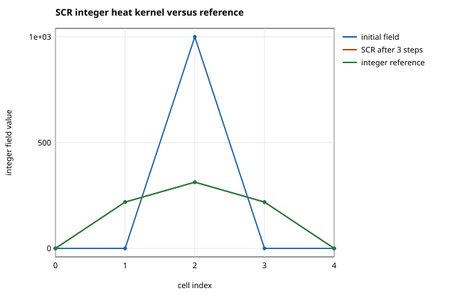

# Computational experimentalist portfolio

Each panel: the hypothesis, the headline findings with their evidence labels, every finding that is not established, the figure, and the physical validation status.

## T003 — Verify Euler, midpoint, RK4, and adaptive integrator orders.

On charts with nonzero Christoffel symbols the global endpoint error of Euler, midpoint and RK4 scales like h^1, h^2 and h^4, and the Dormand-Prince error scales like (evaluations)^-5 and like the requested tolerance, which distinguishes it from a pair advancing with y4 ((evaluations)^-4, tol^0.8).

- Explicit Euler global endpoint error converges at order 1 on every chart with nonzero Christoffel symbols: `{"cylinder-polar": 1.0067496119764763, "gaussian-bump": 1.0027342687578236, "hyperbolic-plane": 1.007283300174659, "plane-polar": 1.0071050564304065 …(+3)}` → `numerically_verified`
- Explicit midpoint global endpoint error converges at order 2 on every chart with nonzero Christoffel symbols: `{"cylinder-polar": 1.9959681817660186, "gaussian-bump": 1.9815812770314443, "hyperbolic-plane": 2.0034284091119954, "plane-polar": 2.007631064911508 …(+3)}` → `numerically_verified`
- Classical RK4 global endpoint error converges at order 4 on every chart with nonzero Christoffel symbols: `{"cylinder-polar": 4.008735600037563, "gaussian-bump": 3.888017719262526, "hyperbolic-plane": 3.965312718796343, "plane-polar": 3.9528800226496705 …(+3)}` → `numerically_verified`
- Adaptive Dormand-Prince error falls with function evaluations at a median effective order near 5: `5.29791743787106` → `numerically_verified`

*Physical validation:* `not_established`

## T005 — Verify the Jacobi separation law across positive, zero, and negative curvature.

Along a unit-speed geodesic of constant curvature K the heading Jacobi column is sn_K(s) and the lateral column cn_K(s), so separation oscillates (K > 0), grows linearly (K = 0) or exponentially (K < 0); the torus equators realize K = 1/(r(R+r)) and K = -1/(r(R-r)).

- The heading Jacobi column follows sin(sqrt(K)s)/sqrt(K), s and sinh(sqrt(-K)s)/sqrt(-K) on positive, zero and negative curvature: `{"cylinder": 2.803593496528173e-15, "hyperbolic-long": 1.2561964420119912e-09, "plane": 2.0441663628976168e-15, "sphere-great-circle": 2.6582168133337802e-09 …(+2)}` → `numerically_verified`
- The full integrated transfer matrix (lateral column and both rates) follows the model-space law cn_K, sn_K: `{"cylinder": 2.803593496528173e-15, "hyperbolic-long": 1.2561964420119912e-09, "plane": 2.0441663628976168e-15, "sphere-great-circle": 2.6582168133337802e-09 …(+2)}` → `numerically_verified`
- Neighbouring closed-form geodesics on the sphere, the plane (seen in its polar chart) and the hyperbolic plane separate as |sn_K| (heading) and |cn_K| (lateral) per unit perturbation (K = 1, 0, -1): `{"hyperbolic-long.heading.error_at_smallest_eps": 0.0004218476128911917, "hyperbolic-long.heading.order": 1.987959844703613, "hyperbolic-long.lateral.error_at_smallest_eps": 0.00041768199824695123, "hyperbolic-long.lateral.order": 1.9878670145339832 …(+8)}` → `numerically_verified`
- The torus equators are geodesics of constant curvature 1/(r(R+r)) and -1/(r(R-r)) whose Jacobi columns obey the model-space laws: `{"torus-inner-equator.curvature": -1.0, "torus-inner-equator.curvature_drift": 0.0, "torus-inner-equator.max_error": 2.6915911645163793e-09, "torus-inner-equator.theta_drift": 0.0 …(+4)}` → `numerically_verified`
- ciw joint geodesic + Jacobi transfer matrices match the pinned CSG provider on six constant-curvature paths: `{"cylinder.ciw_rk4_vs_csg_closed_form": 2.803593496528173e-15, "cylinder.ciw_rk4_vs_csg_rk4": 2.803593496528173e-15, "hyperbolic-long.ciw_rk4_vs_csg_closed_form": 1.2561964420119912e-09, "hyperbolic-long.ciw_rk4_vs_csg_rk4": 9.276187254982186e-16 …(+8)}` → `independently_verified`
- Nearby real trajectories on a physical curved surface separate according to this Jacobi law: `null` → `not_established`

*Physical validation:* `not_established`

## T010 — Generate near-focus and post-focus counterexamples.

Where the first-order separation eps j(s) vanishes (conjugate or focal points) the true separation is of higher order in eps, so the relative first-order error diverges there; past the zero the separation changes sign (image inversion) and the first-order prediction recovers as |j| grows again; symmetric configurations raise the order of the true separation.

- On the torus outer equator the separation at the conjugate point scales as eps^3, not eps^2: `{"chord_exponent": 3.0003126899802814, "grid_relative_difference": 0.00015218413314643797, "signed_exponent": 3.000108734140718, "chord_at_s_star[0]": 8.502363791585313e-08 …(+3)}` → `numerically_verified`
- On a generic torus geodesic the separation at the conjugate point is O(eps^2) while eps j vanishes: `{"chord_exponent": 2.023175167643266, "s_star": 6.051400589139297, "chord_at_s_star[0]": 3.82648454732879e-05, "chord_at_s_star[1]": 0.00015412037682610428 …(+2)}` → `numerically_verified`
- The relative first-order error diverges like 1/|s - s*| approaching the conjugate point: `{"relative_error_at_s_star_minus_h_eps_0.04": 3.7958513020004787, "slope_equator_eps_0.04": -1.0119419484943362, "slope_generic_eps_0.01": -0.991200688074655}` → `numerically_verified`
- After the conjugate point the separation inverts sign and still follows eps j: `{"equator.j_after": -1.224744871238089, "equator.j_before": 1.7320508075683134, "equator.ratio_after": 0.999927996957514, "equator.s_after": 6.801747615878317 …(+10)}` → `numerically_verified`

*Physical validation:* `not_established`

## T032 — Create a counterexample library for “shortest means safest.”

'Shortest means safest' fails on curved surfaces: a shortest geodesic can have larger heading amplification, a smaller focus margin, a tie with another route, or a near-conjugate endpoint, while the flat torus (T021) and simply connected negatively curved surfaces admit no such witness.

- Torus inner equator: the shortest route has larger heading amplification than a longer route: `{"alternative.amplification": 2.2424499641265205, "alternative.focus_margin": null, "alternative.heading": -0.6654954777289914, "alternative.length": 7.4048964512362 …(+8)}` → `independently_verified`
- Torus outer equator: the shortest route has a smaller focus margin than a longer route: `{"alternative.amplification": 29.49806945310811, "alternative.focus_margin": null, "alternative.heading": -1.3844466400297355, "alternative.length": 6.723214266466979 …(+8)}` → `independently_verified`
- Torus (0, 0) -> (2.2, 0): two mirror-image shortest routes tie, so 'the' shortest route is not unique: `{"headings[0]": -0.932959589373497, "headings[1]": 0.932959589373497, "lengths[0]": 6.30866770803647, "lengths[1]": 6.308667708036468}` → `numerically_verified`
- Gaussian bump: a longer route over the top has smaller amplification but passes a conjugate point: `{"alternative.amplification": 6.488420201199406, "alternative.focus_margin": -1.9973831828910869, "alternative.heading": 0.0, "alternative.length": 5.8779306681414605 …(+8)}` → `independently_verified`
- A route from this library is safe (or unsafe) to execute on a physical part or vehicle: `null` → `not_established`

*Physical validation:* `not_established`

## T047 — Validate the cylinder chord coefficient analytically and numerically.

On a cylinder of radius R, the geodesic at angle alpha from the circumferential direction has chord deficit s - c = cos^4(alpha) s^3/(24 R^2) + O(s^5): largest circumferentially, zero on rulings, although the Gaussian curvature is zero everywhere.

- The exact helix chord expands as s - cos^4(alpha) s^3/(24 R^2) + (kappa^4/1920 + kappa^2 tau^2/720) s^5 with kappa = cos^2(alpha)/R, tau = sin(alpha)cos(alpha)/R: `{"c3": "-cos(alpha)^4/(24 R^2)", "c5": "cos(alpha)^6 (3 + 5 sin(alpha)^2)/(5760 R^4)"}` → `independently_verified`
- Small-s fits of exact helix chords recover cos^4(alpha)/(24 R^2) at every angle and radius: `{"max_normalized_error": 6.670184404811154e-12, "fitted_R1[0]": 0.04166666666657247, "fitted_R1[1]": 0.036271362578582295, "fitted_R1[2]": 0.02343749999992194 …(+4)}` → `numerically_verified`
- Geodesics integrated on ciw.lab.surfaces.Cylinder reproduce the exact helix chord and coefficient: `{"max_normalized_fit_error": 1.878239856978326e-09, "max_relative_chord_error": 6.0021432268797525e-15}` → `numerically_verified`
- Axial rulings (alpha = 90 deg) have zero chord correction; circumferential paths have the largest coefficient 1/(24 R^2): `{"circumferential_coefficient_R1": 0.04166666666657247, "ruling_max_abs_deficit_over_R": 2.7755575615628914e-16}` → `numerically_verified`
- Chords measured between physical markers on a cylindrical part follow the cos^4(alpha)/(24 R^2) coefficient: `null` → `not_established`

*Physical validation:* `not_established`

## T062 — Test independent-noise and correlated-noise cases.

NEES/NIS consistency holds for a filter whose R matches the truth, whether the sensor noises are correlated or independent, and fails in either direction of mismatch: dropping a real cross-covariance makes the filter overconfident while its mean NIS still passes, and assuming an absent one makes it underconfident while its NIS fails; the size of each failure follows from an exact moment recursion.

- With the correct cross-correlated measurement covariance, run-averaged NEES and NIS lie inside their per-tick 99% chi-square intervals at 90% or more of ticks and the whitened innovations have identity covariance: `{"whitened_max_z": 1.4486690572953456, "z_critical": 3.89059188641312, "nees.fraction_above": 0.02, "nees.fraction_below": 0.0 …(+14)}` → `numerically_verified`
- With independent camera and tracker noise (no common mode) and the matching block-diagonal covariance, run-averaged NEES and NIS lie inside their per-tick 99% chi-square intervals at 90% or more of ticks and the whitened innovations have identity covariance: `{"whitened_max_z": 1.6324562171029051, "z_critical": 3.89059188641312, "nees.fraction_above": 0.0, "nees.fraction_below": 0.02 …(+14)}` → `numerically_verified`
- Ignoring the camera-tracker cross-correlation makes the filter overconfident: run-averaged NEES exceeds the 99% upper bound at nearly every tick: `{"predicted_mean_nees": 5.4350781551546445, "nees.fraction_above": 1.0, "nees.fraction_below": 0.0, "nees.fraction_inside": 0.0 …(+5)}` → `numerically_verified`
- The ignored-correlation filter still passes the mean-NIS test (grand mean near 4); among innovation-based tests, which need no ground truth, only the whitened-innovation covariance test exposes the missing cross-correlation: `{"whitened_max_z": 84.66993711053826, "z_critical": 3.89059188641312, "nis.fraction_above": 0.01, "nis.fraction_below": 0.03 …(+6)}` → `numerically_verified`
- Real camera and tracker noises share the common-mode covariance assumed here, or are independent: `"not established: the cross-correlation is a declared …"` → `not_established`

*Physical validation:* `not_established`

## T066 — Verify that filtered residuals use filter covariance, not raw sensor covariance.

Filter residuals must be normalized by the filter's own covariance: S for innovations and R - H P+ H^T for post-fit residuals (the two normalized statistics coincide). The raw sensor covariance R over-states the first and under-states the second by predictable amounts.

- Innovations normalized by S = H P- H^T + R are chi-square(2) consistent: run-averaged NIS lies inside its per-tick 99% interval at 90% or more of ticks and the grand mean matches 2: `{"fraction_above": 0.01, "fraction_below": 0.01, "fraction_inside": 0.98, "grand_mean": 1.9980863694095867 …(+2)}` → `numerically_verified`
- Post-fit residuals z - H x+ have covariance R - H P+ H^T = R S^-1 R, and normalizing them by it reproduces the innovation NIS exactly, so the post-fit test carries no information beyond the innovation test: `{"identity_error": 1.0408340855860843e-17, "max_relative_difference_from_innovation_nis": 3.930189507173054e-14}` → `numerically_verified`
- Normalizing innovations by the raw sensor covariance R inflates NIS to tr(R^-1 S) and fails the chi-square test at nearly every tick: `{"fraction_above": 1.0, "fraction_below": 0.0, "fraction_inside": 0.0, "grand_mean": 3.3625270796684887 …(+2)}` → `numerically_verified`
- Normalizing post-fit residuals by the raw R deflates them to tr(S^-1 R) < 2, which would hide an inconsistent filter: `{"fraction_above": 0.0, "fraction_below": 1.0, "fraction_inside": 0.0, "grand_mean": 1.2273555630758988 …(+2)}` → `numerically_verified`
- A real residual monitor normalized by datasheet sensor covariance is correctly calibrated: `"not established: synthetic Gaussian bench only"` → `not_established`

*Physical validation:* `not_established`

## T084 — Mutate replay receipt source digest.

Predicted kills: a source digest edited without resealing (stale replay_id); resealed to a forged digest (the energy workflow rebuilds the receipt verification with subject = source and refuses the stale subject); re-pointed together with its subject at a digest that is not retained, at the replay itself, or at a bundle of another source log (workbench._validate_links requires a retained source bundle of the same kind, source_id and upstream). Predicted survivor: receipt-source.sibling-execution, because a sibling execution of the same source bytes satisfies every one of those checks and every digest is unkeyed.

- Replay receipt source digest forgeries that leave a digest stale or contradict a recomputed, fixed or cross-referenced value are refused with the pinned message: `{"[0].kind": "workspace", "[0].mutant": "receipt-source.naive", "[0].observed": "Invalid retained energy replay receipt", "[0].recompute": "none" …(+16)}` → `numerically_verified`
- Surviving mutant receipt-source.sibling-execution: a receipt re-pointed, with its verification subject, at a sibling execution of the same bytes reopens: `{"mutant": "receipt-source.sibling-execution", "observed": "accepted"}` → `numerically_verified`
- Retained workspace records are authenticated: a holder without a secret cannot produce a forged record that reopens: `{"surviving_mutants_in_this_task[0]": "receipt-source.sibling-execution"}` → `not_established`

*Physical validation:* `not_established`

## T121 — Detect whether GPU reductions alter numerical conclusions.

GPU-style reduction orders keep float32 sums within their order-specific a priori bounds, yet the order differences suffice to flip sign and pass/fail decisions near their boundary; float64 suffers the same with data scaled to its precision.

- Every emulated float32 summation order of the positive dataset stays within its order-specific a priori error bound; relative spread across orders: `{"relative_spread": 4.022247476013461e-06, "worst_fraction_of_order_bound": 0.12485540998144516, "worst_order": "kahan"}` → `numerically_verified`
- Every emulated float64 summation order of the same data stays within its order-specific bound; relative spread: `{"relative_spread": 6.81092704563903e-16, "worst_fraction_of_order_bound": 0.043202378175756805, "worst_order": "atomic-7"}` → `numerically_verified`
- Reduction order alone flips the sign of a float32 sum whose exact value is +0.25 (the one-thread sequential CPU fold against the GPU-style orders): `{"atomic-0": 1, "atomic-1": 1, "atomic-2": 1, "atomic-3": 1 …(+10)}` → `numerically_verified`
- float64 accumulation of these float32-valued cancellation inputs is exact in every emulated order (all errors 0), hence sign-correct: `{"exact_zero_errors": 14, "max_abs_error": 0.0}` → `numerically_verified`
- Reductions on the RTX 2080 (CUB, cuBLAS or atomicAdd) reproduce these emulated spreads and sign flips: `null` → `not_established`

*Physical validation:* `not_established`

## T137 — Rank paths by focus margin.

The focus margin (distance to the nearest focal or conjugate point relative to route length) ranks routes differently from length: the straight route over the dome is the shortest candidate route to the far edge yet has a focal point inside it.

- Candidate coupon routes ranked by focus margin (nearest focal or conjugate point / route length): `{"lower_bound.fan+0deg": false, "lower_bound.fan+10deg": false, "lower_bound.fan+15deg": true, "lower_bound.fan+20deg": true …(+17)}` → `numerically_verified`
- The shortest candidate route has the worst focus margin: `{"length_mm": 202.1796844767861, "margin": 0.7587664197692487, "shortest": "fan+0deg"}` → `numerically_verified`
- The second variation of route length equals the Jacobi index form j_head(L) j_head'(L): `{"finite_difference_mm": 36.96327031529435, "index_form_mm": 36.963864221406915}` → `numerically_verified`
- The calibration-tolerance ranking and the focus-margin ranking put the straight route at opposite ends: `{"calibration_first": "fan+0deg", "focus_last": "fan+0deg"}` → `numerically_verified`
- Physical paths near a predicted focus show the predicted loss of lateral-error ordering: `null` → `not_established`

*Physical validation:* `not_established`

## T020 — Classify geodesics by winding vector.

Closed geodesics of a flat torus are exactly the straight lines in nonzero lattice directions: primitive (m, n) gives a closed geodesic traversed once with length |m w1 + n w2|, (k m', k n') its k-fold cover, and irrational directions never close although their return gaps shrink.

- Every winding with |m|, |n| <= 6 first returns to its start at t = 1/gcd, displaced by its primitive vector after (|m| + |n|)/gcd edge crossings, and returns gcd times by t = 1 (a gcd-fold cover of the primitive loop): `{"classes": 168, "failures": 0}` → `numerically_verified`
- For all 120 pairs of the 16 primitive classes with 0 <= m <= 3, |n| <= 3 the transverse intersections number |det(v, w)|: `{"failures": 0, "pairs": 120}` → `numerically_verified`
- The lattice-point count within radius R (including the origin, and its primitive part) equals a brute-force count over a box proven to contain the disk: `{"lattice_points_with_origin": 229, "primitive": 142, "radius": 20}` → `numerically_verified`
- The golden-slope geodesic has positive return gaps phi^-k at Fibonacci returns, with q * gap -> 1/sqrt 5: `{"gap[0]": 0.3819660112501051, "gap[1]": 0.2360679774997898, "gap[2]": 0.1458980337503153, "gap[3]": 0.09016994374947451 …(+38)}` → `independently_verified`
- A binary64 heading slope is rational, so a float simulation cannot represent a non-closing direction: `{"log2_denominator": 49, "slope_denominator": 562949953421312}` → `analytic`

*Physical validation:* `not_established`

## T097 — Add exact SET/SCR/PPDA integration tests when checkouts are available.

The pinned SCR provider, driven through CIW's shared numerical-heat workflow, returns the declared integer heat field, replays with the same numerical identity, and its reopened workspace refuses replay unbound.

- SCR executed through CIW's shared numerical-heat workflow and through its own Python API returns the declared integer heat fields: `{"api_cases[0][0]": 0, "api_cases[0][1]": 219, "api_cases[0][2]": 313, "api_cases[0][3]": 219 …(+17)}` → `provider_backed`
- SCR heat outputs from the workbench and from SCR's Python API equal an independent integer reference: `{"cases": 5, "mismatched_cells": 0}` → `independently_verified`
- SCR replay reproduces the numerical identity with fresh execution occurrences and a non-independent verification: `{"numerical_identity_equal": true, "runs": 1, "verification_independent": false, "fresh_occurrences_per_run[0]": 4}` → `numerically_verified`
- The reopened SCR workspace carries no binding and refuses replay: `{"replay": "operation_unavailable: No trusted repositories bound for …", "available[0]": "ciw.energy-accuracy.v1", "bindings": []}` → `numerically_verified`
- The integer heat field describes physical heat diffusion in a material: `"not established: dimensionless integer arithmetic"` → `not_established`

*Physical validation:* `not_established`

